# 建立無障礙網頁

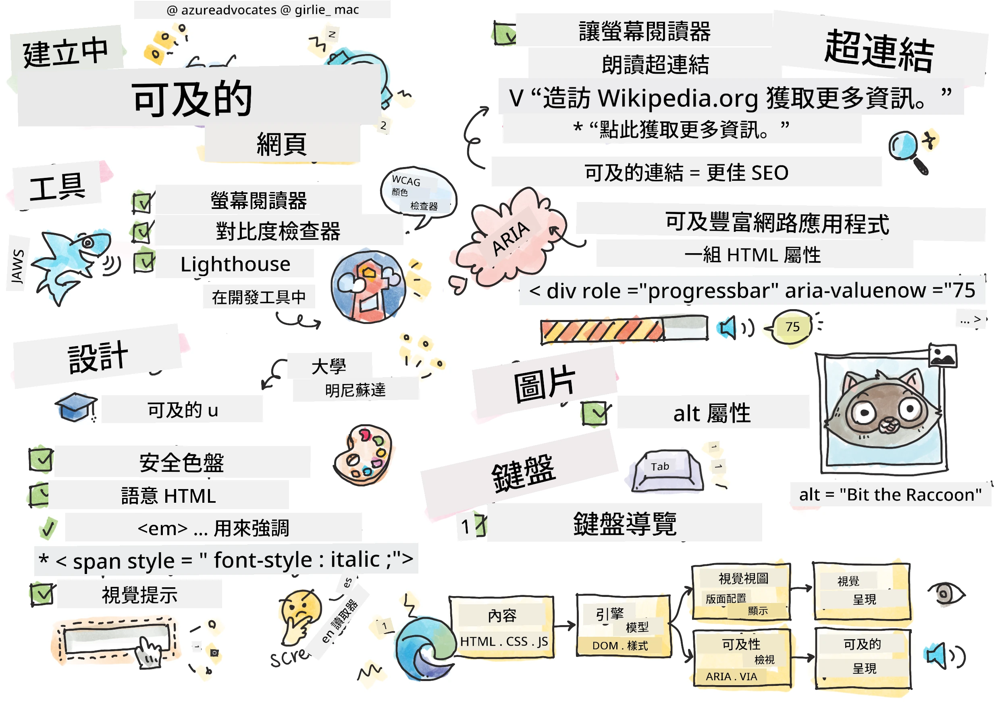
> 手繪筆記由 [Tomomi Imura](https://twitter.com/girlie_mac) 製作

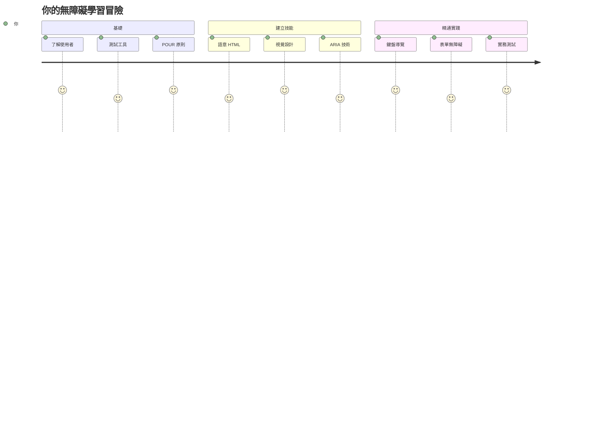
## 課前測驗
[課前測驗](https://ff-quizzes.netlify.app/web/)

> 網路的力量在於其普遍性。無論有無障礙，每個人都能使用是關鍵。
>
> \- Sir Timothy Berners-Lee，W3C 主任暨萬維網發明者

這裡有件事可能會讓你吃驚：當你建立無障礙網站時，你不只是幫助有障礙的人——事實上你是在讓網路變得更好，對所有人都有益！

你有沒有注意過路口的人行道斜坡？它最初是為輪椅設計的，但現在也幫助推嬰兒車的人、運送員推貨車、旅行者拉行李箱，以及騎腳踏車的人。這正是無障礙網頁設計的運作方式──幫助某一群體的解決方案，往往最終惠及所有人。很酷，對吧？

在本課中，我們將探索如何創建真正適合所有人使用的網站，不論他們怎麼瀏覽網路。你將發現已納入網頁標準中的實用技巧，學習使用測試工具實際操作，並看到無障礙如何改善所有使用者的網站可用性。

到本課結束時，你將有信心將無障礙自然地融入你的開發流程。準備好探索如何透過有心的設計選擇，讓數十億人都能使用網路嗎？讓我們開始吧！

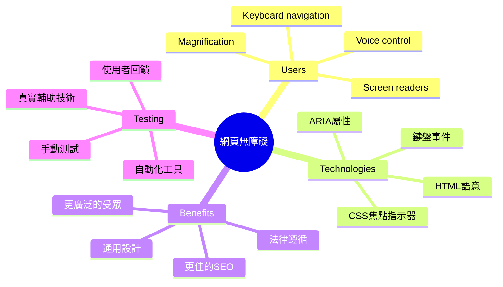
> 你可以在 [Microsoft Learn](https://docs.microsoft.com/learn/modules/web-development-101/accessibility/?WT.mc_id=academic-77807-sagibbon) 上學習這堂課！

## 了解輔助技術

在開始編碼前，讓我們先花點時間了解不同能力的人是如何瀏覽網路的。這不只是理論──了解這些真實的瀏覽模式會讓你成為更好的開發者！

輔助技術是非常厲害的工具，幫助有障礙的人以你可能意想不到的方式與網站互動。一旦你懂得這些技術的運作，建立無障礙網頁就會變得更直覺。就像學會用別人的視角看你的程式碼。

### 螢幕閱讀器

[螢幕閱讀器](https://en.wikipedia.org/wiki/Screen_reader) 是相當先進的技術，能將數位文字轉換成語音或點字輸出。雖然主要用於視障人士，但對有學習障礙如失讀症的使用者也非常有幫助。

我喜歡把螢幕閱讀器想像成一本有智慧的旁白幫你朗讀書籍。它會依照邏輯順序朗讀內容，宣告可互動元素如「按鈕」或「連結」，並提供鍵盤快捷鍵在頁面中跳轉。但關鍵是──螢幕閱讀器只有在我們用適當結構和有意義的內容建網站時，才能發揮魔力。這就是你作為開發者的角色！

**各平台常見螢幕閱讀器：**
- **Windows**： [NVDA](https://www.nvaccess.org/about-nvda/)（免費且最流行）、[JAWS](https://webaim.org/articles/jaws/)、[Narrator](https://support.microsoft.com/windows/complete-guide-to-narrator-e4397a0d-ef4f-b386-d8ae-c172f109bdb1/?WT.mc_id=academic-77807-sagibbon)（內建）
- **macOS/iOS**：[VoiceOver](https://support.apple.com/guide/voiceover/welcome/10)（內建且功能強大）
- **Android**：[TalkBack](https://support.google.com/accessibility/android/answer/6283677)（內建）
- **Linux**：[Orca](https://wiki.gnome.org/Projects/Orca)（免費開源）

**螢幕閱讀器如何瀏覽網頁內容：**

螢幕閱讀器提供多種瀏覽方法，讓經驗豐富的使用者更有效率：
- **順序閱讀**：從上到下朗讀內容，像讀書一樣
- **地標導航**：在頁面區塊間跳轉（標頭、導航、主內容、頁尾）
- **標題導覽**：在標題間跳轉，理解頁面結構
- **連結清單**：產生所有連結列表以快速存取
- **表單控制**：直接跳轉到輸入欄位和按鈕

> 💡 **這件事讓我大開眼界**：有68%的螢幕閱讀器使用者主要靠標題瀏覽頁面（[WebAIM 調查](https://webaim.org/projects/screenreadersurvey9/#finding)）。你的標題結構就像使用者的地圖──把它做好，真的幫助人快速找到內容！

### 建立你的測試流程

好消息是──有效的無障礙測試並不困難！你需要結合自動化工具（非常擅長抓明顯問題）和實際操作測試。以下是我發現最有效且不耗費太多時間的系統方法：

**必要的手動測試流程：**

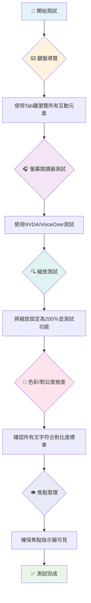
**逐步測試清單：**
1. **鍵盤導覽**：只用 Tab、Shift+Tab、Enter、空白鍵和方向鍵
2. **螢幕閱讀器測試**：啟用 NVDA、VoiceOver 或 Narrator，眼睛閉著操作
3. **放大測試**：檢測 200% 和 400% 放大比例
4. **色彩對比檢查**：確認所有文字及介面元件
5. **焦點指示測試**：確保所有互動元素有明顯焦點狀態

✅ **從 Lighthouse 開始**：開啟瀏覽器的開發者工具，執行 Lighthouse 無障礙審核，然後根據結果調整手動測試重點。

### 縮放與放大工具

你知道有時候手機文字太小你就會用兩指捏合放大嗎，或在戶外亮光下盯著筆電螢幕看？很多用戶每天都依賴放大工具讓內容變得可讀。這包括低視力者、長者，以及任何曾在戶外看網站的人。

現代縮放技術不只是放大文字。了解這些工具的運作方式會幫你創造在任意放大比例下都保持功能性與美觀的響應式設計。

**現代瀏覽器的縮放功能：**
- **頁面縮放**：所有內容比例放大（文字、圖片、版面）──首選方式
- **僅文字縮放**：放大字體大小，維持原有版面
- **捏合縮放**：行動裝置暫時放大手勢支援
- **瀏覽器支援**：所有現代瀏覽器支援最高 500% 縮放且不破壞功能

**專用放大軟體：**
- **Windows**：[放大鏡](https://support.microsoft.com/windows/use-magnifier-to-make-things-on-the-screen-easier-to-see-414948ba-8b1c-d3bd-8615-0e5e32204198)（內建）、[ZoomText](https://www.freedomscientific.com/training/zoomtext/getting-started/)
- **macOS/iOS**：[Zoom](https://www.apple.com/accessibility/mac/vision/)（內建且功能先進）

> ⚠️ **設計考量**：WCAG 規範要求內容在 200% 縮放時仍需保持可用。此比例應盡量避免水平滾動，所有互動元素也須可操作。

✅ **測試你的響應式設計**：將瀏覽器縮放至 200% 和 400%。你的版面是否能順暢調整？所有功能能否不需過多滾動就能使用？

## 現代無障礙測試工具

既然你已了解使用輔助技術瀏覽網頁的方式，接下來探索幫助你建置及測試無障礙網站的工具。

想像一下：自動化工具擅長抓明顯錯誤（如遺漏替代文字），而手動測試則幫助你確保網站在真實環境中使用感受良好。兩者結合才能讓你確信網站對所有人都友好。

### 色彩對比測試

好消息是：色彩對比是最常見的無障礙問題之一，但同時也是最容易修正的。良好的對比對所有人都好──無論是視障者或是在海灘上看手機的人。

**WCAG 對比要求：**

| 文字類型 | WCAG AA（最低） | WCAG AAA（加強） |
|----------|-----------------|-------------------|
| **一般文字**（小於 18pt） | 4.5:1 對比比率 | 7:1 對比比率 |
| **大字**（18pt 以上或 14pt 加粗） | 3:1 對比比率 | 4.5:1 對比比率 |
| **介面元件**（按鈕、表單邊框） | 3:1 對比比率 | 3:1 對比比率 |

**必備測試工具：**
- [Colour Contrast Analyser](https://www.tpgi.com/color-contrast-checker/) - 桌面軟體含色彩取樣器
- [WebAIM Contrast Checker](https://webaim.org/resources/contrastchecker/) - 網頁版即時反饋
- [Stark](https://www.getstark.co/) - Figma、Sketch、Adobe XD 設計外掛
- [Accessible Colors](https://accessible-colors.com/) - 尋找無障礙色彩調色盤

✅ **建立更佳色彩調色盤**：從品牌色開始，利用對比檢測工具創造無障礙的色彩變體。將其記錄為你的設計系統可用的無障礙色彩 Token。

### 全面無障礙稽核

最有效的無障礙測試結合多種方法。沒一個工具能抓出所有問題，建立包含多種方法的測試流程才能全面。

**瀏覽器內建測試（開發者工具）：**
- **Chrome/Edge**：Lighthouse 無障礙檢測 + 無障礙面板
- **Firefox**：無障礙檢查器與詳細樹狀圖
- **Safari**：Web 檢查器的稽核分頁搭配 VoiceOver 模擬

**專業測試擴充套件：**
- [axe DevTools](https://www.deque.com/axe/devtools/) - 業界標準自動化測試
- [WAVE](https://wave.webaim.org/extension/) - 錯誤視覺反饋高亮
- [Accessibility Insights](https://accessibilityinsights.io/) - 微軟完整測試套件

**命令列及 CI/CD 整合：**
- [axe-core](https://github.com/dequelabs/axe-core) - JavaScript 自動化測試庫
- [Pa11y](https://pa11y.org/) - 命令列無障礙測試工具
- [Lighthouse CI](https://github.com/GoogleChrome/lighthouse-ci) - 自動化無障礙評分

> 🎯 **測試目標**：以 Lighthouse 得分 95+ 作為基準。記住，自動化測試只能找到約 30-40% 的無障礙問題──手動測試依然非常重要！

### 🧠 **測試技能檢視：準備找出問題了嗎？**

**讓我們看看你對無障礙測試的感覺：**
- 哪種測試方法你現在覺得最容易上手？
- 你能想像用純鍵盤操作一整天嗎？
- 你個人在網路上遇過的無障礙障礙是什麼？

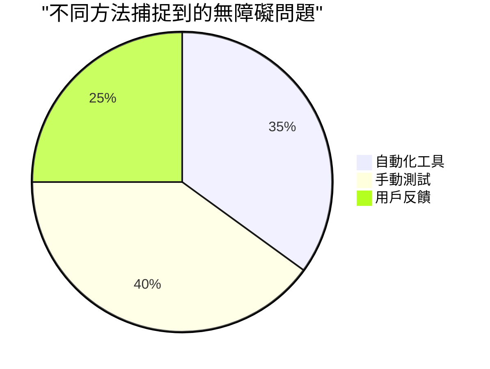
> **自信提升**：專業無障礙測試人員正是使用這樣的組合方法。你在學習業界公認的慣例！

## 從零開始打造無障礙

無障礙成功的關鍵是從一開始就把它建築在基礎上。我知道你可能會想「晚點再加無障礙」，但這就像房子蓋好後再想加斜坡一樣。可能嗎？可以。但簡單嗎？不容易。

把無障礙想像成蓋房子──比起事後改建，從設計圖開始就規劃輪椅可達性會輕鬆好多。

### POUR 原則：你的無障礙基礎

網頁內容無障礙指南（WCAG）圍繞四個基本原則，英文簡寫 POUR。別擔心──這不是生硬的學術概念，而是讓內容適合所有人的實用準則。

當你習慣 POUR 後，做無障礙決策會更直覺。它就像心中的檢查清單，指引你的設計抉擇。來看細節：

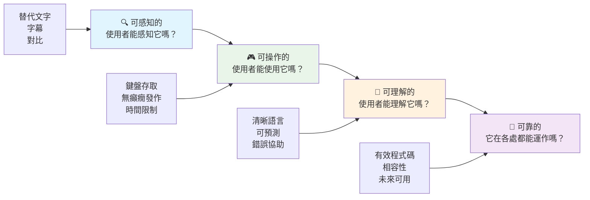
**🔍 可感知（Perceivable）**：資訊必須以使用者可感知的方式呈現

- 為非文字內容（圖片、影片、音訊）提供替代文字
- 確保所有文字及介面元件具足夠色彩對比
- 為多媒體提供字幕及文字稿
- 設計內容在縮放至 200% 時仍能正常使用
- 用多重感官特性（不只是顏色）來傳達資訊

**🎮 可操作（Operable）**：所有介面元件必須能透過可用的輸入方式操作

- 所有功能須可用鍵盤導覽操作
- 提供使用者足夠時間閱讀與互動內容
- 避免造成癲癇發作或前庭系統疾病的內容
- 以清晰的結構與地標協助使用者高效率導航
- 確保互動元素有足夠的點擊區域（最少44px）

**📖 可理解（Understandable）**：資訊及介面操作必須清晰易懂

- 使用清晰、簡單且適合目標受眾的語言
- 確保內容出現與操作方式均可預期且一致
- 為使用者輸入提供清楚說明和錯誤訊息
- 幫助使用者理解並修正表單錯誤
- 以合理閱讀順序與資訊層次組織內容

**💪 可靠（Robust）**：內容必須在不同技術與輔助設備下可靠運作

- **以有效且語意正確的 HTML 作為基礎**
- **確保與現有及未來輔助技術相容**
- **遵守網路標準及標記最佳實踐**
- **在不同瀏覽器、裝置和輔助工具上測試**
- **結構化內容，使其在不支援進階功能時也能優雅降級**

### 🎯 **POUR 原則檢查：讓它深入人心**

**快速反思基礎概念：**
- 你能想到哪個網站功能違反了每個 POUR 原則嗎？
- 對你這個開發者來說，哪個原則最自然？
- 這些原則如何改善所有人的設計，而不僅僅是對殘障使用者？

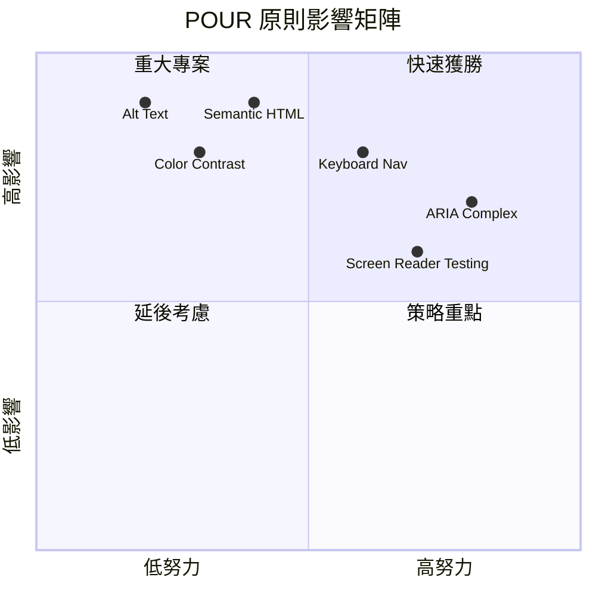
> **記住**：從高影響、低成本的改進開始。語意 HTML 和 alt 文字能以最低成本帶來最大無障礙提升！

## 創造無障礙的視覺設計

良好的視覺設計與無障礙密不可分。當你以無障礙為設計目標時，通常會發現這些限制促使你設計出更簡潔、優雅的解決方案，造福所有使用者。

讓我們深入探討如何創造對所有人都適用、視覺吸引的設計，不論他們的視覺能力如何或在什麼環境下瀏覽你的內容。

### 顏色與視覺無障礙策略

顏色是強大的溝通工具，但絕不該是傳遞重要資訊的唯一方式。跨越顏色限制的設計能創造更堅韌且包容的體驗，在更多情況下有效。

**為色覺差異設計：**

約有 8% 男性與 0.5% 女性有某種色覺差異（常稱為「色盲」）。最常見的類型有：
- **綠色盲（Deuteranopia）**：難區分紅與綠
- **紅色盲（Protanopia）**：紅色顯得較暗
- **藍色盲（Tritanopia）**：難區分藍與黃（罕見）

**包容性色彩策略：**

```css
/* ❌ Bad: Using only color to indicate status */
.error { color: red; }
.success { color: green; }

/* ✅ Good: Color plus icons and context */
.error {
  color: #d32f2f;
  border-left: 4px solid #d32f2f;
}
.error::before {
  content: "⚠️";
  margin-right: 8px;
}

.success {
  color: #2e7d32;
  border-left: 4px solid #2e7d32;
}
.success::before {
  content: "✅";
  margin-right: 8px;
}
```

**超越基本對比要求：**
- 使用色盲模擬器測試你的色彩選擇
- 搭配使用圖案、紋理或形狀來強化顏色標示
- 確保互動狀態在無色彩下依然可辨
- 考慮你的設計在高對比模式下的呈現

✅ **測試你的色彩無障礙性**：使用 [Coblis](https://www.color-blindness.com/coblis-color-blindness-simulator/) 等工具查看你的網站對不同色覺類型使用者的呈現。

### 焦點指示與互動設計

焦點指示就像數位游標，告訴鍵盤使用者目前所在頁面位置。良好設計的焦點指示提升所有人的體驗，使互動清晰且可預測。

**現代焦點指示最佳實踐：**

```css
/* Enhanced focus styles that work across browsers */
button:focus-visible {
  outline: 2px solid #0066cc;
  outline-offset: 2px;
  box-shadow: 0 0 0 4px rgba(0, 102, 204, 0.25);
}

/* Remove focus outline for mouse users, preserve for keyboard users */
button:focus:not(:focus-visible) {
  outline: none;
}

/* Focus-within for complex components */
.card:focus-within {
  box-shadow: 0 0 0 3px rgba(74, 144, 164, 0.5);
  border-color: #4A90A4;
}

/* Ensure focus indicators meet contrast requirements */
.custom-focus:focus-visible {
  outline: 3px solid #ffffff;
  outline-offset: 2px;
  box-shadow: 0 0 0 6px #000000;
}
```

**焦點指示要求：**
- **可見性**：與周圍元素對比至少 3:1
- **寬度**：元素周圍至少 2px 厚
- **持續性**：應持續顯示直到焦點移開
- **明顯不同**：與其他 UI 狀態在視覺上有區別

> 💡 **設計提示**：優秀的焦點指示通常結合外框、陰影和色彩變化，確保在不同背景和環境下可見。

✅ **檢查焦點指示**：用 Tab 鍵瀏覽網站，找出焦點指示是否清晰，是否有看不清或完全沒有的元件？

### 語意 HTML：無障礙的基礎

語意 HTML 就像給輔助技術網站的衛星導航系統。當你為元素正確使用特定 HTML 標籤，等於給螢幕閱讀器、鍵盤及其他工具提供詳細導航地圖，幫助使用者有效瀏覽。

我喜歡用這個比喻：語意 HTML 就像有明確分類且標示清楚的圖書館，相較於書籍亂放的倉庫。兩邊都有書，但你肯定比較想在圖書館裡找書，對吧？

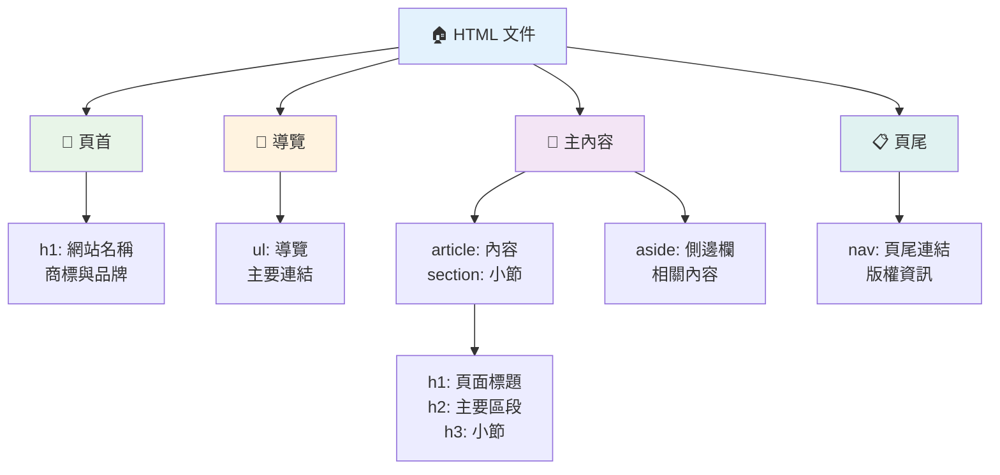
**無障礙頁面結構基石：**

```html
<!-- Landmark elements provide page navigation structure -->
<header>
  <h1>Your Site Name</h1>
  <nav aria-label="Main navigation">
    <ul>
      <li><a href="/home">Home</a></li>
      <li><a href="/about">About</a></li>
      <li><a href="/services">Services</a></li>
    </ul>
  </nav>
</header>

<main>
  <article>
    <header>
      <h1>Article Title</h1>
      <p>Published on <time datetime="2024-10-14">October 14, 2024</time></p>
    </header>
    
    <section>
      <h2>First Section</h2>
      <p>Content that relates to this section...</p>
    </section>
    
    <section>
      <h2>Second Section</h2>
      <p>More related content...</p>
    </section>
  </article>
  
  <aside>
    <h2>Related Links</h2>
    <nav aria-label="Related articles">
      <ul>
        <li><a href="/related-1">First related article</a></li>
        <li><a href="/related-2">Second related article</a></li>
      </ul>
    </nav>
  </aside>
</main>

<footer>
  <p>&copy; 2024 Your Site Name. All rights reserved.</p>
  <nav aria-label="Footer links">
    <ul>
      <li><a href="/privacy">Privacy Policy</a></li>
      <li><a href="/contact">Contact Us</a></li>
    </ul>
  </nav>
</footer>
```

**語意 HTML 如何改變無障礙：**

| 語意元素 | 目的 | 螢幕閱讀器優勢 |
|------------------|---------|----------------------|
| `<header>` | 頁面或區段標頭 | 「橫幅地標」- 快速導航至頂部 |
| `<nav>` | 導航連結 | 「導航地標」- 導航區塊清單 |
| `<main>` | 主要頁面內容 | 「主要地標」- 直接跳至內容 |
| `<article>` | 自含內容 | 宣告文章範圍 |
| `<section>` | 主題內容群組 | 提供內容結構 |
| `<aside>` | 相關側邊欄內容 | 「輔助地標」 |
| `<footer>` | 頁面或區段頁尾 | 「內容資訊地標」 |

**語意 HTML 的螢幕閱讀器超能力：**
- **地標導航**：可立即跳轉頁面主要區塊
- **標題大綱**：根據標題結構產生目錄
- **元素清單**：建立所有連結、按鈕或表單控件清單
- **內容關聯性**：理解內容區段間的連結關係

> 🎯 **快速測試**：用螢幕閱讀器利用地標捷徑 (NVDA/JAWS：D 為地標，H 為標題，K 為連結) 瀏覽你的網站，導航是否合理？

### 🏗️ **語意 HTML 大師檢查：建立堅固基礎**

**來評估你對語意的理解：**
- 你能否僅從 HTML 判斷頁面地標？
- 你會如何向朋友解釋 `<section>` 與 `<div>` 的區別？
- 若螢幕閱讀器用戶回報導航問題，你會先檢查什麼？

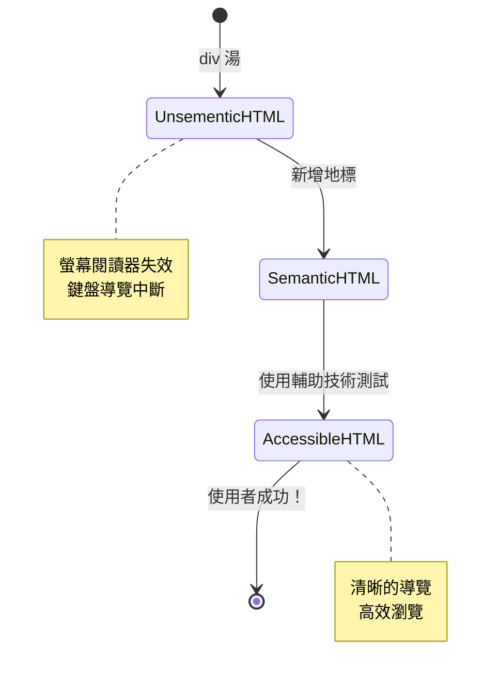
> **專業見解**：良好語意 HTML 自動解決約 70% 無障礙問題。精通這個基礎，你就離成功不遠了！

✅ **檢查你的語意結構**：用瀏覽器開發者工具的無障礙面板查看無障礙樹狀結構，確保標記建立合理架構。

### 標題階層：建立邏輯內容大綱

標題對無障礙內容至關重要，它們就像支撐內容的脊椎。螢幕閱讀器使用者仰賴標題理解與導航內容。把它當作頁面目錄即可。

**標題黃金法則：**
絕不跳級。標題階層必須邏輯漸進，如 `<h1>`→`<h2>`→`<h3>`。像以前學校做大綱一樣，絕不會跳過中間的層級。

**理想標題結構範例：**

```html
<!-- ✅ Excellent: Logical, hierarchical progression -->
<main>
  <h1>Complete Guide to Web Accessibility</h1>
  
  <section>
    <h2>Understanding Screen Readers</h2>
    <p>Introduction to screen reader technology...</p>
    
    <h3>Popular Screen Reader Software</h3>
    <p>NVDA, JAWS, and VoiceOver comparison...</p>
    
    <h3>Testing with Screen Readers</h3>
    <p>Step-by-step testing instructions...</p>
  </section>
  
  <section>
    <h2>Color and Contrast Guidelines</h2>
    <p>Designing with sufficient contrast...</p>
    
    <h3>WCAG Contrast Requirements</h3>
    <p>Understanding the different contrast levels...</p>
    
    <h3>Testing Tools and Techniques</h3>
    <p>Tools for verifying contrast ratios...</p>
  </section>
</main>
```

```html
<!-- ❌ Problematic: Skipping levels, inconsistent structure -->
<h1>Page Title</h1>
<h3>Subsection</h3> <!-- Skipped h2 -->
<h2>This should come before h3</h2>
<h1>Another main heading?</h1> <!-- Multiple h1s -->
```

**標題最佳實踐：**
- **每頁一個 `<h1>`**：通常是主頁標題或主要內容標題
- **階層邏輯**：切勿跳級（h1 → h2 → h3，不是 h1 → h3）
- **描述明確**：使標題即使脫離上下文也具意義
- **用 CSS 控制視覺**：用 CSS 形塑外觀，HTML 標籤用於結構

**螢幕閱讀器使用統計：**
- 68% 螢幕閱讀器使用者會以標題導航（[WebAIM 調查](https://webaim.org/projects/screenreadersurvey9/#finding)）
- 使用者期待有邏輯的標題大綱
- 標題是最快理解頁面結構的方式

> 💡 **專業提示**：用瀏覽器擴充工具「HeadingsMap」視覺化你的標題結構，它應該像個有條理的目錄。

✅ **測試你的標題結構**：用螢幕閱讀器標題導航鍵（NVDA 內的 H 鍵）跳過標題。階層是否合邏輯，在說明你的內容？

### 進階視覺無障礙技術

除了對比與色彩基本法則外，還有高級技術幫助創建真正包容的視覺體驗。這些方法確保你的內容在不同瀏覽條件與輔助技術下有效。

**重要視覺溝通策略：**

- **多模式回饋**：結合視覺、文字，有時加上聲音提示
- **漸進揭露**：分段呈現資訊，易於消化
- **一致互動模式**：運用熟悉 UI 慣例
- **響應式排版**：依裝置適當縮放文字
- **載入與錯誤狀態**：提供清晰反饋給所有使用者行為

**強化無障礙的 CSS 工具：**

```css
/* Screen reader only text - visually hidden but accessible */
.sr-only {
  position: absolute;
  width: 1px;
  height: 1px;
  padding: 0;
  margin: -1px;
  overflow: hidden;
  clip: rect(0, 0, 0, 0);
  white-space: nowrap;
  border: 0;
}

/* Skip link for keyboard navigation */
.skip-link {
  position: absolute;
  top: -40px;
  left: 6px;
  background: #000000;
  color: #ffffff;
  padding: 8px 16px;
  text-decoration: none;
  border-radius: 4px;
  font-weight: bold;
  transition: top 0.3s ease;
  z-index: 1000;
}

.skip-link:focus {
  top: 6px;
}

/* Reduced motion respect */
@media (prefers-reduced-motion: reduce) {
  .skip-link {
    transition: none;
  }
  
  * {
    animation-duration: 0.01ms !important;
    animation-iteration-count: 1 !important;
    transition-duration: 0.01ms !important;
  }
}

/* High contrast mode support */
@media (prefers-contrast: high) {
  .button {
    border: 2px solid;
  }
}
```

> 🎯 **無障礙模式**：「跳過連結」對鍵盤使用者至關重要。它應是頁面首個可聚焦元素，能直接跳至主要內容區。

✅ **實作跳過導航**：在頁面加入跳過連結，頁面加載後立即用 Tab 試驗。它們應該出現並允許跳至主內容。

## 打造有意義的連結文字

連結是網路公路，但文字寫得不好就像路標只寫「地方」而非「芝加哥市中心」，非常沒幫助不是嗎？

令我驚訝的是：螢幕閱讀器可以抽取頁面所有連結，並列成一個大清單。想像有人遞給你頁面所有連結的目錄，每個連結獨立看都得能說明意義。這是你連結文字必須通過的考驗！

### 理解連結導航模式

螢幕閱讀器強大的連結導航功能依賴清楚的連結文字：

**連結導航方式：**
- **依序閱讀**：連結隨內容上下文一起讀取
- **連結清單產生**：將頁面所有連結建立成可搜尋目錄
- **快速導航**：用鍵盤快速切換連結（NVDA 的 K 鍵）
- **搜尋功能**：輸入部分文字找到特定連結

**為何語境重要：**
螢幕閱讀器使用者看到連結清單時，可能有：
- 「下載報告」
- 「了解更多」
- 「點這裡」
- 「隱私政策」
- 「點這裡」

其中只有兩個對脫離語境的讀取有實質資訊！

> 📊 **使用者影響**：螢幕閱讀器使用者掃描連結清單快速了解頁面內容，通用連結文字迫使他們必須回到連結上下文，極大降低瀏覽效率。

### 避免的常見連結文字錯誤

理解失敗模式幫助你認清問題並修正現有內容的無障礙缺陷。

**❌ 無上下文的通用連結文字：**

```html
<!-- Meaningless when read from a link list -->
<p>Our sustainability efforts are detailed in our recent report. 
   <a href="/sustainability-2024.pdf">Click here</a> to view it.</p>

<!-- Repeated generic text throughout the page -->
<div class="article-card">
  <h3>Web Accessibility Guide</h3>
  <p>Learn the fundamentals...</p>
  <a href="/accessibility-guide">Read more</a>
</div>
<div class="article-card">
  <h3>Color Contrast Tips</h3>
  <p>Improve your design...</p>
  <a href="/color-contrast">Read more</a>
</div>

<!-- URLs as link text (difficult for screen readers to announce) -->
<p>Visit https://www.w3.org/WAI/WCAG21/quickref/ for WCAG guidelines.</p>

<!-- Vague action words -->
<a href="/contact">Go</a> | <a href="/about">See</a> | <a href="/help">View</a>
```

**這些模式失敗原因：**
- **「點這裡」** 不告訴使用者目標是什麼
- **「閱讀更多」多次重複易混淆**
- **裸露 URL 較難被螢幕閱讀器明確朗讀**
- **單字如「去」或「看」缺乏描述性**

### 撰寫優秀連結文字

描述性連結文字惠及所有使用者—有視力者可迅速瀏覽，螢幕閱讀器用戶亦能立即理解連結目的。

**✅ 清楚具體的連結文字範例：**

```html
<!-- Descriptive text that explains the destination -->
<p>Our comprehensive <a href="/sustainability-2024.pdf">2024 sustainability report (PDF, 2.1MB)</a> details our environmental initiatives.</p>

<!-- Specific, unique link text for each card -->
<div class="article-card">
  <h3>Web Accessibility Guide</h3>
  <p>Learn the fundamentals of inclusive design...</p>
  <a href="/accessibility-guide">Read our complete web accessibility guide</a>
</div>
<div class="article-card">
  <h3>Color Contrast Tips</h3>
  <p>Improve your design with better color choices...</p>
  <a href="/color-contrast">Explore color contrast best practices</a>
</div>

<!-- Meaningful text instead of raw URLs -->
<p>The <a href="https://www.w3.org/WAI/WCAG21/quickref/">WCAG 2.1 Quick Reference guide</a> provides comprehensive accessibility guidelines.</p>

<!-- Descriptive action links -->
<a href="/contact">Contact our support team</a> | 
<a href="/about">About our company</a> | 
<a href="/help">Get help with your account</a>
```

**連結文字最佳實踐：**
- **具體明確**：「下載季度財務報告」勝過「下載」
- **包含檔案類型與大小**：「（PDF，1.2MB）」標示可下載檔案
- **注明是否新視窗開啟**：「（會在新視窗開啟）」視情況使用
- **使用主動語句**：「聯絡我們」勝過「聯絡頁面」
- **保持簡潔**：盡量在 2-8 個字之間

### 進階連結無障礙模式

有時視覺設計限制或技術需求需特殊解決方案。以下是常見困難情境的高級技術：

**使用 ARIA 增強上下文：**

```html
<!-- When button text must be short but needs more context -->
<a href="/report.pdf" 
   aria-label="Download 2024 annual financial report, PDF format, 2.3MB">
  Download Report
</a>

<!-- When the full context comes from surrounding content -->
<h3 id="sustainability-heading">Sustainability Initiative</h3>
<p>Our efforts to reduce environmental impact...</p>
<a href="/sustainability-details" 
   aria-labelledby="sustainability-heading"
   aria-describedby="sustainability-summary">
  Learn more
</a>
<p id="sustainability-summary">Detailed breakdown of our 2024 environmental goals and achievements</p>
```

**標示檔案類型與外部連結：**

```html
<!-- Method 1: Include information in visible link text -->
<a href="/annual-report.pdf">
  Download our 2024 annual report (PDF, 2.3MB)
</a>

<!-- Method 2: Use screen reader-only text for file details -->
<a href="/annual-report.pdf">
  Download our 2024 annual report
  <span class="sr-only">(PDF format, 2.3MB)</span>
</a>

<!-- Method 3: External link indication -->
<a href="https://example.com" 
   target="_blank" 
   aria-describedby="external-link-warning">
  Visit external resource
</a>
<span id="external-link-warning" class="sr-only">
  (opens in new window)
</span>

<!-- Method 4: Using CSS for visual indicators -->
<a href="https://example.com" class="external-link">
  External resource
</a>
```

```css
/* Visual indicator for external links */
.external-link::after {
  content: " ↗";
  font-size: 0.8em;
  color: #666;
}

/* Screen reader announcement for external links */
.external-link::before {
  content: "External link: ";
  position: absolute;
  left: -10000px;
  width: 1px;
  height: 1px;
  overflow: hidden;
}
```

> ⚠️ **重要**：使用 `target="_blank"` 時務必告知使用者連結會在新視窗或分頁開啟。意外的導覽變更會讓人感到混亂。

✅ **測試你的連結語境**：用瀏覽器開發工具列出頁面所有連結，不看上下文是否能理解每個連結的用途？

## ARIA：強化 HTML 無障礙

[無障礙豐富網頁應用（ARIA）](https://developer.mozilla.org/docs/Web/Accessibility/ARIA) 就像你複雜網頁應用與輔助技術之間的萬用翻譯器。當純粹 HTML 難以表達互動元件全部意義時，ARIA 補足缺口。

我喜歡把 ARIA 想像成給 HTML 添加註解——像劇本裡幫助演員理解角色與關係的舞台指示。

**關於 ARIA 最重要的規則：** 優先使用語意 HTML，然後才加 ARIA 來加強。把 ARIA 當調味料，而非主菜。它應該澄清和強化 HTML 結構，絕非取代。先把基礎打好！

### ARIA 的策略性應用

ARIA 很強大，但權力越大責任越大。錯誤使用 ARIA 反而會使無障礙變差。以下何時以及如何有效使用：

**✅ 使用 ARIA 時機：**
- 建立自訂互動元件（手風琴、分頁、輪播）
- 建置動態內容，無須重新載入頁面
- 提供複雜 UI 關係的額外上下文
- 顯示載入狀態或動態內容更新
- 創造類似應用的自訂控制介面

**❌ 避免使用 ARIA 時機：**
- 標準 HTML 元素已有所需語意時
- 不確定如何正確實作時
- 重複語意 HTML 已提供的資訊
- 未使用真實輔助技術測試時

> 🎯 **ARIA 黄金規則**：「除非絕對必要，不要改變語意；確保鍵盤可用；並使用真實輔助技術測試。」
**ARIA 的五大類別：**

1. **角色**：這個元素是什麼？（`button`、`tab`、`dialog`）
2. **屬性**：它有哪些特徵？（`aria-required`、`aria-haspopup`）
3. **狀態**：當前狀態是什麼？（`aria-expanded`、`aria-checked`）
4. **地標**：它在頁面結構中的位置？（`banner`、`navigation`、`main`）
5. **即時區域**：變更應該如何公告？（`aria-live`、`aria-atomic`）

### 現代網頁應用的基本 ARIA 範式

這些範式解決了互動式網頁應用中最常見的無障礙挑戰：

**為元素命名和描述：**

```html
<!-- aria-label: Provides accessible name when visible text isn't sufficient -->
<button aria-label="Close newsletter subscription dialog">×</button>

<!-- aria-labelledby: References existing text as the accessible name -->
<section aria-labelledby="news-heading">
  <h2 id="news-heading">Latest News</h2>
  <!-- news content -->
</section>

<!-- aria-describedby: Links to additional descriptive text -->
<input type="password" 
       aria-describedby="pwd-requirements pwd-strength"
       required>
<div id="pwd-requirements">
  Password must contain at least 8 characters, including uppercase, lowercase, and numbers.
</div>
<div id="pwd-strength" aria-live="polite">
  <!-- Dynamic password strength indicator -->
</div>
```

**動態內容的即時區域：**

```html
<!-- Polite announcements (don't interrupt current speech) -->
<div aria-live="polite" id="status-updates">
  <!-- Status messages appear here -->
</div>

<!-- Assertive announcements (interrupt and announce immediately) -->
<div aria-live="assertive" id="urgent-alerts">
  <!-- Error messages and critical alerts -->
</div>

<!-- Loading states with live regions -->
<button id="submit-btn" aria-describedby="loading-status">
  Submit Application
</button>
<div id="loading-status" aria-live="polite" aria-atomic="true">
  <!-- "Processing your application..." appears here -->
</div>
```

**互動元件範例（手風琴）：**

```html
<div class="accordion">
  <h3>
    <button aria-expanded="false" 
            aria-controls="panel-1" 
            id="accordion-trigger-1"
            class="accordion-trigger">
      Accessibility Guidelines
    </button>
  </h3>
  <div id="panel-1" 
       role="region"
       aria-labelledby="accordion-trigger-1" 
       hidden>
    <p>WCAG 2.1 provides comprehensive guidelines...</p>
  </div>
</div>
```

```javascript
// 用於管理手風琴狀態的 JavaScript
function toggleAccordion(trigger) {
  const panel = document.getElementById(trigger.getAttribute('aria-controls'));
  const isExpanded = trigger.getAttribute('aria-expanded') === 'true';
  
  // 切換狀態
  trigger.setAttribute('aria-expanded', !isExpanded);
  panel.hidden = isExpanded;
  
  // 向螢幕閱讀器宣告變更
  const status = document.getElementById('status-updates');
  status.textContent = isExpanded ? 'Section collapsed' : 'Section expanded';
}
```

### ARIA 實作最佳實踐

ARIA 功能強大，但實作時需謹慎。遵循以下指引有助於確保你的 ARIA 是提升無障礙，而非阻礙：

**🛡️ 核心原則：**

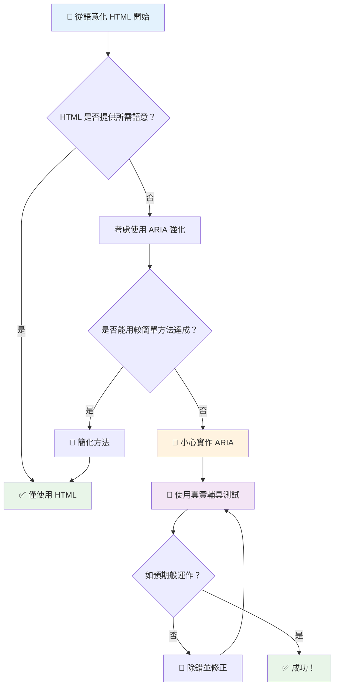
1. **優先語義化 HTML**：永遠優先使用 `<button>`，而非 `<div role="button">`
2. **不破壞語義**：切勿覆蓋既有 HTML 意義（避免 `<h1 role="button">`）
3. **維持鍵盤無障礙**：所有互動式 ARIA 元素必須完全支援鍵盤操作
4. **與真實用戶測試**：不同輔助技術對 ARIA 支援有顯著差異
5. **從簡開始**：複雜的 ARIA 實作較易出錯

**🔍 測試流程：**

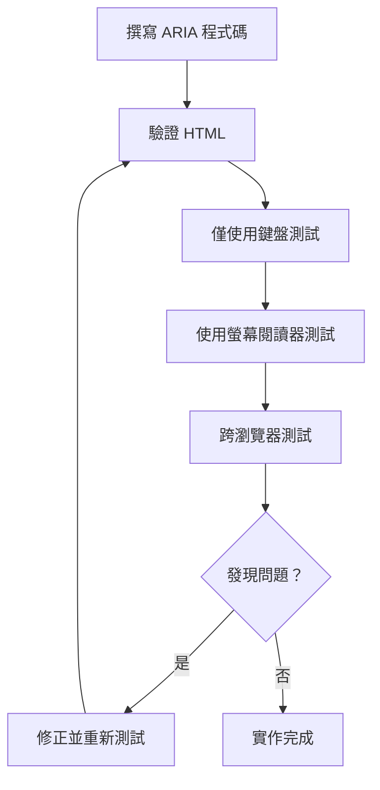
**🚫 避免常見 ARIA 錯誤：**

- **資訊衝突**：勿與 HTML 語義矛盾
- **重複標記**：過多 ARIA 資訊會淹沒使用者
- **靜態 ARIA**：忘記在內容變更時更新 ARIA 狀態
- **未測試實作**：理論可行，但實際失效的 ARIA
- **缺少鍵盤支援**：角色宣告卻無相應鍵盤互動

> 💡 **測試資源**：使用 [accessibility-checker](https://www.npmjs.com/package/accessibility-checker) 等工具做自動 ARIA 驗證，但務必以實際螢幕閱讀器測試完整體驗。

### 🎭 **ARIA 技能檢核：準備好複雜互動了嗎？**

**評估你的 ARIA 信心：**
- 你會在哪些情況下選擇 ARIA 而非語義 HTML？（提示：幾乎不會！）
- 能解釋為什麼 `<div role="button">` 通常不如 `<button>` 嗎？
- ARIA 測試最重要的事情是什麼？

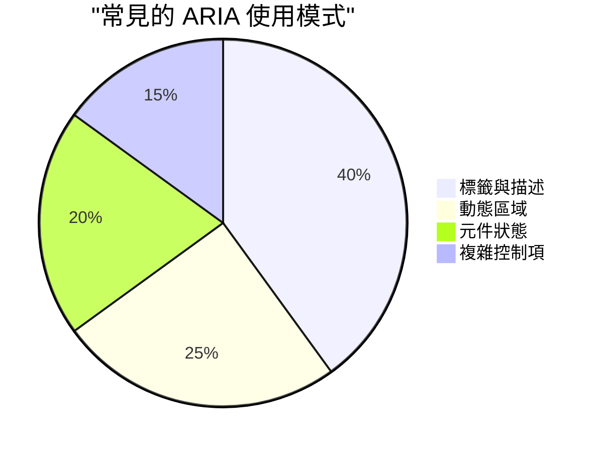
> **關鍵洞見**：大多數 ARIA 使用僅為標記及描述元素。複雜元件模式遠不如你想像中常見！

✅ **向專家學習**：研讀 [ARIA 編寫實踐指南](https://w3c.github.io/aria-practices/) ，掌握經過實戰驗證的複雜互動元件範式與實作。

## 讓圖片及多媒體無障礙

視覺和音訊內容是現代網頁體驗不可或缺的部分，但若未周全考量，會成為障礙。目標是讓你的媒體資訊與情感影響能觸及所有使用者。一旦習慣，就會變成第二天性。

不同類型的媒體需不同的無障礙方法。就像料理一樣，你不會用同一種方式料理細緻魚肉與厚實牛排。理解這些差異有助於選擇適合每種情境的解決方案。

### 策略型圖片無障礙

網站上的每張圖片都承載著目的。了解這項目的有助於撰寫更佳替代文字，創造更包容的體驗。

**四類圖片與其替代文字策略：**

**具資訊性的圖片** - 傳達重要資訊：
```html

```

**裝飾性圖片** - 純視覺無資訊價值：
```html

```

**功能性圖片** - 作為按鈕或控制元件：
```html
<button>
  
</button>
```

**複雜圖片** - 圖表、示意圖、資訊圖表：
```html

<div id="chart-description">
  <p>Detailed description: Sales data shows a steady increase across all quarters...</p>
</div>
```

### 影片與音訊無障礙

**影片需求：**
- **字幕**：口語內容與音效的文字版本
- **音訊描述**：為盲用戶描述視覺元素的旁白
- **文字稿**：全部音訊與視覺內容的完整文字版本

```html
<video controls>
  <source src="video.mp4" type="video/mp4">
  <track kind="captions" src="captions.vtt" srclang="en" label="English">
  <track kind="descriptions" src="descriptions.vtt" srclang="en" label="Audio descriptions">
</video>
```

**音訊需求：**
- **文字稿**：所有口語內容的文字版本
- **視覺提示**：音訊專用內容應提供視覺線索

### 現代圖片技巧

**使用 CSS 處理裝飾性圖片：**
```css
.hero-section {
  background-image: url('decorative-hero.jpg');
  /* Decorative images in CSS don't need alt text */
}
```

**支援無障礙的響應式圖片：**
```html
<picture>
  <source media="(min-width: 800px)" srcset="large-chart.png">
  <source media="(min-width: 400px)" srcset="medium-chart.png">
  
</picture>
```

✅ **測試圖片無障礙**：使用螢幕閱讀器瀏覽有圖片的頁面。你能獲得足以理解內容的資訊嗎？

## 鍵盤導覽與焦點管理

許多使用者完全依靠鍵盤瀏覽網頁。包括肢體障礙者、認為鍵盤比滑鼠更快速的進階用戶，以及滑鼠失效者。確保網站良好支援鍵盤操作非常重要，且往往使整體網站更高效。

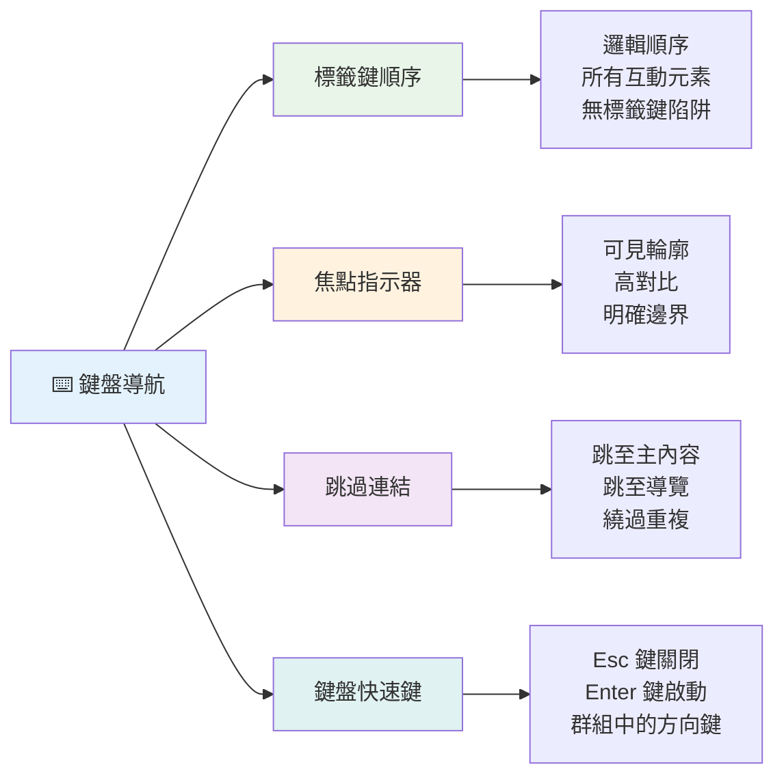
### 基本鍵盤導覽範式

**標準鍵盤互動：**
- **Tab**：往前跳轉焦點至互動元素
- **Shift + Tab**：往後跳轉焦點
- **Enter**：啟動按鈕與連結
- **Space**：啟動按鈕、核取方塊
- **方向鍵**：在元件群組中導航（單選按鈕、選單）
- **Escape**：關閉模態視窗、下拉選單或取消操作

### 焦點管理最佳實踐

**可見焦點指標：**
```css
/* Ensure focus is always visible */
button:focus-visible {
  outline: 2px solid #4A90A4;
  outline-offset: 2px;
}

/* Custom focus styles for different components */
.card:focus-within {
  box-shadow: 0 0 0 3px rgba(74, 144, 164, 0.5);
}
```

**跳過連結以提升導航效率：**
```html
<a href="#main-content" class="skip-link">Skip to main content</a>
<a href="#navigation" class="skip-link">Skip to navigation</a>

<nav id="navigation">
  <!-- navigation content -->
</nav>
<main id="main-content">
  <!-- main content -->
</main>
```

**正確的 Tab 順序：**
```html
<!-- Use semantic HTML for natural tab order -->
<form>
  <label for="name">Name:</label>
  <input type="text" id="name" tabindex="0">
  
  <label for="email">Email:</label>
  <input type="email" id="email" tabindex="0">
  
  <button type="submit" tabindex="0">Submit</button>
</form>
```

### 模態框的焦點圈養

開啟模態對話框時，焦點應限制於對話框內：

```javascript
// 現代焦點限制實作
function trapFocus(element) {
  const focusableElements = element.querySelectorAll(
    'button, [href], input, select, textarea, [tabindex]:not([tabindex="-1"])'
  );
  
  const firstElement = focusableElements[0];
  const lastElement = focusableElements[focusableElements.length - 1];

  element.addEventListener('keydown', (e) => {
    if (e.key === 'Tab') {
      if (e.shiftKey && document.activeElement === firstElement) {
        e.preventDefault();
        lastElement.focus();
      } else if (!e.shiftKey && document.activeElement === lastElement) {
        e.preventDefault();
        firstElement.focus();
      }
    }
    
    if (e.key === 'Escape') {
      closeModal();
    }
  });
  
  // 模態視窗開啟時聚焦第一個元素
  firstElement.focus();
}
```

✅ **測試鍵盤導覽**：嘗試僅使用 Tab 鍵瀏覽網站。你能順利抵達所有互動元件嗎？焦點順序合理嗎？焦點指示明顯嗎？

## 表單無障礙

表單是使用者互動關鍵，需特別關注無障礙需求。

### 標籤與表單控制元件配對

**每個表單控制元件都須有標籤：**
```html
<!-- Explicit labeling (preferred) -->
<label for="username">Username:</label>
<input type="text" id="username" name="username" required>

<!-- Implicit labeling -->
<label>
  Password:
  <input type="password" name="password" required>
</label>

<!-- Using aria-label when visual label isn't desired -->
<input type="search" aria-label="Search products" placeholder="Search...">
```

### 錯誤處理與驗證

**無障礙錯誤訊息：**
```html
<label for="email">Email Address:</label>
<input type="email" id="email" name="email" 
       aria-describedby="email-error" 
       aria-invalid="true" required>
<div id="email-error" role="alert">
  Please enter a valid email address
</div>
```

**表單驗證最佳實踐：**
- 使用 `aria-invalid` 標示錯誤欄位
- 提供明確、具體的錯誤訊息
- 重要錯誤使用 `role="alert"` 通知
- 錯誤訊息於輸入即時與送出時皆提示

### 群組與欄位集

**關聯性強的表單控制元件需分組：**
```html
<fieldset>
  <legend>Shipping Address</legend>
  <label for="street">Street Address:</label>
  <input type="text" id="street" name="street">
  
  <label for="city">City:</label>
  <input type="text" id="city" name="city">
</fieldset>

<fieldset>
  <legend>Preferred Contact Method</legend>
  <input type="radio" id="contact-email" name="contact" value="email">
  <label for="contact-email">Email</label>
  
  <input type="radio" id="contact-phone" name="contact" value="phone">
  <label for="contact-phone">Phone</label>
</fieldset>
```

## 你的無障礙旅程：重點摘要

恭喜！你剛取得創造真正包容網頁體驗的基礎知識。這非常令人振奮！網頁無障礙不僅是打勾合規清單，更是意識到人們與數位內容互動的多元方式，並為這驚人複雜性而設計。

你已成為越來越多理解優秀設計適用於所有人的開發者社群成員。歡迎加入！

**🎯 你的無障礙工具包現包括：**

| 核心原則           | 實作方式                            | 影響                            |
|------------------|--------------------------------|-------------------------------|
| **語義化 HTML 基礎** | 正確使用 HTML 元素               | 螢幕閱讀器導航順暢，鍵盤自動正常運作      |
| **包容性視覺設計**  | 充足對比、有意義的色彩、明顯焦點指示        | 在任何光線環境下皆能清楚辨識               |
| **描述性內容**      | 有意義的連結文字、替代文字、標題           | 無視覺上下文下使用者仍能理解內容           |
| **鍵盤無障礙**      | Tab 順序、鍵盤捷徑、焦點管理               | 改善肢體無障礙者體驗與進階使用者效率       |
| **ARIA 強化**       | 策略性使用補足語義不足                   | 複雜應用能與輔助技術順利互動               |
| **全面測試**       | 自動工具 + 手動驗證 + 真實用戶測試          | 問題能被及早發現，減少影響使用者          |

**🚀 你的下一步：**

1. **將無障礙納入工作流程**：讓測試成為開發流程的自然部分
2. **向真實使用者學習**：聽取採用輔助技術者的回饋
3. **保持最新**：無障礙技術隨新標準和技術演進
4. **倡導包容**：分享你的知識，將無障礙列為團隊優先

> 💡 **請記得**：無障礙限制往往激發創新、優雅解決方案。路緣斜坡、字幕與語音控制曾是無障礙功能，如今成為主流改良。

**商業理由很明確**：無障礙網站可接觸更多用戶、於搜尋引擎排名更佳、降低維護成本、避開法律風險。但老實說，關注無障礙的真正理由更深遠。無障礙網站體現網路最佳價值——開放性、包容性，以及每個人都應享有平等資訊取得權。

你現已具備建構未來包容性網路的能力。你建置的每個無障礙網站都讓網際網路成為更歡迎每個人的空間。想想看，這真的很棒！

## 附加資源

持續你的無障礙學習之旅，這些是必備資源：

**📚 官方標準與指引：**
- [WCAG 2.1 指引](https://www.w3.org/WAI/WCAG21/quickref/) - 官方無障礙標準與快速參考
- [ARIA 編撰實踐指南](https://w3c.github.io/aria-practices/) - 互動元件詳盡範式
- [WebAIM 指引](https://webaim.org/) - 實用且適合初學者的無障礙指導

**🛠️ 工具與測試資源：**
- [axe DevTools](https://www.deque.com/axe/devtools/) - 業界標準無障礙測試工具
- [A11y Project 清單](https://www.a11yproject.com/checklist/) - 逐步驗證無障礙準則
- [Accessibility Insights](https://accessibilityinsights.io/) - 微軟完整測試套件
- [Color Oracle](https://colororacle.org/) - 色盲模擬器，協助設計測試

**🎓 學習與社群：**
- [WebAIM 螢幕閱讀器調查](https://webaim.org/projects/screenreadersurvey9/) - 真實用戶偏好與行為
- [Inclusive Components](https://inclusive-components.design/) - 現代無障礙元件範式
- [A11y Coffee](https://a11y.coffee/) - 快速無障礙技巧與洞察
- [Web Accessibility Initiative (WAI)](https://www.w3.org/WAI/) - W3C 全面無障礙資源

**🎥 實作學習：**
- [Accessibility Developer Guide](https://www.accessibility-developer-guide.com/) - 實用實作指導
- [Deque University](https://dequeuniversity.com/) - 專業無障礙培訓課程

## GitHub Copilot Agent 挑戰 🚀

使用 Agent 模式完成以下挑戰：

**說明：** 建立一個無障礙模態對話框元件，展示適當的焦點管理、ARIA 屬性和鍵盤導航範式。

**提示：** 使用 HTML、CSS 與 JavaScript 建構完整模態對話框，包含：正確的焦點圈養、ESC 鍵關閉、點擊外部關閉、為螢幕閱讀器加上 ARIA 屬性及可見焦點指示。模態框內含表單，具有正確標籤與錯誤處理。確保元件符合 WCAG 2.1 AA 標準。


## 🚀 挑戰

使用你學到的策略，將此 HTML 重寫成盡可能無障礙的版本。

```html
<!DOCTYPE html>
<html lang="en">
  <head>
    <meta charset="UTF-8">
    <meta name="viewport" content="width=device-width, initial-scale=1.0">
    <title>Turtle Ipsum - The World's Premier Turtle Fan Club</title>
    <link href='../assets/style.css' rel='stylesheet' type='text/css'>
  </head>
  <body>
    <header class="site-header">
      <h1 class="site-title">Turtle Ipsum</h1>
      <p class="site-subtitle">The World's Premier Turtle Fan Club</p>
    </header>
    
    <nav class="main-nav" aria-label="Main navigation">
      <h2 class="nav-header">Resources</h2>
      <ul class="nav-list">
        <li><a href="https://www.youtube.com/watch?v=CMNry4PE93Y">"I like turtles" video</a></li>
        <li><a href="https://en.wikipedia.org/wiki/Turtle">Basic turtle information</a></li>
        <li><a href="https://en.wikipedia.org/wiki/Turtles_(chocolate)">Chocolate turtles candy</a></li>
      </ul>
    </nav>
    
    <main class="main-content">
      <article>
        <h1>Welcome to Turtle Ipsum</h1>
        <p class="intro">
          <a href="/about">Learn more about our turtle community</a> and discover fascinating facts about these amazing creatures.
        </p>
        <p class="article-text">
          Turtle ipsum dolor sit amet, consectetur adipiscing elit, sed do eiusmod tempor incididunt ut labore et dolore magna aliqua. Ut enim ad minim veniam, quis nostrud exercitation ullamco laboris nisi ut aliquip ex ea commodo consequat. Duis aute irure dolor in reprehenderit in voluptate velit esse cillum dolore eu fugiat nulla pariatur. Excepteur sint occaecat cupidatat non proident, sunt in culpa qui officia deserunt mollit anim id est laborum.
        </p>
      </article>
    </main>
    
    <footer class="footer">
      <section class="newsletter-signup">
        <h2>Stay Updated</h2>
        <button type="button" onclick="showNewsletterForm()">Sign up for turtle news</button>
      </section>
      
      <nav class="footer-nav" aria-label="Footer navigation">
        <h2>Site Pages</h2>
        <ul>
          <li><a href="../">Home</a></li>
          <li><a href="../semantic">Semantic HTML example</a></li>
        </ul>
      </nav>
      
      <p class="footer-copyright">&copy; 2024 Instrument. All rights reserved.</p>
    </footer>
  </body>
</html>
```

**主要改進：**
- 加入正確語義化 HTML 結構
- 修正標題階層（單一 h1，合邏輯的進階順序）
- 使用有意義的連結文字，替代「點此」
- 增加導航的適當 ARIA 標籤
- 新增 lang 屬性與正確的 meta 標籤
- 互動元件以 button 元素呈現
- 使用適當地標結構組織頁尾內容

## 課後測驗
[課後測驗](https://ff-quizzes.netlify.app/web/en/)

## 複習與自學

許多國家有關於無障礙的法律規範。查閱你所在國家無障礙相關法律，涵蓋哪些範圍，哪些未涵蓋？範例是 [此政府網站](https://accessibility.blog.gov.uk/)。

## 作業
 
[分析一個非無障礙網站](assignment.md)

致謝：[Turtle Ipsum](https://github.com/Instrument/semantic-html-sample) 由 Instrument 製作

---

## 🚀 你的無障礙精通時間軸

### ⚡ **接下來 5 分鐘能做到什麼**
- [ ] 在瀏覽器安裝 axe DevTools 擴充功能
- [ ] 對你喜歡的網站執行 Lighthouse 無障礙檢測
- [ ] 嘗試僅用 Tab 鍵瀏覽任何網站
- [ ] 測試瀏覽器內建螢幕閱讀器（Narrator/VoiceOver）

### 🎯 **本小時內能完成的事**
- [ ] 完成課後測驗並反思無障礙學習心得
- [ ] 練習為 10 張不同圖片撰寫有意義替代文字
- [ ] 使用 HeadingsMap 擴充檢視網站標題結構
- [ ] 修正挑戰中 HTML 發現的無障礙問題
- [ ] 以 WebAIM 工具測試目前專案的色彩對比

### 📅 **本週無障礙學習計劃**
- [ ] 完成分析非無障礙網站的作業
- [ ] 設置開發環境並整合無障礙測試工具
- [ ] 在 5 個不同的複雜網站上練習鍵盤導覽
- [ ] 建立一個具有適當標籤、錯誤處理和 ARIA 的簡單表單
- [ ] 加入一個無障礙社群（A11y Slack、WebAIM 論壇）
- [ ] 觀看實際有障礙的使用者瀏覽網站（YouTube 有很棒的範例）

### 🌟 **你的為期一個月的轉變**
- [ ] 將無障礙測試整合到你的開發工作流程中
- [ ] 透過修正無障礙問題來貢獻開源專案
- [ ] 與使用輔助技術的人員進行可用性測試
- [ ] 為你的團隊建立一個無障礙元件庫
- [ ] 在工作場所或社群中推廣無障礙
- [ ] 指導無障礙概念的新手

### 🏆 **無障礙冠軍的最終回顧**

**慶祝你的無障礙旅程：**
- 你對人們如何使用網路學到的最令人驚訝的事情是什麼？
- 哪一項無障礙原則最貼近你的開發風格？
- 學習無障礙後，你對設計的看法有何改變？
- 你想在真實專案中優先做的第一個無障礙改進是什麼？

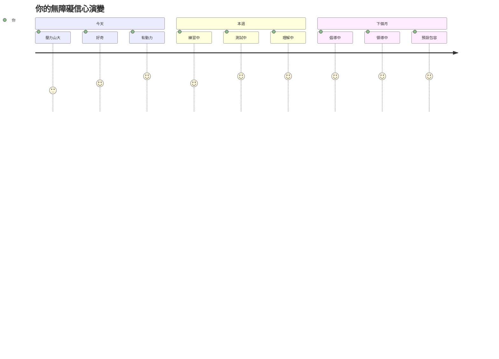
> 🌍 **你現在是一位無障礙冠軍！** 你了解優秀的網頁體驗適用於所有人，無論他們如何瀏覽網路。你所建立的每個無障礙功能都讓網際網路更具包容性。網路需要像你這樣的開發者，他們不將無障礙視為負擔，而是視為為所有使用者創造更佳體驗的機會。歡迎加入這場運動！ 🎉

---

<!-- CO-OP TRANSLATOR DISCLAIMER START -->
**免責聲明**：  
本文件係使用 AI 翻譯服務 [Co-op Translator](https://github.com/Azure/co-op-translator) 進行翻譯。雖然我們致力於確保翻譯準確，但請注意，自動翻譯可能包含錯誤或不準確之處。原始文件之原文版本應視為權威依據。對於重要資訊，建議尋求專業人工翻譯。我們對因使用本翻譯所產生之任何誤解或誤釋概不負責。
<!-- CO-OP TRANSLATOR DISCLAIMER END -->