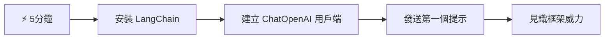
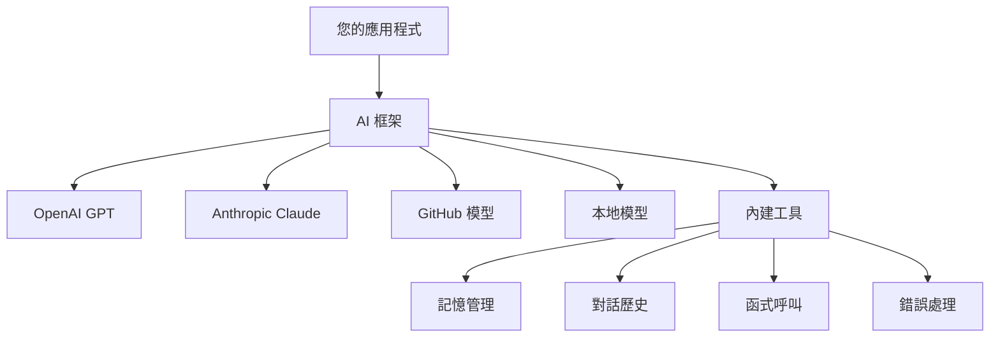
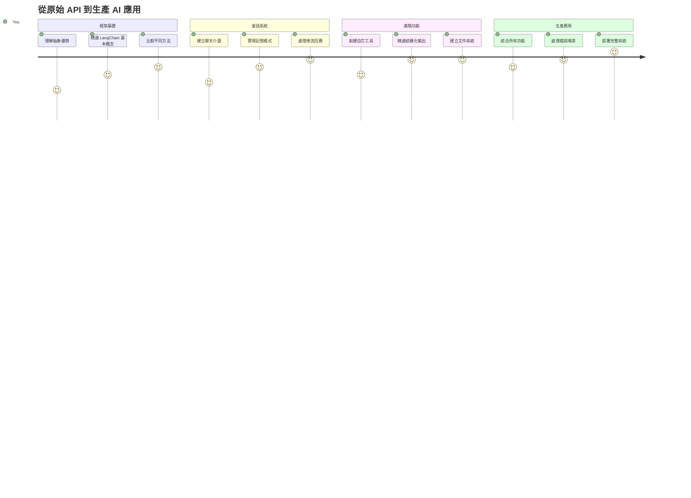
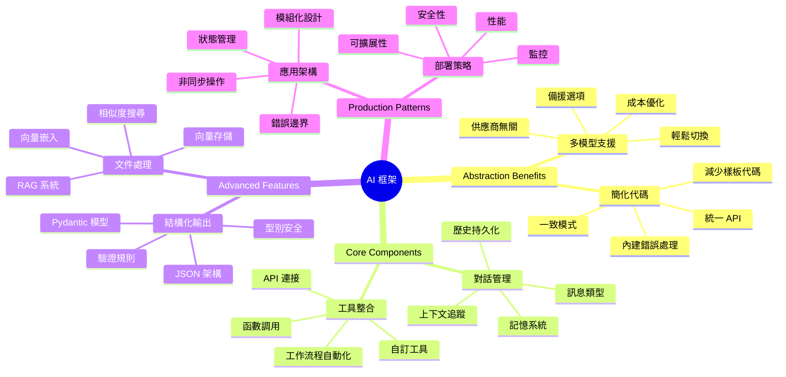
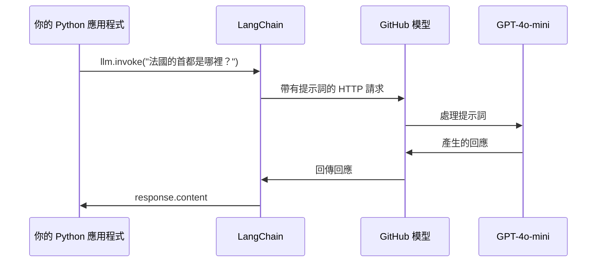
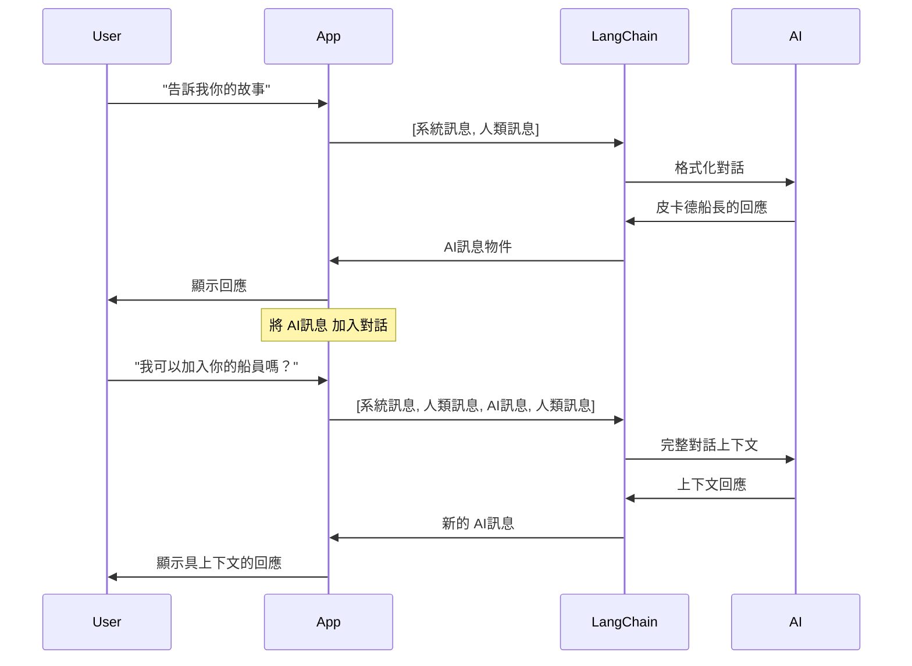
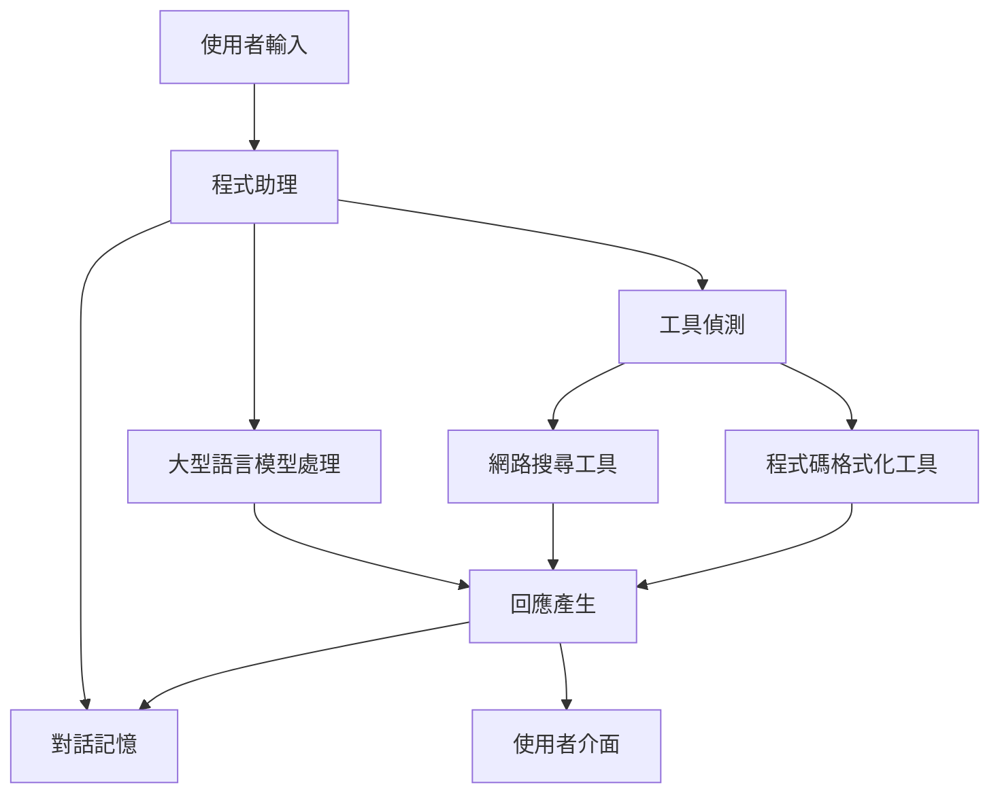
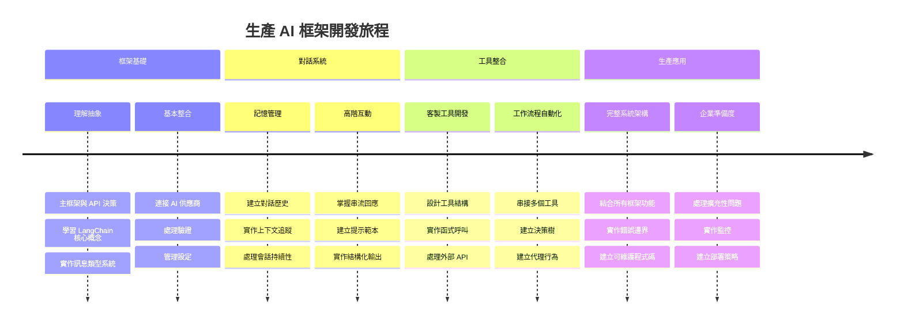
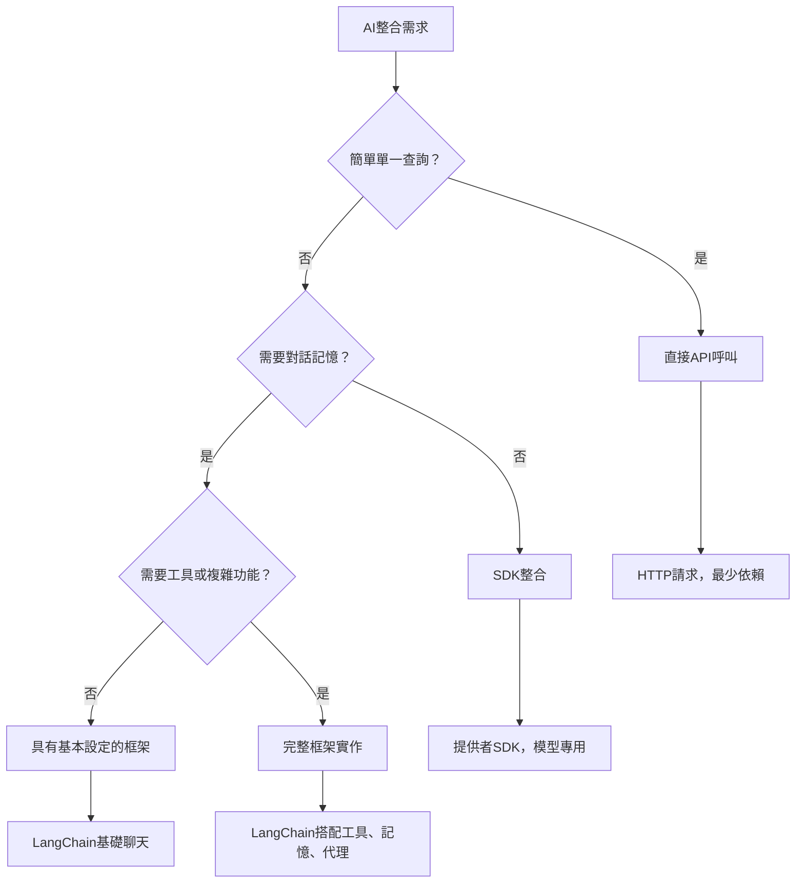

# AI Framework

曾經覺得從零開始建立 AI 應用程式壓力山大嗎？你並不孤單！AI 框架就像是為 AI 開發準備的瑞士軍刀——它們是強大的工具，能在建立智慧型應用程式時節省你的時間和麻煩。把 AI 框架想像成一個組織完善的函式庫：它提供預建元件、標準化的 API 和聰明的抽象，讓你可以專注於解決問題，而不是為了實作細節而苦惱。

在本課程中，我們將探索像 LangChain 這樣的框架，如何把過去複雜的 AI 整合工作轉化為乾淨、易讀的程式碼。你將發現如何應對實務挑戰，例如追蹤對話、實作工具呼叫，以及透過單一介面切換不同 AI 模型。

到最後，你將知道什麼時候該選擇框架而非直接呼叫 API，如何有效運用它們的抽象，以及如何建構適合真實應用的 AI 應用程式。讓我們一起探索 AI 框架對你的專案能帶來什麼助益。

## ⚡ 接下來 5 分鐘你能做到什麼

**忙碌開發者的快速啟動路徑**


- **第1分鐘**：安裝 LangChain：`pip install langchain langchain-openai`
- **第2分鐘**：設定你的 GitHub 令牌並匯入 ChatOpenAI 物件
- **第3分鐘**：建立簡單對話，包含系統訊息與使用者訊息
- **第4分鐘**：加入基本工具（例如加法函式）並體驗 AI 工具呼叫
- **第5分鐘**：感受原生 API 呼叫與框架抽象的差異

**快速測試程式碼**：
```python
from langchain_openai import ChatOpenAI
from langchain_core.messages import SystemMessage, HumanMessage

llm = ChatOpenAI(
    api_key=os.environ["GITHUB_TOKEN"],
    base_url="https://models.github.ai/inference",
    model="openai/gpt-4o-mini"
)

response = llm.invoke([
    SystemMessage(content="You are a helpful coding assistant"),
    HumanMessage(content="Explain Python functions briefly")
])
print(response.content)
```

**為什麼重要**：在短短 5 分鐘內，你將體驗 AI 框架如何將複雜的 AI 整合簡化為簡單方法呼叫。這是支撐生產環境 AI 應用的基礎。

## 為什麼選擇框架？

你已準備好開發 AI 應用—太棒了！但事情是這樣的：你有數條不同路徑可走，每條路都有其優缺點。這有點像選擇走路、騎腳踏車或開車去某地—都能到達，但經驗（和努力）截然不同。

讓我們拆解三種主要的 AI 整合方式：

| 方法 | 優點 | 適合情景 | 注意事項 |
|----------|------------|----------|--------------|
| **直接 HTTP 請求** | 完全控制，無依賴 | 簡單查詢，學習基礎 | 程式碼冗長，需手動錯誤處理 |
| **SDK 整合** | 減少樣板碼，模型優化 | 單一模型應用 | 限於特定提供者 |
| **AI 框架** | 統一 API，內建抽象 | 多模型應用，複雜流程 | 學習曲線，可能抽象過度 |

### 框架優勢實務應用


**為什麼框架很重要：**
- **統一** 多家 AI 供應商在單一介面下
- **自動處理** 對話記憶
- **提供** 現成工具，應對如嵌入與函式呼叫等常見任務
- **管理** 錯誤與重試邏輯
- **將** 複雜工作流程轉換為可讀的方法呼叫

> 💡 **專家提示**：在多模型切換或建構代理人、記憶、工具呼叫等複雜功能時使用框架。學習基礎或構建簡單應用時則直接使用 API。

**結論**：就像選擇專匠的專用工具與完整工作坊一樣，要依任務挑選工具。框架適合功能豐富且複雜的應用，而直接 API 適用於簡潔明瞭的場景。

## 🗺️ 你的 AI 框架精通學習之旅


**你的學習目標**：本課程結束後，你將精通 AI 框架開發，能建構媲美商用 AI 助理的高階且生產用 AI 應用。

## 介紹

本課程將學習：

- 使用常見 AI 框架。
- 解決常見問題，如聊天對話、工具使用、記憶與上下文管理。
- 利用這些知識打造 AI 應用。

## 🧠 AI 框架開發生態


**核心原則**：AI 框架將複雜度抽象化，同時提供強大的對話管理、工具整合及文件處理抽象，讓開發者能用乾淨、易維護程式碼構建高階 AI 應用。

## 你的第一個 AI 提示

從基礎開始，建立你的第一個 AI 應用，以送出問題並獲得回答。就像阿基米德在浴缸中發現排水原理一樣，有時最簡單的觀察帶來最深遠的洞見——而框架讓這些洞見變得易於實現。

### 使用 GitHub 模型設定 LangChain

我們將用 LangChain 連接 GitHub 模型，這非常棒，因為它讓你免費使用各種 AI 模型。最好的是？只需幾個簡單設定參數就能啟動：

```python
from langchain_openai import ChatOpenAI
import os

llm = ChatOpenAI(
    api_key=os.environ["GITHUB_TOKEN"],
    base_url="https://models.github.ai/inference",
    model="openai/gpt-4o-mini",
)

# 傳送一個簡單的提示
response = llm.invoke("What's the capital of France?")
print(response.content)
```

**拆解這段程式發生了什麼：**
- **建立** LangChain 用戶端，透過 `ChatOpenAI` 類別，這是你的 AI 門戶！
- **設定** 與 GitHub 模型的連線，包含認證令牌
- **指定** 使用的 AI 模型 (`gpt-4o-mini`)，就像挑選 AI 助手
- **送出** 問題，使用 `invoke()` 方法，魔法從這裡發生
- **擷取** 並顯示回應——瞧，你正在與 AI 對話！

> 🔧 **設定說明**：如果你使用 GitHub Codespaces，恭喜 - `GITHUB_TOKEN` 已預設好！本地開發？別擔心，只要建立有正確權限的個人存取令牌即可。

**預期輸出：**
```text
The capital of France is Paris.
```


## 建構對話式 AI

第一個範例示範基礎，但它只是單次互動——你提問，得到回答，就結束。真實應用中，你希望 AI 留住過去談話，就像華森與福爾摩斯隨著時間累積調查對話。

這時 LangChain 尤其好用。它提供不同訊息類型，協助組織對話結構，還能賦予 AI 個性。你將打造保持上下文與角色的聊天體驗。

### 理解訊息類型

把這些訊息類型想成在對話中戴著不同「帽子」的參與者。LangChain 用不同訊息類別追蹤誰說了什麼：

| 訊息類型 | 作用 | 示例情境 |
|--------------|---------|------------------|
| `SystemMessage` | 定義 AI 個性與行為 | "你是一位樂於助人的程式助理" |
| `HumanMessage` | 代表使用者輸入 | "解釋函式是怎麼運作的" |
| `AIMessage` | 存放 AI 回應 | 對話中的先前 AI 回應 |

### 建立你的第一段對話

讓我們建立一段對話，讓 AI 扮演特定角色。我們讓它化身為皮卡德船長——以其外交智慧與領導力聞名的角色：

```python
messages = [
    SystemMessage(content="You are Captain Picard of the Starship Enterprise"),
    HumanMessage(content="Tell me about you"),
]
```

**拆解這段對話設定：**
- **透過** `SystemMessage` 設定 AI 角色及個性
- **給予** 使用者起始查詢，包在 `HumanMessage` 中
- **打造** 多輪對話的基礎

以下是此範例的完整程式碼：

```python
from langchain_core.messages import HumanMessage, SystemMessage
from langchain_openai import ChatOpenAI
import os

llm = ChatOpenAI(
    api_key=os.environ["GITHUB_TOKEN"],
    base_url="https://models.github.ai/inference",
    model="openai/gpt-4o-mini",
)

messages = [
    SystemMessage(content="You are Captain Picard of the Starship Enterprise"),
    HumanMessage(content="Tell me about you"),
]


# 有效
response  = llm.invoke(messages)
print(response.content)
```

你應該會看到類似這樣的結果：

```text
I am Captain Jean-Luc Picard, the commanding officer of the USS Enterprise (NCC-1701-D), a starship in the United Federation of Planets. My primary mission is to explore new worlds, seek out new life and new civilizations, and boldly go where no one has gone before. 

I believe in the importance of diplomacy, reason, and the pursuit of knowledge. My crew is diverse and skilled, and we often face challenges that test our resolve, ethics, and ingenuity. Throughout my career, I have encountered numerous species, grappled with complex moral dilemmas, and have consistently sought peaceful solutions to conflicts.

I hold the ideals of the Federation close to my heart, believing in the importance of cooperation, understanding, and respect for all sentient beings. My experiences have shaped my leadership style, and I strive to be a thoughtful and just captain. How may I assist you further?
```

為了維持對話連貫性（而非每次都重設上下文），你需要不斷將回應加入訊息清單。就像口述傳統保留世代故事般，此方法建立持久記憶：

```python
from langchain_core.messages import HumanMessage, SystemMessage
from langchain_openai import ChatOpenAI
import os

llm = ChatOpenAI(
    api_key=os.environ["GITHUB_TOKEN"],
    base_url="https://models.github.ai/inference",
    model="openai/gpt-4o-mini",
)

messages = [
    SystemMessage(content="You are Captain Picard of the Starship Enterprise"),
    HumanMessage(content="Tell me about you"),
]


# 有效
response  = llm.invoke(messages)

print(response.content)

print("---- Next ----")

messages.append(response)
messages.append(HumanMessage(content="Now that I know about you, I'm Chris, can I be in your crew?"))

response  = llm.invoke(messages)

print(response.content)

```

很酷吧？這裡我們呼叫了兩次大型語言模型——第一次只傳入最初兩條訊息，接著再帶完整對話歷史。就像 AI 真的在跟我們聊天！

當你執行此程式碼，即會收到第二則聽起來像是這樣的回應：

```text
Welcome aboard, Chris! It's always a pleasure to meet those who share a passion for exploration and discovery. While I cannot formally offer you a position on the Enterprise right now, I encourage you to pursue your aspirations. We are always in need of talented individuals with diverse skills and backgrounds. 

If you are interested in space exploration, consider education and training in the sciences, engineering, or diplomacy. The values of curiosity, resilience, and teamwork are crucial in Starfleet. Should you ever find yourself on a starship, remember to uphold the principles of the Federation: peace, understanding, and respect for all beings. Your journey can lead you to remarkable adventures, whether in the stars or on the ground. Engage!
```


我就當作是「可能」的答案了 ;)

## 串流回應

有沒有注意到 ChatGPT 好像在「即時打字」它的回應？這就是串流的效果。就像看書法家一筆一劃地寫出文字—不會瞬間跳出整段字—串流讓互動感覺更自然，且提供即時回饋。

### 用 LangChain 實作串流

```python
from langchain_openai import ChatOpenAI
import os

llm = ChatOpenAI(
    api_key=os.environ["GITHUB_TOKEN"],
    base_url="https://models.github.ai/inference",
    model="openai/gpt-4o-mini",
    streaming=True
)

# 串流回應
for chunk in llm.stream("Write a short story about a robot learning to code"):
    print(chunk.content, end="", flush=True)
```

**為什麼串流很棒：**
- **展示** 生成中的內容——不再尷尬等待！
- **讓** 使用者感受到內容真正在生成
- **感覺上** 更快，儘管技術上未必
- **允許** 使用者在 AI 還沒想完時就開始閱讀

> 💡 **用戶體驗秘訣**：串流在回覆較長內容時特別有用，比如程式碼說明、創意寫作或詳細教學。你的用戶會喜歡看到進度，而不是盯著空白頁面！

### 🎯 教學自我檢視：框架抽象的好處

**暫停思考**：剛剛體驗了 AI 框架抽象的威力。和之前使用原生 API 呼叫相比，做過哪些簡化？

**快速自評**：
- 你能解釋 LangChain 如何簡化對話管理，與手動追蹤訊息的差別嗎？
- `invoke()` 和 `stream()` 方法的差異是什麼？你會在什麼情境用各自？
- 框架的訊息類型系統如何改善程式碼架構？

**實務連結**：你學到的抽象模式（訊息類型、串流介面、對話記憶）是每個大型 AI 應用的基礎—from ChatGPT 介面到 GitHub Copilot 寫碼助手。你正在掌握專業 AI 團隊使用的架構模式。

**挑戰問題**：你會如何設計一個框架抽象，以用單一介面支援不同 AI 模型供應商（OpenAI、Anthropic、Google）？請思考利弊。

## 提示模板

提示模板就像古典修辭學中演說的結構—想想西塞羅如何為不同聽眾調整演說模式，同時保持說服力的框架。它們讓你建立可重複使用的提示，能替換其中資訊塊而不必重寫全部。設定好模板後，只需填入變數。

### 建立可重複使用提示

```python
from langchain_core.prompts import ChatPromptTemplate

# 定義一個程式碼說明的模板
template = ChatPromptTemplate.from_messages([
    ("system", "You are an expert programming instructor. Explain concepts clearly with examples."),
    ("human", "Explain {concept} in {language} with a practical example for {skill_level} developers")
])

# 使用該模板搭配不同的值
questions = [
    {"concept": "functions", "language": "JavaScript", "skill_level": "beginner"},
    {"concept": "classes", "language": "Python", "skill_level": "intermediate"},
    {"concept": "async/await", "language": "JavaScript", "skill_level": "advanced"}
]

for question in questions:
    prompt = template.format_messages(**question)
    response = llm.invoke(prompt)
    print(f"Topic: {question['concept']}\n{response.content}\n---\n")
```

**你會喜愛模板的理由：**
- **讓** 全應用中提示更加一致
- **不再** 亂七八糟串接字串—變成乾淨簡單的變數
- **保持** AI 預期行為，結構不變更
- **更新** 方便—改一次模板、全應用生效

## 結構化輸出

嘗試解析回傳的非結構化文字 AI 回應時經常挫折？結構化輸出就像教 AI 採用林奈分類法那樣系統化、有規律、好使用。你可以要求 JSON、特定資料結構，或任何你需要的格式。

### 定義輸出結構

```python
from langchain_core.prompts import ChatPromptTemplate
from langchain_core.output_parsers import JsonOutputParser
from pydantic import BaseModel, Field

class CodeReview(BaseModel):
    score: int = Field(description="Code quality score from 1-10")
    strengths: list[str] = Field(description="List of code strengths")
    improvements: list[str] = Field(description="List of suggested improvements")
    overall_feedback: str = Field(description="Summary feedback")

# 設定解析器
parser = JsonOutputParser(pydantic_object=CodeReview)

# 建立包含格式指示的提示
prompt = ChatPromptTemplate.from_messages([
    ("system", "You are a code reviewer. {format_instructions}"),
    ("human", "Review this code: {code}")
])

# 使用指示格式化提示
chain = prompt | llm | parser

# 取得結構化回應
code_sample = """
def calculate_average(numbers):
    return sum(numbers) / len(numbers)
"""

result = chain.invoke({
    "code": code_sample,
    "format_instructions": parser.get_format_instructions()
})

print(f"Score: {result['score']}")
print(f"Strengths: {', '.join(result['strengths'])}")
```

**為什麼結構化輸出是遊戲規則改變者：**
- **不再** 猜測回傳格式——每次皆一致
- **能** 直接串接資料庫與 API，無需額外處理
- **能** 及早捕捉奇怪 AI 回應，免應用崩潰
- **讓** 程式碼更乾淨，精準知道處理內容

## 工具呼叫

現在來到一個最強大的功能：工具。這是你給 AI 除了對話之外的實用能力。就像中世紀行會開發專業工具，你能為 AI 配備專用的「工具」。你描述可用工具，當需求符合時，AI 就能採取行動。

### 使用 Python

讓我們加入一些工具，如下：

```python
from typing_extensions import Annotated, TypedDict

class add(TypedDict):
    """Add two integers."""

    # 註解必須有類型，且可選擇包含預設值和描述（順序如是）。
    a: Annotated[int, ..., "First integer"]
    b: Annotated[int, ..., "Second integer"]

tools = [add]

functions = {
    "add": lambda a, b: a + b
}
```

這裡發生什麼事？我們為名為 `add` 的工具建立藍圖。繼承 `TypedDict` 並用那漂亮的 `Annotated` 類型定義 `a` 和 `b`，讓 LLM 清楚知道工具做什麼，需要什麼參數。`functions` 字典像是我們的工具箱，告訴程式當 AI 選用特定工具時應該怎麼做。

下一步來看看如何帶著這工具呼叫 LLM：

```python
llm = ChatOpenAI(
    api_key=os.environ["GITHUB_TOKEN"],
    base_url="https://models.github.ai/inference",
    model="openai/gpt-4o-mini",
)

llm_with_tools = llm.bind_tools(tools)
```

我們使用 `bind_tools` 給 `tools` 陣列，這樣 `llm_with_tools` 就知道這個工具了。

要用這個新 LLM，我們執行以下程式碼：

```python
query = "What is 3 + 12?"

res = llm_with_tools.invoke(query)
if(res.tool_calls):
    for tool in res.tool_calls:
        print("TOOL CALL: ", functions[tool["name"]](../../../10-ai-framework-project/**tool["args"]))
print("CONTENT: ",res.content)
```

現在呼叫有工具的 `invoke`，`tool_calls` 屬性可能會被填充。如果是，任何被識別的工具都會有 `name` 和 `args` 屬性，指出應呼叫哪個工具及其參數。完整程式碼如下：

```python
from langchain_core.messages import HumanMessage, SystemMessage
from langchain_openai import ChatOpenAI
import os
from typing_extensions import Annotated, TypedDict

class add(TypedDict):
    """Add two integers."""

    # 標註必須有類型，且可選擇包含預設值與描述（按照該順序）。
    a: Annotated[int, ..., "First integer"]
    b: Annotated[int, ..., "Second integer"]

tools = [add]

functions = {
    "add": lambda a, b: a + b
}

llm = ChatOpenAI(
    api_key=os.environ["GITHUB_TOKEN"],
    base_url="https://models.github.ai/inference",
    model="openai/gpt-4o-mini",
)

llm_with_tools = llm.bind_tools(tools)

query = "What is 3 + 12?"

res = llm_with_tools.invoke(query)
if(res.tool_calls):
    for tool in res.tool_calls:
        print("TOOL CALL: ", functions[tool["name"]](../../../10-ai-framework-project/**tool["args"]))
print("CONTENT: ",res.content)
```

執行這段程式碼時，你應看到類似輸出：

```text
TOOL CALL:  15
CONTENT: 
```

AI 看了「What is 3 + 12」並判定這是 `add` 工具能處理的問題。就像擅長的圖書館員根據問題類型找參考書，它根據工具名稱、描述與欄位規格做出判斷。結果 15 是由 `functions` 字典執行該工具後產生：

```python
print("TOOL CALL: ", functions[tool["name"]](../../../10-ai-framework-project/**tool["args"]))
```

### 更有趣的調用 Web API 的工具
加法演示了概念，但真正的工具通常會執行更複雜的操作，例如調用網路 API。我們來擴展範例，讓 AI 從網際網路抓取內容——就像電報操作員以前連接遙遠地點一樣：

```python
class joke(TypedDict):
    """Tell a joke."""

    # 註解必須有類型，並且可以選擇性地包含預設值和描述（按該順序）。
    category: Annotated[str, ..., "The joke category"]

def get_joke(category: str) -> str:
    response = requests.get(f"https://api.chucknorris.io/jokes/random?category={category}", headers={"Accept": "application/json"})
    if response.status_code == 200:
        return response.json().get("value", f"Here's a {category} joke!")
    return f"Here's a {category} joke!"

functions = {
    "add": lambda a, b: a + b,
    "joke": lambda category: get_joke(category)
}

query = "Tell me a joke about animals"

# 其餘程式碼相同
```

現在如果你執行這段程式碼，你會收到類似下面的回應：

```text
TOOL CALL:  Chuck Norris once rode a nine foot grizzly bear through an automatic car wash, instead of taking a shower.
CONTENT:  
```

```mermaid
flowchart TD
    A[使用者查詢: "說一個關於動物的笑話"] --> B[LangChain 分析]
    B --> C{有工具可用？}
    C -->|是| D[選擇笑話工具]
    C -->|否| E[產生直接回應]
    
    D --> F[擷取參數]
    F --> G[呼叫 joke(category="animals")]
    G --> H[向 chucknorris.io 發送 API 請求]
    H --> I[回傳笑話內容]
    I --> J[顯示給使用者]
    
    E --> K[AI 產生回應]
    K --> J
    
    subgraph "工具定義層"
        L[TypedDict 架構]
        M[函式實作]
        N[參數驗證]
    end
    
    D --> L
    F --> N
    G --> M
```
以下是完整程式碼：

```python
from langchain_openai import ChatOpenAI
import requests
import os
from typing_extensions import Annotated, TypedDict

class add(TypedDict):
    """Add two integers."""

    # 註解必須有類型，並且可以選擇性地包含預設值和描述（按該順序）。
    a: Annotated[int, ..., "First integer"]
    b: Annotated[int, ..., "Second integer"]

class joke(TypedDict):
    """Tell a joke."""

    # 註解必須有類型，並且可以選擇性地包含預設值和描述（按該順序）。
    category: Annotated[str, ..., "The joke category"]

tools = [add, joke]

def get_joke(category: str) -> str:
    response = requests.get(f"https://api.chucknorris.io/jokes/random?category={category}", headers={"Accept": "application/json"})
    if response.status_code == 200:
        return response.json().get("value", f"Here's a {category} joke!")
    return f"Here's a {category} joke!"

functions = {
    "add": lambda a, b: a + b,
    "joke": lambda category: get_joke(category)
}

llm = ChatOpenAI(
    api_key=os.environ["GITHUB_TOKEN"],
    base_url="https://models.github.ai/inference",
    model="openai/gpt-4o-mini",
)

llm_with_tools = llm.bind_tools(tools)

query = "Tell me a joke about animals"

res = llm_with_tools.invoke(query)
if(res.tool_calls):
    for tool in res.tool_calls:
        # print("工具呼叫: ", tool)
        print("TOOL CALL: ", functions[tool["name"]](../../../10-ai-framework-project/**tool["args"]))
print("CONTENT: ",res.content)
```

## 嵌入向量與文件處理

嵌入向量是現代 AI 中最優雅的解決方案之一。想像你可以將任何文本轉換成數值座標，捕捉其語意。這正是嵌入向量的作用——它們將文本轉換成多維空間中的點，類似概念會聚集在一起。這就像為想法建立了一個座標系統，有點像孟得列夫依據原子特性整理週期表的方式。

### 建立及使用嵌入向量

```python
from langchain_openai import OpenAIEmbeddings
from langchain_community.vectorstores import FAISS
from langchain_community.document_loaders import TextLoader
from langchain.text_splitter import CharacterTextSplitter

# 初始化嵌入向量
embeddings = OpenAIEmbeddings(
    api_key=os.environ["GITHUB_TOKEN"],
    base_url="https://models.github.ai/inference",
    model="text-embedding-3-small"
)

# 載入並拆分文件
loader = TextLoader("documentation.txt")
documents = loader.load()

text_splitter = CharacterTextSplitter(chunk_size=1000, chunk_overlap=0)
texts = text_splitter.split_documents(documents)

# 建立向量資料庫
vectorstore = FAISS.from_documents(texts, embeddings)

# 執行相似度搜尋
query = "How do I handle user authentication?"
similar_docs = vectorstore.similarity_search(query, k=3)

for doc in similar_docs:
    print(f"Relevant content: {doc.page_content[:200]}...")
```

### 支援多種格式的文件載入器

```python
from langchain_community.document_loaders import (
    PyPDFLoader,
    CSVLoader,
    JSONLoader,
    WebBaseLoader
)

# 載入不同的文件類型
pdf_loader = PyPDFLoader("manual.pdf")
csv_loader = CSVLoader("data.csv")
json_loader = JSONLoader("config.json")
web_loader = WebBaseLoader("https://example.com/docs")

# 處理所有文件
all_documents = []
for loader in [pdf_loader, csv_loader, json_loader, web_loader]:
    docs = loader.load()
    all_documents.extend(docs)
```

**嵌入向量能做到的事：**
- **建構**真正理解你意思的搜尋功能，不只是關鍵字匹配
- **創建**能回答文件問題的 AI
- **製作**能建議真正相關內容的推薦系統
- **自動**整理與分類你的內容

```mermaid
flowchart LR
    A[文件] --> B[文字分割器]
    B --> C[建立嵌入]
    C --> D[向量儲存庫]
    
    E[使用者查詢] --> F[查詢嵌入]
    F --> G[相似度搜尋]
    G --> D
    D --> H[相關文件]
    H --> I[AI 回應]
    
    subgraph "向量空間"
        J[文件 A: [0.1, 0.8, 0.3...]]
        K[文件 B: [0.2, 0.7, 0.4...]]
        L[查詢: [0.15, 0.75, 0.35...]]
    end
    
    C --> J
    C --> K
    F --> L
    G --> J
    G --> K
```
## 建立完整的 AI 應用

現在我們將整合所學的一切，打造一個完整應用——一個能回答問題、使用工具並維持對話記憶的程式助手。就如同印刷術結合了現有技術（活字、墨水、紙張與壓力）而成為變革，我們將匯聚 AI 組件，做出實用且有用的產品。

### 完整應用範例

```python
from langchain_openai import ChatOpenAI, OpenAIEmbeddings
from langchain_core.prompts import ChatPromptTemplate
from langchain_core.messages import HumanMessage, SystemMessage, AIMessage
from langchain_community.vectorstores import FAISS
from typing_extensions import Annotated, TypedDict
import os
import requests

class CodingAssistant:
    def __init__(self):
        self.llm = ChatOpenAI(
            api_key=os.environ["GITHUB_TOKEN"],
            base_url="https://models.github.ai/inference",
            model="openai/gpt-4o-mini"
        )
        
        self.conversation_history = [
            SystemMessage(content="""You are an expert coding assistant. 
            Help users learn programming concepts, debug code, and write better software.
            Use tools when needed and maintain a helpful, encouraging tone.""")
        ]
        
        # 定義工具
        self.setup_tools()
    
    def setup_tools(self):
        class web_search(TypedDict):
            """Search for programming documentation or examples."""
            query: Annotated[str, "Search query for programming help"]
        
        class code_formatter(TypedDict):
            """Format and validate code snippets."""
            code: Annotated[str, "Code to format"]
            language: Annotated[str, "Programming language"]
        
        self.tools = [web_search, code_formatter]
        self.llm_with_tools = self.llm.bind_tools(self.tools)
    
    def chat(self, user_input: str):
        # 將使用者訊息加入對話
        self.conversation_history.append(HumanMessage(content=user_input))
        
        # 取得 AI 回應
        response = self.llm_with_tools.invoke(self.conversation_history)
        
        # 處理任何工具呼叫
        if response.tool_calls:
            for tool_call in response.tool_calls:
                tool_result = self.execute_tool(tool_call)
                print(f"🔧 Tool used: {tool_call['name']}")
                print(f"📊 Result: {tool_result}")
        
        # 將 AI 回應加入對話
        self.conversation_history.append(response)
        
        return response.content
    
    def execute_tool(self, tool_call):
        tool_name = tool_call['name']
        args = tool_call['args']
        
        if tool_name == 'web_search':
            return f"Found documentation for: {args['query']}"
        elif tool_name == 'code_formatter':
            return f"Formatted {args['language']} code: {args['code'][:50]}..."
        
        return "Tool execution completed"

# 使用範例
assistant = CodingAssistant()

print("🤖 Coding Assistant Ready! Type 'quit' to exit.\n")

while True:
    user_input = input("You: ")
    if user_input.lower() == 'quit':
        break
    
    response = assistant.chat(user_input)
    print(f"🤖 Assistant: {response}\n")
```

**應用架構：**


**我們實作的主要功能：**
- **記憶**你整段對話，保持上下文連貫
- **執行操作**透過工具調用，而非僅對話
- **遵循**可預測的交互模式
- **自動管理**錯誤處理與複雜工作流程

### 🎯 教學自我檢核：生產級 AI 架構

**架構理解**：你已構建出結合對話管理、工具調用及結構化工作流程的完整 AI 應用，代表生產級 AI 應用開發。

**掌握的關鍵概念**：
- **基於類別的架構**：結構化、易維護的 AI 應用架構
- **工具整合**：拓展對話以外的自定義功能
- **記憶管理**：持久化的對話上下文
- **錯誤處理**：強健的應用行為

**產業連結**：你實現的架構模式（對話類別、工具系統、記憶管理）是企業 AI 應用如 Slack AI 助手、GitHub Copilot 與 Microsoft Copilot 所採用的相同模式。你正以專業等級的架構思維打造系統。

**反思問題**：你會如何擴展這個應用來支援多用戶、持久化儲存或整合外部資料庫？試著思考擴展性與狀態管理的挑戰。

## 作業：打造你自己的 AI 驅動學習助手

**目標**：創建一個幫助學生學習程式概念的 AI 應用，提供解說、程式範例與互動式測驗。

### 要求

**核心功能（必須）：**
1. **對話介面**：實作可跨多個問題維持上下文的聊天系統
2. **教育工具**：建立至少兩個學習輔助工具：
   - 程式碼解說工具
   - 概念測驗生成器
3. **個人化學習**：使用系統訊息調整回應以配合不同技能層級
4. **回應格式化**：實作測驗題目結構化輸出

### 實作步驟

**步驟 1：設定環境**
```bash
pip install langchain langchain-openai
```

**步驟 2：基本聊天功能**
- 建立 `StudyAssistant` 類別
- 實作對話記憶
- 加入教育專用個性設定

**步驟 3：新增教育工具**
- **程式碼解說**：將程式碼拆解為易懂部分
- **測驗生成器**：製作有關程式概念的問題
- **進度追蹤器**：紀錄已涵蓋主題

**步驟 4：增強功能（選擇性）**
- 實作串流回應以提升使用體驗
- 加入文件載入功能，整合課程資料
- 使用嵌入向量進行基於相似度的內容檢索

### 評分標準

| 功能 | 優秀 (4) | 良好 (3) | 滿意 (2) | 需改進 (1) |
|---------|---------------|----------|------------------|----------------|
| **對話流暢度** | 自然、上下文敏感回應 | 良好上下文維持 | 基本對話 | 交流間無記憶 |
| **工具整合** | 多個實用工具無縫運作 | 2 個以上工具正常實作 | 1-2 基本工具 | 工具無法運作 |
| **程式碼品質** | 乾淨、有文件、錯誤處理佳 | 結構良好、有部分文件 | 基本功能正常 | 結構差，無錯誤處理 |
| **教育價值** | 真正有助學習且具適應性 | 良好學習支持 | 基本解說 | 教育效益有限 |

### 範例程式碼結構

```python
class StudyAssistant:
    def __init__(self, skill_level="beginner"):
        # 初始化大型語言模型、工具和對話記憶
        pass
    
    def explain_code(self, code, language):
        # 工具：解釋程式碼運作方式
        pass
    
    def generate_quiz(self, topic, difficulty):
        # 工具：製作練習題
        pass
    
    def chat(self, user_input):
        # 主要對話介面
        pass

# 使用範例
assistant = StudyAssistant(skill_level="intermediate")
response = assistant.chat("Explain how Python functions work")
```

**額外挑戰：**
- 新增語音輸入/輸出功能
- 使用 Streamlit 或 Flask 建立網頁介面
- 用嵌入向量從課程資料創建知識庫
- 加入進度追蹤與個人化學習路徑

## 📈 你的 AI 框架開發精通時間軸


**🎓 畢業里程碑**：你已成功精通 AI 框架開發，利用與現代 AI 應用同樣的工具與模式。這些技能代表 AI 應用開發的尖端，並為你打造企業級智慧系統奠定基礎。

**🔄 下一階段能力**：
- 準備探索進階 AI 架構（代理人、多代理系統）
- 準備構建結合向量資料庫的 RAG 系統
- 裝備多模態 AI 應用開發能力
- 打好 AI 應用擴展與優化基礎

## 總結

🎉 你已掌握 AI 框架開發的基本功，並學會如何使用 LangChain 建構複雜 AI 應用。就像完成一段完整的學徒訓練，你擁有豐富的技能工具包。讓我們複習你完成了什麼。

### 你學到了什麼

**核心框架概念：**
- **框架優勢**：知道何時選擇框架而非直接呼叫 API
- **LangChain 基礎**：設置和配置 AI 模型連接
- **訊息類型**：使用 `SystemMessage`、`HumanMessage`、`AIMessage` 進行結構化對話

**進階功能：**
- **工具調用**：創建並整合自定義工具以增強 AI 能力
- **對話記憶**：跨多輪對話維持上下文
- **串流回應**：實作即時回應輸出
- **提示模板**：建立可重用的動態提示
- **結構化輸出**：確保 AI 回應一致且可解析
- **嵌入向量**：創建語義搜索與文件處理功能

**實務應用：**
- **建構完整應用**：結合多項功能達到生產準備
- **錯誤處理**：實作穩健的錯誤管理和驗證
- **工具整合**：創建自定義工具擴充 AI 功能

### 重要提醒

> 🎯 **記住**：像 LangChain 這樣的 AI 框架，基本上就是幫你隱藏複雜度、擁有大量功能的好幫手。當你需要對話記憶、工具調用或同時操作多種 AI 模型時，它們是你的最佳選擇。

**AI 整合決策框架：**


### 接下來怎麼走？

**馬上開始打造：**
- 利用這些概念去建造令你興奮的東西！
- 透過 LangChain 玩玩不同 AI 模型，就像擁有一個 AI 遊樂場
- 創造解決你工作或專案實際問題的工具

**準備好挑戰下一階段了嗎？**
- **AI 代理人**：打造能獨立規劃並執行複雜任務的 AI 系統
- **RAG（檢索增強生成）**：結合自有知識庫打造超強應用
- **多模態 AI**：同時處理文字、圖片和音訊——可能性無窮！
- **生產部署**：學習如何擴展與監控你的 AI 應用

**加入社群：**
- LangChain 社群是保持最新並學習最佳實踐的絕佳資源
- GitHub Models 讓你能使用尖端 AI 功能，適合實驗與開發
- 持續嘗試各種用例，專案中會教你更多

現在你擁有打造智能對話應用的知識，能協助人們解決真實問題。就像文藝復興時期的工匠融合藝術遠見與技藝，你也能將 AI 能力與實務應用合而為一。問題是：你會創造什麼？🚀

## GitHub Copilot 代理人挑戰 🚀

使用代理人模式完成以下挑戰：

**描述:** 建立一個先進的 AI 驅動程式碼審查助手，結合多種 LangChain 功能，包括工具調用、結構化輸出及對話記憶，為程式碼提交提供全面的回饋。

**提示:** 創建一個 CodeReviewAssistant 類別，實作：
1. 用於分析程式碼複雜度與改善建議的工具
2. 用於檢查程式碼是否符合最佳實務的工具
3. 使用 Pydantic 模型的結構化輸出以保持審查格式一致
4. 用於追蹤審查會話的對話記憶
5. 主要聊天介面，能處理程式碼提交並提供詳細、具體可執行的回饋

此助手應能審查多種程式語言，維持多次提交的上下文，並提供總結分數與詳細改進建議。

在此了解更多 [agent mode](https://code.visualstudio.com/blogs/2025/02/24/introducing-copilot-agent-mode)。

---

<!-- CO-OP TRANSLATOR DISCLAIMER START -->
**免責聲明**：  
本文件係使用 AI 翻譯服務 [Co-op Translator](https://github.com/Azure/co-op-translator) 翻譯而成。雖然我們力求準確，但請注意自動翻譯可能包含錯誤或不準確之處。原始文件的母語版本應被視為權威來源。對於重要資訊，建議採用專業人工翻譯。對因使用本翻譯內容而產生的任何誤解或誤釋，我們概不負責。
<!-- CO-OP TRANSLATOR DISCLAIMER END -->