# JavaScript 基礎：方法與函式

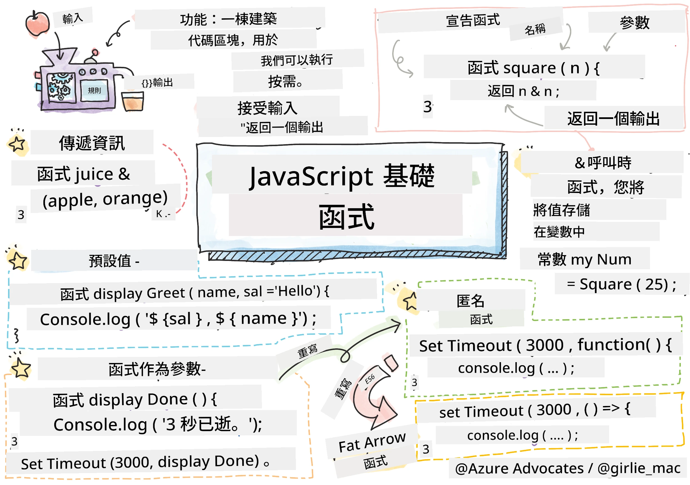
> 手繪筆記作者：[Tomomi Imura](https://twitter.com/girlie_mac)

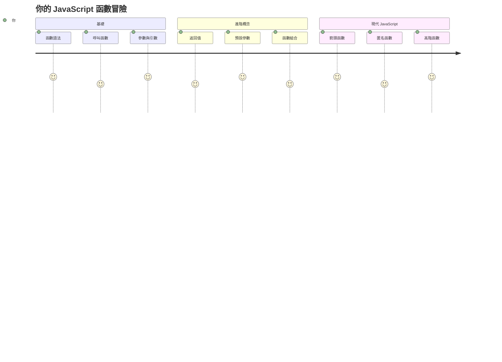
## 課前小測驗
[課前小測驗](https://ff-quizzes.netlify.app)

重複寫同樣的程式碼是程式設計中最常見的挫折之一。函式解決這個問題，讓你可以把程式碼包裝成可重複使用的區塊。可以把函式想像成亨利·福特裝配線中標準化的零件——一旦你建立了可靠的組件，就可以在需要時使用它，而不用重新打造。

函式讓你把程式碼片段打包，方便在整個程式中重複使用。不用到處複製貼上相同的邏輯，你只需建立一次函式，然後隨時呼叫。這種做法讓你的程式碼保持整潔，也讓更新變得輕鬆許多。

在本課中，你將學習如何建立自己的函式、傳遞資訊給它們，並獲取有用的結果。你會理解函式和方法的差異、學習現代語法方式，並看到函式如何與其他函式協作。我們將一步步建立這些概念。

[](https://youtube.com/watch?v=XgKsD6Zwvlc "方法與函式")

> 🎥 點擊上方圖片觀看有關方法與函式的影片。

> 你也可以在 [Microsoft Learn](https://docs.microsoft.com/learn/modules/web-development-101-functions/?WT.mc_id=academic-77807-sagibbon) 上學習這堂課！

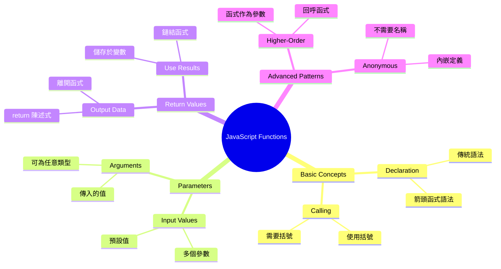
## 函式

函式是獨立的程式碼區塊，用來完成特定任務。它封裝了邏輯，使你能夠在需要時執行。

與其在程式中重複寫相同的程式碼，不如打包成函式，並在需要時呼叫該函式。這讓你的程式碼保持乾淨，也讓維護更容易。想像如果你需要修改散布在 20 個不同位置的邏輯會有多麻煩。

為你的函式取具描述性的名稱非常重要。一個命名良好的函式能清楚傳達它的用途——當你看到 `cancelTimer()` 時，你立刻明白它的功能，就像明確標示的按鈕讓你一看就知道按下後會發生什麼事。

## 創建與呼叫函式

讓我們來看看如何創建函式。語法遵循固定模式：

```javascript
function nameOfFunction() { // 函數定義
 // 函數定義／主體
}
```

來拆解一下：
- `function` 關鍵字告訴 JavaScript「嘿，我要建立函式了！」
- `nameOfFunction` 是你給函式取的描述性名稱
- 括號 `()` 中可以加入參數（我們稍後會說明）
- 大括號 `{}` 包含呼叫函式時會執行的實際程式碼

我們來寫一個簡單的問候函式，看它如何運作：

```javascript
function displayGreeting() {
  console.log('Hello, world!');
}
```

這個函式會在控制台印出「Hello, world!」。一旦定義完成，你就可以隨時呼叫它。

要執行（或「呼叫」）函式，寫函式名稱後跟括號即可。JavaScript 允許你在呼叫函式前或後定義函式，JavaScript 引擎會負責處理執行順序。

```javascript
// 呼叫我們的函數
displayGreeting();
```

執行這行後，函式內的所有程式碼會執行，並在瀏覽器的控制台中顯示「Hello, world!」。你可以重複呼叫這個函式。

### 🧠 **函式基礎檢測：建立你的第一個函式**

**來測試你對基本函式的理解：**
- 為什麼函式定義中使用大括號 `{}`？
- 如果你寫成 `displayGreeting` 而沒有括號會發生什麼事？
- 為什麼你會想多次呼叫同一個函式？

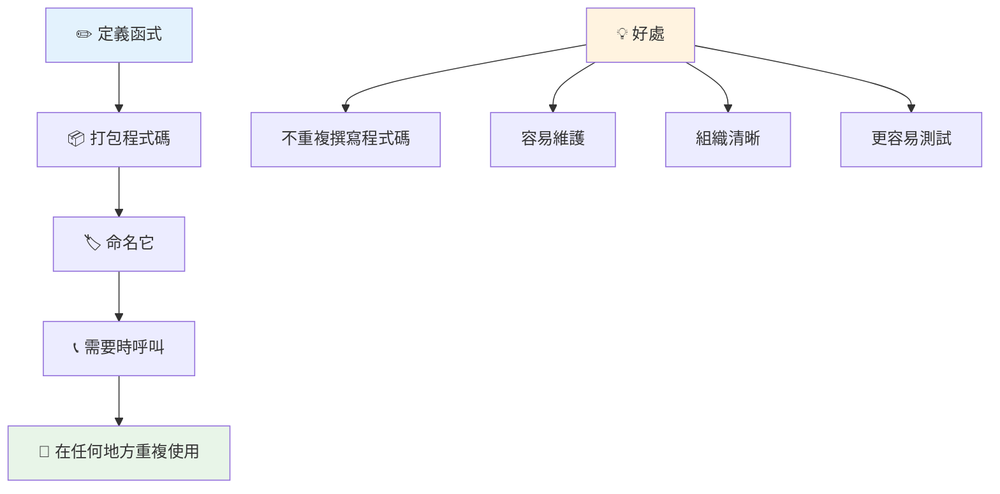
> **注意：** 在這些課程中你一直在使用 **方法**。`console.log()` 是方法——本質上是屬於 `console` 物件的函式。主要區別在於方法附加在物件上，而函式是獨立存在。很多開發者在平常對話中會混用這兩個詞。

### 函式最佳實踐

以下幾點可以幫助你撰寫優秀的函式：

- 為函式取清楚且具描述性的名稱——未來的你會感謝自己！
- 多字名稱使用 **駝峰式命名**（如 `calculateTotal`，而不是 `calculate_total`）
- 保持每個函式專注做好一件事

## 傳遞資訊給函式

我們之前的 `displayGreeting` 函式很有限——它只能印出「Hello, world!」。參數讓函式更靈活、更有用。

**參數** 就像佔位符，每次你呼叫函式時可以放入不同的值。這樣同一個函式就可以在每次呼叫時根據不同資訊執行。

你在定義函式時，在括號內列出參數，多個參數以逗號分隔：

```javascript
function name(param, param2, param3) {

}
```

每個參數就像佔位符——呼叫函式時，使用者會提供實際的值替代這些位置。

我們來改寫問候函式，讓它接受名字參數：

```javascript
function displayGreeting(name) {
  const message = `Hello, ${name}!`;
  console.log(message);
}
```

注意我們用反引號（`` ` ``）和 `${}` 直接把名字代入訊息——這叫做模板字串，是混合變數建立字串的方便方式。

現在呼叫函式時，可以傳入任意名字：

```javascript
displayGreeting('Christopher');
// 執行時顯示「Hello, Christopher!」
```

JavaScript 會把字串 `'Christopher'` 指派給 `name` 參數，並產生個人化訊息「Hello, Christopher!」。

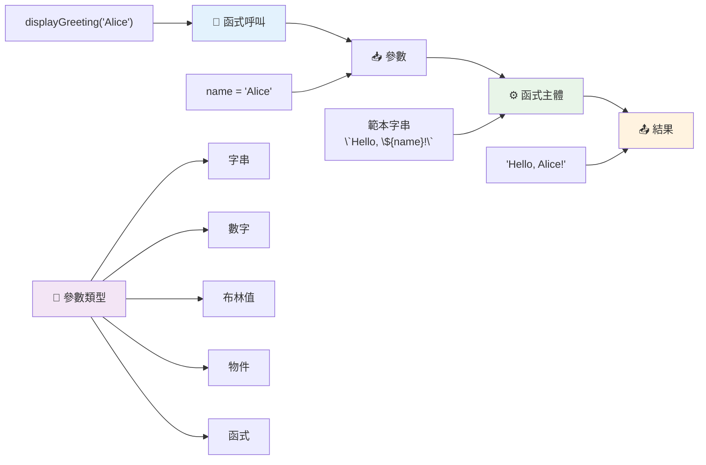
## 預設值

如果我們要讓某些參數可選怎麼辦？這時就用預設值！

假設我們想讓人可以自訂問候詞，但如果不指定，我們就用「Hello」作為預設。你可以用等號設定預設值，就像給變數設定：

```javascript
function displayGreeting(name, salutation='Hello') {
  console.log(`${salutation}, ${name}`);
}
```

這裡 `name` 仍是必須的，但 `salutation` 有預設值 `'Hello'`，如果沒提供別的問候詞就用它。

現在我們可以用兩種不同方式呼叫函式：

```javascript
displayGreeting('Christopher');
// 顯示 "Hello, Christopher"

displayGreeting('Christopher', 'Hi');
// 顯示 "Hi, Christopher"
```

第一次呼叫，因為沒有指定問候詞，JavaScript 就用預設「Hello」。第二次呼叫則用我們自訂的「Hi」。這種彈性讓函式適用於多種場景。

### 🎛️ **參數熟練度檢測：讓函式更彈性**

**測試你對參數的理解：**
- 參數（parameter）和引數（argument）有什麼差別？
- 為什麼預設值在實務編程中很有用？
- 如果傳入的引數比參數多，會發生什麼事？

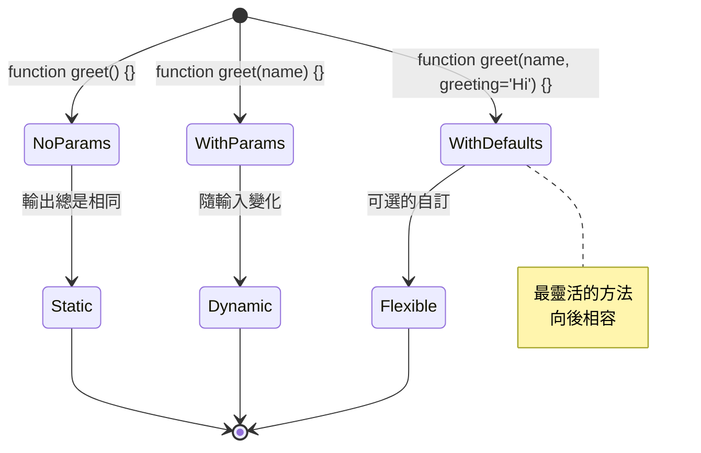
> **專業提示**：預設參數讓你的函式更友善。使用者可以快速用合理預設開始，但也能依需要自訂！

## 回傳值

迄今為止，我們的函式只是印出訊息，但如果你想要函式計算並回傳結果呢？

這時用到 **回傳值**。函式不只是顯示東西，可以把值「交還」給呼叫者，讓你存到變數或用於程式其他地方。

要回傳值，用 `return` 關鍵字，後面接你想回傳的東西：

```javascript
return myVariable;
```

重要的是：函式遇到 `return` 陳述句會立刻停止執行，並把該值返還給呼叫它的地方。

讓我們修改問候函式，讓它回傳訊息，而不是印出：

```javascript
function createGreetingMessage(name) {
  const message = `Hello, ${name}`;
  return message;
}
```

現在函式不是印出問候語，而是建立訊息並回傳給我們。

要使用回傳值，我們可以把它存到變數裡，就像任何其他值：

```javascript
const greetingMessage = createGreetingMessage('Christopher');
```

`greetingMessage` 現在包含「Hello, Christopher」，我們可以任意在程式碼中使用——顯示在網頁上、放入電子郵件，或傳給其他函式。

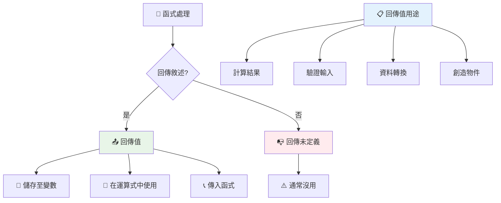
### 🔄 **回傳值檢測：取得結果**

**評估你對回傳值的理解：**
- 函式中 `return` 之後的程式碼會發生什麼？
- 為什麼回傳值通常比直接印到控制台更好？
- 函式能回傳不同類型的值嗎（字串、數字、布林）？

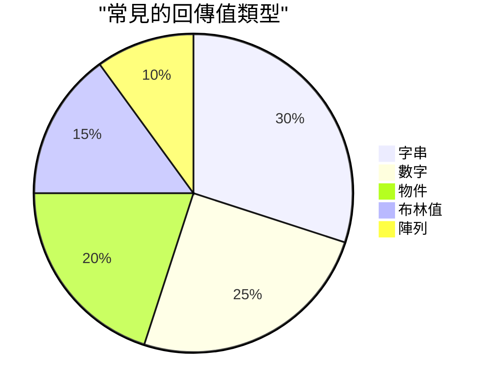
> **關鍵見解**：回傳值函式更靈活，因為呼叫者決定如何使用結果。這讓程式碼更模組化且可重複使用！

## 函式作為其他函式的參數

函式也可以作為參數傳給其它函式。這個概念乍看很複雜，但它是靈活程式編寫的重要特性。

這種模式很常用於「當某事發生時，做這個事」。如「計時器結束時，執行這段程式碼」或「使用者按鈕點擊時，呼叫此函式。」

來看內建的 `setTimeout` 函式，它會等待一段時間，然後執行某段程式碼。得告訴它要執行什麼程式碼——這時傳入函式就是很好的用法！

試試這段程式碼——3 秒後，你會看到訊息：

```javascript
function displayDone() {
  console.log('3 seconds has elapsed');
}
// 計時器數值為毫秒
setTimeout(displayDone, 3000);
```

注意我們把 `displayDone`（沒加括號）傳給 `setTimeout`。我們不是自己呼叫函式，而是交給 `setTimeout`，告訴它「3 秒後呼叫這個函式」。

### 匿名函式

有時候你只需要一個函式做特定事，不想給它名字。想想看——如果你只用一次函式，幹嘛讓程式碼多個名稱？

JavaScript 允許你建立 **匿名函式**——沒有名字、直接在需要地方定義的函式。

我們用匿名函式改寫計時器範例：

```javascript
setTimeout(function() {
  console.log('3 seconds has elapsed');
}, 3000);
```

結果一樣，但函式直接寫在 `setTimeout` 內，免去額外的函式宣告。

### 箭頭函式

現代 JavaScript 有更短的函式寫法，叫做 **箭頭函式**。它用 `=>` （看起來像箭頭）且深受開發者喜愛。

箭頭函式省去了 `function` 關鍵字，可寫出更簡潔的程式碼。

這是用箭頭函式改寫的計時器範例：

```javascript
setTimeout(() => {
  console.log('3 seconds has elapsed');
}, 3000);
```

`()` 是參數（此例為空），然後是箭頭 `=>`，最後是用大括號包裹的函式主體。這給你一樣功能，但語法更精簡。

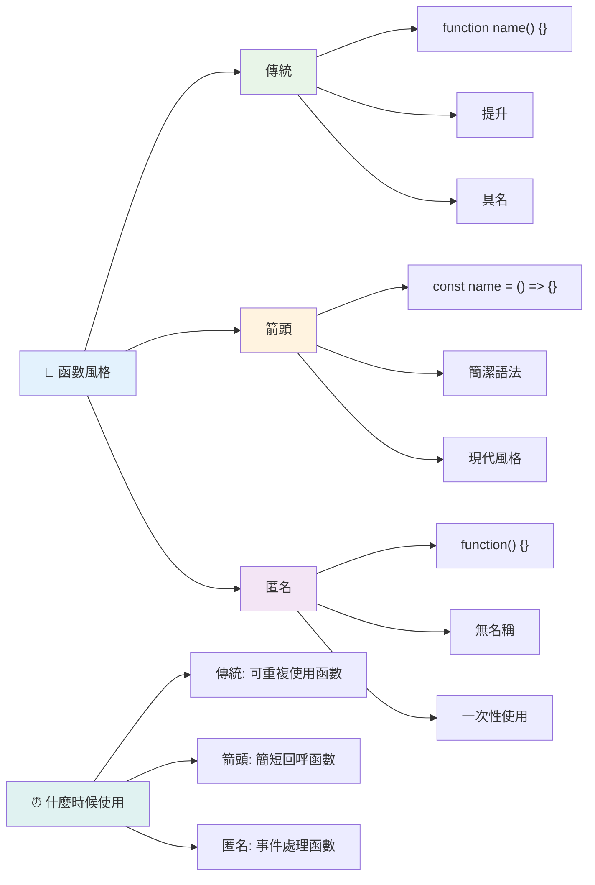
### 何時使用各種寫法

應該何時用哪種方式？實務建議：如果會多次使用函式，給它命名並獨立定義；如果只用一次，考慮匿名函式。箭頭函式和傳統函式語法都行，不過現代 JavaScript 廣泛使用箭頭函式。

### 🎨 **函式風格熟練度檢測：選擇合適的語法**

**測驗你對語法的了解：**
- 什麼時候你會偏好箭頭函式而非傳統函式語法？
- 匿名函式的主要優點是什麼？
- 你能想到哪種情況下命名函式比匿名函式好？

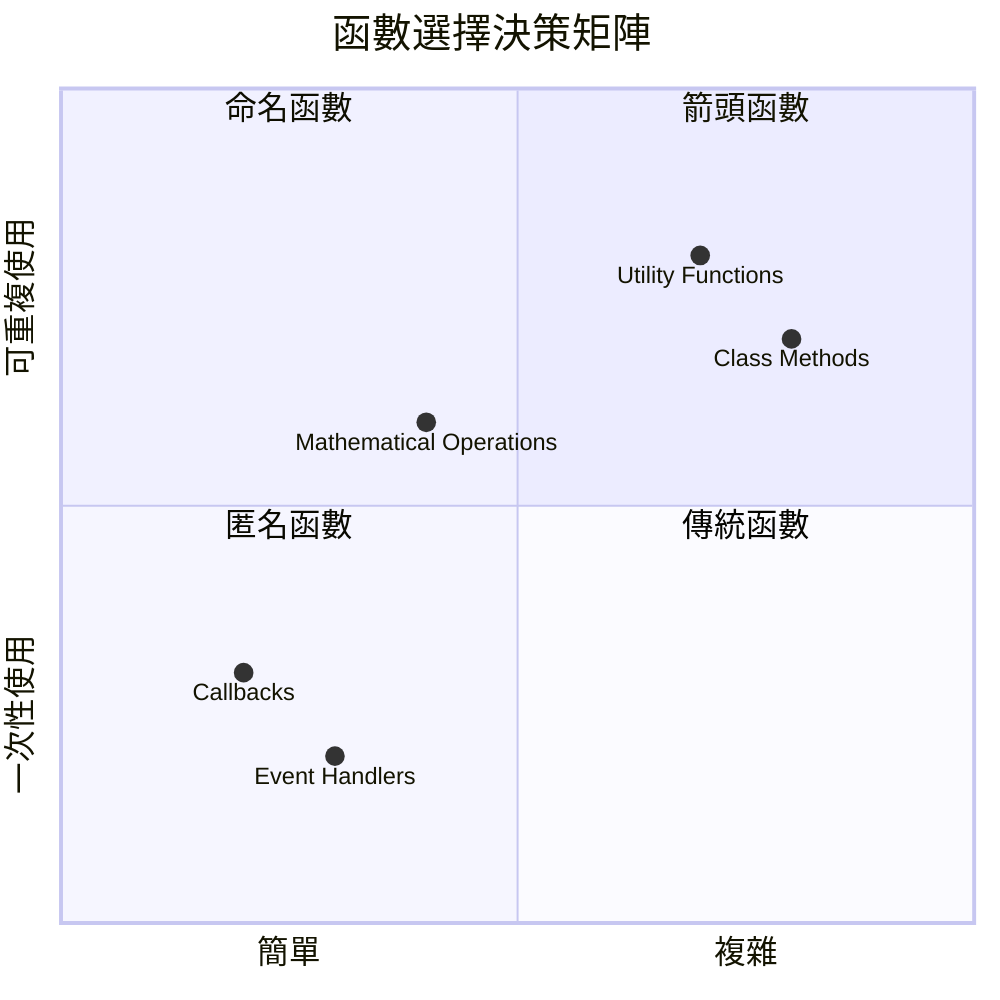
> **現代趨勢**：箭頭函式越來越受歡迎，因為語法簡潔，但傳統函式仍有其地位！

---


## 🚀 挑戰

請試著用一句話說明函式與方法的差異？

## GitHub Copilot Agent 挑戰 🚀

使用 Agent 模式完成以下挑戰：

**描述：** 建立一個數學函式工具庫，示範本課涵蓋的函式概念，包括參數、預設值、回傳值與箭頭函式。

**提示：** 建立一個名為 `mathUtils.js` 的 JavaScript 檔案，包含下列函式：
1. 一個有兩個參數，回傳兩者和的函式 `add`
2. 一個帶有預設參數值的函式 `multiply`（第二個參數預設為 1）
3. 一個箭頭函式 `square`，接受一個數字並回傳平方
4. 一個函式 `calculate`，接受另一個函式及兩個數字參數，並將該函式應用於兩數上
5. 展示各函式的適當測試案例呼叫

了解更多 [Agent 模式](https://code.visualstudio.com/blogs/2025/02/24/introducing-copilot-agent-mode)。

## 課後小測驗
[課後小測驗](https://ff-quizzes.netlify.app)

## 複習與自學

值得多讀一些關於 [箭頭函式](https://developer.mozilla.org/docs/Web/JavaScript/Reference/Functions/Arrow_functions) 的資料，因為它們越來越多用於程式碼庫。練習寫一個函式，然後用這種語法重寫一遍。

## 作業

[函式樂趣](assignment.md)

---

## 🧰 **你的 JavaScript 函式工具包摘要**

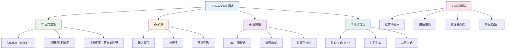
---

## 🚀 你的 JavaScript 函式掌握時間軸

### ⚡ **接下來五分鐘你能做的事**
- [ ] 寫一個簡單函式回傳你最喜歡的數字
- [ ] 建立一個有兩個參數的函式，將二者相加
- [ ] 嘗試將傳統函式轉換為箭頭函式語法
- [ ] 練習本挑戰：解釋函式與方法之間的差異

### 🎯 **你這小時內可以完成的事項**
- [ ] 完成課後測驗並複習任何令人困惑的概念
- [ ] 建構 GitHub Copilot 挑戰中的數學工具庫
- [ ] 創建一個使用另一個函式作為參數的函式
- [ ] 練習撰寫具有預設參數的函式
- [ ] 嘗試在函式回傳值中使用模板字串

### 📅 **你為期一週的函式精通計畫**
- [ ] 創意完成「函式樂趣」作業
- [ ] 將寫過的重複程式碼重構成可重複使用的函式
- [ ] 僅使用函式來建構一個小型計算機（不使用全域變數）
- [ ] 練習使用箭頭函式搭配陣列方法如 `map()` 和 `filter()`
- [ ] 建立一組常用任務的工具函式集合
- [ ] 研究高階函式與函式式程式設計概念

### 🌟 **你為期一個月的蛻變計畫**
- [ ] 精通進階函式概念，如閉包與作用域
- [ ] 建構一個大量使用函式組合的專案
- [ ] 透過改進函式文件來貢獻開源專案
- [ ] 教導他人函式及不同語法風格
- [ ] 探索 JavaScript 中的函式式程式設計範式
- [ ] 建立個人可重用函式庫供未來專案使用

### 🏆 **最終函式冠軍檢視**

**慶祝你的函式精通：**
- 到目前為止你創建的最有用函式是什麼？
- 學習函式後，你對程式碼組織的思考方式有何改變？
- 你偏好哪種函式語法？為什麼？
- 你會透過撰寫函式解決什麼現實世界的問題？

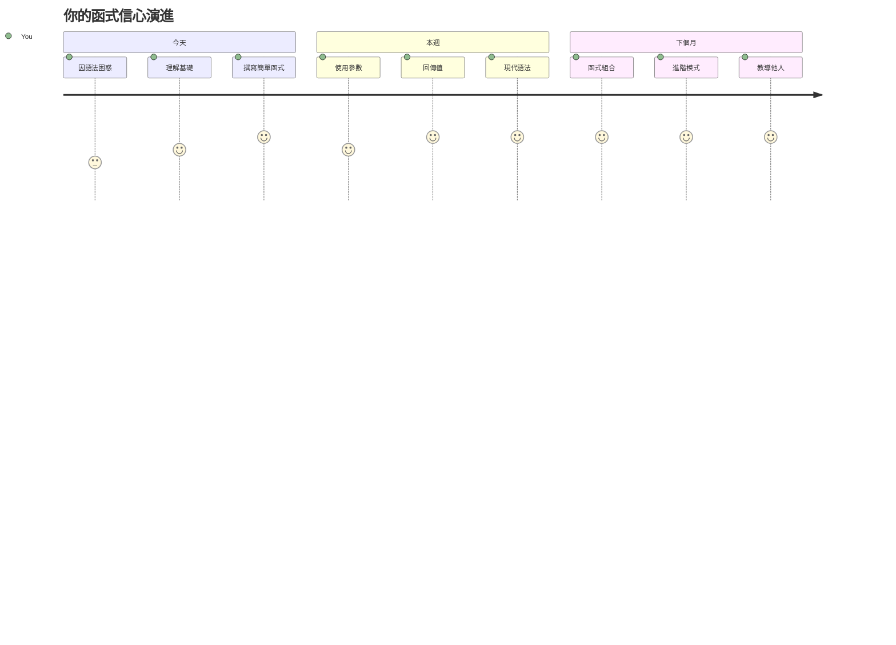
> 🎉 **你已經精通程式設計中最強大的概念之一了！** 函式是大型程式的基石。你未來開發的每個應用都會用到函式來組織、重複使用及結構化程式碼。你現在了解如何將邏輯包裝成可重複使用的元件，讓你成為更有效率及高效能的程式設計師。歡迎來到模組化程式設計的世界！🚀

---

<!-- CO-OP TRANSLATOR DISCLAIMER START -->
**免責聲明**：  
本文件係使用AI翻譯服務[Co-op Translator](https://github.com/Azure/co-op-translator)進行翻譯。雖然我們力求準確，但請注意自動翻譯可能存在錯誤或不準確之處。原始文件的母語版本應視為權威來源。對於重要資訊，建議尋求專業人工翻譯。我們不對因使用本翻譯而產生的任何誤解或誤讀承擔責任。
<!-- CO-OP TRANSLATOR DISCLAIMER END -->