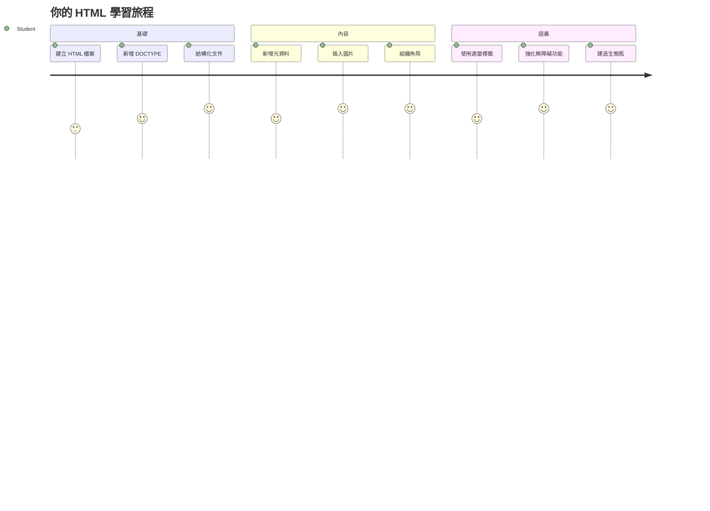
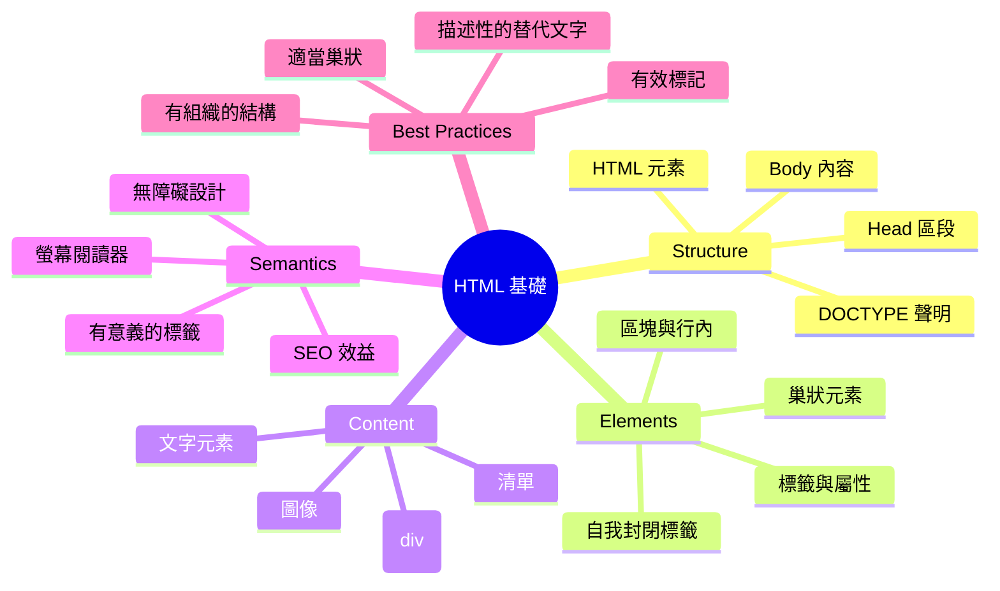
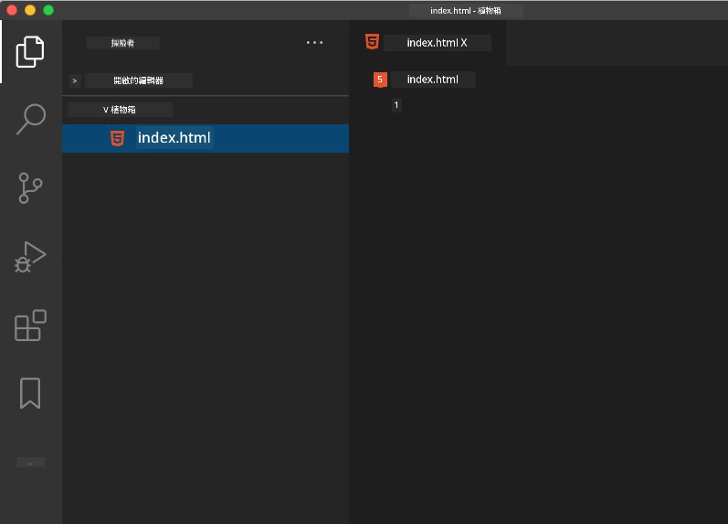
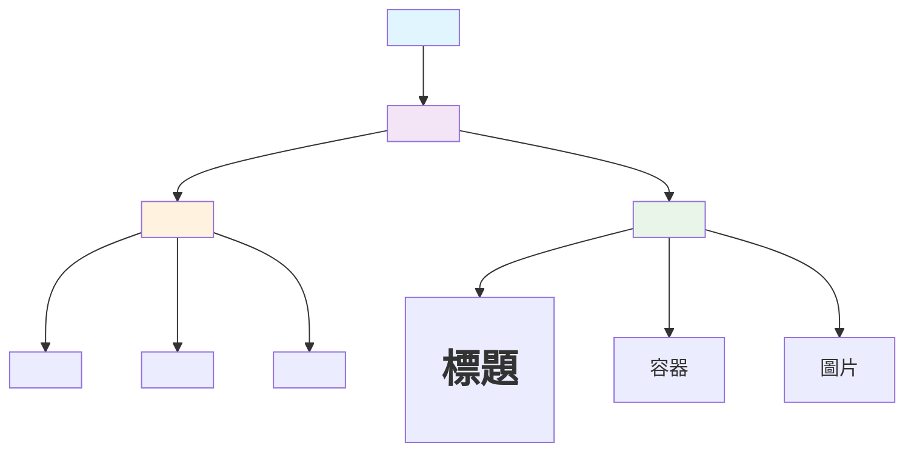
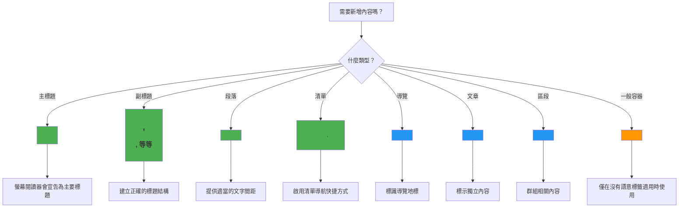
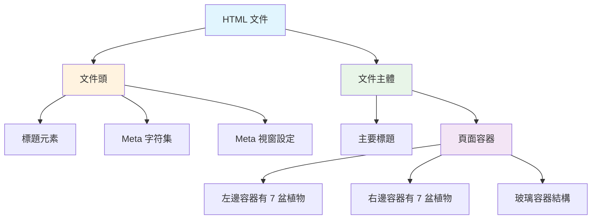
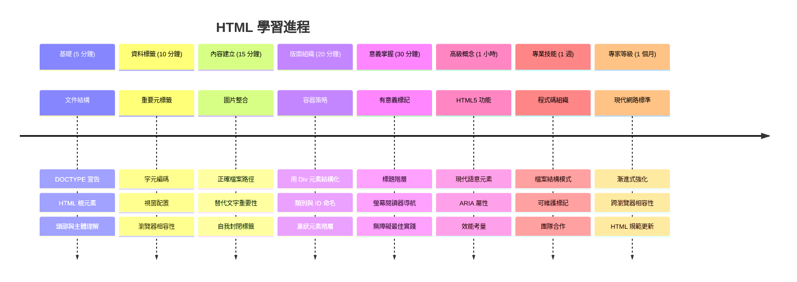

# Terrarium 專案第一部分：HTML 入門



> 速寫筆記由 [Tomomi Imura](https://twitter.com/girlie_mac) 製作

HTML，也就是超文字標記語言，是你曾經造訪過的每個網站的基礎。想像 HTML 是賦予網頁結構的骨架——它定義了內容放置的位置、組織方式，以及每個部分的意義。CSS 稍後會用色彩和版面來「裝扮」你的 HTML，JavaScript 會帶來互動效果，但 HTML 提供了讓一切成為可能的基本結構。

在本課程中，你將為虛擬的玻璃容器介面建立 HTML 結構。這個實作專案會教你基本的 HTML 概念，同時打造出視覺吸引人的作品。你會學習如何使用語意元素組織內容、操作圖片，並為互動式網頁應用奠定基礎。

完成本課程後，你將擁有一個運作中的 HTML 頁面，顯示以有組織欄位排放的植物圖片，準備在下一課進行樣式設定。別擔心剛開始看起來很基礎——這正是 HTML 在 CSS 加入視覺修飾前應該做的事。


## 課前小測驗

[課前小測驗](https://ff-quizzes.netlify.app/web/quiz/15)

> 📺 **觀看學習**：看看這段有用的影片概述
> 
> [](https://www.youtube.com/watch?v=1TvxJKBzhyQ)

## 設置你的專案

在深入 HTML 程式碼之前，先為你的玻璃容器專案建立一個適當的工作空間。從一開始就建立有組織的檔案結構，是一個非常重要的習慣，會在你的網頁開發旅程中幫助你很多。

### 任務：建立你的專案結構

你將為玻璃容器專案創建一個專用的資料夾，並加入第一個 HTML 檔案。以下是兩種做法：

**選項一：使用 Visual Studio Code**
1. 開啟 Visual Studio Code
2. 點選「檔案」→「開啟資料夾」或使用 `Ctrl+K, Ctrl+O`（Windows/Linux）或 `Cmd+K, Cmd+O`（Mac）
3. 建立新資料夾，命名為 `terrarium` 並選取它
4. 在檔案總管窗格點擊「新增檔案」圖示
5. 檔名命名為 `index.html`



**選項二：使用終端機指令**
```bash
mkdir terrarium
cd terrarium
touch index.html
code index.html
```

**這些指令完成了以下動作：**
- **建立** 新目錄 `terrarium` 作為專案資料夾
- **切換** 進入 terrarium 目錄 
- **建立** 空白的 `index.html` 檔案
- **使用** Visual Studio Code 開啟該檔案以便編輯

> 💡 **專家小提示**：檔名 `index.html` 在網頁開發中很特別。瀏覽器拜訪網站時會自動尋找 `index.html` 當作預設顯示頁面。這表示像 `https://mysite.com/projects/` 這類 URL 不用特別指定檔名，就會載入 projects 資料夾裡的 `index.html`。

## 理解 HTML 文件結構

每份 HTML 文件都有瀏覽器需要理解且正確顯示的特定結構。把這結構當作正式信件——有特定順序的必要元素，幫助收件者（這裡是瀏覽器）正確處理內容。


先從加入每份 HTML 文件都需要的基本架構開始。

### DOCTYPE 宣告和根元素

任何 HTML 檔案的前兩行是文件向瀏覽器的「介紹」：

```html
<!DOCTYPE html>
<html></html>
```

**這段程式碼的功能解析：**
- **宣告** 文件類型為 HTML5，使用 `<!DOCTYPE html>`
- **建立** 包含所有頁面內容的根 `<html>` 元素
- **確立** 現代網路標準，確保瀏覽器正確呈現
- **保證** 在不同瀏覽器和設備下呈現一致

> 💡 **VS Code 小技巧**：在 VS Code 中將滑鼠停留在任何 HTML 標籤上，可看到 MDN Web Docs 的有用資訊，包括用法範例和瀏覽器相容性說明。

> 📚 **進階知識**：DOCTYPE 宣告可避免瀏覽器進入「怪異模式」，該模式用於支援非常舊的網站。現代網頁開發採用簡單的 `<!DOCTYPE html>`，確保[標準相容的渲染](https://developer.mozilla.org/docs/Web/HTML/Quirks_Mode_and_Standards_Mode)。

### 🔄 **學習檢視點**
**暫停並思考**：繼續前，確保你理解以下要點：
- ✅ 為何每份 HTML 文件都需 DOCTYPE 宣告
- ✅ `<html>` 根元素包含什麼
- ✅ 這種結構如何幫助瀏覽器正確渲染頁面

**快速自我測驗**：你能用自己的話說明「標準相容渲染」是什麼意思嗎？

## 添加重要的文件元資料

HTML 文件的 `<head>` 區段包含瀏覽器與搜尋引擎需要但訪客不直接看見的重要資訊。想像它是幕後資訊，幫助你的網頁正常運作，並在不同設備和平台上正確顯示。

這些元資料告訴瀏覽器如何顯示頁面、使用哪種字元編碼，以及如何因應不同螢幕尺寸——這些都是打造專業且可及性良好的網頁必備條件。

### 任務：加入文件的 head

將這段 `<head>` 內容插入你的 `<html>` 開始及結束標籤之間：

```html
<head>
	<title>Welcome to my Virtual Terrarium</title>
	<meta charset="utf-8" />
	<meta http-equiv="X-UA-Compatible" content="IE=edge" />
	<meta name="viewport" content="width=device-width, initial-scale=1" />
</head>
```

**拆解各元素作用：**
- **設定** 出現在瀏覽器分頁和搜尋結果的頁面標題
- **指定** 使用 UTF-8 字元編碼，確保全球文字正確顯示
- **保證** 與現代版本 Internet Explorer 兼容
- **配置** 螢幕視窗大小與設備寬度同步，支援響應式設計
- **控制** 初始縮放比例，內容自然呈現大小

> 🤔 **思考看看**：如果你將 viewport meta 標籤設為 `<meta name="viewport" content="width=600">` 會怎樣？這會強制頁面寬度永遠是 600 像素，破壞響應式設計！進一步了解[正確的 viewport 設定](https://developer.mozilla.org/docs/Web/HTML/Viewport_meta_tag)。

## 建立文件主體內容

`<body>` 元素包含網頁的所有可見內容——使用者將看見並互動的所有東西。與提供瀏覽器指令的 `<head>` 不同，`<body>` 則包含實際內容：文字、圖片、按鈕，以及建構使用者介面的其他元素。

讓我們加入主體結構，並了解 HTML 標籤如何協作產生有意義的內容。

### 理解 HTML 標籤結構

HTML 使用配對標籤來定義元素。大多數標籤有一個開啟標籤，如 `<p>`，及一個關閉標籤，如 `</p>`，中間包含內容：`<p>Hello, world!</p>`。這建立了一個包含「Hello, world!」文字的段落元素。

### 任務：加入 body 元素

更新你的 HTML 檔案，加入 `<body>` 元素：

```html
<!DOCTYPE html>
<html>
	<head>
		<title>Welcome to my Virtual Terrarium</title>
		<meta charset="utf-8" />
		<meta http-equiv="X-UA-Compatible" content="IE=edge" />
		<meta name="viewport" content="width=device-width, initial-scale=1" />
	</head>
	<body></body>
</html>
```

**完整結構提供以下功能：**
- **建立** 基本的 HTML5 文件架構
- **包含** 重要元資料，保證瀏覽器正確渲染
- **創建** 空白主體等待顯示內容
- **遵循** 現代網頁開發最佳實務

現在你準備添加玻璃容器的可見元素。我們會使用 `<div>` 元素作為容器，組織不同的內容區塊，以及 `` 元素來顯示植物圖片。

### 操作圖片與版面容器

圖片在 HTML 中很特別，因為它們用「自我封閉」的標籤。與像 `<p></p>` 這種包覆內容的元素不同，`` 標籤內使用屬性（例如 `src` 指定圖片路徑，`alt` 提供輔助功能）包含所有必要資訊。

在把圖片加入 HTML 前，你需要先建立資料夾並整理專案檔案。

**首先設定你的圖片：**
1. 在 terrarium 專案資料夾內建立 `images` 資料夾
2. 從[解答資料夾](../../../../3-terrarium/solution/images)下載植物圖片（共14張）
3. 複製所有植物圖片到新建的 `images` 資料夾中

### 任務：建立植物展示版面

現在在 `<body></body>` 標籤間加入以兩欄組織的植物圖片：

```html
<div id="page">
	<div id="left-container" class="container">
		<div class="plant-holder">
			
		</div>
		<div class="plant-holder">
			
		</div>
		<div class="plant-holder">
			
		</div>
		<div class="plant-holder">
			
		</div>
		<div class="plant-holder">
			
		</div>
		<div class="plant-holder">
			
		</div>
		<div class="plant-holder">
			
		</div>
	</div>
	<div id="right-container" class="container">
		<div class="plant-holder">
			
		</div>
		<div class="plant-holder">
			
		</div>
		<div class="plant-holder">
			
		</div>
		<div class="plant-holder">
			
		</div>
		<div class="plant-holder">
			
		</div>
		<div class="plant-holder">
			
		</div>
		<div class="plant-holder">
			
		</div>
	</div>
</div>
```

**這段程式碼的逐步解釋：**
- **建立** 一個 `id="page"` 的主要頁面容器，包含所有內容
- **設置** 兩個欄位容器：`left-container` 和 `right-container`
- **將** 7 株植物在左欄，7 株植物在右欄排列
- **每張** 植物圖片用 `plant-holder` div 包裹，方便個別定位
- **採用** 一致的 class 名稱，方便下一課搭配 CSS 美化
- **每株** 植物圖片有獨特 ID，以便稍後用 JavaScript 操控
- **指定** 正確的檔案路徑指向 images 目錄

> 🤔 **思考看看**：目前所有圖片的 alt 文字都寫成「plant」。這對於輔助使用者不是很好。螢幕閱讀器會連續重複「plant」14次，沒辦法知道每張圖實際是什麼植物。你能想到更具描述性的 alt 文字，改善可及性嗎？

> 📝 **HTML 元素類型**：`<div>` 為「區塊元素」，會佔滿整行寬度，`<span>` 為「行內元素」，只佔必要寬度。如果你將所有 `<div>` 改成 `<span>`，你覺得會發生什麼狀況？

### 🔄 **學習檢視點**
**結構理解**：花點時間回顧你的 HTML 結構：
- ✅ 能否找出佈局中的主要容器？
- ✅ 明白為何每張圖片有唯一 ID 嗎？
- ✅ 如何描述 `plant-holder` div 的用途？

**視覺檢查**：在瀏覽器開啟你的 HTML 檔案，你應該會看到：
- 一份基礎的植物圖片列表
- 兩欄呈現的圖片排列
- 簡單、未經樣式設定的版面

**記住**：在 CSS 加入前，HTML 本該就是這樣普通的外觀！

加入這些標記後，植物會出現在畫面上，雖然尚未美觀完成——這就是下一課的 CSS 會負責的。此刻，你已有穩固的 HTML 基礎，可有效組織內容並遵循可及性最佳實踐。

## 使用語意 HTML 促進可及性

語意 HTML 意味著依據意義和用途選擇 HTML 元素，而非僅依外觀。使用語意標記，你是在向瀏覽器、搜尋引擎和協助技術（如螢幕閱讀器）傳達內容的結構與意義。


此方法讓你的網站對殘障使用者更友善，並幫助搜尋引擎更好地理解內容。這是現代網頁開發重要原則，能為所有人創造更佳體驗。

### 加入語意頁面標題

讓我們為玻璃容器頁加入適當的標題。將以下行插入在 `<body>` 開始標籤後面：

```html
<h1>My Terrarium</h1>
```

**為何語意標記重要：**
- **協助** 螢幕閱讀器導航與理解頁面結構
- **提升** 搜尋引擎優化（SEO），明確內容層級
- **增強** 視障與認知差異使用者的可及性
- **創造** 跨設備與平台的良好使用體驗
- **遵循** 網頁標準與專業開發最佳實務

**語意與非語意元素比較：**

| 用途 | ✅ 語意選擇 | ❌ 非語意選擇 |
|---------|-------------------|------------------------|
| 主要標題 | `<h1>標題</h1>` | `<div class="big-text">標題</div>` |
| 導航 | `<nav><ul><li></li></ul></nav>` | `<div class="menu"><div></div></div>` |
| 按鈕 | `<button>點擊我</button>` | `<span onclick="...">點擊我</span>` |
| 文章內容 | `<article><p></p></article>` | `<div class="content"><div></div></div>` |

> 🎥 **示範影片**：觀看 [螢幕閱讀器如何與網頁互動](https://www.youtube.com/watch?v=OUDV1gqs9GA)，理解為何語意標記對可及性至關重要。留意正確 HTML 結構如何協助使用者高效導航。

## 建立玻璃容器結構

現在讓我們加入玻璃容器本身的 HTML 結構——這是未來放置植物的玻璃盒子。這部分展示了重要概念：HTML 提供結構，但沒有 CSS 樣式前，這些元素不會有可視效果。

玻璃容器標記使用描述性類別名稱，讓下一課的 CSS 美化更直覺且易維護。

### 任務：加入玻璃容器結構

將此標記插入最後一個 `</div>` 標籤之前（頁面容器的關閉標籤前）：

```html
<div id="terrarium">
	<div class="jar-top"></div>
	<div class="jar-walls">
		<div class="jar-glossy-long"></div>
		<div class="jar-glossy-short"></div>
	</div>
	<div class="dirt"></div>
	<div class="jar-bottom"></div>
</div>
```

**理解這個玻璃容器結構：**
- **建立** 一個主玻璃容器，具有獨特的 ID 以便樣式設定
- **定義** 每個視覺元件的獨立元素（頂部、牆壁、泥土、底部）
- **包含** 用於玻璃反射效果的巢狀元素（有光澤的元素）
- **使用** 清楚表明每個元素用途的描述性類名
- **準備** 用於 CSS 樣式以創建玻璃容器外觀的結構

> 🤔 **注意到什麼了嗎？**：即使你已經新增了這些標記，你在頁面上並不會看到任何新東西！這完美說明了 HTML 提供結構，而 CSS 提供外觀。這些 `<div>` 元素存在，但尚未有任何視覺樣式——這會在下一課中加入！


### 🔄 **教學檢查點**
**HTML 結構掌握**：在繼續之前，請確保你能：
- ✅ 解釋 HTML 結構和視覺外觀之間的差異
- ✅ 識別語義 versus 非語義的 HTML 元素
- ✅ 描述適當標記如何有利於無障礙設計
- ✅ 辨識完整的文件樹結構

**測試你的理解**：嘗試在瀏覽器中關閉 JavaScript 並移除 CSS 後開啟你的 HTML 檔案。這可讓你看到你建立的純粹語義結構！

---

## GitHub Copilot Agent 挑戰

使用 Agent 模式完成以下挑戰：

**描述：** 創建一個語義化的 HTML 結構，用於加入玻璃容器專案的植物護理指南區塊。

**提示：** 建立一個語義化的 HTML 區段，其中包括主要標題「Plant Care Guide」，三個子區段，分別有標題「Watering」、「Light Requirements」和「Soil Care」，每個子區段包含一段關於植物護理的資訊。使用適當語義 HTML 標籤如 `<section>`, `<h2>`, `<h3>`, 和 `<p>` 來正確組織內容。

在這裡了解更多關於 [agent mode](https://code.visualstudio.com/blogs/2025/02/24/introducing-copilot-agent-mode) 。

## 探索 HTML 歷史挑戰

**了解網路演進**

HTML 自 1990 年 Tim Berners-Lee 在 CERN 創造第一個瀏覽器以來已經有重大演變。一些舊標籤如 `<marquee>` 因不符合現代無障礙標準及響應式設計原則而被淘汰。

**嘗試實驗：**
1. 臨時使用 `<marquee>` 標籤包裹你的 `<h1>` 標題：`<marquee><h1>My Terrarium</h1></marquee>`
2. 在瀏覽器中打開頁面，觀察滾動效果
3. 思考此標籤被淘汰的原因（提示：用戶體驗與無障礙設計）
4. 移除 `<marquee>` 標籤，回復使用語義標記

**反思問題：**
- 滾動標題會如何影響視覺障礙或動態敏感的使用者？
- 哪些現代 CSS 技術可更無障礙地實現類似視覺效果？
- 為何使用當代網路標準比使用淘汰標籤更重要？

進一步探索 [過時和淘汰的 HTML 元素](https://developer.mozilla.org/docs/Web/HTML/Element#Obsolete_and_deprecated_elements)，了解網路標準如何演進以提升使用者體驗。

## 課後測驗

[課後測驗](https://ff-quizzes.netlify.app/web/quiz/16)

## 複習與自主學習

**深化你的 HTML 知識**

HTML 已是網路基礎超過 30 年，從簡單的文件標記語言演進為構建互動應用的複雜平台。了解其演變能幫助你欣賞現代網路標準並做出更佳開發決策。

**推薦學習路徑：**

1. **HTML 歷史與演進**
   - 研究從 HTML 1.0 到 HTML5 的時間軸
   - 探討某些標籤被淘汰的原因（無障礙性、行動友善、可維護性）
   - 調查新興的 HTML 功能與提案

2. **語義 HTML 深入**
   - 研讀完整的 [HTML5 語義元素列表](https://developer.mozilla.org/docs/Web/HTML/Element)
   - 練習何時使用 `<article>`、`<section>`、`<aside>` 和 `<main>`
   - 了解提升無障礙設計的 ARIA 屬性

3. **現代網頁開發**
   - 探索 [Microsoft Learn 上的響應式網站建置](https://docs.microsoft.com/learn/modules/build-simple-website/?WT.mc_id=academic-77807-sagibbon)
   - 理解 HTML 如何與 CSS 與 JavaScript 整合
   - 學習網頁效能與 SEO 最佳實踐

**反思問題：**
- 你發現了哪些被淘汰的 HTML 標籤？它們為何被移除？
- 有哪些新 HTML 功能正在為未來版本提出？
- 語義 HTML 如何促進網路無障礙及 SEO？

### ⚡ **接下來 5 分鐘可做事**
- [ ] 開啟 DevTools (F12)，檢視你最喜歡網站的 HTML 結構
- [ ] 建立一個簡單 HTML 檔案，包含基本標籤：`<h1>`, `<p>`, 和 ``
- [ ] 使用 W3C HTML Validator 線上驗證 HTML
- [ ] 試著在 HTML 中加入註解 `<!-- comment -->`

### 🎯 **這一小時能達成的事**
- [ ] 完成課後測驗並複習語義 HTML 概念
- [ ] 使用正確的 HTML 結構建立一個關於你的簡易網頁
- [ ] 試驗不同標題等級及文字格式化標籤
- [ ] 新增圖片和連結，練習多媒體整合
- [ ] 研究尚未嘗試過的 HTML5 功能

### 📅 **為期一週的 HTML 旅程**
- [ ] 完成具語義標記的玻璃容器專案任務
- [ ] 建立使用 ARIA 標籤和角色的無障礙網頁
- [ ] 練習建立各種輸入類型的表單
- [ ] 探索 HTML5 API，例如 localStorage 或地理位置
- [ ] 研習響應式 HTML 模式及行動優先設計
- [ ] 檢視其他開發者的 HTML 代碼，學習最佳實踐

### 🌟 **為期一個月的網頁基礎**
- [ ] 建立展示 HTML 精通度的作品集網站
- [ ] 學習使用 Handlebars 等框架做 HTML 範本
- [ ] 透過改善 HTML 文件貢獻開源專案
- [ ] 精通進階 HTML 概念如自訂元素
- [ ] 將 HTML 與 CSS 框架及 JavaScript 函式庫整合
- [ ] 指導其他學習 HTML 基礎的人

## 🎯 你的 HTML 精通時間表


### 🛠️ 你的 HTML 工具箱摘要

完成本課後，你已具備：
- **文件結構**：完整的 HTML5 基礎與正確 DOCTYPE
- **語義標記**：增強無障礙與 SEO 的有意義標籤
- **圖片整合**：妥善的檔案組織與替代文字使用
- **佈局容器**：策略性使用帶描述性類名的 div
- **無障礙意識**：瞭解螢幕閱讀器的導航方式
- **現代標準**：當前 HTML5 實務及淘汰標籤知識
- **專案基礎**：為 CSS 樣式與 JavaScript 互動打好基礎

**下一步**：你的 HTML 結構已準備好進行 CSS 樣式設計！你所建立的語義基礎會讓下一課更易理解。

## 作業

[練習你的 HTML：製作一個部落格樣板](assignment.md)

---

<!-- CO-OP TRANSLATOR DISCLAIMER START -->
**免責聲明**：  
本文件係使用 AI 翻譯服務 [Co-op Translator](https://github.com/Azure/co-op-translator) 所翻譯。儘管我們致力於確保準確性，但請注意，自動翻譯可能包含錯誤或不精確之處。原始文件的母語版本應被視為權威來源。對於重要資訊，建議採用專業人工翻譯。我們不對因使用本翻譯而產生的任何誤解或誤譯負責。
<!-- CO-OP TRANSLATOR DISCLAIMER END -->