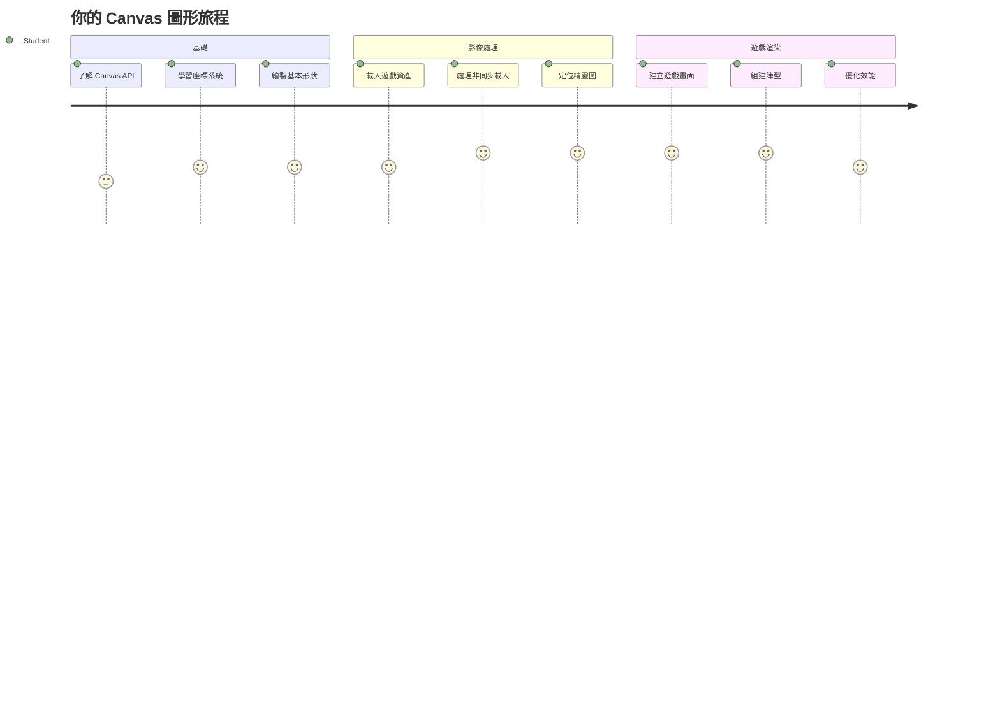
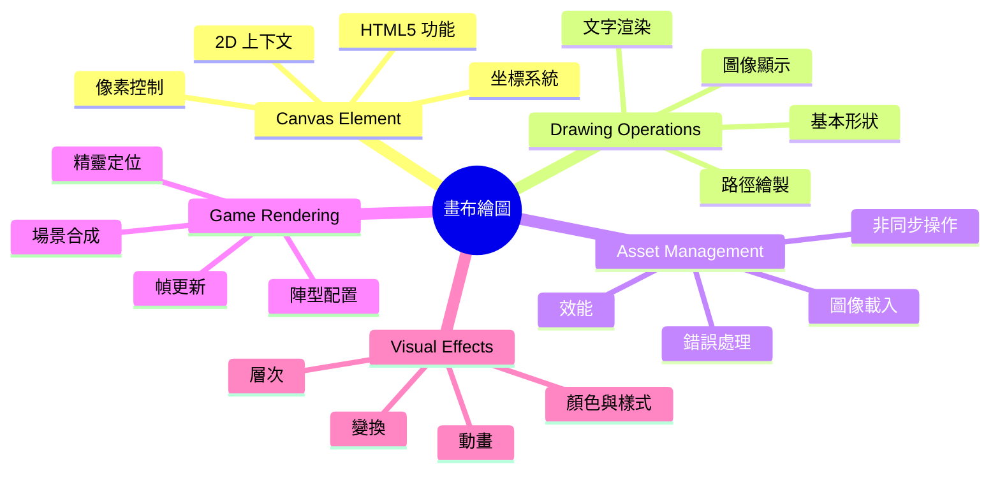
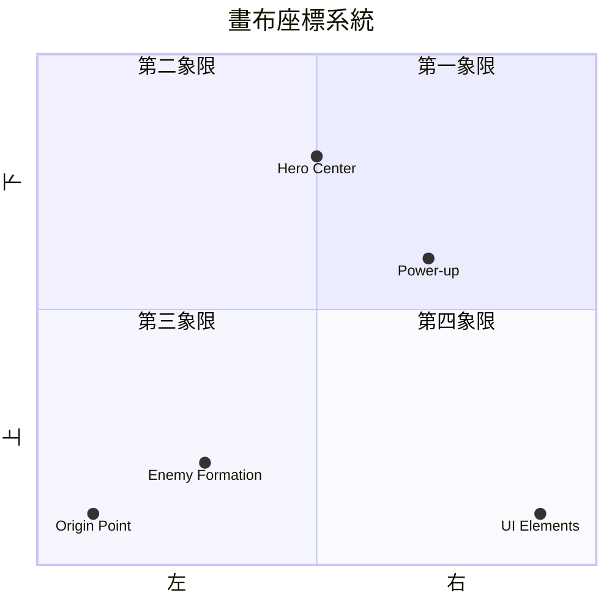
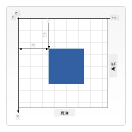
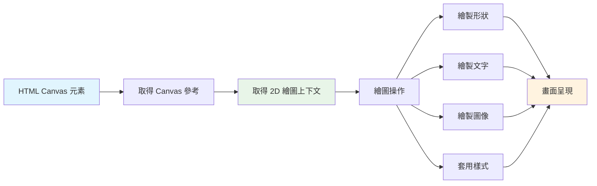
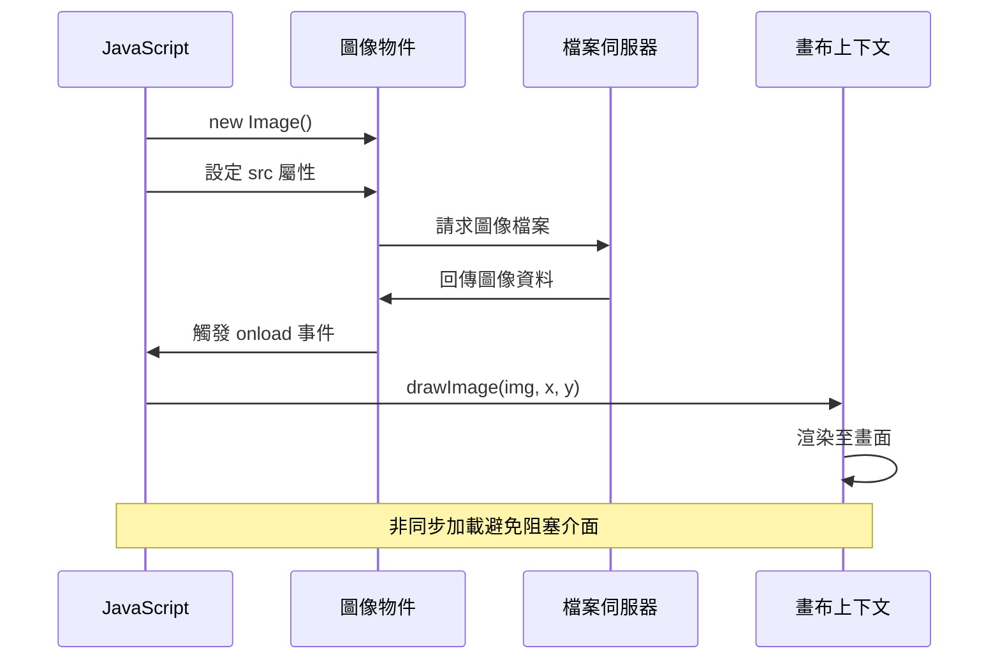
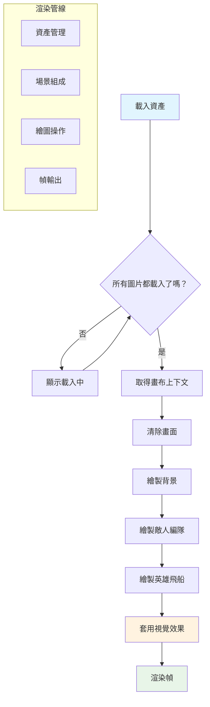
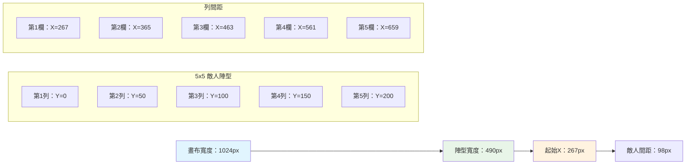
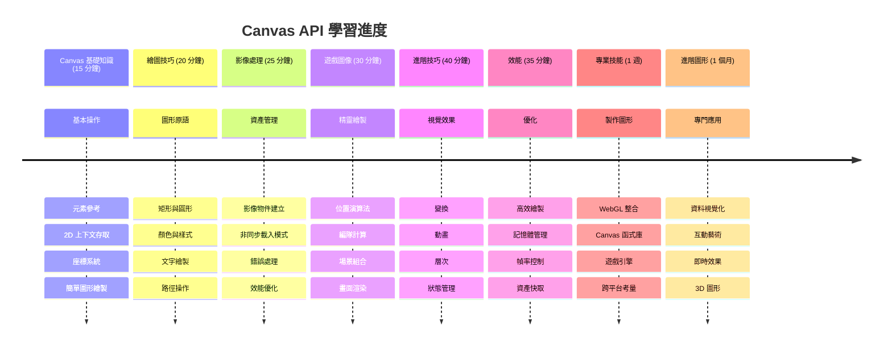

# 建造太空遊戲 第2部分：將英雄與怪物繪製到畫布上


Canvas API 是網頁開發中最強大的功能之一，可在瀏覽器中即時創建動態且互動的圖像。在本課程中，我們將把那個空白的 HTML `<canvas>` 元素變成充滿英雄與怪物的遊戲世界。你可以把 Canvas 想像成你的數位畫布，程式碼就是你的畫筆。

我們將建立在上一課所學的基礎上，現在要深入視覺部分。你將學會如何載入並顯示遊戲精靈圖(sprite)、精確地定位元素，以及為你的太空遊戲建立視覺基礎。這彌合了靜態網頁與動態、互動體驗之間的差距。

完成本課後，你將擁有一個完整的遊戲場景，英雄飛船正確定位，敵軍編隊已準備好戰鬥。你將了解現代遊戲如何在瀏覽器中渲染圖形，並獲得打造自己互動視覺體驗的技能。讓我們探索 Canvas 圖形，讓你的太空遊戲栩栩如生吧！


## 課前小測驗

[課前小測驗](https://ff-quizzes.netlify.app/web/quiz/31)

## Canvas

那麼 `<canvas>` 元素到底是什麼？它是 HTML5 用於在網頁瀏覽器中創建動態圖形與動畫的解決方案。與靜態的普通圖片或影片不同，canvas 讓你能像素級別地控制畫面上的所有元素。這使它非常適合用來開發遊戲、資料視覺化和互動藝術。你可以把它當成程式化的繪圖表面，JavaScript 就是你的油畫筆。

預設情況下，畫布元素看起來像頁面上的一個空白透明矩形。但這正是潛力所在！當你用 JavaScript 畫形狀、載入圖片、製作動畫並讓物件對使用者互動做出反應時，canvas 才展現出真正的威力。這和 1960 年代貝爾實驗室的早期電腦圖形先驅必須為每一個像素編寫程式以創建第一批數位動畫的方式相似。

✅ 在 MDN 上閱讀更多有關 [Canvas API](https://developer.mozilla.org/docs/Web/API/Canvas_API)。

它通常這樣被宣告，作為頁面主體的一部分：

```html
<canvas id="myCanvas" width="200" height="100"></canvas>
```
  
**這段程式碼做了什麼：**  
- **設定** `id` 屬性方便你用 JavaScript 參考這個特定的 canvas 元素  
- **定義** 以像素為單位的 `width`，控制 canvas 的水平大小  
- **設定** 以像素為單位的 `height`，決定 canvas 的垂直尺寸  

## 繪製簡單幾何圖形

既然你知道了 canvas 元素是什麼，我們來實際嘗試在上面繪圖吧！canvas 使用的座標系統可能讓你想起數學課，但有一個針對電腦圖形特別的關鍵差異。

canvas 採用笛卡兒座標系，有 x 軸（水平）與 y 軸（垂直）來定位你所繪製的元素。但重點是：與數學課中的座標系不同，原點 `(0,0)` 是放在左上角，x 值向右遞增，y 值向下遞增。這套做法來自早期電腦顯示器電子束自上而下掃描的方式，左上即為自然起點。


  
> 圖片來源：[MDN](https://developer.mozilla.org/docs/Web/API/Canvas_API/Tutorial/Drawing_shapes)

在 canvas 元素上繪圖，你需要遵循所有 canvas 圖形基礎的三個步驟。多練習幾次後，這將成為你的第二天性：


1. **從 DOM 中取得參考**：就像其他任何 HTML 元素一樣，取得 canvas 元素  
2. **取得 2D 繪圖上下文**：提供所有繪圖相關方法的物件  
3. **開始繪圖！** 利用該上下文的內建方法進行繪製  

程式碼示範如下：

```javascript
// 第一步：取得畫布元素
const canvas = document.getElementById("myCanvas");

// 第二步：取得2D繪圖上下文
const ctx = canvas.getContext("2d");

// 第三步：設定填充顏色並繪製矩形
ctx.fillStyle = 'red';
ctx.fillRect(0, 0, 200, 200); // x, y, 寬度, 高度
```
  
**一步步來拆解：**  
- 我們利用 ID 抓取 canvas 元素並存入變數  
- 取得 2D 繪圖上下文，是我們用來繪製圖形的工具箱  
- 設定 fillStyle 為紅色，表示接下來填滿的顏色  
- 繪製一個起點為(0,0)、寬高皆為200像素的紅色矩形  

✅ Canvas API 主要專注於繪製 2D 形狀，但你也可以用它來繪製 3D 元素；這時可能會用到 [WebGL API](https://developer.mozilla.org/docs/Web/API/WebGL_API)。

Canvas API 可以畫出各式各樣的東西，例如：

- **幾何形狀**，我們已示範如何繪製矩形，但還有更多圖形可以繪製。  
- **文字**，你可以用任何字型和顏色繪製文字。  
- **圖片**，你可以基於圖片資源（例如 .jpg 或 .png）來繪製影像。  

✅ 試試看！你會畫矩形了，能在頁面上畫個圓形嗎？看看 CodePen 上一些有趣的 Canvas 繪圖作品，這是其中一個 [特別令人印象深刻的範例](https://codepen.io/dissimulate/pen/KrAwx)。

### 🔄 **教學小檢查**  
**Canvas 基礎認知**：在學習載入圖片之前，確保你能：  
- ✅ 解釋 canvas 座標系統與數學座標系有何不同  
- ✅ 了解 canvas 繪圖操作的三步驟流程  
- ✅ 了解 2D 繪圖上下文提供了什麼  
- ✅ 描述 fillStyle 與 fillRect 如何搭配工作  

**快速自我測試**：你會如何繪製一個半徑25、中心位於(100, 50)的藍色圓形？  
```javascript
ctx.fillStyle = 'blue';
ctx.beginPath();
ctx.arc(100, 50, 25, 0, 2 * Math.PI);
ctx.fill();
```
  
**你已學會的 Canvas 繪圖方法：**  
- **fillRect()**：繪製填滿矩形  
- **fillStyle**：設定顏色與樣式  
- **beginPath()**：開始新的繪製路徑  
- **arc()**：繪製圓形與曲線  

## 載入並繪製圖片資源

繪製基本形狀很適合入門，但大多數遊戲需要使用實際圖片！精靈圖、背景與材質為遊戲增添視覺吸引力。載入並在畫布上顯示圖片的方式與繪製幾何圖形不同，但一旦了解流程後，也很簡單。

你需要建立一個 `Image` 物件，載入圖片檔（這是非同步進行的，也就是「在背景」運作），然後圖像準備好後再把它畫到畫布上。這種方法確保圖片正常顯示，不會在載入時阻塞應用程式。


### 基本的圖片載入

```javascript
const img = new Image();
img.src = 'path/to/my/image.png';
img.onload = () => {
  // 圖像已加載並準備使用
  console.log('Image loaded successfully!');
};
```
  
**這段程式碼在做什麼：**  
- 建立一個新的 Image 物件來保存遊戲精靈或材質  
- 設定圖片來源路徑，告訴它要載入哪個檔案  
- 監聽載入事件，確保在圖片準備好時才使用它  

### 更好的載入圖片方式

這裡有一種更健壯的圖片載入方法，是專業開發者常用的。將圖片載入包裝成基於 Promise 的函式——隨著 ES6中 JavaScript Promises 的普及，這種方式能讓程式碼更有條理，也可以更優雅地處理錯誤：

```javascript
function loadAsset(path) {
  return new Promise((resolve, reject) => {
    const img = new Image();
    img.src = path;
    img.onload = () => {
      resolve(img);
    };
    img.onerror = () => {
      reject(new Error(`Failed to load image: ${path}`));
    };
  });
}

// 使用現代的 async/await 方法
async function initializeGame() {
  try {
    const heroImg = await loadAsset('hero.png');
    const monsterImg = await loadAsset('monster.png');
    // 圖片現在已準備好使用
  } catch (error) {
    console.error('Failed to load game assets:', error);
  }
}
```
  
**我們做了什麼：**  
- 將所有圖片載入邏輯包裝在 Promise 中，更方便處理結果  
- 增加錯誤處理，能在出錯時通知我們  
- 採用現代 async/await 語法，閱讀體驗更順暢  
- 使用 try/catch 區塊，優雅應對載入時的異常  

圖片載入完成後，把它畫到畫布上其實相當直觀：

```javascript
async function renderGameScreen() {
  try {
    // 載入遊戲資源
    const heroImg = await loadAsset('hero.png');
    const monsterImg = await loadAsset('monster.png');

    // 取得畫布與繪圖上下文
    const canvas = document.getElementById("myCanvas");
    const ctx = canvas.getContext("2d");

    // 將圖片繪製到特定位置
    ctx.drawImage(heroImg, canvas.width / 2, canvas.height / 2);
    ctx.drawImage(monsterImg, 0, 0);
  } catch (error) {
    console.error('Failed to render game screen:', error);
  }
}
```
  
**逐步說明：**  
- 使用 await 同步等待載入英雄與怪物圖片  
- 抓取我們的 canvas 元素並取得所需的 2D 渲染上下文  
- 用簡單的座標計算將英雄圖置中  
- 把怪物的圖放在左上角，作為敵人編隊的起點  
- 捕捉並處理載入或渲染過程中可能發生的錯誤  


## 現在開始打造你的遊戲吧

現在把前面學到的知識合而為一，為你的太空遊戲建立視覺基礎。你已紮實了解了 canvas 基礎及圖片載入技巧，這個實作部分會帶你完成一個包含精靈圖正確定位的完整遊戲畫面。

### 建置目標

你將建立一個帶有 Canvas 元素的網頁。應呈現尺寸為 `1024*768` 的黑色螢幕。我們提供了兩張圖片：

- 英雄飛船  

  

- 5×5 的怪物陣列  

  

### 推薦的開發步驟

請定位 `your-work` 子資料夾中已為你建立的起始檔案。你的專案結構應包含：

```bash
your-work/
├── assets/
│   ├── enemyShip.png
│   └── player.png
├── index.html
├── app.js
└── package.json
```
  
**你手上的資源：**  
- 遊戲精靈圖存放在 `assets/` 資料夾，保持整潔有序  
- 你的主要 HTML 檔設置 canvas 元素並做好準備  
- 一個 JavaScript 檔案用來撰寫遊戲的渲染邏輯  
- 一個 package.json 設定開發伺服器以方便本地測試  

在 Visual Studio Code 中開啟此資料夾開始開發。你需要在電腦上安裝 Visual Studio Code、NPM 與 Node.js，若尚未安裝 npm，[這裡教你怎麼安裝](https://www.npmjs.com/get-npm)。

切換到 `your-work` 資料夾啟動開發伺服器：

```bash
cd your-work
npm start
```
  
**這條指令的效用：**  
- **啟動** 本地伺服器 http://localhost:5000，方便測試遊戲  
- **正確提供** 所有檔案讓瀏覽器能正常載入  
- **監控** 你的檔案變動，讓開發過程順暢不中斷  
- **打造** 一個專業的開發環境供你測試  

> 💡 **提示**：瀏覽器初次開啟會顯示空白頁面，這很正常！隨著你加入程式碼，刷新瀏覽器即可看見變化。這種反覆測試的開發模式，和 NASA 在打造阿波羅導航電腦時，每個元件先分別測試再整合的方式相似。

### 加入程式碼

把必須的程式碼加到 `your-work/app.js` ，完成以下工作：

1. **畫出黑色背景的畫布**  
   > 💡 **操作方式**：在 `/app.js` 尋找 TODO，新增兩行。將 `ctx.fillStyle` 設為黑色，然後用 `ctx.fillRect()` 從(0,0)開始，以畫布寬高全填滿即可。簡單！

2. **載入遊戲貼圖**  
   > 💡 **操作方式**：利用 `await loadAsset()` 載入玩家和敵人圖片。將它們存到變數以方便後續使用。記住——圖片只在你實際繪製時才會顯示！

3. **在中央底部繪製英雄飛船**  
   > 💡 **操作方式**：用 `ctx.drawImage()` 定位英雄飛船。x座標試著用 `canvas.width / 2 - 45` 置中，y座標用 `canvas.height - canvas.height / 4` 放到底部附近。

4. **繪製 5×5 的敵人艦隊陣型**  
   > 💡 **操作方式**：找到 `createEnemies` 函式並設置巢狀迴圈。你得做一些定位與間隔的數學計算，但別擔心——我會一步步教你！  

首先，建立用以排兵布陣的常數：

```javascript
const ENEMY_TOTAL = 5;
const ENEMY_SPACING = 98;
const FORMATION_WIDTH = ENEMY_TOTAL * ENEMY_SPACING;
const START_X = (canvas.width - FORMATION_WIDTH) / 2;
const STOP_X = START_X + FORMATION_WIDTH;
```
  
**這些常數的作用說明：**  
- 設定每行與每列有 5 個敵人（整齊的 5×5 網格）  
- 定義敵人之間保持多少間距，避免擁擠  
- 計算整個陣列的寬度  
- 找出起始與終止位置，使陣列置中  


接著，寫巢狀迴圈繪製敵人陣型：

```javascript
for (let x = START_X; x < STOP_X; x += ENEMY_SPACING) {
  for (let y = 0; y < 50 * 5; y += 50) {
    ctx.drawImage(enemyImg, x, y);
  }
}
```
  
**此巢狀迴圈做了什麼：**  
- 外層迴圈從左到右移動，覆蓋整個陣列寬度  
- 內層迴圈從上到下，繪製出整齊列數  
- 按計算好的 x,y 座標繪製每個敵人精靈圖  
- 以均勻間隔排列，使畫面更專業且有條理  

### 🔄 **教學小檢查**  
**遊戲渲染專精**：檢核你對完整渲染系統的理解：  
- ✅ 非同步載入圖片如何避免遊戲啟動時卡住介面？  
- ✅ 為什麼使用常數計算敵人陣型位置比硬編碼更好？  
- ✅ 2D 繪圖上下文在繪製操作中扮演什麼角色？  
- ✅ 巢狀迴圈如何創建有組織的精靈圖陣列？  

**效能考量**：你的遊戲現已具備：  
- **高效資源載入**：基於 Promise 的圖片管理  
- **有條理的渲染**：有結構化的繪圖流程  
- **數學定位**：計算後的精靈位置排列  
- **錯誤處理**：優雅處理載入失敗狀況  

**視覺程式概念**：你已學會：
- **座標系統**：將數學轉換為螢幕位置
- **精靈管理**：載入及顯示遊戲圖形
- **編隊演算法**：有組織佈局的數學模式
- **非同步操作**：現代 JavaScript 以達流暢使用者體驗

## 結果

完成的結果應如下圖所示：


## 解答

請先嘗試自行解題，若卡住，請參考[解答](../../../../6-space-game/2-drawing-to-canvas/solution/app.js)

---

## GitHub Copilot Agent 挑戰 🚀

使用 Agent 模式來完成以下挑戰：

**說明：** 利用你所學過的 Canvas API 技巧，為你的太空遊戲畫布增添視覺效果和互動元素。

**提示：** 建立一個名為 `enhanced-canvas.html` 的新檔案，包含一個可顯示背景動畫星星的畫布，一個為英雄飛船設計的脈動生命條，還有緩慢向下移動的敵機。包含的 JavaScript 程式碼應以隨機位置和透明度繪製閃爍星星，實作會依生命值變色的生命條（綠 > 黃 > 紅），並讓敵機以不同速度向下移動動畫。

閱讀更多關於 [agent 模式](https://code.visualstudio.com/blogs/2025/02/24/introducing-copilot-agent-mode)。

## 🚀 挑戰

你已學會用以 2D 為主的 Canvas API 繪圖；不妨探索一下 [WebGL API](https://developer.mozilla.org/docs/Web/API/WebGL_API)，試著繪製一個 3D 物件。

## 課後測驗

[課後測驗](https://ff-quizzes.netlify.app/web/quiz/32)

## 複習與自學

透過[閱讀資料](https://developer.mozilla.org/docs/Web/API/Canvas_API)來更深入了解 Canvas API。

### ⚡ **你可以在接下來的 5 分鐘內完成的事**
- [ ] 開啟瀏覽器控制台並使用 `document.createElement('canvas')` 建立一個 canvas 元素
- [ ] 嘗試使用 canvas context 的 `fillRect()` 方法繪製矩形
- [ ] 使用 `fillStyle` 屬性嘗試不同顏色
- [ ] 使用 `arc()` 方法繪製簡單的圓形

### 🎯 **你這小時內可以完成的目標**
- [ ] 完成課後測驗並了解 canvas 基礎
- [ ] 建立多種形狀與顏色的 canvas 繪圖應用程式
- [ ] 實作圖片載入和精靈渲染於遊戲中
- [ ] 製作物體在 canvas 上移動的簡單動畫
- [ ] 練習 canvas 變換（縮放、旋轉、位移）

### 📅 **你一週的 Canvas 旅程**
- [ ] 完成帶有精緻圖形與精靈動畫的太空遊戲
- [ ] 熟練進階 canvas 技巧如漸層、圖案與合成
- [ ] 利用 canvas 創建互動可視化資料
- [ ] 學習 canvas 優化技術以提升效能
- [ ] 打造多工具繪畫或繪圖應用
- [ ] 探索以 canvas 進行創意編碼和生成藝術

### 🌟 **你一個月的圖形大師之路**
- [ ] 利用 Canvas 2D 與 WebGL 建構複雜視覺應用
- [ ] 學習圖形程式設計理念與著色器入門
- [ ] 參與開源圖形庫和可視化工具的貢獻
- [ ] 精通圖形高負載應用的效能優化
- [ ] 製作教學內容，分享 canvas 程式與電腦圖形知識
- [ ] 成為協助他人打造視覺體驗的圖形程式專家

## 🎯 你的 Canvas 圖形大師時間軸


### 🛠️ 你的 Canvas 圖形工具總結

完成本課程後，你已擁有：
- **Canvas API 精通**：對 2D 圖形程式設計有完整理解
- **座標數學**：精準定位與佈局演算法
- **資產管理**：專業的圖片載入與錯誤處理
- **渲染流程**：有結構的場景組合方法
- **遊戲圖形**：精靈定位與編隊計算
- **非同步程式**：現代 JavaScript 模式提升性能
- **視覺編程**：將數學概念轉化為螢幕圖形

**真實世界應用**：你的 Canvas 技能直接適用於：
- **資料視覺化**：圖表、曲線及互動式儀表板
- **遊戲開發**：2D 遊戲、模擬與互動體驗
- **數位藝術**：創意編碼與生成藝術專案
- **UI/UX 設計**：自訂圖形與互動元素
- **教育軟體**：視覺學習工具與模擬
- **網頁應用**：動態圖形與即時視覺化

**你所獲得的專業技能**：你現在可以：
- **建立** 無需外部程式庫的自訂圖形解決方案
- **優化** 渲染效能，提升使用者體驗流暢度
- **除錯** 利用瀏覽器開發工具解決複雜視覺問題
- **設計** 以數學原理構建可擴充的圖形系統
- **整合** Canvas 圖形與現代網頁應用框架

**你已精通的 Canvas API 方法**：
- **元素管理**：getElementById、getContext
- **繪圖操作**：fillRect、drawImage、fillStyle
- **資產載入**：Image 物件、Promise 模式
- **數學定位**：座標計算、編隊演算法

**下一步**：你已準備好加入動畫、使用者互動、碰撞偵測，或嘗試 WebGL 3D 圖形！

🌟 **成就解鎖**：你使用基礎 Canvas API 技巧建立完整遊戲渲染系統了！

## 作業

[玩轉 Canvas API](assignment.md)

---

<!-- CO-OP TRANSLATOR DISCLAIMER START -->
**免責聲明**：  
本文件係使用人工智慧翻譯服務 [Co-op Translator](https://github.com/Azure/co-op-translator) 所翻譯。雖然我們致力於翻譯的準確性，但請注意，機器翻譯可能會包含錯誤或不準確之處。原始文件的母語版本應被視為權威來源。對於重要資訊，建議進行專業人工翻譯。我們對因使用本翻譯而產生之任何誤解或誤釋不負任何責任。
<!-- CO-OP TRANSLATOR DISCLAIMER END -->