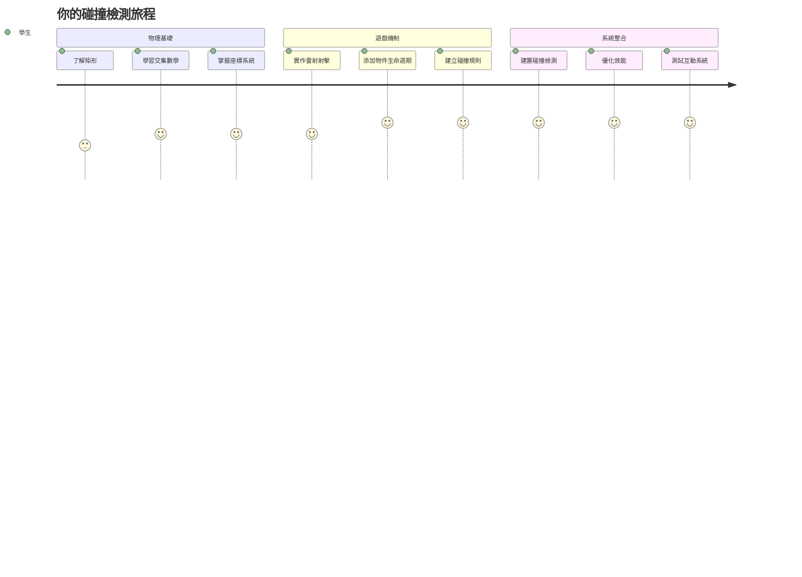
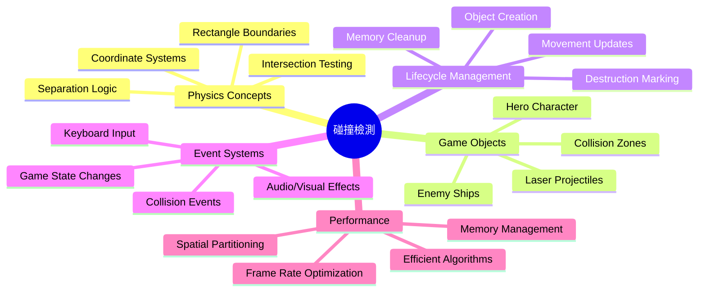
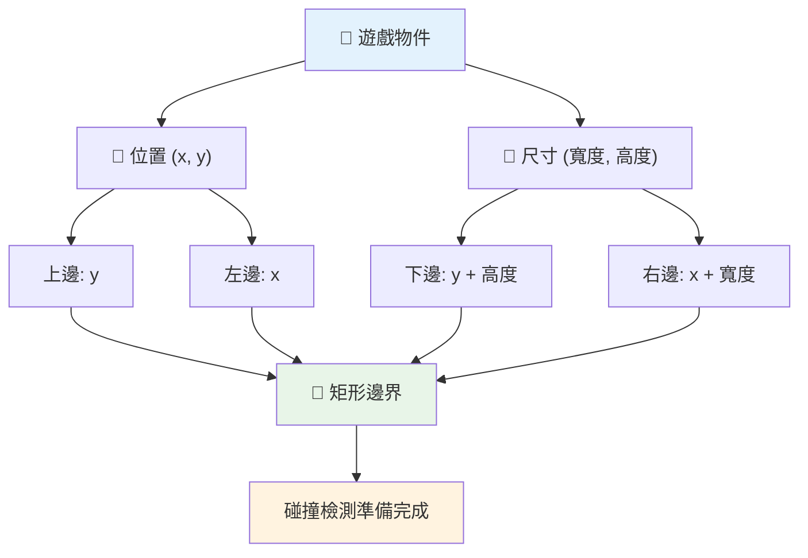
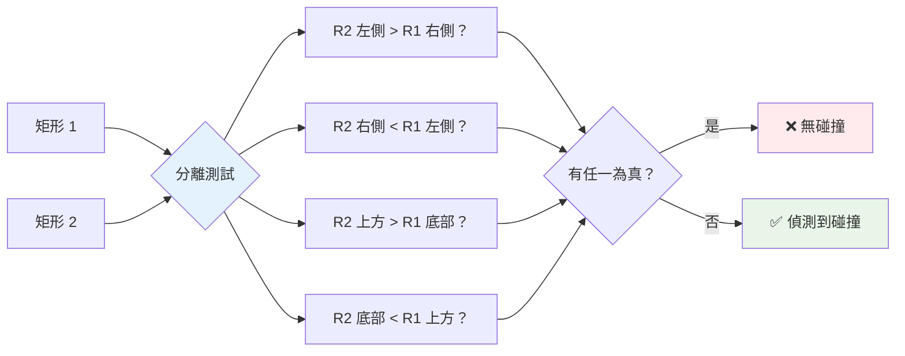
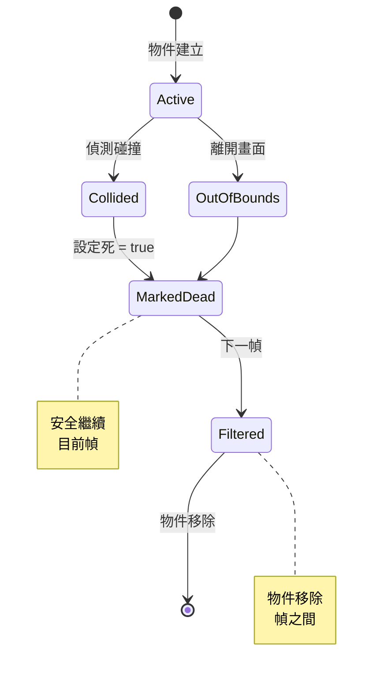
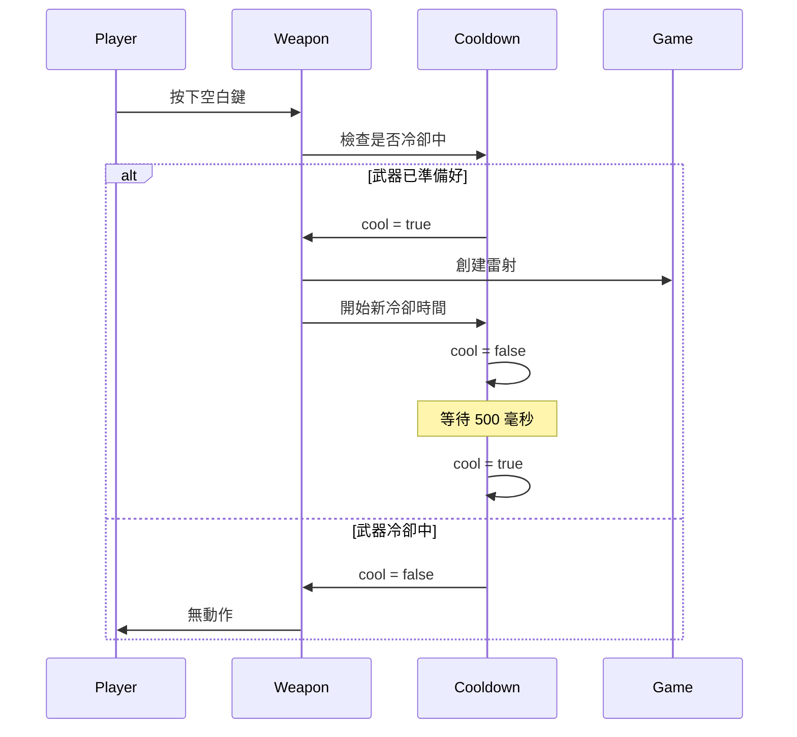
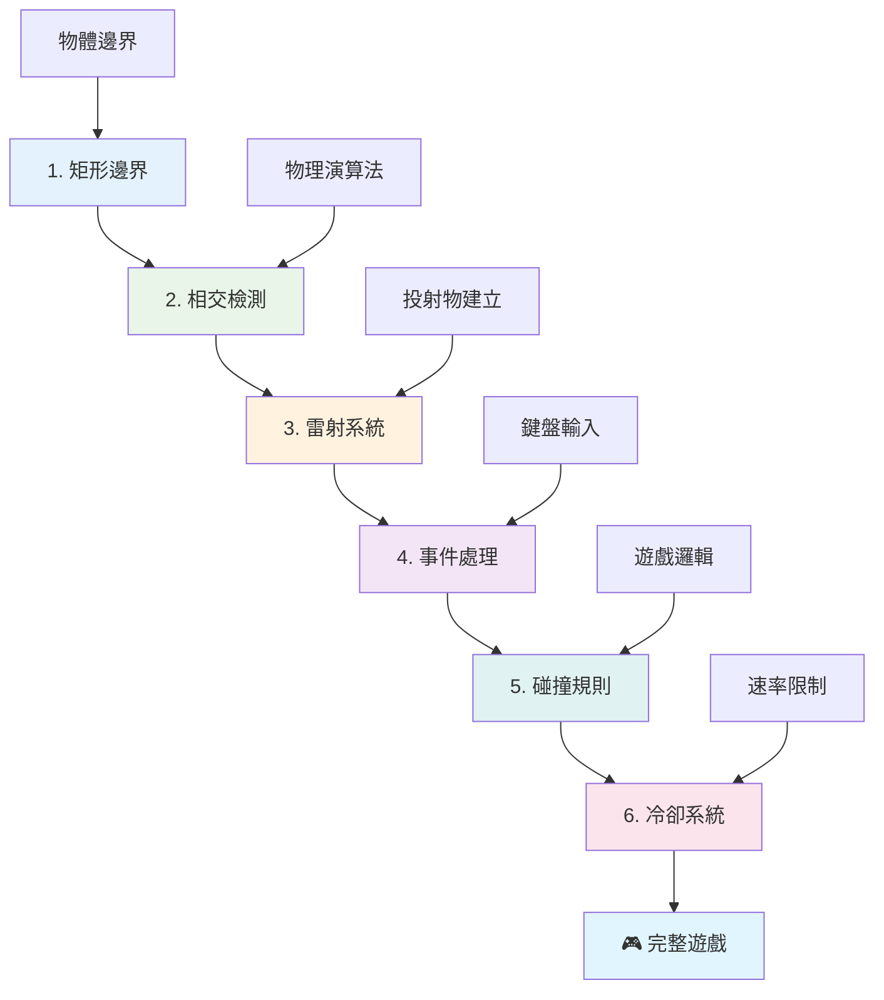
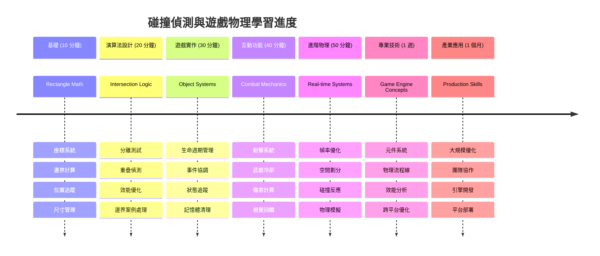

# 建立太空遊戲 第四部分：新增雷射並偵測碰撞


## 課前測驗

[課前測驗](https://ff-quizzes.netlify.app/web/quiz/35)

想想《星際大戰》中路克的質子魚雷擊中死星排氣口的那一刻。那精確的碰撞偵測改變了銀河的命運！在遊戲中，碰撞偵測運作原理一樣：判斷物件何時互動，以及接下來會發生什麼。

在本課中，你將為你的太空遊戲新增雷射武器並實作碰撞偵測。就像 NASA 任務規劃者計算太空船軌跡以避開碎片，你會學會偵測遊戲物件何時交集。我們將一步步拆解這個流程，逐步建立系統。

最後，你將擁有一套可運作的戰鬥系統，雷射能摧毀敵人，碰撞會觸發遊戲事件。這些碰撞偵測原則廣泛應用於物理模擬和互動式網頁介面。


✅ 研究一下最早的電腦遊戲是什麼。它的功能是什麼？

## 碰撞偵測

碰撞偵測類似阿波羅登月艙的接近感應器——持續檢查距離並在物體靠得太近時發出警報。在遊戲中，這系統判斷何時物體交互且該發生什麼事。

我們使用的方法是將每個遊戲物件視為一個矩形，就像空中交通管制系統用簡化幾何形狀追蹤飛機位置。這種矩形方式看起來簡單，但計算效率高，且適用於大多數遊戲場景。

### 矩形表示法

每個遊戲物件需要座標邊界，類似火星探路者車輛在火星表面定位。我們定義如下邊界座標：


```javascript
rectFromGameObject() {
  return {
    top: this.y,
    left: this.x,
    bottom: this.y + this.height,
    right: this.x + this.width
  }
}
```

**解析如下：**
- **上邊**：物件的垂直開始位置（y 座標）
- **左邊**：物件的水平開始位置（x 座標）
- **下邊**：y 座標加上物件高度 - 即結束位置
- **右邊**：x 座標加上物件寬度 - 完整邊界

### 交集演算法

偵測矩形交集的邏輯類似哈伯太空望遠鏡判斷視野中天體是否重疊的原理。演算法檢查物件是否分離：


```javascript
function intersectRect(r1, r2) {
  return !(r2.left > r1.right ||
    r2.right < r1.left ||
    r2.top > r1.bottom ||
    r2.bottom < r1.top);
}
```

**分離測試類似雷達系統判斷：**
- 矩形2是否完全在矩形1的右方？
- 矩形2是否完全在矩形1的左方？
- 矩形2是否完全在矩形1的下方？
- 矩形2是否完全在矩形1的上方？

只要這些條件都不成立，矩形一定會重疊。這方法就像雷達操作員檢查兩架飛機是否保持安全距離。

## 管理物件生命周期

當雷射擊中敵人，兩者都需從遊戲中移除。但直接在迴圈中刪除物件會導致崩潰——這是早期電腦系統（如阿波羅導航計算機）曾教過的課。我們改用「標記刪除」方式，在幀更新間安全移除物件。


這是如何標記待刪除物件：

```javascript
// 標記物件以便移除
enemy.dead = true;
```

**這種方式的優點：**
- 將物件標記為「死亡」，但不馬上刪除
- 允許當前遊戲幀安全完成
- 避免使用已消失物件導致崩潰！

接著在下次渲染前篩除標記的物件：

```javascript
gameObjects = gameObjects.filter(go => !go.dead);
```

**此篩除作用：**
- 建立只包含「存活」物件的新清單
- 丟棄已標記死亡的物件
- 讓遊戲運行更暢順
- 防止刪除物件堆積導致記憶體暴增

## 實作雷射機制

遊戲中的雷射子彈原理跟《星際爭霸戰》的光子魚雷類似——它們是獨立物件，直線射出直到撞擊。每次按空白鍵會產生一個新的雷射物件在畫面移動。

這需要協調以下幾個部分：

**關鍵組件：**
- **建立** 從英雄位置發射的雷射物件
- **處理** 鍵盤輸入觸發雷射產生
- **管理** 雷射的移動與生命週期
- **實現** 雷射子彈的視覺表示

## 實作射速控制

無限制射擊會壓垮遊戲引擎且讓遊戲太容易。真實武器也有類似限制——就連企業號光子炮射擊間也需充能。

我們實作一套冷卻系統，防止連續射擊，同時保持操作流暢：


```javascript
class Cooldown {
  constructor(time) {
    this.cool = false;
    setTimeout(() => {
      this.cool = true;
    }, time);
  }
}

class Weapon {
  constructor() {
    this.cooldown = null;
  }
  
  fire() {
    if (!this.cooldown || this.cooldown.cool) {
      // 建立雷射射彈
      this.cooldown = new Cooldown(500);
    } else {
      // 武器仍在冷卻中
    }
  }
}
```

**冷卻機制運作：**
- 剛生成武器為「熱」狀態（不能射擊）
- 超過冷卻時間後變「冷」狀態（可射擊）
- 射擊前檢查武器是否處於冷卻完成
- 防止濫射但不降低反應速度

✅ 回顧太空遊戲系列第一堂課，溫習冷卻機制。

## 建立碰撞系統

你將擴充現有太空遊戲程式碼，製作碰撞偵測系統。就像國際太空站自動避碰系統會持續監控物體位置並應對，遊戲也會持續檢查並反應碰撞。

從上一課的程式碼開始，我們加入碰撞偵測及控制物件互動規則。

> 💡 **專業提示**：雷射圖片已放在資源資料夾並在程式碼中引用，準備好使用了。

### 需要實作的碰撞規則

**遊戲機制新增：**
1. **雷射擊中敵人**：敵人被雷射擊中即毀滅
2. **雷射碰觸螢幕邊界**：雷射達到頂部時消失
3. **敵人與英雄碰撞**：雙方交集皆毀滅
4. **敵人到達底部**：敵人觸底判定遊戲結束

### 🔄 **教學檢核**
**碰撞偵測基礎**：實作前確認了解：
- ✅ 矩形邊界如何定義碰撞區域
- ✅ 為什麼分離測試比求交集計算更有效
- ✅ 物件生命周期管理在遊戲迴圈的重要性
- ✅ 事件驅動系統如何協調碰撞反應

**快速自測**：如果你馬上刪除物件會怎樣？
*答：迴圈中途刪除可能導致程式崩潰或跳過某些物件*

**物理理解**：你懂得：
- **座標系統**：位置與尺寸如何建立邊界
- **交集邏輯**：碰撞偵測背後的數學原理
- **效能優化**：為何高效算法是即時系統關鍵
- **記憶體管理**：安全的物件生命週期模式

## 設定開發環境

好消息──我們已經幫你架好大部分基礎！所有遊戲素材和基本架構都在 `your-work` 子資料夾，等你加入酷炫的碰撞功能。

### 專案結構

```bash
-| assets
  -| enemyShip.png
  -| player.png
  -| laserRed.png
-| index.html
-| app.js
-| package.json
```

**檔案結構概覽：**
- **包含** 遊戲物件所需所有精靈圖片
- **帶有** 主要 HTML 檔與 JavaScript 程式碼
- **提供** 用於本地開發伺服器的套件設定

### 啟動本地開發伺服器

切換進專案目錄並啟動本地伺服器：

```bash
cd your-work
npm start
```

**此命令執行了：**
- **切換資料夾**至專案工作目錄
- **啟動本地 HTTP 伺服器**於 `http://localhost:5000`
- **供應遊戲檔案**用於測試與開發
- **支援即時開發**含自動重新載入功能

打開瀏覽器造訪 `http://localhost:5000`，即可看到目前有英雄與敵人繪製在畫面。

### 逐步實作流程

像 NASA 系統性編寫旅行者號太空船程式，我們會逐步實作碰撞偵測，每個元件分階段完成。


#### 1. 新增矩形碰撞邊界

先教遊戲物件如何描述自己的邊界。為 `GameObject` 類別新增此方法：

```javascript
rectFromGameObject() {
    return {
      top: this.y,
      left: this.x,
      bottom: this.y + this.height,
      right: this.x + this.width,
    };
  }
```

**此方法做了：**
- **建立** 一個包含精確邊界座標的矩形物件
- **利用** 位置加尺寸計算底邊和右邊
- **回傳** 適用於碰撞偵測的物件格式
- **提供** 遊戲物件通用介面

#### 2. 實作交集偵測

現在製作碰撞偵探──可判斷兩矩形是否重疊的函數：

```javascript
function intersectRect(r1, r2) {
  return !(
    r2.left > r1.right ||
    r2.right < r1.left ||
    r2.top > r1.bottom ||
    r2.bottom < r1.top
  );
}
```

**演算法邏輯為：**
- **測四個分離條件**判斷矩形是否有間距
- **任一分離成立**回傳 `false`
- **皆不成立則表示碰撞**
- **使用邏輯否定**增加判斷效率

#### 3. 實作雷射射擊系統

精彩部分！開始架設雷射射擊系統。

##### 訊息常數

首先定義一些訊息類型，方便遊戲不同系統溝通：

```javascript
KEY_EVENT_SPACE: "KEY_EVENT_SPACE",
COLLISION_ENEMY_LASER: "COLLISION_ENEMY_LASER",
COLLISION_ENEMY_HERO: "COLLISION_ENEMY_HERO",
```

**這些常數作用：**
- **統一命名**以利事件管理
- **保持架構一致性**
- **避免註冊事件時打錯字**

##### 鍵盤輸入處理

加入偵測空白鍵的事件監聽程式：

```javascript
} else if(evt.keyCode === 32) {
  eventEmitter.emit(Messages.KEY_EVENT_SPACE);
}
```

**此輸入處理：**
- **偵測空白鍵**(keyCode 32)
- **發送標準化事件訊息**
- **利於分離射擊邏輯**

##### 事件監聽設置

在 `initGame()` 中註冊射擊事件：

```javascript
eventEmitter.on(Messages.KEY_EVENT_SPACE, () => {
 if (hero.canFire()) {
   hero.fire();
 }
});
```

**該事件監聽：**
- **回應空白鍵事件**
- **檢查射擊冷卻狀態**
- **允許時觸發雷射生成**

新增雷射與敵人的碰撞處理：

```javascript
eventEmitter.on(Messages.COLLISION_ENEMY_LASER, (_, { first, second }) => {
  first.dead = true;
  second.dead = true;
});
```

**碰撞處理邏輯：**
- **接收碰撞事件並取得雙方物件**
- **標記雙方為待刪除**
- **確保碰撞後正確清理**

#### 4. 新建雷射類別

實作向上移動並自我管理生命週期的雷射子彈：

```javascript
class Laser extends GameObject {
  constructor(x, y) {
    super(x, y);
    this.width = 9;
    this.height = 33;
    this.type = 'Laser';
    this.img = laserImg;
    
    let id = setInterval(() => {
      if (this.y > 0) {
        this.y -= 15;
      } else {
        this.dead = true;
        clearInterval(id);
      }
    }, 100);
  }
}
```

**此類別特性：**
- **繼承 GameObject 基礎功能**
- **設定雷射精靈的寬高**
- **用 setInterval() 實現自動向上移動**
- **碰到螢幕頂端自行銷毀**
- **管理動畫更新與清理**

#### 5. 實作碰撞偵測系統

建立完整的碰撞偵測函式：

```javascript
function updateGameObjects() {
  const enemies = gameObjects.filter(go => go.type === 'Enemy');
  const lasers = gameObjects.filter(go => go.type === "Laser");
  
  // 測試雷射與敵人的碰撞
  lasers.forEach((laser) => {
    enemies.forEach((enemy) => {
      if (intersectRect(laser.rectFromGameObject(), enemy.rectFromGameObject())) {
        eventEmitter.emit(Messages.COLLISION_ENEMY_LASER, {
          first: laser,
          second: enemy,
        });
      }
    });
  });

  // 移除已被摧毀的物件
  gameObjects = gameObjects.filter(go => !go.dead);
}
```

**碰撞系統做了：**
- **依物件類別過濾清單，提高效能**
- **逐一測試所有雷射與敵人的交集**
- **偵測到交集時發送碰撞事件**
- **碰撞後清理銷毀物件**

> ⚠️ **重要提醒**：在 `window.onload` 主要遊戲迴圈加入 `updateGameObjects()`，啟用碰撞檢測功能。

#### 6. 在 Hero 類別加入冷卻系統

增強 Hero 類別，新增射擊能力與射速控制：

```javascript
class Hero extends GameObject {
  constructor(x, y) {
    super(x, y);
    this.width = 99;
    this.height = 75;
    this.type = "Hero";
    this.speed = { x: 0, y: 0 };
    this.cooldown = 0;
  }
  
  fire() {
    gameObjects.push(new Laser(this.x + 45, this.y - 10));
    this.cooldown = 500;

    let id = setInterval(() => {
      if (this.cooldown > 0) {
        this.cooldown -= 100;
      } else {
        clearInterval(id);
      }
    }, 200);
  }
  
  canFire() {
    return this.cooldown === 0;
  }
}
```

**增強版本 Hero 類別說明：**
- **初始化冷卻時間為 0（可射擊）**
- **產生雷射物件，位置在英雄上方**
- **設定冷卻時間防止連續射擊**
- **用定時器倒數冷卻時間**
- **提供 `canFire()` 回傳可否射擊狀態**

### 🔄 **教學檢核**
**系統整體理解**：確認你掌握：
- ✅ 矩形邊界如何高效支援碰撞偵測
- ✅ 物件生命週期管理為何維持遊戲穩定關鍵
- ✅ 冷卻系統如何防止效能瓶頸
- ✅ 事件驅動架構在碰撞處理中的角色

**系統整合**：你的碰撞系統示範了：
- **數學精準性**：矩形交集演算法
- **效能優化**：高效碰撞測試模式
- **記憶體管理**：安全物件創建與銷毀
- **事件協調**：鬆耦合系統間溝通
- **即時處理**：框架式更新循環

**專業模式**：你實現：
- **關注點分離**：物理、渲染與輸入分工
- **物件導向設計**：繼承與多型
- **狀態管理**：物件生命週期與遊戲狀態追蹤
- **效能優化**：低耗能即時算法

### 測試你的實作

你現在的太空遊戲擁有完整碰撞偵測與戰鬥機制。🚀 測試新功能：
- **用方向鍵操控角色確認移動**
- **按空白鍵射擊雷射，注意冷卻防止爆射**
- **觀察雷射擊中敵人，敵人被移除**
- **確認銷毀物件完整刪除，避免殘留**

你已成功實作一套碰撞偵測系統，運用與太空船導航與機器人技術相同的數學原則。

### ⚡ **接下來 5 分鐘你可以做的事**
- [ ] 開啟瀏覽器開發者工具，在碰撞偵測函式設置斷點
- [ ] 嘗試調整雷射速度或敵人移動測試碰撞效果
- [ ] 嘗試不同冷卻時間，測試射擊速率控制
- [ ] 添加 `console.log` 陳述式以即時追蹤碰撞事件

### 🎯 **你這一小時可以達成的目標**
- [ ] 完成課後測驗並理解碰撞偵測演算法
- [ ] 在碰撞發生時加入爆炸等視覺效果
- [ ] 實作不同屬性的投射物種類
- [ ] 創建暫時增強玩家能力的強化道具
- [ ] 加入音效使碰撞更具滿足感

### 📅 **你這週的物理程式設計目標**
- [ ] 完成具備完善碰撞系統的太空遊戲
- [ ] 實作矩形以外的進階碰撞形狀（圓形、多邊形）
- [ ] 加入粒子系統以呈現真實爆炸效果
- [ ] 創建具備碰撞避讓的複雜敵人行為
- [ ] 優化大量物件下的碰撞偵測效能
- [ ] 加入動量與真實運動的物理模擬

### 🌟 **你這個月的遊戲物理大師之路**
- [ ] 建立使用先進物理引擎與真實模擬的遊戲
- [ ] 學習 3D 碰撞偵測與空間分割演算法
- [ ] 貢獻開源物理函式庫及遊戲引擎專案
- [ ] 精通高效能圖形應用程式的效能優化
- [ ] 製作遊戲物理與碰撞偵測的教學內容
- [ ] 建立展示先進物理程式技巧的作品集

## 🎯 你的碰撞偵測精通時間軸


### 🛠️ 你的遊戲物理工具箱摘要

完成本課程後，你已掌握：
- **碰撞數學**：矩形交集演算法與座標系統
- **效能優化**：實時應用的高效碰撞偵測
- **物件生命週期管理**：安全的物件建立、更新與銷毀模式
- **事件驅動架構**：解除耦合的碰撞回應系統
- **遊戲循環整合**：基於幀的物理更新與渲染協調
- **輸入系統**：具回饋的響應式控制與頻率限制
- **記憶體管理**：高效的物件池與清理策略

**實務應用範圍**：你的碰撞偵測技能直接應用於：
- **互動模擬**：科學模型與教育工具
- **使用者介面設計**：拖放交互與觸控偵測
- **資料可視化**：互動圖表與可點擊元素
- **行動開發**：觸控手勢識別與碰撞處理
- **機器人程式設計**：路徑規劃與障礙躲避
- **電腦圖學**：光線追蹤與空間演算法

**獲得的專業技能**：你現在能夠：
- **設計**實時碰撞偵測的高效演算法
- **實作**可橫向擴展的物理系統
- **除錯**基於數學原理的複雜互動系統
- **優化**適用於不同硬體與瀏覽器的效能
- **架構**使用成熟設計模式的可維護遊戲系統

**掌握的遊戲開發概念**：
- **物理模擬**：實時碰撞偵測與回應
- **效能工程**：適用於互動應用的優化演算法
- **事件系統**：遊戲元件的解除耦合通訊
- **物件管理**：動態內容的高效生命週期模式
- **輸入處理**：具適當回饋的響應式控制

**下一階段**：你已準備好探索像 Matter.js 的進階物理引擎，實作 3D 碰撞偵測，或建構複雜粒子系統！

🌟 **成就解鎖**：你已建立一套具專業碰撞偵測的完整物理互動系統！

## GitHub Copilot Agent 挑戰 🚀

使用 Agent 模式完成以下挑戰：

**描述：** 提升碰撞偵測系統，實作會隨機生成並在英雄太空船收集時提供暫時能力的強化道具。

**提示：** 創建一個繼承自 GameObject 的 PowerUp 類別，並實作英雄與強化道具間的碰撞偵測。至少加入兩種強化道具：一種提升射速（降低冷卻時間），另一種創建暫時護盾。包含在隨機間隔與位置生成強化道具的邏輯。

---


## 🚀 挑戰

新增爆炸效果！查看 [Space Art repo](../../../../6-space-game/solution/spaceArt/readme.txt) 中的遊戲素材，嘗試在雷射碰撞外星人時添加爆炸效果

## 課後測驗

[課後測驗](https://ff-quizzes.netlify.app/web/quiz/36)

## 回顧與自學

嘗試調整你遊戲中目前的間隔時間。改變它們會發生什麼事？深入閱讀 [JavaScript 計時事件](https://www.freecodecamp.org/news/javascript-timing-events-settimeout-and-setinterval/)。

## 作業

[探索碰撞](assignment.md)

---

<!-- CO-OP TRANSLATOR DISCLAIMER START -->
**免責聲明**：  
本文件係使用 AI 翻譯服務 [Co-op Translator](https://github.com/Azure/co-op-translator) 所翻譯。雖然我們致力於翻譯的準確性，但請注意，自動翻譯可能會包含錯誤或不準確之處。文件之原文版本應視為權威來源。對於重要資訊，建議採用專業人工翻譯。我們不對因使用本翻譯內容所導致之任何誤解或誤譯負責。
<!-- CO-OP TRANSLATOR DISCLAIMER END -->