# 建立銀行應用程式第三部分：抓取及使用資料的方法

想想《星際爭霸戰》裡的企業號電腦——當皮卡爾艦長詢問艦況時，資訊立刻出現，整個介面不會關閉然後重建。這種無縫的資訊流正是我們現在用動態抓取資料要做的。

現在，你的銀行應用程式就像一份印刷報紙——資訊齊全但靜態。我們要把它轉變成更像 NASA 的任務控制中心，資料持續流動並即時更新，不會打斷使用者的工作流程。

你將學會如何非同步與伺服器溝通、處理不同時間抵達的資料，並將原始資訊轉換成對用戶有意義的內容。這也是 Demo 版本與可上線產品軟體的關鍵差別。

## ⚡ 接下來 5 分鐘你可以做什麼

**忙碌開發者快速入門路徑**

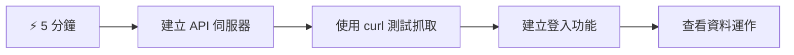
- **第1-2分鐘**：啟動你的 API 伺服器（`cd api && npm start`）並測試連線
- **第3分鐘**：使用 fetch 建立基本的 `getAccount()` 函式
- **第4分鐘**：用 `action="javascript:login()"` 連接登入表單
- **第5分鐘**：測試登入並在主控台觀察帳戶資料出現

**快速測試指令**：
```bash
# 驗證 API 是否運行中
curl http://localhost:5000/api

# 測試帳戶資料擷取
curl http://localhost:5000/api/accounts/test
```

**為什麼重要**：5 分鐘內，你將看到非同步資料抓取的魔力，它主導了所有現代網頁應用，讓應用感覺更即時、活躍。

## 🗺️ 你的資料驅動式網頁應用學習旅程

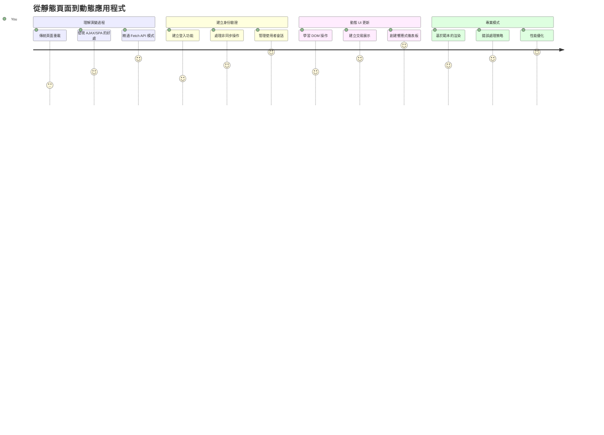
**旅程目的地**：完成本課後，你會理解現代網頁應用如何動態抓取、處理並顯示資料，創造出專業應用程式中無縫的使用體驗。

## 課前小測驗

[課前小測驗](https://ff-quizzes.netlify.app/web/quiz/45)

### 先決條件

在開始資料抓取前，請確定以下元件已準備好：

- **前一課程**：完成 [登入與註冊表單](../2-forms/README.md) — 我們會以此為基礎
- **本地伺服器**：安裝 [Node.js](https://nodejs.org) 並 [啟動 API 伺服器](../api/README.md) 以提供帳戶資料
- **API 連線**：用下列指令測試伺服器連線：

```bash
curl http://localhost:5000/api
# 預期回應: "Bank API v1.0.0"
```

這個快速測試確保所有元件正常通訊：
- 驗證 Node.js 在你的系統上正確運行
- 確認你的 API 伺服器正在回應
- 驗證應用程式能夠連上伺服器（就像任務前檢查無線電聯絡）

## 🧠 資料管理生態系統概覽

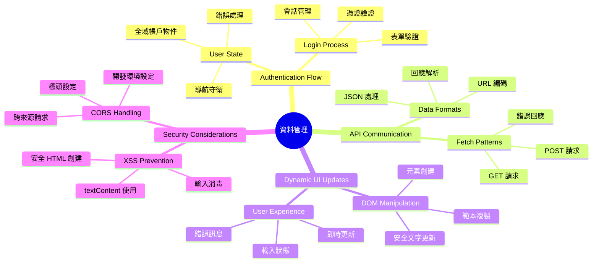
**核心原則**：現代網頁應用是資料協調系統——它們在用戶介面、伺服器 API 與瀏覽器安全模型之間協同運作，創造無縫且即時反應的體驗。

---

## 理解現代網頁應用的資料抓取

過去二十年來，網頁應用處理資料的方式發生了劇烈改變。了解這個演進，有助於你體會為何 AJAX 與 Fetch API 這類現代技術如此強大，並成為網頁開發者必備。

讓我們來探索傳統網站如何運作、以及我們今天建立的動態、反應快速的應用的差異。

### 傳統多頁應用（MPA）

在網路初期，每一次點擊就像老電視切換頻道——螢幕會變空白，然後慢慢調到新內容。這就是早期網頁應用的現實：每一個互動都需完整重建整頁。

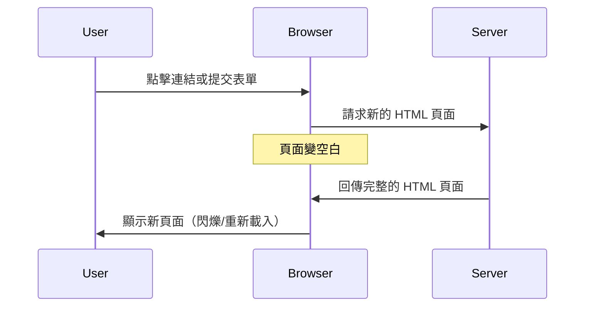


**這種方式的笨重之處：**
- 每次點擊都要重新載入整頁
- 使用者思考中會被頁面閃爍打斷
- 網路連線要不停重複下載相同頁首與頁尾
- 應用像是在翻閱紙本檔案櫃，而不是用軟體

### 現代單頁應用（SPA）

AJAX（非同步 JavaScript & XML）徹底改變了這個模式。就像國際太空站模組化設計，太空人可以更換個別元件而無需重建整個結構，AJAX 讓我們能更新網頁特定部分而非重新載入全部。雖然名稱提到 XML，但現在大多用 JSON，核心原則是一樣的：只更新需要變動的部分。

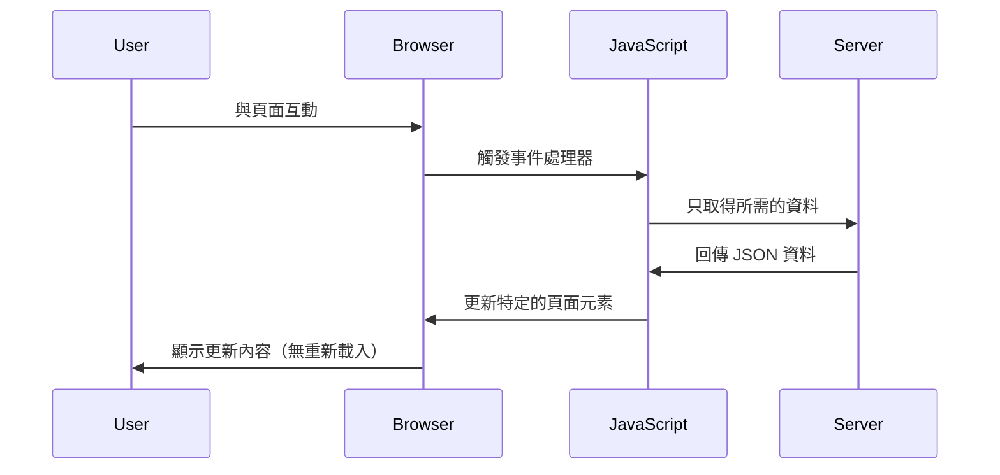


**SPA 讓使用體驗更好的原因：**
- 只更新真的改變的部分（很聰明！）
- 不再有刺眼閃爍，使用者保持流程不中斷
- 傳輸資料較少，載入更快速
- 整體感覺更流暢反應快，就像手機應用程式

### 進化到現代 Fetch API

現代瀏覽器提供了 [`Fetch` API](https://developer.mozilla.org/docs/Web/API/Fetch_API)，取代了舊式的 [`XMLHttpRequest`](https://developer.mozilla.org/docs/Web/API/XMLHttpRequest/Using_XMLHttpRequest/)。就像電報到電子郵件的改變，Fetch API 利用 Promise 寫出更乾淨的非同步程式碼，且自然處理 JSON。

| 功能 | XMLHttpRequest | Fetch API |
|---------|----------------|----------|
| **語法** | 複雜回呼函式 | 乾淨的 Promise |
| **JSON 處理** | 需手動解析 | 內建 `.json()` 方法 |
| **錯誤處理** | 資訊有限 | 全面錯誤細節 |
| **現代支援** | 傳統相容 | ES6+ 的 Promise 与 async/await |

> 💡 **瀏覽器相容性**：好消息是 Fetch API 支援所有現代瀏覽器！若想知道版本詳情，[caniuse.com](https://caniuse.com/fetch) 提供完整資訊。
> 
**結論：**
- Chrome、Firefox、Safari、Edge （也就是大多數使用者）支援完善
- 只有 Internet Explorer 需額外處理（是時候放手 IE 了）
- 為我們後面使用的優雅 async/await 風格做好鋪墊

### 實作用戶登入與資料抓取

現在來實作登入系統，將你的銀行應用從靜態顯示變成具功能的應用。像安全軍事設施的驗證協定一樣，我們會驗證使用者身分，再給予其專屬資料的存取權。

我們將逐步建構，先做基本身份驗證，再加入抓取資料的功能。

#### 第一步：建立登入函式基礎

打開你的 `app.js` 並新增 `login` 函式，處理用戶認證流程：

```javascript
async function login() {
  const loginForm = document.getElementById('loginForm');
  const user = loginForm.user.value;
}
```

**解析此段程式碼：**
- `async` 關鍵字？它告訴 JavaScript 「嘿，這函式可能要等一些非同步事情完成」
- 我們從頁面抓到表單（沒什麼特別，直接用 ID 找）
- 接著取出用戶輸入的使用者名稱
- 這裡有個小妙招：你可以用表單欄位的 `name` 屬性存取輸入框，省去 getElementById 步驟！

> 💡 **表單存取模式**：每個表單控制項都可以用它在 HTML 裡的 `name` 屬性當成表單元素的屬性來存取，讓獲取資料更簡潔易讀。

#### 第二步：建立帳戶資料抓取函式

接著，我們要寫一個專門從伺服器取得帳戶資料的函式。它跟你之前註冊使用的函式結構類似，但專注於資料取得：

```javascript
async function getAccount(user) {
  try {
    const response = await fetch('//localhost:5000/api/accounts/' + encodeURIComponent(user));
    return await response.json();
  } catch (error) {
    return { error: error.message || 'Unknown error' };
  }
}
```

**這段程式碼的目的：**
- **運用** 現代 `fetch` API 非同步抓取資料
- **構造** 搭配使用者名稱的 GET 請求 URL
- **使用** `encodeURIComponent()` 來安全處理 URL 中的特殊字元
- **轉換** 回應成 JSON 格式方便資料操作
- **優雅** 處理錯誤，回傳錯誤物件而非當機

> ⚠️ **安全提醒**：`encodeURIComponent()` 處理 URL 裡的特殊字元，像海軍通訊中的編碼系統，保證訊息精確送達，避免「#」或「&」等字元誤解。
> 
**為何這很重要：**
- 防止特殊字元破壞 URL
- 防止 URL 操控攻擊
- 確保伺服器收到正確資料
- 遵守安全編碼原則

#### 了解 HTTP GET 請求

你可能會驚訝：用 `fetch` 預設不傳參數時，它自動是個 [`GET`](https://developer.mozilla.org/docs/Web/HTTP/Methods/GET) 請求。這正好適合我們用來詢問伺服器：「嗨，我能看到這用戶的帳戶資料嗎？」

GET 請求就像禮貌問借書——你是要看到已存在的東西。POST 請求（我們註冊用的）則像是要新增新書。

| GET 請求 | POST 請求 |
|-------------|-------------|
| **用途** | 取回現有資料 | 傳送新資料給伺服器 |
| **參數** | 在 URL 路徑/查詢字串 | 包在請求主體 |
| **快取** | 可被瀏覽器快取 | 通常不快取 |
| **安全** | 在 URL/日誌可見 | 藏在請求主體裡 |

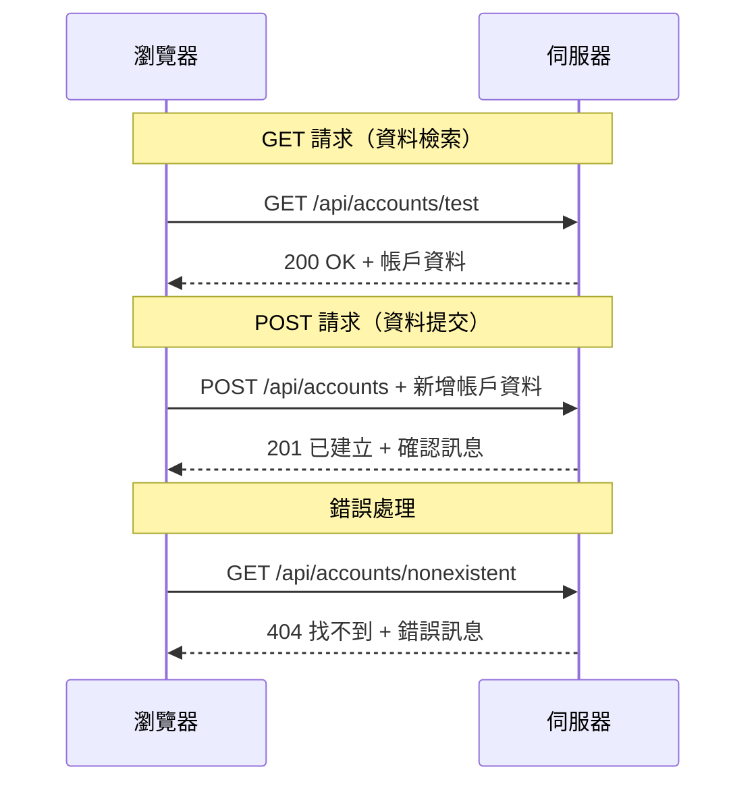
#### 第三步：整合所有功能

現在最令人滿意的部分——將帳戶抓取函式連接到登入流程。讓一切串聯起來：

```javascript
async function login() {
  const loginForm = document.getElementById('loginForm');
  const user = loginForm.user.value;
  const data = await getAccount(user);

  if (data.error) {
    return console.log('loginError', data.error);
  }

  account = data;
  navigate('/dashboard');
}
```

這個函式按明確流程進行：
- 從表單輸入取出使用者名稱
- 向伺服器請求該用戶帳戶資料
- 處理流程中發生的任何錯誤
- 成功後記錄帳戶資料並進入儀表板頁面

> 🎯 **Async/Await 模式**：因為 `getAccount` 是非同步函式，我們用關鍵字 `await` 等待伺服器回應，避免程式執行到一半資料還沒來。

#### 第四步：為你的資料建立儲存處

應用程式需要一個地方儲存載入的帳戶資訊。就像應用的短期記憶，讓目前使用者資料隨時可得。在 `app.js` 檔案頂端加入這行：

```javascript
// 這裡保存目前使用者的帳戶資料
let account = null;
```

**我們為什麼需要它：**
- 讓帳戶資料可從應用任何地方取得
- 從 `null` 開始表示「還沒有人登入」狀態
- 當有人成功登入或註冊，資料會更新
- 充當唯一資料真實來源，避免登入狀態混亂

#### 第五步：連接你的表單

現在讓新寫好的登入函式連結到 HTML 表單。更新你的 form 標籤如下：

```html
<form id="loginForm" action="javascript:login()">
  <!-- Your existing form inputs -->
</form>
```

**這樣改變了什麼：**
- 阻止表單預設「重新載入整頁」的行為
- 改成呼叫自訂 JavaScript 函式
- 保持流程順暢像單頁應用程式
- 你將完全掌控使用者按「登入」後會發生的事

#### 第六步：強化你的註冊函式

為了保持一致，更新 `register` 函式，也將帳戶資料存起來並進入儀表板：

```javascript
// 將這些程式碼行加入您的註冊函式結尾
account = result;
navigate('/dashboard');
```

**此改善帶來：**
- 註冊後能無縫切換到儀表板
- 登入與註冊流程的一致使用者體驗
- 成功註冊後立刻獲得帳戶資訊

#### 測試你的實作

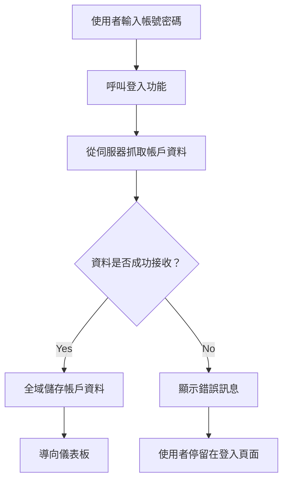
**接下來來試試看：**
1. 新建立一個帳號確保流程通暢
2. 用同帳號嘗試登入
3. 若不正常，打開瀏覽器主控台（F12）查看錯誤訊息
4. 成功登入後應該進到儀表板

若出了問題，別慌！大多是拼字錯誤或忘記啟動 API 伺服器。

#### 關於跨來源（CORS）的簡短說明

你可能會好奇：「我的網頁應用跟 API 伺服器在不同 port 上，怎麼能溝通？」好問題！這是每位前端開發者都會遇到的課題。

> 🔒 **跨來源安全**：瀏覽器執行「同源政策」防止不同來源間未經授權的溝通，就像五角大廈的嚴格管控點，確認通訊被允許才進行資料傳送。
> 
**在我們的設定中：**
- 網頁應用在 `localhost:3000`（開發伺服器）
- API 伺服器在 `localhost:5000`（後端伺服器）
- API 伺服器設定了 [CORS 標頭](https://developer.mozilla.org/docs/Web/HTTP/CORS)，明確允許你的網頁應用溝通

這樣的配置反映真實開發環境，前後端通常分開在不同伺服器上執行。

> 📚 **深入了解**：透過這個全面的 [Microsoft Learn API 課程](https://docs.microsoft.com/learn/modules/use-apis-discover-museum-art/?WT.mc_id=academic-77807-sagibbon) 探索更多 API 與資料抓取知識。

## 讓你的資料在 HTML 裡「活」起來

現在我們要透過 DOM 操控，讓抓取的資料展現給使用者看。就像在暗房裡洗照片，我們將隱藏的資料轉成使用者能看到、互動的內容。
DOM 操作是將靜態網頁轉變為根據使用者互動和伺服器回應更新內容的動態應用程式的技術。

### 選擇合適的工具

當需要用 JavaScript 更新你的 HTML 時，你有幾個選擇。可以把它們想像成工具箱裡的不同工具——每個都適合特定的工作：

| 方法 | 適合用途 | 適用時機 | 安全等級 |
|--------|---------------------|----------------|--------------|
| `textContent` | 安全顯示使用者資料 | 任何時候要顯示文字 | ✅ 非常可靠 |
| `createElement()` + `append()` | 建立複雜版面配置 | 建立新區塊/列表 | ✅ 非常安全 |
| `innerHTML` | 設定 HTML 內容 | ⚠️ 盡量避開使用 | ❌ 有風險 |

#### 安全顯示文字的方式：textContent

[`textContent`](https://developer.mozilla.org/docs/Web/API/Node/textContent) 屬性是顯示使用者資料時的好幫手。它就像你網頁的保鑣——任何有害的東西都不會通過：

```javascript
// 安全且可靠的文字更新方式
const balanceElement = document.getElementById('balance');
balanceElement.textContent = account.balance;
```

**textContent 的好處：**
- 當作純文字處理（防止腳本執行）
- 自動清除現有內容
- 對簡單文字更新高效
- 提供內建的惡意內容防護

#### 建立動態 HTML 元素

對於更複雜的內容，將 [`document.createElement()`](https://developer.mozilla.org/docs/Web/API/Document/createElement) 與 [`append()`](https://developer.mozilla.org/docs/Web/API/ParentNode/append) 方法結合使用：

```javascript
// 建立新元素的安全方式
const transactionItem = document.createElement('div');
transactionItem.className = 'transaction-item';
transactionItem.textContent = `${transaction.date}: ${transaction.description}`;
container.append(transactionItem);
```

**這種方法的理解：**
- **程式化建立**新的 DOM 元素
- **完全控制**元素屬性與內容
- **允許**建立複雜且巢狀的元素結構
- **保持**結構與內容分離以維護安全

> ⚠️ **安全考量**：雖然 [`innerHTML`](https://developer.mozilla.org/docs/Web/API/Element/innerHTML) 在許多教學中出現，但它會執行嵌入的腳本。就像 CERN 的安全協議防止未授權代碼執行一樣，使用 `textContent` 和 `createElement` 是更安全的替代方案。
> 
**innerHTML 的風險：**
- 會執行使用者資料中的 `<script>` 標籤
- 易受到代碼注入攻擊
- 可能造成安全漏洞
- 我們使用的安全替代方案提供同等功能

### 讓錯誤訊息更友善使用者

目前的登入錯誤只會顯示在瀏覽器控制台內，使用者無法見到。就像飛行員的內部診斷系統和乘客信息系統的不同，我們需要透過適當的管道來傳達重要資訊。

實作可見的錯誤訊息讓使用者馬上知道出了什麼問題以及下一步要怎麼做。

#### 第一步：新增錯誤訊息顯示區域

先在 HTML 中給錯誤訊息一個位置。把下面這段放在登入按鈕前面，讓使用者自然看到：

```html
<!-- This is where error messages will appear -->
<div id="loginError" role="alert"></div>
<button>Login</button>
```

**這段做了什麼：**
- 建立一個空容器，平時保持隱藏狀態
- 放在使用者點擊「登入」後自然看的位置
- 其中的 `role="alert"` 對螢幕閱讀器友善，告訴輔助技術「注意，這很重要！」
- 獨特的 `id` 讓我們的 JavaScript 容易找到

#### 第二步：建立方便的輔助函式

來寫一個小函式，可以更新任何元素的文字內容。這種「寫一次，到處用」的工具會省很多時間：

```javascript
function updateElement(id, text) {
  const element = document.getElementById(id);
  element.textContent = text;
}
```

**函式優點：**
- 簡單介面，僅需元素 ID 和文字內容
- 安全定位並更新 DOM 元素
- 可重複使用，減少重複代碼
- 在整個應用中保持一致的更新行為

#### 第三步：在使用者能看到的地方顯示錯誤

用實際會顯示的訊息取代只能在控制台看到的錯誤。更新你的登入函式：

```javascript
// 不只是記錄到控制台，還要向使用者顯示錯誤原因
if (data.error) {
  return updateElement('loginError', data.error);
}
```

**這個小改變有大用處：**
- 將錯誤訊息顯示在使用者注意的位置
- 不再神秘的靜默失敗
- 使用者可立即得到操作回饋
- 你的應用感覺更專業、有心

現在測試無效帳號，就會看到頁面上的錯誤訊息囉！


#### 第四步：做出無障礙友善設計

剛才加上的 `role="alert"` 很重要——它不只是裝飾！這個屬性建立了所謂的[動態區域 (Live Region)](https://developer.mozilla.org/docs/Web/Accessibility/ARIA/ARIA_Live_Regions)，能立即讓螢幕閱讀器播報變更：

```html
<div id="loginError" role="alert"></div>
```

**重要性說明：**
- 螢幕閱讀器用戶一看到錯誤訊息就能聽到通知
- 不論使用方式，人人都可獲得同等重要資訊
- 讓你的應用更具包容性
- 展現你對打造無障礙體驗的重視

這種小細節讓好開發者和傑出開發者截然不同！

### 🎯 教學檢視：認證模式

**暫停反思**：你剛剛完成了一個完整的認證流程。這是網頁開發的基礎模式。

**快速自我評估**：
- 你能解釋為什麼 API 呼叫要用 async/await 嗎？
- 如果忘記使用 `encodeURIComponent()` 會發生什麼？
- 我們的錯誤處理如何改善使用者體驗？

**實務連結**：你這裡學的模式（非同步資料擷取、錯誤處理、使用者回饋）是所有大型網路應用——從社群媒體到電商平台——都會用的。你正在建立業界級技能！

**挑戰問題**：你會如何修改此認證系統以處理多個使用者角色（顧客、管理員、出納員）？想想資料結構和 UI 需要什麼改變。

#### 第五步：用同樣模式處理註冊錯誤

為保持一致，在註冊表單也實作相同錯誤處理：

1. **新增**錯誤顯示元素到註冊頁面 HTML：
```html
<div id="registerError" role="alert"></div>
```

2. **更新**你的註冊函式使用統一的錯誤顯示模式：
```javascript
if (data.error) {
  return updateElement('registerError', data.error);
}
```

**一致錯誤處理的優點：**
- **提供**各表單統一的使用者經驗
- **減少**使用者的認知負擔，使用慣用模式
- **簡化**維護與代碼重複
- **確保**全程符合法規無障礙標準

## 建立你的動態儀表板

現在我們要將靜態儀表板轉為會顯示真實帳戶資料的動態介面。就像印刷的班機表和機場即時出發看板的差異，我們將從靜態資訊邁向即時更新的顯示。

運用你學到的 DOM 操作技術，建立會隨時更新、展示最新帳戶資訊的儀表板。

### 熟悉你的資料

在開始構建前，先來看看伺服器成功登入後會帶回哪些資料：

```json
{
  "user": "test",
  "currency": "$",
  "description": "Test account",
  "balance": 75,
  "transactions": [
    { "id": "1", "date": "2020-10-01", "object": "Pocket money", "amount": 50 },
    { "id": "2", "date": "2020-10-03", "object": "Book", "amount": -10 },
    { "id": "3", "date": "2020-10-04", "object": "Sandwich", "amount": -5 }
  ]
}
```

**資料結構提供了：**
- **`user`**：非常適合個人化體驗（「歡迎回來，Sarah！」）
- **`currency`**：確保金錢數字正確顯示
- **`description`**：帳戶親切稱呼
- **`balance`**：重要的目前餘額
- **`transactions`**：完整交易紀錄及細節

一切你需要用來建立專業銀行儀表板的資訊！

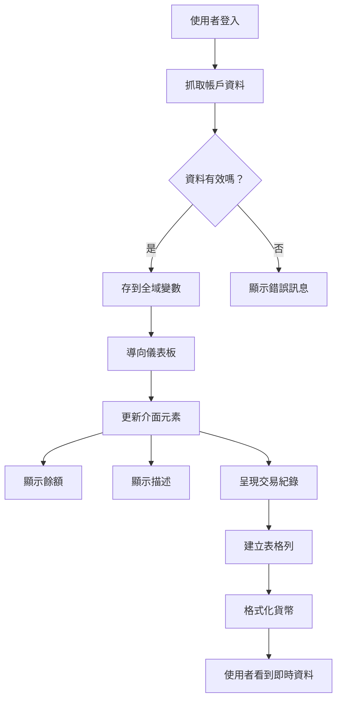
> 💡 **專業小貼士**：想立刻看到你的儀表板嗎？使用帳號 `test` 登入——它已預載範例資料，讓你不用先建立交易便可看到完整功能。
> 
**測試帳號的便利：**
- 已有現實且合理的範例資料
- 適合檢視交易顯示效果
- 方便測試儀表板功能
- 省去你手動建立假資料的麻煩

### 建立儀表板顯示元素

一步步打造儀表板介面，從帳戶摘要資訊開始，然後到更複雜的功能如交易列表。

#### 第一步：更新你的 HTML 結構

先用動態的佔位元素取代原本靜態的「餘額」區域，讓你的 JavaScript 可以填入資料：

```html
<section>
  Balance: <span id="balance"></span><span id="currency"></span>
</section>
```

接著，新增用於帳戶描述的區塊，因為它是儀表板主要內容的標題，使用語意 HTML：

```html
<h2 id="description"></h2>
```

**HTML 結構解讀：**
- **分別用** `<span>` 元素包覆餘額和貨幣，方便個別控制
- **為**每個元素加上獨特 ID 以供 JavaScript 操控
- **語意化**使用 `<h2>` 作為帳戶描述標題
- **建立**螢幕閱讀器和 SEO 友好的邏輯階層

> ✅ **無障礙提醒**：帳戶描述擔任儀表板內容標題，語意上以標題呈現。更多關於[標題結構與無障礙](https://www.nomensa.com/blog/2017/how-structure-headings-web-accessibility)的資訊。你能想到頁面中還有哪裡適合加標題標籤嗎？

#### 第二步：建立儀表板更新函式

現在寫一個函式，幫你用真實帳戶資料填充儀表板：

```javascript
function updateDashboard() {
  if (!account) {
    return navigate('/login');
  }

  updateElement('description', account.description);
  updateElement('balance', account.balance.toFixed(2));
  updateElement('currency', account.currency);
}
```

**這個函式的工作步驟：**
- **確認**帳戶資料存在再繼續
- **未認證**使用者自動導向登入頁面
- **更新**帳戶描述，使用重複利用的 `updateElement` 函式
- **格式化**餘額，固定顯示兩位小數
- **顯示**正確的貨幣符號

> 💰 **金錢格式化小技巧**：那個 [`toFixed(2)`](https://developer.mozilla.org/docs/Web/JavaScript/Reference/Global_Objects/Number/toFixed) 方法是救星！可確保餘額看起來像真實金額──例如 "75.00" 不只是 "75"。使用者會喜歡熟悉的貨幣格式。

#### 第三步：確保儀表板自動更新

要讓儀表板在每次瀏覽時都刷新最新資料，我們需要與導覽系統整合。如果你完成了[第 1 單元作業](../1-template-route/assignment.md)，應該不陌生。若沒做過，也別擔心——以下是你要的內容：

將這段加在你的 `updateRoute()` 函式尾端：

```javascript
if (typeof route.init === 'function') {
  route.init();
}
```

接著更新路由設定，加入儀表板初始化函式：

```javascript
const routes = {
  '/login': { templateId: 'login' },
  '/dashboard': { templateId: 'dashboard', init: updateDashboard }
};
```

**這招厲害的運作：**
- 檢查路由是否有特殊初始化代碼
- 路由載入時自動執行該初始化
- 保證你的儀表板永遠展現最新資料
- 讓路由邏輯清晰且有條理

#### 測試你的儀表板

實作完成後來試試：

1. 使用測試帳號登入
2. 確認成功導向到儀表板頁面
3. 確認帳戶描述、餘額和貨幣顯示正常
4. 嘗試登出再登入，確認資料可正常更新

現在你的儀表板應該會根據登入使用者的資料，動態顯示資訊！

## 使用模板打造聰明的交易列表

我們不會自己一筆一筆地寫 HTML，而用模板自動產生格式一致的內容。就像太空船製造的標準化零件，模板確保每筆交易列都遵守相同結構與樣式。

這種方法在處理少量或成千上萬筆交易時都能維持效能與呈現一致。

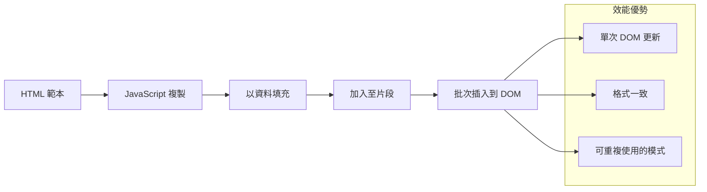
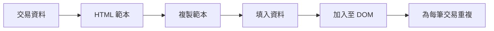
### 第一步：建立交易模板

先在 HTML `<body>` 裡新增可重複使用的交易列模板：

```html
<template id="transaction">
  <tr>
    <td></td>
    <td></td>
    <td></td>
  </tr>
</template>
```

**HTML 模板說明：**
- **定義**單一表格列的結構
- **保持**隱藏，直到被複製及填入資料
- **包含**日期、描述與金額三格
- **提供**重複使用、保持格式一致的範本

### 第二步：準備表格動態內容區域

接著在表格的 `<tbody>` 加上 `id`，方便 JavaScript 找到它：

```html
<tbody id="transactions"></tbody>
```

**這樣做的目的：**
- **建立**明確目標容器，用來插入交易列
- **將**表格結構與動態資料分開
- **方便**清空及重複填入交易資料

### 第三步：建立交易列工廠函式

現在寫一個函式，用它產生交易資料對應的 HTML 元素：

```javascript
function createTransactionRow(transaction) {
  const template = document.getElementById('transaction');
  const transactionRow = template.content.cloneNode(true);
  const tr = transactionRow.querySelector('tr');
  tr.children[0].textContent = transaction.date;
  tr.children[1].textContent = transaction.object;
  tr.children[2].textContent = transaction.amount.toFixed(2);
  return transactionRow;
}
```

**解析此工廠函式：**
- **取得**模板元素的參考
- **複製**模板內容以便安全操作
- **挑選**複製內容中的表格列元素
- **填入**每個儲存格交易資料
- **格式化**金額顯示的小數位
- **回傳**完成的列準備插入 DOM

### 第四步：有效率地產生多筆交易列

在你的 `updateDashboard()` 函式中新增這段，將所有交易列顯示出來：

```javascript
const transactionsRows = document.createDocumentFragment();
for (const transaction of account.transactions) {
  const transactionRow = createTransactionRow(transaction);
  transactionsRows.appendChild(transactionRow);
}
updateElement('transactions', transactionsRows);
```

**這種高效方式的理解：**
- **建立**文件片段，一次執行多筆 DOM 操作
- **迭代**帳戶資料中所有交易
- **透過工廠函式**產生每筆交易列
- **將**所有列匯集到片段中，再統一加入 DOM
- **避免**多次單筆插入，提高效能與流暢度
> ⚡ **效能優化**：[`document.createDocumentFragment()`](https://developer.mozilla.org/docs/Web/API/Document/createDocumentFragment) 就像波音公司的組裝流程—組件先在主線之外準備好，然後作為一個完整單元安裝。這種批次處理方式透過執行單次插入而非多次個別操作，最大限度地減少了 DOM 重排。

### 步驟 5：增強可以處理混合內容的更新函式

你目前的 `updateElement()` 函式僅能處理文字內容。請改寫，使其能同時處理文字及 DOM 節點：

```javascript
function updateElement(id, textOrNode) {
  const element = document.getElementById(id);
  element.textContent = ''; // 移除所有子元素
  element.append(textOrNode);
}
```

**此次更新的主要改進：**
- **清除**已有內容後再加入新內容
- **接受**文字字串或 DOM 節點作為參數
- **使用**[`append()`](https://developer.mozilla.org/docs/Web/API/ParentNode/append) 方法以提升彈性
- **維持**與既有基於文字的用法相容

### 來測試你的儀表板吧

重要時刻！來看看你的動態儀表板實際運作如何：

1. 使用 `test` 帳號登入（裡面有準備好的範例資料）
2. 前往你的儀表板頁面
3. 檢查交易列是否已正確格式化顯示
4. 確認日期、描述與金額是否看起來正常

如果一切正常，你應該會看到一個完整可用的交易列表喔！🎉

**你已完成的事項：**
- 建構能隨資料量擴展的儀表板
- 創建可重複使用的範本以保持格式一致
- 實作高效的 DOM 操控技術
- 開發相當於生產環境銀行應用的功能

你已成功將靜態網頁轉換成動態網頁應用程式。

### 🎯 教學檢視：動態內容產生

**架構理解**：你已實作出一套進階的資料至 UI 管線，類似 React、Vue 與 Angular 等框架的設計模式。

**核心概念掌握：**
- **範本化渲染**：建立可重用的 UI 元件
- **文件片段**：優化 DOM 效能
- **安全的 DOM 操控**：防止安全弱點產生
- **資料轉換**：將伺服器資料轉換成使用者介面

**產業連結**：這些技術是現代前端框架的根基。React 的虛擬 DOM、Vue 的範本系統及 Angular 的元件架構皆建基於這些核心概念。

**反思問題**：你會如何擴充此系統以處理即時更新（例如新交易自動出現）？可考慮使用 WebSockets 或伺服器推送事件（Server-Sent Events）。

---

## 📈 你的資料管理精熟時間軸

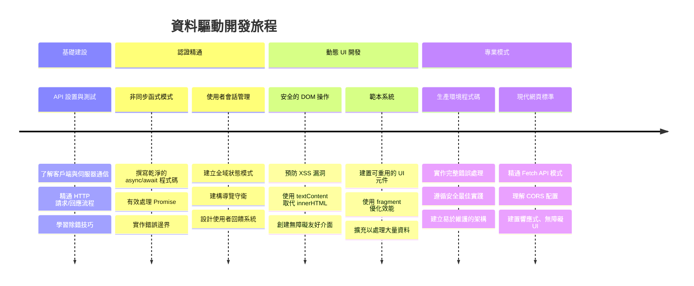
**🎓 畢業里程碑**：你已成功使用現代 JavaScript 模式構建完整的資料驅動網頁應用。這些技能可直接應用於 React、Vue 或 Angular 等框架。

**🔄 下一階段能力：**
- 準備探索基於這些概念的前端框架
- 準備使用 WebSockets 實作即時功能
- 有能力打造具離線功能的進階網頁應用（PWA）
- 打下學習高階狀態管理模式的基礎

## GitHub Copilot Agent 挑戰 🚀

使用 Agent 模式完成以下挑戰：

**說明：** 為銀行應用新增交易搜尋與篩選功能，讓使用者可以依日期區間、金額或描述關鍵字查找特定交易。

**提示：** 建立銀行應用的搜尋功能，包括：1) 一個帶有日期區間（起/迄）、金額上下限及交易描述關鍵字輸入欄位的搜尋表單，2) `filterTransactions()` 函式依搜尋條件篩選 account.transactions 陣列，3) 更新 `updateDashboard()` 函式來顯示篩選結果，4) 新增一個「清除篩選」按鈕來重置視圖。使用現代 JavaScript 陣列方法如 `filter()`，並處理空白搜尋條件等邊界狀況。

在此了解更多關於 [agent mode](https://code.visualstudio.com/blogs/2025/02/24/introducing-copilot-agent-mode)。

## 🚀 挑戰

準備好將你的銀行應用提升到下一個層級了嗎？讓它看起來又好用又順手吧。以下提供你一些靈感：

**美化介面**：加入 CSS 造型，將功能性儀表板轉成視覺賞心悅目的作品。想想簡潔線條、良好間距，甚至些微動畫都很棒。

**響應式設計**：嘗試使用 [媒體查詢](https://developer.mozilla.org/docs/Web/CSS/Media_Queries) 創建一套適用於手機、平板與桌面的 [響應式設計](https://developer.mozilla.org/docs/Web/Progressive_web_apps/Responsive/responsive_design_building_blocks)。你的使用者會感激你！

**加點特色**：考慮用顏色標示交易（收入綠色、支出紅色）、加入圖示或建立滑鼠移動特效，讓介面更有互動感。

這是經過樣式美化後的儀表板範例：

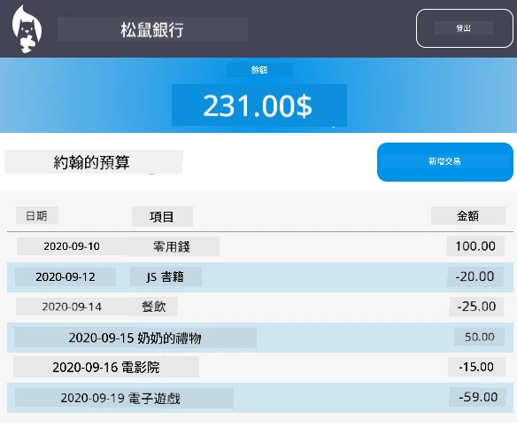

不用一定要一模一樣，拿來當靈感並做出自己的風格吧！

## 課後小考

[課後小考](https://ff-quizzes.netlify.app/web/quiz/46)

## 作業

[重構並加上註解你的程式碼](assignment.md)

---

<!-- CO-OP TRANSLATOR DISCLAIMER START -->
**免責聲明**：  
本文件係使用 AI 翻譯服務 [Co-op Translator](https://github.com/Azure/co-op-translator) 進行翻譯。雖然我們致力於確保翻譯的準確性，但請注意，自動翻譯可能包含錯誤或不準確之處。原始文件的母語版本應視為權威來源。對於重要資訊，建議採用專業人工翻譯。對於因使用本翻譯所引起的任何誤解或誤譯，我們不承擔任何責任。
<!-- CO-OP TRANSLATOR DISCLAIMER END -->