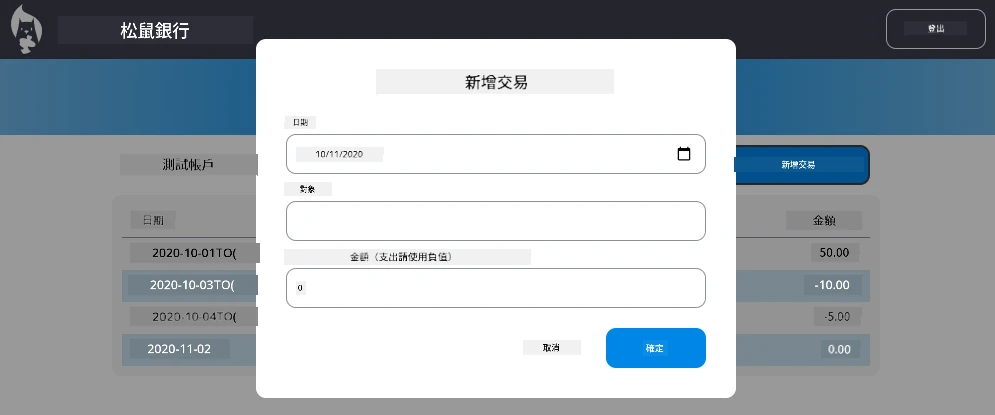

# 實作「新增交易」對話框

## 概覽

你的銀行應用程式現在已有穩健的狀態管理和資料持久化功能，但缺少一個真實銀行應用程式必備的關鍵功能：使用者能夠新增自己的交易。在這個作業中，你將實作一個完整的「新增交易」對話框，能無縫整合到你現有的狀態管理系統中。

這個作業結合了你在四堂銀行課中所學的所有內容：HTML 範本、表單處理、API 整合與狀態管理。

## 學習目標

完成此作業後，你將能：
- **建立**使用者友善的資料輸入對話框介面
- **實作**可存取的表單設計，支援鍵盤與螢幕閱讀器
- **整合**新功能與你現有的狀態管理系統
- **練習**API 通訊與錯誤處理
- **應用**現代網頁開發模式到真實功能

## 指示

### 步驟 1：新增交易按鈕

**建立**一個「新增交易」按鈕，放在儀表板頁面上，讓使用者能輕鬆找到並存取。

**需求：**
- **將**按鈕放在儀表板的合適位置
- **使用**明確且具行動導向的按鈕文字
- **套用**與你現有 UI 設計一致的按鈕樣式
- **確保**按鈕可用鍵盤操作

### 步驟 2：對話框實作

從以下兩種方法選擇一種實作你的對話框：

**選項 A：獨立頁面**
- **建立**交易表單的新 HTML 範本
- **新增**路由到你的路由系統
- **實作**前往及返回表單頁面的導航

**選項 B：模態對話框（推薦）**
- **使用**JavaScript 在不離開儀表板的情況下顯示/隱藏對話框
- **利用**[`hidden` 屬性](https://developer.mozilla.org/docs/Web/HTML/Global_attributes/hidden)或 CSS 類別實作
- **創造**順暢的使用者體驗，並妥善管理焦點

### 步驟 3：無障礙實作

**確保**你的對話框符合[模態對話框無障礙標準](https://developer.paciellogroup.com/blog/2018/06/the-current-state-of-modal-dialog-accessibility/)：

**鍵盤導航：**
- **支援**按 Esc 鍵關閉對話框
- **限制**當對話框開啟時焦點只在對話框內移動
- **關閉**後焦點回到觸發按鈕

**螢幕閱讀器支援：**
- **加入**適當的 ARIA 標籤和角色
- **向**螢幕閱讀器宣告對話框的開啟與關閉
- **提供**清楚的表單欄位標籤與錯誤訊息

### 步驟 4：表單建立

**設計**一個收集交易資料的 HTML 表單：

**必填欄位：**
- **日期**：交易發生的時間
- **描述**：交易用途
- **金額**：交易金額（收入為正數，支出為負數）

**表單功能：**
- **提交前**驗證使用者輸入
- **提供**無效資料的清楚錯誤訊息
- **包含**有用的 placeholder 文字與標籤
- **樣式**與你現有設計保持一致

### 步驟 5：API 整合

**將**你的表單連接到後端 API：

**實作步驟：**
- **參考**[伺服器 API 規格](../api/README.md)了解正確的端點與資料格式
- **從**表單輸入建立 JSON 資料
- **送出**資料至 API，並妥善處理錯誤
- **向**使用者顯示成功或失敗訊息
- **優雅地**處理網路錯誤

### 步驟 6：狀態管理整合

**以新交易更新你的儀表板：**

**整合需求：**
- **交易新增成功後**重新整理帳戶資料
- **更新**儀表板畫面，不需重新載入頁面
- **確保**新交易立即顯示
- **維持**整個流程中的狀態一致性

## 技術規格

**API 端點詳情：**
請參考[伺服器 API 文件](../api/README.md)了解：
- 交易資料所需的 JSON 格式
- HTTP 方法與端點 URL
- 預期的回應格式
- 錯誤回應處理

**預期成果：**
完成此作業後，你的銀行應用程式應該擁有一個外觀專業且功能完整的「新增交易」功能：

## 測試你的實作

**功能測試：**
1. **確認**「新增交易」按鈕明顯且可存取
2. **測試**對話框是否能正常開啟與關閉
3. **驗證**所有必填欄位的表單驗證功能
4. **確認**成功新增的交易能立即出現在儀表板
5. **確保**無效資料與網路問題會正確處理錯誤

**無障礙測試：**
1. **僅用鍵盤**瀏覽整個操作流程
2. **搭配**螢幕閱讀器測試宣告是否正確
3. **驗證**焦點管理是否正常
4. **檢查**所有表單元素都有適當標籤

## 評分標準

| 評分標準 | 優異 | 適當 | 需改進 |
| -------- | ------ | ------ | ---------- |
| **功能性** | 新增交易功能運作流暢，使用者體驗優秀且遵循課程最佳實務 | 新增交易功能正常，但可能未完全遵循部分最佳實務或有些微易用性問題 | 新增交易功能部分可用或有重大易用性問題 |
| **程式碼品質** | 程式碼組織良好，遵循既有模式，具備良好錯誤處理，與現有狀態管理完美整合 | 程式碼可用，但可能有組織問題或與現有程式碼基底不一致 | 程式碼結構有重大問題，且未與既有模式良好整合 |
| **無障礙** | 完整鍵盤導航支援，螢幕閱讀器相容，符合 WCAG 指南，焦點管理優異 | 實作基礎無障礙功能，但可能缺少部分鍵盤導航或螢幕閱讀器支援 | 無或極少無障礙考量 |
| **使用者體驗** | 介面直覺且有質感，包含明確回饋、流暢互動與專業外觀 | 使用者體驗良好，但回饋或視覺設計有小幅提升空間 | 使用者介面混亂，缺少明確回饋 |

## 額外挑戰（選擇性）

完成基本需求後，考慮以下增強功能：

**進階功能：**
- **新增**交易類別（食物、交通、娛樂等）
- **實作**輸入即時驗證與回饋
- **建立**進階使用者的快捷鍵
- **加入**交易編輯與刪除功能

**高階整合：**
- **實作**最近新增交易的復原功能
- **增加**CSV 檔案批次匯入交易
- **建立**交易搜尋與篩選功能
- **實作**資料匯出功能

這些選擇性功能能幫助你練習更進階的網頁開發概念，打造更完整的銀行應用程式！

---

<!-- CO-OP TRANSLATOR DISCLAIMER START -->
**免責聲明**：  
本文件由 AI 翻譯服務 [Co-op Translator](https://github.com/Azure/co-op-translator) 進行翻譯。雖然我們致力於準確性，但請注意自動翻譯可能包含錯誤或不準確之處。原始文件的母語版本應視為權威來源。對於重要資訊，建議採用專業人工翻譯。我們不對因使用本翻譯所產生的任何誤解或誤釋負責。
<!-- CO-OP TRANSLATOR DISCLAIMER END -->