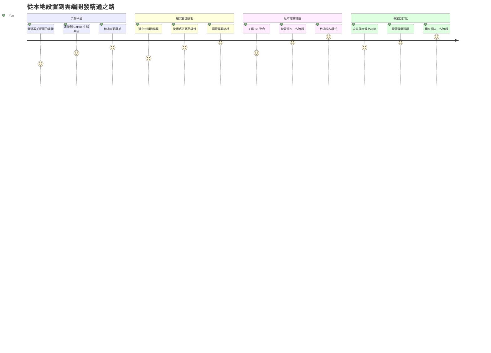
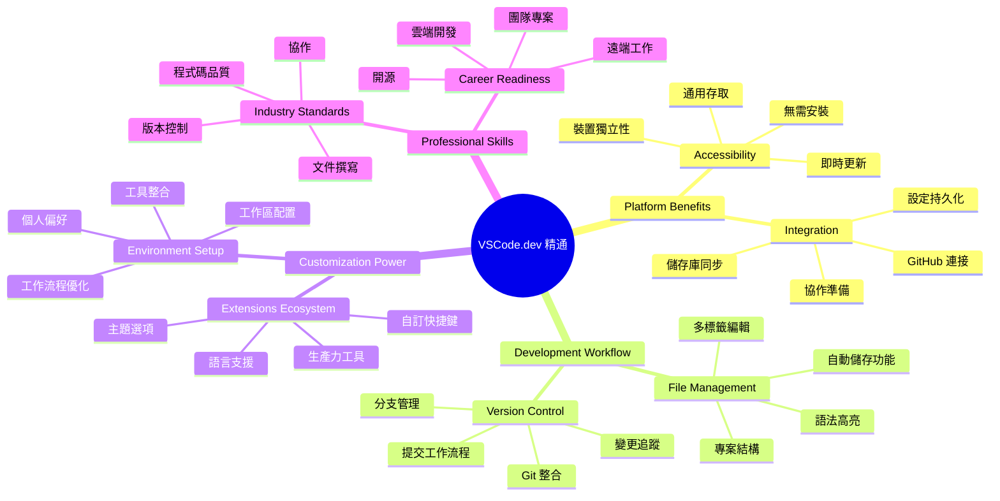
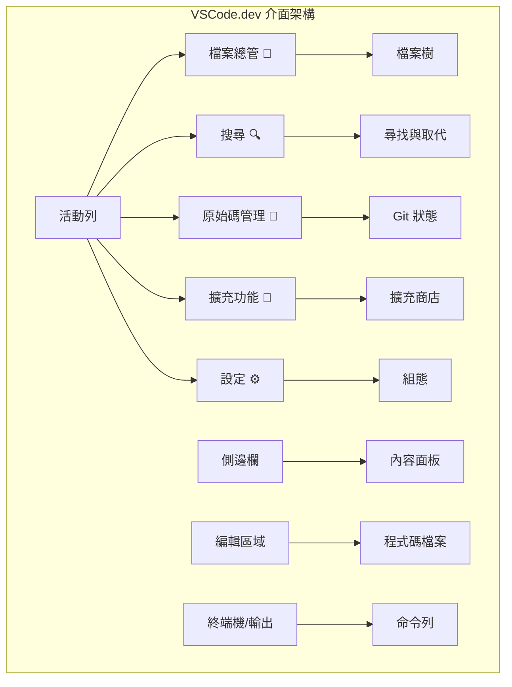
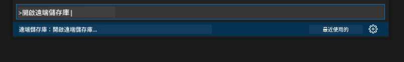
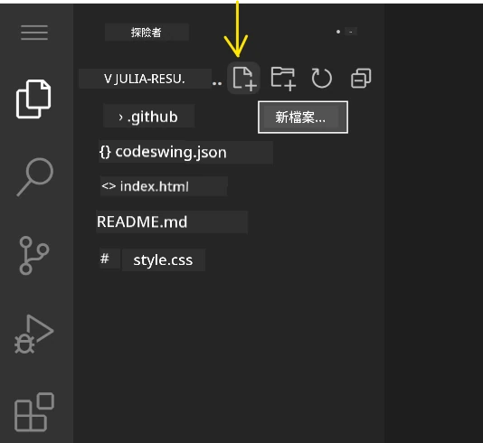
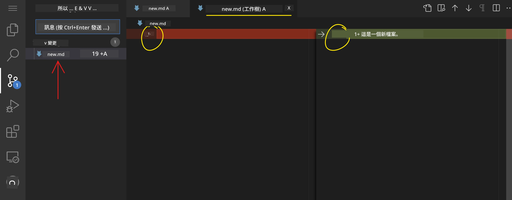
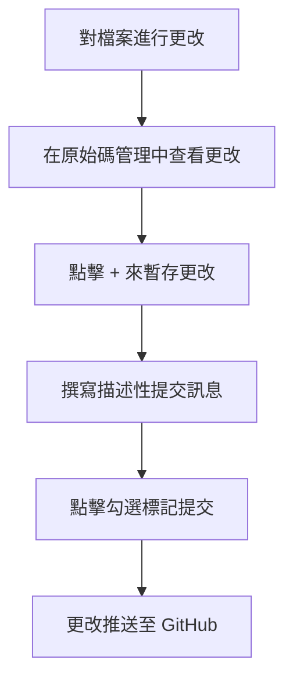
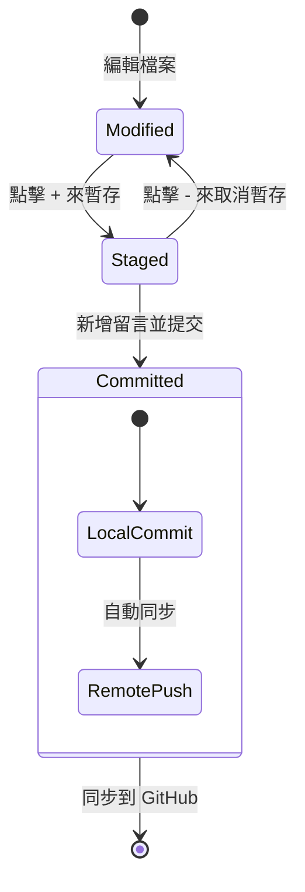
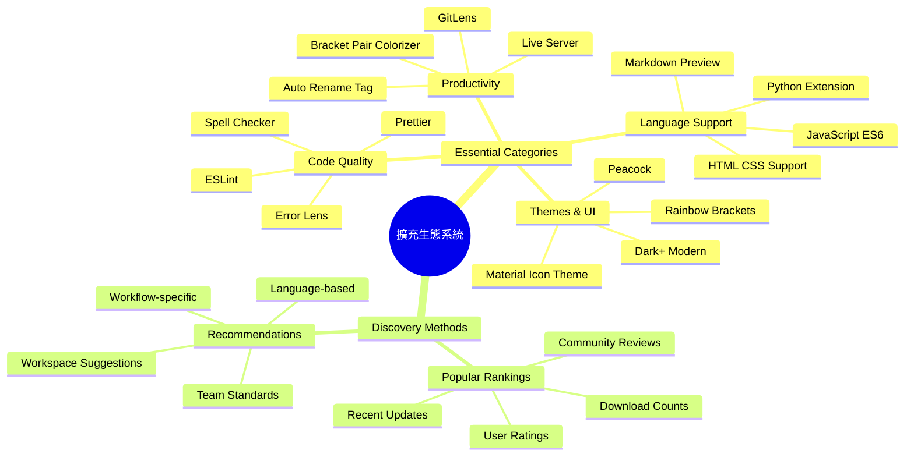
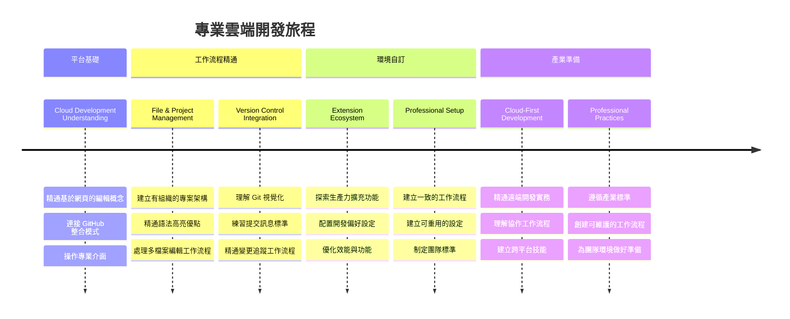

# 使用程式碼編輯器：掌握 VSCode.dev

還記得在《駭客任務》中，尼歐必須連接到一個巨大的電腦終端機才能進入數位世界嗎？現今的網頁開發工具則是完全相反的故事 — 強大的功能隨時隨地皆可使用。VSCode.dev 是一個基於瀏覽器的程式碼編輯器，將專業開發工具帶到任何有網路連線的裝置上。

就像印刷術讓書籍普及，不再只是修道院裡的抄寫員專享，VSCode.dev 也讓程式碼編寫民主化。你可以在圖書館電腦、學校實驗室，或任何能開瀏覽器的地方工作。免安裝，沒有「我需要特定開發環境」的限制。

本課程結束時，你將學會如何在 VSCode.dev 中導航，直接在瀏覽器中開啟 GitHub 倉庫，並使用 Git 進行版本控管 — 這些都是專業開發者每日倚賴的技能。

## ⚡ 你接下來五分鐘能做什麼

**忙碌開發者的快速入門路徑**


- **第 1 分鐘**：前往 [vscode.dev](https://vscode.dev) — 完全免安裝
- **第 2 分鐘**：使用 GitHub 登入，連結你的倉庫
- **第 3 分鐘**：試試 URL 技巧：將任何倉庫 URL 的 `github.com` 改成 `vscode.dev/github`
- **第 4 分鐘**：建立新檔案，並觀察語法高亮自動生效
- **第 5 分鐘**：修改檔案並經由版本控制面板提交變更

**快速測試網址**：
```
# Transform this:
github.com/microsoft/Web-Dev-For-Beginners

# Into this:
vscode.dev/github/microsoft/Web-Dev-For-Beginners
```

**為何這很重要**：5 分鐘內，你將體驗從任何地方使用專業工具編碼的自由。這正是開發的未來 — 開放、強大且即時。

## 🗺️ 你的雲端開發學習旅程


**你的學習目標**：課程結束時，你將能熟練使用一套專業的雲端開發環境，無論任何裝置皆可操作，使用與頂尖科技公司開發者相同的工具來編寫程式。

## 你將學會什麼

完成本課程後，你能：

- 像在家一樣自在瀏覽 VSCode.dev — 輕鬆找到所需功能不迷路
- 直接在瀏覽器中打開任何 GitHub 倉庫，立即開始編輯（很神奇！）
- 使用 Git 追蹤變更，專業儲存你的進度
- 利用擴充功能強化編輯器，讓編碼更快速有趣
- 有信心地建立與整理專案檔案

## 你需要準備什麼

需求簡單明確：

- 一個免費的 [GitHub 帳號](https://github.com)（若無，我們會帶你註冊）
- 基本的瀏覽器使用經驗
- GitHub 基礎課程提供有用背景知識，非必要但建議閱讀

> 💡 **GitHub 新手看過來**：註冊帳號免費且快速。就像圖書證讓你能借用全球的書籍，GitHub 帳號讓你進入全球各地的程式碼倉庫。

## 🧠 雲端開發生態系統概述


**核心理念**：基於雲端的開發環境是程式編寫的未來 — 提供專業、可協作且平台無關的開發工具。

## 為何網頁型程式碼編輯器重要

在網路普及之前，不同大學的科學家無法輕易共享研究資料。1960 年代的 ARPANET 連結了遠距電腦。網頁型程式碼編輯器遵循同樣理念 — 讓強大工具不受地點或裝置限制。

程式碼編輯器是你的開發工作空間，用於撰寫、修改、整理程式碼檔案。與簡單的文字編輯器不同，專業編輯器有語法高亮、錯誤偵測與專案管理功能。

VSCode.dev 將這些能力帶到瀏覽器中：

**網頁編輯優勢：**

| 功能 | 說明 | 實用好處 |
|---------|-------------|----------|
| **平台無關** | 可於任何具瀏覽器的裝置使用 | 無縫在不同電腦間工作 |
| **免安裝** | 透過網頁 URL 直接存取 | 避免軟體安裝限制 |
| **自動更新** | 永遠運行最新版本 | 享受新功能不需手動更新 |
| **倉庫整合** | 直接連結 GitHub | 編輯程式無需本地管理檔案 |

**實際效益：**
- 在不同環境間保持工作連續性
- 操作介面跨作業系統一致
- 立即啟用協作功能
- 降低本機儲存需求

## 探索 VSCode.dev

就如同居禮夫人實驗室中擁有先進設備且空間簡潔，VSCode.dev 也將專業開發工具整合到瀏覽器介面中。本網頁應用具有與桌面版編輯器相同的核心功能。

首先在瀏覽器開啟 [vscode.dev](https://vscode.dev)，介面立即載入，無需下載或安裝系統 — 充分展現雲端運算精神。

### 連結你的 GitHub 帳戶

正如貝爾的電話連結遠方，連結 GitHub 帳戶則橋接 VSCode.dev 與你的程式碼倉庫。提示登錄 GitHub 時，建議接受此連結。

**GitHub 整合提供：**
- 編輯器中直接訪問你的倉庫
- 在裝置間同步設定和擴充功能
- 簡化將變更推送至 GitHub 的流程
- 個人化開發環境

### 認識你的新工作區

完成載入後，你將看到一個潔淨、專注於程式碼的工作環境！


**社區導覽：**
- **活動列**（左側那條）：主導航，有檔案總管 📁、搜尋 🔍、版本控制 🌿、擴充功能 🧩 和設定 ⚙️
- **側邊欄**（旁邊面板）：視所選項顯示相應資訊
- **編輯區域**（中間大片區域）：這是編碼的主要場域

**花點時間探索：**
- 點擊活動列圖示並了解它們功能
- 注意側邊欄如何根據選擇動態變化 — 很酷吧？
- 檔案總管(📁)大概是你會花最多時間的地方，熟悉它吧！


## 開啟 GitHub 倉庫

在網際網路尚未普及前，研究人員必須親自到圖書館翻閱資料。GitHub 倉庫類似遠端存放的程式碼集合。VSCode.dev 則省去下載到本機才編輯的繁瑣步驟。

這功能讓你能立刻打開任何公開倉庫，查看、編輯或貢獻。以下兩種開啟倉庫方式：

### 方法 1：點擊介面操作

適合剛開始使用 VSCode.dev 想打開指定倉庫的新手。簡單易懂：

**操作步驟：**

1. 若還沒開啟，先前往 [vscode.dev](https://vscode.dev)
2. 在歡迎畫面按「Open Remote Repository」（開啟遠端倉庫）按鈕

   

3. 貼上任意 GitHub 倉庫網址（例如：`https://github.com/microsoft/Web-Dev-For-Beginners`）
4. 按 Enter，驚喜等著你！

**高手小技巧 — 命令選單快捷鍵：**

想像自己是程式大師？用 Ctrl+Shift+P（Mac 版是 Cmd+Shift+P）開啟命令選單：



**命令選單就像萬能搜索引擎：**
- 輸入「open remote」可快速找到打開遠端倉庫功能
- 它會記住你最近打開的倉庫（超方便！）
- 用熟了後，你編程速度爆棚
- VSCode.dev 的「嘿 Siri，但為編碼而生」

### 方法 2：URL 修改法

就像 HTTP 和 HTTPS 使用不同協定但網址一樣，VSCode.dev 遵循一套與 GitHub 相似的 URL 規則。任何 GitHub 倉庫網址均可改寫成 VSCode.dev 形式。

**網址轉換範例：**

| 倉庫類型 | GitHub 網址 | VSCode.dev 網址 |
|----------------|---------------------|----------------|
| **公開倉庫** | `github.com/microsoft/Web-Dev-For-Beginners` | `vscode.dev/github/microsoft/Web-Dev-For-Beginners` |
| **個人專案** | `github.com/your-username/my-project` | `vscode.dev/github/your-username/my-project` |
| **任何可訪問倉庫** | `github.com/their-username/awesome-repo` | `vscode.dev/github/their-username/awesome-repo` |

**使用方法：**
- 將 URL 中的 `github.com` 替換成 `vscode.dev/github`
- 其餘網址結構不變
- 支援任何公開可訪問的倉庫
- 立刻打開編輯介面

> 💡 **改變人生的小秘訣**：將你常用的倉庫 VSCode.dev URL 加入書籤。我有「編輯個人作品集」和「修正說明文件」的書籤，直接進入編輯頁面超便利！

**怎麼選擇方法？**
- **介面方式**：適合探索或不確定準確倉庫名稱時
- **URL 技巧**：知道確切路徑時，享受疾速存取

### 🎯 教學反思：雲端開發存取

**暫停思考**：你已學會兩種透過瀏覽器存取程式碼倉庫的方法。這是一場開發方式的根本革新。

**快速自我檢視**：
- 能否解釋為何網頁編輯免去了傳統「開發環境安裝」？
- URL 修改技術相比本地 git 克隆有何優勢？
- 這種方式如何改變你貢獻開源專案的可能？

**實務連結**：GitHub、GitLab、Replit 等大公司已建構基於雲端的開發平台。你正在學習全球專業團隊使用的開發流程。

**挑戰問題**：雲端開發如何改變學校程式教學？請考慮裝置需求、軟體管理和協作可能性。

## 操作檔案與專案

現在你已開啟一個倉庫，我們開始建構！VSCode.dev 提供所有必備工具來創建、編輯及整理程式碼檔案，把它當成你的數位工作坊 — 所有工具盡在掌握。

讓我們看看將構成你日常編碼流程的基本任務。

### 建立新檔案

如同建築師辦公室中整理藍圖，VSCode.dev 中的檔案創建同樣有條理。系統支援所有標準網頁開發檔案類型。

**建立流程：**

1. 在檔案總管側邊欄找到目標資料夾
2. 將游標移至該資料夾名稱，顯示「新檔案」圖標 (📄+)
3. 輸入檔名並包含適當副檔名（如 `style.css`、`script.js`、`index.html`）
4. 按 Enter 建立檔案



**命名規範：**
- 使用描述性名稱便於辨識檔案用途
- 包含副檔名以啟用正確語法高亮
- 專案內保持命名一致性
- 儘量使用小寫及短橫線，避免空白

### 編輯與儲存檔案

真正的樂趣就在這裡開始！VSCode.dev 的編輯器內建豐富功能，讓編碼順暢直覺。就像有個超聰明的寫作助理，只不過它是為程式碼服務。

**你的編輯流程：**

1. 點擊檔案總管中的任一檔案，於主區域打開
2. 開始輸入，觀察 VSCode.dev 用顏色、建議與錯誤偵測協助你
3. 使用 Ctrl+S（Windows/Linux）或 Cmd+S（Mac）儲存 — 編輯器也會自動儲存！


**編碼中的貼心功能：**
- 程式碼自動色彩標記，閱讀清晰
- 輸入時會建議程式碼補全（像更智慧的自動更正）
- 儲存前能發現錯誤和拼字問題
- 可同時開啟多個檔案分頁，像瀏覽器一樣
- 背景自動儲存功能隨時保護你的進度

> ⚠️ **小提醒**：儘管有自動儲存，養成按 Ctrl+S 或 Cmd+S 的習慣仍很重要。能立即儲存並觸發額外的錯誤檢查等幫助功能。

### Git 版本控制

就像考古學家詳細紀錄挖掘層次，Git 追蹤程式碼隨時間的變更。這系統保存專案歷史，必要時還能回復舊版本。VSCode.dev 內建 Git 功能。

**版本控制介面：**

1. 點選活動列的 🌿 圖示開啟版本控制面板
2. 有修改的檔案會出現在「變更 (Changes)」中
3. 顏色代表變更種類：新增為綠色，刪除為紅色



**保存進度（提交流程）：**



**一步步作法：**
- 點擊要保存檔案旁的「+」圖示（即暫存區）
- 再次確認你對所有已暫存的變更感到滿意
- 撰寫一則簡短說明，解釋你做了什麼（這就是你的「提交訊息」）
- 點擊勾選按鈕，將所有內容儲存到 GitHub
- 如果改變主意，點擊復原圖示即可放棄變更

**撰寫好提交訊息（比你想像的簡單！）：**
- 只要描述你做了什麼，例如「新增聯絡表單」或「修正壞掉的導覽列」
- 保持簡短有力 — 想像成推特長度，不是長篇大論
- 以動詞為開頭，如「新增」、「修正」、「更新」或「移除」
- **好範例**：「新增響應式導覽選單」、「修正行動裝置版版面問題」、「更新色彩以提升無障礙性」

> 💡 **快速導覽提示**：使用左上角的漢堡選單 (☰) 快速跳回你的 GitHub 倉庫，查看你已提交的變更。這就像你編輯環境與專案 github 主頁間的傳送門！

## 使用擴充功能提升功能性

就像工匠的工作坊擁有專門工具針對不同任務，VSCode.dev 也能透過擴充功能自訂，為你添加特定能力。這些社群開發的插件解決了常見開發需求，如程式碼格式化、即時預覽，以及加強的 Git 整合。

擴充功能市集匯聚了來自全球開發者的數千款免費工具。每個擴充功能解決特定工作流程挑戰，讓你打造適合自己需求和喜好的個人化開發環境。


### 找到你的完美擴充功能

擴充功能市集組織得非常完善，不會讓你在尋找所需工具時迷路。它設計用來幫助你發現特定工具，也有一些你之前沒察覺的酷東西！

**進入市集方式：**

1. 點選活動欄的擴充功能圖示 (🧩)
2. 瀏覽或搜尋特定功能
3. 點擊任何看起來有趣的項目，查看更多資訊


**你將看到的內容：**

| 區塊 | 內容 | 為何有用 |
|----------|---------|----------|
| **已安裝** | 你已添加的擴充功能 | 你的個人編程工具箱 |
| **熱門** | 大家喜愛的擴充功能 | 多數開發者推薦的工具 |
| **推薦** | 對你的專案有智慧推薦 | VSCode.dev 的貼心建議 |

**讓瀏覽更方便：**
- 每個擴充功能都會顯示評分、下載數及真實用戶評論
- 有截圖和清楚說明其功能
- 清楚標註相容性資訊
- 推薦相似擴充功能方便比對選擇

### 安裝擴充功能（超簡單！）

為你的編輯器添加新功能，只要點按一下。擴充功能幾秒鐘內安裝完成並立即生效 — 不需重啟或等待。

**你只需做這些：**

1. 搜尋你想要的功能（試試搜尋 "live server" 或 "prettier"）
2. 點選看起來不錯的擴充功能，查看詳細資訊
3. 閱讀功能介紹並檢視評價
4. 按下藍色「安裝」按鈕，就完成了！


**幕後發生什麼：**
- 擴充功能自動下載並設定好
- 新功能立刻顯現在介面中
- 立即開始工作（真的這麼快！）
- 若你已登入，擴充功能會同步至所有裝置

**我推薦你先試試：**
- **Live Server**：邊寫程式碼邊看到網站實時更新（神奇！）
- **Prettier**：自動讓你的程式碼看起來乾淨又專業
- **Auto Rename Tag**：修改一個 HTML 標籤，夥伴標籤會自動配對改變
- **Bracket Pair Colorizer**：用顏色標示括號，讓你不迷失
- **GitLens**：大幅強化 Git 功能，提供豐富資訊

### 自訂你的擴充功能

多數擴充功能提供設定供你調整，使其完全符合你的需求。就像調整車座和後視鏡 — 每個人都有自己的喜好！

**調整擴充功能設定：**

1. 在擴充功能面板找到你已安裝的擴充功能
2. 找尋名稱旁的齒輪圖示 (⚙️) 點擊它
3. 從下拉選單選擇「擴充功能設定」
4. 調整設定直到符合你的工作流程需求


**常見你可能想調整的項目：**
- 程式碼格式化方式（tab 或空格、行寬等等）
- 觸發不同功能的鍵盤快捷鍵
- 擴充功能應作用的檔案類型
- 開啟或關閉特定功能保持整潔

### 維持擴充功能的組織有序

當你發現更多酷炫擴充功能時，想必會希望保持收藏乾淨且順暢運作。VSCode.dev 提供非常方便的管理方式。

**你的擴充功能管理選項：**

| 可操作項目 | 何時有用 | 專家小撇步 |
|--------|---------|----------|
| **停用** | 測試是否是擴充功能出錯 | 比卸載更方便，方便後續再啟用 |
| **卸載** | 完全移除不需要的擴充功能 | 保持環境乾淨且執行速度快 |
| **更新** | 獲得最新功能與修正 | 通常自動，但值得留意是否有更新 |

**我喜歡的管理作法：**
- 每隔數月檢視已安裝的擴充功能，移除不再使用的
- 保持擴充功能更新，獲取最新改良和安全修補
- 遇到速度變慢時暫時停用擴充功能，找出元凶
- 閱讀重大更新說明，有時會有超棒的新功能！

> ⚠️ **性能建議**：擴充功能很棒，但太多會拖慢速度。集中使用真正幫助你的擴充功能，不用怕刪除從未使用過的。

### 🎯 教學反思檢核：開發環境客製化

**架構理解**：你已學會使用社群製作的擴充功能，客製化專業的開發環境。這也反映企業開發團隊建立標準化工具鏈的作法。

**掌握的關鍵概念**：
- **擴充功能發掘**：尋找可解決開發痛點的工具
- **環境設定**：依據個人或團隊喜好調整工具
- **效能優化**：在功能和系統效能間取得平衡
- **社群合作**：利用全球開發者創造的工具

**產業連結**：擴充功能生態系統是 VS Code、Chrome DevTools 及現代 IDE 等主要平臺的動力。懂得如何評估、安裝與設定擴充功能，是專業工作流程的基礎。

**反思問題**：你會怎麼為一組 10 人的開發團隊設置標準化開發環境？考慮一致性、效能以及個人偏好。

## 📈 你的雲端開發精通時間表


**🎓 畢業里程碑**：你成功掌握了使用大型科技公司專業開發者相同工具和流程的雲端開發技能。這些技能代表軟體開發的未來。

**🔄 下一層能力：**
- 準備探索進階雲端開發平台（Codespaces、GitPod）
- 準備分散式開發團隊合作
- 有能力全球貢獻開源專案
- 為現代 DevOps 與持續整合奠定基礎

## GitHub Copilot Agent 挑戰 🚀

就像 NASA 執行太空任務的系統化方法，此挑戰要求你系統性地運用 VSCode.dev 技能完成完整工作流程。

**目標：** 以 Agent 模式協助下，展示你對 VSCode.dev 的熟練度，建立完善的網站開發工作流程。

**專案要求：** 使用代理模式完成以下任務：
1. 派生現有儲存庫或建立新儲存庫
2. 建立包含 HTML、CSS 及 JavaScript 檔案的功能性專案結構
3. 安裝並設定三個開發強化擴充功能
4. 使用有描述性的提交訊息實踐版本控管
5. 嘗試建立並修改功能分支
6. 在 README.md 文件中記錄過程及學習心得

此練習匯集了所有 VSCode.dev 概念，讓你應用於未來開發專案的實務工作流程中。

在此了解更多[agent 模式](https://code.visualstudio.com/blogs/2025/02/24/introducing-copilot-agent-mode)。

## 作業

是時候實戰一番！我有個親自操作的專案，讓你練習所有我們涵蓋的內容：[使用 VSCode.dev 製作履歷網站](./assignment.md)

此作業引導你在瀏覽器內建置專業履歷網站。你會用到所有我們探討過的 VSCode.dev 功能，結束時將擁有一個令人滿意的網站和紮實的工作流程信心。

## 繼續探索並提升你的技能

你已有堅實基礎，但還有更多精彩等著你去發掘！這裡有些資源和想法，助你把 VSCode.dev 技能提升到下一階段：

**官方文件推薦收藏：**
- [VSCode Web 文件](https://code.visualstudio.com/docs/editor/vscode-web?WT.mc_id=academic-0000-alfredodeza) — 瀏覽器編輯的完整指南
- [GitHub Codespaces](https://docs.github.com/en/codespaces) — 想要雲端更強大時的選擇

**值得下一步試試的酷功能：**
- **鍵盤快捷鍵**：學會組合鍵，讓你變身編碼高手
- **工作區設定**：為不同類型專案設置獨立環境
- **多根目錄工作區**：同時在多個儲存庫工作（超方便！）
- **終端機整合**：直接在瀏覽器中使用命令列工具

**練習點子：**
- 加入開源專案，用 VSCode.dev 貢獻代碼 — 很好的回饋方式！
- 嘗試各種擴充功能，找到你的完美組合
- 為你常建置的網站類型製作專案範本
- 練習 Git 工作流程，如分支和合併 — 團隊合作中極為珍貴的技能

---

**你已精通瀏覽器編程！** 🎉 就像便攜式儀器讓科學家能在偏遠地區進行研究，VSCode.dev 讓你能從任何連網裝置進行專業程式設計。

這些技能反映當今產業實務 — 許多專業開發者使用雲端開發環境，因其彈性與可及性。你學到的工作流程可以從個人專案擴展至大型團隊合作。

將這些技巧應用到你的下一個開發專案吧！ 🚀

---

<!-- CO-OP TRANSLATOR DISCLAIMER START -->
**免責聲明**：  
本文件係使用 AI 翻譯服務 [Co-op Translator](https://github.com/Azure/co-op-translator) 進行翻譯。雖然我們致力於提供準確的內容，但請注意，自動翻譯結果可能包含錯誤或不準確之處。原始文件的母語版本應視為具權威性的依據。對於重要資訊，建議採用專業人工翻譯。我們不對因使用本翻譯內容而產生的任何誤解或誤譯負責。
<!-- CO-OP TRANSLATOR DISCLAIMER END -->