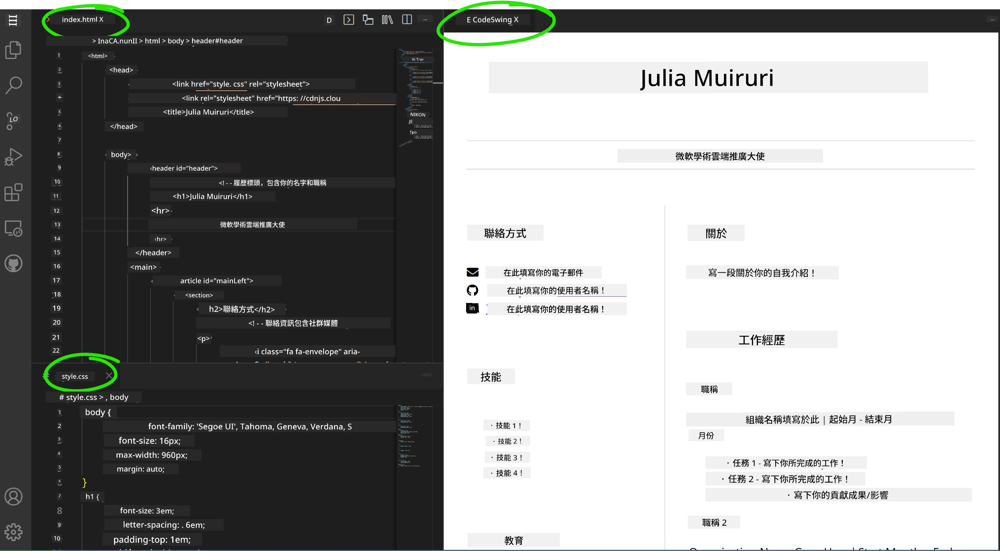

# 使用 VSCode.dev 建立履歷網站

透過建立一個專業的履歷網站，以互動且現代化的方式展示你的技能與經驗，徹底改變你的職涯前景。想像一下，不再是傳統的 PDF，而是提供給招募人員一個時尚且響應式的網站，不僅展現你的資格，也同時展現你的網頁開發能力。

這個動手作業讓你將所有 VSCode.dev 技能付諸實踐，並打造出對你的職涯真正有用的東西。你將體驗完整的網頁開發工作流程——從建立程式庫到部署——全部都在瀏覽器中完成。

完成此專案後，你將擁有一個專業的線上形象，能輕鬆分享給潛在雇主，隨著技能成長隨時更新，並可自訂以符合你的個人品牌。這正是能展現實務網頁開發技能的理想專案。

## 學習目標

完成此作業後，你將能：

- **使用 VSCode.dev** 創建並管理完整的網頁開發專案
- **使用語義化 HTML 元素** 結構化專業網站
- **使用現代 CSS 技術** 設計響應式佈局
- **運用基礎網頁技術** 實作互動功能
- **部署** 可透過分享連結存取的網站
- **示範版本控制最佳實踐**，貫穿開發流程

## 先備條件

開始本作業前，請確認你已具備：

- 一個 GitHub 帳號（如需建立，請至 [github.com](https://github.com/)）
- 完成 VSCode.dev 介面導覽與基本操作課程
- 基本的 HTML 結構與 CSS 樣式概念

## 專案設定與程式庫建立

讓我們先打造專案基礎。此流程與現實開發工作流程相符，從適當初始化程式庫和規劃專案結構開始。

### 步驟 1：建立 GitHub 程式庫

設立專屬儲存庫可確保專案從一開始就具備良好的組織與版本控制。

1. **前往** [GitHub.com](https://github.com) 並登入帳號
2. **點擊** 右上角綠色「New」按鈕或「+」圖示
3. **命名** 你的程式庫為 `my-resume`（或依個人喜好，如 `john-smith-resume`）
4. **新增** 簡短描述：「以 HTML 與 CSS 建立的專業履歷網站」
5. **選擇** 公開（Public），使履歷網頁對潛在雇主可見
6. **勾選** 「Add a README file」，創建專案初始說明檔
7. **點擊** 「Create repository」完成設定

> 💡 **儲存庫命名小撇步**：使用描述性且專業的名稱，明確指出專案用途，有助於分享給雇主或作品集檢視。

### 步驟 2：初始化專案結構

因為 VSCode.dev 至少要有一個檔案才能開啟專案，我們先在 GitHub 上直接建立主要 HTML 檔。

1. 在新建立的程式庫中，**點擊**「creating a new file」連結
2. **輸入** 檔名為 `index.html`
3. **新增** 以下初始 HTML 結構：

```html
<!DOCTYPE html>
<html lang="en">
<head>
    <meta charset="UTF-8">
    <meta name="viewport" content="width=device-width, initial-scale=1.0">
    <title>Your Name - Professional Resume</title>
</head>
<body>
    <h1>Your Name</h1>
    <p>Professional Resume Website</p>
</body>
</html>
```

4. **填寫** commit 訊息：「Add initial HTML structure」
5. **點擊**「Commit new file」儲存變更


**這個初始設定完成了：**
- **建立** 正確的 HTML5 文件結構並使用語義元素
- **包含** viewport meta 標籤支援響應式設計
- **設定** 可在瀏覽器分頁顯示的描述性頁面標題
- **奠定** 專業內容組織基礎

## 在 VSCode.dev 中工作

程式庫基礎建立後，接著切換到 VSCode.dev 進行主要開發工作。這款網頁版編輯器提供專業網頁開發所需的所有工具。

### 步驟 3：在 VSCode.dev 開啟專案

1. **在新分頁** 開啟 [vscode.dev](https://vscode.dev)
2. **在歡迎畫面點選**「Open Remote Repository」
3. **從 GitHub 複製** 程式庫網址並貼上輸入框

   格式：`https://github.com/your-username/my-resume`
   
   *將 `your-username` 替換成你的 GitHub 使用者名稱*

4. **按下 Enter 載入專案**

✅ **成功指標**：你將在 Explorer 側欄看到專案檔案，並在主編輯區可以編輯 `index.html`。


**介面會顯示：**
- **Explorer 側欄**：**呈現** 程式庫檔案與資料夾結構
- **編輯區**：**顯示** 選取檔案內容供編輯
- **活動列**：**提供** 原始碼控管與擴充功能
- **狀態列**：**顯示** 連線狀態與目前分支資訊

### 步驟 4：構建履歷內容

將 `index.html` 中的範例內容替換為完整的履歷結構。此 HTML 是專業履歷呈現的基礎。

<details>
<summary><b>完整 HTML 履歷結構</b></summary>

```html
<!DOCTYPE html>
<html lang="en">
<head>
    <meta charset="UTF-8">
    <meta name="viewport" content="width=device-width, initial-scale=1.0">
    <link href="style.css" rel="stylesheet">
    <link rel="stylesheet" href="https://cdnjs.cloudflare.com/ajax/libs/font-awesome/5.15.4/css/all.min.css">
    <title>Your Name - Professional Resume</title>
</head>
<body>
    <header id="header">
        <h1>Your Full Name</h1>
        <hr>
        <p class="role">Your Professional Title</p>
        <hr>
    </header>
    
    <main>
        <article id="mainLeft">
            <section>
                <h2>CONTACT</h2>
                <p>
                    <i class="fa fa-envelope" aria-hidden="true"></i>
                    <a href="mailto:your.email@domain.com">your.email@domain.com</a>
                </p>
                <p>
                    <i class="fab fa-github" aria-hidden="true"></i>
                    <a href="https://github.com/your-username">github.com/your-username</a>
                </p>
                <p>
                    <i class="fab fa-linkedin" aria-hidden="true"></i>
                    <a href="https://linkedin.com/in/your-profile">linkedin.com/in/your-profile</a>
                </p>
            </section>
            
            <section>
                <h2>SKILLS</h2>
                <ul>
                    <li>HTML5 & CSS3</li>
                    <li>JavaScript (ES6+)</li>
                    <li>Responsive Web Design</li>
                    <li>Version Control (Git)</li>
                    <li>Problem Solving</li>
                </ul>
            </section>
            
            <section>
                <h2>EDUCATION</h2>
                <h3>Your Degree or Certification</h3>
                <p>Institution Name</p>
                <p>Start Date - End Date</p>
            </section>
        </article>
        
        <article id="mainRight">
            <section>
                <h2>ABOUT</h2>
                <p>Write a compelling summary that highlights your passion for web development, key achievements, and career goals. This section should give employers insight into your personality and professional approach.</p>
            </section>
            
            <section>
                <h2>WORK EXPERIENCE</h2>
                <div class="job">
                    <h3>Job Title</h3>
                    <p class="company">Company Name | Start Date – End Date</p>
                    <ul>
                        <li>Describe a key accomplishment or responsibility</li>
                        <li>Highlight specific skills or technologies used</li>
                        <li>Quantify impact where possible (e.g., "Improved efficiency by 25%")</li>
                    </ul>
                </div>
                
                <div class="job">
                    <h3>Previous Job Title</h3>
                    <p class="company">Previous Company | Start Date – End Date</p>
                    <ul>
                        <li>Focus on transferable skills and achievements</li>
                        <li>Demonstrate growth and learning progression</li>
                        <li>Include any leadership or collaboration experiences</li>
                    </ul>
                </div>
            </section>
            
            <section>
                <h2>PROJECTS</h2>
                <div class="project">
                    <h3>Project Name</h3>
                    <p>Brief description of what the project accomplishes and technologies used.</p>
                    <a href="#" target="_blank">View Project</a>
                </div>
            </section>
        </article>
    </main>
</body>
</html>
```
</details>

**自訂建議：**
- **替換** 所有預留文字為你的真實資訊
- **依經驗與職涯重點** 調整章節內容
- **加入或刪除** 章節（例如：證照、志工經驗、語言能力）
- **包含** 實際的個人連結和專案展示

### 步驟 5：建立支援檔案

專業網站需要有組織的檔案結構。創建 CSS 樣式表與設定檔以完成專案。

1. **將滑鼠停留** 在 Explorer 側欄的專案資料夾名稱上
2. **點擊** 出現的「新增檔案」圖示（📄+）
3. **依序建立** 這些檔案：
   - `style.css`（負責樣式與佈局）
   - `codeswing.json`（用於預覽擴充設定）

**建立 CSS 樣式檔 (`style.css`)：**

<details>
<summary><b>專業 CSS 樣式</b></summary>

```css
/* Modern Resume Styling */
body {
    font-family: 'Segoe UI', Tahoma, Geneva, Verdana, sans-serif;
    font-size: 16px;
    line-height: 1.6;
    max-width: 960px;
    margin: 0 auto;
    padding: 20px;
    color: #333;
    background-color: #f9f9f9;
}

/* Header Styling */
header {
    text-align: center;
    margin-bottom: 3em;
    padding: 2em;
    background: linear-gradient(135deg, #667eea 0%, #764ba2 100%);
    color: white;
    border-radius: 10px;
    box-shadow: 0 4px 6px rgba(0, 0, 0, 0.1);
}

h1 {
    font-size: 3em;
    letter-spacing: 0.1em;
    margin-bottom: 0.2em;
    font-weight: 300;
}

.role {
    font-size: 1.3em;
    font-weight: 300;
    margin: 1em 0;
}

/* Main Content Layout */
main {
    display: grid;
    grid-template-columns: 35% 65%;
    gap: 3em;
    margin-top: 3em;
    background: white;
    padding: 2em;
    border-radius: 10px;
    box-shadow: 0 2px 10px rgba(0, 0, 0, 0.1);
}

/* Typography */
h2 {
    font-size: 1.4em;
    font-weight: 600;
    margin-bottom: 1em;
    color: #667eea;
    border-bottom: 2px solid #667eea;
    padding-bottom: 0.3em;
}

h3 {
    font-size: 1.1em;
    font-weight: 600;
    margin-bottom: 0.5em;
    color: #444;
}

/* Section Styling */
section {
    margin-bottom: 2.5em;
}

#mainLeft {
    border-right: 1px solid #e0e0e0;
    padding-right: 2em;
}

/* Contact Links */
section a {
    color: #667eea;
    text-decoration: none;
    transition: color 0.3s ease;
}

section a:hover {
    color: #764ba2;
    text-decoration: underline;
}

/* Icons */
i {
    margin-right: 0.8em;
    width: 20px;
    text-align: center;
    color: #667eea;
}

/* Lists */
ul {
    list-style: none;
    padding-left: 0;
}

li {
    margin: 0.5em 0;
    padding: 0.3em 0;
    position: relative;
}

li:before {
    content: "▸";
    color: #667eea;
    margin-right: 0.5em;
}

/* Work Experience */
.job, .project {
    margin-bottom: 2em;
    padding-bottom: 1.5em;
    border-bottom: 1px solid #f0f0f0;
}

.company {
    font-style: italic;
    color: #666;
    margin-bottom: 0.5em;
}

/* Responsive Design */
@media (max-width: 768px) {
    main {
        grid-template-columns: 1fr;
        gap: 2em;
    }
    
    #mainLeft {
        border-right: none;
        border-bottom: 1px solid #e0e0e0;
        padding-right: 0;
        padding-bottom: 2em;
    }
    
    h1 {
        font-size: 2.2em;
    }
    
    body {
        padding: 10px;
    }
}

/* Print Styles */
@media print {
    body {
        background: white;
        color: black;
        font-size: 12pt;
    }
    
    header {
        background: none;
        color: black;
        box-shadow: none;
    }
    
    main {
        box-shadow: none;
    }
}
```
</details>

**建立設定檔 (`codeswing.json`)：**

```json
{
    "scripts": [],
    "styles": []
}
```

**CSS 特性說明：**
- **採用** CSS Grid 打造響應式、專業版面結構
- **實作** 現代漸層配色的頁首設計
- **包含** 滑鼠懸停效果與平滑過渡互動體驗
- **提供** 適用各種裝置尺寸的韌性設計
- **添加** 友善列印的樣式方便產生 PDF

### 步驟 6：安裝與設定擴充功能

擴充功能能提升開發體驗，如即時預覽與流程優化。CodeSwing 擴充是網頁專案的實用工具。

**安裝 CodeSwing 擴充：**

1. **點擊** 活動列的擴充功能圖示（🧩）
2. **在市場搜尋框** 輸入「CodeSwing」
3. **在結果中選擇** CodeSwing 擴充
4. **點擊** 藍色「Install」按鈕安裝


**CodeSwing 可提供：**
- **即時預覽**，編輯時同步顯示網站變更
- **無需手動重新整理**，即時反映內容修改
- **支援多檔案格式**，含 HTML、CSS、JavaScript
- **整合開發環境** 預覽體驗

**安裝後立即呈現成果：**
CodeSwing 安裝完成後，你會在編輯器看到履歷網站的即時預覽，能直接觀看網站實際效果。



**加強版介面說明：**
- **分割視窗**：同時呈現程式碼與實時預覽
- **即時更新**：輸入時變更立刻反映
- **互動預覽**：可測試連結與互動功能
- **行動裝置模擬**：便於測試響應式設計

### 步驟 7：版本控制與發佈

履歷網站完成後，使用 Git 提交你的工作，並讓他人能在線上存取。

**提交變更：**

1. **點擊** 活動列的原始碼控管圖示（🌿）
2. **檢視**「變更」區塊的所有新增與修改檔案
3. **分別點擊** 每個檔案旁的「+」圖示加入暫存區
4. **輸入** 描述性提交訊息，例如：
   - 「Add complete resume website with responsive design」
   - 「Implement professional styling and content structure」
5. **點擊** 右上勾選符號 (✓) 送出並推送變更

**高效提交訊息示例：**
- 「Add professional resume content and styling」
- 「Implement responsive design for mobile compatibility」
- 「Update contact information and project links」

> 💡 **專業提示**：良好提交訊息有助於追蹤專案進展，也展示細節把控，是雇主重視的品質。

**存取你的線上網站：**
提交後，利用左上角漢堡選單 (☰) 回到 GitHub 程式庫。你的履歷網站已受版本控制，隨時可部署或分享。

## 結果與後續步驟

**恭喜！🎉** 你已成功使用 VSCode.dev 建立專業履歷網站。你的專案展現了：

**示範的技術能力：**
- **程式庫管理**：建立完備專案結構與組織
- **網頁開發**：使用現代 HTML5 及 CSS3 建立響應式網站
- **版本控制**：落實符合標準流程且具意義的提交
- **工具熟練**：有效運用 VSCode.dev 介面及擴充系統

**達成的職業成果：**
- **網路形象**：具有可分享的網址展現專業資格
- **現代格式**：取代傳統 PDF 的互動式替代方案
- **技能證明**：具體展現你的網頁開發實力
- **輕鬆更新**：建立可持續改良與客製化的基礎

### 部署選項

讓你的履歷能被雇主輕鬆存取，請考慮以下托管方案：

**GitHub Pages（推薦）：**
1. 進入 GitHub 程式庫設定（Settings）
2. 向下滾動到「Pages」區塊
3. 選擇「Deploy from a branch」並選擇「main」
4. 網站即會透過 `https://your-username.github.io/my-resume` 上線

**其他替代平台：**
- **Netlify**：自動部署並支援自訂網域
- **Vercel**：快速部署及現代化主機解決方案
- **GitHub Codespaces**：內建預覽的雲端開發環境

### 強化建議

持續發展你的技能，可考慮新增這些功能：

**技術升級：**
- **JavaScript 互動功能**：增加順暢滾動或動態元素
- **深色模式切換器**：實作主題更換功能以符合使用者偏好
- **聯絡表單**：開啟潛在雇主直接聯繫通路
- **SEO 優化**：加入 meta 標籤與結構化資料提升搜尋曝光度

**內容提升：**
- **專案作品集**：連結 GitHub 倉庫與線上示範
- **技能視覺化**：製作進度條或技能評分系統
- **推薦語區塊**：收錄同事或教師的推薦內容
- **部落格整合**：新增部落格展示學習歷程

## GitHub Copilot Agent 挑戰 🚀

運用 Agent 模式完成以下挑戰：

**描述：** 強化你的履歷網站，加入展現專業網頁開發能力與現代設計理念的進階功能。

**提示：** 在現有履歷網站基礎上，實作這些進階功能：
1. 增加深色/淺色主題切換並配合平滑過渡
2. 製作互動式技能區段，包含動畫進度條
3. 實作帶有表單驗證的聯絡表單
4. 新增專案作品集區，包含懸停效果與模態彈窗
5. 加入至少三篇部落格文章，分享你的學習旅程
6. 進行 SEO 優化，包括適當 meta 標籤、結構化資料與效能調校
7. 使用 GitHub Pages 或 Netlify 部署強化後網站
8. 在 README.md 中加入所有新增功能說明與截圖

你的增強網站應展現現代網頁開發技術，包括響應式設計、JavaScript 互動功能與專業部署流程。

## 挑戰延伸

想挑戰更高難度？嘗試以下進階挑戰：

**📱 行動優先重構：** 使用 CSS Grid 與 Flexbox 徹底以行動裝置優先方式重建網站

**🔍 SEO 優化：** 完整實作 SEO，包括 meta 標籤、結構化資料與效能提升

**🌐 多語系支援：** 加入國際化功能，支援多種語言呈現

**📊 分析整合：** 加入 Google Analytics 追蹤訪客行為與優化內容

**🚀 效能優化：** 全面達成 Lighthouse 各項目滿分

## 複習與自學

擴展你的知識，參考下列資源：

**進階 VSCode.dev 功能：**
- [VSCode.dev 文件](https://code.visualstudio.com/docs/editor/vscode-web?WT.mc_id=academic-0000-alfredodeza) - 全面導覽網頁版編輯
- [GitHub Codespaces](https://docs.github.com/en/codespaces) - 雲端開發環境說明

**網頁開發最佳實踐：**
- **響應式設計**：深入學習 CSS Grid 與 Flexbox 現代布局技術
- **無障礙設計**：學習 WCAG 指南以實現包容性網頁設計
- **效能**：探索 Lighthouse 等工具以進行優化
- **SEO**：了解搜尋引擎優化基本原則

**專業發展：**
- **作品集建立**：創建更多專案以展示多元技能
- **開源貢獻**：參與現有專案以獲取協作經驗
- **社群交流**：在開發者社群分享你的履歷網站以獲得反饋
- **持續學習**：保持對網頁開發趨勢和技術的更新

---

**你的下一步：** 與朋友、家人或導師分享你的履歷網站以獲得反饋。利用他們的建議反覆調整並改進你的設計。請記住，這個專案不只是履歷——它是你作為網頁開發者成長的展現！

---

<!-- CO-OP TRANSLATOR DISCLAIMER START -->
**免責聲明**：  
本文件係使用 AI 翻譯服務 [Co-op Translator](https://github.com/Azure/co-op-translator) 進行翻譯。雖然我們力求準確，但請注意，自動翻譯可能包含錯誤或不準確之處。原始文件的母語版本應被視為權威來源。對於重要資訊，建議尋求專業人工翻譯。我們不對因使用此翻譯而產生的任何誤解或誤釋承擔責任。
<!-- CO-OP TRANSLATOR DISCLAIMER END -->