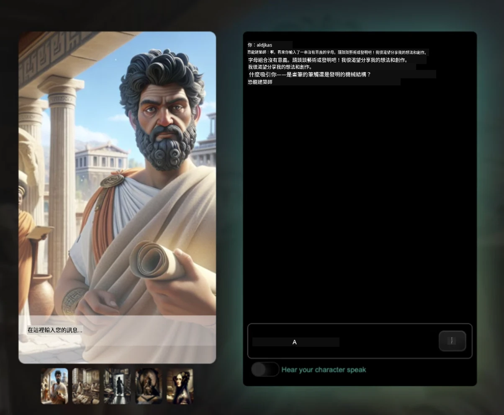
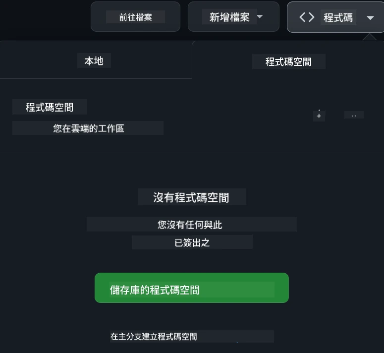

[](https://github.com/microsoft/Web-Dev-For-Beginners/blob/master/LICENSE)
[](https://GitHub.com/microsoft/Web-Dev-For-Beginners/graphs/contributors/)
[](https://GitHub.com/microsoft/Web-Dev-For-Beginners/issues/)
[](https://GitHub.com/microsoft/Web-Dev-For-Beginners/pulls/)
[](http://makeapullrequest.com) 

[](https://GitHub.com/microsoft/Web-Dev-For-Beginners/watchers/)
[](https://GitHub.com/microsoft/Web-Dev-For-Beginners/network/)
[](https://GitHub.com/microsoft/Web-Dev-For-Beginners/stargazers/)

[](https://discord.gg/nTYy5BXMWG)

# 初學者的網頁開發課程

透過微軟雲端推廣員的 12 週全面課程，學習網頁開發的基礎知識。24 個課程單元透過實作專案如生態瓶、瀏覽器擴充功能及太空遊戲，深入探討 JavaScript、CSS 和 HTML。參與測驗、討論及實務作業。利用我們高效的專案導向教學法，強化技能並優化知識吸收。立即展開你的程式設計之旅！

加入 Azure AI Foundry Discord 社群

[](https://discord.gg/nTYy5BXMWG)

按照以下步驟開始使用這些資源：
1. **派生本倉庫**：點擊 [](https://GitHub.com/microsoft/Web-Dev-For-Beginners/fork)
2. **複製本倉庫**：   `git clone https://github.com/microsoft/Web-Dev-For-Beginners.git`
3. [**加入 Azure AI Foundry Discord，與專家及其他開發者互動**](https://discord.com/invite/ByRwuEEgH4)

### 🌐 多語言支援

#### 透過 GitHub Action 實現（自動且持續更新）

<!-- CO-OP TRANSLATOR LANGUAGES TABLE START -->
[阿拉伯語](../ar/README.md) | [孟加拉語](../bn/README.md) | [保加利亞語](../bg/README.md) | [緬甸語](../my/README.md) | [中文（簡體）](../zh-CN/README.md) | [中文（繁體，香港）](../zh-HK/README.md) | [中文（繁體，澳門）](../zh-MO/README.md) | [中文（繁體，台灣）](./README.md) | [克羅埃西亞語](../hr/README.md) | [捷克語](../cs/README.md) | [丹麥語](../da/README.md) | [荷蘭語](../nl/README.md) | [愛沙尼亞語](../et/README.md) | [芬蘭語](../fi/README.md) | [法語](../fr/README.md) | [德語](../de/README.md) | [希臘語](../el/README.md) | [希伯來語](../he/README.md) | [印地語](../hi/README.md) | [匈牙利語](../hu/README.md) | [印尼語](../id/README.md) | [義大利語](../it/README.md) | [日語](../ja/README.md) | [卡納達語](../kn/README.md) | [韓語](../ko/README.md) | [立陶宛語](../lt/README.md) | [馬來語](../ms/README.md) | [馬拉亞拉姆語](../ml/README.md) | [馬拉地語](../mr/README.md) | [尼泊爾語](../ne/README.md) | [奈及利亞洋腔](../pcm/README.md) | [挪威語](../no/README.md) | [波斯語 (法爾西)](../fa/README.md) | [波蘭語](../pl/README.md) | [葡萄牙語 (巴西)](../pt-BR/README.md) | [葡萄牙語 (葡萄牙)](../pt-PT/README.md) | [旁遮普語 (Gurmukhi)](../pa/README.md) | [羅馬尼亞語](../ro/README.md) | [俄語](../ru/README.md) | [塞爾維亞語 (西里爾字母)](../sr/README.md) | [斯洛伐克語](../sk/README.md) | [斯洛文尼亞語](../sl/README.md) | [西班牙語](../es/README.md) | [斯瓦希里語](../sw/README.md) | [瑞典語](../sv/README.md) | [他加祿語 (菲律賓語)](../tl/README.md) | [泰米爾語](../ta/README.md) | [泰盧固語](../te/README.md) | [泰語](../th/README.md) | [土耳其語](../tr/README.md) | [烏克蘭語](../uk/README.md) | [烏爾都語](../ur/README.md) | [越南語](../vi/README.md)

> **偏好本機複製？**
>
> 本倉庫包含 50 多種語言翻譯，會大幅增加下載大小。若想不包含翻譯檔複製，請使用稀疏簽出：
>
> **Bash / macOS / Linux:**
> ```bash
> git clone --filter=blob:none --sparse https://github.com/microsoft/Web-Dev-For-Beginners.git
> cd Web-Dev-For-Beginners
> git sparse-checkout set --no-cone '/*' '!translations' '!translated_images'
> ```
>
> **CMD (Windows):**
> ```cmd
> git clone --filter=blob:none --sparse https://github.com/microsoft/Web-Dev-For-Beginners.git
> cd Web-Dev-For-Beginners
> git sparse-checkout set --no-cone "/*" "!translations" "!translated_images"
> ```
>
> 這可幫助你用更快速度下載並擁有完成課程所需的一切資料。
<!-- CO-OP TRANSLATOR LANGUAGES TABLE END -->

**若希望支援更多翻譯語言，可查看[此處](https://github.com/Azure/co-op-translator/blob/main/getting_started/supported-languages.md)**

[](https://open.vscode.dev/microsoft/Web-Dev-For-Beginners)

#### 🧑‍🎓 _你是學生嗎？_

請造訪[**學生專區頁面**](https://docs.microsoft.com/learn/student-hub/?WT.mc_id=academic-77807-sagibbon)，這裡提供初學者資源、學生套件，甚至免費證書代金券兌換方式。請收藏此頁，並定期瀏覽，我們會每月更新內容。

### 📣 公告 - 新增 GitHub Copilot 代理模式挑戰關卡！

新挑戰已加入，大多數章節中可見 "GitHub Copilot Agent Challenge 🚀"。這是使用 GitHub Copilot 與代理模式完成的全新挑戰。如果你還沒用過代理模式，它不僅能生成文字，還能建立與編輯檔案、執行指令等。

### 📣 公告 - _新增使用生成式 AI 建置的專案_ 

最新 AI 助理專案已推出，詳見[專案](./9-chat-project/README.md)

### 📣 公告 - _全新生成式 AI JavaScript 課程大公開_

別錯過我們的全新生成式 AI 課程！

造訪 [https://aka.ms/genai-js-course](https://aka.ms/genai-js-course) 開始學習！


- 課程涵蓋從基礎到 RAG 技術。
- 使用生成式 AI 與伴隨應用互動，與歷史人物對話。
- 趣味且引人入勝的故事情節，你將展開時光之旅！




每堂課均包含作業、知識測試及挑戰，協助你學習以下主題：
- 提示語及提示語工程
- 文字與圖片應用生成
- 搜尋應用

造訪 [https://aka.ms/genai-js-course](https://aka.ms/genai-js-course) 開始學習！


## 🌱 開始使用

> **老師們**，我們有[包含一些建議](for-teachers.md)來協助您使用此課程。歡迎您在[討論區](https://github.com/microsoft/Web-Dev-For-Beginners/discussions/categories/teacher-corner)給予回饋！

**[學習者](https://aka.ms/student-page/?WT.mc_id=academic-77807-sagibbon)**，每堂課從課前測驗開始，接著閱讀課程內容，完成各種活動，並以課後測驗檢驗理解度。

為強化學習體驗，請與同儕合作專案！我們歡迎在[討論區](https://github.com/microsoft/Web-Dev-For-Beginners/discussions)分享並討論，管理員團隊會協助解答你的問題。

若想進一步進修，强烈推薦探索[Microsoft Learn](https://learn.microsoft.com/users/wirelesslife/collections/p1ddcy5jwy0jkm?WT.mc_id=academic-77807-sagibbon)提供的額外學習資源。

### 📋 環境設定

本課程提供一整套開發環境！開始時，你可以選擇在 [Codespace](https://github.com/features/codespaces/) 中執行（基於瀏覽器，無需安裝軟體），或在本機電腦上使用文字編輯器，如 [Visual Studio Code](https://code.visualstudio.com/?WT.mc_id=academic-77807-sagibbon)。

#### 建立你的代碼庫
為方便儲存作業，建議你建立本倉庫的個人副本。按下頁面頂端的 **Use this template** 按鈕，系統會在你的 GitHub 帳號內建立包含課程內容的新代碼庫。

執行步驟如下：
1. **派生本倉庫**：點擊本頁右上角的「Fork」按鈕。
2. **複製本倉庫**：   `git clone https://github.com/microsoft/Web-Dev-For-Beginners.git`

#### 在 Codespace 執行課程

於持有的此倉庫副本中點擊 **Code** 按鈕，選擇 **Open with Codespaces**，系統即為你建立新的 Codespace 工作環境。



#### 在本機電腦執行課程

欲在本機運行課程，需準備文字編輯器、瀏覽器及命令列工具。我們的第一堂課，[程式語言與開發工具入門](../../1-getting-started-lessons/1-intro-to-programming-languages) 將引導你檢視各種選項，選擇最適合你的工具。

建議使用 [Visual Studio Code](https://code.visualstudio.com/?WT.mc_id=academic-77807-sagibbon) 作為編輯器，其內建[終端機](https://code.visualstudio.com/docs/terminal/basics/?WT.mc_id=academic-77807-sagibbon)功能。你可在此處下載 Visual Studio Code：[https://code.visualstudio.com/?WT.mc_id=academic-77807-sagibbon](https://code.visualstudio.com/?WT.mc_id=academic-77807-sagibbon) 。
1. 將您的存放庫複製到您的電腦。您可以點擊 **Code** 按鈕並複製 URL：

    [CodeSpace](./images/createcodespace.png)

    接著，在 [Visual Studio Code](https://code.visualstudio.com/?WT.mc_id=academic-77807-sagibbon) 中開啟 [Terminal](https://code.visualstudio.com/docs/terminal/basics/?WT.mc_id=academic-77807-sagibbon) 並執行以下指令，將 `<your-repository-url>` 替換成剛剛複製的 URL：

    ```bash 
    git clone <your-repository-url>
    ```

2. 在 Visual Studio Code 中開啟資料夾。您可以點擊 **File** > **Open Folder** 並選擇剛剛複製的資料夾。


>  推薦的 Visual Studio Code 擴充功能：
>
> * [Live Server](https://marketplace.visualstudio.com/items?itemName=ritwickdey.LiveServer&WT.mc_id=academic-77807-sagibbon) - 在 Visual Studio Code 內預覽 HTML 頁面
> * [Copilot](https://marketplace.visualstudio.com/items?itemName=GitHub.copilot&WT.mc_id=academic-77807-sagibbon) - 幫助您加快寫程式碼的速度

## 📂 每堂課包含：

- 選擇性手繪筆記
- 選擇性補充影片
- 課前熱身小測驗
- 書面課程內容
- 專案導向課程會有逐步專案建立指南
- 知識檢核
- 挑戰題
- 補充閱讀材料
- 作業
- [課後測驗](https://ff-quizzes.netlify.app/web/)

> **關於測驗的註解**：所有測驗均包含在 Quiz-app 資料夾中，共 48 場測驗，每場三題。可在[此處](https://ff-quizzes.netlify.app/web/)取得。測驗應用可以在本機運行或部署至 Azure；詳細說明請參考 quiz-app 資料夾。

## 🗃️ 課程列表

|     |                       專案名稱                       |                            教授概念                             | 學習目標                                                                                                                 |                                                         連結課程                                                          |         作者          |
| :-: | :------------------------------------------------------: | :--------------------------------------------------------------------: | ----------------------------------------------------------------------------------------------------------------------------------- | :----------------------------------------------------------------------------------------------------------------------------: | :---------------------: |
| 01  |                     開始入門                      |           程式設計與開發工具導論           | 學習大部分程式語言的基礎原理以及協助專業開發者工作的軟體 | [程式語言與開發工具導論](./1-getting-started-lessons/1-intro-to-programming-languages/README.md) |         Jasmine         |
| 02  |                     開始入門                      |             GitHub 基礎，包含團隊協作             | 如何在專案中使用 GitHub，如何與他人協作程式碼庫                                                    |                            [GitHub 入門](./1-getting-started-lessons/2-github-basics/README.md)                             |          Floor          |
| 03  |                     開始入門                      |                             無障礙設計                              | 學習網頁無障礙設計的基本概念                                                                                               |                       [無障礙基礎](./1-getting-started-lessons/3-accessibility/README.md)                       |       Christopher       |
| 04  |                        JS 基礎                         |                         JavaScript 資料型別                          | JavaScript 資料型別基礎                                                                                                 |                                       [資料型別](./2-js-basics/1-data-types/README.md)                                        |         Jasmine         |
| 05  |                        JS 基礎                         |                         函數與方法                          | 了解如何使用函數及方法管理應用程式的邏輯流程                                                             |                              [函數與方法](./2-js-basics/2-functions-methods/README.md)                               | Jasmine 和 Christopher |
| 06  |                        JS 基礎                         |                        使用 JS 做決策                        | 學習使用決策方法建立程式條件                                                           |                                 [做決策](./2-js-basics/3-making-decisions/README.md)                                  |         Jasmine         |
| 07  |                        JS 基礎                         |                            陣列與迴圈                            | 使用 JavaScript 陣列與迴圈操作資料                                                                                 |                                   [陣列與迴圈](./2-js-basics/4-arrays-loops/README.md)                                    |         Jasmine         |
| 08  |       [Terrarium](./3-terrarium/solution/README.md)       |                            HTML 實務                            | 建置 HTML 製作線上生態缸，專注於網頁排版                                                         |                                 [HTML入門](./3-terrarium/1-intro-to-html/README.md)                                 |           Jen           |
| 09  |       [Terrarium](./3-terrarium/solution/README.md)       |                            CSS 實務                             | 建置 CSS 來設計線上生態缸，專注於基礎 CSS 及響應式網頁設計                     |                                  [CSS入門](./3-terrarium/2-intro-to-css/README.md)                                  |           Jen           |
| 10  |            [Terrarium](./3-terrarium/solution/README.md)            |                 JavaScript 閉包與 DOM 操作                  | 建置 JavaScript 使完整生態缸具拖拉介面功能，專注閉包與 DOM 操作             |                  [JavaScript 閉包與 DOM 操作](./3-terrarium/3-intro-to-DOM-and-closures/README.md)                   |           Jen           |
| 11  |          [打字遊戲](./4-typing-game/solution/README.md)          |                          建立打字遊戲                           | 學習如何使用鍵盤事件驅動 JavaScript 應用邏輯                                                          |                                [事件驅動程式設計](./4-typing-game/typing-game/README.md)                                |       Christopher       |
| 12  | [綠色瀏覽器擴充功能](./5-browser-extension/solution/README.md) |                         瀏覽器工作原理                          | 了解瀏覽器如何運作及其歷史，並架構瀏覽器擴充功能的基本元素                               |                               [認識瀏覽器](./5-browser-extension/1-about-browsers/README.md)                                |           Jen           |
| 13  | [綠色瀏覽器擴充功能](./5-browser-extension/solution/README.md) | 建立表單、呼叫 API 並儲存變數於本地儲存 | 建立瀏覽器擴充功能的 JavaScript 元素，使用本地儲存的變數呼叫 API                      |                [API、表單與本地儲存](./5-browser-extension/2-forms-browsers-local-storage/README.md)                 |           Jen           |
| 14  | [綠色瀏覽器擴充功能](./5-browser-extension/solution/README.md) |          瀏覽器背景程序與網頁效能          | 使用瀏覽器背景程序來管理擴充圖示；學習網頁效能與優化方式   |             [背景作業與效能](./5-browser-extension/3-background-tasks-and-performance/README.md)              |           Jen           |
| 15  |           [太空遊戲](./6-space-game/solution/README.md)           |             進階的 JavaScript 遊戲開發             | 了解繼承、類別與組合以及 Pub/Sub 模式，為建立遊戲做準備              |                      [進階遊戲開發入門](./6-space-game/1-introduction/README.md)                       |          Chris          |
| 16  |           [太空遊戲](./6-space-game/solution/README.md)           |                           畫到畫布                            | 學習 Canvas API，用於繪製畫面元素                                                                       |                                [畫到 Canvas](./6-space-game/2-drawing-to-canvas/README.md)                                |          Chris          |
| 17  |           [太空遊戲](./6-space-game/solution/README.md)           |                   移動畫面上的元素                    | 探索元素如何透過笛卡兒座標與 Canvas API 產生運動                                            |                           [移動畫素](./6-space-game/3-moving-elements-around/README.md)                           |          Chris          |
| 18  |           [太空遊戲](./6-space-game/solution/README.md)           |                          碰撞偵測                           | 讓元素相互碰撞並做出反應，使用按鍵事件並提供冷卻功能以確保遊戲順暢    |                              [碰撞偵測](./6-space-game/4-collision-detection/README.md)                              |          Chris          |
| 19  |           [太空遊戲](./6-space-game/solution/README.md)           |                             計分                              | 根據遊戲狀態與表現進行數學計算                                                                |                                    [計分](./6-space-game/5-keeping-score/README.md)                                    |          Chris          |
| 20  |           [太空遊戲](./6-space-game/solution/README.md)           |                     遊戲結束與重新開始                     | 了解遊戲結束與重新開始，包括清理資源與重設變數                              |                                [結束條件](./6-space-game/6-end-condition/README.md)                                 |          Chris          |
| 21  |         [銀行應用程式](./7-bank-project/solution/README.md)          |                 HTML 範本與網頁路由                 | 學習如何建立多頁網站架構，使用路由與 HTML 範本                             |                            [HTML 範本與路由](./7-bank-project/1-template-route/README.md)                             |          Yohan          |
| 22  |         [銀行應用程式](./7-bank-project/solution/README.md)          |                  建立登入與註冊表單                   | 了解建立表單及處理驗證程序                                                                          |                                           [表單](./7-bank-project/2-forms/README.md)                                           |          Yohan          |
| 23  |         [銀行應用程式](./7-bank-project/solution/README.md)          |                   資料抓取與使用                   | 了解資料在應用程式中的流動，如何抓取、儲存與處理                                                 |                                            [資料](./7-bank-project/3-data/README.md)                                            |          Yohan          |
| 24  |         [銀行應用程式](./7-bank-project/solution/README.md)          |                      狀態管理概念                      | 學習應用程式如何保持狀態並以程式方式管理                                                              |                                [狀態管理](./7-bank-project/4-state-management/README.md)                                |          Yohan          |
| 25 | [瀏覽器/VSCode 程式碼](../../8-code-editor) | 使用 VSCode | 學習如何使用程式碼編輯器 | [使用 VSCode 程式碼編輯器](./8-code-editor/1-using-a-code-editor/README.md) | Chris |
| 26 | [AI 助理](./9-chat-project/README.md) | 使用 AI | 學習如何打造自己的 AI 助理 | [AI 助理專案](./9-chat-project/README.md) | Chris |

## 🏫 教學法

我們的課程設計基於兩項重要的教學原理：
* 專案導向學習
* 頻繁測驗

本課程教授 JavaScript、HTML 和 CSS 的基礎，以及現今網頁開發者常用的最新工具與技術。學生將有機會透過實作打造打字遊戲、虛擬生態缸、環保瀏覽器擴充功能、太空侵略者風格遊戲及銀行業務應用。課程結束時，學生將具備紮實的網頁開發理解。

> 🎓 您可以將本課程的前幾堂課以 Microsoft Learn 的[學習路徑](https://docs.microsoft.com/learn/paths/web-development-101/?WT.mc_id=academic-77807-sagibbon)形式來學習！

確保課程內容配合專案，使學習過程更具吸引力並提升概念記憶。我們也撰寫多堂 JavaScript 基礎入門課程搭配「[JavaScript 初學者系列](https://channel9.msdn.com/Series/Beginners-Series-to-JavaScript/?WT.mc_id=academic-77807-sagibbon)」影片教學，其中多位作者參與本課程。

此外，課前低難度測驗設立學習目標，課後第二次測驗確保加強記憶。這課程設計靈活有趣，可以完整學習或部分學習。專案從簡單開始，12 週課程結束時逐步變得複雜。

我們特意避免介紹 JavaScript 框架，專注培養基本技能，學習者後續可利用另一系列影片「[Node.js 初學者系列](https://channel9.msdn.com/Series/Beginners-Series-to-Nodejs/?WT.mc_id=academic-77807-sagibbon)」來深入 Node.js。

> 請參閱我們的[行為準則](CODE_OF_CONDUCT.md)與[貢獻指南](CONTRIBUTING.md)。歡迎您提供建設性回饋！


## 🧭 離線使用

您可透過 [Docsify](https://docsify.js.org/#/) 離線瀏覽本文件。將此倉庫分支，於本機安裝 [Docsify](https://docsify.js.org/#/quickstart)，接著在此倉庫根目錄執行 `docsify serve`。網站將在本機的 3000 埠提供服務：`localhost:3000`。

## 📘 PDF
所有課程的 PDF 可在[這裡](https://microsoft.github.io/Web-Dev-For-Beginners/pdf/readme.pdf)找到。


## 🎒 其他課程

我們團隊還製作其他課程！請參考：

<!-- CO-OP TRANSLATOR OTHER COURSES START -->
### LangChain
[](https://aka.ms/langchain4j-for-beginners)
[](https://aka.ms/langchainjs-for-beginners?WT.mc_id=m365-94501-dwahlin)
[](https://github.com/microsoft/langchain-for-beginners?WT.mc_id=m365-94501-dwahlin)
---

### Azure / Edge / MCP / Agents
[](https://github.com/microsoft/AZD-for-beginners?WT.mc_id=academic-105485-koreyst)
[](https://github.com/microsoft/edgeai-for-beginners?WT.mc_id=academic-105485-koreyst)
[](https://github.com/microsoft/mcp-for-beginners?WT.mc_id=academic-105485-koreyst)
[](https://github.com/microsoft/ai-agents-for-beginners?WT.mc_id=academic-105485-koreyst)

---
 
### 生成式 AI 系列
[](https://github.com/microsoft/generative-ai-for-beginners?WT.mc_id=academic-105485-koreyst)
[-9333EA?style=for-the-badge&labelColor=E5E7EB&color=9333EA)](https://github.com/microsoft/Generative-AI-for-beginners-dotnet?WT.mc_id=academic-105485-koreyst)
[-C084FC?style=for-the-badge&labelColor=E5E7EB&color=C084FC)](https://github.com/microsoft/generative-ai-for-beginners-java?WT.mc_id=academic-105485-koreyst)
[-E879F9?style=for-the-badge&labelColor=E5E7EB&color=E879F9)](https://github.com/microsoft/generative-ai-with-javascript?WT.mc_id=academic-105485-koreyst)

---
 
### 核心學習
[](https://aka.ms/ml-beginners?WT.mc_id=academic-105485-koreyst)
[](https://aka.ms/datascience-beginners?WT.mc_id=academic-105485-koreyst)
[](https://aka.ms/ai-beginners?WT.mc_id=academic-105485-koreyst)
[](https://github.com/microsoft/Security-101?WT.mc_id=academic-96948-sayoung)
[](https://aka.ms/webdev-beginners?WT.mc_id=academic-105485-koreyst)
[](https://aka.ms/iot-beginners?WT.mc_id=academic-105485-koreyst)
[](https://github.com/microsoft/xr-development-for-beginners?WT.mc_id=academic-105485-koreyst)

---
 
### Copilot 系列
[](https://aka.ms/GitHubCopilotAI?WT.mc_id=academic-105485-koreyst)
[](https://github.com/microsoft/mastering-github-copilot-for-dotnet-csharp-developers?WT.mc_id=academic-105485-koreyst)
[](https://github.com/microsoft/CopilotAdventures?WT.mc_id=academic-105485-koreyst)
<!-- CO-OP TRANSLATOR OTHER COURSES END -->

## 尋求協助

如果你遇到困難或對建立 AI 應用有任何疑問，歡迎加入 MCP 的學習者和資深開發者討論群。這是一個支持性社群，歡迎提出問題並自由分享知識。

[](https://discord.gg/nTYy5BXMWG)

如果你在開發過程中有產品回饋或錯誤，請造訪：

[](https://aka.ms/foundry/forum)

## 授權

本專案庫採用 MIT 授權。詳情請參閱 [LICENSE](../../LICENSE) 檔案。

---

<!-- CO-OP TRANSLATOR DISCLAIMER START -->
**免責聲明**：  
本文件係使用 AI 翻譯服務 [Co-op Translator](https://github.com/Azure/co-op-translator) 進行翻譯。雖然我們力求準確，但請注意，自動翻譯可能包含錯誤或不準確之處。原始文件之母語版本應被視為權威來源。對於重要資訊，建議採用專業人工翻譯。我們不對因使用本翻譯所引起的任何誤解或誤譯承擔責任。
<!-- CO-OP TRANSLATOR DISCLAIMER END -->