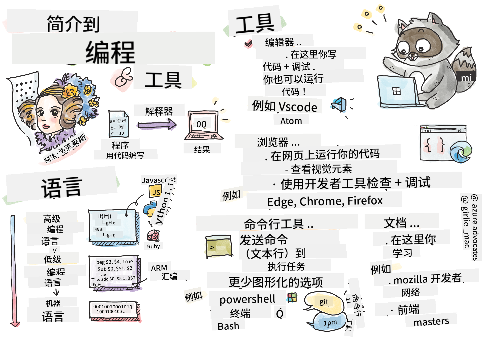

<!--
CO_OP_TRANSLATOR_METADATA:
{
  "original_hash": "2581528206a2a01c3a0b9c88e039b7bc",
  "translation_date": "2025-10-03T08:49:05+00:00",
  "source_file": "1-getting-started-lessons/1-intro-to-programming-languages/README.md",
  "language_code": "zh"
}
-->
# 编程语言与工具入门

本课涵盖了编程语言的基础知识。这里讨论的主题适用于当今大多数现代编程语言。在“工具介绍”部分，您将学习一些对开发者非常有用的软件。


> 由 [Tomomi Imura](https://twitter.com/girlie_mac) 绘制的速记图

## 课前测验
[课前测验](https://forms.office.com/r/dru4TE0U9n?origin=lprLink)

## 简介

在本课中，我们将讨论：

- 什么是编程？
- 编程语言的类型
- 程序的基本元素
- 专业开发者常用的软件和工具

> 您可以在 [Microsoft Learn](https://docs.microsoft.com/learn/modules/web-development-101/introduction-programming/?WT.mc_id=academic-77807-sagibbon) 上学习本课！

## 什么是编程？

编程（也称为编码）是为计算机或移动设备编写指令的过程。我们使用编程语言来编写这些指令，然后由设备进行解释。这些指令集可能有不同的名称，但*程序*、*计算机程序*、*应用程序（app）*和*可执行文件*是一些常见的称呼。

一个*程序*可以是任何用代码编写的东西；网站、游戏和手机应用都是程序。虽然可以在不编写代码的情况下创建程序，但底层逻辑是由设备解释的，而这些逻辑很可能是用代码编写的。一个正在*运行*或*执行*代码的程序正在执行指令。您正在阅读本课的设备正在运行一个程序，将内容显示在屏幕上。

✅ 做一些研究：谁被认为是世界上第一位计算机程序员？

## 编程语言

编程语言使开发者能够为设备编写指令。设备只能理解二进制（1和0），而对于*大多数*开发者来说，这不是一种高效的沟通方式。编程语言是人类与计算机之间沟通的桥梁。

编程语言有不同的格式，并可能服务于不同的目的。例如，JavaScript主要用于网络应用，而Bash主要用于操作系统。

*低级语言*通常比*高级语言*需要更少的步骤来让设备解释指令。然而，高级语言之所以受欢迎，是因为它们的可读性和支持性。JavaScript被认为是一种高级语言。

以下代码展示了使用JavaScript（高级语言）和ARM汇编代码（低级语言）的区别。

```javascript
let number = 10
let n1 = 0, n2 = 1, nextTerm;

for (let i = 1; i <= number; i++) {
    console.log(n1);
    nextTerm = n1 + n2;
    n1 = n2;
    n2 = nextTerm;
}
```

```c
 area ascen,code,readonly
 entry
 code32
 adr r0,thumb+1
 bx r0
 code16
thumb
 mov r0,#00
 sub r0,r0,#01
 mov r1,#01
 mov r4,#10
 ldr r2,=0x40000000
back add r0,r1
 str r0,[r2]
 add r2,#04
 mov r3,r0
 mov r0,r1
 mov r1,r3
 sub r4,#01
 cmp r4,#00
 bne back
 end
```

相信或不相信，*它们都在做同样的事情*：打印一个斐波那契数列到10。

✅ 斐波那契数列是[定义](https://en.wikipedia.org/wiki/Fibonacci_number)为一组数字，其中每个数字是前两个数字的和，起始值为0和1。斐波那契数列的前10个数字是0, 1, 1, 2, 3, 5, 8, 13, 21和34。

## 程序的元素

程序中的单条指令称为*语句*，通常会有一个字符或行间距标记指令的结束或*终止*。程序如何终止因语言而异。

程序中的语句可能依赖用户或其他地方提供的数据来执行指令。数据可以改变程序的行为，因此编程语言提供了一种临时存储数据的方法，以便稍后使用。这些称为*变量*。变量是指示设备将数据保存在内存中的语句。程序中的变量类似于代数中的变量，它们有一个唯一的名称，其值可能随时间变化。

有些语句可能不会被设备执行。这通常是开发者设计的结果，或者是意外错误导致的。这种对应用程序的控制使其更强大且更易维护。通常，这种控制的变化发生在满足某些条件时。现代编程中常用的一种语句是`if..else`语句。

✅ 您将在后续课程中学习更多关于这种语句的内容。

## 工具介绍

[](https://youtube.com/watch?v=69WJeXGBdxg "工具介绍")

> 🎥 点击上方图片观看关于工具的视频

在本节中，您将了解一些在开始专业开发旅程时可能非常有用的软件。

**开发环境**是开发者在编写软件时经常使用的一组独特工具和功能。这些工具可能根据开发者的具体需求进行了定制，并可能随着开发者工作重点的变化、个人项目的变化或使用不同编程语言而改变。开发环境如同开发者本身一样独特。

### 编辑器

软件开发中最重要的工具之一是编辑器。编辑器是您编写代码的地方，有时也是运行代码的地方。

开发者依赖编辑器还有以下几个原因：

- *调试*帮助逐行检查代码，发现错误和问题。一些编辑器具有调试功能；它们可以为特定编程语言进行定制和添加。
- *语法高亮*为代码添加颜色和文本格式，使其更易于阅读。大多数编辑器允许定制语法高亮。
- *扩展和集成*是为开发者设计的专业工具。这些工具并未内置于基础编辑器中。例如，许多开发者会为代码编写文档以解释其工作原理。他们可能安装拼写检查扩展来帮助发现文档中的拼写错误。大多数扩展是为特定编辑器设计的，大多数编辑器都提供搜索可用扩展的功能。
- *定制化*使开发者能够创建适合自己需求的独特开发环境。大多数编辑器都非常可定制，并可能允许开发者创建自定义扩展。

#### 流行的编辑器及网络开发扩展

- [Visual Studio Code](https://code.visualstudio.com/?WT.mc_id=academic-77807-sagibbon)
  - [Code Spell Checker](https://marketplace.visualstudio.com/items?itemName=streetsidesoftware.code-spell-checker)
  - [Live Share](https://marketplace.visualstudio.com/items?itemName=MS-vsliveshare.vsliveshare)
  - [Prettier - Code formatter](https://marketplace.visualstudio.com/items?itemName=esbenp.prettier-vscode)
- [Atom](https://atom.io/)
  - [spell-check](https://atom.io/packages/spell-check)
  - [teletype](https://atom.io/packages/teletype)
  - [atom-beautify](https://atom.io/packages/atom-beautify)
  
- [Sublimetext](https://www.sublimetext.com/)
  - [emmet](https://emmet.io/)
  - [SublimeLinter](http://www.sublimelinter.com/en/stable/)

### 浏览器

另一个重要工具是浏览器。网络开发者依赖浏览器来查看代码在网络上的运行情况。浏览器还用于显示编辑器中编写的网页的视觉元素，例如HTML。

许多浏览器都带有*开发者工具*（DevTools），其中包含一组有用的功能和信息，帮助开发者收集和捕获有关其应用程序的重要信息。例如：如果网页出现错误，有时知道错误发生的时间会很有帮助。浏览器中的开发者工具可以配置为捕获这些信息。

#### 流行的浏览器及开发者工具

- [Edge](https://docs.microsoft.com/microsoft-edge/devtools-guide-chromium/?WT.mc_id=academic-77807-sagibbon)
- [Chrome](https://developers.google.com/web/tools/chrome-devtools/)
- [Firefox](https://developer.mozilla.org/docs/Tools)

### 命令行工具

一些开发者更喜欢使用较少图形化的界面来完成日常任务，并依赖命令行来实现这一点。编写代码需要大量的输入，一些开发者更喜欢不打断键盘上的工作流。他们会使用键盘快捷键在桌面窗口之间切换、处理不同文件以及使用工具。虽然大多数任务可以通过鼠标完成，但使用命令行的一个好处是可以在不需要鼠标和键盘切换的情况下完成许多任务。命令行的另一个好处是它们是可配置的，您可以保存自定义配置，稍后更改，并将其导入到其他开发机器中。由于开发环境对每个开发者来说都非常独特，有些人会完全避免使用命令行，有些人会完全依赖它，还有些人喜欢两者结合使用。

### 流行的命令行选项

命令行选项会因您使用的操作系统而有所不同。

*💻 = 操作系统预装。*

#### Windows

- [Powershell](https://docs.microsoft.com/powershell/scripting/overview?view=powershell-7/?WT.mc_id=academic-77807-sagibbon) 💻
- [命令行](https://docs.microsoft.com/windows-server/administration/windows-commands/windows-commands/?WT.mc_id=academic-77807-sagibbon)（也称为CMD）💻
- [Windows Terminal](https://docs.microsoft.com/windows/terminal/?WT.mc_id=academic-77807-sagibbon)
- [mintty](https://mintty.github.io/)
  
#### MacOS

- [终端](https://support.apple.com/guide/terminal/open-or-quit-terminal-apd5265185d-f365-44cb-8b09-71a064a42125/mac) 💻
- [iTerm](https://iterm2.com/)
- [Powershell](https://docs.microsoft.com/powershell/scripting/install/installing-powershell-core-on-macos?view=powershell-7/?WT.mc_id=academic-77807-sagibbon)

#### Linux

- [Bash](https://www.gnu.org/software/bash/manual/html_node/index.html) 💻
- [KDE Konsole](https://docs.kde.org/trunk5/en/konsole/konsole/index.html)
- [Powershell](https://docs.microsoft.com/powershell/scripting/install/installing-powershell-core-on-linux?view=powershell-7/?WT.mc_id=academic-77807-sagibbon)

#### 流行的命令行工具

- [Git](https://git-scm.com/) (💻 在大多数操作系统上预装)
- [NPM](https://www.npmjs.com/)
- [Yarn](https://classic.yarnpkg.com/en/docs/cli/)

### 文档

当开发者想学习新知识时，他们通常会查阅文档以了解如何使用它。开发者经常依赖文档来指导他们正确使用工具和语言，并深入了解其工作原理。

#### 网络开发相关的流行文档

- [Mozilla Developer Network (MDN)](https://developer.mozilla.org/docs/Web)，由发布 [Firefox](https://www.mozilla.org/firefox/) 浏览器的 Mozilla 提供
- [Frontend Masters](https://frontendmasters.com/learn/)
- [Web.dev](https://web.dev)，由发布 [Chrome](https://www.google.com/chrome/) 的 Google 提供
- [Microsoft 的开发者文档](https://docs.microsoft.com/microsoft-edge/#microsoft-edge-for-developers)，适用于 [Microsoft Edge](https://www.microsoft.com/edge)
- [W3 Schools](https://www.w3schools.com/where_to_start.asp)

✅ 做一些研究：现在您了解了网络开发者的环境，试着比较和对比它与网络设计师的环境。

---

## 🚀 挑战

比较一些编程语言。JavaScript与Java有哪些独特特性？COBOL与Go又如何？

## 课后测验
[课后测验](https://ff-quizzes.netlify.app/web/)

## 复习与自学

研究一下程序员可用的不同语言。尝试用一种语言写一行代码，然后用另外两种语言重写它。您学到了什么？

## 作业

[阅读文档](assignment.md)

> 注意：在为您的作业选择工具时，请勿选择上面已列出的编辑器、浏览器或命令行工具。

---

**免责声明**：  
本文档使用AI翻译服务 [Co-op Translator](https://github.com/Azure/co-op-translator) 进行翻译。尽管我们努力确保翻译的准确性，但请注意，自动翻译可能包含错误或不准确之处。原始语言的文档应被视为权威来源。对于重要信息，建议使用专业人工翻译。我们对因使用此翻译而产生的任何误解或误读不承担责任。