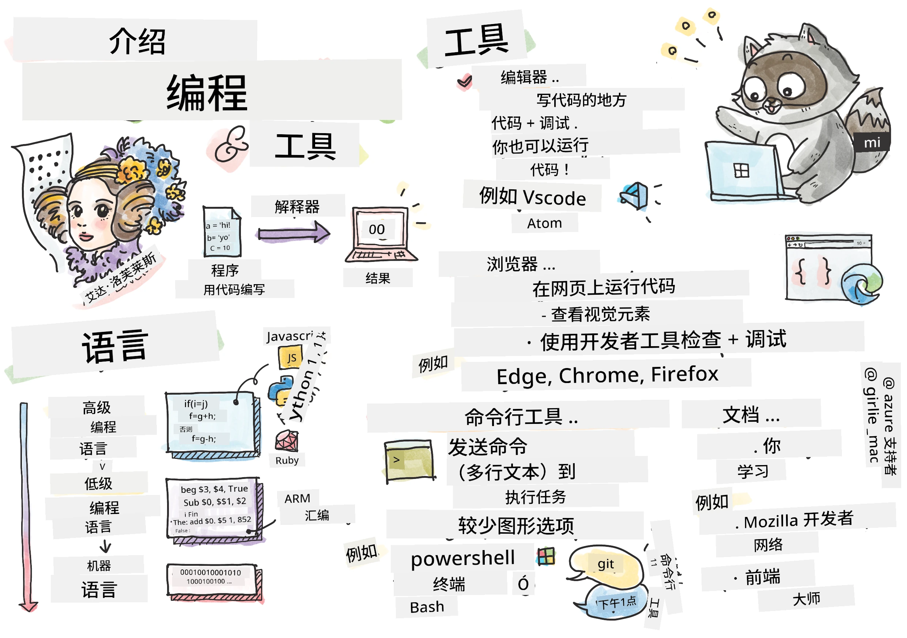
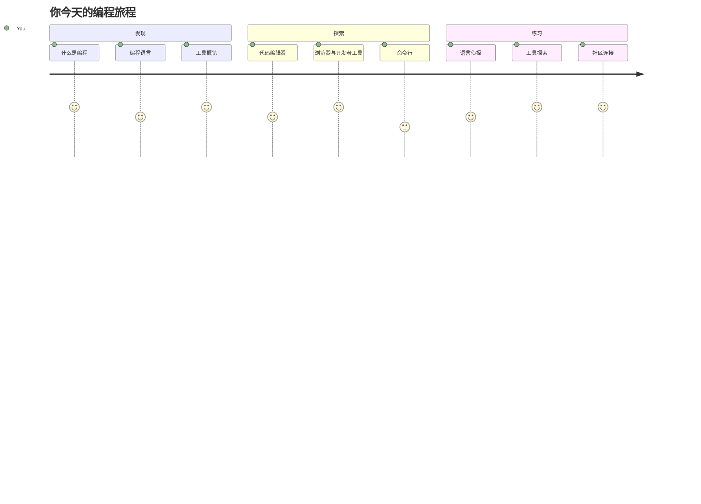
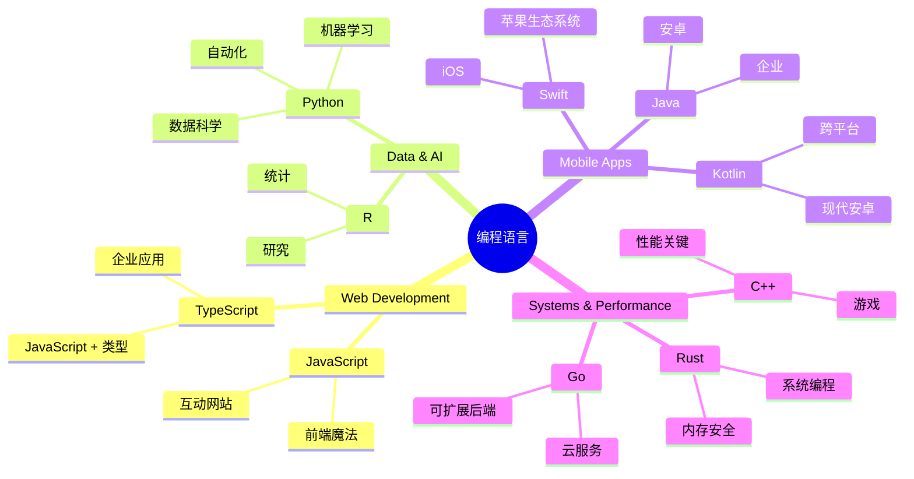
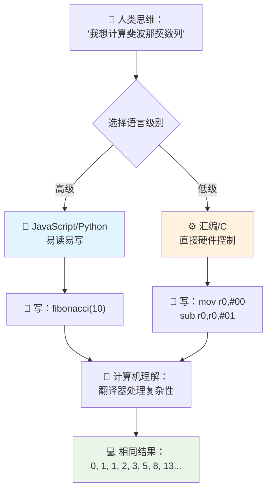
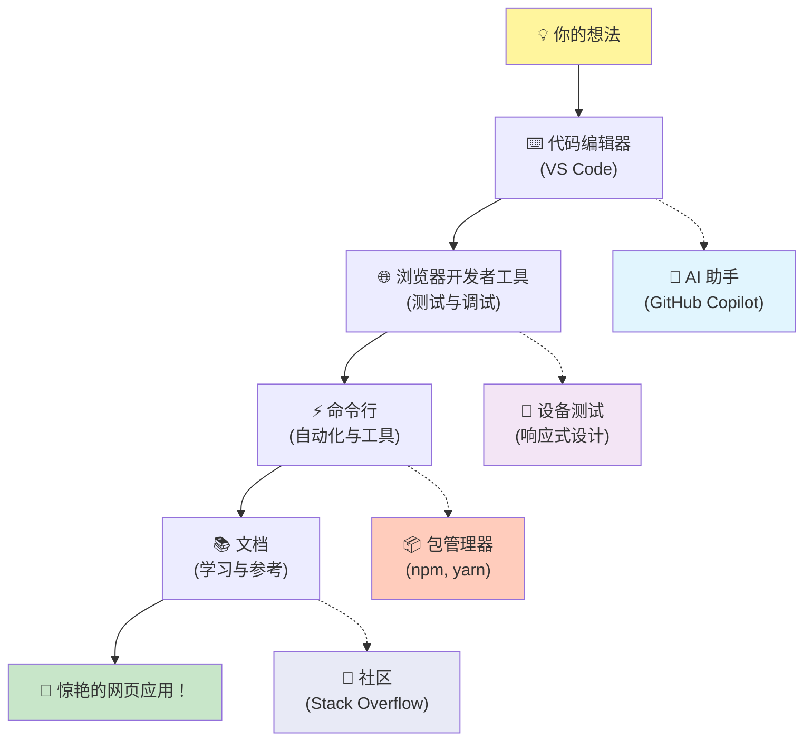
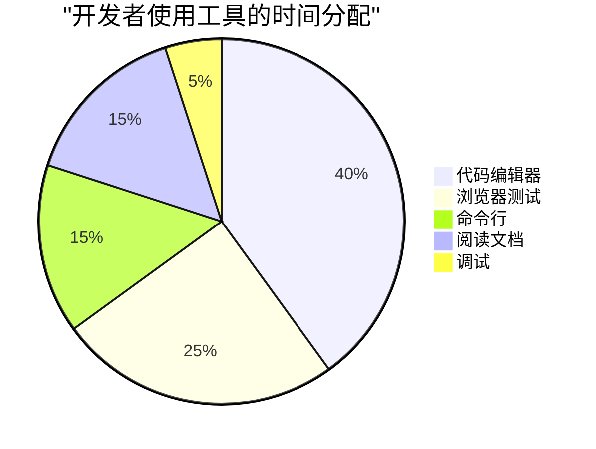
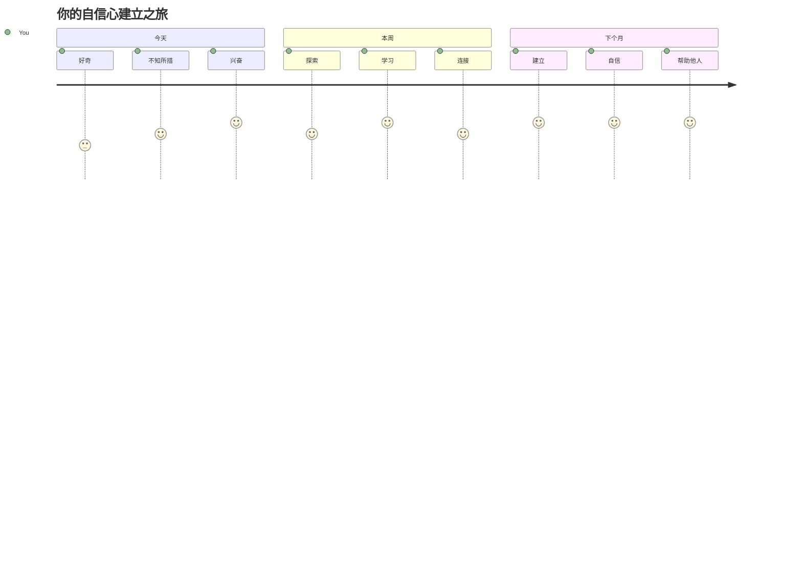

<!--
CO_OP_TRANSLATOR_METADATA:
{
  "original_hash": "d45ddcc54eb9232a76d08328b09d792e",
  "translation_date": "2026-01-06T11:58:19+00:00",
  "source_file": "1-getting-started-lessons/1-intro-to-programming-languages/README.md",
  "language_code": "zh"
}
-->
# 编程语言与现代开发工具简介

嗨，未来的开发者！👋 我能告诉你一件每天都会让我激动不已的事情吗？你即将发现，编程不仅仅是关于计算机——它是一种具有真正超能力的方式，能让你把最狂野的创意变成现实！

你知道用自己最喜欢的应用时那种一切完美契合的时刻吗？当你点击一个按钮，发生了某种神奇的事情，让你忍不住惊叹“哇，他们到底是怎么做到的？”那么，就像你一样的人——可能正坐在他们最喜欢的咖啡馆，凌晨两点喝着第三杯浓咖啡——写出了创造那个魔法的代码。更震撼的是：到本课结束时，你不仅会理解他们是怎么做到的，还会急切想亲自尝试一番！

听我说，我完全理解如果现在编程看起来让你感到害怕。当我刚开始时，我真的以为你得是某种数学天才，或者从五岁起就开始编程。但有件事彻底改变了我的看法：编程就像学习用一门新语言交谈。你从“你好”和“谢谢”开始，然后学会点咖啡，再到后面能谈天说地！只不过这次，你是在和计算机对话，而说实话？它们是你遇到过的最有耐心的对话伙伴——从不批评你的错误，并且永远乐意再试一次！

今天，我们将探索那些让现代网页开发不仅可行而且极其上瘾的令人难以置信的工具。我说的是 Netflix、Spotify 和你最喜欢的独立应用工作室每天使用的同样的编辑器、浏览器和工作流程。最棒的是，这些专业级、行业标准的工具大多数是完全免费的！


> 速写笔记由 [Tomomi Imura](https://twitter.com/girlie_mac) 制作


## 让我们看看你已经知道什么！

在我们进入有趣的内容之前，我很好奇——你已经对这个编程世界了解多少？听着，如果你看着这些问题想“我完全一点头绪都没有”，这不仅没关系，还非常完美！这意味着你正处在绝佳的起点。把这个测验想象成锻炼前的拉伸运动——我们只是让大脑先热身！

[参加课前测验](https://forms.office.com/r/dru4TE0U9n?origin=lprLink)

## 我们即将一起踏上的冒险之旅

好了，我真的非常激动要和你一同探索今天的内容！说真的，我真希望能看到你那些概念“恍然大悟”时的表情。我们将一起经历这段不可思议的旅程：

- **什么是编程（以及为什么它超酷！）**——我们将发现代码究竟是如何成为无形的魔法，驱动你周围所有事物，从那闹钟怎样知道今天是周一，到算法如何完美推荐你喜欢的 Netflix 内容
- **编程语言和它们令人惊讶的个性**——想象参加一个派对，每个人都有完全不同的超能力和解决问题的方式。这就是编程语言的世界，你一定会喜欢认识它们！
- **数字魔法发生的基本构建块**——把它们当作终极创意的乐高积木。一旦你理解这些零件是如何拼合的，你会发现你完全可以构建任何你想象中的东西
- **能让你感觉像拿到巫师魔杖的专业工具**——我一点都不夸张，这些工具真的会让你感觉拥有超能力，更棒的是？它们正是专业人士使用的工具！

> 💡 **温馨提示**：今天别想着把所有内容都记住！此刻，我只希望你感受到可能性的火花。细节会随着我们的实践自然沉淀——这才是真正的学习过程！

> 你也可以在 [Microsoft Learn](https://docs.microsoft.com/learn/modules/web-development-101/introduction-programming/?WT.mc_id=academic-77807-sagibbon) 上学习本课程！

## 那么，什么是*编程*？

好，让我们来攻克这个价值百万美元的问题：编程究竟是什么？

我来给你讲一个让我完全改变看法的故事。上周，我试图向我妈妈解释如何使用我们的新智能电视遥控器。我发现自己说着“按那个红色按钮，不是大红按钮，是左边的小红按钮……不，你那边的左边……好了，现在按住两秒，不是一秒，也不是三秒……”是不是很熟悉？😅

这就是编程！它是向一个非常强大的对象给出极其详细、逐步的指令的艺术，但必须清楚准确。只不过你不是向妈妈（她可能会问“哪个红色按钮？！”）解释，而是向计算机（它只做你说的，即使不完全是你想要的）。

当我第一次学会这点时，真是震惊到不行：计算机其实很简单。它们字面上只懂两种东西——1和0，也就是“是”和“否”或“开”和“关”。就是这么简单！但魔幻的地方在这里——我们不必像电影《黑客帝国》一样说1和0。这时，**编程语言**就派上用场了。它们就像世界上最棒的翻译官，把你完全正常的人类想法转换成计算机语言。

每天早上醒来，这点仍然让我激动不已：你生活中所有的数字事物，最初都是像你一样的人，可能穿着睡衣，手拿咖啡，在笔记本上敲代码。那个让你看起来完美无瑕的 Instagram 滤镜？有人写了那段代码。带你发现新歌的推荐算法？开发者设计了它。帮助你和朋友均摊晚餐账单的应用？没错，有人想着“真烦人，我一定能改进它”，结果……他们做到了！

学会编程，你不仅仅是习得一项新技能——你正在加入这样一个令人敬佩的群体，这群解决问题的人用他们的每一天思考，“如果我能造出点东西，让某个人的一天更美好一点，会怎么样？”说真的，有什么比这更酷的吗？

✅ **趣味小调查**：闲暇时看看这个超酷的内容——你认为世界上第一位计算机程序员是谁？提示：她可能不是你想象中的那样！这位人士背后的故事极其精彩，说明编程从一开始就是关于创造性解决问题和跳出框架思考。

### 🧠 **情绪检查：你感觉如何？**

**花点时间想想：**
- “向计算机下指令”的想法你现在能理解了吗？
- 你能想到想用编程自动化的日常任务吗？
- 关于编程，你脑海中冒出了哪些问题？

> **记住**：某些概念暂时模糊完全正常。学编程就像学新语言——需要时间让大脑建立神经回路。你做得很棒！

## 编程语言就像不同风味的魔法

嗯，这听起来可能有点怪，但请坚持听我说——编程语言很像不同类型的音乐。想想看：有爵士乐，流畅且即兴；摇滚，强劲直接；古典，优雅而有结构；还有嘻哈，创意和富于表现力。每种风格都有自己的气质和热情的拥护者社区，同时适合不同的心情和场合。

编程语言也是一样！你不会用同一种语言去造一个有趣的手机游戏和处理庞大的气候数据，就像你不会在瑜伽课上听死亡金属（嗯，大多数瑜伽课都是这样！😄）。

但每次一想到这点，我都震惊不已：这些语言就像世界上最耐心、最聪明的口译员坐在你旁边。你可以用适合你人脑的方式表达想法，语言帮你完成把这些转换成计算机说的1和0的复杂工作。这就像拥有一个在“人类创造力”和“计算机逻辑”两种语言之间流利切换的朋友——他们永不疲倦，不用喝咖啡休息，也从不因为你重复问同一个问题而评价你！

### 流行编程语言及其用途


| 语言 | 最适合 | 为什么受欢迎 |
|------|--------|--------------|
| **JavaScript** | 网页开发，用户界面 | 在浏览器中运行，驱动互动网站 |
| **Python** | 数据科学，自动化，人工智能 | 易读易学，拥有强大库支持 |
| **Java** | 企业应用，安卓应用 | 跨平台，适合大型系统 |
| **C#** | Windows 应用，游戏开发 | 微软生态圈支持强大 |
| **Go** | 云服务，后端系统 | 快速简单，专为现代计算设计 |

### 高级语言 vs 低级语言

说实话，这是我刚开始学时觉得最烧脑的概念，所以我要分享一个让我顿悟的比喻——希望对你也有帮助！

想象你去一个不会说语言的国家，急需找厕所（我们都经历过，对吧？😅）：

- **低级编程**就像学得那么好本地方言，能和街角卖水果的奶奶聊文化典故、本地俚语和只有当地人懂的笑话。超厉害且高效……如果你流利的话！但当你只是想找个厕所时，简直头大。

- **高级编程**就像有一个很棒的本地朋友完全懂你。你用英语说“我急需找厕所”，朋友帮你翻译文化差异，给你解释得非常清楚，适合不懂当地文化的你。

编程术语来说：
- **低级语言**（如汇编或C）让你能和计算机硬件进行极其细致的对话，但你得像机器一样思考……嗯，这对脑力是很大考验！
- **高级语言**（如 JavaScript、Python 或 C#）让你像人类一样思考，它们在幕后处理所有机器语言。更棒的是，它们有超友好的社区，里面的人都记得刚入门的艰难，真心想帮助你！

你猜我推荐你先学哪个？😉 高级语言就像有了辅助轮，虽然你可能永远不会想摘掉，因为它让整体验更愉快！


### 让我给你展示为什么高级语言更友好

好了，我马上给你看点东西，完美展示我为什么爱上高级语言。但先请你答应我一个条件。看到第一段代码示例时，不要慌张！它看起来吓人正是我要说明的点！

我们将看同一任务用两种完全不同风格写成的代码。它们都会产生所谓的斐波那契数列——这是一个漂亮的数学模式，每个数字是前两个数字之和：0，1，1，2，3，5，8，13……（趣味事实：你会在大自然无处不在地发现这个模式——向日葵的种子螺旋，松果的形状，甚至银河的形成！）

准备好看差别了吗？走起！

**高级语言（JavaScript）——人类友好：**

```javascript
// 第一步：基本斐波那契设置
const fibonacciCount = 10;
let current = 0;
let next = 1;

console.log('Fibonacci sequence:');
```

**这段代码做了什么：**
- **声明**一个常量，用来指定我们想生成多少个斐波那契数
- **初始化**两个变量，用于跟踪数列中的当前值和下一个值
- **设置**起始值（0和1），定义斐波那契序列
- **显示**一个标题消息，标示我们的输出

```javascript
// 第2步：用循环生成序列
for (let i = 0; i < fibonacciCount; i++) {
  console.log(`Position ${i + 1}: ${current}`);
  
  // 计算序列中的下一个数字
  const sum = current + next;
  current = next;
  next = sum;
}
```

**代码运行过程中：**
- **用`for`循环**遍历序列中的每个位置
- **打印**每个数字及其位置，使用模板字符串格式化
- **计算**下一个斐波那契数，方法是加上当前数和下一个数
- **更新**跟踪变量，进入下一次循环

```javascript
// 第3步：现代函数式方法
const generateFibonacci = (count) => {
  const sequence = [0, 1];
  
  for (let i = 2; i < count; i++) {
    sequence[i] = sequence[i - 1] + sequence[i - 2];
  }
  
  return sequence;
};

// 使用示例
const fibSequence = generateFibonacci(10);
console.log(fibSequence);
```

**上述代码中：**
- **创建**了一个可复用函数，使用现代箭头函数语法
- **构建**了一个数组来存储完整序列，而不是逐个展示
- **使用**数组索引根据前面的值计算新数
- **返回**完整序列，方便在程序其他部分灵活使用

**低级语言（ARM 汇编）——计算机友好：**

```assembly
 area ascen,code,readonly
 entry
 code32
 adr r0,thumb+1
 bx r0
 code16
thumb
 mov r0,#00
 sub r0,r0,#01
 mov r1,#01
 mov r4,#10
 ldr r2,=0x40000000
back add r0,r1
 str r0,[r2]
 add r2,#04
 mov r3,r0
 mov r0,r1
 mov r1,r3
 sub r4,#01
 cmp r4,#00
 bne back
 end
```

注意，JavaScript 版本读起来几乎像英语指令，而汇编使用的是直接控制处理器的神秘命令。它们完成的是完全相同的任务，但高级语言更易于人类理解、编写和维护。

**你会注意到的主要区别：**
- **可读性**：JavaScript 用像 `fibonacciCount` 这样的描述性名称，而汇编使用像 `r0`、`r1` 这样晦涩的标签
- **注释**：高级语言鼓励解释性注释，使代码具备自我说明性
- **结构**：JavaScript 的逻辑流程与人类逐步思考问题的方式相匹配
- **维护**：针对不同需求更新 JavaScript 版本简单明了

✅ **关于斐波那契数列**：这个绝美的数字模式（每个数字都是前两个数字之和：0, 1, 1, 2, 3, 5, 8……）在自然界里无处不在！你会在向日葵的螺旋、松果的排列、鹦螺壳的弯曲方式，甚至树枝的生长方式中发现它。数学和代码帮我们理解并重现自然界用来创造美丽的模式，真是令人震撼！

## 构成魔法的基石

好了，现在你已经看到了编程语言的实际运作，让我们分解构成所有程序的基础部分。把它们看作你最喜欢的食谱中的基本成分——只要你了解每个成分的作用，就能在几乎任何语言中读写代码！

这有点像学习编程的语法。还记得你在学校学名词、动词和如何组成句子吗？编程也有自己的语法版本，说实话，比英语语法更加合乎逻辑和宽容！😄

### 语句：一步步的指令

先从**语句**开始——它们就像你和电脑对话中的单句。每条语句告诉电脑做一件具体的事，就像给出方向指令：“这里左转”、“红绿灯处停下”、“在那个地方停车”。

我喜欢语句的地方是它们通常很易读。看看这个：

```javascript
// 执行单个操作的基本语句
const userName = "Alex";                    
console.log("Hello, world!");              
const sum = 5 + 3;                         
```

**这段代码做了什么：**
- **声明**一个常量变量存储用户的名字
- **向控制台输出**问候消息
- **计算**并存储一个数学运算的结果

```javascript
// 与网页交互的语句
document.title = "My Awesome Website";      
document.body.style.backgroundColor = "lightblue";
```

**一步步讲解发生了什么：**
- **修改**浏览器标签页显示的网页标题
- **更改**整个页面主体的背景颜色

### 变量：程序的记忆系统

好，**变量**说实话是我最喜欢讲的概念之一，因为它们就像你每天使用的东西！

想想你手机的联系人列表。你不会记住每个人的号码——你保存的是“妈妈”、“死党”或者“凌晨2点前送餐的披萨店”，然后让手机记住实际号码。变量就是这样！它们是带标签的容器，程序可以用名字存储信息，并在需要时取出。

更酷的是：变量会随着程序运行而改变（这也解释了它名字的意义）。就像你发现更好的披萨店会更新联系人一样，变量可以随着程序获取新信息或发生变化而更新！

让我给你演示一下多么简单漂亮：

```javascript
// 第一步：创建基本变量
const siteName = "Weather Dashboard";        
let currentWeather = "sunny";               
let temperature = 75;                       
let isRaining = false;                      
```

**理解这些概念：**
- **用 `const` 存储不变的值**（比如网站名）
- **用 `let` 存储程序中会变化的值**
- **赋值不同的数据类型**：字符串（文本）、数字和布尔值（真/假）
- **选择描述性名称**，说明每个变量包含什么

```javascript
// 第2步：使用对象来分组相关数据
const weatherData = {                       
  location: "San Francisco",
  humidity: 65,
  windSpeed: 12
};
```

**上面代码中，我们：**
- **创建了一个对象**将相关的天气信息归类在一起
- **将多条数据组织在一个变量名下**
- **用键值对清楚地标注每条信息**

```javascript
// 第3步：使用和更新变量
console.log(`${siteName}: Today is ${currentWeather} and ${temperature}°F`);
console.log(`Wind speed: ${weatherData.windSpeed} mph`);

// 更新可变变量
currentWeather = "cloudy";                  
temperature = 68;                          
```

**逐一理解各部分：**
- **用模板字面量 `${}` 语法展示信息**
- **用点号访问对象属性**（如 `weatherData.windSpeed`）
- **更新用 `let` 声明的变量**以响应变化的情况
- **组合多个变量创造有意义的消息**

```javascript
// 第4步：使用现代解构赋值使代码更简洁
const { location, humidity } = weatherData; 
console.log(`${location} humidity: ${humidity}%`);
```

**你需要知道的是：**
- **用解构赋值提取对象中的特定属性**
- **自动创建与对象键同名的新变量**
- **避免重复点号访问简化代码**

### 控制流：教你的程序学会思考

这里编程就开始绝对让人疯狂了！**控制流**本质上是教你的程序像你每天无意识做的那样，做出聪明的决策。

想象一下：今天早上你大概经历的是“如果下雨，我带伞；如果冷，我穿夹克；如果迟到，我就不吃早饭顺路买杯咖啡”。你的大脑自然地遵循这种如果-那么的逻辑，每天数十次！

这就是让程序显得智能、有生命力的原因，而不是死板执行无聊脚本。它们可以识别情况，评估发生了什么，并做出恰当反应。就像赋予程序一个能适应和做选择的大脑！

想看看这多美妙？我来给你演示：

```javascript
// 第一步：基本条件逻辑
const userAge = 17;

if (userAge >= 18) {
  console.log("You can vote!");
} else {
  const yearsToWait = 18 - userAge;
  console.log(`You'll be able to vote in ${yearsToWait} year(s).`);
}
```

**这段代码做了什么：**
- **检查**用户年龄是否满足投票要求
- **根据条件结果执行**不同代码块
- **计算**并显示未满18岁距离投票资格的时间
- **针对每种情形提供**具体且有用的反馈

```javascript
// 第2步：使用逻辑运算符的多个条件
const userAge = 17;
const hasPermission = true;

if (userAge >= 18 && hasPermission) {
  console.log("Access granted: You can enter the venue.");
} else if (userAge >= 16) {
  console.log("You need parent permission to enter.");
} else {
  console.log("Sorry, you must be at least 16 years old.");
}
```

**分解这里发生的事情：**
- **使用 `&&`（且）运算符结合多个条件**
- **用 `else if` 创建多重情形的条件层级**
- **用最终的 `else` 处理所有可能案例**
- **为每种不同情况提供清晰、可行的反馈**

```javascript
// 第3步：使用三元运算符的简洁条件语句
const votingStatus = userAge >= 18 ? "Can vote" : "Cannot vote yet";
console.log(`Status: ${votingStatus}`);
```

**你需要记住的：**
- **用三元运算符 (`? :`) 处理简单的二选一条件**
- **写条件，跟 `?`，接真值，再 `:`，最后假值**
- **在根据条件赋值时使用这个模式**

```javascript
// 第4步：处理多个特定情况
const dayOfWeek = "Tuesday";

switch (dayOfWeek) {
  case "Monday":
  case "Tuesday":
  case "Wednesday":
  case "Thursday":
  case "Friday":
    console.log("It's a weekday - time to work!");
    break;
  case "Saturday":
  case "Sunday":
    console.log("It's the weekend - time to relax!");
    break;
  default:
    console.log("Invalid day of the week");
}
```

**这段代码实现了以下功能：**
- **将变量的值匹配多个特定情况**
- **将类似情况归入一组（工作日与周末）**
- **找到匹配时执行相应代码块**
- **用 `default` 处理意外值**
- **用 `break` 语句阻止继续执行下一个情况**

> 💡 **现实世界的比喻**：把控制流想象成世界上最有耐心的 GPS 指路。它可能告诉你“如果主街堵车，就走高速；如果高速施工，试试风景路”。程序用完全一样的条件逻辑智能响应各种情况，总是为用户提供最优体验。

### 🎯 **概念检测：构建块掌握情况**

**来看看你对基础的掌握如何：**
- 你能用自己的话解释变量和语句的区别吗？
- 想一个现实场景，用 if-then 决策（像投票的例子）
- 编程逻辑中有什么让你感到惊讶的吗？

**快速增强信心：**

✅ **接下来是什么**：我们将继续深入挖掘这些概念，一起度过一段绝妙的旅程！现在，只需专注于感受未来无限可能的兴奋。具体的技能和技巧随着我们的实践会自然而然地掌握——我保证这会比你想象的更有趣！

## 工具箱

说实话，这部分我已经激动得坐不住了！🚀 我们要聊聊让你感觉像刚拿到数字飞船钥匙一样的神奇工具。

你知道厨师手中总有那些完美平衡、感觉像自己手臂延伸的刀具吗？或者音乐家那把碰即可歌唱的吉他？开发者也有属于自己的神奇工具，这些工具绝大多数竟然完全免费，真让人脑洞大开！

我激动得都快跳起来了，因为这些工具彻底改变了我们构建软件的方式。我们聊的是 AI 驱动的编码助手，可以帮你写代码（不是开玩笑！），云端环境让你只要有 Wi-Fi 就能随时随地搭建完整应用，还有调试工具如此高级，简直就是给程序装上了透视眼。

而让我仍兴奋不已的是：这些不是“初学者工具”用着用着就会淘汰的。这就是 Google、Netflix 和你喜欢的那个独立应用工作室当下使用的同款专业级工具。用它们你会感觉自己像个大牛！


### 代码编辑器和 IDE：你的新数字挚友

说说代码编辑器吧——它们绝对会成为你最喜欢呆的地方！把它想象成你的专属编码圣地，大部分时间你都在这里打造、完善你的数字作品。

现代编辑器的魔力在于：它们不仅是高级文本编辑器，更像有位天才、耐心的编码导师 24/7 坐在你身边。它们会先于你发现拼写错误，建议改进让你看起来像个大师，帮你理解代码每部分功能，有些甚至能预测你要输入啥，替你把话说完！

我记得第一次发现自动补全时，简直像生活在未来。你一输入，它就说，“嘿，你是不是想调这个函数？刚好能满足你需要！”简直像个读心术编程伙伴！

**它们为什么这么不可思议？**

现代代码编辑器提供了丰富功能，大幅提升你的效率：

| 功能 | 作用 | 帮助点 |
|---------|--------------|--------------|
| **语法高亮** | 给代码不同部分着色 | 让代码更容易阅读、发现错误 |
| **自动补全** | 你输入时给出建议 | 加速编程并减少拼写错误 |
| **调试工具** | 帮你找错并修正 | 节省大量排查问题的时间 |
| **扩展** | 添加专门功能 | 让编辑器适配各种技术需求 |
| **AI 助手** | 代码建议和解释 | 加速学习和提高生产力 |

> 🎥 **视频资源**：想看看这些工具实际操作？查看这段[工具箱视频](https://youtube.com/watch?v=69WJeXGBdxg)获取全面概览。

#### 推荐的网络开发编辑器

**[Visual Studio Code](https://code.visualstudio.com/?WT.mc_id=academic-77807-sagibbon)**（免费）
- Web 开发者中最流行
- 极佳的扩展生态系统
- 内置终端和 Git 集成
- **必装扩展**：
  - [GitHub Copilot](https://marketplace.visualstudio.com/items?itemName=GitHub.copilot) - AI 代码建议
  - [Live Share](https://marketplace.visualstudio.com/items?itemName=MS-vsliveshare.vsliveshare) - 实时协作
  - [Prettier](https://marketplace.visualstudio.com/items?itemName=esbenp.prettier-vscode) - 自动格式化代码
  - [Code Spell Checker](https://marketplace.visualstudio.com/items?itemName=streetsidesoftware.code-spell-checker) - 捕捉代码拼写错误

**[JetBrains WebStorm](https://www.jetbrains.com/webstorm/)**（收费，学生免费）
- 高级调试和测试工具
- 智能代码补全
- 内建版本控制

**云端 IDE**（不同价格）
- [GitHub Codespaces](https://github.com/features/codespaces) - 浏览器里完整的 VS Code
- [Replit](https://replit.com/) - 非常适合学习和共享代码
- [StackBlitz](https://stackblitz.com/) - 极速全栈网页开发

> 💡 **入门小贴士**：先用 Visual Studio Code —— 它免费、业界广泛使用，且有庞大社区制作的教程和扩展。

### 网络浏览器：你的秘密开发实验室

准备好被彻底震撼了吗！你平常用浏览器刷社媒、看视频，对吧？实际上它们一直藏着个神奇的开发者实验室，等你去发现！

每次你右键点击网页选“检查元素”，就打开了一个隐藏的开发者工具世界，这些工具比我以前花大钱买的专业软件都强大多了。就像发现自己平常用的厨房背后藏着一间专业大厨的实验室！
第一次有人给我展示浏览器开发者工具时，我光是点击四处查看，就花了大约三个小时不停地惊呼：“等等，它居然还能做这个？！”你真的可以实时编辑任何网站，准确看到加载速度，测试你的网站在不同设备上的展示效果，甚至像个专业人士一样调试 JavaScript。简直令人震惊！

**浏览器是你秘密武器的原因：**

当你创建一个网站或网络应用时，你需要看到它在现实中的外观和表现。浏览器不仅展示你的作品，还会提供性能、可访问性和潜在问题的详细反馈。

#### 浏览器开发者工具（DevTools）

现代浏览器包含全面的开发套件：

| 工具类别 | 功能 | 示例用途 |
|---------------|--------------|------------------|
| **元素检查器** | 实时查看和编辑 HTML/CSS | 调整样式以立即查看效果 |
| **控制台** | 查看错误信息和测试 JavaScript | 调试问题和尝试代码 |
| **网络监视器** | 跟踪资源加载情况 | 优化性能和加载时间 |
| **可访问性检查器** | 测试包容性设计 | 确保网站对所有用户友好 |
| **设备模拟器** | 在不同屏幕尺寸上预览 | 无需多设备即可测试响应式设计 |

#### 推荐用于开发的浏览器

- **[Chrome](https://developers.google.com/web/tools/chrome-devtools/)** – 行业标准的 DevTools，拥有丰富文档
- **[Firefox](https://developer.mozilla.org/docs/Tools)** – 出色的 CSS Grid 和可访问性工具
- **[Edge](https://docs.microsoft.com/microsoft-edge/devtools-guide-chromium/?WT.mc_id=academic-77807-sagibbon)** – 基于 Chromium，集成微软开发资源

> ⚠️ **重要测试提示**：务必在多个浏览器中测试你的网页！Chrome 完美运行的东西，在 Safari 或 Firefox 上可能会不同。专业开发者会在所有主流浏览器中测试，以确保一致的用户体验。


### 命令行工具：开发者超级力量之门

好吧，让我们对命令行有个完全坦诚的时刻，我想让你听听一个真正懂它的人的心声。刚看到它那一刻——黑屏闪烁的文字——我心里真的是想，“不行，绝对不行！这看起来像80年代黑客电影里的东西，我肯定不够聪明用它！”😅

但我当时希望有人告诉我的是，现在我也要告诉你：命令行一点都不可怕——它其实就像是和你的电脑直接对话。就好比点外卖的时候用带图标和菜单的漂亮 APP（方便又简单），和走进你最爱的本地餐厅，厨师知道你喜欢啥，随口说一句“给我来点惊喜”，马上端上一道绝妙的菜。这是两种截然不同的体验。

命令行是开发者感觉自己像绝对巫师的地方。你输入几个看似魔法的词（其实就是命令，但感觉魔法满满），按回车，噔！你就能创建整个项目结构，安装全球厉害的工具，或者部署你的应用供数百万用户访问。尝到这种力量后，真是停不下来！

**为什么命令行会成为你最喜欢的工具：**

虽然图形界面适合很多任务，命令行却在自动化、精确和速度上占优势。许多开发工具主要通过命令行运行，学会高效使用它们能极大提升你的工作效率。

```bash
# 第一步：创建并进入项目目录
mkdir my-awesome-website
cd my-awesome-website
```

**这段代码做了什么：**
- **创建** 一个名为 “my-awesome-website” 的新目录作为项目
- **进入** 新建的目录开始工作

```bash
# 第2步：使用 package.json 初始化项目
npm init -y

# 安装现代开发工具
npm install --save-dev vite prettier eslint
npm install --save-dev @eslint/js
```

**逐步讲解：**
- 用 `npm init -y` **初始化** 一个新的 Node.js 项目，使用默认配置
- **安装** Vite 作为现代构建工具，支持快速开发和生产构建
- **添加** Prettier 用于自动格式化代码，ESLint 用于代码质量检查
- 使用 `--save-dev` 标记为开发时依赖

```bash
# 第3步：创建项目结构和文件
mkdir src assets
echo '<!DOCTYPE html><html><head><title>My Site</title></head><body><h1>Hello World</h1></body></html>' > index.html

# 启动开发服务器
npx vite
```

**上述步骤中，我们：**
- **整理** 项目结构，创建源码和资源文件夹
- **生成** 了带有正确文档结构的基础 HTML 文件
- **启动** 了 Vite 开发服务器，实现热重载和模块替换

#### 网络开发必备命令行工具

| 工具 | 目的 | 你为什么需要它 |
|------|---------|-----------------|
| **[Git](https://git-scm.com/)** | 版本控制 | 跟踪变更，协作，备份工作 |
| **[Node.js & npm](https://nodejs.org/)** | JavaScript 运行时及包管理器 | 浏览器外运行 JS，安装现代开发工具 |
| **[Vite](https://vitejs.dev/)** | 构建工具和开发服务器 | 超快速开发，支持热模块替换 |
| **[ESLint](https://eslint.org/)** | 代码质量 | 自动发现和修复 JS 问题 |
| **[Prettier](https://prettier.io/)** | 代码格式化 | 保持代码格式一致，易于阅读 |

#### 平台专属选项

**Windows：**
- **[Windows Terminal](https://docs.microsoft.com/windows/terminal/?WT.mc_id=academic-77807-sagibbon)** – 现代功能丰富的终端
- **[PowerShell](https://docs.microsoft.com/powershell/?WT.mc_id=academic-77807-sagibbon)** 💻 – 强大的脚本环境
- **[命令提示符](https://docs.microsoft.com/windows-server/administration/windows-commands/?WT.mc_id=academic-77807-sagibbon)** 💻 – 传统 Windows 命令行

**macOS：**
- **[Terminal](https://support.apple.com/guide/terminal/)** 💻 – 系统自带终端应用
- **[iTerm2](https://iterm2.com/)** – 功能增强的终端

**Linux：**
- **[Bash](https://www.gnu.org/software/bash/)** 💻 – 标准 Linux shell
- **[KDE Konsole](https://docs.kde.org/trunk5/en/konsole/konsole/index.html)** – 高级终端模拟器

> 💻 = 操作系统预装

> 🎯 **学习路线**：从基本命令开始，比如 `cd`（切换目录）、`ls` 或 `dir`（列出文件）、`mkdir`（创建文件夹）。练习现代工作流命令如 `npm install`、`git status`、`code .`（在 VS Code 打开当前目录）。随着熟悉，你会自然而然学到更高级的命令和自动化技巧。


### 文档：你随时可用的学习导师

好了，告诉你一个让你作为初学者更安心的小秘密：即便是最有经验的开发者，也会花大量时间看文档。这不是因为他们不会写代码，而是聪明的表现！

把文档想象成你可以24/7随时访问的、超耐心且知识渊博的老师。凌晨2点遇到难题？文档就像温暖的虚拟拥抱，给你正合适的答案。想学习某个大家都在讨论的新特性？文档有详细逐步示例。想弄懂某个功能为什么这样设计？文档乐意用让你豁然开朗的方式讲解！

改变我认知的是：web 开发世界变化极快，没有人（真的没有）能把一切都记牢。我见过超过15年经验的大牛，都要查基础语法，你知道吗？这不丢人，而是聪明！重点不是完美记忆，而是知道在哪里快速找到可靠答案，并理解如何应用。

**真正的魔法发生在这里：**

专业开发者大量时间看文档——不是因为没能力，而是技术迅速发展，持续学习必不可少。好文档不仅教你*如何*用，还解释*为什么*和*什么时候*用。

#### 重要文档资源

**[Mozilla Developer Network (MDN)](https://developer.mozilla.org/docs/Web)**
- 网页技术文档的黄金标准
- 全面指南覆盖 HTML、CSS 和 JavaScript
- 含浏览器兼容性信息
- 提供实用例子和互动演示

**[Web.dev](https://web.dev)**（谷歌出品）
- 现代网页开发最佳实践
- 性能优化指南
- 可访问性和包容性设计原则
- 来自实际项目的案例研究

**[微软开发者文档](https://docs.microsoft.com/microsoft-edge/#microsoft-edge-for-developers)**
- Edge 浏览器开发资源
- 渐进式网页应用指南
- 跨平台开发见解

**[Frontend Masters 学习路径](https://frontendmasters.com/learn/)**
- 结构化学习课程
- 行业专家视频教程
- 动手编程练习

> 📚 **学习策略**：不要试图死记文档——而是学会高效浏览。收藏常用参考，练习用搜索快速找到具体信息。

### 🔧 **工具掌握度测验：你最认同什么？**

**花点时间思考：**
- 你最想先试哪个工具？（没有错误答案！）
- 命令行还让你害怕吗？还是更好奇了？
- 能想象用浏览器 DevTools 探秘你喜欢的网站幕后吗？


> **有趣见解**：大多数开发者大约40%的时间花在代码编辑器，其余时间用于测试、学习和解决问题。编程不仅是写代码——它是打造体验！

✅ **思考题**：有件有趣的事想问你——你觉得构建网站的工具（开发）和设计外观的工具（设计）有什么不同？就像建筑师设计漂亮房子，和承包商实际建造房子，两者都重要，但工具箱不同！这样的思考能帮你更全面理解网站是如何诞生的。

## GitHub Copilot Agent 挑战 🚀

使用 Agent 模式完成以下挑战：

**描述：** 探索现代代码编辑器或 IDE 的功能，展示它如何提升你作为网络开发者的工作流程。

**提示：** 选择一个代码编辑器或 IDE（如 Visual Studio Code、WebStorm 或云端 IDE）。列举三个功能或扩展，说明它们如何帮助你更高效地编写、调试或维护代码，并简要解释它们带来的好处。

---

## 🚀 挑战

**侦探，准备好第一个案子了吗？**

现在你已经有了很棒的基础，我有一个冒险任务，将帮你领略编程世界的多样与魅力。听好了，这不涉及写代码，所以别紧张！把自己当作编程语言侦探，接下你的第一个激动人心的案子！

**你的任务，如果你愿意接受：**
1. **成为语言探险家**：挑选三种来自截然不同领域的编程语言 —— 比如一种建网站，一种写移动应用，还有一种给科学家用来数据处理。找出它们都完成同样简单任务的示例。保证你会惊叹同样的事一个用法大不相同！

2. **揭示它们的起源故事**：每种语言的特别之处在哪里？有趣的是—每种编程语言诞生时，发明者都想：“得有更好方式来解决这个具体问题。”你能找到这些问题吗？某些故事特别迷人！

3. **认识社区**：看看每种语言社区的开放和热情程度。有些拥有数百万开发者分享经验和互助，另一些则小巧紧密且极具支持力。你会喜欢了解这些社区的独特个性！

4. **跟随直觉**：哪种语言现在你感觉最容易上手？别纠结做“完美”选择——听从你的直觉！这里没有对错，你以后还能继续探索其他语言。

**额外侦探任务**：试着查查哪些主流网站或应用是用这些语言构建的。保证你会对 Instagram、Netflix 或那个让你停不下来的手机游戏背后的技术大吃一惊！

> 💡 **记住**：今天你不是要成为任何语言的专家。你只是在熟悉这个“邻居”，为将来决定在哪里扎根做准备。慢慢来，玩得开心，保持好奇心！

## 一起庆祝你的发现吧！

哇哦，今天你吸收了这么多令人惊叹的信息！我真心期待看到你记住了多少这段精彩旅程。别忘了——这不是考核，不用追求完美。更像是为你即将探入的精彩世界学到的所有酷知识举行庆典！

[参加课后测验](https://ff-quizzes.netlify.app/web/)
## 复习与自学

**慢慢来，尽情探索和享受乐趣吧！**

你今天已经学了很多内容，这值得骄傲！现在是有趣的部分了 —— 探索那些激发你好奇心的话题。记住，这不是作业 —— 这是一场冒险！

**深入挖掘你感兴趣的内容：**

**动手实践编程语言：**
- 访问你感兴趣的2-3个编程语言的官方网站。每种语言都有其独特的个性和故事！
- 试试一些在线代码游乐场，比如 [CodePen](https://codepen.io/)、[JSFiddle](https://jsfiddle.net/) 或 [Replit](https://replit.com/)。不要害怕尝试 —— 你不会弄坏任何东西！
- 了解你喜欢的语言是如何诞生的。说真的，有些起源故事很有趣，会帮助你理解这些语言为何如此设计。

**熟悉你的新工具：**
- 如果还没下载 Visual Studio Code，赶快下载 —— 它是免费的，你一定会喜欢！
- 花几分钟浏览一下扩展市场。它就像你代码编辑器的应用商店！
- 打开浏览器的开发者工具，随便点击看看。别担心全懂 —— 先熟悉一下界面和功能就好。

**加入社区：**
- 关注一些开发者社区，比如 [Dev.to](https://dev.to/)、[Stack Overflow](https://stackoverflow.com/) 或 [GitHub](https://github.com/)。编程社区对新手非常友好！
- 在 YouTube 上看一些适合初学者的编程视频。有很多很棒的创作者曾经也和你一样刚刚起步。
- 考虑参加本地聚会或者在线社区。相信我，开发者们都很乐于帮助新手！

> 🎯 **听着，我希望你记住**：你不需要一夜之间成为编程高手！现在，你只是开始认识这个你即将加入的精彩新世界。慢慢来，享受这段旅程，记住 —— 每一个你敬佩的开发者，曾经也正坐在你现在的位置，既兴奋又可能有点不知所措。这完全正常，这意味着你正在正确的道路上！


## 任务

[阅读文档](assignment.md)

> 💡 **任务小提示**：我很想看到你去探索一些我们还没讲过的工具！跳过已经讨论过的编辑器、浏览器和命令行工具 —— 外面还有一个庞大而精彩的开发工具宇宙等待你去发现。找那些活跃维护、有生机且乐于助人的社区支持的工具（它们通常有最好的教程和最热心的人们，当你卡住需要帮助时能手把手支持你）。

---

## 🚀 你的编程之旅时间表

### ⚡ **接下来5分钟内你可以做的事**
- [ ] 收藏2-3个你感兴趣的编程语言官网
- [ ] 如果没下载，安装 Visual Studio Code
- [ ] 打开浏览器开发者工具（F12），随意点击浏览任意网站
- [ ] 加入一个编程社区（Dev.to、Reddit 的 r/webdev，或 Stack Overflow）

### ⏰ **这1小时内你可以完成的任务**
- [ ] 完成课后测验并反思答案
- [ ] 配置 VS Code 并安装 GitHub Copilot 扩展
- [ ] 在线用两种不同编程语言写一个“Hello World”示例
- [ ] 观看一段“开发者的一天”视频
- [ ] 开始你的编程语言侦探工作（挑战内容）

### 📅 **你的一周冒险计划**
- [ ] 完成作业，探索3个新的开发工具
- [ ] 关注5个开发者或编程账号（社交媒体）
- [ ] 在 CodePen 或 Replit 上尝试做一个小作品（哪怕只是“Hello, [你的名字]!”）
- [ ] 阅读一篇关于某人编程历程的开发者博客
- [ ] 加入一次线上聚会或观看编程讲座
- [ ] 开始选定的语言的在线教程学习

### 🗓️ **你一个月的转变计划**
- [ ] 做出你的第一个小项目（就算简单网页也行！）
- [ ] 参与开源项目贡献（从文档修正开始）
- [ ] 指导一个刚开始编程的人
- [ ] 创建你的开发者个人作品网站
- [ ] 结识本地开发者社区或学习小组
- [ ] 开始规划下一个学习目标

### 🎯 **最终反思签到**

**继续之前，花点时间庆祝一下：**
- 今天编程中，哪些事情让你感到兴奋？
- 你想先探索哪个工具或概念？
- 对开始这段编程旅程，你的感觉如何？
- 有什么问题是你现在想问开发者的吗？


> 🌟 **记住**：每个专家都曾是初学者。每个高级开发者都曾和你一样——既兴奋又有点不知所措，当然也充满了无限好奇。你身处伟大的同行中，这段旅程将会非常精彩。欢迎来到奇妙的编程世界！ 🎉

---

<!-- CO-OP TRANSLATOR DISCLAIMER START -->
**免责声明**：  
本文件由 AI 翻译服务 [Co-op Translator](https://github.com/Azure/co-op-translator) 翻译完成。尽管我们力求准确，但请注意自动翻译可能存在错误或不准确之处。原始文件的母语版本应视为权威来源。对于重要信息，建议采用专业人工翻译。因使用本翻译内容而引起的任何误解或错误理解，我们概不负责。
<!-- CO-OP TRANSLATOR DISCLAIMER END -->