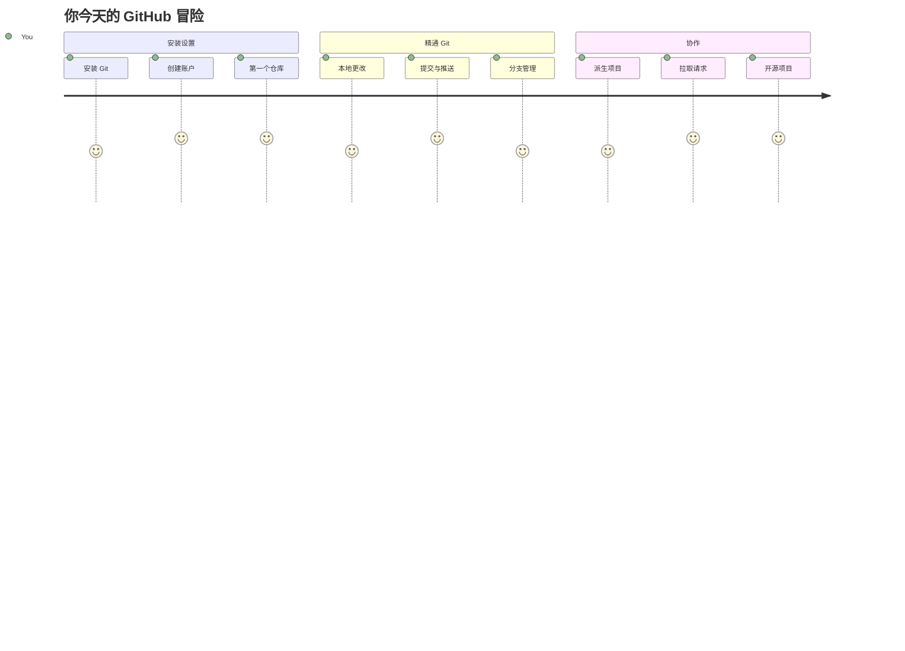
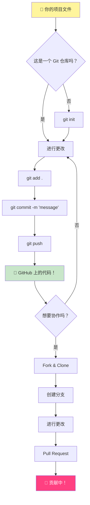
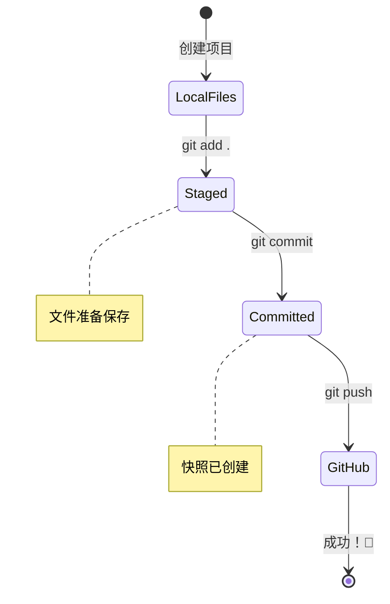
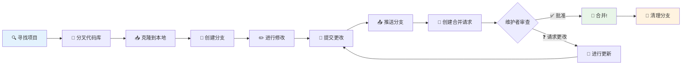
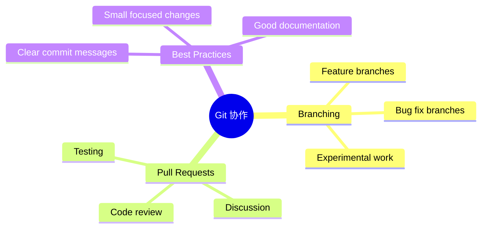
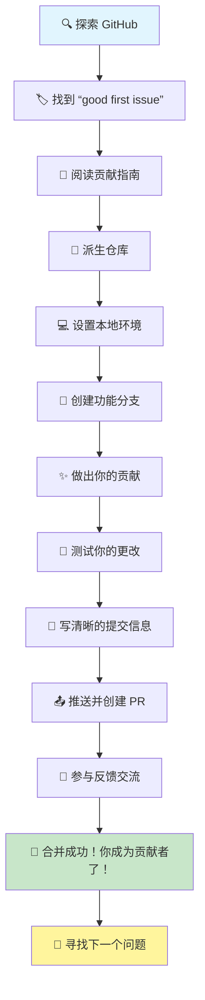
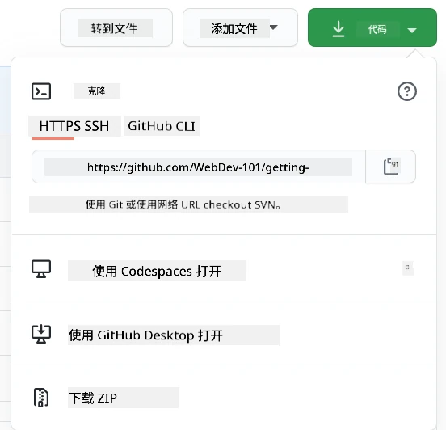
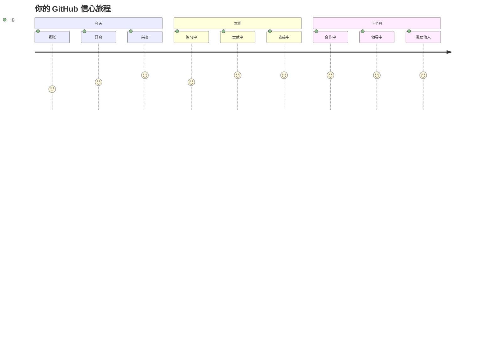

<!--
CO_OP_TRANSLATOR_METADATA:
{
  "original_hash": "5c383cc2cc23bb164b06417d1c107a44",
  "translation_date": "2026-01-06T12:01:16+00:00",
  "source_file": "1-getting-started-lessons/2-github-basics/README.md",
  "language_code": "zh"
}
-->
# GitHub简介

嗨，未来的开发者！👋 准备好加入全球数百万程序员的行列了吗？我真心兴奋地向你介绍GitHub——把它想象成程序员的社交媒体平台，不过我们分享的不是午餐照片，而是代码，共同构建令人难以置信的东西！

让我大开眼界的是：你手机上的每个应用、你访问的每个网站，以及你将学会使用的大多数工具，都是由开发团队在类似GitHub的平台上协作完成的。你喜欢的那个音乐应用？就有像你一样的人参与其中。那个让你爱不释手的游戏？没错，可能就是通过GitHub协作完成的。现在，你将学会如何成为这个惊人社区的一员！

我知道一开始可能觉得信息量很大——说实话，我第一次看到GitHub页面时也懵了，“这到底是啥意思？”但事实是：每一个开发者都从你现在的位置开始。课程结束时，你将拥有自己的GitHub仓库（把它想象成云端的个人项目展示），你会知道如何保存工作，与他人分享，甚至为数百万用户使用的项目做贡献。

我们将一步步一起出发。没有急躁，没有压力——只有你我和一些即将成为你新朋友的酷炫工具！


> 速记图由 [Tomomi Imura](https://twitter.com/girlie_mac) 制作


## 课前测验
[课前测验](https://ff-quizzes.netlify.app)

## 介绍

在开始真正令人兴奋的内容之前，先让你的电脑准备好迎接GitHub的魔法吧！把这看作是在创作杰作前整理好艺术用品——准备好合适的工具让整个过程更流畅、更有趣。

我会一步步带你完成每个设置步骤，保证过程没你想象的那么吓人。如果一开始没有立刻理解也没关系！我记得当初搭建第一个开发环境时，感觉自己像是在看古埃及象形文字。每个开发者都经历过你现在的阶段，怀疑自己是不是做对了。剧透一下：既然你来了这里学习，说明你已经在正确的路上了！🌟

这节课，我们会涵盖：

- 追踪你在电脑上的工作
- 与他人协作项目
- 如何为开源软件做贡献

### 先决条件

让我们先让电脑准备好迎接GitHub的魔法！别担心——这只是一次性的设置，完成后整个编码之旅都会顺利。

好，先从基础开始！我们先检查电脑上是否已经安装了Git。Git基本上就像一个超级智能的助理，能记录你代码的每一次改动——比你两秒按一次Ctrl+S强多了（我们都有过！）。

在终端输入这个魔法命令看一下Git是否安装：
`git --version`

如果还没安装Git，别着急！去[下载Git](https://git-scm.com/downloads)把它装上。安装完，我们需要正式介绍Git给你认识：

> 💡 **首次设置**：这些命令告诉Git你的身份。每次提交都会附带这些信息，所以请选择你愿意公开分享的名字和邮箱。

```bash
git config --global user.name "your-name"
git config --global user.email "your-email"
```

你能通过输入以下命令检查Git是否已经配置：
```bash
git config --list
```

你还需要一个GitHub账户，一个代码编辑器（比如Visual Studio Code），并打开你的终端（命令提示符也可以）。

访问 [github.com](https://github.com/) ，如果还没有账户就创建一个，或者登录并完善你的个人资料。

💡 **现代建议**：考虑设置[SSH密钥](https://docs.github.com/en/authentication/connecting-to-github-with-ssh)或使用[GitHub CLI](https://cli.github.com/)实现无需密码的更便捷认证。

✅ GitHub不是唯一的代码仓库，但它是最知名的。

### 准备工作

你需要在本地（笔记本或PC）有一个包含代码项目的文件夹，并且在GitHub有一个公开仓库，这将作为学习如何为他人项目做贡献的范例。

### 保护你的代码安全

聊聊安全——别担心，我们不会让你听得头疼！把这些安全措施想象成锁车或锁门，是简单易养成的习惯，能保护你的辛勤成果。

我们将从一开始就用现代、安全的方式使用GitHub。这样你将培养出良好的习惯，这些习惯在你整个编码生涯都会发挥作用。

使用GitHub时，遵守安全最佳实践很重要：

| 安全领域 | 最佳实践 | 为什么重要 |
|---------------|---------------|----------------|
| **身份认证** | 使用SSH密钥或个人访问令牌 | 密码不够安全，正被逐渐淘汰 |
| **两步验证** | 为GitHub账号启用2FA | 增加账户额外保护层 |
| **仓库安全** | 永远不要提交敏感信息 | API密钥和密码绝不能出现在公共仓库 |
| **依赖管理** | 启用Dependabot自动更新 | 保持依赖安全和最新 |

> ⚠️ **重要安全提醒**：绝不可提交API密钥、密码和其他敏感信息到任何仓库。请使用环境变量和`.gitignore`文件保护敏感数据。

**现代认证配置示例：**

```bash
# 生成 SSH 密钥（现代 ed25519 算法）
ssh-keygen -t ed25519 -C "your_email@example.com"

# 设置 Git 使用 SSH
git remote set-url origin git@github.com:username/repository.git
```

> 💡 **专业提示**：SSH密钥无需重复输入密码，比传统认证方法更安全。

---

## 像专家一样管理你的代码

好了，真正令人兴奋的部分来了！🎉 我们将学习如何像专业人士那样追踪和管理代码，这真是我最喜欢教的内容之一，因为它改变游戏规则。

想象一下：你正在写一本精彩的故事，想保留每一稿、每个精彩修改和每一个“等一下，这简直是天才！”的瞬间。Git就是为你的代码做了这件事！它就像有一本了不起的时光笔记，记录一切——每一次击键、每一次改动、每一次“糟糕，坏掉了”的时刻，瞬间就能撤销。

说实话，一开始可能有点儿不知所措。我刚学Git时也想，“我为什么不能像以前那样只保存文件？”但相信我，一旦你适应了Git（肯定会的！），你会有那种灵光一闪的感觉：“没有Git我怎么写代码的？”就好像你一直只能走路，突然发现自己能飞了一样！

假设你本地有个文件夹，里面有代码项目，你想用git版本控制系统来追踪进度。有些人把使用git比作写给未来自己的情书。数天、数周甚至数月后再看提交信息，你能回忆起当时为何做出某个决定，或者“回滚”某个改动——前提是你写了好的“提交消息”。


### 任务：创建你的第一个仓库！

> 🎯 **你的任务（我为你感到超级激动！）**：我们将一起创建你的第一个GitHub仓库！完成后，你将拥有在网络上的一个小角落，存放你的代码，并且你将完成第一次“提交”（开发者术语，意味着用超智能的方式保存工作）。
>
> 这真是特别的时刻——你即将正式加入全球开发者社区！我还记得创建第一个仓库时的激动，“哇，我真的做到啦！”

让我们一步步一起踏上这段旅程。每一步不要慌，慢慢来——没有谁在着急，保证每步都合情合理。记住，每个你敬佩的编码大神，都曾与你同坐在这里，准备创建他们的第一个仓库。多酷啊！

> 观看视频
> 
> [](https://www.youtube.com/watch?v=9R31OUPpxU4)

**一起动手做：**

1. **在GitHub上创建仓库**。登陆GitHub.com，找到那个醒目的绿色 **New** 按钮（或者右上角的 **+** 号）。点击，选择 **New repository**。

   操作步骤：
   1. 给你的仓库起个名字——起一个对你有意义的名字！
   1. 可以添加描述（帮助别人了解你的项目）
   1. 选定公开（所有人可见）或私有（仅你可见）
   1. 建议勾选添加README文件——它是项目的首页介绍
   1. 点击 **Create repository**，庆祝一下——你刚刚创建了第一个仓库！🎉

2. **进入你的项目文件夹**。现在打开终端（别怕，其实没那么吓人！）。告诉电脑你的项目文件在哪儿，输入命令：

   ```bash
   cd [name of your folder]
   ```

   **这里做了什么：**
   - 我们实质上是在告诉电脑“带我到项目文件夹”
   - 就像在桌面打开特定文件夹，只不过用文本命令做这件事
   - 把`[name of your folder]`替换成你项目文件夹的真实名称

3. **把你的文件夹变成Git仓库**。神奇时刻来了！输入：

   ```bash
   git init
   ```

   **发生了什么（很酷！）：**
   - Git在你的项目里创建了一个隐藏的`.git`文件夹——你看不到它，但它就在那！
   - 你的普通文件夹变成了一个能追踪每一次改动的“仓库”
   - 就好像给文件夹赋予了超能力，能记住所有事情

4. **检查仓库当前状态**。看看Git此刻对你的项目有什么看法：

   ```bash
   git status
   ```

   **理解Git告诉你的内容：**
   
   你可能会看到类似这样的信息：

   ```output
   Changes not staged for commit:
   (use "git add <file>..." to update what will be committed)
   (use "git restore <file>..." to discard changes in working directory)

        modified:   file.txt
        modified:   file2.txt
   ```

   **别慌！它的意思是：**
   - 红色的文件是有改动但还没准备好保存的
   - 绿色的文件（如果看到）是已准备好保存的
   - Git会提示你下一步该做什么，很贴心

   > 💡 **小贴士**：`git status`命令是你的好帮手！不懂时就问它，就像让Git告诉你“现在状况如何”。

5. **准备文件保存（也叫“暂存”）**：

   ```bash
   git add .
   ```

   **刚刚做了什么：**
   - 告诉Git“把所有文件都加到下一次保存里”
   - `.`表示“这个文件夹下的所有东西”
   - 现在你的文件已经“暂存”好，可以进行下一步

   **想更挑剔地选择？** 你可以只添加特定文件：

   ```bash
   git add [file or folder name]
   ```

   **为什么这样做？**
   - 有时候你想把相关改动分批提交
   - 有利于把工作整理成有逻辑的小块
   - 让日后更容易理解改动内容和时间

   **想撤销选择？** 可以这样取消暂存：

   ```bash
   # 取消暂存所有内容
   git reset
   
   # 只取消暂存一个文件
   git reset [file name]
   ```

   不用担心——这不会删掉你的内容，只是把文件从“准备提交”的列表里移除。

6. **永久保存工作（提交你的第一次commit！）**：

   ```bash
   git commit -m "first commit"
   ```

   **🎉 恭喜你！你完成了第一次commit！**
   
   **发生了什么：**
   - Git对所有暂存的文件做了“快照”，记录当前状态
   - 你的提交信息“first commit”说明了保存点的内容
   - Git给这个快照一个唯一ID，你随时能找到它
   - 你正式开始管理项目历史了！

   > 💡 **今后的提交信息**：写得更有描述性！别写“updated stuff”，试试“给首页添加联系表单”或“修复导航菜单bug”。未来的你会感谢自己的！

7. **连接本地项目到GitHub**。现在你的项目只存在电脑里，连接到GitHub仓库，才能分享给全世界！

   先打开你的GitHub仓库页面，复制URL。回到这里，输入：

   ```bash
   git remote add origin https://github.com/username/repository_name.git
   ```
   
   （把这个URL换成你的仓库实际地址！）

   **刚刚做了什么：**
   - 我们在你的本地项目和你的 GitHub 仓库之间建立了连接
   - “origin” 只是你的 GitHub 仓库的一个昵称——就像给你的手机添加联系人一样
   - 现在你的本地 Git 知道在你准备好分享代码时该把代码发送到哪里

   💡 **更简单的方法**：如果你安装了 GitHub CLI，可以用一条命令完成这一步：
   ```bash
   gh repo create my-repo --public --push --source=.
   ```

8. **将代码上传到 GitHub**（激动人心的时刻！）：

   ```bash
   git push -u origin main
   ```

   **🚀 就是这一步！你正在把代码上传到 GitHub！**
   
   **发生了什么：**
   - 你的提交正从电脑传送到 GitHub
   - `-u` 参数建立了永久连接，方便以后推送
   - “main” 是你的主分支名称（类似主文件夹）
   - 之后你只需输入 `git push` 来上传修改！

   💡 **小提示**：如果分支叫其他名字（如 “master”），用那个名字替代。可用 `git branch --show-current` 查看当前名字。

9. **你的新日常编码节奏**（上瘾的时候到了！）：

   从现在开始，只要你修改项目，都遵循简单的三步流程：

   ```bash
   git add .
   git commit -m "describe what you changed"
   git push
   ```

   **这将成为你的编码心跳：**
   - 编写精彩代码 ✨
   - 用 `git add` 记录修改（“Git，关注这些改动！”）
   - 用 `git commit` 并写清楚信息保存（未来的你会感谢现在的你！）
   - 用 `git push` 分享给世界 🚀
   - 循环往复——真的，这会变得自然而然！

   我喜欢这个流程，就像电子游戏里多保存点。喜欢刚写的修改？提交它！想试点冒险的改动？没问题——你总能回到最后一次提交！

   > 💡 **提示**：建议使用 `.gitignore` 文件避免不想追踪的文件出现在 GitHub 上——比如你存放的笔记文件，它不适合公开。你可以去 [.gitignore 模板](https://github.com/github/gitignore) 找模板，或用 [gitignore.io](https://www.toptal.com/developers/gitignore) 创建。

### 🧠 **第一次仓库提交：感觉如何？**

**花点时间庆祝和回顾：**
- 第一次在 GitHub 看到自己的代码感觉怎么样？
- 哪一步最让你困惑？哪一步出乎意料地简单？
- 你能用自己的话解释 `git add`、`git commit` 和 `git push` 的区别吗？


> **记住**：即使是经验丰富的开发者也会忘记具体命令。让流程变成本能需要练习——你做得很棒！

#### 现代 Git 工作流程

考虑采用这些现代实践：

- **Conventional Commits（规范提交）**：用标准格式的提交信息如 `feat:`、`fix:`、`docs:` 等。了解更多请访问 [conventionalcommits.org](https://www.conventionalcommits.org/)
- **原子提交**：每次提交代表一个逻辑上的独立改动
- **频繁提交**：多且带描述的提交代替少且庞大的提交

#### 提交信息

一个好的 Git 提交主题行能完成下面句子：
如果应用该提交，它将 <你的主题>

主题用祈使句现在时态：“change”，不是 “changed” 或 “changes”。正文（可选）也用祈使句现在时。正文应说明改动的动机，并与之前的行为对比。你是在解释“为什么”，不是“怎么做”。

✅ 花几分钟逛逛 GitHub，能找到一个特别棒的提交信息吗？能找到特别简洁的吗？你觉得提交信息中最重要有用的信息是什么？

## 与他人合作（有趣部分！）

抓紧你的帽子，因为这里是 GitHub 真正神奇的时候！🪄 你已经学会管理自己的代码，现在我们进入我最喜欢的部分——与来自世界各地的优秀人才协作。

想象一下：你第二天醒来发现东京有人改进了你的代码；柏林有人修复了你一直卡住的 Bug；下午时，圣保罗的开发者添加了你从没想过的功能。这不是科幻——这只是 GitHub 世界里的普通一天！

让我激动的是，你将学到的协作技能正是谷歌、微软和你喜欢的创业公司每天都在用的工作流程。这不仅仅是学一个酷工具——你学会了让整个软件世界协同工作的秘密语言。

说真的，一旦你体验过别人合并你的第一次拉取请求的激动，你会明白开发者为何对开源项目如此热情。这就像参与了全世界最大最有创意的团队项目！

> 查看视频
>
> [](https://www.youtube.com/watch?v=bFCM-PC3cu8)

把东西放到 GitHub 的主要原因就是让与其他开发者的协作成为可能。


在你的仓库里，导航至 `Insights > Community`，查看你的项目如何对照推荐的社区标准进行比较。

想让你的仓库看起来专业且有吸引力？去仓库点击 `Insights > Community`。这个酷功能会显示你的项目与 GitHub 社区认可的“好仓库实践”相比的情况。

> 🎯 **让你的项目闪耀**：结构良好的仓库和完善的文档就像干净欢迎的店铺。它告诉大家你重视你的工作，也会让别人想来贡献！

**一个棒仓库的要点：**

| 应该添加的内容 | 重要性 | 对你的作用 |
|-------------|-------------------|---------------------|
| **描述** | 第一印象很重要！ | 让人立刻知道项目做什么 |
| **README** | 项目的主页 | 就像对新访客的友好导览 |
| **贡献指南** | 表明欢迎帮助 | 让人知道如何参与贡献 |
| **行为准则** | 营造友好氛围 | 确保每个人都感到受欢迎 |
| **许可证** | 法律明确 | 让别人知道怎么使用你的代码 |
| **安全政策** | 表明你负责任 | 展示专业规范 |

> 💡 **小窍门**：GitHub 提供了所有这些文件的模板。创建新仓库时，可以勾选自动生成这些文件。

**值得探索的现代 GitHub 功能：**

🤖 **自动化 & CI/CD：**
- **GitHub Actions**：自动化测试和部署
- **Dependabot**：依赖自动更新

💬 **社区 & 项目管理：**
- **GitHub Discussions**：议题以外的社区对话
- **GitHub Projects**：看板式项目管理
- **分支保护规则**：维护代码质量标准


所有这些资源都能帮助新成员快速入职。新贡献者通常先看这些东西，再决定项目是否值得投入时间。

✅ README 虽然准备需要时间，但常被繁忙的维护者忽视。你能找到一个特别详细的 README 作为例子吗？提示：有些[工具能帮你创建优秀的 README](https://www.makeareadme.com/)，可以试试。

### 任务：合并代码

贡献文档帮助别人参与项目。它说明你期待的贡献类型和流程。贡献者需要经过一系列步骤，才能在 GitHub 上为你的仓库做贡献：

1. **Fork 你的仓库**。你可能希望别人 _fork_ 你的项目。Fork 是在他们的 GitHub 账号上创建你仓库的副本。
1. **克隆**。然后他们将项目克隆到本地机器。
1. **创建分支**。你会希望他们为自己的工作创建一个 _分支_。
1. **把修改聚焦在一件事**。让贡献者每次专注一件事——这样更容易 _合并_ 他们的工作。假设他们写了 bug 修复、添加新功能并更新多个测试——如果你只能合并其中两个或一个怎么办？

✅ 想想有哪些场景分支对写出和发布高质量代码特别关键？

> 注意，成为你希望看到的改变，也为你自己的工作创建分支。任何提交都发生在你当前“签出”的分支上。用 `git status` 查看当前分支。

我们来看贡献者的工作流程。假设贡献者已经 _fork_ 和 _clone_ 了仓库，拥有一个可本地操作的 Git 仓库：

1. **创建分支**。用命令 `git branch` 创建将用于贡献的分支：

   ```bash
   git branch [branch-name]
   ```

   > 💡 **现代做法**：你也可以用一条命令创建并切换分支：
   ```bash
   git switch -c [branch-name]
   ```

1. **切换到工作分支**。用 `git switch` 切换到指定分支并更新工作区：

   ```bash
   git switch [branch-name]
   ```

   > 💡 **现代提示**：`git switch` 是替代 `git checkout` 修改分支的现代命令，更清晰也更安全适合新手。

1. **开始工作**。此时你添加修改。别忘了用下面命令告诉 Git：

   ```bash
   git add .
   git commit -m "my changes"
   ```

   > ⚠️ **提交信息质量**：确保给你的提交起个好名字，为自己和仓库维护者负责。具体说明你的改动！

1. **与 `main` 分支合并**。完成工作后，你想把改动合并回 `main`。由于 `main` 可能已变动，先用以下命令更新它：

   ```bash
   git switch main
   git pull
   ```

   接下来确保任何冲突，即 Git 无法轻松合并的情况发生在你的工作分支上。运行以下命令：

   ```bash
   git switch [branch_name]
   git merge main
   ```

   `git merge main` 命令将 `main` 的所有改动合入你的分支。希望你可以直接继续。如果不能，VS Code 会告诉你哪里有冲突，你只需编辑相关文件，决定哪些内容是正确的。

   💡 **现代替代**：考虑用 `git rebase` 保持历史清晰：
   ```bash
   git rebase main
   ```
   它将你的提交放到最新的 `main` 之上，创建线性历史。

1. **将你的工作推送到 GitHub**。推送工作到 GitHub 包含两步：推送分支到你的仓库，然后打开 PR（拉取请求）。

   ```bash
   git push --set-upstream origin [branch-name]
   ```

   上面命令会在你的 fork 仓库上创建该分支。

### 🤝 **协作技能检测：准备好与他人合作了吗？**

**看看你对协作的感觉如何：**
- 你现在理解 fork 和拉取请求的概念了吗？
- 关于分支工作你还想多练习什么？
- 你对向别人的项目贡献感觉如何？


> **信心提升**：你敬佩的每个开发者当年也曾紧张他们的第一次拉取请求。GitHub 社区对新手非常友好！

1. **打开拉取请求（PR）**。接下来你要在 GitHub 上打开 PR。访问你的 fork 仓库，GitHub 会提示你是否创建新 PR，点击进入后可以修改提交信息标题，写更合适的描述。原仓库维护者会看到该 PR，_希望他们会喜欢并合并它_。你现在是贡献者，太棒了 :)

   💡 **现代小贴士**：你也可以用 GitHub CLI 创建 PR：
   ```bash
   gh pr create --title "Your PR title" --body "Description of changes"
   ```

   🔧 **PR 最佳实践**：
   - 使用关键词关联相关 issues，如 “Fixes #123”
   - 为界面改动添加截图
   - 指定特定评审人
   - 对进行中的工作使用草稿 PR
   - 确保所有 CI 检查通过再请求评审
1. **清理**。在你成功合并一个 PR 之后，进行_清理_工作被认为是一种良好习惯。你需要清理你的本地分支以及你推送到 GitHub 的分支。首先，用以下命令在本地删除它：

   ```bash
   git branch -d [branch-name]
   ```
  
确保接下来访问 Fork 的 GitHub 页面，删除你刚刚推送的远程分支。

“拉取请求”（Pull request）这个术语看起来有些奇怪，实际上你是想将你的变更推送到项目里。但项目维护者（项目所有者）或者核心团队需要先审查你的变更，才会将它合并到项目的“主”分支，所以你实际上是在请求维护者做出变更的决定。

拉取请求是一个比较和讨论某个分支引入的差异的地方，带有评审、评论、集成测试等等功能。一个好的拉取请求大致遵循提交信息的相同规则。当你的工作修复了某个问题时，你可以添加该问题追踪器中问题的引用。方法是用 `#` 加上你的问题编号。例如 `#97`。

🤞 希望所有检查都通过，项目所有者能将你的改动合并进项目 🤞

使用以下命令更新你当前本地工作分支，使其包含 GitHub 上对应远程分支的所有新提交：

`git pull`

## 为开源贡献（您改变世界的机会！）

你准备好迎接将彻底震撼你心灵的事情了吗？🤯 让我们聊聊如何为开源项目做贡献——想到与您分享这些我都热血沸腾！

这是你成为真正非凡事物一部分的机会。想象一下，改进数百万开发者每天使用的工具，或者修复你朋友喜欢的应用中的一个 bug。这不仅仅是梦想——这就是开源贡献的意义！

让我每次想到都会激动的是：你学习过的每一个工具——代码编辑器、我们将探索的框架，甚至你现在用来阅读这篇文章的浏览器——最初都是由和你一样的人首次做出贡献而开始的。那个打造你最喜欢的 VS Code 插件的优秀开发者？他们也曾是一个初学者，用颤抖的手点下“创建拉取请求”，就像你即将做的那样。

最美妙的是：开源社区就像互联网最大的集体拥抱。大多数项目都会积极欢迎新人，而且有专门标记为“good first issue”（好入门问题）的任务，就是为像你这样的人准备的！维护者看到新贡献者会非常兴奋，因为他们记得自己的第一步。


你不仅仅是在学编程——你正在准备加入一个每天醒来都想着“我们如何让数字世界变得更好一点”的全球建设者家庭。欢迎加入！🌟

首先，让我们找到一个你感兴趣且想贡献变更的 GitHub 代码库（**repo**）。你需要把它的内容复制到你的电脑上。

✅ 一个很好的寻找“初学者友好”仓库的方法是[通过“good-first-issue”标签搜索](https://github.blog/2020-01-22-browse-good-first-issues-to-start-contributing-to-open-source/)。



有几种方式可以复制代码。一种是使用 HTTPS、SSH，或者 GitHub CLI（命令行界面）“克隆”仓库内容。

打开终端，输入以下命令克隆仓库：

```bash
# 使用 HTTPS
git clone https://github.com/ProjectURL

# 使用 SSH（需要设置 SSH 密钥）
git clone git@github.com:username/repository.git

# 使用 GitHub CLI
gh repo clone username/repository
```
  
要开始项目工作，切换到相应文件夹：  
`cd ProjectURL`

你也可以用以下方式打开整个项目：  
- **[GitHub Codespaces](https://github.com/features/codespaces)** —— GitHub 提供的带有浏览器中 VS Code 的云开发环境  
- **[GitHub Desktop](https://desktop.github.com/)** —— Git 操作的图形界面应用  
- **[GitHub.dev](https://github.dev)** —— 在任意 GitHub 仓库按 `.` 键打开浏览器中 VS Code  
- 安装 GitHub Pull Requests 扩展的 VS Code

最后，你也可以下载代码的压缩包。

### 关于 GitHub 的几点更多有趣内容

你可以给任何 GitHub 上的公共仓库加星、关注和/或“Fork”（派生）。你可以在右上角的下拉菜单中找到你加星的仓库。它就像收藏书签，但针对代码。

项目通常有一个问题追踪器，通常在 GitHub 的“Issues”标签页（除非另有说明），这是人们讨论与项目有关问题的地方。拉取请求页是人们讨论和复审正在进行的改动的地方。

项目还可能有论坛、邮件列表，或者像 Slack、Discord、IRC 这样的聊天频道。

🔧 **现代 GitHub 功能**：  
- **GitHub Discussions** —— 内置社区讨论论坛  
- **GitHub Sponsors** —— 金融支持维护者  
- **安全标签** —— 漏洞报告与安全公告  
- **Actions 标签** —— 查看自动化工作流和 CI/CD 管道  
- **Insights 标签** —— 关于贡献者、提交和项目健康的数据分析  
- **Projects 标签** —— GitHub 内置的项目管理工具

✅ 试着熟悉你的新 GitHub 仓库，尝试编辑设置、为仓库添加信息、创建项目（如看板），以及设置 GitHub Actions 实现自动化。你可以做很多事情！

---

## 🚀 挑战

好了，是时候检验你闪亮的新 GitHub 超能力了！🚀 这项挑战会让一切以最令人满意的方式水到渠成：

找一个朋友（或者一直问你“你那些电脑玩意儿在干嘛”的亲戚）一起开始一场协作编程冒险！这才是真正的魔法所在——创建项目，让他们 Fork，创建几个分支，然后像专业人士一样合并变更。

我说实话——你们很可能会哈哈大笑（尤其是当你们俩试图同时改同一行代码时），也许会一起摸不着头脑，但你们肯定会有那些令人激动的“啊哈！”时刻，让所有学习都物有所值。而且，和别人分享第一次成功合并总是特别的——就像是对你来之不易进步的一次小小庆祝！

还没有编程伙伴？没关系！GitHub 社区里有无数热情欢迎的成员，他们都记得自己刚开始时是什么样子。寻找带有“good first issue”标签的仓库——它们基本上是在说“嘿，初学者，来和我们一起学习吧！”多棒啊！

## 课后测验  
[课后测验](https://ff-quizzes.netlify.app/web/en/)

## 复习与持续学习

呼！🎉 看你——你刚刚像个绝对的高手一样掌握了 GitHub 基础！如果现在感觉大脑有点满，那很正常，老实说这其实是好现象。你刚刚学会的工具，我当初花了好几周才熟悉。

Git 和 GitHub 非常强大（真的非常强大），我认识的每个开发者——包括现在看起来像个高手的那帮人——都必须不断练习、跌跌撞撞才能完全掌握。你能完成这课说明你已经在向掌握开发者工具箱里最重要的东西迈进了。

这里有一些绝佳资源，帮你练习且变得更棒：

- [开源软件贡献指南](https://opensource.guide/how-to-contribute/#how-to-submit-a-contribution) —— 你的改变之路地图  
- [Git 速查表](https://training.github.com/downloads/github-git-cheat-sheet/) —— 随时备查！

记住：练习带来进步，不是完美！你用 Git 和 GitHub 越多，越觉得自然。GitHub 还推出了些很棒的交互课程，让你在安全环境中练习：

- [GitHub 入门](https://github.com/skills/introduction-to-github)  
- [使用 Markdown 交流](https://github.com/skills/communicate-using-markdown)  
- [GitHub Pages](https://github.com/skills/github-pages)  
- [管理合并冲突](https://github.com/skills/resolve-merge-conflicts)

**想挑战现代工具？查看这些：**  
- [GitHub CLI 文档](https://cli.github.com/manual/) —— 想成为命令行巫师必备  
- [GitHub Codespaces 文档](https://docs.github.com/en/codespaces) —— 云端编程！  
- [GitHub Actions 文档](https://docs.github.com/en/actions) —— 自动化一切  
- [Git 最佳实践](https://www.atlassian.com/git/tutorials/comparing-workflows) —— 升级你的工作流玩法

## GitHub Copilot Agent 挑战 🚀

使用 Agent 模式完成下面的挑战：

**描述：** 创建一个协作网页开发项目，展示你在本课中学到的完整 GitHub 工作流程。本挑战将帮助你在真实场景中练习仓库创建、协作功能以及现代 Git 工作流。

**提示：** 在 GitHub 创建一个新的公共仓库，名为“Web Development Resources”。仓库应包含结构良好的 README.md 文件，列出按类别组织的实用网页开发工具和资源（HTML、CSS、JavaScript 等）。为仓库设置合适的社区规范，包括许可协议、贡献指南和行为准则。创建至少两个功能分支：一个用于添加 CSS 资源，另一个用于 JavaScript 资源。分别在两个分支做提交，并附上描述性提交信息，然后创建拉取请求合并回主分支。启用 GitHub 诸如 Issues、Discussions 功能，并设置基础的 GitHub Actions 工作流，实现自动检查。

## 任务

你的任务，如果你愿意接受：完成 GitHub Skills 上的 [GitHub 入门](https://github.com/skills/introduction-to-github) 课程。这个交互式课程会让你在安全的引导环境中练习所学。完成还有酷炫徽章奖励！🏅

**准备好接受更多挑战？**  
- 为你的 GitHub 账户设置 SSH 认证（告别密码！）  
- 试用 GitHub CLI 进行日常 Git 操作  
- 创建包含 GitHub Actions 工作流的仓库  
- 通过 GitHub Codespaces 在云端编辑这个仓库

---

## 🚀 你的 GitHub 掌握时间线

### ⚡ **接下来 5 分钟能做的事**  
- [ ] 给这个仓库及另外 3 个你感兴趣的项目加星  
- [ ] 为你的 GitHub 账户设置双因素认证  
- [ ] 为你的第一个仓库创建简单的 README  
- [ ] 关注 5 位启发你的开发者

### 🎯 **本小时能完成的目标**  
- [ ] 完成课后测验并反思你的 GitHub 学习之旅  
- [ ] 配置 SSH 密钥实现免密码登录 GitHub  
- [ ] 做出你第一个有意义且带有良好提交信息的 commit  
- [ ] 探索 GitHub“Explore”标签页，发现热门项目  
- [ ] 练习 Fork 仓库并做一些小改动

### 📅 **一周的 GitHub 冒险**  
- [ ] 完成 GitHub Skills 课程（GitHub 入门，Markdown）  
- [ ] 向开源项目提交第一个拉取请求  
- [ ] 搭建 GitHub Pages 展示你的作品  
- [ ] 参与你感兴趣项目的 GitHub Discussions  
- [ ] 创建符合社区规范的仓库（README，授权等）  
- [ ] 试用 GitHub Codespaces 云端开发

### 🌟 **一个月的转变**  
- [ ] 向 3 个不同开源项目贡献代码  
- [ ] 指导 GitHub 新手（传帮带！）  
- [ ] 配置自动化工作流（GitHub Actions）  
- [ ] 构建展示你 GitHub 贡献的作品集  
- [ ] 参加 Hacktoberfest 或类似社区活动  
- [ ] 成为自己项目的维护者，吸引他人贡献

### 🎓 **最终 GitHub 掌握确认**

**庆祝你的进步：**  
- 你最喜欢 GitHub 的哪一点？  
- 哪个协作功能让你最兴奋？  
- 现在你对开源贡献有多自信？  
- 你第一个想贡献的项目是什么？


> 🌍 **欢迎加入全球开发者社区！** 你现在拥有了与全球数百万开发者协作的工具。你的第一次贡献可能看上去很小，但请记住——每个重大开源项目都是从有人第一次提交代码开始的。问题不在于你是否能产生影响，而是哪个令人惊叹的项目会首先受益于你独特的视角！🚀

记住：每个专家都曾是初学者。你可以的！💪

---

<!-- CO-OP TRANSLATOR DISCLAIMER START -->
**免责声明**：  
本文件使用 AI 翻译服务 [Co-op Translator](https://github.com/Azure/co-op-translator) 进行翻译。尽管我们努力确保准确性，但请注意自动翻译可能包含错误或不准确之处。原文以其母语版本为准。对于重要信息，建议采用专业人工翻译。因使用本翻译引起的任何误解或错误解读，我们概不负责。
<!-- CO-OP TRANSLATOR DISCLAIMER END -->