<!--
CO_OP_TRANSLATOR_METADATA:
{
  "original_hash": "672b0bb6e8b431075f3bdb7130590d2d",
  "translation_date": "2026-01-06T11:12:57+00:00",
  "source_file": "2-js-basics/1-data-types/README.md",
  "language_code": "zh"
}
-->
# JavaScript 基础：数据类型

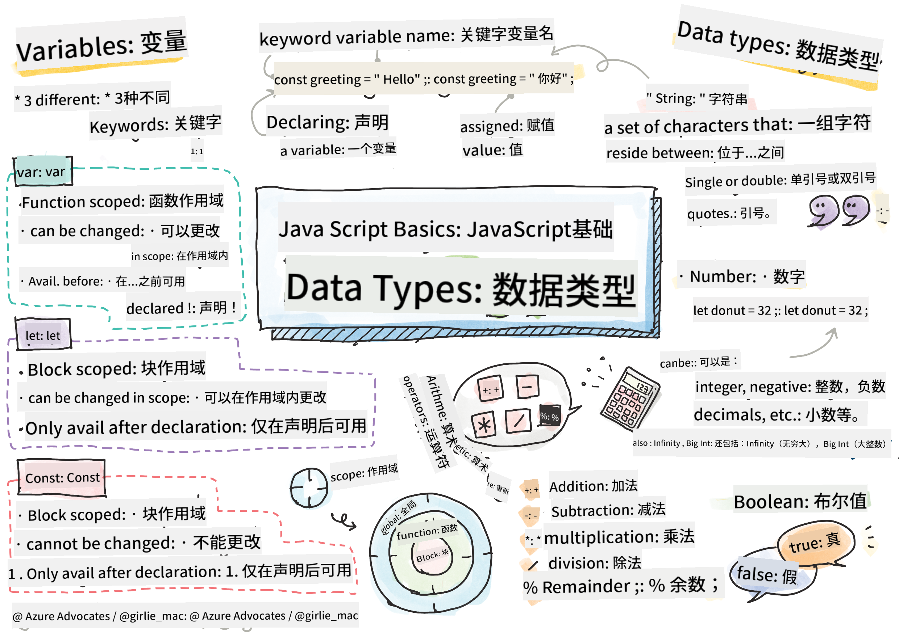
> 手绘笔记，作者 [Tomomi Imura](https://twitter.com/girlie_mac)

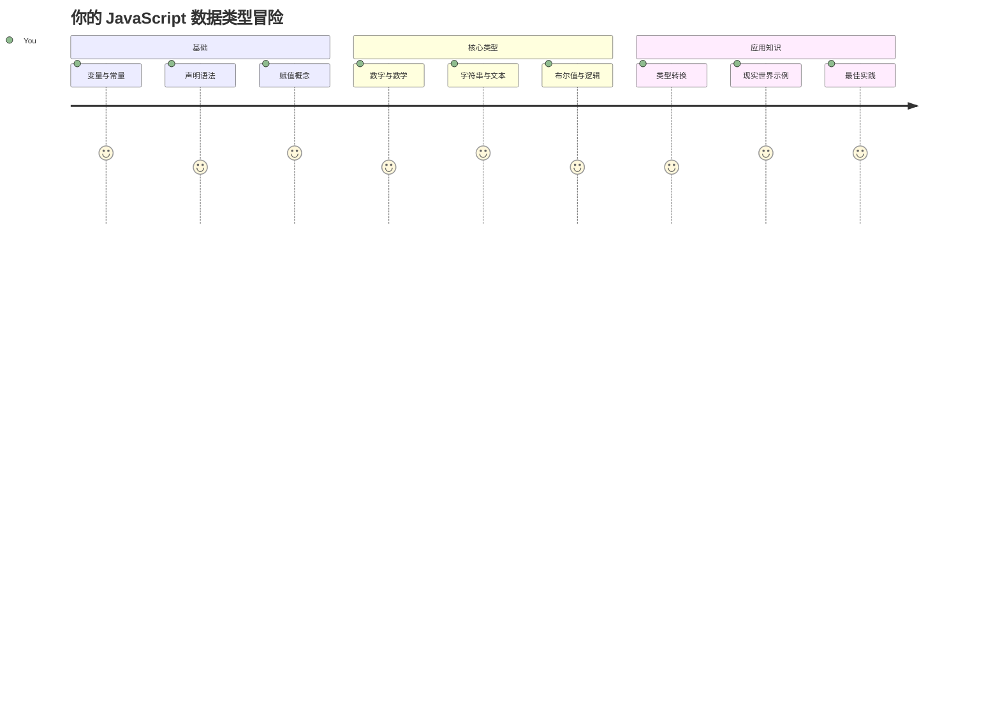
数据类型是 JavaScript 中你在每个程序中都会遇到的基本概念之一。把数据类型想象成古代亚历山大图书管理员使用的归档系统 —— 他们为包含诗歌、数学和历史记录的卷轴设定了特定的存放位置。JavaScript 以类似的方式组织信息，不同类别用于不同类型的数据。

在本课中，我们将探索让 JavaScript 工作的核心数据类型。你将学会如何处理数字、文本、真/假值，并理解为什么为程序选择正确的数据类型至关重要。这些概念起初可能看起来抽象，但通过练习，它们将变成你第二天性。

理解数据类型会让 JavaScript 中的其他内容变得更加清晰。就像建筑师需要了解不同的建筑材料才能建造大教堂一样，这些基础知识将支撑你未来构建的一切。

## 课前测验
[课前测验](https://ff-quizzes.netlify.app/web/)

本课涵盖了 JavaScript 的基础知识，这种语言为网页提供交互性。

> 你可以在 [Microsoft Learn](https://docs.microsoft.com/learn/modules/web-development-101-variables/?WT.mc_id=academic-77807-sagibbon) 上学习本课程！

[](https://youtube.com/watch?v=JNIXfGiDWM8 "Variables in JavaScript")

[](https://youtube.com/watch?v=AWfA95eLdq8 "Data Types in JavaScript")

> 🎥 点击上方图片观看关于变量与数据类型的视频

让我们从变量以及填充变量的数据类型开始吧！

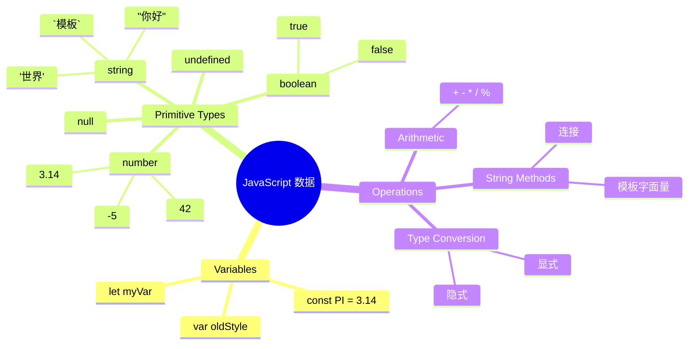
## 变量

变量是编程中的基础构件。就像中世纪炼金术士用于存放不同物质的标记罐子，变量让你存储信息并给它一个描述性的名称，以便以后引用。需要记住某人的年龄？将其存储在名为 `age` 的变量里。想追踪用户的名字？把它保存在 `userName` 变量中。

我们将专注于 JavaScript 中创建变量的现代方法。这里学习的技巧代表了语言多年来的发展和编程社区的最佳实践。

创建和 **声明** 变量的语法是 **[关键字] [名称]**。它由两部分组成：

- **关键字**。对可变的变量使用 `let`，对保持不变的值使用 `const`。
- **变量名**，是你自己选择的描述性名称。

✅ 关键字 `let` 是在 ES6 中引入的，赋予变量所谓的 _块作用域_。推荐使用 `let` 或 `const` 替代旧的 `var` 关键字。我们将在后续部分更深入地讲解块作用域。

### 任务 - 使用变量

1. **声明变量**。让我们先创建第一个变量：

    ```javascript
    let myVariable;
    ```

   **这样做的效果：**
   - 告诉 JavaScript 创建一个叫做 `myVariable` 的存储位置
   - JavaScript 在内存中为该变量分配空间
   - 变量当前没有值（undefined）

2. **赋值**。现在给变量赋一个值：

    ```javascript
    myVariable = 123;
    ```

   **赋值的工作原理：**
   - `=` 操作符将值 123 赋给了变量
   - 变量现在包含该值，不再是 undefined
   - 你可以在代码中使用 `myVariable` 引用这个值

   > 注意：本课中 `=` 表示“赋值操作符”，用于给变量设置值，不表示等号。

3. **聪明做法**。实际上，我们可以把这两个步骤合并：

    ```javascript
    let myVariable = 123;
    ```

    **这种做法更高效：**
    - 在一条语句中声明变量并赋值
    - 这是开发者的标准实践
    - 代码更简洁且保持清晰

4. **改变想法**。如果想存储不同的数字呢？

   ```javascript
   myVariable = 321;
   ```

   **重新赋值的理解：**
   - 变量现在包含 321 而不是 123
   - 之前的值被替换 —— 变量一次只存储一个值
   - 这种可变性是用 `let` 声明变量的关键特征

   ✅ 试试看！你可以直接在浏览器中写 JavaScript。打开浏览器窗口，进入开发者工具。在控制台提示符下，输入 `let myVariable = 123`，回车，然后输入 `myVariable`。会发生什么呢？你将在后续课程中了解更多这些概念。

### 🧠 **变量掌握检测：提升熟练度**

**来看看你对变量的理解：**
- 你能解释声明变量和赋值变量的区别吗？
- 如果你在声明变量之前使用它，会发生什么？
- 在什么情况下你会选择用 `let` 而不是 `const`？

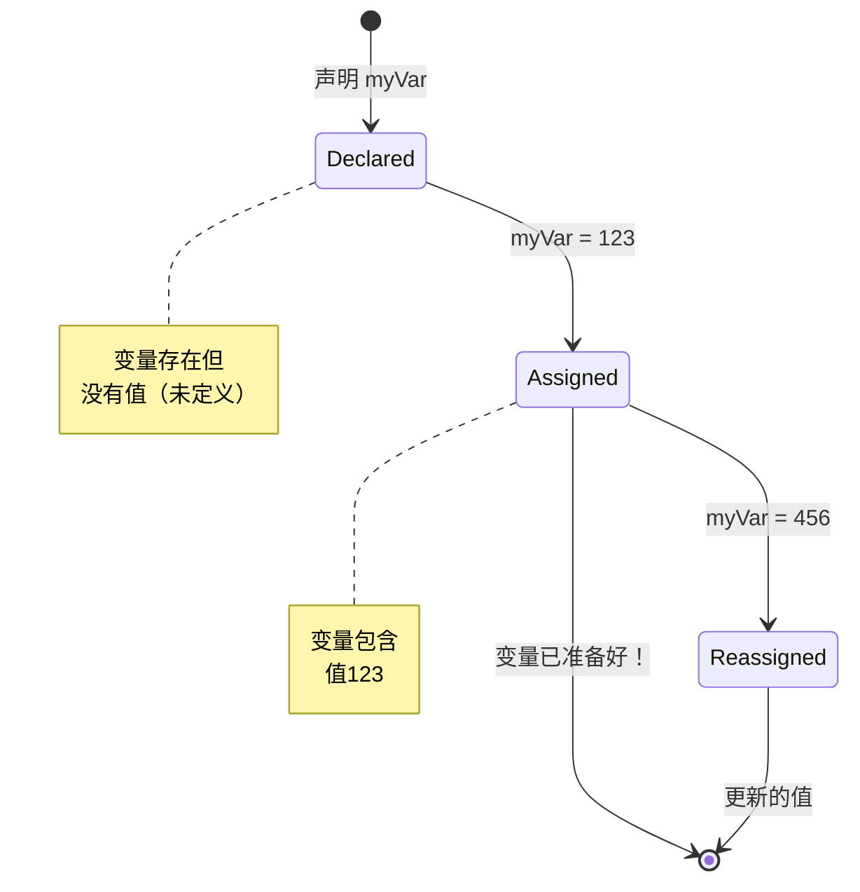
> **小提示**：把变量想象成带标签的储物箱。你创建箱子（`let`），把东西放进去（`=`），后续可以替换里面的内容！

## 常量

有时你需要存储在程序执行过程中永远不变的信息。常量就像古希腊欧几里得建立的数学原理 —— 一旦被证明和记录，永远保持不变。

常量的工作方式和变量类似，但有一个重要限制：赋值后不能更改。这种不可变性有助于防止对程序中的关键值发生意外修改。

声明并初始化常量的概念和变量相同，唯一不同的是使用 `const` 关键字。常量通常用全大写字母声明。

```javascript
const MY_VARIABLE = 123;
```

**这段代码做了什么：**
- **创建** 一个名为 `MY_VARIABLE` 的常量，值为 123
- **使用** 常量的全大写命名惯例
- **防止** 未来对该值的任何更改

常量的两条主要规则：

- **必须立即赋值** —— 不允许定义空常量！
- **值永远不能更改** —— 任何尝试更改都会导致错误。来看例子：

   **简单值** - 以下做法是不被允许的：
   
      ```javascript
      const PI = 3;
      PI = 4; // 不允许
      ```

   **你需要记住的：**
   - **尝试重新赋值常量会导致错误**
   - **保护** 重要的数值不被意外更改
   - **确保** 程序中值的一致性
 
   **对象引用是被保护的** - 以下做法不被允许：
   
      ```javascript
      const obj = { a: 3 };
      obj = { b: 5 } // 不允许
      ```

   **这些概念的理解：**
   - **防止** 用新对象替换整个原对象
   - **保护** 原始对象的引用
   - **保持** 对象在内存中的身份

    **对象值是不被保护的** - 以下做法是允许的：
    
      ```javascript
      const obj = { a: 3 };
      obj.a = 5;  // 允许
      ```

      **这里发生了什么：**
      - **修改** 对象内部的属性值
      - **保持** 相同的对象引用
      - **表明** 对象内容可以改变，但引用保持不变

   > 注意，`const` 保护的是引用不被重新赋值。值本身不是不可变的，尤其是当它是复杂类型如对象时，值可以改变。

## 数据类型

JavaScript 将信息组织成不同的类别，称为数据类型。这个概念类似于古代学者如何分类知识 —— 亚里士多德区分了不同的推理类型，知道逻辑原则不能统一运用于诗歌、数学和自然哲学。

数据类型很重要，因为不同的操作处理不同种类的信息。就像你不能对一个人的名字进行算术运算，或对数学方程排序一样，JavaScript 需要对每个操作使用合适的数据类型。理解这一点可以避免错误，让代码更可靠。

变量可以存储许多不同类型的值，比如数字和文本。这些不同类型的值统称为**数据类型**。数据类型是软件开发的重要一环，因为它帮助开发者决定如何编写代码以及软件如何运行。此外，某些数据类型具有独特的特性，能够帮助转换或提取值中的附加信息。

✅ 数据类型也称为 JavaScript 的原始数据类型，因为它们是语言提供的最低级别数据类型。共有 7 种原始数据类型：string（字符串）、number（数字）、bigint（大整数）、boolean（布尔值）、undefined（未定义）、null（空值）和 symbol（符号）。花点时间想象这些原始类型分别代表什么。什么是 `zebra`？`0` 是什么？`true` 呢？

### 数字

数字是 JavaScript 中最直接的数据类型。无论你操作像 42 这样整数，还是 3.14 这样的小数，或 -5 这样的负数，JavaScript 都统一处理。

还记得我们之前的变量吗？我们存储的 123 实际上是数字类型：

```javascript
let myVariable = 123;
```

**主要特征：**
- JavaScript 自动识别数字值
- 你可以对这些变量执行数学运算
- 不需要显式声明类型

变量可以存储所有类型的数字，包括小数和负数。数字也可以与算术运算符一起使用，详见[下一节](../../../../2-js-basics/1-data-types)。

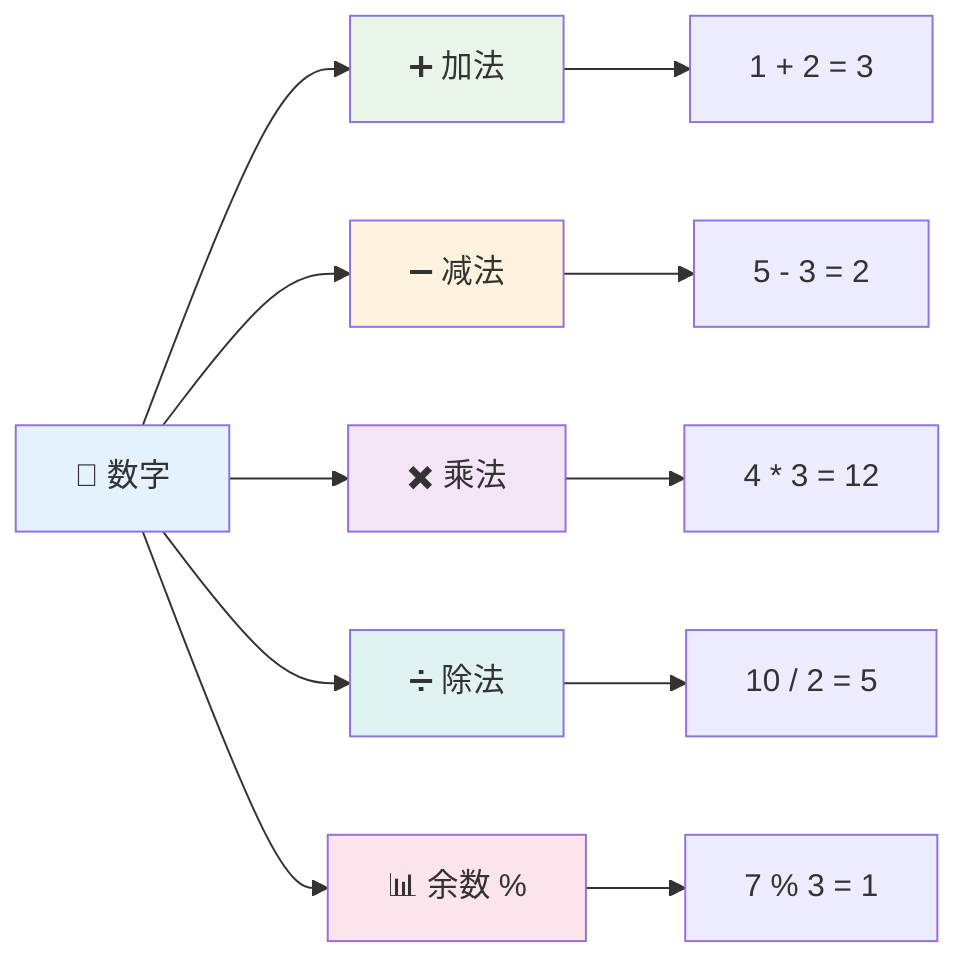
### 算术运算符

算术运算符让你在 JavaScript 中执行数学计算。这些运算符遵循数学家们使用了几个世纪的原则 —— 就像代数学符号的发明者花拉子米一样。

运算符的工作方式和传统数学相符：加号表示加法，减号表示减法，等等。

执行算术运算时，可以使用以下几种运算符：

| 符号   | 描述                                                                 | 示例                              |
| ------ | ------------------------------------------------------------------- | -------------------------------- |
| `+`    | **加法**：计算两个数字的和                                           | `1 + 2 // 预期结果是 3`          |
| `-`    | **减法**：计算两个数字的差                                           | `1 - 2 // 预期结果是 -1`         |
| `*`    | **乘法**：计算两个数字的乘积                                         | `1 * 2 // 预期结果是 2`          |
| `/`    | **除法**：计算两个数字的商                                           | `1 / 2 // 预期结果是 0.5`        |
| `%`    | **取余**：计算两个数字相除后的余数                                   | `1 % 2 // 预期结果是 1`          |

✅ 试试看！在浏览器的控制台尝试一个算术运算，结果有没有让你感到惊讶？

### 🧮 **数学技能检测：自信计算**

**测试你的算术理解：**
- `/`（除法）和 `%`（取余）有什么区别？
- 你能预测 `10 % 3` 的结果吗？（提示：不是 3.33……）
- 为什么在编程中取余运算符很有用？

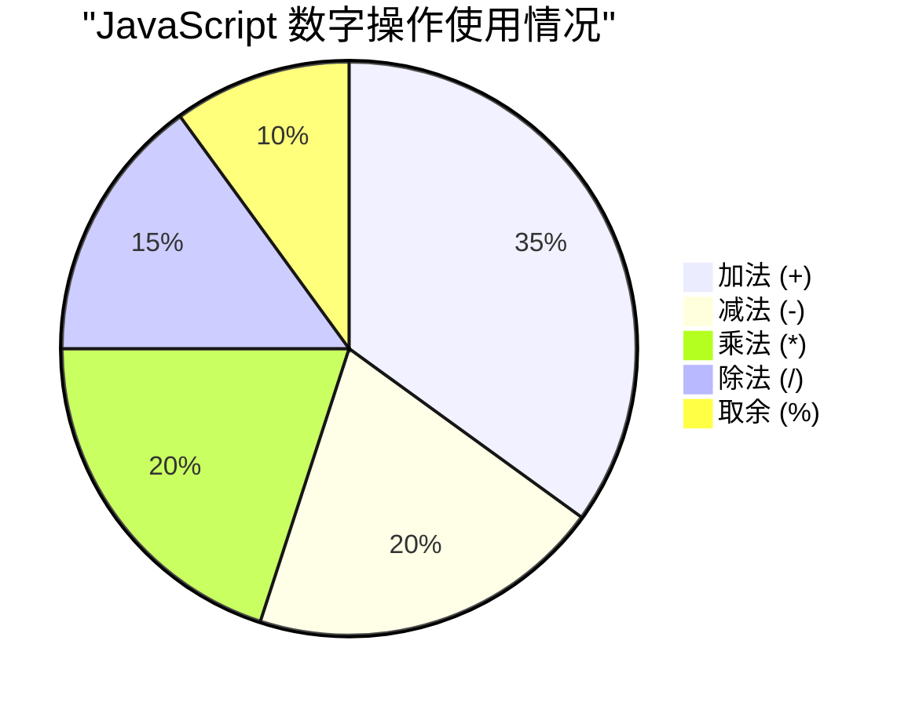
> **现实世界的启示**：取余运算符 % 非常有用，可以用来检查数字的偶奇性，创建模式，或在数组中循环！

### 字符串

在 JavaScript 中，文本数据由字符串表示。“字符串”一词来自字符按顺序串联的概念，就像中世纪修道院的抄写员将字母连接成词句记录在手稿里。

字符串是网页开发的基础。网站上显示的每段文本 —— 用户名、按钮标签、错误信息、内容 —— 都是字符串数据。理解字符串对创建功能性用户界面至关重要。

字符串是一组字符，放在单引号或双引号之间。

```javascript
'This is a string'
"This is also a string"
let myString = 'This is a string value stored in a variable';
```

**理解这些概念：**
- **使用** 单引号 `'` 或 双引号 `"` 来定义字符串
- **存储** 可以包含字母、数字和符号的文本数据
- **将** 字符串值赋给变量以供后续使用
- **需要** 使用引号以区分文本和变量名

记住写字符串时一定要用引号，否则 JavaScript 会把它当作变量名。

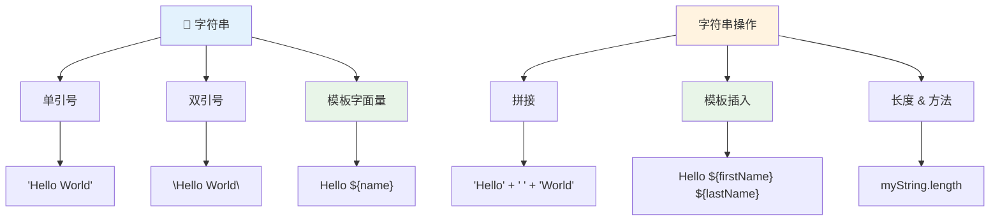
### 字符串格式化

字符串操作让你可以组合文本元素、插入变量，并创建响应程序状态的动态内容。这种技术让你能够以编程方式构造文本。

常常需要把多个字符串合并 —— 这个过程叫做连接。
要**连接**两个或多个字符串，或将它们连接在一起，使用 `+` 运算符。

```javascript
let myString1 = "Hello";
let myString2 = "World";

myString1 + myString2 + "!"; //你好，世界！
myString1 + " " + myString2 + "!"; //你好，世界！
myString1 + ", " + myString2 + "!"; //你好，世界！
```

**一步步来看，发生了什么：**
- 使用 `+` 运算符合并多个字符串
- 第一个例子中**直接连接**字符串，中间没有空格
- 在字符串之间**添加**空格字符 `" "` 以增加可读性
- **插入**逗号等标点符号以创建正确的格式

✅ 为什么在 JavaScript 中 `1 + 1 = 2`，但 `'1' + '1' = 11`？想一想。那 `'1' + 1` 会怎样？

**模板字符串**是另一种格式化字符串的方式，不同于引号，使用反引号 `` ` ``。所有非纯文本内容都必须放在占位符 `${ }` 内。这包括任何可能是字符串的变量。

```javascript
let myString1 = "Hello";
let myString2 = "World";

`${myString1} ${myString2}!` //你好，世界！
`${myString1}, ${myString2}!` //你好，世界！
```

**我们来理解每个部分：**
- 使用反引号 `` ` `` 替代普通引号来创建模板字符串
- 直接使用 `${}` 占位符语法嵌入变量
- 精确保留空格和格式
- 提供一种更简洁的方法来构建包含变量的复杂字符串

你可以用上述任一方法实现你的格式需求，但模板字符串会尊重所有空格和换行。

✅ 什么时候你会选择使用模板字符串而非普通字符串？

### 🔤 **字符串掌握检测：文本操作自信度**

**评估你的字符串技能：**
- 你能解释为什么 `'1' + '1'` 等于 `'11'` 而不是 `2` 吗？
- 你觉得哪种字符串方法更易读：连接符还是模板字符串？
- 如果忘记给字符串加引号，会发生什么？

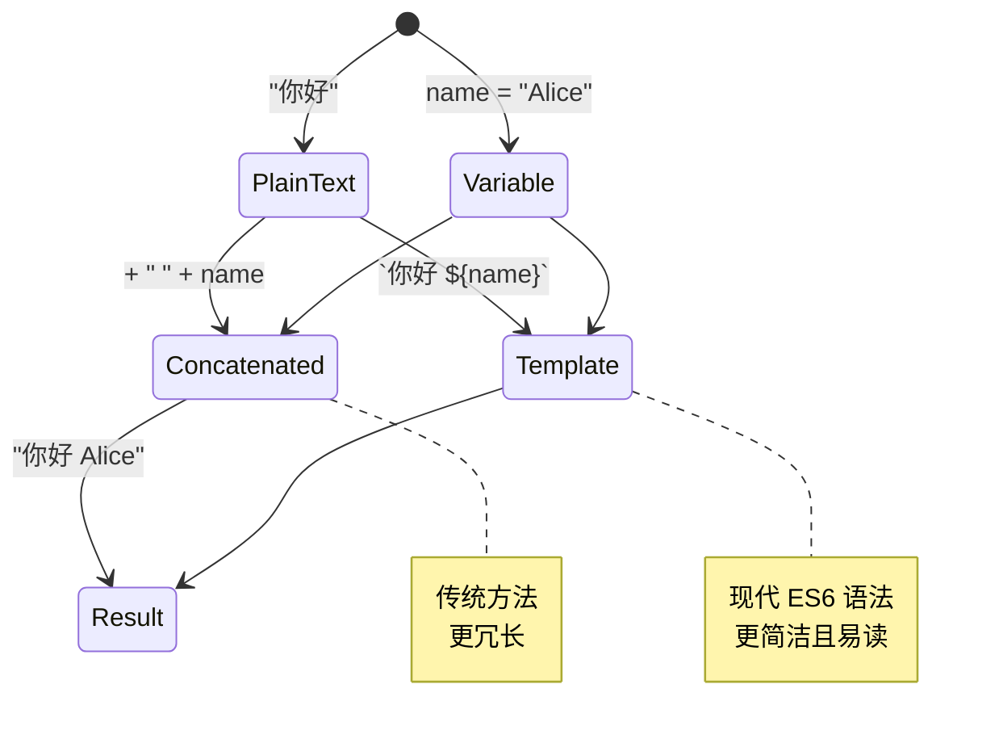
> **专家提示**：模板字符串通常更适合复杂字符串构建，因为它们更易读且能优雅处理多行字符串！

### 布尔值

布尔值代表最简单的数据形式：它们只能有两个值之一——`true` 或 `false`。这种二元逻辑系统可追溯到19世纪数学家乔治·布尔（George Boole）开发的布尔代数。

尽管简单，布尔值对程序逻辑至关重要。它们让代码能基于条件做出决策——比如用户是否已登录，是否点击了按钮，或是否满足某些条件。

布尔值只能是两个值之一：`true` 或 `false`。布尔值有助于根据特定条件决定哪些代码行应该运行。在许多情况下，[运算符](../../../../2-js-basics/1-data-types)帮助设置布尔值的值，而你也常会看到并写出变量初始化或使用运算符更新其值。

```javascript
let myTrueBool = true;
let myFalseBool = false;
```

**在上例中，我们：**
- **创建**了一个存储布尔值 `true` 的变量
- **演示**了如何存储布尔值 `false`
- **使用**了准确的关键字 `true` 和 `false`（无需引号）
- **准备**了这些变量供条件语句使用

✅ 如果变量计算结果为布尔 `true`，它可以被认为是“真值”。有趣的是，在 JavaScript 中，[除非定义为假值，否则所有值都是“真值”](https://developer.mozilla.org/docs/Glossary/Truthy)。

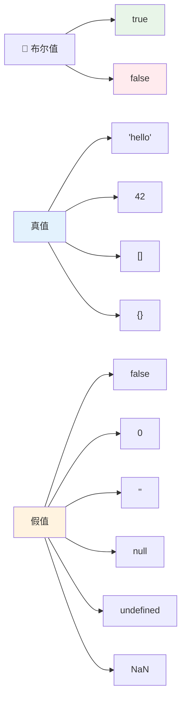
### 🎯 **布尔逻辑检测：决策能力**

**测试你的布尔理解：**
- 为什么你认为 JavaScript 中有“真值”和“假值”，而不仅仅是 `true` 和 `false`？
- 你能预测以下哪些是假值吗：`0`、`"0"`、`[]`、`"false"`？
- 布尔值如何在控制程序流程中发挥作用？

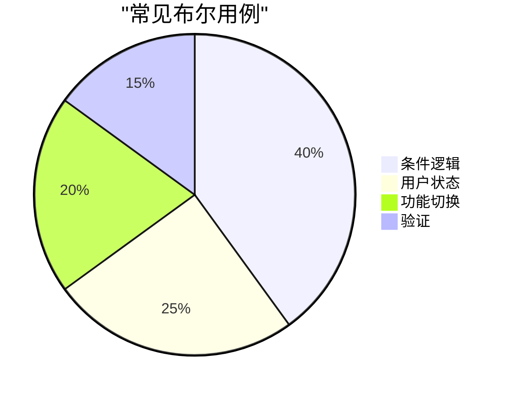
> **记住**：在 JavaScript 中，只有 6 个是假值：`false`、`0`、`""`、`null`、`undefined` 和 `NaN`。其他全部是真值！

---

## 📊 **你的数据类型工具包总结**

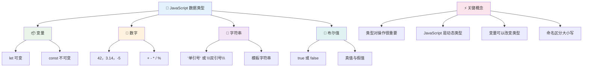
## GitHub Copilot Agent 挑战 🚀

使用 Agent 模式完成以下挑战：

**描述：** 创建一个个人信息管理程序，演示本课中学到的所有 JavaScript 数据类型，同时处理实际数据场景。

**提示：** 构建一个 JavaScript 程序，创建一个用户资料对象，包含：个人姓名（字符串）、年龄（数字）、是否为学生状态（布尔）、喜爱的颜色数组，以及含有街道、城市和邮编属性的地址对象。包括显示资料信息和更新各字段的函数。确保演示字符串连接、模板字符串、年龄的算术操作，以及学生状态的布尔逻辑。

了解更多关于[Agent 模式](https://code.visualstudio.com/blogs/2025/02/24/introducing-copilot-agent-mode)。

## 🚀 挑战

JavaScript 有一些行为可能让开发者措手不及。这里有一个经典范例：试着在浏览器控制台输入：`let age = 1; let Age = 2; age == Age`，然后观察结果。它返回 `false` —— 你能找出原因吗？

这代表了许多值得理解的 JavaScript 行为熟悉这些怪癖将帮助你写出更可靠的代码，更高效地调试问题。

## 课后测验
[课后测验](https://ff-quizzes.netlify.app)

## 复习与自学

看看[这份 JavaScript 练习列表](https://css-tricks.com/snippets/javascript/)，尝试其中一个。你学到了什么？

## 作业

[数据类型练习](assignment.md)

## 🚀 你的 JavaScript 数据类型掌握时间表

### ⚡ **接下来 5 分钟你可以做什么**
- [ ] 打开浏览器控制台，创建 3 个不同数据类型的变量
- [ ] 尝试挑战题：`let age = 1; let Age = 2; age == Age`，并找出为什么结果是 false
- [ ] 练习用名字和喜欢的数字进行字符串连接
- [ ] 测试将数字加到字符串上会发生什么

### 🎯 **这小时你可以完成什么**
- [ ] 完成课后测验并复习任何有疑惑的概念
- [ ] 创建一个简单计算器，实现加减乘除两数运算
- [ ] 使用模板字符串构建简单的姓名格式化器
- [ ] 探索 `==` 与 `===` 比较运算符的区别
- [ ] 练习不同数据类型之间的转换

### 📅 **你的一周 JavaScript 基础**
- [ ] 自信且富有创造力地完成作业
- [ ] 创建一个包含所有学过数据类型的个人资料对象
- [ ] 练习使用[来自 CSS-Tricks 的 JavaScript 练习](https://css-tricks.com/snippets/javascript/)
- [ ] 构建一个使用布尔逻辑的简单表单验证器
- [ ] 试验数组和对象数据类型（预览后续课程）
- [ ] 加入 JavaScript 社区，提出关于数据类型的问题

### 🌟 **你一个月的转变**
- [ ] 将数据类型知识融入更大型的编程项目
- [ ] 理解何时以及为何在实际应用中使用每种数据类型
- [ ] 帮助其他初学者理解 JavaScript 基础
- [ ] 构建一个管理不同类型用户数据的小应用
- [ ] 探索高级数据类型概念，如类型强制转换和严格相等
- [ ] 参与开源 JavaScript 项目的文档改进

### 🧠 **最终数据类型掌握检测**

**庆祝你的 JavaScript 基础：**
- 哪种数据类型的行为让你最感惊讶？
- 你讲解变量与常量的区别给朋友时感觉如何？
- 关于 JavaScript 的类型系统你发现的最有趣的事情是什么？
- 你能想象用这些基础构建什么实际应用？

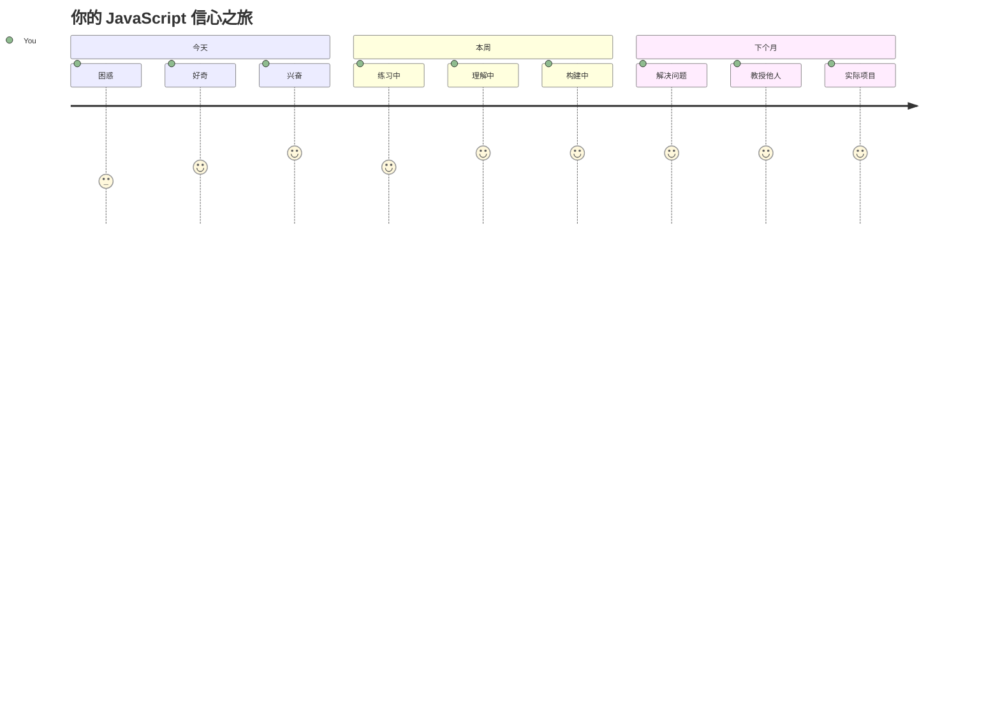
> 💡 **你已经打好了基础！** 了解数据类型就像学字母表为写故事做准备。你写的每个 JavaScript 程序都会用到这些基本概念。你现在拥有构建交互式网站、动态应用以及用代码解决实际问题的基石。欢迎来到奇妙的 JavaScript 世界！ 🎉

---

<!-- CO-OP TRANSLATOR DISCLAIMER START -->
**免责声明**：
本文件使用人工智能翻译服务 [Co-op Translator](https://github.com/Azure/co-op-translator) 进行翻译。虽然我们力求准确，但请注意自动翻译可能存在错误或不准确之处。应以原始语言的原版文件为权威来源。对于关键信息，建议寻求专业人工翻译。因使用本翻译而产生的任何误解或误译，我们概不负责。
<!-- CO-OP TRANSLATOR DISCLAIMER END -->