<!--
CO_OP_TRANSLATOR_METADATA:
{
  "original_hash": "71f7d7dafa1c7194d79ddac87f669ff9",
  "translation_date": "2026-01-06T11:10:57+00:00",
  "source_file": "2-js-basics/2-functions-methods/README.md",
  "language_code": "zh"
}
-->
# JavaScript 基础：方法与函数


> 速记图由 [Tomomi Imura](https://twitter.com/girlie_mac) 制作

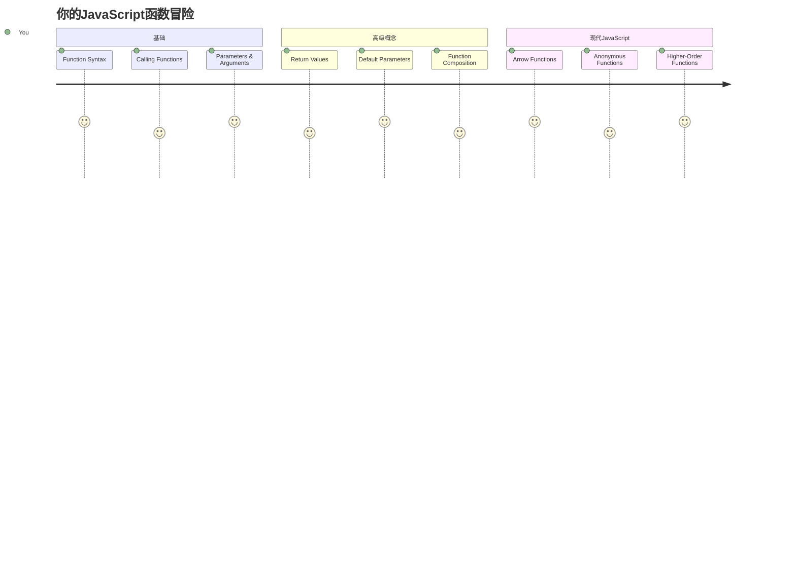
## 课前测验
[课前测验](https://ff-quizzes.netlify.app)

重复写同样的代码是编程中最常见的挫败感之一。函数解决了这个问题，它让你把代码打包成可重复使用的块。把函数想象成使亨利·福特的装配线革命化的标准化零件——一旦你创建了一个可靠的组件，就可以在任何需要的地方使用它，而不必重新构建。

函数允许你把一段代码打包，这样你就能在整个程序中重复使用它们。你不用到处复制粘贴相同的逻辑，而是创建一个函数，然后在需要时调用它。这种方法让你的代码更有条理，也更容易维护。

在本课中，你将学习如何创建自己的函数、如何传递信息给它们以及如何从中获取有用的结果。你会发现函数和方法的区别，学习现代的语法写法，并看到函数是如何与其他函数协作的。我们将一步步构建这些概念。

[](https://youtube.com/watch?v=XgKsD6Zwvlc "方法与函数")

> 🎥 点击上方图片查看关于方法与函数的视频。

> 你也可以在 [Microsoft Learn](https://docs.microsoft.com/learn/modules/web-development-101-functions/?WT.mc_id=academic-77807-sagibbon) 上学习本课内容！

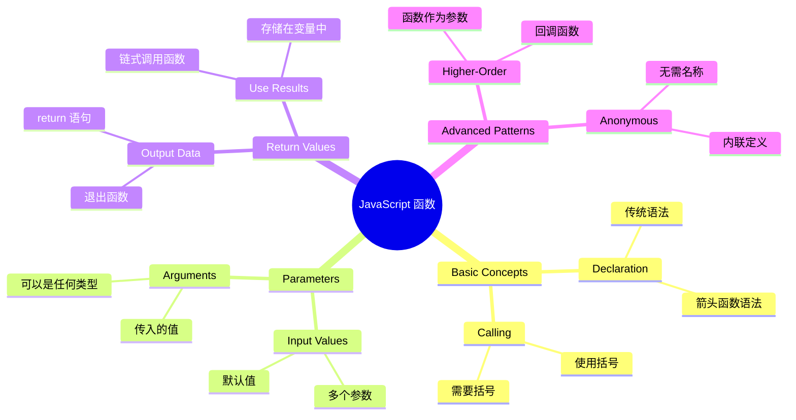
## 函数

函数是一个自包含的代码块，用来执行特定任务。它封装了你可以在需要时执行的逻辑。

你不用在程序中多次写相同代码，而是把它打包成函数，按需调用。这样你的代码更整洁，也更易更新。想想看，如果你必须修改散落在代码库中二十个不同位置的逻辑，那维护工作会多么复杂。

给函数起一个描述性名字非常重要。一个名字明确的函数可以清晰表达它的目的——当你看到 `cancelTimer()` 时，你立即知道它是做什么的，就像一个标签清晰的按钮告诉你点击后会发生什么一样。

## 创建和调用函数

让我们看看如何创建函数。语法遵循固定模式：

```javascript
function nameOfFunction() { // 函数定义
 // 函数定义/函数体
}
```

我们来拆解一下：
- `function` 关键字告诉 JavaScript “嘿，我正在创建一个函数！”
- `nameOfFunction` 是你给函数起的描述性名字
- 括号 `()` 是你可以添加参数的位置（我们稍后会讲）
- 花括号 `{}` 包含当你调用函数时执行的实际代码

让我们创建一个简单的问候函数，看看效果：

```javascript
function displayGreeting() {
  console.log('Hello, world!');
}
```

这个函数会在控制台打印 "Hello, world!"。定义之后，你可以根据需要多次使用它。

要执行（或“调用”）函数，写函数名后接括号。JavaScript 允许你先调用函数后定义，JavaScript 引擎会处理执行顺序。

```javascript
// 调用我们的函数
displayGreeting();
```

运行这行代码时，它会执行 `displayGreeting` 函数里的所有代码，在浏览器控制台显示 "Hello, world!"。你可以反复调用这个函数。

### 🧠 **函数基础检测：构建你的第一个函数**

**来测试你对基本函数的理解：**
- 为什么函数定义中要用花括号 `{}`？
- 如果只写 `displayGreeting` 而不加括号，会发生什么？
- 为什么你可能想多次调用同一个函数？

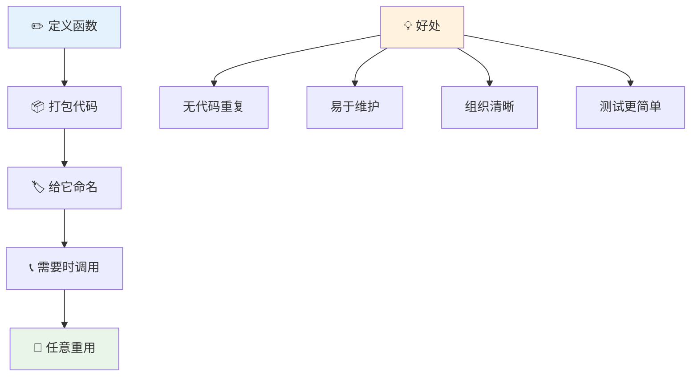
> **注意：** 在本课程中，你一直在使用**方法**。`console.log()` 是一个方法——本质上是属于 `console` 对象的函数。关键区别是方法附属于对象，而函数是独立存在的。很多开发者在日常对话中会混用这两个词。

### 函数最佳实践

这里有几个帮助你写出优秀函数的小贴士：

- 给函数起清晰、描述明确的名字——未来的你会感谢自己！
- 多单词名称使用**驼峰式命名**（比如用 `calculateTotal`，而不是 `calculate_total`）
- 每个函数专注做好一件事

## 给函数传递信息

我们的 `displayGreeting` 函数很有限——它只能显示 “Hello, world!”。参数让函数更灵活更有用。

**参数** 就像占位符，每次调用函数时可以传入不同的值。这样同一个函数每次调用可以使用不同的信息。

定义函数时，你在括号里列出参数，多个参数用逗号分隔：

```javascript
function name(param, param2, param3) {

}
```

每个参数像个占位符——调用函数时，调用者会提供实际值，填入这些位置。

让我们把问候函数改造一下，能接收一个人的名字：

```javascript
function displayGreeting(name) {
  const message = `Hello, ${name}!`;
  console.log(message);
}
```

你会注意到我们使用了反引号 (`` ` ``) 和 `${}` 来直接把名字插入消息中——这叫模板字符串，是构建带变量字符串的很方便方式。

现在调用时，我们可以传入任意名字：

```javascript
displayGreeting('Christopher');
// 运行时显示 “你好，Christopher！”
```

JavaScript 将字符串 `'Christopher'` 赋值给参数 `name`，生成个性化消息 "Hello, Christopher!"

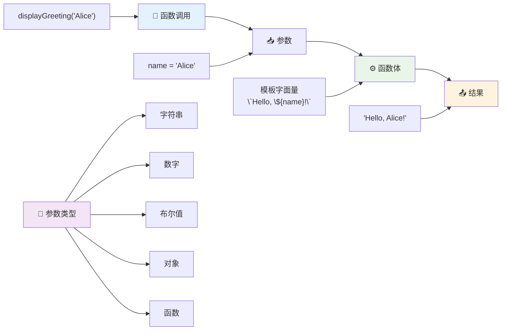
## 默认值

如果我们想让某些参数可选怎么办？这时默认值很有用！

假设我们希望用户能自定义问候语，但如果没指定，就默认用 "Hello"。你可以用等号设置默认值，就像变量赋值一样：

```javascript
function displayGreeting(name, salutation='Hello') {
  console.log(`${salutation}, ${name}`);
}
```

这里，`name` 仍是必需的，`salutation` 则有默认的 `'Hello'`，如果调用者不传就用默认值。

这样我们可以用两种方式调用函数：

```javascript
displayGreeting('Christopher');
// 显示 "Hello, Christopher"

displayGreeting('Christopher', 'Hi');
// 显示 "Hi, Christopher"
```

第一次调用没传问候语，JavaScript 用默认的 "Hello"。第二次调用传了 "Hi"，它就用这个自定义值。这种灵活性让函数能适应不同场景。

### 🎛️ **参数掌握检测：让函数更灵活**

**考考你对参数的理解：**
- 参数和实参有什么区别？
- 为什么默认值在实际编程中有用？
- 如果传入的实参比参数多，会发生什么？

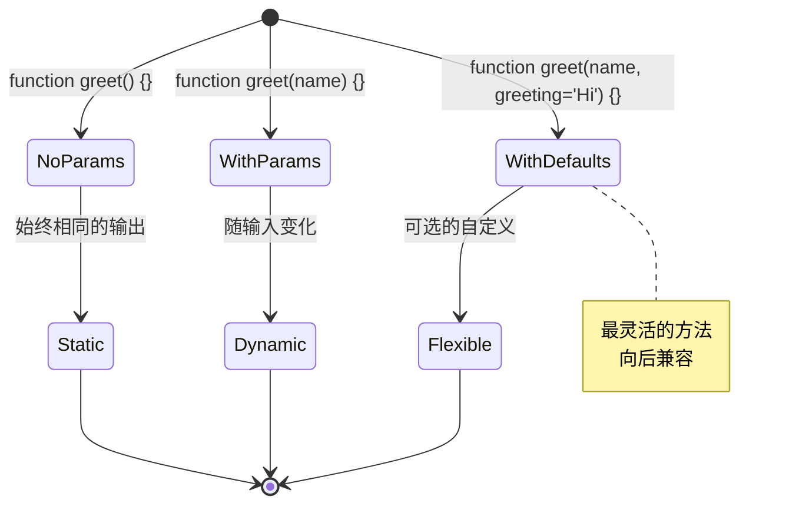
> **专业提示**：默认参数让函数对用户更友好，用户可以快速开始，用合适的默认值，但也能按需自定义！

## 返回值

到目前为止我们的函数只是打印消息，但万一你想让函数计算并返回结果呢？

这就用到**返回值**。函数不仅可以显示内容，还能返回值，你可以把返回值存到变量里，或者用于代码的其他部分。

使用 `return` 关键字，后面跟你想返回的值：

```javascript
return myVariable;
```

这里需要注意的是：函数遇到 `return` 语句，会立即停止执行，并把那个值返回给调用它的人。

来修改一下问候函数，不打印只返回消息：

```javascript
function createGreetingMessage(name) {
  const message = `Hello, ${name}`;
  return message;
}
```

这个函数不打印消息，而是构造消息并返回给调用方。

要用返回值，我们可以像处理其他值一样，把它存到变量里：

```javascript
const greetingMessage = createGreetingMessage('Christopher');
```

现在 `greetingMessage` 变量里保存了 "Hello, Christopher"，我们可以在代码里任何地方使用——网页中显示，发送邮件，或者传给其他函数。

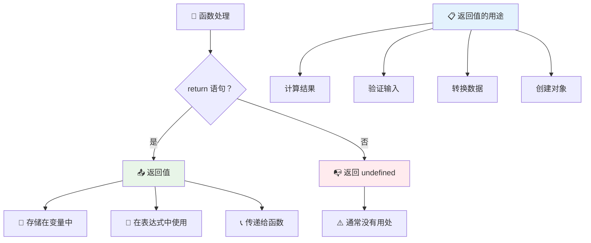
### 🔄 **返回值检测：拿回结果**

**评估你对返回值的理解：**
- 函数里 `return` 后的代码会怎样？
- 为什么返回值通常比只打印更好？
- 函数能返回不同类型的值（字符串、数字、布尔）吗？

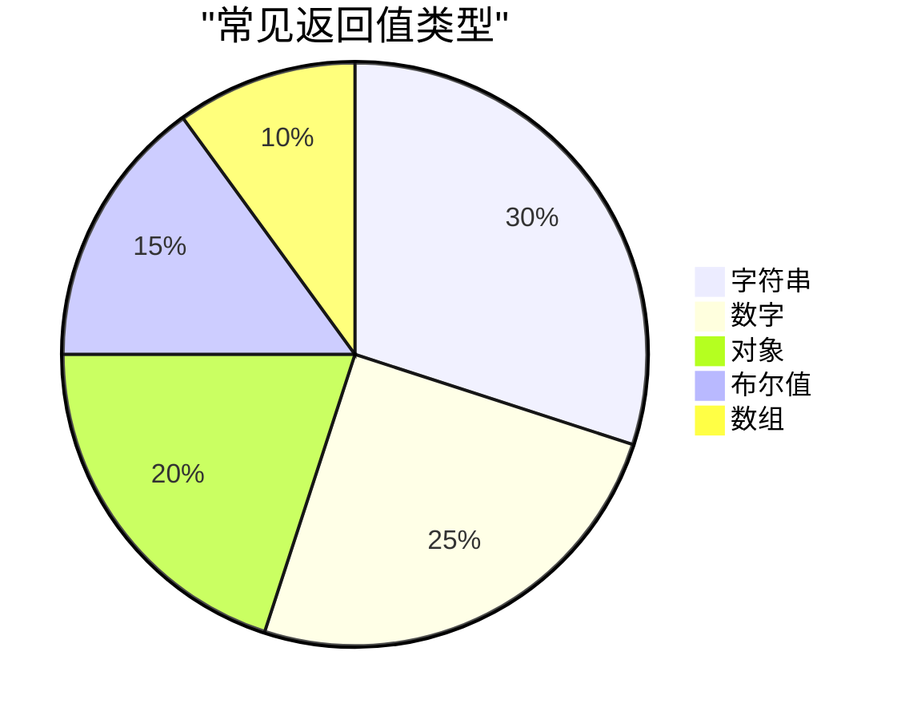
> **关键洞察**：返回值的函数更灵活，调用方决定如何处理结果。这让代码更模块化，更易复用！

## 作为参数的函数

函数可以作为参数传递给其他函数。刚开始这可能有点复杂，但这是个强大特性，能实现灵活的编程模式。

这种模式很常见，比如你想说“当某事发生时，执行另一段代码”。比如，“计时结束时执行这段代码”，“用户点击按钮时调用这个函数”。

来看 `setTimeout`，这是一个内置函数，会等待一段时间再运行代码。你得告诉它跑什么代码——传函数给它就是完美用法！

试试这段代码，3秒后你会看到消息：

```javascript
function displayDone() {
  console.log('3 seconds has elapsed');
}
// 定时器值以毫秒为单位
setTimeout(displayDone, 3000);
```

注意我们把 `displayDone`（没有括号）传给 `setTimeout`。我们不是自己调用它，而是把函数交给 `setTimeout`，让它3秒后调用。

### 匿名函数

有时候你只用一次函数，不想给它起名字。想想看——只用一次，为何要额外起一个名字占用代码空间？

JavaScript 支持**匿名函数**——没有名字的函数，你可以直接在需要的地方定义它们。

改写上面计时例子，使用匿名函数：

```javascript
setTimeout(function() {
  console.log('3 seconds has elapsed');
}, 3000);
```

效果一样，但函数定义直接写在 `setTimeout` 调用里，不需分开声明函数。

### 箭头函数

现代 JavaScript 有更简短的函数写法，叫**箭头函数**。它用 `=>`（看起来像箭头——你懂的）表示，开发者极其喜欢用。

箭头函数省略了 `function` 关键字，写起代码更简洁。

这就是用箭头函数写的计时例子：

```javascript
setTimeout(() => {
  console.log('3 seconds has elapsed');
}, 3000);
```

`()` 里放参数（这里空着），接箭头 `=>`，最后是花括号里的函数体。功能一样，语法更紧凑。

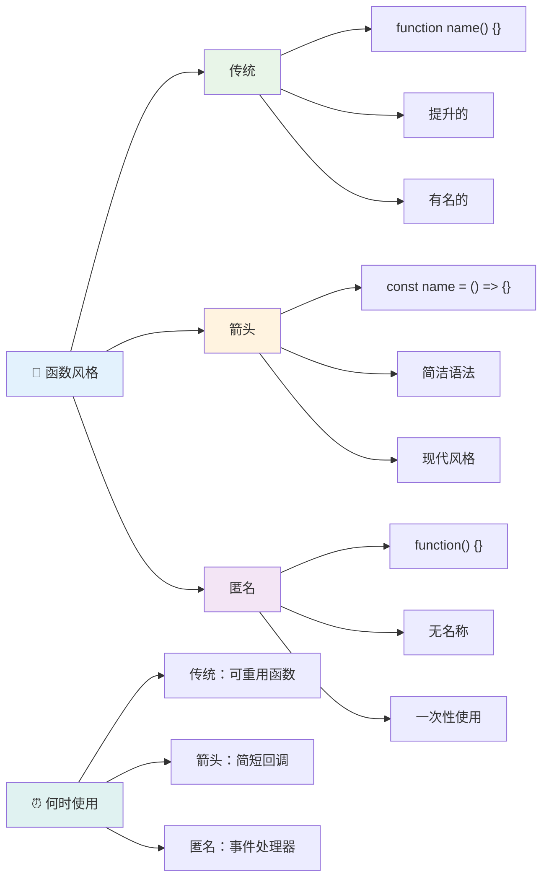
### 何时使用哪种写法

什么时候用哪种？一个实用指南是：如果你要多次调用一个函数，给它起名并单独定义；若只用一次，可以考虑匿名函数。箭头函数和传统语法都有效，但箭头函数是现代代码的主流。

### 🎨 **函数风格掌握检测：选择合适的语法**

**考考你对语法的理解：**
- 什么时候你更喜欢用箭头函数？
- 匿名函数的最大优势是什么？
- 你能想到啥场景中有名函数优于匿名函数？

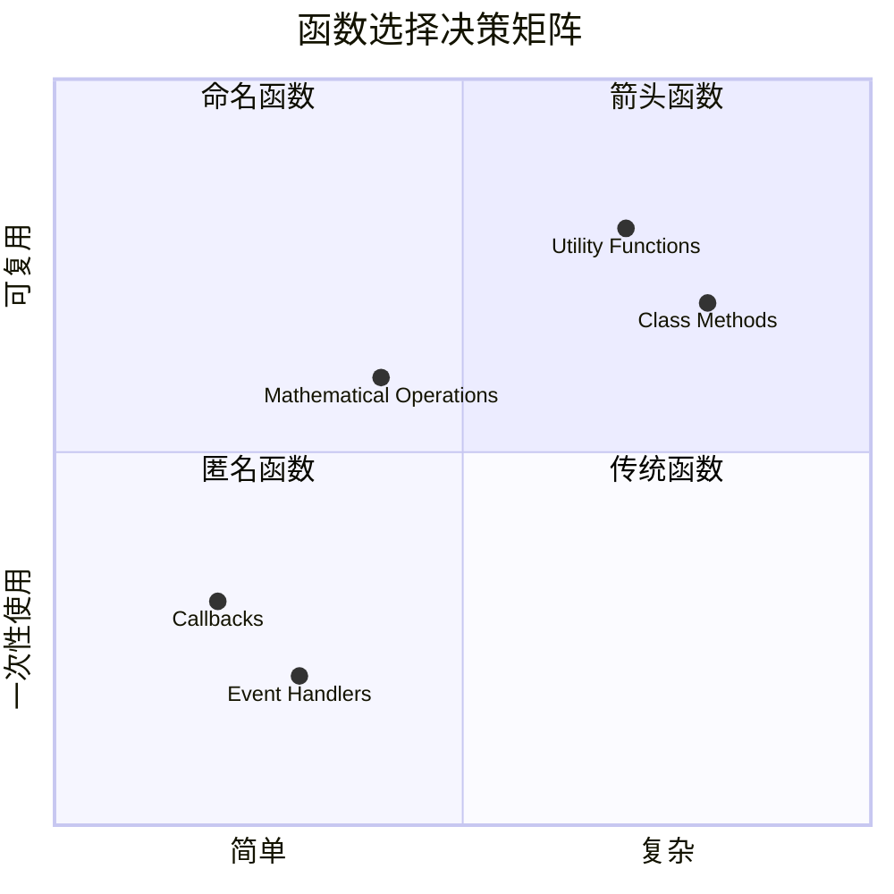
> **现代趋势**：箭头函数因为简洁，成为许多开发者的默认选择，但传统函数依然有用武之地！

---


## 🚀 挑战

你能用一句话说清函数和方法的区别吗？试试看！

## GitHub Copilot Agent 挑战 🚀

用 Agent 模式完成以下挑战：

**描述：** 创建一个数学函数工具库，演示本课中涉及的函数概念，包括参数、默认值、返回值和箭头函数。

**提示：** 创建一个叫 `mathUtils.js` 的 JavaScript 文件，包含以下函数：
1. 一个 `add` 函数，接受两个参数，返回它们的和
2. 一个带默认参数值的 `multiply` 函数（第二个参数默认是1）
3. 一个箭头函数 `square`，接受一个数字返回它的平方
4. 一个 `calculate` 函数，接受另一个函数和两个数字作为参数，然后对这两个数字应用该函数
5. 展示对每个函数的调用示例和测试用例

了解更多关于 [agent模式](https://code.visualstudio.com/blogs/2025/02/24/introducing-copilot-agent-mode) 。

## 课后测验
[课后测验](https://ff-quizzes.netlify.app)

## 复习与自学

值得[多读一些箭头函数](https://developer.mozilla.org/docs/Web/JavaScript/Reference/Functions/Arrow_functions)的内容，因为它们在代码库中用得越来越多。练习写函数，然后用这种语法改写。

## 作业

[Fun with Functions](assignment.md)

---

## 🧰 **你的 JavaScript 函数工具包总结**

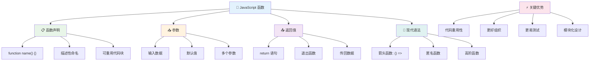
---

## 🚀 你的 JavaScript 函数掌握时间线

### ⚡ **接下来 5 分钟你可以做的事**
- [ ] 写一个简单函数，返回你最喜欢的数字
- [ ] 创建一个有两个参数的函数，把它们相加
- [ ] 尝试将传统函数转换为箭头函数语法
- [ ] 练习挑战：解释函数和方法之间的区别

### 🎯 **你这小时可以完成的目标**
- [ ] 完成课后测验并复习任何令人困惑的概念
- [ ] 构建 GitHub Copilot 挑战中的数学工具库
- [ ] 创建一个使用另一个函数作为参数的函数
- [ ] 练习编写带有默认参数的函数
- [ ] 试验在函数返回值中使用模板字符串

### 📅 **你的一周函数精通计划**
- [ ] 富有创造性地完成“函数的乐趣”作业
- [ ] 将你编写的一些重复代码重构为可重用函数
- [ ] 仅使用函数构建一个小型计算器（无全局变量）
- [ ] 练习使用数组方法如 `map()` 和 `filter()` 的箭头函数
- [ ] 创建一组用于常见任务的实用函数集合
- [ ] 学习高阶函数和函数式编程概念

### 🌟 **你的一月转变计划**
- [ ] 掌握高级函数概念，如闭包和作用域
- [ ] 构建一个大量使用函数组合的项目
- [ ] 通过改进函数文档为开源项目做贡献
- [ ] 教别人函数及不同语法风格的知识
- [ ] 探索 JavaScript 中的函数式编程范式
- [ ] 创建一个个人可重用函数库以备将来项目使用

### 🏆 **终极函数大师签到**

**庆祝你的函数掌握成就：**
- 到目前为止，你写过的最有用的函数是什么？
- 学习函数如何改变了你对代码组织的思考？
- 你喜欢哪种函数语法，为什么？
- 你会通过写函数解决什么现实世界的问题？

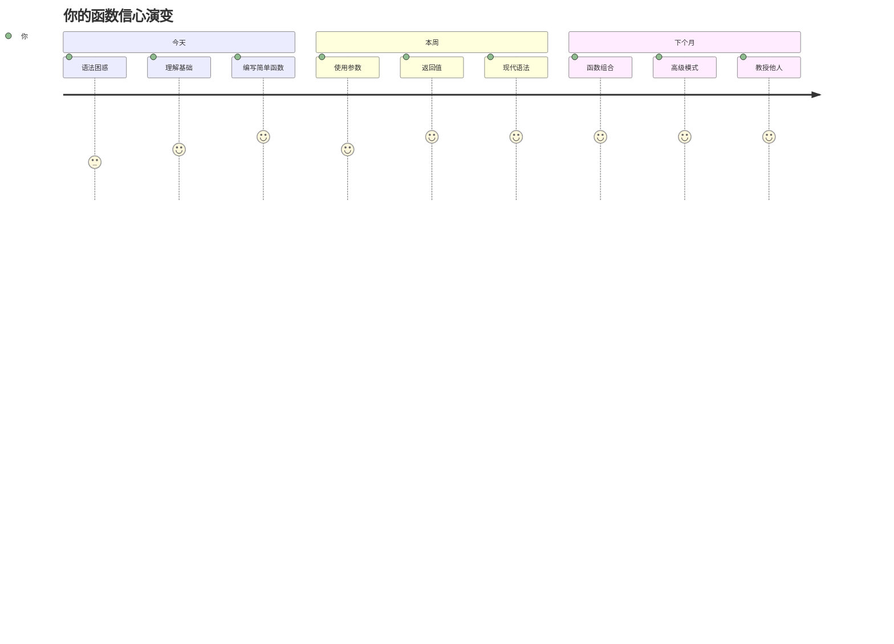
> 🎉 **你已掌握编程中最强大的概念之一！** 函数是更大程序的构建模块。你将创建的每个应用程序都会使用函数来组织、重用和结构化代码。你现在理解了如何将逻辑打包成可重用的组件，这使你成为一个更高效、更有效的程序员。欢迎来到模块化编程的世界！🚀

---

<!-- CO-OP TRANSLATOR DISCLAIMER START -->
**免责声明**：
本文件由人工智能翻译服务[Co-op Translator](https://github.com/Azure/co-op-translator)翻译完成。虽然我们力求准确，但请注意自动翻译可能包含错误或不准确之处。应以原始语言的文档为权威来源。对于重要信息，建议采用专业人工翻译。我们对因使用本翻译而产生的任何误解或误释不承担任何责任。
<!-- CO-OP TRANSLATOR DISCLAIMER END -->