<!--
CO_OP_TRANSLATOR_METADATA:
{
  "original_hash": "1710a50a519a6e4a1b40a5638783018d",
  "translation_date": "2026-01-06T11:17:26+00:00",
  "source_file": "2-js-basics/4-arrays-loops/README.md",
  "language_code": "zh"
}
-->
# JavaScript 基础知识：数组和循环


> 速写笔记，作者：[Tomomi Imura](https://twitter.com/girlie_mac)

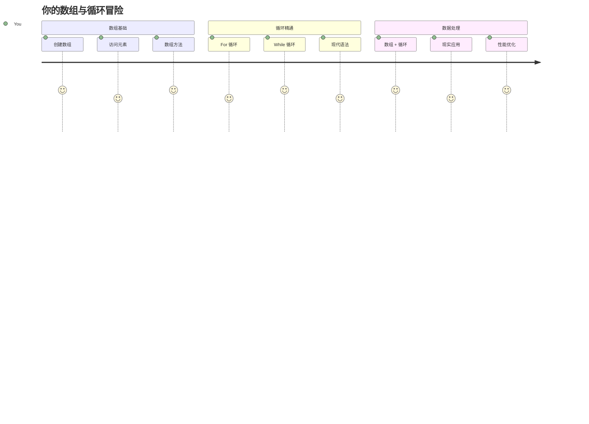
## 课前测验
[课前测验](https://ff-quizzes.netlify.app/web/quiz/13)

有没有想过网站是如何跟踪购物车商品或者显示你的好友列表的？这就涉及到了数组和循环。数组就像是存放多条信息的数字容器，而循环则让你能高效地处理所有数据，而不需要重复写代码。

这两个概念共同构成了处理程序中信息的基础。你将学会如何从手动编写每一步，转变为创建智能、高效的代码，可以快速处理数百甚至数千个条目。

到本课结束时，你将懂得如何用几行代码完成复杂的数据任务。让我们一起探索这些基本的编程概念。

[](https://youtube.com/watch?v=1U4qTyq02Xw "Arrays")

[](https://www.youtube.com/watch?v=Eeh7pxtTZ3k "Loops")

> 🎥 点击上方图片，观看关于数组和循环的视频。

> 你也可以在 [Microsoft Learn](https://docs.microsoft.com/learn/modules/web-development-101-arrays/?WT.mc_id=academic-77807-sagibbon) 上学习这节课！

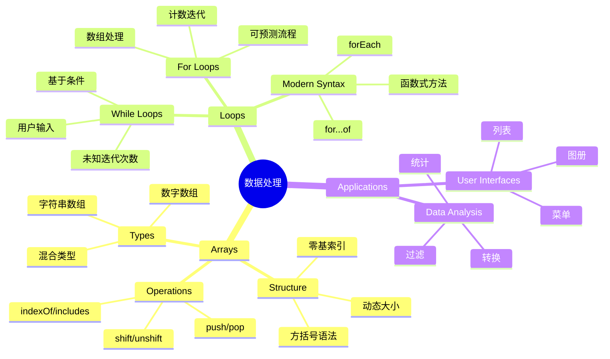
## 数组

把数组想象为数字化的文件柜——不是每个抽屉只存放一份文档，而是可以把多个相关项目组织到一个结构化的容器中。用编程术语来说，数组让你可以把多条信息存储在一个有序的包裹里。

无论你是在构建图片库、管理待办事项，还是统计游戏中的最高分，数组都为数据组织提供了基础。让我们来看它们是如何工作的。

✅ 数组无处不在！你能想到一个现实生活中的数组例子吗，比如太阳能电池板阵列？

### 创建数组

创建数组非常简单——只需用方括号！

```javascript
// 空数组——就像一个等待添加商品的空购物车
const myArray = [];
```

**这里发生了什么？**
你用这对方括号 `[]` 创建了一个空容器。把它想象成一个空的书架，它已经准备好放你想存放的任何书籍了。

你还可以一开始就给数组填入初始值：

```javascript
// 你的冰淇淋店口味菜单
const iceCreamFlavors = ["Chocolate", "Strawberry", "Vanilla", "Pistachio", "Rocky Road"];

// 用户的个人资料信息（混合不同类型的数据）
const userData = ["John", 25, true, "developer"];

// 你最喜欢的课程的考试成绩
const scores = [95, 87, 92, 78, 85];
```

**有趣的点：**
- 数组里可以同时存储文本、数字甚至布尔值（true/false）
- 每个元素用逗号分隔——非常简单！
- 数组非常适合将相关信息存放在一起

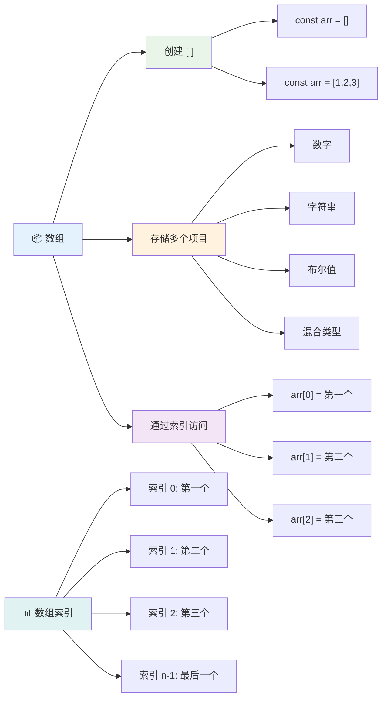
### 数组索引

这里有个可能最初让你觉得不寻常的地方：数组的编号是从 0 开始的，而不是从 1 开始。这个以零为基础的索引源于计算机内存的工作方式——这是自 C 语言等早期编程语言以来的惯例。数组中的每个位置都有一个被称为**索引**的地址号。

| 索引 | 值 | 说明 |
|-------|-------|-------------|
| 0 | "Chocolate" | 第一个元素 |
| 1 | "Strawberry" | 第二个元素 |
| 2 | "Vanilla" | 第三个元素 |
| 3 | "Pistachio" | 第四个元素 |
| 4 | "Rocky Road" | 第五个元素 |

✅ 你是否对数组从零开始编号感到惊讶？在某些编程语言中，索引是从 1 开始的。这里有一段有趣的历史，你可以在 [Wikipedia 上阅读](https://en.wikipedia.org/wiki/Zero-based_numbering)。

**访问数组元素：**

```javascript
const iceCreamFlavors = ["Chocolate", "Strawberry", "Vanilla", "Pistachio", "Rocky Road"];

// 使用括号表示法访问单个元素
console.log(iceCreamFlavors[0]); // "Chocolate" - 第一个元素
console.log(iceCreamFlavors[2]); // "Vanilla" - 第三个元素
console.log(iceCreamFlavors[4]); // "Rocky Road" - 最后一个元素
```

**解析这段代码：**
- **使用** 方括号加索引数字来访问元素
- **返回** 数组中对应位置存储的值
- **索引** 从 0 开始计数，首个元素索引为 0

**修改数组元素：**

```javascript
// 更改现有值
iceCreamFlavors[4] = "Butter Pecan";
console.log(iceCreamFlavors[4]); // “黄油山核桃”

// 在末尾添加一个新元素
iceCreamFlavors[5] = "Cookie Dough";
console.log(iceCreamFlavors[5]); // “曲奇面团”
```

**以上操作包括：**
- **将** 索引 4 处的元素从 "Rocky Road" 修改为 "Butter Pecan"
- **在** 索引 5 添加新元素 "Cookie Dough"
- **自动** 在添加超出当前边界时扩展数组长度

### 数组长度和常用方法

数组自带了属性和方法，让处理数据变得更加轻松。

**获取数组长度：**

```javascript
const iceCreamFlavors = ["Chocolate", "Strawberry", "Vanilla", "Pistachio", "Rocky Road"];
console.log(iceCreamFlavors.length); // 5

// 随着数组变化长度自动更新
iceCreamFlavors.push("Mint Chip");
console.log(iceCreamFlavors.length); // 6
```

**要点：**
- **返回** 数组中元素的总数
- **自动更新**，元素增加或删除时动态改变
- **提供** 动态计数，适用于循环和验证

**常用数组方法：**

```javascript
const fruits = ["apple", "banana", "orange"];

// 添加元素
fruits.push("grape");           // 添加到末尾: ["apple", "banana", "orange", "grape"]
fruits.unshift("strawberry");   // 添加到开头: ["strawberry", "apple", "banana", "orange", "grape"]

// 删除元素
const lastFruit = fruits.pop();        // 删除并返回 "grape"
const firstFruit = fruits.shift();     // 删除并返回 "strawberry"

// 查找元素
const index = fruits.indexOf("banana"); // 返回 1 ("banana"的位置)
const hasApple = fruits.includes("apple"); // 返回 true
```

**关于这些方法：**
- 通过 `push()`（尾部）和 `unshift()`（开头）添加元素
- 通过 `pop()`（尾部）和 `shift()`（开头）删除元素
- 通过 `indexOf()` 查找元素位置，`includes()` 检查是否包含
- 返回有用的值，比如删除的元素或元素索引

✅ 试试吧！在浏览器控制台创建并操作一个你自己的数组。

### 🧠 **数组基础检测：组织你的数据**

**测试你的数组理解：**
- 你为什么认为数组是从 0 开始计数而不是从 1？
- 如果你尝试访问不存在的索引（比如一个有 5 个元素的数组里访问 `arr[100]`）会怎样？
- 你能想到三个现实场景里数组非常有用的地方吗？

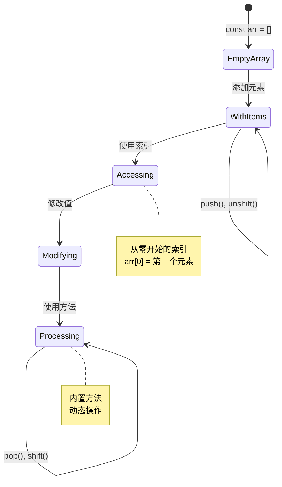
> **现实世界见解**：在编程中数组无处不在！社交媒体信息流、购物车、图片库、播放列表歌曲——背后都是数组！

## 循环

想象一下狄更斯小说里的惩罚，一个学生要反复在黑板上写同一句话。假如你能简单告诉别人“写这句话 100 遍”，并让它自动完成，那就是循环在代码中的作用。

循环就像一位不知疲倦的助手，可以重复任务而不出错。不论是检查购物车中的每件物品，还是显示相册里的所有照片，循环都能高效地处理重复操作。

JavaScript 提供了多种循环类型。让我们来看看各自的用法及适用场景。

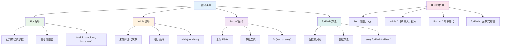
### For 循环

`for` 循环就像设置了一个计时器——你知道任务要执行多少次。它非常有序且可预测，非常适合处理数组或需要计数的场合。

**For 循环结构：**

| 组成部分 | 作用 | 示例 |
|-----------|---------|----------|
| **初始化** | 设定起点 | `let i = 0` |
| **条件** | 继续执行的条件 | `i < 10` |
| **增量** | 如何更新 | `i++` |

```javascript
// 从0数到9
for (let i = 0; i < 10; i++) {
  console.log(`Count: ${i}`);
}

// 更实际的例子：处理分数
const testScores = [85, 92, 78, 96, 88];
for (let i = 0; i < testScores.length; i++) {
  console.log(`Student ${i + 1}: ${testScores[i]}%`);
}
```

**逐步理解这个过程：**
- **初始化** 计数器变量 `i` 为 0
- **判断** 条件 `i < 10`，为真时进入循环体
- **执行** 代码块
- **执行** 循环体后，`i++` 使 `i` 增加 1
- **循环结束** 当条件为假（即 `i` 达到 10）

✅ 在浏览器控制台运行此代码。改变计数器、条件或递增表达式，会发生什么？你能让它倒计时吗？

### 🗓️ **For 循环掌握检测：控制重复**

**评估你的 for 循环理解：**
- for 循环的三个部分是什么，它们分别做什么？
- 怎么让 for 循环倒着遍历数组？
- 如果忘记写增量部分（`i++`）会怎样？

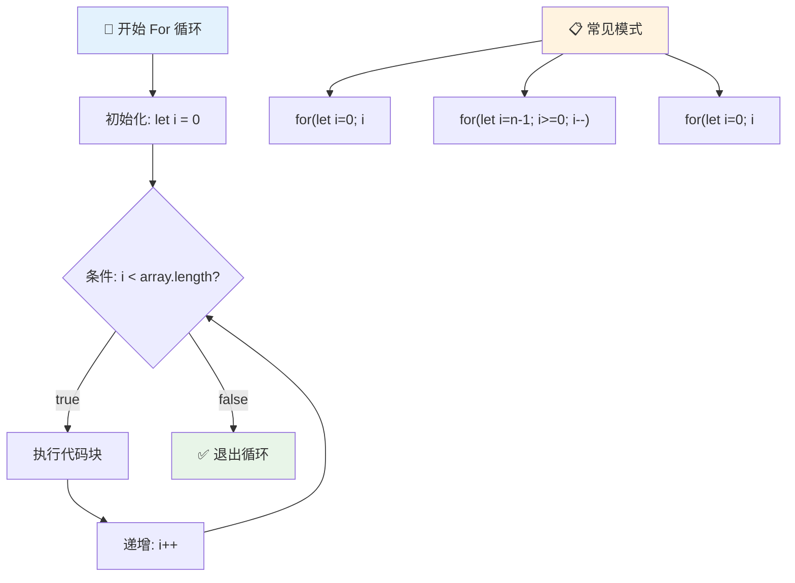
> **循环智慧**：for 循环适合你已经知道要重复多少次的情况。它们是处理数组的最常用选择！

### While 循环

`while` 循环相当于“持续做这件事直到……”，你不一定知道会执行多少次，但知道什么时候停止。它非常适合用户输入验证，或者在找到想要的数据前不断搜索。

**While 循环特征：**
- **在条件为真时** 持续执行
- **需要** 手动管理计数变量
- **在每次执行前** 判断条件
- **风险** 条件永远为真则发生死循环

```javascript
// 基本计数示例
let i = 0;
while (i < 10) {
  console.log(`While count: ${i}`);
  i++; // 别忘了递增！
}

// 更实用的示例：处理用户输入
let userInput = "";
let attempts = 0;
const maxAttempts = 3;

while (userInput !== "quit" && attempts < maxAttempts) {
  userInput = prompt(`Enter 'quit' to exit (attempt ${attempts + 1}):`);
  attempts++;
}

if (attempts >= maxAttempts) {
  console.log("Maximum attempts reached!");
}
```

**解析这些例子：**
- **在循环内** 手动管理计数器变量 `i`
- **防止死循环** 适当增加计数器
- **展示** 用户输入和尝试次数限制实际用例
- **包含** 安全机制防止无限循环

### ♾️ **While 循环智慧检测：基于条件的重复**

**测试你对 while 循环的理解：**
- 使用 while 循环时最大的风险是什么？
- 什么情况下你会选择用 while 循环而非 for 循环？
- 如何预防死循环？

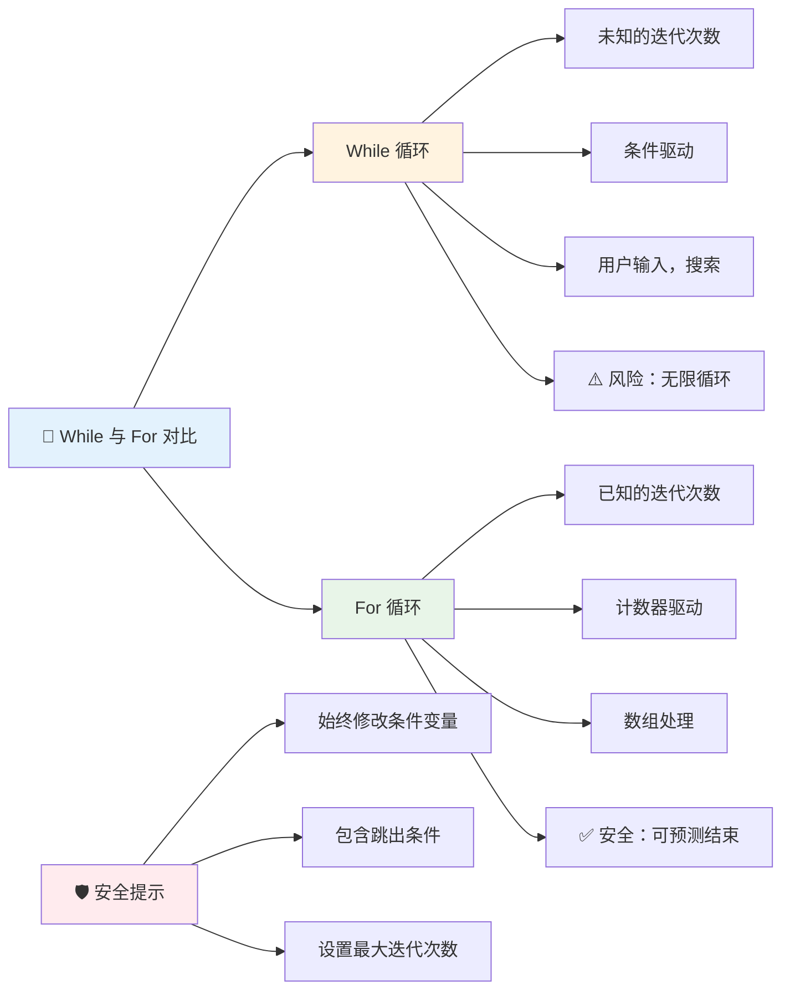
> **安全第一**：while 循环功能强大但需要谨慎管理条件。确保条件最终会变成假！

### 现代循环替代方案

JavaScript 提供了更现代的循环语法，使代码更易读且减少出错。

**For...of 循环（ES6+）：**

```javascript
const colors = ["red", "green", "blue", "yellow"];

// 现代方法 - 更简洁更安全
for (const color of colors) {
  console.log(`Color: ${color}`);
}

// 与传统for循环比较
for (let i = 0; i < colors.length; i++) {
  console.log(`Color: ${colors[i]}`);
}
```

**for...of 的优势：**
- **无需** 管理索引，避免 off-by-one 错误
- **直接** 访问数组元素
- **提升** 代码可读性并减少语法复杂度

**forEach 方法：**

```javascript
const prices = [9.99, 15.50, 22.75, 8.25];

// 使用 forEach 进行函数式编程风格
prices.forEach((price, index) => {
  console.log(`Item ${index + 1}: $${price.toFixed(2)}`);
});

// 使用箭头函数的 forEach 进行简单操作
prices.forEach(price => console.log(`Price: $${price}`));
```

**关于 forEach 你需要知道：**
- **为数组的每个元素** 执行函数
- **提供** 元素值和索引参数
- **无法** 早停（不同于传统循环）
- **返回** undefined（不生成新的数组）

✅ 你会选择 for 循环还是 while 循环？17K 人在 StackOverflow 上讨论过这个问题，[一些观点可能会引起你的兴趣](https://stackoverflow.com/questions/39969145/while-loops-vs-for-loops-in-javascript)。

### 🎨 **现代循环语法检测：拥抱 ES6+**

**评估你对现代 JavaScript 的理解：**
- `for...of` 相比传统 for 循环有哪些优势？
- 你什么时候还会偏好传统 for 循环？
- `forEach` 和 `map` 有什么区别？

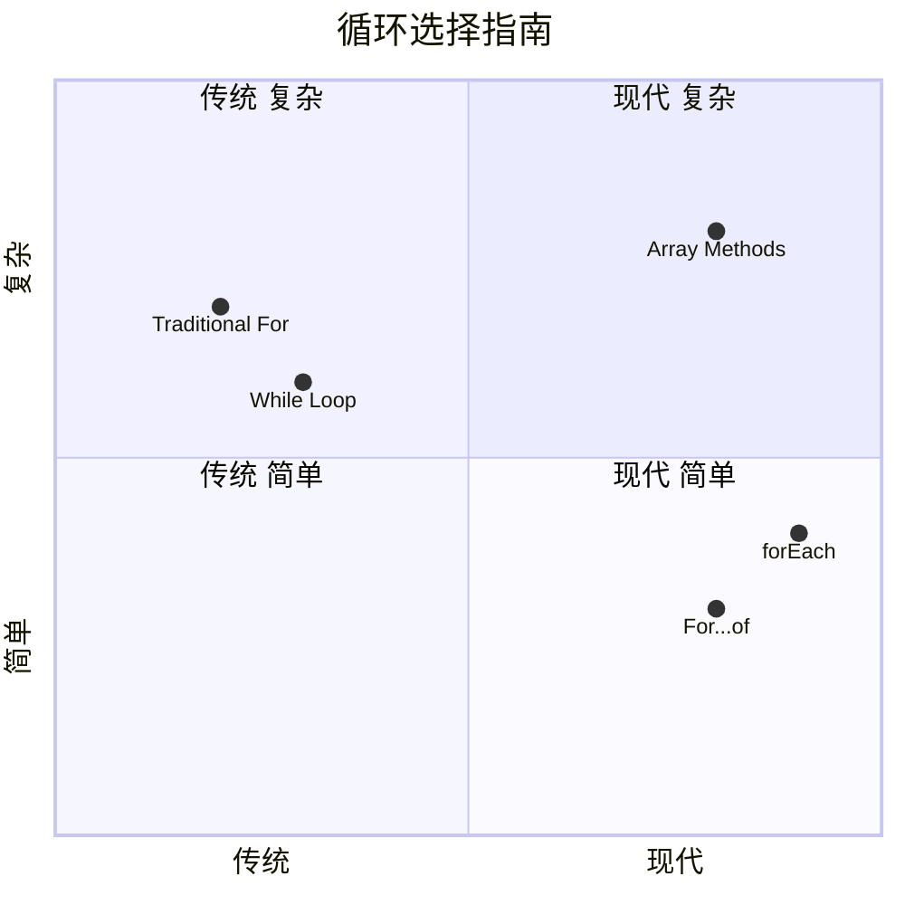
> **现代趋势**：ES6+ 语法如 `for...of` 和 `forEach` 正逐渐成为遍历数组的首选方式，因为更简洁且不易出错！

## 循环和数组

数组与循环结合能创造强大的数据处理能力。这一搭配几乎是许多编程任务的基础，从显示列表到计算统计数据。

**传统数组处理：**

```javascript
const iceCreamFlavors = ["Chocolate", "Strawberry", "Vanilla", "Pistachio", "Rocky Road"];

// 经典的for循环方法
for (let i = 0; i < iceCreamFlavors.length; i++) {
  console.log(`Flavor ${i + 1}: ${iceCreamFlavors[i]}`);
}

// 现代的for...of方法
for (const flavor of iceCreamFlavors) {
  console.log(`Available flavor: ${flavor}`);
}
```

**理解每种方式：**
- **通过** 数组长度属性确定循环边界
- **传统 for 循环** 按索引访问元素
- **for...of 循环** 直接访问元素值
- **保证** 每个数组元素被处理一次

**实用数据处理示例：**

```javascript
const studentGrades = [85, 92, 78, 96, 88, 73, 89];
let total = 0;
let highestGrade = studentGrades[0];
let lowestGrade = studentGrades[0];

// 用一个循环处理所有成绩
for (let i = 0; i < studentGrades.length; i++) {
  const grade = studentGrades[i];
  total += grade;
  
  if (grade > highestGrade) {
    highestGrade = grade;
  }
  
  if (grade < lowestGrade) {
    lowestGrade = grade;
  }
}

const average = total / studentGrades.length;
console.log(`Average: ${average.toFixed(1)}`);
console.log(`Highest: ${highestGrade}`);
console.log(`Lowest: ${lowestGrade}`);
```

**代码工作原理：**
- **初始化** 总和及极值追踪变量
- **单次循环** 高效处理每个成绩
- **累计** 总分用于计算平均数
- **追踪** 遍历过程中最高和最低分
- **统计** 循环结束后计算最终结果

✅ 在浏览器控制台试着自己创建数组并用循环操作它。

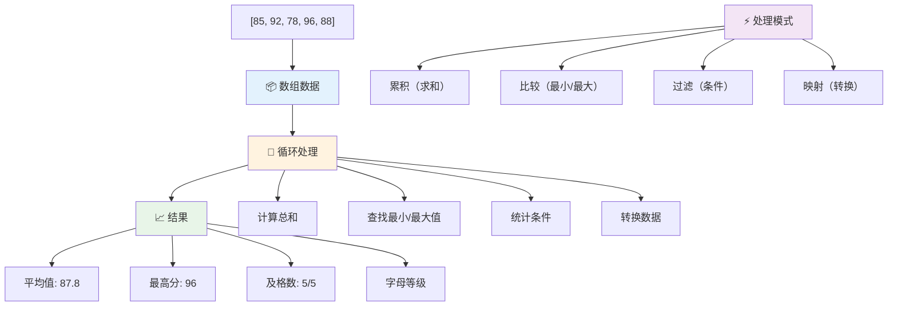
---

## GitHub Copilot 代理挑战 🚀

使用代理模式完成以下挑战：

**描述：** 构建一个综合数据处理函数，结合数组和循环对数据集进行分析并生成有意义的洞察。

**要求：** 创建一个名为 `analyzeGrades` 的函数，接受包含学生姓名和分数的成绩对象数组，返回包含最高分、最低分、平均分、及格（分数 >= 70）的学生数量，以及分数高于平均分的学生姓名数组的统计对象。解决方案中需使用至少两种不同类型的循环。

想了解更多请访问 [代理模式介绍](https://code.visualstudio.com/blogs/2025/02/24/introducing-copilot-agent-mode)。

## 🚀 挑战
JavaScript 提供了几种现代数组方法，可以替代特定任务中的传统循环。探索 [forEach](https://developer.mozilla.org/docs/Web/JavaScript/Reference/Global_Objects/Array/forEach)、[for-of](https://developer.mozilla.org/docs/Web/JavaScript/Reference/Statements/for...of)、[map](https://developer.mozilla.org/docs/Web/JavaScript/Reference/Global_Objects/Array/map)、[filter](https://developer.mozilla.org/docs/Web/JavaScript/Reference/Global_Objects/Array/filter) 和 [reduce](https://developer.mozilla.org/docs/Web/JavaScript/Reference/Global_Objects/Array/reduce)。

**你的挑战：** 使用至少三种不同的数组方法重构学生成绩示例。注意使用现代 JavaScript 语法后，代码变得多么简洁和易读。

## 课后测验
[课后测验](https://ff-quizzes.netlify.app/web/quiz/14)


## 复习与自学

JavaScript 中的数组有很多附带方法，非常适合数据操作。[阅读这些方法](https://developer.mozilla.org/docs/Web/JavaScript/Reference/Global_Objects/Array)，并在你创建的数组上尝试它们（比如 push、pop、slice 和 splice）。

## 作业

[遍历数组](assignment.md)

---

## 📊 **你的数组与循环工具包总结**

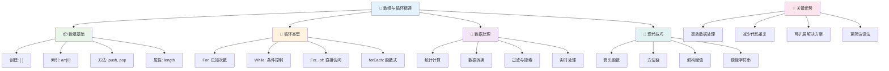
---

## 🚀 你的数组与循环精通时间线

### ⚡ **接下来5分钟你能做什么**
- [ ] 创建一个你最喜欢电影的数组，并访问特定元素
- [ ] 编写一个从 1 数到 10 的 for 循环
- [ ] 尝试本节课的现代数组方法挑战
- [ ] 在浏览器控制台练习数组索引

### 🎯 **接下来一小时你能完成的**
- [ ] 完成课后测验并复习任何有挑战的概念
- [ ] 构建 GitHub Copilot 挑战中的综合成绩分析器
- [ ] 创建一个可以添加和移除商品的简单购物车
- [ ] 练习不同循环类型之间的转换
- [ ] 试验数组方法如 `push`、`pop`、`slice` 和 `splice`

### 📅 **你的一周数据处理旅程**
- [ ] 完成“遍历数组”作业并进行创意增强
- [ ] 使用数组和循环构建一个待办事项应用
- [ ] 创建一个用于数值数据的简单统计计算器
- [ ] 练习 [MDN 数组方法](https://developer.mozilla.org/docs/Web/JavaScript/Reference/Global_Objects/Array)
- [ ] 构建照片图库或音乐播放列表界面
- [ ] 探索函数式编程中的 `map`、`filter` 和 `reduce`

### 🌟 **你的一月转变**
- [ ] 掌握高级数组操作与性能优化
- [ ] 构建完整的数据可视化仪表盘
- [ ] 为涉及数据处理的开源项目做贡献
- [ ] 用实际示例向他人教授数组和循环
- [ ] 创建个人可重用数据处理函数库
- [ ] 探索基于数组的算法和数据结构

### 🏆 **最终数据处理冠军签到**

**庆祝你的数组和循环掌握成果：**
- 你学到的最实用的数组操作是什么，适用于真实世界应用？
- 哪种循环类型对你来说最自然，为什么？
- 理解数组和循环如何改变了你组织数据的方法？
- 你接下来想挑战什么复杂的数据处理任务？

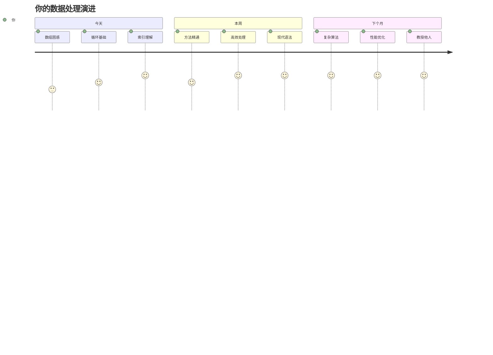
> 📦 **你已解锁数据组织与处理的力量！** 数组和循环是你将构建的几乎每个应用程序的基础。从简单的列表到复杂的数据分析，你现在拥有高效优雅处理信息的工具。每个动态网站、移动应用和数据驱动应用都依赖这些基本概念。欢迎来到可扩展数据处理的世界！🎉

---

<!-- CO-OP TRANSLATOR DISCLAIMER START -->
**免责声明**：  
本文件由AI翻译服务[Co-op Translator](https://github.com/Azure/co-op-translator)翻译而成。虽然我们致力于准确性，但请注意自动翻译可能包含错误或不准确之处。应以原始语言版本的文档作为权威来源。对于关键信息，建议使用专业人工翻译。我们不对因使用本翻译而产生的任何误解或错误解读承担责任。
<!-- CO-OP TRANSLATOR DISCLAIMER END -->