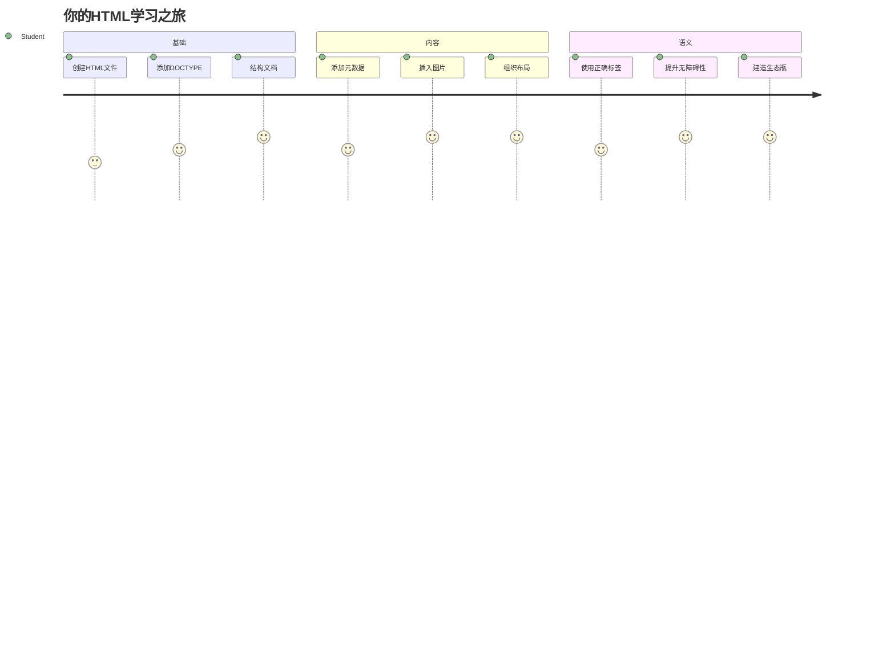
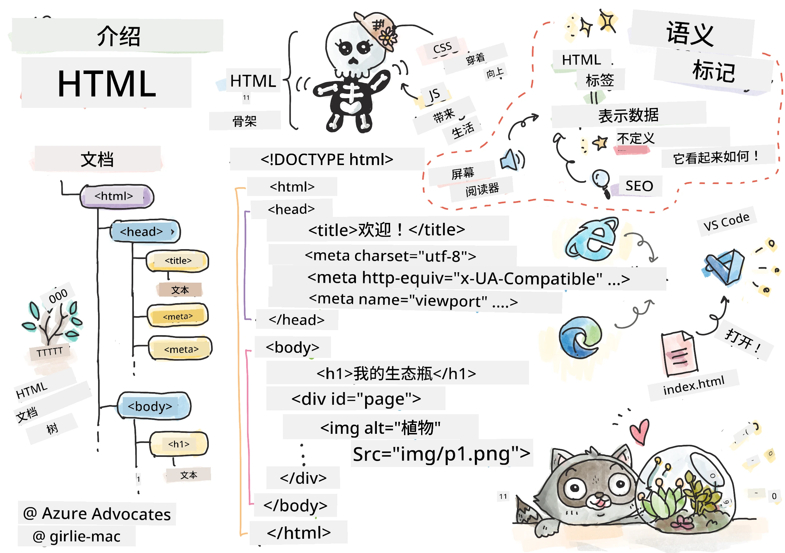
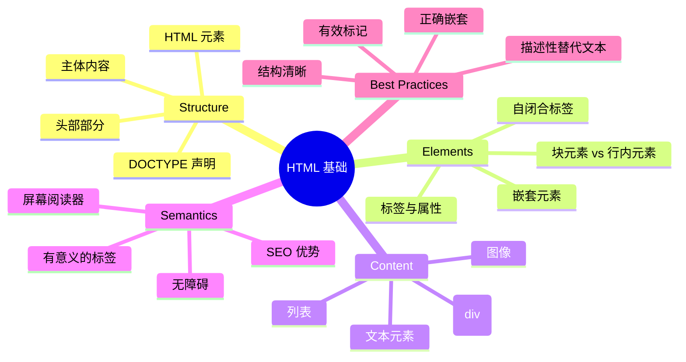
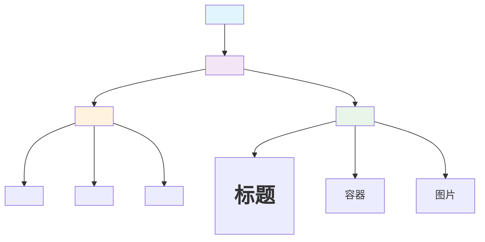
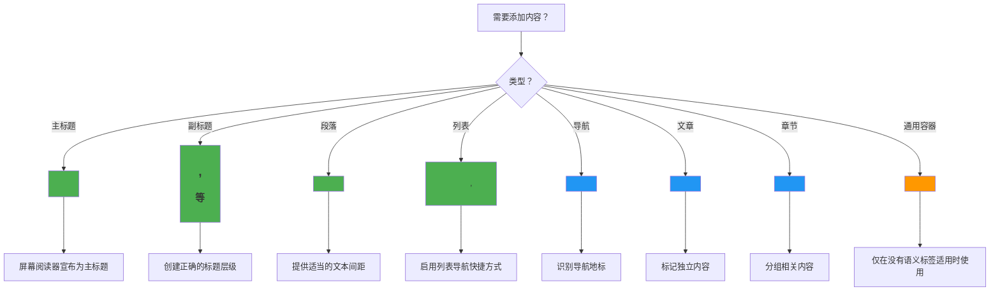
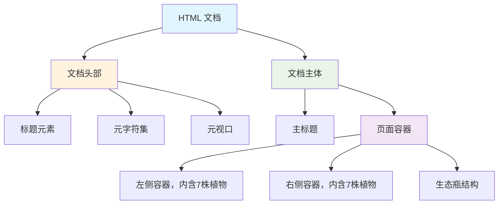
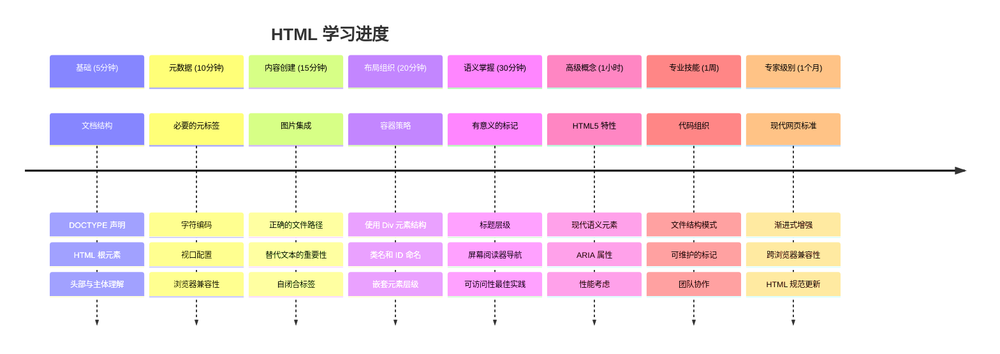

<!--
CO_OP_TRANSLATOR_METADATA:
{
  "original_hash": "3fcfa99c4897e051b558b5eaf1e8cc74",
  "translation_date": "2026-01-06T11:48:52+00:00",
  "source_file": "3-terrarium/1-intro-to-html/README.md",
  "language_code": "zh"
}
-->
# Terrarium 项目第一部分：HTML 入门



> 速记图由 [Tomomi Imura](https://twitter.com/girlie_mac) 提供

HTML，即超文本标记语言，是你访问过的每个网站的基础。把 HTML 想象成网页的骨架 —— 它定义了内容的位置、组织方式以及每个部分的含义。虽然 CSS 会在之后用颜色和布局“装饰”你的 HTML，JavaScript 会通过交互让它“活起来”，但 HTML 则提供了实现一切的基本结构。

在本课中，你将为一个虚拟的玻璃植物箱界面创建 HTML 结构。这个动手项目将教会你基本的 HTML 概念，同时构建一个视觉上有吸引力的东西。你将学习如何使用语义元素来组织内容、处理图片，并为一个交互式网页应用创建基础。

课程结束时，你将拥有一个可以显示植物图片并组织成列的工作HTML页面，为下一课的样式设计做好准备。如果一开始看起来很基础，不用担心 —— 这正是 HTML 在 CSS 添加视觉装饰之前应有的样子。


## 课前测验

[课前测验](https://ff-quizzes.netlify.app/web/quiz/15)

> 📺 **观看学习**：查看这段有帮助的视频综述  
>  
> [](https://www.youtube.com/watch?v=1TvxJKBzhyQ)

## 设置你的项目

在开始编写 HTML 代码之前，让我们为你的玻璃植物箱项目搭建一个合适的工作空间。从一开始创建一个有序的文件结构是一个非常重要的习惯，它将在你整个网页开发旅程中为你带来帮助。

### 任务：创建你的项目结构

你将为玻璃植物箱项目创建专用文件夹，并添加你的第一个 HTML 文件。这里有两个方法可供选择：

**选项 1：使用 Visual Studio Code**  
1. 打开 Visual Studio Code  
2. 点击“文件”→“打开文件夹”或使用快捷键 `Ctrl+K, Ctrl+O`（Windows/Linux）或 `Cmd+K, Cmd+O`（Mac）  
3. 创建一个名为 `terrarium` 的新文件夹并选中它  
4. 在资源管理器面板点击“新建文件”图标  
5. 将你的文件命名为 `index.html`


**选项 2：使用终端命令**  
```bash
mkdir terrarium
cd terrarium
touch index.html
code index.html
```
  
**这些命令实现的操作有：**  
- **创建** 一个名为 `terrarium` 的新目录  
- **进入** 该 `terrarium` 目录  
- **创建** 一个空的 `index.html` 文件  
- **在 Visual Studio Code 中打开** 该文件进行编辑

> 💡 **专业提示**：`index.html` 文件名在网页开发中很特殊。当访问网站时，浏览器会自动寻找 `index.html` 作为默认显示页面。这意味着像 `https://mysite.com/projects/` 这样的 URL 会自动加载 `projects` 文件夹中的 `index.html`，无需在 URL 中指定文件名。

## 理解 HTML 文档结构

每个 HTML 文档都有特定的结构，浏览器需要通过它来理解并正确显示页面内容。把这种结构想象成一封正式的信 —— 它由按特定顺序排列的必需元素组成，帮助接收者（这里是浏览器）正确处理内容。


让我们先添加每个 HTML 文档都需要的基础内容。

### DOCTYPE 声明和根元素

任何 HTML 文件的前两行作为对浏览器的“文档介绍”：

```html
<!DOCTYPE html>
<html></html>
```
  
**理解这段代码做了什么：**  
- **声明** 文档类型为 HTML5，使用 `<!DOCTYPE html>`  
- **创建** 含有所有页面内容的根 `<html>` 元素  
- **确立** 现代网页标准，确保浏览器正确渲染  
- **保证** 各种浏览器和设备上的一致显示效果

> 💡 **VS Code 提示**：在 VS Code 中将鼠标悬停于任意 HTML 标签上，可以看到来自 MDN Web Docs 的帮助信息，包括用法示例和浏览器兼容性详情。

> 📚 **了解更多**：DOCTYPE 声明确保浏览器不会进入“怪异模式”，怪异模式用于支持非常古老的网站。现代网页开发使用简单的 `<!DOCTYPE html>` 声明以保证[标准兼容渲染](https://developer.mozilla.org/docs/Web/HTML/Quirks_Mode_and_Standards_Mode)。

### 🔄 **教学检查点**  
**暂停并反思**：在继续之前，确保你理解了：  
- ✅ 为什么每个 HTML 文档都需要 DOCTYPE 声明  
- ✅ `<html>` 根元素包含了什么  
- ✅ 这种结构如何帮助浏览器正确渲染页面

**快速自测**：你能用自己的话解释“标准兼容渲染”是什么意思吗？

## 添加必要的文档元数据

HTML 文档的 `<head>` 部分包含了浏览器和搜索引擎需要的关键信息，但访客不会直接看到它。这部分可以看作是“幕后”信息，帮助你的网页正常工作且在不同设备和平台上正确显示。

这段元数据告诉浏览器如何显示页面，使用什么字符编码，以及如何处理不同屏幕尺寸 —— 这些都是构建专业且可访问网页的重要因素。

### 任务：添加文档头部

将以下 `<head>` 部分插入到 `<html>` 标签的开头和结尾之间：

```html
<head>
	<title>Welcome to my Virtual Terrarium</title>
	<meta charset="utf-8" />
	<meta http-equiv="X-UA-Compatible" content="IE=edge" />
	<meta name="viewport" content="width=device-width, initial-scale=1" />
</head>
```
  
**拆解每个元素的作用：**  
- **设置** 在浏览器标签和搜索结果中显示的页面标题  
- **指定** UTF-8 字符编码，确保文本能正确显示全球字符  
- **保证** 兼容现代版本的 Internet Explorer  
- **通过设置视口匹配设备宽度** 来实现响应式设计  
- **控制** 页面初始缩放，保证内容按自然大小显示

> 🤔 **思考这个问题**：如果你设置了 `<meta name="viewport" content="width=600">` 会发生什么？页面会被强制固定为 600 像素宽，打破响应式设计！了解更多关于[正确视口配置](https://developer.mozilla.org/docs/Web/HTML/Viewport_meta_tag)。

## 构建文档主体

`<body>` 元素包含网页所有的可见内容 —— 用户将看到并与之交互的一切。虽然 `<head>` 向浏览器提供指令，`<body>` 才是真正持有内容：文字、图片、按钮及其他创建用户界面的元素。

让我们添加主体结构，理解 HTML 标签如何协作创建有意义内容。

### 理解 HTML 标签结构

HTML 使用成对标签定义元素。大多数标签有开标签如 `<p>` 和闭标签如 `</p>`，中间包含内容：`<p>Hello, world!</p>`，表示一个包含文本“Hello, world!”的段落元素。

### 任务：添加 `<body>` 元素

更新你的 HTML 文件，加入 `<body>` 元素：

```html
<!DOCTYPE html>
<html>
	<head>
		<title>Welcome to my Virtual Terrarium</title>
		<meta charset="utf-8" />
		<meta http-equiv="X-UA-Compatible" content="IE=edge" />
		<meta name="viewport" content="width=device-width, initial-scale=1" />
	</head>
	<body></body>
</html>
```
  
**该完整结构提供了：**  
- **建立** 基本的 HTML5 文档框架  
- **包含** 正确渲染所必须的元数据  
- **创建** 一个空白主体，为你的可见内容准备位置  
- **符合** 现代网页开发的最佳实践

现在你可以开始添加玻璃植物箱的可见元素了。我们将用 `<div>` 元素作为容器来组织不同内容区域，并用 `` 标签显示植物图片。

### 使用图片和布局容器

图片在 HTML 中比较特殊，因为它们使用“自闭合”标签。与像 `<p></p>` 这类包裹内容的元素不同，`` 标签在标签内部通过属性（如 `src` 指向图片文件路径，`alt` 用于无障碍访问）包含了所需全部信息。

添加图片前，你需要通过创建图片文件夹并添加植物图形来合理组织项目文件。

**首先，设置你的图片：**  
1. 在玻璃植物箱项目文件夹中创建一个名为 `images` 的文件夹  
2. 从 [solution folder](../../../../3-terrarium/solution/images) 下载植物图片（共14张）  
3. 将所有植物图片复制到你的新 `images` 文件夹中

### 任务：创建植物展示布局

现在，在你的 `<body></body>` 标签之间，添加组织成两列的植物图片：

```html
<div id="page">
	<div id="left-container" class="container">
		<div class="plant-holder">
			
		</div>
		<div class="plant-holder">
			
		</div>
		<div class="plant-holder">
			
		</div>
		<div class="plant-holder">
			
		</div>
		<div class="plant-holder">
			
		</div>
		<div class="plant-holder">
			
		</div>
		<div class="plant-holder">
			
		</div>
	</div>
	<div id="right-container" class="container">
		<div class="plant-holder">
			
		</div>
		<div class="plant-holder">
			
		</div>
		<div class="plant-holder">
			
		</div>
		<div class="plant-holder">
			
		</div>
		<div class="plant-holder">
			
		</div>
		<div class="plant-holder">
			
		</div>
		<div class="plant-holder">
			
		</div>
	</div>
</div>
```
  
**这段代码的步骤说明如下：**  
- **创建** 一个主页面容器，`id="page"`，用于包含所有内容  
- **建立** 两个列容器：`left-container` 和 `right-container`  
- **将** 7 株植物放入左列，7 株放入右列  
- **用** `plant-holder` div 包裹每株植物图片，方便单独定位  
- **应用** 一致的类名，方便下一课中 CSS 样式设定  
- **为** 每个植物图片分配唯一 ID，便于后续 JavaScript 操作  
- **包含** 指向 images 文件夹的正确文件路径

> 🤔 **考虑这个问题**：注意所有图片的 alt 属性都写成了“plant”，这不利于无障碍访问。屏幕阅读器会连续读取14次“plant”，用户无法区分每张图片具体是哪株植物。你能想到更合适、描述更准确的 alt 文本吗？

> 📝 **HTML 元素类型**：`<div>` 是“块级元素”，占满整行宽度；`<span>` 是“内联元素”，只占内容所需宽度。如果把这些 `<div>` 标签全部换成 `<span>` 会怎样？

### 🔄 **教学检查点**  
**结构理解**：花点时间回顾你的 HTML 结构：  
- ✅ 你能识别布局中的主要容器吗？  
- ✅ 你理解为什么每张图片都需要唯一 ID？  
- ✅ 你会怎么描述 `plant-holder` div 的作用？

**视觉检查**：在浏览器中打开你的 HTML 文件。你应该能看到：  
- 一个基础的植物图片列表  
- 图片分成两列排列  
- 简单且未加样式的布局

**记住**：这种朴素的外观正是 CSS 添加样式前 HTML 应有的样子！

有了这些标记，植物将出现在屏幕上，虽然还没有美观的样式 —— 那正是下一课 CSS 的作用！现在你有了坚实的 HTML 基础，内容被正确组织且符合无障碍最佳实践。

## 使用语义 HTML 提升无障碍性

语义 HTML 指的是根据内容的意义和用途选择 HTML 元素，而不是仅仅根据外观使用。当你使用语义标记时，就在向浏览器、搜索引擎和辅助技术（如屏幕阅读器）传达内容的结构和意义。


这种方法让你的网站对残障用户更友好，也帮助搜索引擎更好地理解内容。这是现代网页开发的基本原则，能为所有用户创造更好的体验。

### 添加语义页面标题

让我们给玻璃植物箱页面添加一个合适的标题。将这行代码插入到你的 `<body>` 标签之后：

```html
<h1>My Terrarium</h1>
```
  
**语义标记重要性的原因：**  
- **帮助** 屏幕阅读器导航并理解页面结构  
- **改善** 搜索引擎优化（SEO），明确内容层级  
- **增强** 视觉障碍或认知障碍用户的无障碍性  
- **创造** 跨所有设备和平台更佳的用户体验  
- **符合** 网页标准和专业开发的最佳实践

**语义与非语义选择示例：**

| 目的 | ✅ 语义选择 | ❌ 非语义选择 |
|---------|-------------------|------------------------|
| 主要标题 | `<h1>Title</h1>` | `<div class="big-text">Title</div>` |
| 导航 | `<nav><ul><li></li></ul></nav>` | `<div class="menu"><div></div></div>` |
| 按钮 | `<button>Click me</button>` | `<span onclick="...">Click me</span>` |
| 文章内容 | `<article><p></p></article>` | `<div class="content"><div></div></div>` |

> 🎥 **示范视频**：观看[屏幕阅读器如何与网页交互](https://www.youtube.com/watch?v=OUDV1gqs9GA)，理解语义标记为何对无障碍性至关重要。注意规范的 HTML 结构如何让用户高效导航。

## 创建玻璃植物箱容器

现在，让我们添加玻璃植物箱自身的 HTML 结构 —— 这是存放植物的玻璃容器。该部分展示了一个重要概念：HTML 提供结构，但没有 CSS 样式，这些元素暂时不可见。

玻璃植物箱标记使用了描述性很强的类名，方便下一课 CSS 直观且易维护的设计。

### 任务：添加玻璃植物箱结构

将以下标记插入到最后一个 `</div>` 标签之前（即页面容器关闭标签之前）：

```html
<div id="terrarium">
	<div class="jar-top"></div>
	<div class="jar-walls">
		<div class="jar-glossy-long"></div>
		<div class="jar-glossy-short"></div>
	</div>
	<div class="dirt"></div>
	<div class="jar-bottom"></div>
</div>
```
  
**理解这个玻璃植物箱结构：**  
- **创建** 一个主要的玻璃植物箱容器，并赋予唯一 ID 以便样式设计
- **定义** 每个视觉组件（顶部、墙壁、泥土、底部）的独立元素
- **包含** 用于玻璃反射效果的嵌套元素（光泽元素）
- **使用** 描述性类名，明确指示每个元素的用途
- **准备** CSS 样式结构，以创建玻璃生态瓶的外观

> 🤔 **注意到了吗？**：即使你添加了这些标记，你在页面上也看不到任何新内容！这完美说明了 HTML 提供结构，而 CSS 提供外观。这些 `<div>` 元素存在，但尚未有视觉样式——这将在下一课中完成！


### 🔄 **教学自查**
**HTML 结构掌握**：在继续之前，请确保你能够：
- ✅ 解释 HTML 结构和视觉外观的区别
- ✅ 识别语义和非语义的 HTML 元素
- ✅ 描述正确的标记如何有利于无障碍访问
- ✅ 认识完整的文档树结构

**测试你的理解**：尝试在禁用 JavaScript 和移除 CSS 的浏览器中打开你的 HTML 文件。这样你就能看到你创建的纯粹语义结构！

---

## GitHub Copilot Agent 挑战

使用 Agent 模式完成以下挑战：

**描述：** 创建一个语义化的 HTML 结构，用于添加到生态瓶项目中的植物护理指南部分。

**提示：** 创建一个语义化的 HTML 段落，包含主标题“Plant Care Guide”（植物护理指南），三个子部分，标题分别为“Watering”（浇水）、“Light Requirements”（光照需求）和“Soil Care”（土壤护理），每部分包含一段植物护理信息。使用合适的语义 HTML 标签，如 `<section>`、`<h2>`、`<h3>` 和 `<p>`，来适当组织内容。

了解更多关于 [agent 模式](https://code.visualstudio.com/blogs/2025/02/24/introducing-copilot-agent-mode) 。

## 探索 HTML 历史挑战

**了解网页演变**

自 1990 年 Tim Berners-Lee 在 CERN 创建第一个网页浏览器以来，HTML 已经发生了巨大变革。一些老旧标签如 `<marquee>` 现在被废弃，因为它们与现代无障碍标准和响应式设计原则不兼容。

**尝试这个实验：**
1. 临时用 `<marquee>` 标签包裹你的 `<h1>` 标题：`<marquee><h1>My Terrarium</h1></marquee>`
2. 在浏览器中打开页面，观察滚动效果
3. 思考为什么该标签被废弃（提示：考虑用户体验和无障碍）
4. 移除 `<marquee>` 标签，恢复语义化标记

**反思问题：**
- 滚动标题如何影响视力障碍或动作敏感的用户？
- 哪些现代 CSS 技术可以更无障碍地实现类似视觉效果？
- 为什么使用当前的网页标准比使用废弃元素更重要？

探索更多关于 [过时和废弃的 HTML 元素](https://developer.mozilla.org/docs/Web/HTML/Element#Obsolete_and_deprecated_elements) ，了解网页标准如何发展以提升用户体验。

## 课后测验

[课后测验](https://ff-quizzes.netlify.app/web/quiz/16)

## 复习与自学

**加深你的 HTML 知识**

HTML 作为网页的基础已有 30 多年历史，从简单的文档标记语言演变为构建互动应用的复杂平台。理解这一演变有助于你更好地理解现代网页标准，并做出更好的开发决策。

**推荐学习路径：**

1. **HTML 历史与演变**
   - 研究从 HTML 1.0 到 HTML5 的时间线
   - 探讨某些标签被废弃的原因（无障碍、移动友好性、可维护性）
   - 调查新兴的 HTML 特性和提案

2. **语义 HTML 深入学习**
   - 学习完整的 [HTML5 语义元素列表](https://developer.mozilla.org/docs/Web/HTML/Element)
   - 练习识别 `<article>`、`<section>`、`<aside>` 和 `<main>` 的使用时机
   - 了解增强无障碍的 ARIA 属性

3. **现代网页开发**
   - 探索 Microsoft Learn 上的 [构建响应式网站](https://docs.microsoft.com/learn/modules/build-simple-website/?WT.mc_id=academic-77807-sagibbon)
   - 理解 HTML 如何与 CSS 和 JavaScript 集成
   - 学习网页性能和 SEO 最佳实践

**反思问题：**
- 你发现了哪些被废弃的 HTML 标签？它们为何被移除？
- 未来版本有哪些新的 HTML 特性正在提案中？
- 语义 HTML 如何助力网页无障碍和 SEO？

### ⚡ **未来 5 分钟内可做事项**
- [ ] 打开 DevTools（F12）并检查你喜欢网站的 HTML 结构
- [ ] 创建一个包含基本标签 `<h1>`、`<p>`、`` 的简单 HTML 文件
- [ ] 使用 W3C HTML Validator 进行 HTML 验证
- [ ] 尝试用 `<!-- comment -->` 添加 HTML 注释

### 🎯 **未来一小时可完成事项**
- [ ] 完成课后测验并复习语义 HTML 概念
- [ ] 使用恰当的 HTML 结构建立一个简单的个人网页
- [ ] 试验不同的标题级别和文本格式化标签
- [ ] 添加图片和链接练习多媒体集成
- [ ] 研究你未尝试过的 HTML5 特性

### 📅 **未来一周的 HTML 学习计划**
- [ ] 使用语义标记完成生态瓶项目作业
- [ ] 创建一个使用 ARIA 标签和角色的无障碍网页
- [ ] 练习创建带有多种输入类型的表单
- [ ] 探索 HTML5 API，比如 localStorage 或地理位置
- [ ] 学习响应式 HTML 模式和移动优先设计
- [ ] 审查其他开发者的 HTML 代码，学习最佳实践

### 🌟 **未来一个月的网页基础计划**
- [ ] 构建展示你 HTML 精通程度的个人作品网站
- [ ] 学习使用 Handlebars 等框架进行 HTML 模板编写
- [ ] 通过改进 HTML 文档贡献开源项目
- [ ] 掌握高级 HTML 概念，如自定义元素
- [ ] 将 HTML 与 CSS 框架和 JavaScript 库整合
- [ ] 指导其他 HTML 初学者

## 🎯 你的 HTML 掌握时间表


### 🛠️ 你的 HTML 工具包总结

完成本课后，你已具备：
- **文档结构**：完整的 HTML5 基础，包含正确的 DOCTYPE
- **语义标记**：富有意义、有助于无障碍和 SEO 的标签
- **图像集成**：合理的文件组织和 alt 文本规范
- **布局容器**：用描述性类名战略性地使用 div
- **无障碍意识**：理解屏幕阅读器的导航方式
- **现代标准**：掌握当前 HTML5 实践及废弃标签知识
- **项目基础**：为 CSS 样式和 JavaScript 交互搭建坚实基础

**下一步**：你的 HTML 结构已准备好进行 CSS 样式设计！你所构建的语义基础将使下一课更加易懂。

## 作业

[练习你的 HTML：构建博客模拟页面](assignment.md)

---

<!-- CO-OP TRANSLATOR DISCLAIMER START -->
**免责声明**：
本文件使用 AI 翻译服务 [Co-op Translator](https://github.com/Azure/co-op-translator) 进行翻译。虽然我们力求准确，但请注意自动翻译可能包含错误或不准确之处。原始文件的母语版本应被视为权威来源。对于关键信息，建议使用专业人工翻译。因使用本翻译而产生的任何误解或误读，我们不承担任何责任。
<!-- CO-OP TRANSLATOR DISCLAIMER END -->