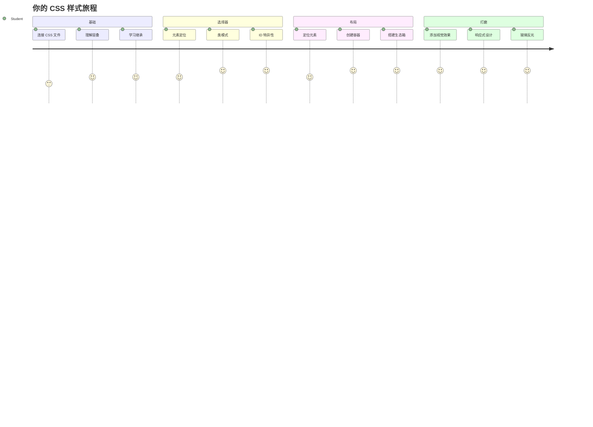
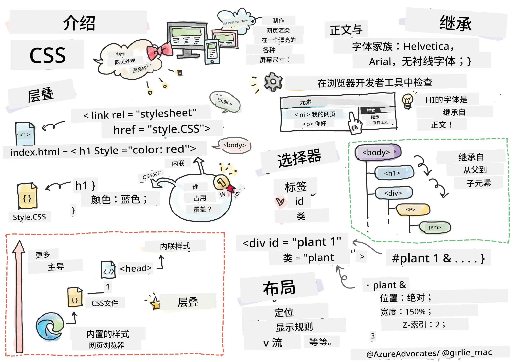
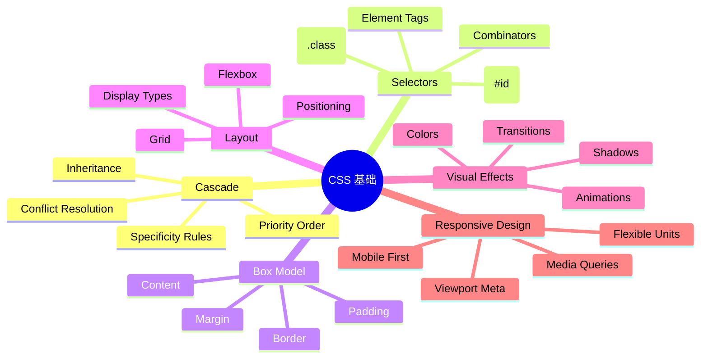
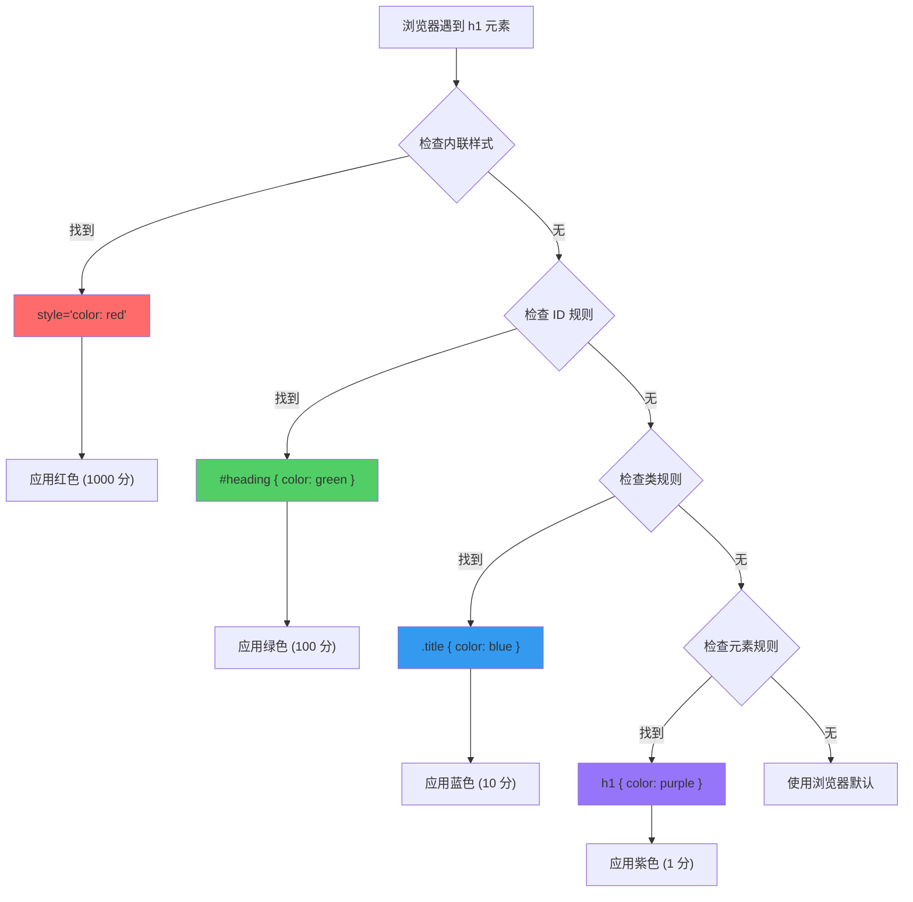
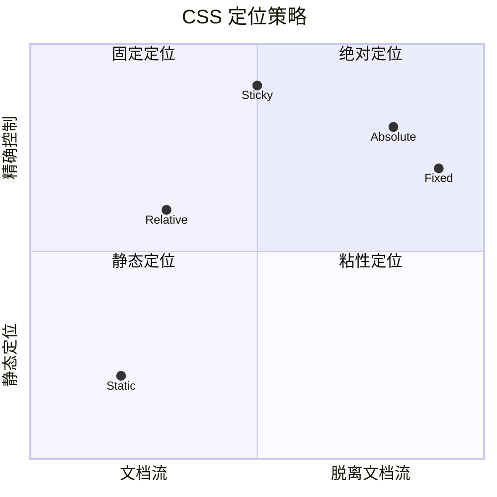
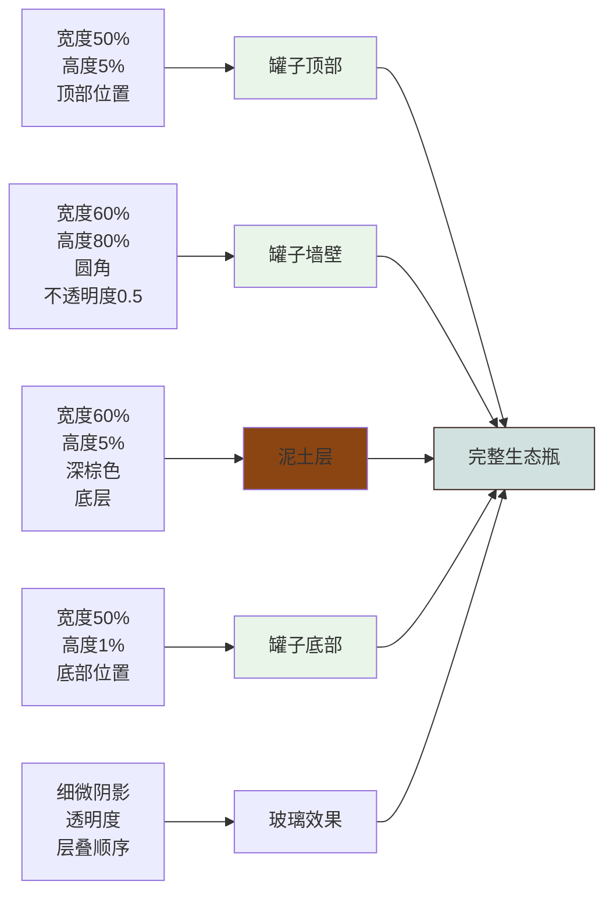
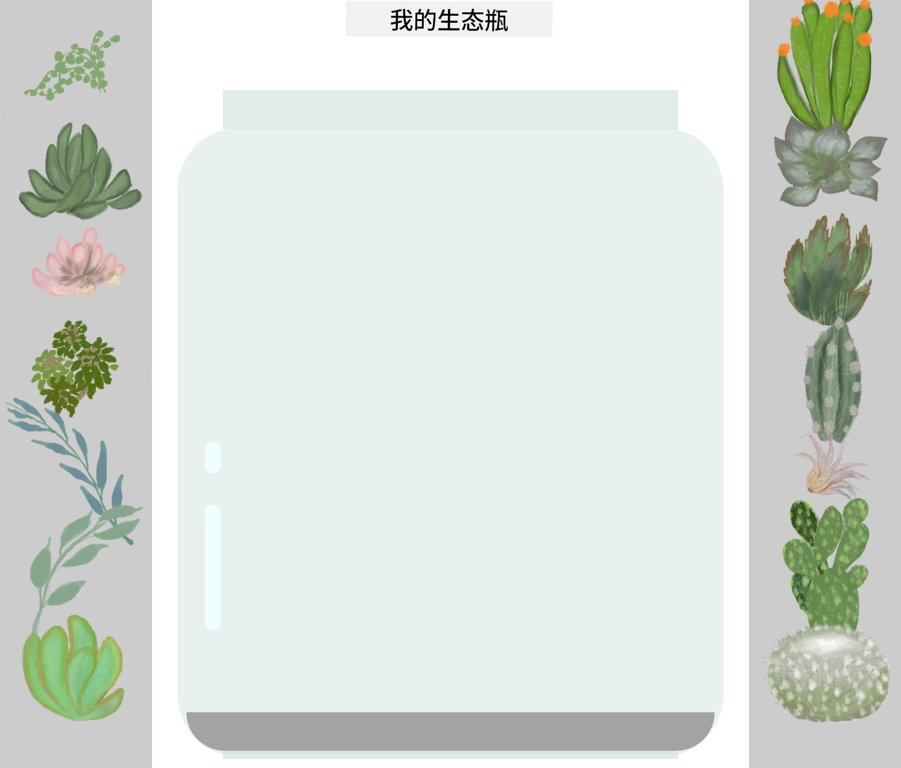

<!--
CO_OP_TRANSLATOR_METADATA:
{
  "original_hash": "e39f3a4e3bcccf94639e3af1248f8a4d",
  "translation_date": "2026-01-06T11:53:01+00:00",
  "source_file": "3-terrarium/2-intro-to-css/README.md",
  "language_code": "zh"
}
-->
# Terrarium Project 第二部分：CSS 介绍



> 速写笔记作者 [Tomomi Imura](https://twitter.com/girlie_mac)

还记得你的 HTML 生态瓶看起来很基础吗？CSS 就是把那个普通的结构变成视觉上更吸引人的东西。

如果说 HTML 就像搭建房子的框架，那么 CSS 就是让它感觉像家的所有东西——油漆颜色、家具布置、灯光，以及房间之间的流动。想想凡尔赛宫最初只是一个简单的狩猎小屋，但经过精心的装饰和布局，就变成了世界上最宏伟的建筑之一。

今天，我们将把你的生态瓶从功能性变成精致。你将学习如何精准定位元素，使布局响应不同屏幕尺寸，并创造让网站引人注目的视觉效果。

本课结束时，你将看到战略性的 CSS 样式如何极大提升你的项目。让我们为你的生态瓶增添一些风格吧。


## 课前测验

[课前测验](https://ff-quizzes.netlify.app/web/quiz/17)

## CSS 入门

CSS 常被认为只是“美化”，但它的作用远不止如此。CSS 就像电影导演——你不仅控制一切的外观，还控制其运动、响应交互以及适应不同情况。

现代 CSS 非常强大。你可以编写代码，自动调整手机、平板和桌面电脑的布局。你可以创建平滑动画，引导用户注意力。所有功能协同工作时效果非常惊人。

> 💡 **小贴士**：CSS 持续演进，增加新特性和功能。使用新 CSS 特性前，请务必访问 [CanIUse.com](https://caniuse.com) 检查浏览器支持情况。

**本课目标：**
- **创建** 用现代 CSS 技术完整设计你的生态瓶视觉效果
- **探索** 级联、继承和 CSS 选择器等基础概念
- **实现** 响应式定位和布局策略
- **构建** 生态瓶容器，使用 CSS 形状和样式

### 先修条件

你应该完成了上一课的生态瓶 HTML 结构，准备好进行样式设计。

> 📺 **视频资源**：观看此视频讲解
>
> [](https://www.youtube.com/watch?v=6yIdOIV9p1I)

### 设置你的 CSS 文件

开始样式设计前，我们需要将 CSS 连接到 HTML。这让浏览器知道哪里能找到生态瓶的样式指令。

在你的生态瓶文件夹中，创建一个名为 `style.css` 的新文件，然后在 HTML 文档的 `<head>` 部分链接它：

```html
<link rel="stylesheet" href="./style.css" />
```

**此代码作用：**
- **建立** HTML 和 CSS 文件之间的连接
- **告诉**浏览器加载并应用 `style.css` 中的样式
- **使用** `rel="stylesheet"` 属性声明这是 CSS 文件
- **以** `href="./style.css"` 路径引用文件

## 理解 CSS 级联

你有没有想过为什么 CSS 叫“层叠样式表”？样式像瀑布一样层叠，有时相互冲突。

想象军队指挥结构——将军命令“所有士兵穿绿衣”，但某个单位的具体命令是“典礼穿礼服蓝”，这时具体命令优先。CSS 也遵循类似逻辑，理解此层级关系才能更好地调试。

### 级联优先级实验

让我们通过样式冲突来观察级联。先给你的 `<h1>` 标签添加行内样式：

```html
<h1 style="color: red">My Terrarium</h1>
```

**代码做了什么：**
- **直接** 用行内样式将 `<h1>` 设置为红色
- **使用** `style` 属性直接在 HTML 中嵌入 CSS
- **创建** 该元素的最高优先级样式规则

接着，在你的 `style.css` 文件中添加以下规则：

```css
h1 {
  color: blue;
}
```

**上述说明：**
- **定义** 了所有 `<h1>` 元素的 CSS 规则
- **用** 外部样式表将文本颜色设置为蓝色
- **优先级** 低于行内样式

✅ **知识检测**：网页中显示的是哪个颜色？为什么这个颜色胜出？你能想到什么时候需要覆盖样式吗？


> 💡 **CSS 优先级顺序（从高到低）：**
> 1. **行内样式**（style 属性）
> 2. **ID 选择器**（#myId）
> 3. **类选择器**（.myClass）和属性选择器
> 4. **元素选择器**（h1，div，p）
> 5. **浏览器默认**

## CSS 继承原理

CSS 继承很像遗传学——元素继承父元素的某些属性。如果你给 body 元素设置字体，全页文本都会自动使用同样字体。这就像哈布斯堡王朝的家族下巴，在没有具体指定的情况下代代相传。

但不是所有属性都会继承。文本样式如字体和颜色会继承，布局属性如外边距和边框则不会。就像孩子可能继承父母的外貌特征，但不一定继承穿衣风格。

### 观察字体继承

试试给 `<body>` 元素设置字体：

```css
body {
  font-family: 'Segoe UI', Tahoma, Geneva, Verdana, sans-serif;
}
```

**解释这里发生的事情：**
- **设置** 全页面字体，针对 `<body>` 元素
- **使用** 字体栈托底，提升浏览器兼容性
- **应用** 现代系统字体，跨操作系统表现良好
- **确保** 所有子元素继承字体，除非被特别覆盖

打开浏览器开发者工具（F12），切换到 Elements 面板，检查 `<h1>` 元素，你会看到它继承自 body 的字体：


✅ **试验时间**：尝试给 `<body>` 设置其他可继承属性如 `color`，`line-height` 或 `text-align`。你的标题和其他元素会发生什么变化？

> 📝 **可继承属性包括**：`color`，`font-family`，`font-size`，`line-height`，`text-align`，`visibility`
>
> **不可继承属性包括**：`margin`，`padding`，`border`，`width`，`height`，`position`

### 🔄 **教学进度检查**
**CSS 基础理解情况**：在学习选择器前，请确保你能：
- ✅ 解释级联与继承的区别
- ✅ 预测样式冲突中哪个样式会生效
- ✅ 识别哪些属性会从父元素继承
- ✅ 正确连接 CSS 和 HTML 文件

**快速测试**：如果样式如下，`<div class="special">` 内的 `<h1>` 显示什么颜色？
```css
div { color: blue; }
.special { color: green; }
h1 { color: red; }
```
*答案：红色（元素选择器直接针对 h1）*

## 精通 CSS 选择器

CSS 选择器是你指定样式目标元素的方式。它们就像给出精确指示——不是说“那栋房子”，而是说“枫树街上蓝色门的房子”。

CSS 提供了多种定位方式，选择正确选择器就像选对工具。你有时要给整个街区的每扇门统一造型，有时只对某一扇特殊的门操作。

### 元素选择器（标签）

元素选择器通过标签名称定位 HTML 元素。很适合设置页面全局基础样式：

```css
body {
  font-family: 'Segoe UI', Tahoma, Geneva, Verdana, sans-serif;
  margin: 0;
  padding: 0;
}

h1 {
  color: #3a241d;
  text-align: center;
  font-size: 2.5rem;
  margin-bottom: 1rem;
}
```

**这些样式做了什么：**
- **用** `body` 选择器设置统一字体排版
- **清除** 浏览器默认的外边距和内边距，方便精准控制
- **给所有标题元素** 设定颜色、对齐和间距
- **使用** `rem` 单位，提升字体大小的可伸缩性与无障碍性

虽然元素选择器适合通用样式，但针对生态瓶里的具体植物组件，你需要更具体的选择器。

### ID 选择器用于唯一元素

ID 选择器用 `#` 符号，定位具有唯一 `id` 属性的元素。ID 在页面中唯一，非常适合样式化单个特定元素，比如生态瓶左、右侧的植物容器。

为你的生态瓶侧边容器创建样式：

```css
#left-container {
  background-color: #f5f5f5;
  width: 15%;
  left: 0;
  top: 0;
  position: absolute;
  height: 100vh;
  padding: 1rem;
  box-sizing: border-box;
}

#right-container {
  background-color: #f5f5f5;
  width: 15%;
  right: 0;
  top: 0;
  position: absolute;
  height: 100vh;
  padding: 1rem;
  box-sizing: border-box;
}
```

**本代码实现：**
- **用** `absolute` 定位将容器固定在屏幕左右边缘
- **用** `vh`（视口高度）单位实现响应式高度，适应屏幕尺寸
- **设置** `box-sizing: border-box`，确保内边距包括在宽度内
- **移除** 零值的 `px` 单位，使代码简洁
- **设置** 柔和背景色，比生硬灰色更舒适

✅ **代码质量挑战**：此 CSS 违反了 DRY（不重复自己）原则。你能用 ID 和类重构它吗？

**改进方案：**
```html
<div id="left-container" class="container"></div>
<div id="right-container" class="container"></div>
```

```css
.container {
  background-color: #f5f5f5;
  width: 15%;
  top: 0;
  position: absolute;
  height: 100vh;
  padding: 1rem;
  box-sizing: border-box;
}

#left-container {
  left: 0;
}

#right-container {
  right: 0;
}
```

### 类选择器用于可复用样式

类选择器用 `.` 符号，适合给多个元素应用相同样式。不同于 ID，类可以在 HTML 中多次使用，适合统一样式模式。

在生态瓶中，每株植物样式相似但定位不同。我们会用类做共享样式，用 ID 做单独定位。

**各植物的 HTML 结构如下：**
```html
<div class="plant-holder">
  
</div>
```

**关键元素说明：**
- **`class="plant-holder"`** 用于各植物容器，统一样式
- **`class="plant"`** 用于植物图片，共享样式和行为
- **`id="plant1"`** 唯一 ID，用于定位和 JS 交互
- **提供** alt 文本，提升屏幕阅读器可访问性

现在将这些样式添加到 `style.css`：

```css
.plant-holder {
  position: relative;
  height: 13%;
  left: -0.6rem;
}

.plant {
  position: absolute;
  max-width: 150%;
  max-height: 150%;
  z-index: 2;
  transition: transform 0.3s ease;
}

.plant:hover {
  transform: scale(1.05);
}
```

**样式详解：**
- **为植物容器** 设定相对定位，创建定位依据
- **设置** 每个容器高度为 13%，确保植物整体垂直可见无滚动
- **稍微向左偏移**，更好地将植物居中在容器内
- **让植物图片** 能响应式缩放，设置最大宽高限制
- **用** `z-index` 让植物层级高于其他元素
- **添加** 细微的悬停动画，提升用户交互体验

✅ **深入思考**：为什么需要同时使用 `.plant-holder` 和 `.plant` 选择器？如果只用一个，会怎样？

> 💡 **设计模式**：容器 `.plant-holder` 负责布局和定位，内容 `.plant` 负责外观和缩放。分离职责让代码更易维护更灵活。

## 理解 CSS 定位

CSS 定位像舞台导演——你决定演员站哪里，怎么动。某些演员按标准站位，其它演员为了戏剧效果需要特殊定位。

理解定位后，很多布局问题迎刃而解。想要滚动页面时导航栏固定顶部？定位来帮忙。需要特定位置显示提示框？也是定位。

### 五种定位值


| 定位值 | 行为 | 用途 |
|--------|------|------|
| `static` | 默认文档流，忽略 top/left/right/bottom | 正常布局 |
| `relative` | 相对于正常位置定位 | 微调位置，创建定位上下文 |
| `absolute` | 相对于最近的定位祖先 | 精确定位，覆盖层 |
| `fixed` | 相对于视口 | 固定导航栏，悬浮元素 |
| `sticky` | 滚动时在 `relative` 和 `fixed` 之间切换 | 滚动固定头部 |

### 生态瓶中的定位应用

我们用组合定位策略，创建所需布局：

```css
/* Container positioning */
.container {
  position: absolute; /* Removes from normal flow */
  /* ... other styles ... */
}

/* Plant holder positioning */
.plant-holder {
  position: relative; /* Creates positioning context */
  /* ... other styles ... */
}

/* Plant positioning */
.plant {
  position: absolute; /* Allows precise placement within holder */
  /* ... other styles ... */
}
```

**定位策略说明：**
- **绝对容器** 从正常文档流移除，被钉在屏幕边缘
- **相对植物容器** 保持文档流，同时创建定位上下文
- **绝对植物** 可在相对容器内精准定位
- **组合使用** 允许植物垂直堆叠，且能单独定位

> 🎯 **为什么重要**：`plant` 元素需要绝对定位，方便下一课实现拖拽。绝对定位将其从文档流中剥离，使拖放交互成为可能。

✅ **实验时间**：尝试更改定位值，观察效果：
- 将 `.container` 从 `absolute` 改为 `relative` 会怎样？
- 如果 `.plant-holder` 使用 `absolute` 而不是 `relative`，布局会如何变化？
- 当你将 `.plant` 切换为 `relative` 定位时会发生什么？

### 🔄 **教学检查点**
**CSS 定位掌握情况**：暂停，确认你的理解：
- ✅ 你能解释为什么植物需要绝对定位来实现拖放吗？
- ✅ 你理解相对容器如何创建定位上下文吗？
- ✅ 为什么侧边容器使用绝对定位？
- ✅ 如果完全移除定位声明，会发生什么？

**现实世界联系**：思考 CSS 定位如何反映现实布局：
- **静态**：书架上的书（自然顺序）
- **相对**：稍微移动一本书，但保持它的位置
- **绝对**：在特定页码放置书签
- **固定**：翻页时仍然可见的贴纸

## 使用 CSS 构建玻璃瓶

现在我们将仅用 CSS 构建一个玻璃罐——不需要图像或图形软件。

使用定位和透明度创建逼真的玻璃、阴影和深度效果，展示了 CSS 的视觉能力。这种技术类似包豪斯运动中的建筑师如何用简单的几何形状创造复杂且美丽的结构。一旦你理解了这些原理，就能认识出许多网页设计背后的 CSS 技巧。


### 创建玻璃罐组件

让我们逐个构建生态瓶的罐体部分。每个部分都使用绝对定位和百分比尺寸以实现响应式设计：

```css
.jar-walls {
  height: 80%;
  width: 60%;
  background: #d1e1df;
  border-radius: 1rem;
  position: absolute;
  bottom: 0.5%;
  left: 20%;
  opacity: 0.5;
  z-index: 1;
  box-shadow: inset 0 0 2rem rgba(0, 0, 0, 0.1);
}

.jar-top {
  width: 50%;
  height: 5%;
  background: #d1e1df;
  position: absolute;
  bottom: 80.5%;
  left: 25%;
  opacity: 0.7;
  z-index: 1;
  border-radius: 0.5rem 0.5rem 0 0;
}

.jar-bottom {
  width: 50%;
  height: 1%;
  background: #d1e1df;
  position: absolute;
  bottom: 0;
  left: 25%;
  opacity: 0.7;
  border-radius: 0 0 0.5rem 0.5rem;
}

.dirt {
  width: 60%;
  height: 5%;
  background: #3a241d;
  position: absolute;
  border-radius: 0 0 1rem 1rem;
  bottom: 1%;
  left: 20%;
  opacity: 0.7;
  z-index: -1;
}
```

**理解生态瓶构建：**
- **使用** 基于百分比的尺寸，实现所有屏幕尺寸的响应式缩放
- **绝对定位** 元素，以精确地堆叠和对齐
- **应用** 不同的不透明度值，创造玻璃透明效果
- **实现** `z-index` 分层，使植物显示在瓶子内部
- **添加** 细微的盒阴影和圆角边框，增强真实感

### 百分比响应式设计

注意所有尺寸都是用百分比，而非固定像素值：

**为什么重要：**
- **确保** 生态瓶在任何屏幕尺寸下成比例缩放
- **维护** 瓶子各部件间的视觉关系
- **提供** 从手机到大型桌面显示器的一致体验
- **允许** 设计自适应且不破坏视觉布局

### CSS 单位示范

我们使用 `rem` 单位来设置圆角，它相对于根字体大小缩放。这样创建的设计更易访问，尊重用户的字体偏好。详见官方规范中的 [CSS 相对单位](https://www.w3.org/TR/css-values-3/#font-relative-lengths)。

✅ **视觉实验**：尝试修改这些数值，观察效果：
- 将罐子的透明度从 0.5 改为 0.8——这如何影响玻璃外观？
- 将土壤颜色从 `#3a241d` 改为 `#8B4513`——视觉效果怎样改变？
- 修改土壤的 `z-index` 为 2——分层效果发生了什么？

### 🔄 **教学检查点**
**CSS 视觉设计理解**：确认你对视觉 CSS 的掌握：
- ✅ 百分比尺寸如何实现响应式设计？
- ✅ 为什么透明度能创建玻璃透明效果？
- ✅ `z-index` 在分层中起什么作用？
- ✅ 圆角值如何塑造罐子形状？

**设计原则**：注意我们如何用简单形状构建复杂视觉：
1. **矩形** → **圆角矩形** → **罐子组件**
2. **纯色** → **透明度** → **玻璃效果**
3. **单个元素** → **分层组合** → **三维效果**

---

## GitHub Copilot Agent 挑战 🚀

使用 Agent 模式完成以下挑战：

**描述：** 创建一个 CSS 动画，使生态瓶中的植物轻柔地摇摆，模拟自然微风效果。帮助你练习 CSS 动画、变换和关键帧，同时增强生态瓶的视觉吸引力。

**提示：** 添加 CSS 关键帧动画，使生态瓶内的植物缓慢地左右摇摆。创建一个摇摆动画，让每棵植物左右旋转约 2-3 度，持续时间为 3-4 秒，应用于 `.plant` 类。确保动画无限循环，且采用缓动函数以获得自然流畅的动作。

了解更多关于 [agent 模式](https://code.visualstudio.com/blogs/2025/02/24/introducing-copilot-agent-mode) 。

## 🚀 挑战：添加玻璃反光效果

准备好用真实的玻璃反光效果增强你的生态瓶吗？这项技术将为设计添加深度和真实感。

你将创建细腻的高光，模拟光在玻璃表面的反射。这与文艺复兴画家扬·凡·艾克（Jan van Eyck）使用光线和反射使绘画玻璃呈现三维感的手法类似。你的目标如下：



**你的挑战：**
- **创建** 微妙的白色或浅色椭圆形反光
- **将其定位** 在罐子的左侧恰当位置
- **应用** 适当的不透明度和模糊效果，实现真实光反射
- **用** `border-radius` 制造有机、气泡状形状
- **尝试** 渐变或盒阴影增强真实感

## 课后测验

[课后测验](https://ff-quizzes.netlify.app/web/quiz/18)

## 拓展你的 CSS 知识

CSS 起初可能显得复杂，但掌握这些核心概念将为深入学习打下坚实基础。

**你的下一步 CSS 学习领域：**
- **Flexbox** - 简化元素对齐和分布
- **CSS 网格布局** - 强大工具，创建复杂布局
- **CSS 变量** - 降低重复，提高可维护性
- **响应式设计** - 确保网站在不同屏幕尺寸上表现良好

### 互动学习资源

通过这些有趣的实战游戏来练习概念：
- 🐸 [Flexbox Froggy](https://flexboxfroggy.com/) - 通过有趣挑战掌握 Flexbox
- 🌱 [Grid Garden](https://codepip.com/games/grid-garden/) - 通过种植虚拟胡萝卜学习 CSS 网格
- 🎯 [CSS Battle](https://cssbattle.dev/) - 用编码挑战测试你的 CSS 技能

### 额外学习资源

想系统学习 CSS 基础，完成微软学习模块：[用 CSS 样式化你的 HTML 应用](https://docs.microsoft.com/learn/modules/build-simple-website/4-css-basics/?WT.mc_id=academic-77807-sagibbon)

### ⚡ **接下来 5 分钟你可以做什么**
- [ ] 打开开发者工具，使用元素面板检查任何网站的 CSS 样式
- [ ] 创建一个简单的 CSS 文件，并链接到 HTML 页面
- [ ] 尝试用不同方式改变颜色：十六进制、RGB 和命名颜色
- [ ] 通过添加内边距和外边距练习盒模型

### 🎯 **接下来一小时你能完成什么**
- [ ] 完成课后测验，复习 CSS 基础
- [ ] 给你的 HTML 页面添加字体、颜色和间距样式
- [ ] 使用 flexbox 或 grid 创建简单布局
- [ ] 试验 CSS 过渡实现平滑效果
- [ ] 用媒体查询练习响应式设计

### 📅 **你的 CSS 一周学习计划**
- [ ] 富有创意地完成生态瓶样式作业
- [ ] 通过建立照片图库布局掌握 CSS 网格
- [ ] 学习 CSS 动画，让设计更生动
- [ ] 探索 Sass 或 Less 等 CSS 预处理器
- [ ] 学习设计原则并应用到 CSS 中
- [ ] 分析并复刻你在网上发现的有趣设计

### 🌟 **你的 CSS 一个月设计精通计划**
- [ ] 构建完整响应式网站设计系统
- [ ] 学习 CSS-in-JS 或类似 Tailwind 的实用优先框架
- [ ] 为开源项目贡献 CSS 优化
- [ ] 掌握高级 CSS 概念，如自定义属性和封装内容
- [ ] 创建可重用组件库，编写模块化 CSS
- [ ] 指导他人学习 CSS，分享设计知识

## 🎯 你的 CSS 掌握时间线

```mermaid
timeline
    title CSS 学习进度
    
    section 基础（10分钟）
        文件连接：将 CSS 连接到 HTML
                  ：理解层叠规则
                  ：学习继承基础
        
    section 选择器（15分钟）
        定位元素：元素选择器
                  ：类模式
                  ：ID 特异性
                  ：组合器
        
    section 盒模型（20分钟）
        布局基础：外边距和内边距
                  ：边框属性
                  ：内容尺寸
                  ：盒模型行为
        
    section 定位（25分钟）
        元素放置：静态与相对定位
                  ：绝对定位
                  ：层叠顺序（z-index）
                  ：响应式单位
        
    section 视觉设计（30分钟）
        样式掌握：颜色与不透明度
                  ：阴影与效果
                  ：过渡
                  ：变换属性
        
    section 响应式设计（45分钟）
        多设备支持：媒体查询
                   ：灵活布局
                   ：移动优先方法
                   ：视口优化
        
    section 高级技巧（1周）
        现代 CSS：弹性盒布局
                 ：CSS 网格系统
                 ：自定义属性
                 ：动画关键帧
        
    section 专业技能（1个月）
        CSS 架构：组件模式
                  ：可维护代码
                  ：性能优化
                  ：跨浏览器兼容性
```


### 🛠️ 你的 CSS 工具总结

完成本课后，你已经拥有：
- **层叠理解**：样式如何继承和覆盖
- **选择器掌握**：精准定位元素、类和 ID
- **定位技能**：战略性元素放置和分层
- **视觉设计**：创建玻璃效果、阴影和透明度
- **响应式技术**：基于百分比的布局适应任何屏幕
- **代码组织**：清晰且可维护的 CSS 结构
- **现代实践**：使用相对单位和无障碍设计模式

**下一步**：你的生态瓶现在有了结构（HTML）和样式（CSS）。最后一课将添加交互功能（JavaScript）！

## 作业

[CSS 重构](assignment.md)

---

<!-- CO-OP TRANSLATOR DISCLAIMER START -->
**免责声明**：
本文件通过 AI 翻译服务 [Co-op Translator](https://github.com/Azure/co-op-translator) 进行翻译。虽然我们力求准确，但请注意自动翻译可能包含错误或不准确之处。原始语言的原始文档应被视为权威来源。对于重要信息，建议使用专业人工翻译。对于因使用本翻译而产生的任何误解或误释，我们不承担任何责任。
<!-- CO-OP TRANSLATOR DISCLAIMER END -->