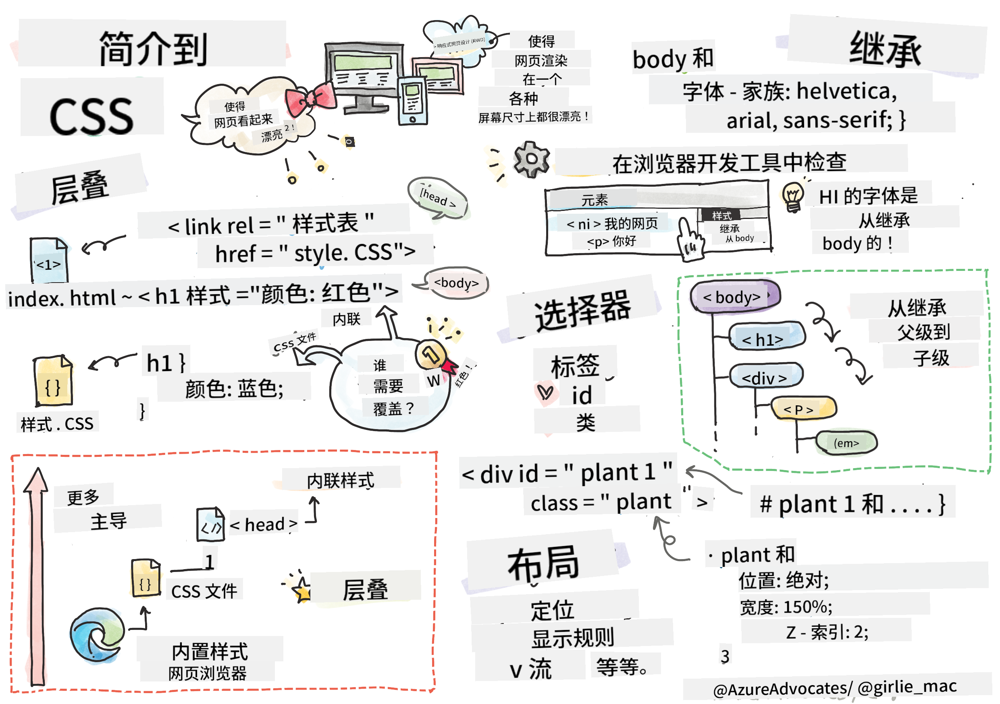
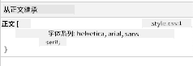

<!--
CO_OP_TRANSLATOR_METADATA:
{
  "original_hash": "acb5ae00cde004304296bb97da8ff4c3",
  "translation_date": "2025-08-29T14:49:50+00:00",
  "source_file": "3-terrarium/2-intro-to-css/README.md",
  "language_code": "zh"
}
-->
# Terrarium 项目第二部分：CSS 入门


> [Tomomi Imura](https://twitter.com/girlie_mac) 的手绘笔记

## 课前测验

[课前测验](https://ff-quizzes.netlify.app/web/quiz/17)

### 简介

CSS，全称为层叠样式表，解决了网页开发中的一个重要问题：如何让你的网站看起来更美观。为你的应用程序添加样式可以使其更易用且更具吸引力；你还可以使用 CSS 创建响应式网页设计（RWD），使你的应用在任何屏幕尺寸下都能保持良好的显示效果。CSS 不仅仅是为了让应用看起来漂亮，它的规范还包括动画和变换功能，可以为你的应用实现复杂的交互效果。CSS 工作组负责维护当前的 CSS 规范，你可以在 [万维网联盟的网站](https://www.w3.org/Style/CSS/members)上关注他们的工作。

> 注意，CSS 是一种不断发展的语言，就像网络上的所有事物一样，并不是所有浏览器都支持最新的规范部分。请随时通过 [CanIUse.com](https://caniuse.com) 检查你的实现。

在本课中，我们将为在线的微型生态瓶添加样式，并学习多个 CSS 概念：层叠、继承、选择器的使用、定位以及使用 CSS 构建布局。在此过程中，我们将布局微型生态瓶并创建实际的生态瓶。

### 前置条件

你应该已经构建好微型生态瓶的 HTML，并准备好进行样式设计。

> 查看视频

> 
> [](https://www.youtube.com/watch?v=6yIdOIV9p1I)

### 任务

在你的微型生态瓶文件夹中，创建一个名为 `style.css` 的新文件。在 `<head>` 部分导入该文件：

```html
<link rel="stylesheet" href="./style.css" />
```

---

## 层叠

层叠样式表包含了样式“层叠”的概念，即样式的应用是由其优先级决定的。网站作者设置的样式优先于浏览器设置的样式。内联样式优先于外部样式表中的样式。

### 任务

为你的 `<h1>` 标签添加内联样式 "color: red"：

```HTML
<h1 style="color: red">My Terrarium</h1>
```

然后，将以下代码添加到你的 `style.css` 文件中：

```CSS
h1 {
 color: blue;
}
```

✅ 你的网页应用中显示了哪种颜色？为什么？你能找到一种方法来覆盖样式吗？在什么情况下你会想要这样做，或者为什么不这样做？

---

## 继承

样式可以从祖先元素继承到后代元素，即嵌套的元素会继承其父元素的样式。

### 任务

将 body 的字体设置为指定字体，并检查嵌套元素的字体：

```CSS
body {
	font-family: helvetica, arial, sans-serif;
}
```

打开浏览器的控制台，进入“元素”标签，观察 H1 的字体。它继承了 body 的字体，浏览器中会显示这一点：



✅ 你能让嵌套样式继承不同的属性吗？

---

## CSS 选择器

### 标签

到目前为止，你的 `style.css` 文件只为少数标签设置了样式，应用看起来很奇怪：

```CSS
body {
	font-family: helvetica, arial, sans-serif;
}

h1 {
	color: #3a241d;
	text-align: center;
}
```

这种为标签设置样式的方法可以让你控制独特的元素，但你需要控制微型生态瓶中许多植物的样式。为此，你需要利用 CSS 选择器。

### Ids

为左侧和右侧容器添加一些样式。由于标记中只有一个左侧容器和一个右侧容器，它们被赋予了 id。要为它们设置样式，请使用 `#`：

```CSS
#left-container {
	background-color: #eee;
	width: 15%;
	left: 0px;
	top: 0px;
	position: absolute;
	height: 100%;
	padding: 10px;
}

#right-container {
	background-color: #eee;
	width: 15%;
	right: 0px;
	top: 0px;
	position: absolute;
	height: 100%;
	padding: 10px;
}
```

在这里，你使用绝对定位将这些容器放置在屏幕的最左侧和最右侧，并使用百分比设置它们的宽度，以便它们可以适应小型移动屏幕。

✅ 这段代码重复性较高，因此不符合“DRY”（不要重复自己）的原则；你能找到一种更好的方法来为这些 id 设置样式吗？也许可以结合 id 和 class？你需要更改标记并重构 CSS：

```html
<div id="left-container" class="container"></div>
```

### Classes

在上面的示例中，你为屏幕上的两个独特元素设置了样式。如果你希望样式应用于屏幕上的多个元素，可以使用 CSS 类。这样做可以布局左侧和右侧容器中的植物。

注意，HTML 标记中的每个植物都有 id 和类的组合。id 在这里是供你稍后添加的 JavaScript 使用，用于操作微型生态瓶中的植物位置。而类则为所有植物提供了统一的样式。

```html
<div class="plant-holder">
	
</div>
```

将以下内容添加到你的 `style.css` 文件中：

```CSS
.plant-holder {
	position: relative;
	height: 13%;
	left: -10px;
}

.plant {
	position: absolute;
	max-width: 150%;
	max-height: 150%;
	z-index: 2;
}
```

在这个代码片段中，值得注意的是相对定位和绝对定位的混合，我们将在下一节中详细讨论。观察高度是如何通过百分比处理的：

你将植物容器的高度设置为 13%，这是一个不错的数字，可以确保所有植物都显示在每个垂直容器中而无需滚动。

你将植物容器向左移动，以使植物在其容器中更居中。图片有大量透明背景，为了使它们更易于拖动，需要向左移动以更好地适应屏幕。

然后，植物本身的最大宽度设置为 150%。这使得它可以随着浏览器的缩小而缩小。尝试调整浏览器大小，植物会保持在其容器中，但会缩小以适应。

另一个值得注意的是 z-index 的使用，它控制元素的相对高度（使植物位于容器之上，看起来像是放置在微型生态瓶中）。

✅ 为什么需要同时使用植物容器和植物的 CSS 选择器？

## CSS 定位

混合使用定位属性（包括静态、相对、固定、绝对和粘性定位）可能会有些棘手，但如果使用得当，可以很好地控制页面上的元素。

绝对定位的元素是相对于其最近的定位祖先进行定位的，如果没有定位祖先，则相对于文档主体进行定位。

相对定位的元素是根据 CSS 的指令调整其位置，使其偏离初始位置。

在我们的示例中，`plant-holder` 是一个相对定位的元素，它位于一个绝对定位的容器内。结果是侧边栏容器固定在左侧和右侧，而 `plant-holder` 是嵌套的，在侧边栏内调整自身位置，为植物的垂直排列留出空间。

> `plant` 本身也具有绝对定位，这是使其可拖动的必要条件，你将在下一课中了解这一点。

✅ 尝试切换侧边容器和植物容器的定位类型。会发生什么？

## CSS 布局

现在你将使用所学内容完全通过 CSS 构建微型生态瓶！

首先，使用 CSS 将 `.terrarium` div 的子元素样式化为一个圆角矩形：

```CSS
.jar-walls {
	height: 80%;
	width: 60%;
	background: #d1e1df;
	border-radius: 1rem;
	position: absolute;
	bottom: 0.5%;
	left: 20%;
	opacity: 0.5;
	z-index: 1;
}

.jar-top {
	width: 50%;
	height: 5%;
	background: #d1e1df;
	position: absolute;
	bottom: 80.5%;
	left: 25%;
	opacity: 0.7;
	z-index: 1;
}

.jar-bottom {
	width: 50%;
	height: 1%;
	background: #d1e1df;
	position: absolute;
	bottom: 0%;
	left: 25%;
	opacity: 0.7;
}

.dirt {
	width: 60%;
	height: 5%;
	background: #3a241d;
	position: absolute;
	border-radius: 0 0 1rem 1rem;
	bottom: 1%;
	left: 20%;
	opacity: 0.7;
	z-index: -1;
}
```

注意这里使用了百分比。如果你缩小浏览器，可以看到瓶子也会缩小。还要注意瓶子元素的宽度和高度百分比，以及每个元素如何绝对定位在中心并固定在视口底部。

我们还使用了 `rem` 来设置边框半径，这是一种与字体相关的长度。可以在 [CSS 规范](https://www.w3.org/TR/css-values-3/#font-relative-lengths)中了解更多关于这种相对测量的方法。

✅ 尝试更改瓶子的颜色和透明度与泥土的颜色和透明度。会发生什么？为什么？

---

## 🚀挑战

在瓶子的左下区域添加一个“气泡”光泽，使其看起来更像玻璃。你将为 `.jar-glossy-long` 和 `.jar-glossy-short` 设置样式，使其看起来像反射的光泽。效果如下：


要完成课后测验，请浏览以下学习模块：[使用 CSS 为 HTML 应用程序添加样式](https://docs.microsoft.com/learn/modules/build-simple-website/4-css-basics/?WT.mc_id=academic-77807-sagibbon)

## 课后测验

[课后测验](https://ff-quizzes.netlify.app/web/quiz/18)

## 复习与自学

CSS 看似简单，但在尝试为所有浏览器和所有屏幕尺寸完美地设计应用时会遇到许多挑战。CSS-Grid 和 Flexbox 是为使工作更结构化、更可靠而开发的工具。通过玩 [Flexbox Froggy](https://flexboxfroggy.com/) 和 [Grid Garden](https://codepip.com/games/grid-garden/) 来学习这些工具。

## 作业

[CSS 重构](assignment.md)

---

**免责声明**：  
本文档使用AI翻译服务 [Co-op Translator](https://github.com/Azure/co-op-translator) 进行翻译。尽管我们努力确保准确性，但请注意，自动翻译可能包含错误或不准确之处。应以原始语言的文档作为权威来源。对于关键信息，建议使用专业人工翻译。对于因使用本翻译而引起的任何误解或误读，我们概不负责。