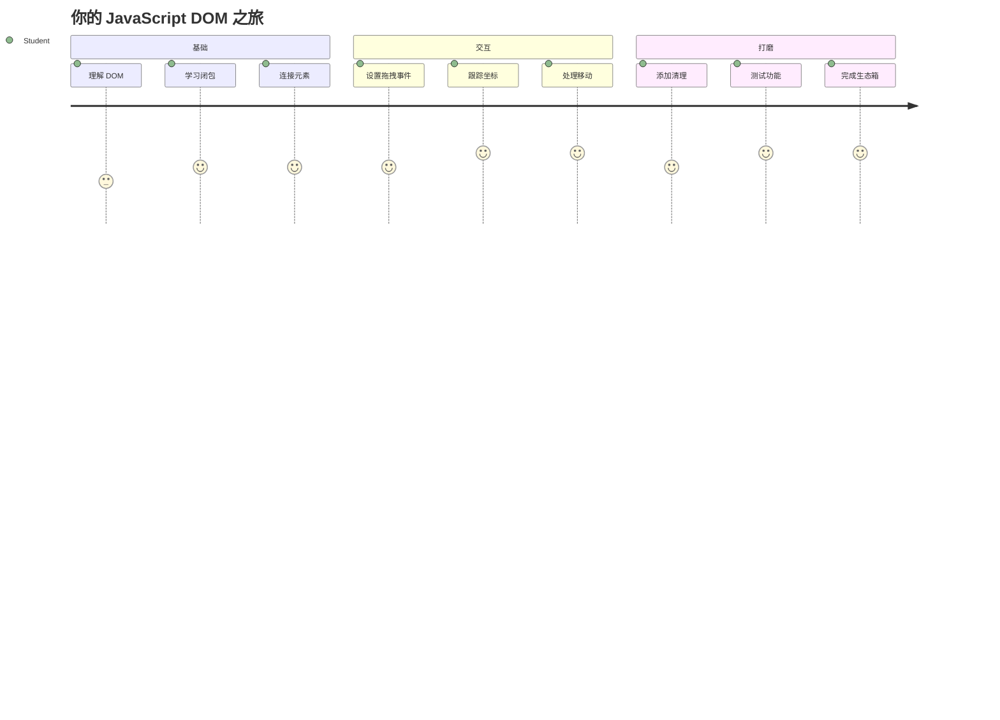
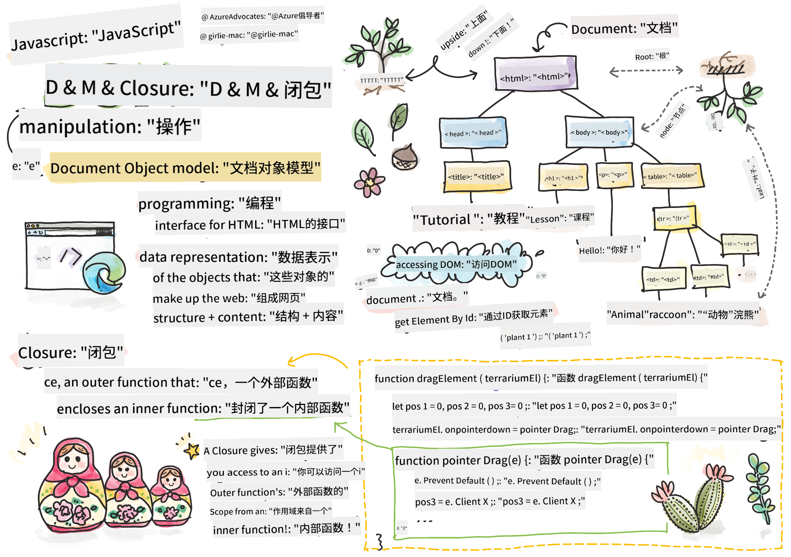
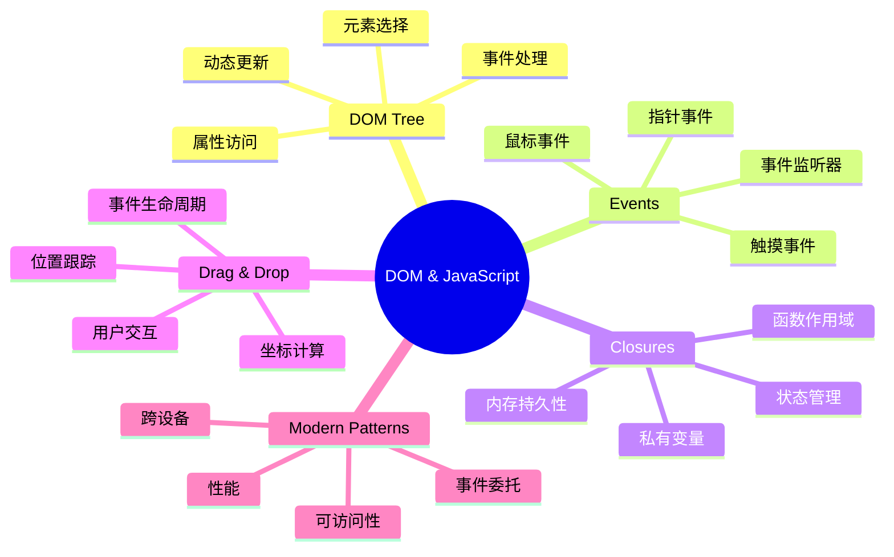
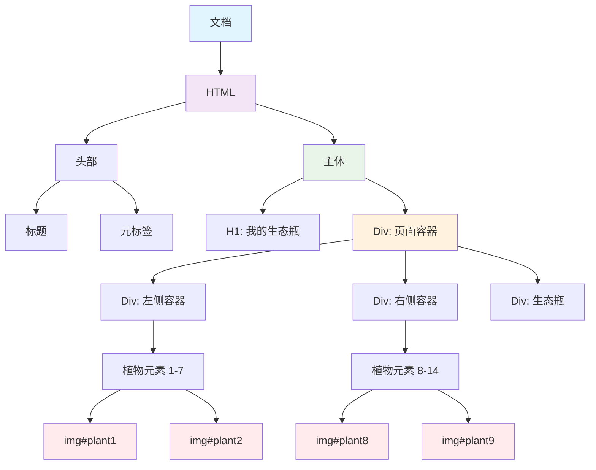
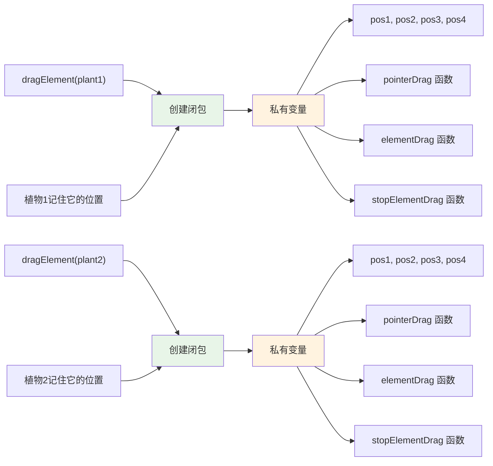
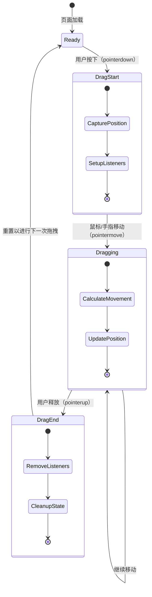
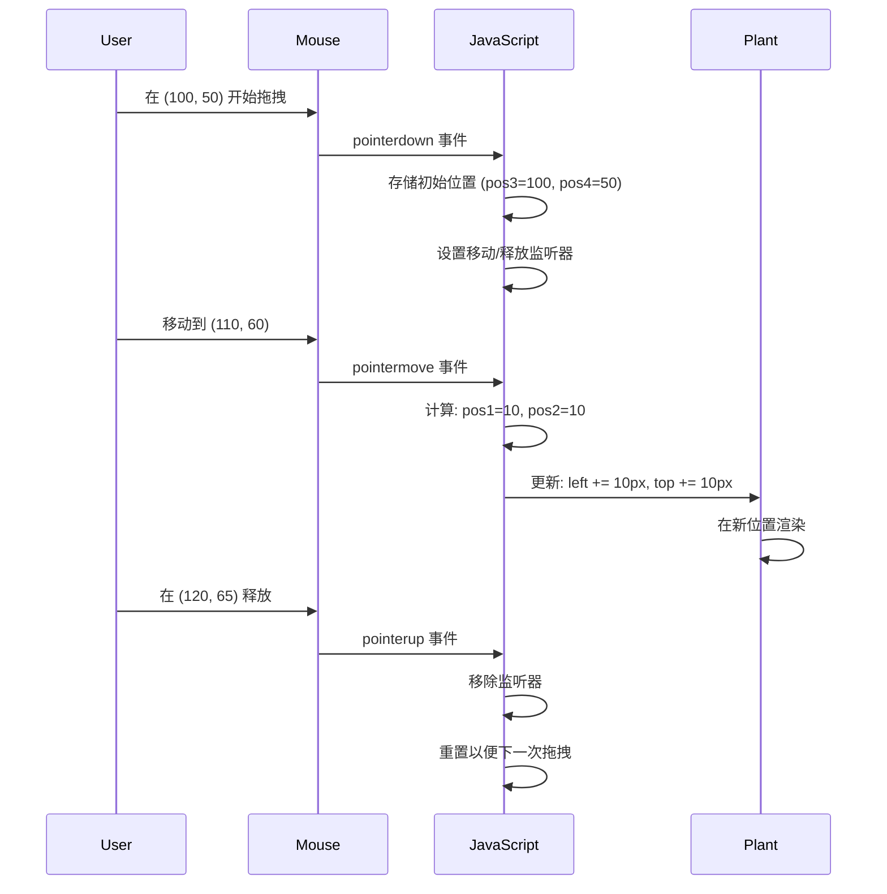
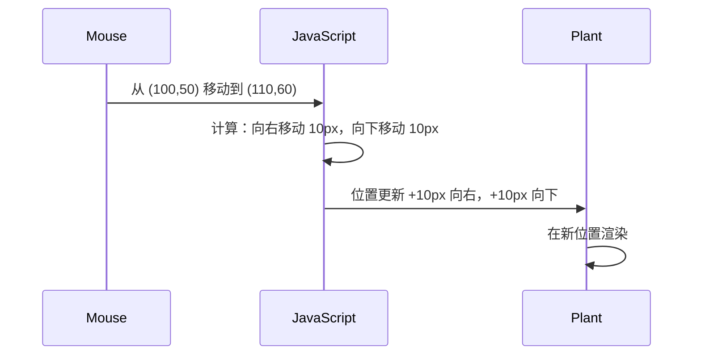
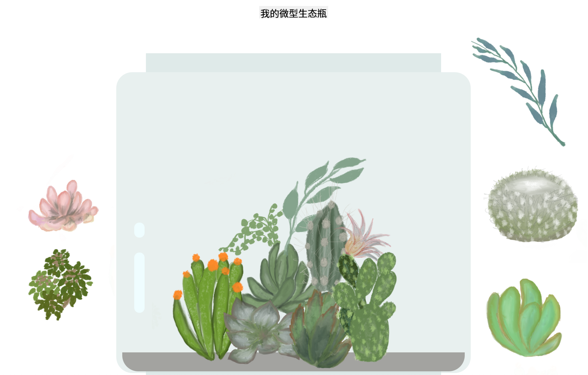
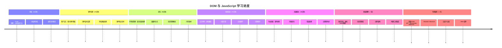

<!--
CO_OP_TRANSLATOR_METADATA:
{
  "original_hash": "973e48ad87d67bf5bb819746c9f8e302",
  "translation_date": "2026-01-06T11:50:49+00:00",
  "source_file": "3-terrarium/3-intro-to-DOM-and-closures/README.md",
  "language_code": "zh"
}
-->
# Terrarium 项目第三部分：DOM 操作与 JavaScript 闭包



> 草图笔记作者：[Tomomi Imura](https://twitter.com/girlie_mac)

欢迎来到网页开发中最具趣味性的部分之一——让页面变得互动！文档对象模型（DOM）就像是你的 HTML 和 JavaScript 之间的一座桥梁，今天我们将用它让你的生态瓶变得栩栩如生。当 Tim Berners-Lee 创建第一款网页浏览器时，他设想了一个可以动态交互的网页世界——而DOM让这个设想成为可能。

我们还将探讨 JavaScript 闭包，起初听起来可能令人生畏。把闭包想象成创建“记忆口袋”，你的函数可以记住重要信息。就像生态瓶中的每株植物都有自己的数据记录来跟踪位置。到本节课结束时，你会明白闭包其实是多么自然且有用。

我们要构建的是一个生态瓶，用户可以将植物拖放到任意位置。你将学习 DOM 操作技术，这些技术支持从拖放文件上传到互动游戏的所有功能。让我们一起赋予你的生态瓶生命吧。


## 课前测验

[课前测验](https://ff-quizzes.netlify.app/web/quiz/19)

## 认识 DOM：通往交互式网页的大门

文档对象模型（DOM）是 JavaScript 与你的 HTML 元素沟通的方式。当浏览器加载 HTML 页面时，会在内存中创建该页面的结构化表示——这就是 DOM。把它想象成一棵家谱树，每个 HTML 元素都是一个成员，JavaScript 可以访问、修改或重新排列它们。

DOM 操作将静态页面转换成交互式网站。每当你看到按钮悬停时变色、内容无需刷新自动更新或元素可拖动时，背后都是 DOM 操作的功劳。




> DOM 及其关联 HTML 标记的表示。来自 [Olfa Nasraoui](https://www.researchgate.net/publication/221417012_Profile-Based_Focused_Crawler_for_Social_Media-Sharing_Websites)

**DOM 的强大之处在于：**
- **提供** 结构化的方法访问页面中的任意元素
- **支持** 无需刷新页面即可动态更新内容
- **允许** 实时响应用户点击和拖动等操作
- **奠定** 现代交互式网页应用的基础

## JavaScript 闭包：创建有组织且强大的代码

[JavaScript 闭包](https://developer.mozilla.org/docs/Web/JavaScript/Closures)就像给函数分配了自己的专属工作空间，拥有持久的记忆。想象加拉帕戈斯群岛上的达尔文雀根据不同环境发展出专门嘴型——闭包也是如此，创建了“记住”特定上下文的专用函数，即便它们的父函数已经执行完毕。

在我们的生态瓶中，闭包帮助每株植物独立记住自己的位置。这个模式在专业 JavaScript 开发中随处可见，是一个值得理解的重要概念。


> 💡 **理解闭包**：闭包是 JavaScript 中的重要话题，许多开发者多年使用后才完全掌握所有理论细节。今天我们专注于实用应用——你将看到闭包在实现交互功能时自然而然出现。理解将随着你观察它们解决实际问题而逐步加深。


> DOM 及其关联 HTML 标记的表示。来自 [Olfa Nasraoui](https://www.researchgate.net/publication/221417012_Profile-Based_Focused_Crawler_for_Social_Media-Sharing_Websites)

本节课，我们将完善交互生态瓶项目，创建 JavaScript 代码让用户能够操作页面上的植物。

## 开始之前：成功准备

你需要之前生态瓶课程中的 HTML 和 CSS 文件——我们将让那个静态设计变得可交互。如果你是首次加入，建议先完成那些课程以获得重要背景。

我们将实现的功能：
- **流畅的拖放操作**，适用于所有生态瓶中的植物
- **坐标跟踪**，让植物记住它们的位置
- **完整的交互界面**，使用纯 JavaScript 实现
- **清晰有序的代码结构**，运用闭包设计模式

## 设置你的 JavaScript 文件

让我们创建使生态瓶具备交互性的 JavaScript 文件。

**步骤 1：创建脚本文件**

在你的生态瓶文件夹中，新建一个名为 `script.js` 的文件。

**步骤 2：将 JavaScript 关联到 HTML**

在你的 `index.html` 文件的 `<head>` 部分添加以下脚本标签：

```html
<script src="./script.js" defer></script>
```

**为什么 `defer` 属性很重要：**
- **确保** JavaScript 脚本等到 HTML 完全加载后再执行
- **防止** JavaScript 访问尚未准备好的元素时出错
- **保证** 所有植物元素可交互
- **相比将脚本放在页面底部，提供更好的性能**

> ⚠️ **重要提示**：`defer` 属性避免了常见的时序问题。没有它，JavaScript 可能在 HTML 元素加载前就开始访问，引发错误。

---

## 关联 JavaScript 与 HTML 元素

在让元素可拖动之前，JavaScript 需要定位它们在 DOM 中的位置。想象这像图书馆的目录系统——拿到适合的目录号，才能准确找到你需要的那本书并浏览其内容。

我们将使用 `document.getElementById()` 方法建立这些连接。它就像精准的文件系统——你提供 ID，它就能准确找到 HTML 中对应元素。

### 为所有植物启用拖动功能

将以下代码添加到你的 `script.js` 文件中：

```javascript
// 为所有14种植物启用拖动功能
dragElement(document.getElementById('plant1'));
dragElement(document.getElementById('plant2'));
dragElement(document.getElementById('plant3'));
dragElement(document.getElementById('plant4'));
dragElement(document.getElementById('plant5'));
dragElement(document.getElementById('plant6'));
dragElement(document.getElementById('plant7'));
dragElement(document.getElementById('plant8'));
dragElement(document.getElementById('plant9'));
dragElement(document.getElementById('plant10'));
dragElement(document.getElementById('plant11'));
dragElement(document.getElementById('plant12'));
dragElement(document.getElementById('plant13'));
dragElement(document.getElementById('plant14'));
```

**这段代码完成了以下任务：**
- **定位** DOM 中每个植物元素，基于它们独特的 ID
- **获取** 每个 HTML 元素的 JavaScript 引用
- **将** 每个元素传入 `dragElement` 函数（我们接着会创建）
- **为** 所有植物准备拖放交互功能
- **将** HTML 结构与 JavaScript 功能连接起来

> 🎯 **为什么用 ID 而不用类？** ID 为特定元素提供唯一标识，而 CSS 类用于样式分组。当 JavaScript 需要操作单个元素时，ID 提供精准且高效的定位。

> 💡 **实用小贴士**：注意我们为每株植物单独调用了 `dragElement()`。这种方式确保每个植物拥有独立的拖动行为，是流畅交互的关键。

### 🔄 **教学小结**
**DOM 连接理解检查**：在继续拖动功能前，确认你能：
- ✅ 解释 `document.getElementById()` 如何定位 HTML 元素
- ✅ 理解为何每个植物需要唯一 ID
- ✅ 描述 `defer` 属性在 script 标签中的作用
- ✅ 识别 JavaScript 与 HTML 如何通过 DOM 关联

**快速自测**：如果两个元素拥有相同 ID，会发生什么？为何 `getElementById()` 只返回一个元素？
*回答：ID 应该唯一；如果重复，只返回第一个匹配元素*

---

## 构建拖拽元素的闭包

现在我们创建拖动功能的核心：一个闭包，负责管理每株植物的拖动行为。这个闭包内部包含多个函数，协同工作以追踪鼠标移动并更新元素位置。

闭包非常适合该任务，因为它们允许创建“私有”变量，在函数调用之间保持状态，使每个植物拥独立的坐标跟踪系统。

### 用简单例子理解闭包

用一个简单示例演示闭包：

```javascript
function createCounter() {
    let count = 0; // 这就像是一个私有变量
    
    function increment() {
        count++; // 内部函数记住了外部变量
        return count;
    }
    
    return increment; // 我们返回内部函数
}

const myCounter = createCounter();
console.log(myCounter()); // 1
console.log(myCounter()); // 2
```

**该闭包模式的工作机制：**
- **创建** 私有的 `count` 变量，仅存于该闭包内
- **内部函数** 可访问并修改外部变量（闭包机制）
- **返回** 内部函数时，它依然保持对私有数据的连接
- **即便** `createCounter()` 调用结束，`count` 依然存在并记忆当前值

### 为什么闭包适合拖动功能

对于我们的生态瓶，每株植物需要记住它当前位置坐标。闭包是完美方案：

**本项目的关键优势：**
- **保持** 每株植物独立的私有位置变量
- **在拖动事件间** 保持坐标数据
- **避免** 不同可拖动元素间变量冲突
- **创建** 干净有序的代码结构

> 🎯 **学习目标**：你不必现在完全掌握闭包的所有细节。专注于理解它们如何帮助组织代码、维护拖动功能状态。


### 创建 dragElement 函数

接下来编写处理拖动逻辑的主函数。将此函数添加到植物元素声明代码之后：

```javascript
function dragElement(terrariumElement) {
    // 初始化位置跟踪变量
    let pos1 = 0,  // 之前的鼠标X位置
        pos2 = 0,  // 之前的鼠标Y位置
        pos3 = 0,  // 当前的鼠标X位置
        pos4 = 0;  // 当前的鼠标Y位置
    
    // 设置初始拖动事件监听器
    terrariumElement.onpointerdown = pointerDrag;
}
```

**理解位置追踪系统：**
- **`pos1` 和 `pos2`**：存储旧鼠标位置和新鼠标位置的差值
- **`pos3` 和 `pos4`**：追踪当前鼠标坐标
- **`terrariumElement`**：特定的植物元素，我们要让它可拖动
- **`onpointerdown`**：触发用户开始拖动的事件

**闭包模式运作方式：**
- **为每株植物** 创建私有位置变量
- **在拖动生命周期中** 保持这些变量
- **确保** 每株植物独立追踪自身坐标
- **通过 `dragElement` 函数** 提供清晰接口

### 为什么使用指针事件？

你可能好奇为何用 `onpointerdown`而不是更熟悉的 `onclick`。原因如下：

| 事件类型 | 适用场景 | 缺点 |
|------------|----------|-------------|
| `onclick` | 简单按钮点击 | 只能处理点击和释放，无法拖动 |
| `onpointerdown` | 鼠标和触摸均适用 | 新技术，但现已广泛支持 |
| `onmousedown` | 仅限桌面鼠标 | 移动端用户体验不足 |

**指针事件为何对我们构建的功能完美契合：**
- **适用于** 鼠标、手指甚至触控笔
- **在** 笔记本、平板和手机上体验一致
- **负责** 拖动实际过程（不仅是点击）
- **打造** 用户期望的流畅现代体验

> 💡 **面向未来**：指针事件是处理用户交互的现代方法。无需为鼠标和触控分别写代码，二者兼得。很棒，对吧？

### 🔄 **教学小结**
**事件处理理解测试**：停顿确认你已理解事件：
- ✅ 为什么用指针事件而非鼠标事件？
- ✅ 闭包变量如何在函数调用间持续？
- ✅ `preventDefault()` 在流畅拖动中起什么作用？
- ✅ 为什么监听器绑定到 document，而非直接绑定元素？

**现实连接**：思考你每天用到的拖放界面：
- **文件上传**：将文件拖入浏览器窗口
- **看板工具**：任务列间拖动卡片
- **图片库**：调整图片排序
- **移动端界面**：触屏滑动和拖动操作

---

## pointerDrag 函数：捕获拖动开始

当用户按下植物（无论鼠标点击还是手指触摸），`pointerDrag` 函数启动。它捕获初始坐标并搭建拖动系统。

将该函数添加到 `dragElement` 闭包内，紧接 `terrariumElement.onpointerdown = pointerDrag;` 行之后：

```javascript
function pointerDrag(e) {
    // 防止默认的浏览器行为（如文本选择）
    e.preventDefault();
    
    // 捕捉初始的鼠标/触摸位置
    pos3 = e.clientX;  // 拖动开始时的 X 坐标
    pos4 = e.clientY;  // 拖动开始时的 Y 坐标
    
    // 设置拖动过程的事件监听器
    document.onpointermove = elementDrag;
    document.onpointerup = stopElementDrag;
}
```

**步骤说明：**
- **阻止** 浏览器默认行为，避免干扰拖动
- **记录** 用户开始拖动的准确坐标
- **建立** 后续拖动移动事件监听器
- **准备** 跟踪鼠标/手指在整个文档上的移动

### 理解事件阻止

`e.preventDefault()` 是保证拖动流畅的关键所在：

**不阻止的话，浏览器可能会：**
- **选中文本**，导致拖动时页面出现不适视觉
- **触发** 右键上下文菜单
- **干扰** 我们自定义的拖动行为
- **造成** 拖动过程中的视觉异常

> 🔍 **实验**：完成本节后，试试去掉 `e.preventDefault()`，观察拖动体验如何变化。你将直观感受到该代码的重要性！

### 坐标追踪系统

`e.clientX` 和 `e.clientY` 属性提供精准鼠标/触摸坐标：

| 属性 | 测量内容 | 用途 |
|----------|------------------|----------|
| `clientX` | 相对于视口的水平位置 | 跟踪左右移动 |
| `clientY` | 相对于视口的垂直位置 | 跟踪上下移动 |
**理解这些坐标：**
- **提供**像素级精准定位信息
- **随着用户移动指针**实时更新
- **在不同屏幕尺寸和缩放级别**下保持一致
- **实现**流畅且响应迅速的拖拽交互

### 设置文档级事件监听器

注意我们把移动和停止事件绑定到整个 `document`，而不仅仅是植物元素：

```javascript
document.onpointermove = elementDrag;
document.onpointerup = stopElementDrag;
```

**为什么绑定到 document：**
- **即使鼠标离开植物元素也能继续跟踪**
- **防止用户快速移动时拖拽中断**
- **提供整个屏幕范围内的流畅拖拽**
- **处理光标移出浏览器窗口的边缘情况**

> ⚡ **性能提示**：拖拽停止时，我们会清理这些文档级监听器以避免内存泄漏和性能问题。

## 完成拖拽系统：移动与清理

现在我们将添加剩余两个函数，分别处理实际拖动移动和拖拽停止时的清理。这些函数协同工作，实现花园中植物的平滑、响应式移动。

### elementDrag 函数：跟踪移动

在 `pointerDrag` 函数的闭括号之后添加 `elementDrag` 函数：

```javascript
function elementDrag(e) {
    // 计算自上次事件以来移动的距离
    pos1 = pos3 - e.clientX;  // 水平移动距离
    pos2 = pos4 - e.clientY;  // 垂直移动距离
    
    // 更新当前位置跟踪
    pos3 = e.clientX;  // 新的当前 X 位置
    pos4 = e.clientY;  // 新的当前 Y 位置
    
    // 将移动应用到元素的位置
    terrariumElement.style.top = (terrariumElement.offsetTop - pos2) + 'px';
    terrariumElement.style.left = (terrariumElement.offsetLeft - pos1) + 'px';
}
```

**理解坐标数学：**
- **`pos1` 和 `pos2`**：计算鼠标自上次更新以来移动的距离
- **`pos3` 和 `pos4`**：存储当前鼠标位置用于下次计算
- **`offsetTop` 和 `offsetLeft`**：获取元素当前在页面上的位置
- **减法逻辑**：根据鼠标移动距离同步移动元素


**移动计算细节说明：**
1. **测量**鼠标旧位置和新位置的差值
2. **计算**根据鼠标移动量应移动元素的距离
3. **实时更新**元素的 CSS 位置属性
4. **存储**新位置为下一次移动计算的基线

### 数学的视觉表示


### stopElementDrag 函数：清理工作

在 `elementDrag` 函数闭括号后添加清理函数：

```javascript
function stopElementDrag() {
    // 移除文档级别的事件监听器
    document.onpointerup = null;
    document.onpointermove = null;
}
```

**为什么清理至关重要：**
- **防止遗留事件监听器导致内存泄漏**
- **用户松开植物时停止拖拽行为**
- **允许其他元素独立拖拽**
- **为下一次拖拽操作重置系统**

**不清理会带来什么问题：**
- 拖拽停止后事件监听器依旧运行
- 未使用监听器堆积导致性能下降
- 交互其他元素时出现异常行为
- 浏览器资源被无用事件处理占用

### 理解 CSS 定位属性

我们的拖拽系统操作两个关键 CSS 属性：

| 属性 | 控制内容 | 用途 |
|----------|------------------|---------------|
| `top` | 距顶部边缘距离 | 拖拽过程中的垂直定位 |
| `left` | 距左侧边缘距离 | 拖拽过程中的水平定位 |

**关于 offset 属性的关键点：**
- **`offsetTop`**：当前相对于定位父元素顶部的距离
- **`offsetLeft`**：当前相对于定位父元素左侧的距离
- **定位上下文**：这些数值相对于最近的定位祖先元素
- **实时更新**：当我们修改 CSS 属性时立即生效

> 🎯 **设计理念**：该拖拽系统故意保持灵活——没有“放置区”或限制。用户可以将植物放置于任意位置，完全自由设计他们的花园。

## 整合：完整的拖拽系统

恭喜！你刚刚用原生 JavaScript 构建了一个复杂的拖放系统。你完整的 `dragElement` 函数包含强大的闭包控件，实现：

**闭包的功能点：**
- **为每个植物独立维护私有位置变量**
- **管理从开始到结束的完整拖拽生命周期**
- **提供整个屏幕范围内顺畅且响应迅速的移动**
- **正确清理资源避免内存泄漏**
- **创建直观且富有创意的花园设计界面**

### 测试你的交互式花园

现在测试你的交互式花园吧！在浏览器打开 `index.html`，试试这些操作：

1. **点击并按住**任意植物开始拖动
2. **移动鼠标或手指**，观察植物平滑跟随
3. **松开**以放置植物到新位置
4. **尝试不同布局**，探索界面可能性

🥇 **成就**：你创建了一个完整的交互式网页应用，运用了专业开发者每日使用的核心概念。这个拖放功能与文件上传、看板（kanban）和其他交互界面背后的原理相同。

### 🔄 **教学检查点**
**完整系统理解**：验证你对整个拖拽系统的掌握：
- ✅ 闭包如何为每棵植物维护独立状态？
- ✅ 为什么坐标计算对于流畅移动是必需的？
- ✅ 忘记清理事件监听器会有什么后果？
- ✅ 这种模式如何扩展到更复杂的交互？

**代码质量反思**：检查你的完整方案：
- **模块化设计**：每棵植物拥有自己的闭包实例
- **事件效率**：正确设置和清理监听器
- **跨设备支持**：兼容桌面和移动端
- **性能意识**：无内存泄漏或冗余计算



---

## GitHub Copilot 代理挑战 🚀

使用代理模式完成以下挑战：

**描述：** 通过添加重置功能，增强花园项目，使所有植物能够平滑动画回到它们的初始位置。

**提示：** 创建一个重置按钮，点击时使用 CSS 过渡动画将所有植物平滑移回侧边栏的原始位置。函数应在页面加载时存储初始位置，点击重置按钮时以 1 秒动画过渡回这些位置。

在此了解更多关于 [代理模式](https://code.visualstudio.com/blogs/2025/02/24/introducing-copilot-agent-mode)。

## 🚀 额外挑战：提升技能

准备好将你的花园带到新水平了吗？尝试实现这些增强功能：

**创意扩展：**
- **双击**植物使其置于最前端（z-index 操作）
- **添加视觉反馈**，例如悬停时轻微发光
- **实现边界限制**，防止植物被拖出花园范围
- **创建保存功能**，使用 localStorage 记住植物位置
- **添加音效**，为拾取和放置植物播放声音

> 💡 **学习机会**：每个挑战都将教你 DOM 操作、事件处理和用户体验设计的新内容。

## 课后测验

[课后测验](https://ff-quizzes.netlify.app/web/quiz/20)

## 复习与自学：深化理解

你已掌握 DOM 操作和闭包基础，但总有提升空间！以下是拓展知识与技能的路径。

### 其他拖放方案

我们使用了指针事件来获得最大灵活性，但网页开发提供多种方案：

| 方案 | 适用场景 | 学习价值 |
|----------|----------|----------------|
| [HTML 拖放 API](https://developer.mozilla.org/docs/Web/API/HTML_Drag_and_Drop_API) | 文件上传，正式拖放区 | 理解浏览器原生功能 |
| [触摸事件](https://developer.mozilla.org/docs/Web/API/Touch_events) | 移动端交互 | 移动优先开发模式 |
| CSS `transform` 属性 | 流畅动画 | 性能优化技术 |

### 进阶 DOM 操作主题

**学习下一步：**
- **事件委托**：高效处理多个元素事件
- **Intersection Observer**：检测元素进入/离开视口
- **Mutation Observer**：监控 DOM 结构变化
- **Web Components**：创建可复用、封装的 UI 组件
- **虚拟 DOM 概念**：理解框架如何优化 DOM 更新

### 持续学习必备资源

**技术文档：**
- [MDN 指针事件指南](https://developer.mozilla.org/docs/Web/API/Pointer_events) - 全面指针事件参考
- [W3C 指针事件规范](https://www.w3.org/TR/pointerevents1/) - 官方标准文档
- [JavaScript 闭包详解](https://developer.mozilla.org/docs/Web/JavaScript/Closures) - 高级闭包模式

**浏览器兼容性：**
- [CanIUse.com](https://caniuse.com/) - 跨浏览器特性支持查询
- [MDN 浏览器兼容数据](https://github.com/mdn/browser-compat-data) - 详细兼容信息

**实践机会：**
- **构建**一款使用类似拖拽机制的拼图游戏
- **创建**带拖放任务管理的看板
- **设计**一个可拖拽照片排列的图片库
- **尝试**移动端触摸手势交互

> 🎯 **学习策略**：实践是巩固概念的最佳途径。尝试构建各种可拖拽界面，每个项目都会教你新的用户交互和 DOM 操作技巧。

### ⚡ **接下来 5 分钟你可以做什么**
- [ ] 打开浏览器开发者工具，在控制台输入 `document.querySelector('body')`
- [ ] 试着用 `innerHTML` 或 `textContent` 修改网页文本
- [ ] 给网页上的任意按钮或链接添加点击事件监听器
- [ ] 使用 Elements 面板查看 DOM 树结构

### 🎯 **本小时你能完成的任务**
- [ ] 完成课后测验并复习 DOM 操作概念
- [ ] 创建响应用户点击的交互网页
- [ ] 练习不同事件类型的事件处理（点击、悬停、按键）
- [ ] 使用 DOM 操作构建简单待办清单或计数器
- [ ] 探索 HTML 元素与 JavaScript 对象的关系

### 📅 **你的为期一周的 JavaScript 学习计划**
- [ ] 完成交互式花园项目，包含拖放功能
- [ ] 掌握事件委托以提升事件处理效率
- [ ] 了解事件循环与异步 JavaScript
- [ ] 通过构建具私有状态的模块练习闭包
- [ ] 学习现代 DOM API，如 Intersection Observer
- [ ] 尝试无框架构建交互组件

### 🌟 **你的为期一个月的 JavaScript 精通计划**
- [ ] 使用原生 JavaScript 创建复杂单页应用
- [ ] 学习现代框架（React、Vue 或 Angular），并对比原生日 DOM
- [ ] 参与开源 JavaScript 项目贡献代码
- [ ] 掌握高级概念，如 Web Components 和自定义元素
- [ ] 构建高性能网页应用，优化 DOM 模式
- [ ] 教授他人 DOM 操作与 JavaScript 基础知识

## 🎯 你的 JavaScript DOM 精通时间线


### 🛠️ 你的 JavaScript 工具箱总结

完成本课后，你已经掌握：
- **DOM 精通**：元素选取、属性操作及树结构导航
- **事件专业**：跨设备指针事件交互处理
- **闭包理解**：私有状态管理与函数持久性
- **交互系统**：从零实现完整拖拽功能
- **性能意识**：正确事件清理与内存管理
- **现代模式**：专业开发中应用的代码组织技术
- **用户体验**：创建直观、响应迅速的界面

**获得的专业技能**：你构建的功能使用了与以下相同技术：
- **Trello/看板**：卡片拖拽跨列操作
- **文件上传系统**：拖放文件处理
- **图片库**：照片排列界面
- **移动应用**：基于触摸的交互模式

**下一步**：你已准备好学习如 React、Vue 或 Angular 等基于这些 DOM 基础概念构建的现代框架！

## 任务

[继续练习 DOM](assignment.md)

---

<!-- CO-OP TRANSLATOR DISCLAIMER START -->
**免责声明**：
本文件使用 AI 翻译服务 [Co-op Translator](https://github.com/Azure/co-op-translator) 进行翻译。尽管我们力求准确，但请注意自动翻译可能包含错误或不准确之处。原始语言的原文应被视为权威来源。对于重要信息，建议使用专业人工翻译。对于因使用本翻译而引起的任何误解或误释，我们不承担任何责任。
<!-- CO-OP TRANSLATOR DISCLAIMER END -->