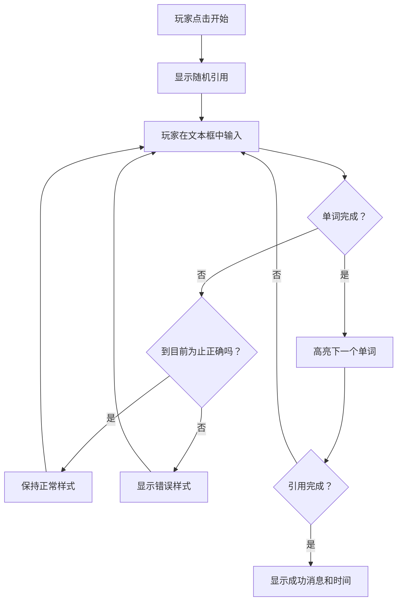
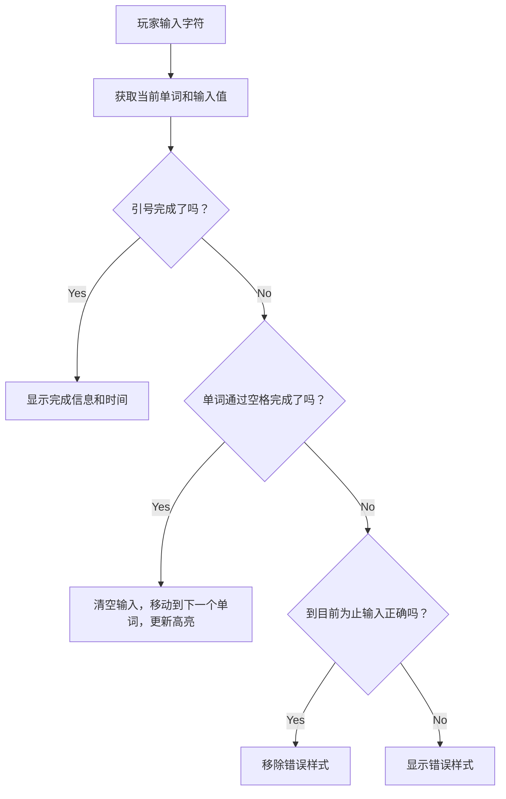
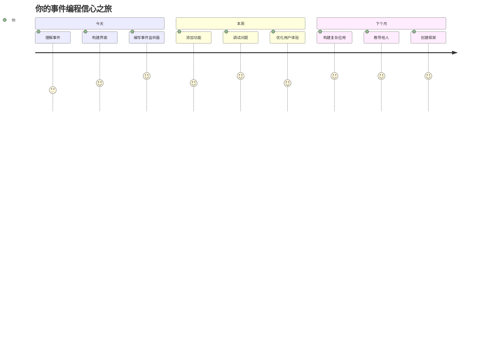

<!--
CO_OP_TRANSLATOR_METADATA:
{
  "original_hash": "da8bc72041a2bb3826a54654ee1a8844",
  "translation_date": "2026-01-06T11:47:12+00:00",
  "source_file": "4-typing-game/typing-game/README.md",
  "language_code": "zh"
}
-->
# 使用事件创建游戏

你有没有想过网站是如何知道你点击了按钮或在文本框中输入的？这就是事件驱动编程的魔力！还有什么比通过构建一个能够响应你每一次按键的打字速度游戏来学习这项关键技能更好的方法呢。

你将亲眼见证网页浏览器如何“与”你的JavaScript代码“对话”。每当你点击、输入或移动鼠标时，浏览器都会向你的代码发送小信息（我们称之为事件），而你来决定如何响应！

完成本教程后，你将创建一个能够跟踪你的打字速度和准确率的真实打字游戏。更重要的是，你将理解支撑每个互动网站的基本概念。让我们开始吧！

## 课前测验

[课前测验](https://ff-quizzes.netlify.app/web/quiz/21)

## 事件驱动编程

想想你最喜欢的应用或网站——是什么让它感觉生动且响应灵敏？这全在于它如何对你的操作做出反应！每次点击、敲击、滑动或按键都会产生我们所说的“事件”，真正的网页开发魔力就在这里。

让网页编程如此有趣的是：我们永远不知道别人什么时候会点击按钮或开始在文本框中输入。他们可能马上点击，等待五分钟，甚至可能从不点击！这种不可预测性意味着我们需要用不同的思路写代码。

我们不再写那种像食谱一样自上而下执行的代码，而是写一段坐在那里耐心等待事情发生的代码。这有点像19世纪的电报操作员，坐在设备旁，准备在信息通过电线传来时立刻响应。

那么什么是“事件”呢？简单来说，它就是发生的事情！你点击按钮——那是一个事件。你输入一个字母——那是一个事件。你移动鼠标——又是一个事件。

事件驱动编程让我们可以设置代码去“监听”和响应这些事件。我们创建称为**事件监听器**的特殊函数，它们耐心等待特定事件发生，然后在事件发生时立即行动。

把事件监听器想象成代码的门铃。你设置门铃（`addEventListener()`），告诉它要监听什么声音（比如“点击”或“按键”），然后指定有人按响时要执行什么（你自定义的函数）。

**事件监听器的工作原理：**
- **监听**用户的特定操作，如点击、按键或鼠标移动
- **执行**在指定事件发生时你的自定义代码
- **即时响应**用户交互，创造无缝体验
- **支持**对同一元素使用多个监听器处理不同事件

> **注意：**有很多创建事件监听器的方法。你可以使用匿名函数，也可以创建命名函数。可以使用各种快捷方式，比如设置`click`属性，或使用`addEventListener()`。本练习中我们重点使用`addEventListener()`和匿名函数，因为这是网络开发者最常用的方法。它也是最灵活的，适用于所有事件，事件名称可作为参数传入。

### 常见事件

虽然浏览器提供了数十种不同事件可供监听，但大多数互动应用只依赖其中几种核心事件。理解这些核心事件能为你构建复杂用户交互奠定基础。

有[数十种事件](https://developer.mozilla.org/docs/Web/Events)可供你在创建应用时监听。基本上，用户在页面上所做的任何操作都会触发事件，赋予你强大能力确保他们得到理想的体验。幸运的是，通常只需少数几个事件。下面是几个常用事件（包括我们在游戏中会用到的两个）：

| 事件 | 描述 | 常见用例 |
|-------|-------------|------------------|
| `click` | 用户点击了某个元素 | 按钮、链接、互动元素 |
| `contextmenu` | 用户点击了鼠标右键 | 自定义右键菜单 |
| `select` | 用户选中了文本 | 文本编辑、复制操作 |
| `input` | 用户输入了文本 | 表单验证、实时搜索 |

**理解这些事件类型：**
- **在用户与页面特定元素交互时触发**
- **通过事件对象提供有关用户行为的详细信息**
- **使你能创建响应式、互动性强的网页应用**
- **在不同浏览器和设备上表现一致**

## 创建游戏

既然了解了事件的工作原理，让我们用所学知识实践，创造点有用的东西。我们将创建一个打字速度游戏，演示事件处理的同时，帮助你培养一项重要的开发者技能。

我们要制作一个游戏，探索JavaScript中事件的工作方式。游戏将考验玩家的打字技能，而这正是所有开发者都应具备的一项被低估的技能。有趣的是，我们今天使用的QWERTY键盘布局其实是在1870年代为打字机设计的——良好的打字技能对程序员来说仍然非常宝贵！游戏的大致流程如下：


**游戏的工作方式：**
- **玩家点击开始按钮时启动，显示随机引用文本**
- **实时逐词追踪玩家的输入进度**
- **高亮当前应输入的单词以帮助集中注意力**
- **为输入错误提供即时视觉反馈**
- **引用完成时计算并显示总用时**

让我们一起搭建游戏，学习事件！

### 文件结构

在开始编码之前，让我们先理清文件结构！从一开始就保持文件结构清晰，会让你避免日后困扰，使项目更为专业。😊

我们将保持简单，仅使用三个文件：`index.html`负责页面结构，`script.js`包含所有游戏逻辑，`style.css`负责美化页面。这是驱动大部分网页的经典组合！

**在控制台或终端窗口中执行以下命令，创建新文件夹以开始工作：**

```bash
# Linux 或 macOS
mkdir typing-game && cd typing-game

# Windows
md typing-game && cd typing-game
```

**这些命令执行了以下操作：**
- **创建**名为`typing-game`的新目录存放项目文件
- **自动切换**至新建目录
- **为游戏开发设置**一个干净的工作空间

**打开 Visual Studio Code：**

```bash
code .
```

**该命令执行：**
- **在当前目录**启动 Visual Studio Code
- **打开**你的项目文件夹
- **提供**所有开发工具的访问

**在 Visual Studio Code 中为该文件夹添加三个文件，命名如下：**
- `index.html` - 包含游戏的结构和内容
- `script.js` - 处理所有游戏逻辑和事件监听
- `style.css` - 定义视觉外观和样式

## 创建用户界面

现在让我们构建游戏进行的舞台！把它想象成设计飞船的控制面板——确保玩家所需的一切都在预期位置。

让我们确定游戏到底需要哪些元素。如果你在玩打字游戏，会想在屏幕上看到什么？我们需要：

| UI 元素 | 目的 | HTML 元素 |
|------------|---------|-------------|
| 引用显示区 | 展示要打的文本 | `<p>`，`id="quote"` |
| 消息区 | 显示状态和成功信息 | `<p>`，`id="message"` |
| 文本输入框 | 玩家输入引用的地方 | `<input>`，`id="typed-value"` |
| 开始按钮 | 开始游戏 | `<button>`，`id="start"` |

**UI结构要点：**
- **内容逻辑地组织**从上到下
- **元素分配**唯一 ID 供 JavaScript 访问
- **提供**清晰的视觉层次，提升用户体验
- **包含**语义化的 HTML 元素以增强无障碍支持

以上每个元素都需分配 ID，方便我们用JavaScript操作。我们还会添加对即将创建的CSS和JavaScript文件的引用。

新建一个名为`index.html`的文件，添加如下HTML：

```html
<!-- inside index.html -->
<html>
<head>
  <title>Typing game</title>
  <link rel="stylesheet" href="style.css">
</head>
<body>
  <h1>Typing game!</h1>
  <p>Practice your typing skills with a quote from Sherlock Holmes. Click **start** to begin!</p>
  <p id="quote"></p> <!-- This will display our quote -->
  <p id="message"></p> <!-- This will display any status messages -->
  <div>
    <input type="text" aria-label="current word" id="typed-value" /> <!-- The textbox for typing -->
    <button type="button" id="start">Start</button> <!-- To start the game -->
  </div>
  <script src="script.js"></script>
</body>
</html>
```

**这个HTML结构实现了：**
- **在`<head>`中引入CSS样式表用于美化**
- **创建清晰的标题和用户指引**
- **建立带有特定ID的占位段落以显示动态内容**
- **包含带无障碍属性的输入框**
- **设置启动游戏的按钮**
- **在文档末尾加载JavaScript文件以优化性能**

### 启动应用程序

开发过程中频繁测试应用，能让你提前发现问题，并实时看到进展。Live Server 是一个宝贵的工具，每次保存时自动刷新浏览器，使开发更高效。

采用迭代开发最为理想，方便观察效果。让我们启动应用。有一个绝佳的 Visual Studio Code 扩展叫做[Live Server](https://marketplace.visualstudio.com/items?itemName=ritwickdey.LiveServer&WT.mc_id=academic-77807-sagibbon)，它既能本地托管应用，也会每次保存自动刷新浏览器。

**访问链接并点击安装[Live Server](https://marketplace.visualstudio.com/items?itemName=ritwickdey.LiveServer&WT.mc_id=academic-77807-sagibbon)：**

**安装时会：**
- **提示**浏览器打开 Visual Studio Code
- **引导**你完成扩展安装过程
- **可能需要**重启 Visual Studio Code 以完成安装

**安装完成后，在 VS Code 中按 Ctrl-Shift-P（或 Cmd-Shift-P）打开命令面板：**

**命令面板的作用：**
- **快速访问**VS Code所有命令
- **边输边搜**命令
- **节省时间**使用快捷键加快开发

**输入“Live Server: Open with Live Server”：**

**Live Server 功能：**
- **启动**一个项目本地开发服务器
- **在保存文件时**自动刷新浏览器
- **通过本地地址**（通常是`localhost:5500`）提供访问

**打开浏览器并访问 `https://localhost:5500`：**

你现在应看到你创建的页面了！让我们添加一些功能。

## 添加 CSS

现在让界面美观起来！视觉反馈从计算机早期时代起就是用户界面的关键。上世纪80年代，研究发现即时视觉反馈极大提升用户效率并减少错误。正是我们要实现的。

游戏需要明确告知发生了什么。玩家应立即知道当前应该打哪个单词，若输入错误，也能立刻察觉。让我们来做一些简单却有效的样式设计：

新建`style.css`文件，添加以下内容：

```css
/* inside style.css */
.highlight {
  background-color: yellow;
}

.error {
  background-color: lightcoral;
  border: red;
}
```

**理解这些CSS类：**
- **通过黄色背景高亮**当前单词，清晰指引焦点
- **输入错误时**使用浅珊瑚色背景提示
- **即时反馈**用户输入，且不打断打字流程
- **采用有对比度的颜色**提升可访问性和视觉沟通

✅ CSS布局可以自由发挥。花些时间让页面更美观：

- 选择不同字体
- 给标题配色
- 调整元素大小

## JavaScript

接下来就是精彩的部分了！🎉 我们已经有了HTML结构和CSS样式，但此时我们的游戏就像一辆漂亮但没有引擎的车。JavaScript就是这台引擎——它让一切真正运作、对玩家操作做出响应。

这里你将看到你创作的作品活起来。我们会逐步实现，避免让人感到吃力：

| 步骤 | 目的 | 学习内容 |
|------|---------|------------------|
| [创建常量](../../../../4-typing-game/typing-game) | 设置引用文本和DOM引用 | 变量管理和DOM选择 |
| [绑定开始游戏事件监听](../../../../4-typing-game/typing-game) | 处理游戏初始化 | 事件处理和UI更新 |
| [绑定输入监听事件](../../../../4-typing-game/typing-game) | 实时处理用户输入 | 输入验证和动态反馈 |

**这种结构化方法帮助你：**
- **合理组织**代码，易于管理
- **渐进构建**功能，方便调试
- **掌握**应用中各部分如何协作
- **创造**可复用模式，助力未来项目

但首先，创建一个名为`script.js`的新文件。

### 添加常量

在动手之前，先收集所有资源！就像NASA任务控制中心在发射前搭建所有监控系统一样，事先准备好一切更便捷。这避免日后到处找东西，也减少拼写错误。

我们首先需要设置：

| 数据类型 | 目的 | 示例 |
| 引用数组 | 存储游戏中所有可能的引用 | `['Quote 1', 'Quote 2', ...]` |
| 单词数组 | 将当前引用拆分成单个单词 | `['When', 'you', 'have', ...]` |
| 单词索引 | 跟踪玩家正在输入的单词 | `0, 1, 2, 3...` |
| 开始时间 | 计算计分的经过时间 | `Date.now()` |

**我们还需要对 UI 元素的引用：**
| 元素 | ID | 用途 |
|---------|----|---------|
| 文本输入 | `typed-value` | 玩家输入的地方 |
| 引用展示 | `quote` | 显示要输入的引用 |
| 消息区域 | `message` | 显示状态更新 |

```javascript
// 在 script.js 内部
// 我们所有的引用
const quotes = [
    'When you have eliminated the impossible, whatever remains, however improbable, must be the truth.',
    'There is nothing more deceptive than an obvious fact.',
    'I ought to know by this time that when a fact appears to be opposed to a long train of deductions it invariably proves to be capable of bearing some other interpretation.',
    'I never make exceptions. An exception disproves the rule.',
    'What one man can invent another can discover.',
    'Nothing clears up a case so much as stating it to another person.',
    'Education never ends, Watson. It is a series of lessons, with the greatest for the last.',
];
// 存储单词列表和玩家当前输入的单词索引
let words = [];
let wordIndex = 0;
// 起始时间
let startTime = Date.now();
// 页面元素
const quoteElement = document.getElementById('quote');
const messageElement = document.getElementById('message');
const typedValueElement = document.getElementById('typed-value');
```

**解析这段初始化代码实现了什么：**
- **存储**一组 Sherlock Holmes 的引用，使用 `const` 因为引用不会改变
- **初始化**跟踪变量，使用 `let` 因为这些值会在游戏过程中更新
- **获取** DOM 元素引用，使用 `document.getElementById()` 以便高效访问
- **搭建**游戏所有功能的基础，变量命名清晰且具描述性
- **逻辑组织**相关数据和元素，便于维护代码

✅ 继续添加更多引用到你的游戏中吧

> 💡 **专业提示**：我们可以在代码中随时使用 `document.getElementById()` 获取元素引用。因为我们会经常用到这些元素，使用常量避免字符串字面量写错。像 [Vue.js](https://vuejs.org/) 或 [React](https://reactjs.org/) 这样的框架能帮助你更好地管理代码集中化。
>
**这种方法行之有效的原因：**
- **防止**多次引用元素时拼写错误
- **提升**代码可读性，使用描述性常量名
- **提供**更好的 IDE 支持，如自动完成与错误检查
- **便于**将来修改元素 ID 时进行重构

花一分钟观看关于 `const`、`let` 和 `var` 的视频

[](https://youtube.com/watch?v=JNIXfGiDWM8 "Types of variables")

> 🎥 点击上方图片观看有关变量的视频。

### 添加开始逻辑

一切都将在这里启动！🚀 你即将编写第一个真正的事件监听器，看到代码响应按钮点击非常令人满足。

想象一下：某处有玩家点击那个“开始”按钮，你的代码必须准备就绪。我们不知道他们什么时候点击——可能立刻，也可能喝杯咖啡后——但一旦点击，游戏立即开始。

当用户点击 `start`，我们需要选择一个引用，设置用户界面，跟踪当前单词和计时。以下是你需要添加的 JavaScript，我们稍后会讲解这段脚本。

```javascript
// 在 script.js 的末尾
document.getElementById('start').addEventListener('click', () => {
  // 获取一个引用
  const quoteIndex = Math.floor(Math.random() * quotes.length);
  const quote = quotes[quoteIndex];
  // 将引用放入一个单词数组中
  words = quote.split(' ');
  // 重置单词索引用于跟踪
  wordIndex = 0;

  // 用户界面更新
  // 创建一个 span 元素数组，以便我们可以设置类
  const spanWords = words.map(function(word) { return `<span>${word} </span>`});
  // 转换成字符串并设置为引用显示的 innerHTML
  quoteElement.innerHTML = spanWords.join('');
  // 高亮显示第一个单词
  quoteElement.childNodes[0].className = 'highlight';
  // 清除任何先前的消息
  messageElement.innerText = '';

  // 设置文本框
  // 清空文本框
  typedValueElement.value = '';
  // 设置焦点
  typedValueElement.focus();
  // 设置事件处理程序

  // 启动计时器
  startTime = new Date().getTime();
});
```

**我们将代码分成以下逻辑部分：**

**📊 单词跟踪设置：**
- **随机选择**一个引用，使用 `Math.floor()` 和 `Math.random()` 实现多样性
- **拆分**引用成单词数组，使用 `split(' ')`
- **重置**`wordIndex` 为 0，因为玩家从第一个单词开始
- **准备**游戏状态，迎接新一轮

**🎨 界面设置与显示：**
- **创建**一组 `<span>` 元素，分别包裹每个单词用于单独样式控制
- **合并**所有 span 元素成字符串，以高效更新 DOM
- **高亮**第一个单词，添加 `highlight` CSS 类
- **清除**之前的游戏消息，提供干净界面

**⌨️ 文本框准备：**
- **清空**输入框现有内容
- **聚焦**输入框，让玩家立刻开始打字
- **为新游戏准备**输入区域

**⏱️ 定时器初始化：**
- **捕获**当前时间戳，使用 `new Date().getTime()`
- **启用**准确计算输入速度和完成时间
- **开始**游戏计时和性能追踪

### 添加输入逻辑

这里是游戏的核心部分！别担心，看起来多，但我们会逐步讲解，结束后你会发现逻辑非常清晰。

我们正在构建的是非常智能的逻辑：每次输入字母时，代码都会检查输入内容，给予反馈，并决定下一步操作。这与 1970 年代 WordStar 这类早期文字处理器实时反馈打字员很相似。

```javascript
// 在 script.js 的末尾
typedValueElement.addEventListener('input', () => {
  // 获取当前单词
  const currentWord = words[wordIndex];
  // 获取当前值
  const typedValue = typedValueElement.value;

  if (typedValue === currentWord && wordIndex === words.length - 1) {
    // 句子结束
    // 显示成功
    const elapsedTime = new Date().getTime() - startTime;
    const message = `CONGRATULATIONS! You finished in ${elapsedTime / 1000} seconds.`;
    messageElement.innerText = message;
  } else if (typedValue.endsWith(' ') && typedValue.trim() === currentWord) {
    // 单词结束
    // 为新单词清除 typedValueElement
    typedValueElement.value = '';
    // 移动到下一个单词
    wordIndex++;
    // 重置 quote 中所有元素的类名
    for (const wordElement of quoteElement.childNodes) {
      wordElement.className = '';
    }
    // 突出显示新单词
    quoteElement.childNodes[wordIndex].className = 'highlight';
  } else if (currentWord.startsWith(typedValue)) {
    // 当前正确
    // 突出显示下一个单词
    typedValueElement.className = '';
  } else {
    // 错误状态
    typedValueElement.className = 'error';
  }
});
```

**理解输入逻辑流程：**

函数采用流水线检查方法，从最具体条件到最一般的依次判断。逐条来拆解：


**🏁 引用完成（场景 1）：**
- **检查**输入内容是否等于当前单词且是最后一个单词
- **计算**经过时间，当前时间减去开始时间
- **转为**秒（除以 1,000）
- **显示**完成提示及用时

**✅ 单词完成（场景 2）：**
- **检测**输入以空格结尾，表示单词完成
- **验证**去除空白后输入是否与当前单词完全匹配
- **清空**输入框准备下一个单词
- **前进**单词索引，指向下一个单词
- **更新**高亮样式，删除所有样式后高亮新的单词

**📝 正在输入（场景 3）：**
- **确认**当前单词以输入内容开头（前缀匹配）
- **移除**错误样式，表明输入正确
- **允许**继续输入不受阻碍

**❌ 错误状态（场景 4）：**
- **触发**输入内容不匹配当前单词开头时
- **应用**错误 CSS 类，给予即时视觉反馈
- **帮助**玩家快速识别并纠正错误

## 测试你的应用

看看你完成了什么！🎉 你刚用事件驱动编程从零构建了一个真正可用的打字游戏。好好感受这份成就——这可不容易！

接下来是测试环节！游戏能否按预期工作？我们是否遗漏了什么？没关系，如果刚开始有问题很正常。即使是资深开发者也经常遇到代码错误。这是开发流程的一部分！

点击 `start`，开始输入！它应该看起来类似我们之前看到的动画。


**应用中要测试的内容：**
- **确认**点击开始显示随机引用
- **验证**输入时正确高亮当前单词
- **检查**输入错误时显示错误样式
- **确保**单词完成后正确切换高亮
- **测试**完成全部引用后显示含用时的完成提示

**常见调试技巧：**
- **查看**浏览器控制台（F12）是否有 JavaScript 错误
- **确认**所有文件名大小写完全一致
- **保证**Live Server 正常运行并自动刷新
- **测试**多个引用，确认随机选择功能正常

---

## GitHub Copilot 代理挑战 🎮

使用代理模式完成以下挑战：

**描述：** 扩展打字游戏，实现一个基于玩家表现调整难度的系统。此挑战将帮助你练习更高级的事件处理、数据分析和动态 UI 更新。

**任务：** 为打字游戏创建难度调整系统，要求：
1. 跟踪玩家打字速度（每分钟单词数）和准确率百分比
2. 自动适配三种难度级别：简单（简单引用）、中等（当前引用）、困难（带标点复杂引用）
3. 在 UI 上显示当前难度级别与玩家统计信息
4. 实现连胜计数器，连续 3 次良好表现后提升难度
5. 添加视觉反馈（颜色、动画）提示难度变化

添加必要的 HTML 元素、CSS 样式和 JavaScript 函数实现该功能。包含适当的错误处理，并保证游戏具备良好可访问性（ARIA 标签等）。

更多代理模式内容请见 [agent mode](https://code.visualstudio.com/blogs/2025/02/24/introducing-copilot-agent-mode)。

## 🚀 挑战

准备好提升你的打字游戏了吗？试着实现这些高级功能，加深对事件处理和 DOM 操作的理解：

**添加更多功能：**

| 功能 | 描述 | 练习技能 |
|---------|-------------|------------------------|
| **输入控制** | 完成时禁用 `input` 事件监听，点击按钮时重新启用 | 事件管理和状态控制 |
| **UI 状态管理** | 玩家完成引用时禁用文本框 | DOM 属性操作 |
| **模态对话框** | 显示带成功信息的模态对话框 | 高级 UI 模式和无障碍设计 |
| **最高分系统** | 使用 `localStorage` 存储最高分 | 浏览器存储 API 和数据持久化 |

**实现提示：**
- **学习** `localStorage.setItem()` 与 `localStorage.getItem()` 实现持久存储
- **练习**动态添加与移除事件监听器
- **探索** HTML dialog 元素或 CSS 模态样式方案
- **考虑**禁用和启用表单控件时的无障碍化处理

## 课后测验

[课后测验](https://ff-quizzes.netlify.app/web/quiz/22)

---

## 🚀 你的打字游戏掌握时间线

### ⚡ **接下来 5 分钟你能做什么**
- [ ] 用不同引用测试打字游戏，保证流畅运行
- [ ] 试着修改 CSS 样式，改变高亮和错误颜色
- [ ] 打开浏览器开发者工具（F12），观察控制台输出
- [ ] 挑战尽快完成一条引用输入

### ⏰ **本小时你能完成什么**
- [ ] 向数组添加更多引用（比如你喜欢的书籍或电影中的）
- [ ] 实现挑战部分提到的 localStorage 最高分系统
- [ ] 创建一个打字速度（每分钟单词数）计算器并游戏后显示
- [ ] 为正确输入、错误和完成添加音效

### 📅 **本周你可以探索**
- [ ] 构建一个多人对战版本，朋友们可以并排竞赛
- [ ] 创建不同难度级别，包含不同复杂度的引用
- [ ] 添加进度条，显示引用完成程度
- [ ] 实现用户账户与个人统计追踪
- [ ] 设计自定义主题，让用户选择喜欢的样式

### 🗓️ **本月你的成长方向**
- [ ] 设计打字课程，逐步教学正确指法
- [ ] 构建分析工具，展示最易出错的字母或单词
- [ ] 支持多语言与不同键盘布局
- [ ] 集成教育 API，从文学数据库获取引用
- [ ] 发布你的增强版打字游戏，让更多人使用和享受

### 🎯 **最终反思检查**

**继续前进前，不妨问问自己：**
- 制作这款游戏最让我满足的时刻是什么？
- 现在我对事件驱动编程的感受与刚开始时相比有什么变化？
- 有哪些功能让我兴奋，想要加入使游戏更独特？
- 我如何将事件处理概念应用到其他项目？


> 🌟 **记住**：你刚掌握了支持所有交互型网站和应用的核心概念。事件驱动编程让网页充满活力、响应迅速。每次你看到下拉菜单、输入校验表单，或响应你点击的游戏时，现在你都懂背后的魔法。你不仅学会写代码——你在创造直观且引人入胜的体验！ 🎉

---

## 复习与自学

阅读关于浏览器中[所有可用事件](https://developer.mozilla.org/docs/Web/Events)的信息，思考你在哪些场景会使用它们。

## 作业

[创建一个新的键盘游戏](assignment.md)

---

<!-- CO-OP TRANSLATOR DISCLAIMER START -->
**免责声明**：
本文件使用人工智能翻译服务[Co-op Translator](https://github.com/Azure/co-op-translator)进行翻译。尽管我们力求准确，但请注意，自动翻译可能存在错误或不准确之处。原始语言的文件应被视为权威来源。对于重要信息，建议采用专业人工翻译。我们不对因使用本翻译而产生的任何误解或错误解释承担责任。
<!-- CO-OP TRANSLATOR DISCLAIMER END -->