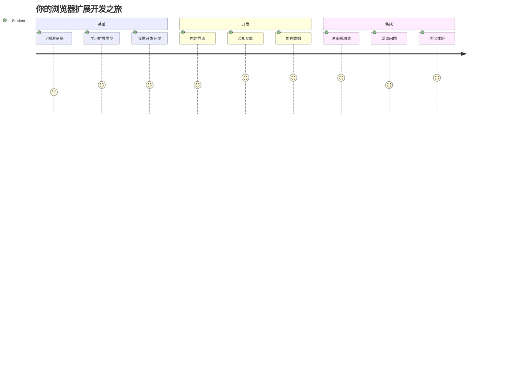
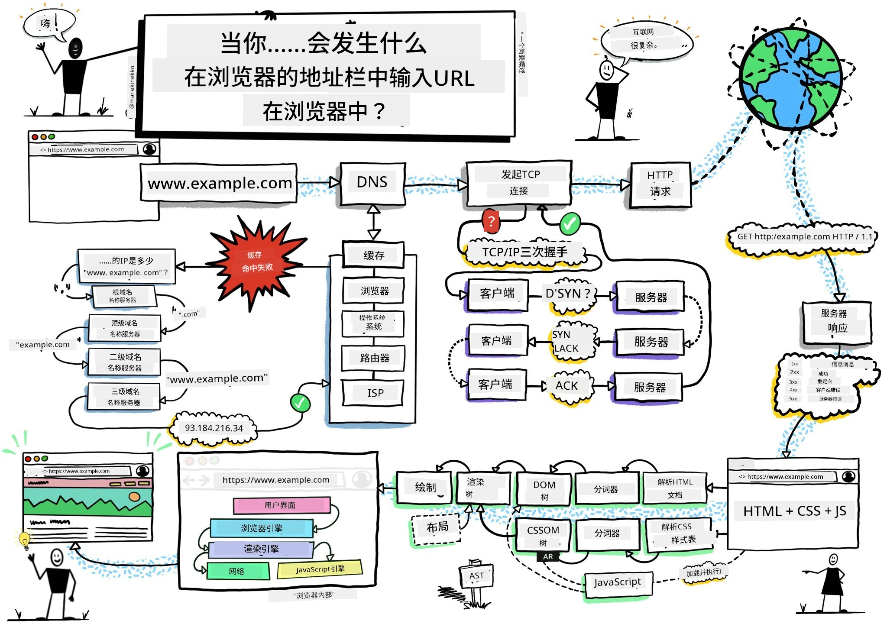
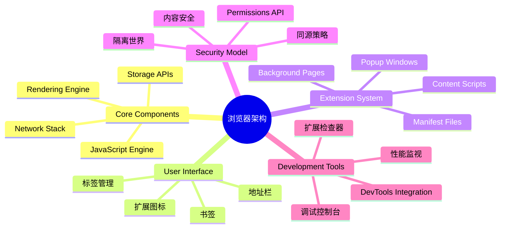
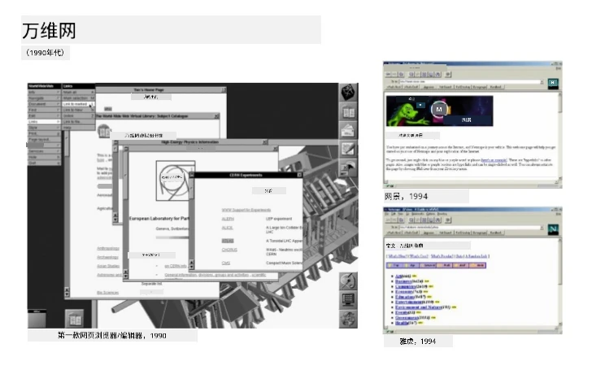
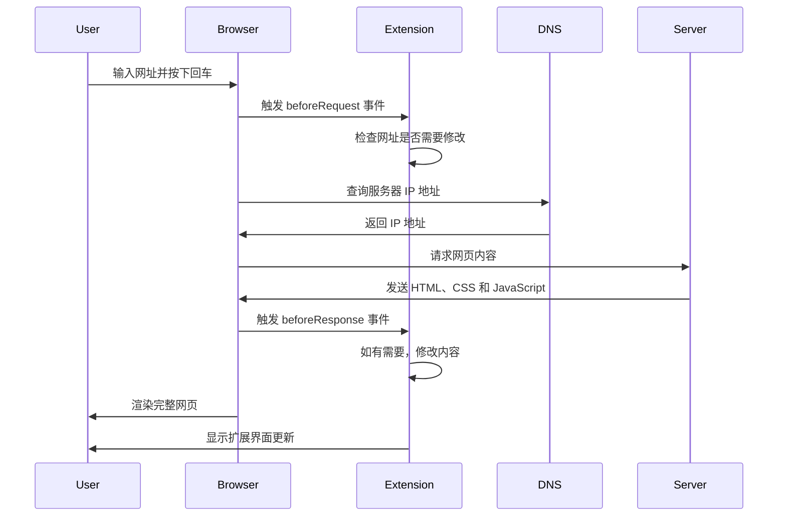
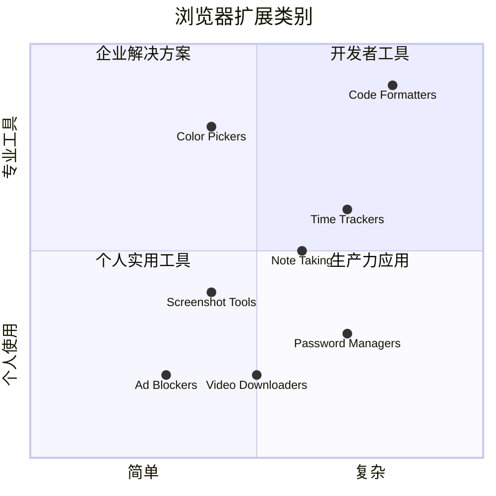
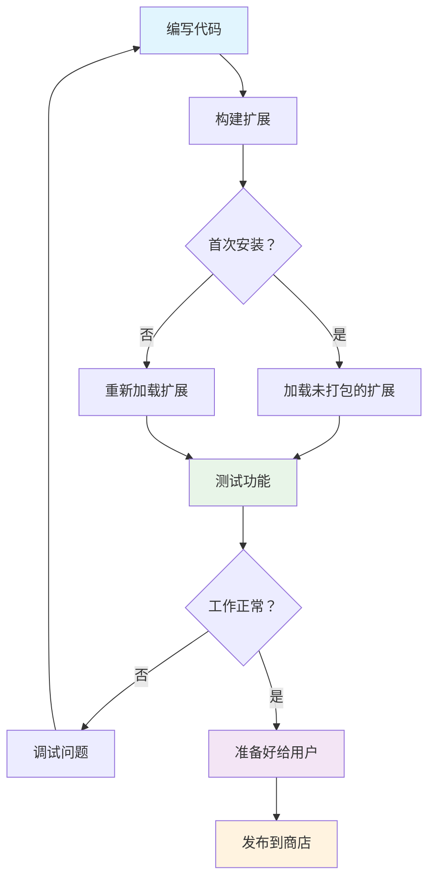
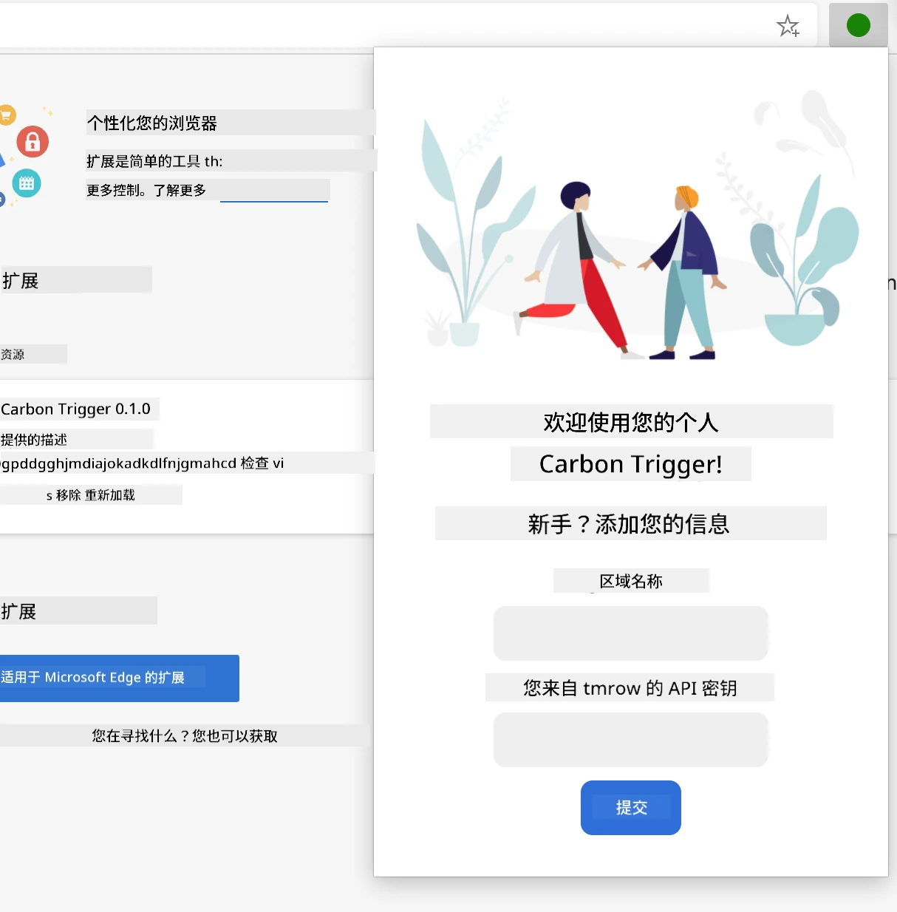
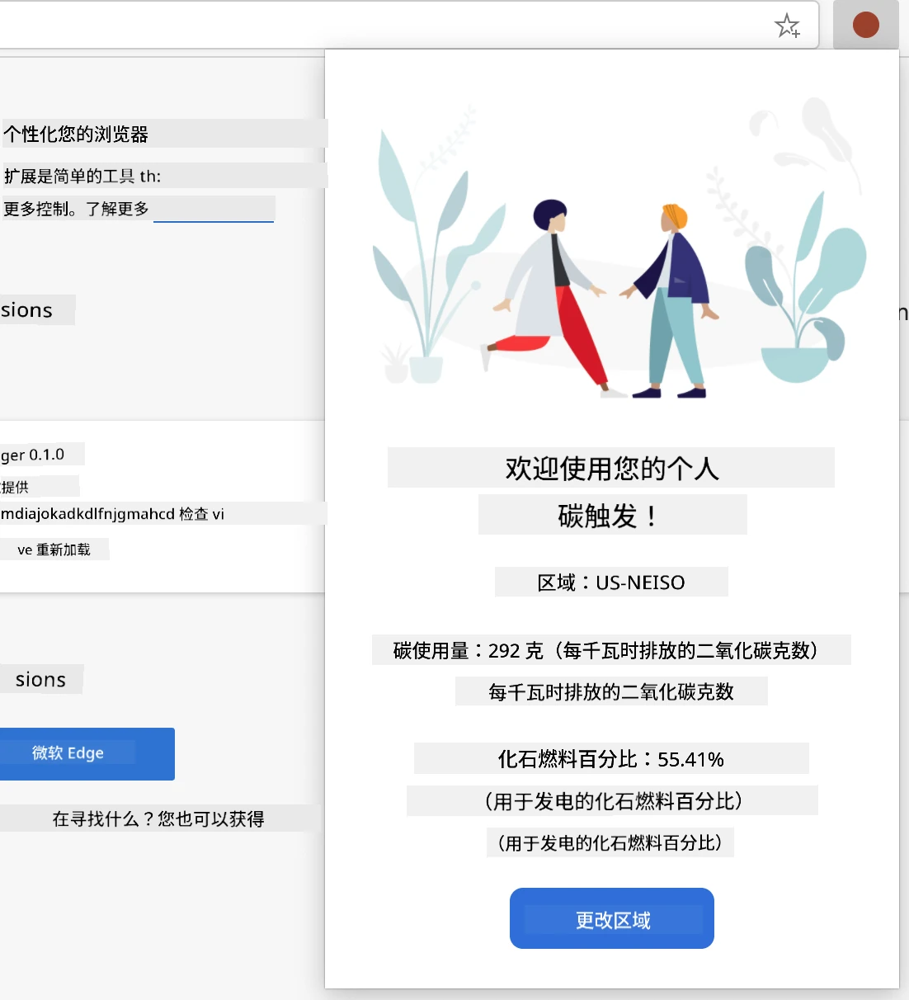
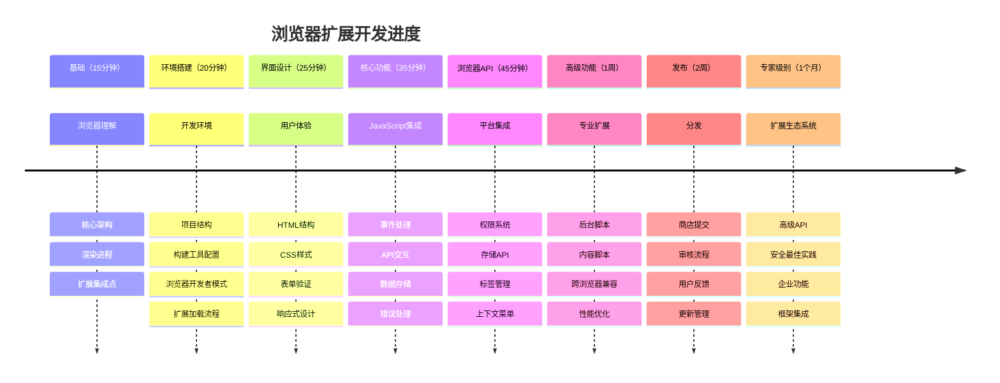

<!--
CO_OP_TRANSLATOR_METADATA:
{
  "original_hash": "00aa85715e1efd4930c17a23e3012e69",
  "translation_date": "2026-01-06T11:36:28+00:00",
  "source_file": "5-browser-extension/1-about-browsers/README.md",
  "language_code": "zh"
}
-->
# 浏览器扩展项目第一部分：关于浏览器的一切



> 手绘笔记作者：[Wassim Chegham](https://dev.to/wassimchegham/ever-wondered-what-happens-when-you-type-in-a-url-in-an-address-bar-in-a-browser-3dob)

## 课前测验

[课前测验](https://ff-quizzes.netlify.app/web/quiz/23)

### 介绍

浏览器扩展是增强网页浏览体验的迷你应用程序。就像蒂姆·伯纳斯-李最初设想的互动网络一样，扩展将浏览器的功能从简单的文档查看扩展到了更多领域。从保持账户安全的密码管理器，到帮助设计师选择完美色调的拾色器，扩展解决了日常浏览中的各种挑战。

在构建你的第一个扩展之前，让我们先了解浏览器的工作原理。正如亚历山大·格雷厄姆·贝尔需要理解声音传输才能发明电话一样，掌握浏览器基础知识将帮助你创建无缝集成现有浏览器系统的扩展。

本课结束时，你将理解浏览器架构，并开始构建你的第一个扩展。


## 理解网页浏览器

网页浏览器本质上是一个复杂的文档解析器。当你在地址栏输入“google.com”时，浏览器会执行一系列复杂操作——从全球服务器请求内容，然后解析并呈现成你所看到的交互式网页。

这一过程与第一款网页浏览器 WorldWideWeb 的设计理念相符，该浏览器由蒂姆·伯纳斯-李在1990年开发，旨在让超链接文档人人可访问。

✅ **一点历史**：第一款浏览器名为“WorldWideWeb”，由蒂姆·伯纳斯-李爵士于1990年创建。


> 一些早期浏览器，来源：[Karen McGrane](https://www.slideshare.net/KMcGrane/week-4-ixd-history-personal-computing)

### 浏览器如何处理网页内容

从输入 URL 到看到网页，这一过程涉及几个协同步骤，几秒内完成：


**该过程实现的功能如下：**
- **通过 DNS 查询** 将易读的 URL 转换为服务器 IP 地址
- **使用 HTTP 或 HTTPS 协议** 与网页服务器建立安全连接
- **请求** 服务器上的特定网页内容
- **接收** 服务器发送的 HTML 标记、CSS 样式和 JavaScript 代码
- **渲染** 所有内容，呈现为你看到的交互式网页

### 浏览器核心功能

现代浏览器提供众多功能，扩展开发者可充分利用：

| 功能 | 目的 | 扩展的机会 |
|---------|---------|------------------------|
| **渲染引擎** | 显示 HTML、CSS 和 JavaScript | 内容修改、注入样式 |
| **JavaScript 引擎** | 执行 JavaScript 代码 | 自定义脚本、API 交互 |
| **本地存储** | 本地保存数据 | 用户偏好、缓存数据 |
| **网络栈** | 处理网络请求 | 请求监控、数据分析 |
| **安全模型** | 保护用户免受恶意内容 | 内容过滤、安全增强 |

**了解这些功能可帮助你：**
- **识别** 扩展可带来最多价值的位置
- **选择** 适合扩展功能的浏览器 API
- **设计** 与浏览器系统高效协作的扩展
- **确保** 扩展遵循浏览器安全最佳实践

### 跨浏览器开发考虑

不同浏览器对标准的实现有细微差别，就像不同编程语言对同一算法的处理方式不同一样。Chrome、Firefox 和 Safari 各有特色，开发者需要在扩展开发中考虑这些差异。

> 💡 **专业提示**：使用 [caniuse.com](https://www.caniuse.com) 检查不同浏览器对网页技术的支持，这在规划扩展功能时非常有用！

**扩展开发的关键考虑点：**
- **在 Chrome、Firefox 和 Edge 上测试** 你的扩展
- **适配不同浏览器扩展 API 和 manifest 格式**
- **处理不同浏览器的性能特点和限制**
- **为可能缺失的浏览器特定功能提供备用方案**

✅ **分析洞见**：通过在你的网页开发项目中安装分析包，可以了解用户偏好的浏览器，这有助于你优先支持特定浏览器。

## 理解浏览器扩展

浏览器扩展通过直接向浏览器界面添加功能，解决了常见的网页浏览问题。扩展无需独立应用程序或复杂流程，提供立刻访问工具和功能的能力。

这一理念类似早期计算机先驱道格拉斯·恩格尔巴特设想的通过技术增强人类能力——扩展增强了浏览器的基础功能。


**流行扩展类别及其好处：**
- **效率工具**：任务管理器、笔记应用、时间追踪器，帮助你保持条理
- **安全增强**：密码管理器、广告屏蔽、隐私工具，保护你的数据
- **开发者工具**：代码格式化器、颜色选取器、调试工具，简化开发流程
- **内容增强**：阅读模式、视频下载器、截图工具，改善你的网页体验

✅ **反思问题**：你最喜欢哪些浏览器扩展？它们执行哪些具体任务？如何提升你的浏览体验？

### 🔄 **教学回顾**
**浏览器架构理解**：开始开发扩展前，请确保你能够：
- ✅ 解释浏览器如何处理网络请求和渲染内容
- ✅ 识别浏览器架构的主要组成部分
- ✅ 理解扩展如何与浏览器功能集成
- ✅ 认识保护用户的安全模型

**快速自测**：能否串联起从输入 URL 到看到网页的整个流程？
1. **DNS 查询** 将 URL 转换为 IP 地址
2. **HTTP 请求** 从服务器获取内容
3. **解析** 处理 HTML、CSS 和 JavaScript
4. **渲染** 显示最终网页
5. **扩展** 可在多个步骤修改内容

## 安装和管理扩展

了解扩展安装过程，有助于你预见用户安装你扩展时的体验。现代浏览器的安装流程标准化，界面设计略有差异。


> **重要提示**：测试自己的扩展时，务必开启开发者模式并允许来自其他商店的扩展。

### 开发阶段扩展安装流程

开发和测试自己的扩展时，遵循这个工作流程：


```bash
# 第一步：构建您的扩展
npm run build
```

**该命令完成的操作：**
- **将源代码编译** 成浏览器可用文件
- **打包** JavaScript 模块为优化的包
- **生成** 最终扩展文件到 `/dist` 文件夹
- **准备** 扩展供安装和测试

**步骤 2：进入浏览器扩展管理页面**
1. **打开** 浏览器扩展管理页面
2. **点击** 右上角“设置和更多”按钮（`...`图标）
3. **选择** 下拉菜单中的“扩展”选项

**步骤 3：加载扩展**
- **新安装**：选择“加载已解压的扩展”，并选中 `/dist` 文件夹
- **更新**：在已安装扩展旁点击“重新加载”
- **测试**：启用“开发者模式”以访问额外调试功能

### 生产环境扩展安装

> ✅ **注意**：以上开发说明针对你自己构建的扩展。若安装发布的扩展，请访问官方浏览器扩展商店，如 [Microsoft Edge 附加组件商店](https://microsoftedge.microsoft.com/addons/Microsoft-Edge-Extensions-Home)。

**理解差异：**
- **开发安装** 可测试未发布扩展
- **商店安装** 提供经过验证的已发布扩展，且支持自动更新
- **旁加载** 允许从非官方商店安装扩展（需开发者模式）

## 构建你的碳足迹扩展

我们将创建一个显示你的地区能源使用碳足迹的浏览器扩展。该项目演示了扩展开发的基本概念，同时打造一个环境意识的实用工具。

此方法遵循自约翰·杜威教育理论以来有效的“做中学”原则——结合技术技能与有意义的真实应用。

### 项目需求

开发前，收集所需资源和依赖：

**必备 API 访问：**
- **[CO2 Signal API 密钥](https://www.co2signal.com/)**：输入邮箱地址以免费获取 API 密钥
- **[地区代码](http://api.electricitymap.org/v3/zones)**：通过[Electricity Map](https://www.electricitymap.org/map)查找你的地区代码（例如，波士顿区域代码为 'US-NEISO'）

**开发工具：**
- **[Node.js 和 NPM](https://www.npmjs.com)**：用于安装项目依赖的包管理工具
- **[起始代码](../../../../5-browser-extension/start)**：下载 `start` 文件夹开始开发

✅ **了解更多**：提升你的包管理技能，请参考此[完整学习模块](https://docs.microsoft.com/learn/modules/create-nodejs-project-dependencies/?WT.mc_id=academic-77807-sagibbon)

### 理解项目结构

理解项目结构有助于高效组织开发工作。就像亚历山大图书馆为知识检索而布局，一个结构良好的代码库能极大提高开发效率：

```
project-root/
├── dist/                    # Built extension files
│   ├── manifest.json        # Extension configuration
│   ├── index.html           # User interface markup
│   ├── background.js        # Background script functionality
│   └── main.js              # Compiled JavaScript bundle
├── src/                     # Source development files
│   └── index.js             # Your main JavaScript code
├── package.json             # Project dependencies and scripts
└── webpack.config.js        # Build configuration
```

**解释每个文件的功能：**
- **`manifest.json`**：**定义** 扩展元数据、权限和入口
- **`index.html`**：**创建** 用户点击扩展时呈现的界面
- **`background.js`**：**处理** 后台任务和浏览器事件监听
- **`main.js`**：**包含** 打包过程后的最终 JavaScript 代码
- **`src/index.js`**：**存放** 你的主要开发代码，编译成 `main.js`

> 💡 **组织技巧**：将你的 API 密钥和地区代码存储在安全笔记中，便于开发时引用。你需要这些值测试扩展功能。

✅ **安全提示**：切勿将 API 密钥或敏感凭据提交至代码仓库。后续步骤会展示如何安全管理这些信息。

## 创建扩展界面

现在构建用户界面组件。扩展采用两屏设计：配置屏用于初始设置，结果屏显示数据。

这遵循早期计算机界面设计的渐进披露原则——按逻辑顺序展示信息和选项，避免用户不堪重负。

### 扩展视图概览

**设置视图** - 首次用户配置：


**结果视图** - 碳足迹数据显示：


### 构建配置表单

设置表单位于首次使用时收集用户配置信息。配置完成后，此信息会保存在浏览器存储以供后续使用。

在 `/dist/index.html` 文件中添加以下表单结构：

```html
<form class="form-data" autocomplete="on">
    <div>
        <h2>New? Add your Information</h2>
    </div>
    <div>
        <label for="region">Region Name</label>
        <input type="text" id="region" required class="region-name" />
    </div>
    <div>
        <label for="api">Your API Key from tmrow</label>
        <input type="text" id="api" required class="api-key" />
    </div>
    <button class="search-btn">Submit</button>
</form>
```

**表单所实现的功能：**
- **创建** 语义化的表单结构，带有适当标签和输入关联
- **启用** 浏览器自动完成功能，提升用户体验
- **必填** 两个字段均需填写，使用 `required` 属性确保
- **采用** 描述性类名组织输入，便于样式和 JS 选择
- **为首次设置的用户** 提供清晰指引

### 构建结果显示区

接下来，创建显示碳足迹数据的结果区域。将以下 HTML 添加到表单下方：

```html
<div class="result">
    <div class="loading">loading...</div>
    <div class="errors"></div>
    <div class="data"></div>
    <div class="result-container">
        <p><strong>Region: </strong><span class="my-region"></span></p>
        <p><strong>Carbon Usage: </strong><span class="carbon-usage"></span></p>
        <p><strong>Fossil Fuel Percentage: </strong><span class="fossil-fuel"></span></p>
    </div>
    <button class="clear-btn">Change region</button>
</div>
```

**此结构提供的功能包括：**
- **`loading`**：**显示** 获取 API 数据时的加载信息
- **`errors`**：**展示** API 调用失败或数据无效时的错误信息
- **`data`**：**保存** 调试用的原始数据
- **`result-container`**：**向用户呈现** 格式化的碳足迹信息
- **`clear-btn`**：**允许** 用户更改地区并重新配置扩展

### 设置构建流程

现在安装项目依赖并测试构建流程：

```bash
npm install
```

**该安装步骤完成的操作：**
- **下载** Webpack 及 `package.json` 中指定的其他开发依赖
- **配置** 构建工具链，编译现代 JavaScript
- **准备** 开发环境，为扩展构建与测试做好准备
- **支持** 代码打包、优化及跨浏览器兼容功能

> 💡 **构建流程洞见**：Webpack 会将 `/src/index.js` 中的源码打包成 `/dist/main.js`。该过程优化代码以适应生产环境，并确保浏览器兼容性。

### 测试你的进展

此时，你可以开始测试你的扩展了：
1. **运行** 构建命令以编译代码  
2. **加载** 扩展到浏览器中，使用开发者模式  
3. **验证** 表单是否正确显示且外观专业  
4. **检查** 所有表单元素是否正确对齐且功能正常  

**你已完成：**  
- **构建** 了扩展的基础 HTML 结构  
- **创建** 了配置和结果界面，使用了正确的语义标记  
- **搭建** 了使用行业标准工具的现代开发流程  
- **准备** 了添加交互式 JavaScript 功能的基础  

### 🔄 **教学核验**  
**扩展开发进度**：继续前请确认理解：  
- ✅ 你能解释项目结构中每个文件的目的吗？  
- ✅ 你理解构建过程如何转换源代码吗？  
- ✅ 为什么我们将配置和结果分到不同的用户界面部分？  
- ✅ 表单结构如何支持可用性和可访问性？  

**开发工作流理解**：现在你应该能：  
1. **修改** 扩展界面相关的 HTML 和 CSS  
2. **运行** 构建命令编译更改  
3. **重新加载** 浏览器中的扩展以测试更新  
4. **使用**浏览器开发者工具调试问题  

你已完成浏览器扩展开发的第一阶段。就像莱特兄弟在实现飞行前需要了解空气动力学一样，理解这些基础概念将助你构建下一课中更复杂的交互功能。  

## GitHub Copilot Agent 挑战 🚀  

使用 Agent 模式完成以下挑战：  

**描述：** 通过添加表单验证和用户反馈功能来增强浏览器扩展，提升输入 API 密钥和地区代码时的用户体验。  

**提示：** 创建 JavaScript 验证函数，检查 API 密钥字段是否至少包含 20 个字符，以及地区代码是否符合正确格式（如 'US-NEISO'）。通过改变输入框边框颜色来提供视觉反馈，输入有效时为绿色，无效时为红色。还要添加切换功能以显示/隐藏 API 密钥以保证安全。  

了解更多关于[agent 模式](https://code.visualstudio.com/blogs/2025/02/24/introducing-copilot-agent-mode)。  

## 🚀 挑战  

查看浏览器扩展商店并安装一个扩展到浏览器。你可以用有趣的方式检查其文件。你发现了什么？  

## 课后测验  

[课后测验](https://ff-quizzes.netlify.app/web/quiz/24)  

## 复习与自学  

本课中你了解了浏览器的一些历史；借此机会通过阅读更多有关万维网发明者的历史，了解他们对其使用的设想。一些有用网站包括：  

[浏览器历史](https://www.mozilla.org/firefox/browsers/browser-history/)  

[万维网历史](https://webfoundation.org/about/vision/history-of-the-web/)  

[蒂姆·伯纳斯-李访谈](https://www.theguardian.com/technology/2019/mar/12/tim-berners-lee-on-30-years-of-the-web-if-we-dream-a-little-we-can-get-the-web-we-want)  

### ⚡ **你接下来 5 分钟能做什么**  
- [ ] 打开 Chrome/Edge 扩展页面 (chrome://extensions) 并浏览已安装扩展  
- [ ] 在加载网页时查看浏览器开发者工具 Network 标签页  
- [ ] 尝试查看页面源代码（Ctrl+U）以了解 HTML 结构  
- [ ] 检查任意网页元素并在开发者工具中修改其 CSS  

### 🎯 **你这小时能完成什么**  
- [ ] 完成课后测验，理解浏览器基础知识  
- [ ] 创建基本的 manifest.json 文件用于浏览器扩展  
- [ ] 构建显示弹出窗口的简单 “Hello World” 扩展  
- [ ] 测试以开发者模式加载你的扩展  
- [ ] 探索目标浏览器的扩展文档  

### 📅 **你的为期一周的扩展之旅**  
- [ ] 完成一个具备实际用途的功能性浏览器扩展  
- [ ] 了解内容脚本、后台脚本和弹出交互  
- [ ] 掌握浏览器 API 如存储、标签页和消息传递  
- [ ] 设计对用户友好的扩展界面  
- [ ] 在不同网站和场景测试你的扩展  
- [ ] 将扩展发布到浏览器扩展商店  

### 🌟 **你的为期一个月的浏览器开发规划**  
- [ ] 构建多款解决不同用户问题的扩展  
- [ ] 学习高级浏览器 API 和安全最佳实践  
- [ ] 贡献开源浏览器扩展项目  
- [ ] 精通跨浏览器兼容和渐进增强  
- [ ] 为他人创建扩展开发工具和模板  
- [ ] 成为帮助其他开发者的浏览器扩展专家  

## 🎯 你的浏览器扩展掌握时间表  


### 🛠️ 你的扩展开发工具包总结  

完成本课后，你现拥有：  
- **浏览器架构知识**：理解渲染引擎、安全模型和扩展集成  
- **开发环境**：现代工具链，包含 Webpack、NPM 和调试能力  
- **UI/UX 基础**：语义 HTML 结构与渐进披露模式  
- **安全意识**：了解浏览器权限和安全开发实践  
- **跨浏览器概念**：兼容性考虑和测试方法  
- **API 集成**：与外部数据源交互的基础  
- **专业工作流程**：行业标准的开发和测试流程  

**现实应用**：这些技能直接适用于：  
- **网页开发**：单页应用和渐进式网页应用  
- **桌面应用**：Electron 及基于网页的桌面软件  
- **移动开发**：混合应用和基于网页的移动解决方案  
- **企业工具**：内部生产力应用和工作流自动化  
- **开源项目**：参与浏览器扩展项目和网络标准  

**下一步**：你已准备好添加交互功能，使用浏览器 API，并创建解决真实用户问题的扩展！  

## 作业  

[重新设计你的扩展](assignment.md)

---

<!-- CO-OP TRANSLATOR DISCLAIMER START -->
**免责声明**：
本文件使用AI翻译服务[Co-op Translator](https://github.com/Azure/co-op-translator)进行翻译。虽然我们力求准确，但请注意自动翻译可能存在错误或不准确之处。原始文件的母语版本应被视为权威版本。对于关键信息，建议采用专业人工翻译。对于因使用本翻译而产生的任何误解或误释，我们概不负责。
<!-- CO-OP TRANSLATOR DISCLAIMER END -->