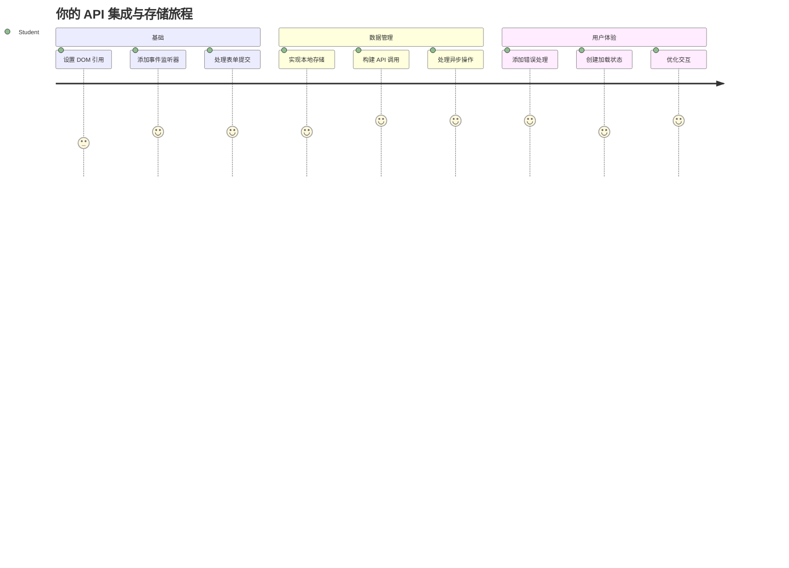
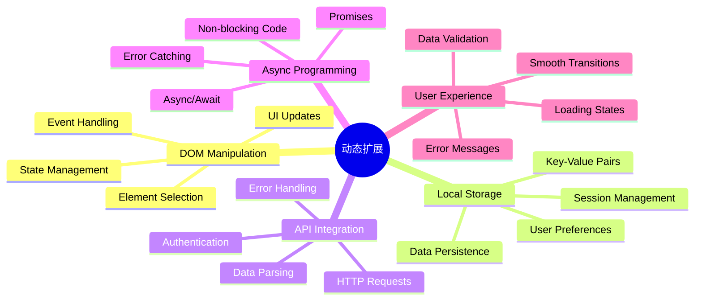
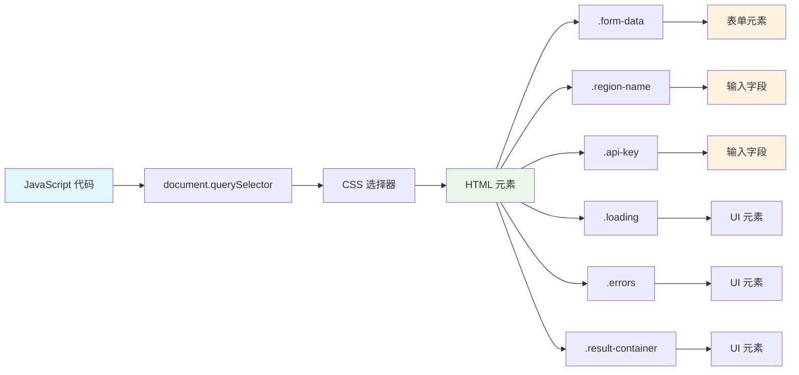
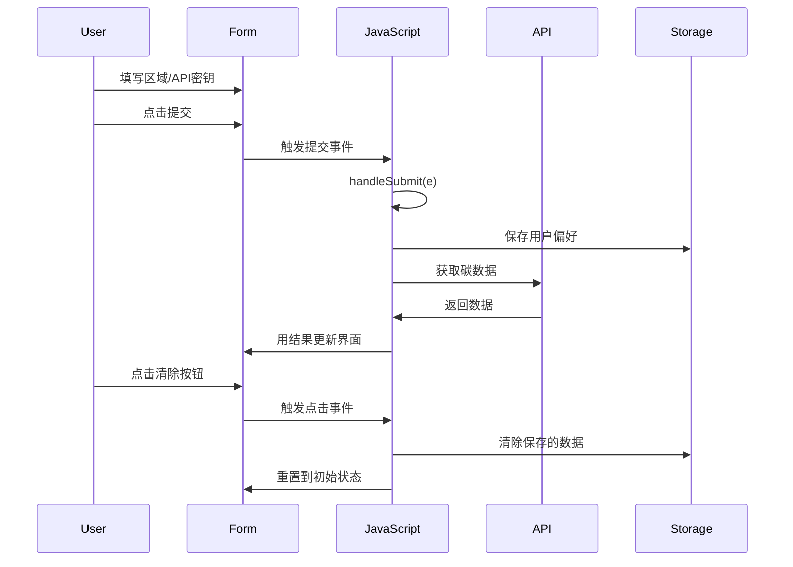
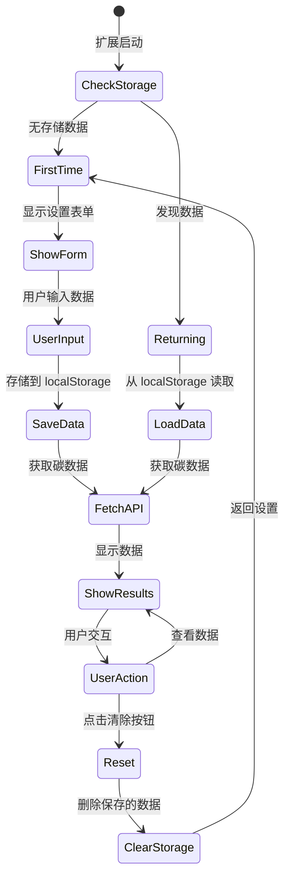
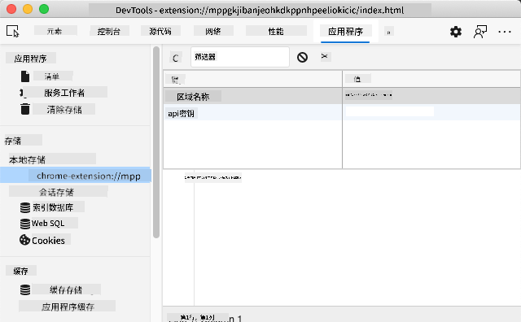
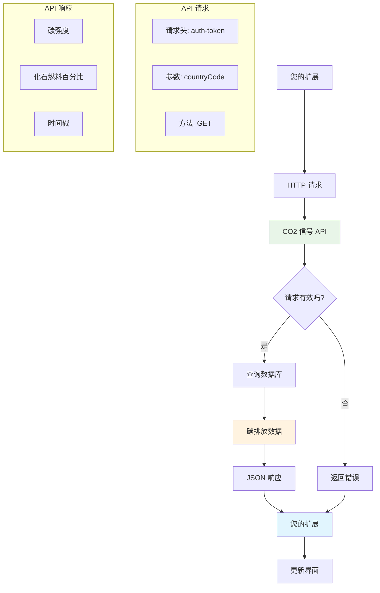
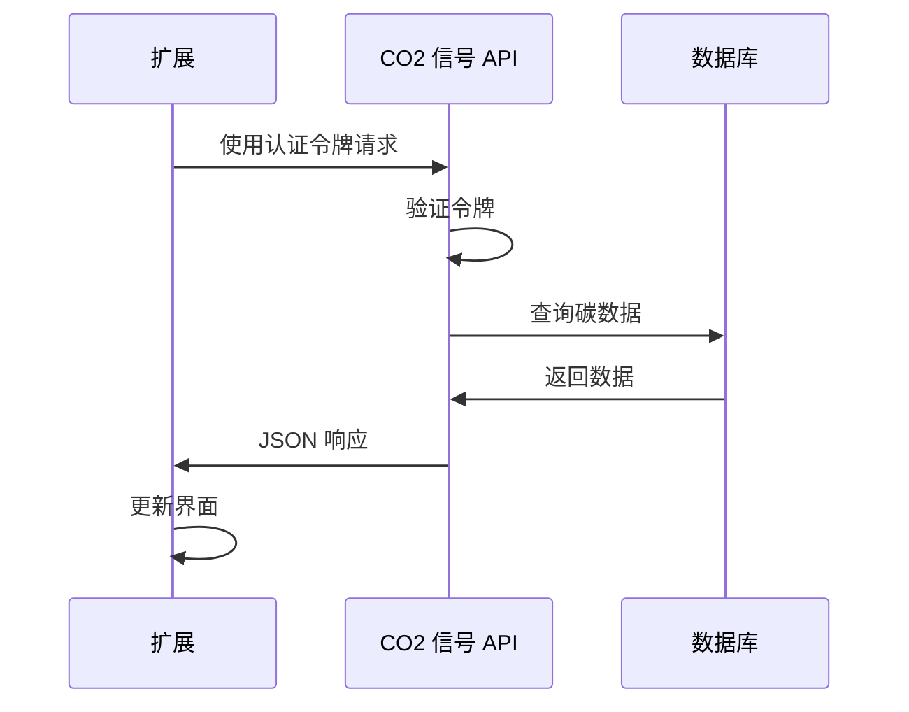
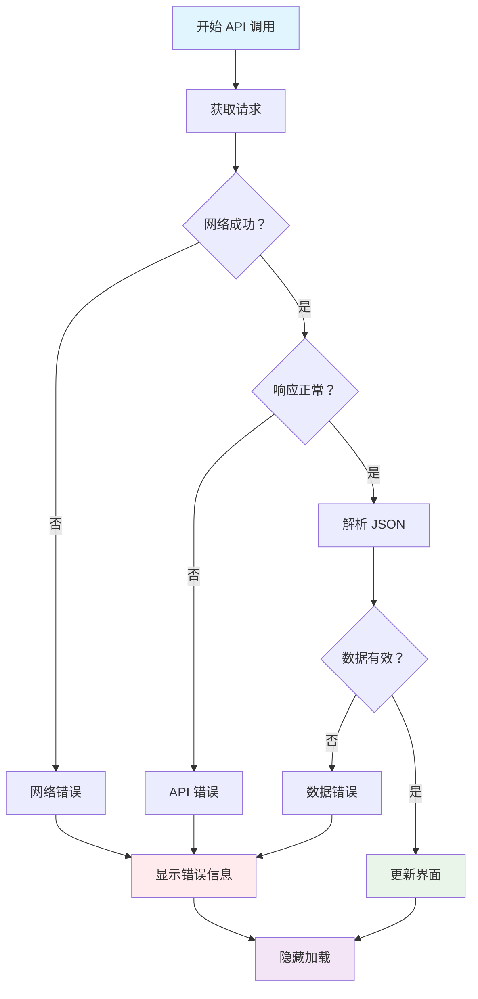
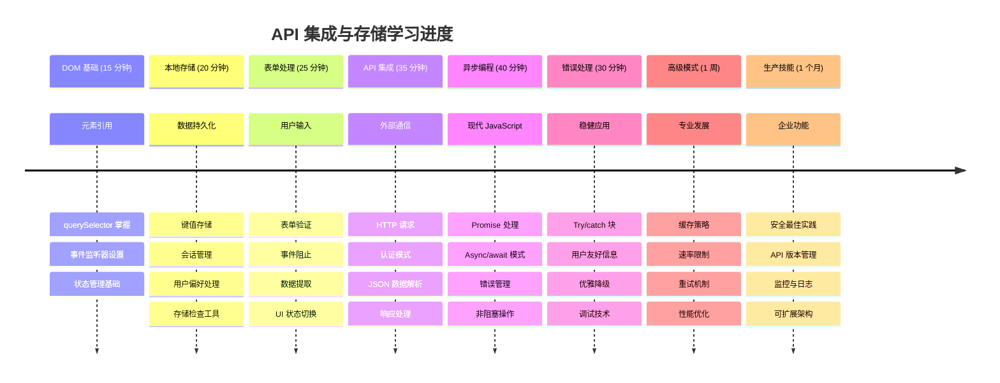

<!--
CO_OP_TRANSLATOR_METADATA:
{
  "original_hash": "2b6203a48c48d8234e0948353b47d84e",
  "translation_date": "2026-01-06T11:32:52+00:00",
  "source_file": "5-browser-extension/2-forms-browsers-local-storage/README.md",
  "language_code": "zh"
}
-->
# 浏览器扩展项目第二部分：调用 API，使用本地存储


## 课前测验

[课前测验](https://ff-quizzes.netlify.app/web/quiz/25)

## 介绍

还记得你刚开始构建的浏览器扩展吗？现在你拥有一个看起来很不错的表单，但它本质上是静态的。今天我们将通过连接真实数据并赋予它记忆功能来让它变得生动。

想想阿波罗任务控制计算机——它们不仅仅展示固定信息。它们不断与航天器通信，更新遥测数据，并记住关键的任务参数。这就是我们今天要构建的动态行为。你的扩展将连接互联网，抓取真实的环境数据，并记住你下次的设置。

API 集成听起来可能很复杂，但实际上就是教你的代码如何与其他服务通信。无论你是在获取天气数据、社交媒体信息流，还是像今天一样获取碳足迹信息，关键都是建立这些数字连接。我们还将探讨浏览器如何持久保存信息——类似于图书馆如何使用卡片目录来记住书本位置。

完成本课后，你将拥有一个能够获取真实数据、保存用户偏好设置并提供流畅体验的浏览器扩展。让我们开始吧！


✅ 按照对应文件中的编号段落知道在哪里放置你的代码

## 设置扩展中要操作的元素

在你的 JavaScript 操作界面之前，需要先获取特定的 HTML 元素引用。就像望远镜需要对准特定的星星一样——伽利略研究木星的卫星前必须先定位并聚焦于木星。

在你的 `index.js` 文件中，我们将创建 `const` 变量来捕获每个重要表单元素的引用。这类似于科学家给他们的设备贴标签——这样他们不必每次都在整个实验室中搜索，就可以直接访问需要的东西。


```javascript
// 表单字段
const form = document.querySelector('.form-data');
const region = document.querySelector('.region-name');
const apiKey = document.querySelector('.api-key');

// 结果
const errors = document.querySelector('.errors');
const loading = document.querySelector('.loading');
const results = document.querySelector('.result-container');
const usage = document.querySelector('.carbon-usage');
const fossilfuel = document.querySelector('.fossil-fuel');
const myregion = document.querySelector('.my-region');
const clearBtn = document.querySelector('.clear-btn');
```

**这段代码的作用：**
- **捕获** 表单元素，使用 `document.querySelector()` 结合 CSS 类选择器
- **创建** 了区域名称和 API 密钥输入字段的引用
- **建立** 结果显示元素的连接，用于展示碳使用相关数据
- **设置** 访问 UI 元素，如加载指示器和错误信息
- **存储** 每个元素引用在 `const` 变量中，便于代码中反复使用

## 添加事件监听器

现在我们让你的扩展响应用户操作。事件监听器是你的代码监控用户交互的方式。想象早期电话交换机的操作员——他们监听来电，当有人想要通话时连接正确的线路。


```javascript
form.addEventListener('submit', (e) => handleSubmit(e));
clearBtn.addEventListener('click', (e) => reset(e));
init();
```

**理解这些概念：**
- **绑定** 表单提交事件监听器，当用户按下回车或点击提交时触发
- **连接** 清除按钮的点击监听器，用于重置表单
- **传递** 事件对象 `(e)` 给处理函数以实现额外控制
- **立即调用** `init()` 函数，用于设置扩展的初始状态

✅ 注意这里使用的箭头函数简写语法。这种现代 JavaScript 写法比传统函数表达式更简洁，不过两者都有效！

### 🔄 **教学检查点**
**事件处理理解**：在进行初始化之前，请确保你能：
- ✅ 解释 `addEventListener` 如何将用户操作连接到 JavaScript 函数
- ✅ 理解为何要将事件对象 `(e)` 传给处理函数
- ✅ 认识 `submit` 和 `click` 事件的区别
- ✅ 描述 `init()` 函数何时运行及其原因

**快速自测**：如果忘记在表单提交时调用 `e.preventDefault()` 会怎么样？
*答案：页面会重新加载，所有 JavaScript 状态丢失，用户体验中断*

## 构建初始化和重置函数

让我们创建扩展的初始化逻辑。`init()` 函数就像船舶的导航系统检查仪器——它判断当前状态并相应调整界面。它会检查用户是否之前使用过你的扩展，并加载他们之前的设置。

`reset()` 函数则为用户提供一个重新开始的机会——类似科学家在实验间隙重置仪器以保证数据清洁。

```javascript
function init() {
	// 检查用户是否之前保存过API凭证
	const storedApiKey = localStorage.getItem('apiKey');
	const storedRegion = localStorage.getItem('regionName');

	// 将扩展图标设置为通用绿色（未来课程的占位符）
	// 待办事项：在下一课实现图标更新

	if (storedApiKey === null || storedRegion === null) {
		// 初次使用者：显示设置表单
		form.style.display = 'block';
		results.style.display = 'none';
		loading.style.display = 'none';
		clearBtn.style.display = 'none';
		errors.textContent = '';
	} else {
		// 回访用户：自动加载他们保存的数据
		displayCarbonUsage(storedApiKey, storedRegion);
		results.style.display = 'none';
		form.style.display = 'none';
		clearBtn.style.display = 'block';
	}
}

function reset(e) {
	e.preventDefault();
	// 清除存储的区域以允许用户选择新位置
	localStorage.removeItem('regionName');
	// 重新启动初始化过程
	init();
}
```

**这里发生的事情分解：**
- **从浏览器本地存储获取** 保存的 API 密钥和区域数据
- **检测** 是否为首次使用（无存储凭据）或是回访用户
- **为新用户显示** 设置表单，并隐藏其他界面元素
- **为回访用户自动加载** 保存的数据并显示重置选项
- **基于是否有数据** 管理用户界面的状态

**关于本地存储的关键概念：**
- **数据持久保存**，跨浏览器会话有效（与会话存储不同）
- **以键值对方式保存**，使用 `getItem()` 和 `setItem()`
- **当指定键无数据时返回** `null`
- **提供简单方式** 存储用户偏好和设置

> 💡 **理解浏览器存储**：[LocalStorage](https://developer.mozilla.org/docs/Web/API/Window/localStorage) 就像赋予你的扩展持久记忆。想象古代亚历山大图书馆如何保存卷轴——信息在学者离开再回来时依然可用。
>
> **关键特点：**
> - **关闭浏览器后依然保存数据**
> - **重启计算机和浏览器崩溃后数据依然存在**
> - **提供丰富存储空间保存用户偏好**
> - **无需网络延迟即可即时访问**

> **重要提示**：你的浏览器扩展有自己的独立本地存储，独立于普通网页。这保证了安全且避免与其他网站冲突。

你可以通过打开浏览器开发者工具（F12），进入 **Application** 选项卡，展开 **Local Storage** 部分查看存储的数据。




> ⚠️ **安全注意事项**：在生产环境中，将 API 密钥存储在 LocalStorage 存在安全风险，因为 JavaScript 代码可以访问这些数据。学习用途这样做可以，但实际应用应使用安全的服务器端存储敏感凭证。

## 处理表单提交

接下来我们处理用户提交表单时的行为。默认情况下，浏览器表单提交会重新加载页面，但我们要拦截这种行为，使体验更加流畅。

这种做法类似任务控制对航天器通信的处理——不是每次传输都重置整个系统，而是持续运行同时处理新信息。

创建一个函数，捕获表单提交事件并提取用户输入内容：

```javascript
function handleSubmit(e) {
	e.preventDefault();
	setUpUser(apiKey.value, region.value);
}
```

**以上我们做了：**
- **阻止** 表单默认提交行为避免刷新页面
- **提取** 用户在 API 密钥和区域字段中的输入值
- **将** 表单数据传递给 `setUpUser()` 函数进行处理
- **保持** 单页面应用行为，避免页面重新加载

✅ 请记得你的 HTML 表单字段带有 `required` 属性，所以浏览器会自动验证用户必须填写 API 密钥和区域后，才会执行此函数。

## 设置用户偏好

`setUpUser` 函数负责保存用户凭据并启动第一次 API 调用。这样实现从设置到展示结果的平滑过渡。

```javascript
function setUpUser(apiKey, regionName) {
	// 保存用户凭证以供将来会话使用
	localStorage.setItem('apiKey', apiKey);
	localStorage.setItem('regionName', regionName);
	
	// 更新界面以显示加载状态
	loading.style.display = 'block';
	errors.textContent = '';
	clearBtn.style.display = 'block';
	
	// 使用用户凭证获取碳排放使用数据
	displayCarbonUsage(apiKey, regionName);
}
```

**一步步过程为：**
- **保存** API 密钥和区域名到本地存储以便未来使用
- **显示** 加载指示器告知用户正在获取数据
- **清除** 任何先前显示的错误信息
- **显示** 清除按钮，供用户以后重置设置
- **发起** API 调用获取真实的碳使用数据

这个函数通过协调数据持久化和界面更新，创造了无缝的用户体验。

## 显示碳使用数据

现在我们将扩展连接到外部数据源，通过 API 获取数据。这使你的扩展从独立工具变成可以访问互联网上实时信息的应用。

**理解 API**

[API](https://www.webopedia.com/TERM/A/API.html) 是不同应用间通信的方式。可以把它想象成 19 世纪连接远距离城市的电报系统——操作员会向远方电报站发送请求，并收取返回的信息。每次你查看社交媒体、问语音助手问题、或用送货应用时，都离不开 API 帮助完成数据交换。


**关于 REST API 的关键概念：**
- **REST** 表示“表述性状态转移”
- **使用** 标准 HTTP 方法 （GET、POST、PUT、DELETE）来操作数据
- **返回** 通常是 JSON 这类可预测格式的数据
- **提供** 对不同请求的一致 URL 端点

✅ 我们使用的 [CO2 Signal API](https://www.co2signal.com/) 提供全球电网的实时碳强度数据。帮助用户了解用电对环境的影响！

> 💡 **理解异步 JavaScript**：[`async` 关键字](https://developer.mozilla.org/docs/Web/JavaScript/Reference/Statements/async_function) 让你的代码同时处理多个操作。当你向服务器请求数据时，不希望整个扩展卡住——那就像空中交通管制在等待一架飞机响应时停止所有操作。
>
> **主要好处：**
> - **保持** 扩展在数据加载期间依然响应
> - **允许** 在网络请求时执行其他代码
> - **提升** 代码可读性，相较传统回调模式更易懂
> - **支持** 网络异常时优雅错误处理

这里有个关于 `async` 的视频：

[](https://youtube.com/watch?v=YwmlRkrxvkk "管理 Promise 的 Async 和 Await")

> 🎥 点击上图观看 async/await 相关视频。

### 🔄 **教学检查点**
**异步编程理解**：开始写 API 函数之前，请确认你理解：
- ✅ 为什么使用 `async/await`，而非阻塞整个扩展
- ✅ `try/catch` 块如何优雅处理网络错误
- ✅ 同步与异步操作的区别
- ✅ API 调用失败时会发生什么，如何应对

**现实生活的异步连接：**
- **点外卖**：你不会一直待在厨房旁边，会拿到收据后继续其他活动
- **发邮件**：发送时应用不会卡死，你可以继续写邮件
- **网页加载**：图片边加载边显示，你已经可以看文本了

**API 认证流程**：

创建获取并展示碳使用数据的函数：

```javascript
// 现代的 fetch API 方法（不需要外部依赖）
async function displayCarbonUsage(apiKey, region) {
	try {
		// 从 CO2 Signal API 获取碳强度数据
		const response = await fetch('https://api.co2signal.com/v1/latest', {
			method: 'GET',
			headers: {
				'auth-token': apiKey,
				'Content-Type': 'application/json'
			},
			// 添加特定区域的查询参数
			...new URLSearchParams({ countryCode: region }) && {
				url: `https://api.co2signal.com/v1/latest?countryCode=${region}`
			}
		});

		// 检查 API 请求是否成功
		if (!response.ok) {
			throw new Error(`API request failed: ${response.status}`);
		}

		const data = await response.json();
		const carbonData = data.data;

		// 计算四舍五入的碳强度值
		const carbonIntensity = Math.round(carbonData.carbonIntensity);

		// 使用获取到的数据更新用户界面
		loading.style.display = 'none';
		form.style.display = 'none';
		myregion.textContent = region.toUpperCase();
		usage.textContent = `${carbonIntensity} grams (grams CO₂ emitted per kilowatt hour)`;
		fossilfuel.textContent = `${carbonData.fossilFuelPercentage.toFixed(2)}% (percentage of fossil fuels used to generate electricity)`;
		results.style.display = 'block';

		// 待办：calculateColor(carbonIntensity) - 在下一节课中实现

	} catch (error) {
		console.error('Error fetching carbon data:', error);
		
		// 显示用户友好的错误信息
		loading.style.display = 'none';
		results.style.display = 'none';
		errors.textContent = 'Sorry, we couldn\'t fetch data for that region. Please check your API key and region code.';
	}
}
```

**详细解析：**
- **使用** 现代的 `fetch()` API，替代外部库如 Axios，代码更简洁且无依赖
- **实现** 使用 `response.ok` 做适当错误检查，及早捕捉 API 失败
- **通过** `async/await` 处理异步操作，使代码流程更易读
- **使用** `auth-token` 头部进行 CO2 Signal API 认证
- **解析** JSON 响应数据并提取碳强度信息
- **更新** 多个 UI 元素，格式化显示环保数据
- **提供** 当 API 调用失败时易理解的错误提示

**示例中展示的现代 JavaScript 技巧：**
- **模板字符串** 用 `${}` 语法，更清晰字符串格式化
- **try/catch 错误处理** 让应用更健壮
- **async/await 异步模式** 优雅调用网络接口
- **对象解构** 提取 API 响应中需要的数据
- **链式方法调用** 实现多步 DOM 操作

✅ 这个函数展示了多个重要的网页开发概念——与外部服务器通信，认证处理，数据解析，界面更新，以及错误管理。这些是专业开发者日常使用的基础技能。


### 🔄 **教学检查点**
**完整系统理解**：确认你掌握整个流程：
- ✅ DOM 引用为什么能让 JavaScript 控控界面
- ✅ 本地存储如何实现跨浏览器会话的数据持久化
- ✅ async/await 如何让 API 调用不冻结扩展
- ✅ API 请求失败时会怎样，以及如何处理异常
- ✅ 用户体验为何包含加载状态和错误提示

🎉 **你已经完成了：** 
一个浏览器扩展，它：
- **连接** 互联网，获取真实环保数据
- **持久保存** 用户设置跨会话
- **优雅处理** 错误，避免崩溃
- **提供** 流畅且专业的用户体验

通过运行 `npm run build` 并刷新浏览器扩展测试你的成果。你现在拥有一个功能齐全的碳足迹追踪器。下一课将添加动态图标功能，完善此扩展。

---

## GitHub Copilot Agent 挑战 🚀

使用 Agent 模式完成以下挑战：
**描述：** 通过添加错误处理改进和用户体验功能来增强浏览器扩展。本挑战将帮助你练习使用现代 JavaScript 模式进行 API 调用、本地存储和 DOM 操作。

**提示：** 创建一个增强版的 displayCarbonUsage 函数，包含：1) 失败 API 调用的指数退避重试机制，2) 调用 API 前对区域代码的输入验证，3) 带有进度指示器的加载动画，4) 在 localStorage 中缓存 API 响应及过期时间戳（缓存时长30分钟），及 5) 显示先前 API 调用历史数据的功能。同时为所有函数参数和返回类型添加适当的 TypeScript 风格 JSDoc 注释。

在[此处](https://code.visualstudio.com/blogs/2025/02/24/introducing-copilot-agent-mode)了解更多关于 agent 模式的信息。

## 🚀 挑战

通过探索大量浏览器 API，扩展你对 API 的理解，选择以下浏览器 API 之一并构建一个小示范：

- [Geolocation API](https://developer.mozilla.org/docs/Web/API/Geolocation_API) - 获取用户当前位置信息
- [Notification API](https://developer.mozilla.org/docs/Web/API/Notifications_API) - 发送桌面通知
- [HTML Drag and Drop API](https://developer.mozilla.org/docs/Web/API/HTML_Drag_and_Drop_API) - 创建交互式拖放界面
- [Web Storage API](https://developer.mozilla.org/docs/Web/API/Web_Storage_API) - 高级本地存储技巧
- [Fetch API](https://developer.mozilla.org/docs/Web/API/Fetch_API) - XMLHttpRequest 的现代替代方案

**研究问题：**
- 该 API 解决了哪些现实世界的问题？
- API 如何处理错误和边界情况？
- 使用该 API 有哪些安全考虑？
- 该 API 在不同浏览器中的支持程度如何？

研究后，确定一个 API 具备哪些特性才是开发者友好且可靠的。

## 课后测验

[课后测验](https://ff-quizzes.netlify.app/web/quiz/26)

## 复习与自学

本课你学习了 LocalStorage 和 API，这两者对专业 web 开发人员都非常有用。你能想到这两者是如何协同工作的吗？思考如何架构一个网站，该网站会存储供 API 使用的项目。

### ⚡ **你在接下来的 5 分钟内可以做什么**
- [ ] 打开开发者工具中的 Application 标签，探索任意网站的 localStorage
- [ ] 创建一个简单的 HTML 表单，测试浏览器的表单验证
- [ ] 尝试在浏览器控制台中存储和检索 localStorage 数据
- [ ] 使用 Network 标签检查提交的表单数据

### 🎯 **你在本小时内可以完成的任务**
- [ ] 完成课后测验并理解表单处理概念
- [ ] 构建一个保存用户偏好的浏览器扩展表单
- [ ] 实现带有友好错误提示的客户端表单验证
- [ ] 练习使用 chrome.storage API 持久化扩展数据
- [ ] 创建响应已保存用户设置的用户界面

### 📅 **你一周的扩展开发计划**
- [ ] 完成一个具备表单功能的完整浏览器扩展
- [ ] 掌握不同存储选项：本地、同步和会话存储
- [ ] 实现高级表单功能，如自动完成和验证
- [ ] 添加用户数据的导入/导出功能
- [ ] 跨不同浏览器彻底测试你的扩展
- [ ] 优化扩展的用户体验和错误处理机制

### 🌟 **你一个月的 Web API 掌握计划**
- [ ] 使用多种浏览器存储 API 构建复杂应用
- [ ] 学习离线优先开发模式
- [ ] 参与开源项目，推动数据持久化
- [ ] 掌握隐私保护开发和 GDPR 合规
- [ ] 创建用于表单处理和数据管理的可重用库
- [ ] 分享关于 Web API 和扩展开发的知识

## 🎯 你的扩展开发大师时间线


### 🛠️ 你的全栈开发工具包总结

完成本课后，你已经具备：
- **DOM 精通**：精确定位和操作元素
- **存储专长**：使用 localStorage 进行持久化数据管理
- **API 集成**：实时数据获取和认证
- **异步编程**：使用现代 JavaScript 实现非阻塞操作
- **错误处理**：构建稳健且能优雅处理失败的应用
- **用户体验**：加载状态、验证及流畅交互
- **现代模式**：fetch API、async/await 和 ES6+ 特性

**获得的专业技能**：你已实现以下模式：
- **Web 应用**：单页应用并连接外部数据源
- **移动开发**：具备离线能力的 API 驱动应用
- **桌面软件**：带持久存储的 Electron 应用
- **企业系统**：认证、缓存和错误处理
- **现代框架**：React/Vue/Angular 数据管理模式

**下一个阶段**：你已准备好探索高级主题，如缓存策略、实时 WebSocket 连接或复杂状态管理！

## 任务

[采用一个 API](assignment.md)

---

<!-- CO-OP TRANSLATOR DISCLAIMER START -->
**免责声明**：
本文件由人工智能翻译服务[Co-op Translator](https://github.com/Azure/co-op-translator)翻译完成。虽然我们力求准确，但请注意自动翻译可能包含错误或不准确之处。原文文件的母语版本应被视为权威来源。对于重要信息，建议采用专业人工翻译。对于因使用本翻译而产生的任何误解或误释，我们概不负责。
<!-- CO-OP TRANSLATOR DISCLAIMER END -->