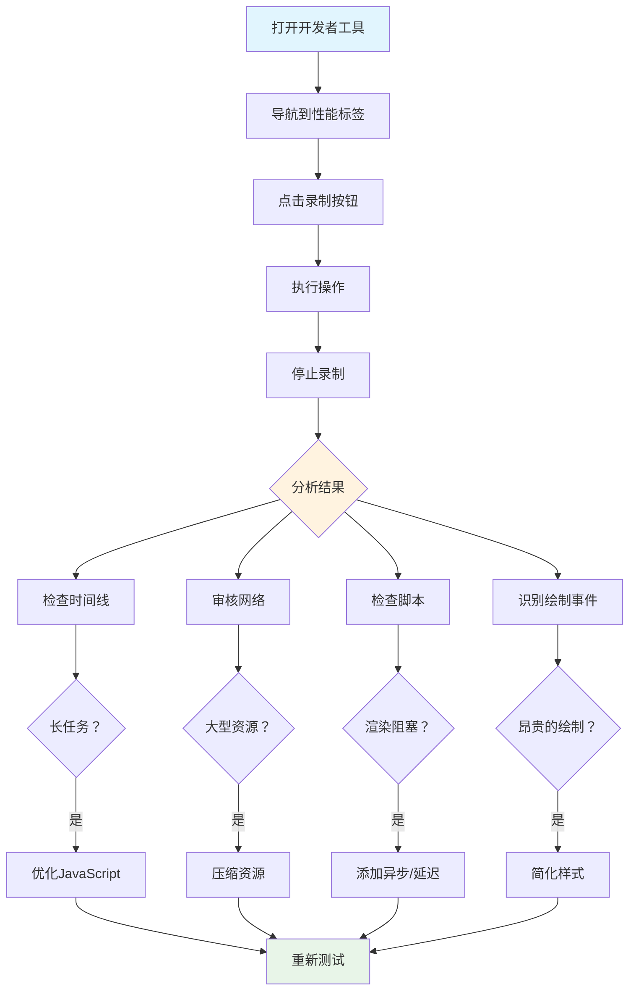

<!--
CO_OP_TRANSLATOR_METADATA:
{
  "original_hash": "b275fed2c6fc90d2b9b6661a3225faa2",
  "translation_date": "2026-01-06T11:34:42+00:00",
  "source_file": "5-browser-extension/3-background-tasks-and-performance/README.md",
  "language_code": "zh"
}
-->
# 浏览器扩展项目 第3部分：了解后台任务与性能


有没有想过为什么有些浏览器扩展感觉响应迅速而灵敏，而另一些则显得迟缓？秘诀就在幕后。在用户点击扩展界面时，后台有一系列进程静静管理数据获取、图标更新和系统资源。

这是浏览器扩展系列的最后一课，我们将让你的碳足迹追踪器流畅运行。你将添加动态图标更新，并学习如何在性能问题出现前发现它们。这就像调校赛车——小优化能大幅提升整体运行表现。

完成后，你将拥有一个打磨完善的扩展，并理解区分优秀及卓越 web 应用的性能原则。让我们探索浏览器优化的世界吧。

## 课前测验

[课前测验](https://ff-quizzes.netlify.app/web/quiz/27)

### 介绍

在之前的课程中，你已搭建了表单，连接 API，并处理异步数据获取。你的扩展已初具雏形。

现在我们需要添加最后的润色 —— 比如让扩展图标根据碳数据变换颜色。这让我想起 NASA 优化阿波罗飞船每个系统时的状态。它们必须最大化利用每个周期和内存，因为性能关乎生命。虽然我们的浏览器扩展没那么关键，但同样原则适用——高效代码带来更佳用户体验。


## Web 性能基础

当代码高效运行时，人们真的能*感受到*区别。你知道页面瞬间加载或者动画流畅时的那种感觉吗？这就是良好性能的体现。

性能不仅是速度，而是打造自然流畅而非笨拙挫败的网页体验。在计算机早期，Grace Hopper 著名地将一根约一英尺长的细线放在桌上，演示光在十亿分之一秒内的传播距离，用以说明每一微秒在计算中的重要性。让我们探索帮助你找出性能瓶颈的侦查工具吧。

> “网站性能关乎两个方面：页面加载的速度，以及代码运行的速度。” —— [Zack Grossbart](https://www.smashingmagazine.com/2012/06/javascript-profiling-chrome-developer-tools/)

让网站在各种设备、各种用户、各种情况下极速运行的话题自然非常庞杂。以下是你构建普通网页项目或浏览器扩展时需牢记的要点。

优化网站的第一步是理解底层的实际运作。幸运的是，浏览器内置了强大的侦查工具。


在 Edge 中打开开发者工具，点击右上角的三点菜单，选择 更多工具 > 开发者工具。或者使用快捷键：Windows 上为 `Ctrl` + `Shift` + `I`，Mac 上为 `Option` + `Command` + `I`。进入后点击 Performance（性能）标签页 —— 这里是你的调查现场。

**这是你的性能侦查工具箱：**
- **打开** 开发者工具（开发者必备！）
- **切换** 到 Performance 标签页，想象它是你的网页健康追踪器
- **点击** 录制按钮，然后观察页面动作
- **分析** 结果以发现性能瓶颈

试试吧。打开一个网站（例如 Microsoft.com），点击“录制”然后刷新页面，查看性能分析器捕捉的一切。当停止录制，你会看到浏览器如何“脚本执行”（scripts）、“渲染”（renders）和“绘制”（paints）的详细分解。这让我想起火箭发射时指挥中心监控所有系统——你获取实时且详细的操作数据。


✅ 若想深入了解，请查阅 [微软文档](https://docs.microsoft.com/microsoft-edge/devtools-guide/performance/?WT.mc_id=academic-77807-sagibbon)

> 专业提示：测试前请清理浏览器缓存，查看首次访问者的页面性能——通常与重复访问完全不同！

选取时间线上的部分，放大查看加载时发生的事件。

通过选取时间线片段，查看摘要面板，获得页面性能快照：


查看事件日志面板是否有事件耗时超过15毫秒：


✅ 熟悉你的分析器！在本站打开开发者工具，看看是否存在瓶颈。加载最慢和最快的资源分别是什么？


## 分析时要注意什么

运行分析器只是第一步——真正的技能是理解这些彩色图表告诉你的信息。不用怕，你会学会解读它们。经验丰富的开发者已能提前发现警示信号，防止问题加剧。

让我们聊聊常见的嫌疑犯——那种经常潜入网页项目的性能杀手。正如玛丽·居里在实验室细致监测辐射水平，我们也须警惕表明潜在麻烦的模式。及早发现会省去你和用户大量麻烦。

**资源大小**：随着时间推移，网站变得“越来越重”，大部分增长来自图片。就像我们在数码行李箱里塞了越来越多东西。

✅ 请浏览 [Internet Archive](https://httparchive.org/reports/page-weight) 看看页面大小的历史增长——颇有启发。

**保持资源优化的小窍门：**
- **压缩** 图片！现代格式如 WebP 会大幅减小文件体积
- **根据设备** 提供合适尺寸的图片——不必给手机发送庞大的桌面图片
- **压缩** CSS 和 JavaScript——每个字节都重要
- **使用** 延迟加载，让图片只有在用户滚动到时才下载

**DOM 遍历**：浏览器基于你写的代码构建文档对象模型（DOM），为了良好的页面性能，应保持标签最少，仅使用和样式化必须的元素。过多的 CSS 也能优化；例如，只在某页使用的样式无需包含在主样式表中。

**DOM 优化关键策略：**
- **减少** HTML 元素和嵌套层级数量
- **移除** 未使用的 CSS 规则并高效合并样式表
- **组织** CSS 只加载每页所需样式
- **语义化** HTML 结构以协助浏览器解析

**JavaScript**：每位 JS 开发者需警惕“阻塞渲染”的脚本——须在 DOM 遍历与绘制前加载完毕。可以考虑用 `defer` 属性延迟内联脚本加载（如 Terrarium 模块所用）。

**现代 JavaScript 优化技巧：**
- **使用** `defer` 属性让脚本在 DOM 解析后加载
- **实现** 代码拆分，只加载必要的 JS
- **应用** 延迟加载非关键功能
- **尽量减少** 依赖重量级库与框架

✅ 可通过 [Site Speed Test 网站](https://www.webpagetest.org/) 试测一些站点，了解常规的性能检测点。

### 🔄 **教学回顾**
**性能理解**：在构建扩展功能前，确保你能：
- ✅ 解释从HTML到像素的关键渲染路径
- ✅ 识别网页应用常见性能瓶颈
- ✅ 使用浏览器开发工具分析页面性能
- ✅ 理解资源大小和 DOM 复杂度如何影响速度

**快速自测**：遇到阻塞渲染的 JavaScript 会发生什么？
*答：浏览器必须先下载并执行脚本，才能继续解析 HTML 并渲染页面。*

**现实世界性能影响**：
- **100毫秒延迟**：用户能感知到缓慢
- **1秒延迟**：用户开始失去注意力
- **3秒以上**：40% 用户离开页面
- **移动网络**：性能更为重要

了解浏览器如何渲染你发送的资源后，来看完成扩展还需做的几件事：

### 创建颜色计算函数

现在我们创建一个函数，将数值数据转成有意义的颜色。就像交通灯系统——绿色表示清洁能源，红色代表高碳强度。

该函数将以 API 返回的 CO2 数据为基础，确定最能反映环境影响的颜色。这类似科学家使用色彩编码的热力图，可视化复杂数据模式——从海洋温度到恒星形成。把这个函数加到 `/src/index.js`，紧跟前面声明的 `const` 变量之后：


```javascript
function calculateColor(value) {
	// 定义二氧化碳强度尺度（克/千瓦时）
	const co2Scale = [0, 150, 600, 750, 800];
	// 对应颜色从绿色（清洁）到深棕色（高碳）
	const colors = ['#2AA364', '#F5EB4D', '#9E4229', '#381D02', '#381D02'];

	// 找到与输入值最接近的尺度值
	const closestNum = co2Scale.sort((a, b) => {
		return Math.abs(a - value) - Math.abs(b - value);
	})[0];
	
	console.log(`${value} is closest to ${closestNum}`);
	
	// 查找颜色映射的索引
	const num = (element) => element > closestNum;
	const scaleIndex = co2Scale.findIndex(num);

	const closestColor = colors[scaleIndex];
	console.log(scaleIndex, closestColor);

	// 向后台脚本发送颜色更新消息
	chrome.runtime.sendMessage({ action: 'updateIcon', value: { color: closestColor } });
}
```

**解析这巧妙函数：**
- **初始化了** 两个数组——一个存 CO2 级别，另一个存颜色（绿代表清洁，棕色代表污染）
- **通过数组排序** 找到最接近实际 CO2 值的匹配
- **用 findIndex() 方法** 获取对应的颜色索引
- **向 Chrome 后台脚本发送** 选定颜色的消息
- **借助模板字符串** （反引号）简化字符串格式化
- **用 const** 保持代码整洁有序

`chrome.runtime` [API](https://developer.chrome.com/extensions/runtime) 就像扩展的神经系统——负责幕后通信和任务处理：

> “使用 chrome.runtime API 可以访问后台页面，获取清单详情，监听并响应应用或扩展生命周期中的事件。此 API 还可将 URL 相对路径转换为完整 URL。”

**Chrome Runtime API 的便捷之处：**
- **让** 扩展各部分相互通信
- **处理** 后台工作，避免冻结用户界面
- **管理** 扩展生命周期事件
- **简化** 脚本间消息传递

✅ 如果你在 Edge 浏览器上开发此扩展，可能会惊讶于使用的是 chrome API。新版 Edge 基于 Chromium 引擎，因此能利用这些工具。


> **专业提示**：要分析浏览器扩展性能，从扩展自身启动开发者工具。因为它是独立的浏览器实例，可查看扩展特定性能指标。

### 设置默认图标颜色

在开始获取真实数据前，给扩展一个初始状态。没人喜欢看空白或损坏的图标。我们先用绿色，保证安装即可见扩展正常工作。

在你的 `init()` 函数里，配置默认的绿色图标：

```javascript
chrome.runtime.sendMessage({
	action: 'updateIcon',
	value: {
		color: 'green',
	},
});
```

**此初始化实现了：**
- **设为** 中性绿色作为默认状态
- **加载时** 立即提供视觉反馈
- **建立** 与后台脚本的通信模式
- **确保** 数据加载前用户见到的是正常的扩展图标

### 调用函数，执行更新

现在将各部分连线，等到有最新 CO2 数据时，图标能自动变色。就像装置电路接通，组件齐心协力。

在拿到 API 返回的 CO2 数据后，加上这条调用语句：

```javascript
// 从API获取CO2数据后
// 让CO2 = data.data[0].intensity.actual;
calculateColor(CO2);
```

**该整合实现了：**
- **连接** API 数据流和视觉指示器系统
- **当新数据到来时** 触发图标自动更新
- **保证** 依据当前碳强度实时反馈视觉效果
- **保持** 数据获取与显示逻辑分离

最后，在 `/dist/background.js` 里添加监听这些后台操作的监听器：

```javascript
// 监听来自内容脚本的消息
chrome.runtime.onMessage.addListener(function (msg, sender, sendResponse) {
	if (msg.action === 'updateIcon') {
		chrome.action.setIcon({ imageData: drawIcon(msg.value) });
	}
});

// 使用 Canvas API 绘制动态图标
// 借鉴自 energy lollipop 扩展 - 很棒的功能！
function drawIcon(value) {
	// 创建一个离屏画布以获得更好的性能
	const canvas = new OffscreenCanvas(200, 200);
	const context = canvas.getContext('2d');

	// 绘制一个代表碳强度的彩色圆圈
	context.beginPath();
	context.fillStyle = value.color;
	context.arc(100, 100, 50, 0, 2 * Math.PI);
	context.fill();

	// 返回浏览器图标的图像数据
	return context.getImageData(50, 50, 100, 100);
}
```

**这个后台脚本功能是：**
- **监听** 来自主脚本的消息（像前台接听电话）
- **处理** “updateIcon” 请求，更新工具栏图标
- **用 Canvas API** 动态创建图标
- **绘制** 一个位彩色圆，展示当前碳强度
- **更新** 浏览器工具栏图标
- **利用 OffscreenCanvas** 保持流畅性能（无界面阻塞）

✅ 你将在 [太空游戏课程](../../6-space-game/2-drawing-to-canvas/README.md) 中学到更多 Canvas API 知识。


### 🔄 **教学回顾**
**完整扩展理解**：确认你已掌握整个系统：
- ✅ 不同扩展脚本间怎样进行消息传递？
- ✅ 为什么为性能考虑使用 OffscreenCanvas 而不是普通 Canvas？
- ✅ Chrome Runtime API 在扩展架构中扮演什么角色？
- ✅ 颜色计算算法如何将数据映射到视觉反馈？

**性能考虑**：您的扩展现在展示了：
- **高效消息传递**：脚本上下文间清晰通信
- **优化渲染**：OffscreenCanvas 防止界面阻塞
- **实时更新**：基于实时数据的动态图标变化
- **内存管理**：适当的清理和资源处理

**是时候测试您的扩展了：**
- **通过** `npm run build` 构建所有内容
- **重新加载** 浏览器中的扩展（别忘了这一步）
- **打开** 您的扩展，观察图标的颜色变化
- **检查** 它如何响应来自全球的实时碳数据

现在您可以一目了然地知道，洗这批衣服是否合适，或者是否应该等待更清洁的能源。您刚刚构建了一个真正有用的东西，并在过程中学习了浏览器性能。

## GitHub Copilot Agent 挑战 🚀

使用 Agent 模式完成以下挑战：

**描述：** 通过添加跟踪并显示扩展不同组件加载时间的功能，增强浏览器扩展的性能监控能力。

**提示：** 创建一个性能监控系统，用于测量和记录从 API 获取 CO2 数据、计算颜色和更新图标所需的时间。添加一个名为 `performanceTracker` 的函数，使用 Performance API 测量这些操作，并在浏览器控制台以时间戳和持续时间指标的形式显示结果。

了解更多关于[agent 模式](https://code.visualstudio.com/blogs/2025/02/24/introducing-copilot-agent-mode)的信息。

## 🚀 挑战

这是一个有趣的侦探任务：挑选一些存在多年的开源网站（如 Wikipedia、GitHub 或 Stack Overflow），深入研究它们的提交历史。你能发现它们在哪里做出了性能改进吗？反复出现了哪些问题？

**你的调查方法：**
- **搜索** 包含“优化”、“性能”或“更快”等关键词的提交信息
- **观察** 有无模式 —— 它们是否持续修复相同类型的问题？
- **识别** 影响网站性能的常见元凶
- **分享** 你的发现 —— 让其他开发者从真实案例中学习

## 课后测验

[课后测验](https://ff-quizzes.netlify.app/web/quiz/28)

## 复习与自学

考虑订阅一个[性能通讯](https://perf.email/)

通过浏览器开发工具中的性能标签页，调查浏览器衡量网页性能的一些方法。你发现了哪些主要差异？

### ⚡ **接下来 5 分钟你可以做什么**
- [ ] 打开浏览器任务管理器（Chrome 中按 Shift+Esc）查看扩展资源使用情况
- [ ] 使用 DevTools 的性能标签页录制并分析网页性能
- [ ] 检查浏览器的扩展页，查看哪些扩展影响启动时间
- [ ] 尝试暂时禁用扩展，观察性能变化

### 🎯 **本小时你可以完成什么**
- [ ] 完成课后测验，理解性能概念
- [ ] 为你的浏览器扩展实现一个后台脚本
- [ ] 学习使用 browser.alarms 进行高效后台任务
- [ ] 练习内容脚本与后台脚本之间的消息传递
- [ ] 测量并优化扩展的资源使用

### 📅 **你的为期一周的性能之旅**
- [ ] 完成一个具有后台功能的高性能浏览器扩展
- [ ] 精通 service workers 和现代扩展架构
- [ ] 实现高效的数据同步与缓存策略
- [ ] 学习扩展性能的高级调试技术
- [ ] 优化扩展的功能与资源效率
- [ ] 创建全面的扩展性能测试方案

### 🌟 **你为期一个月的优化精通**
- [ ] 构建企业级高性能浏览器扩展
- [ ] 学习 Web Workers、Service Workers 和现代网页性能
- [ ] 参与性能优化相关的开源项目
- [ ] 掌握浏览器内部原理和高级调试技术
- [ ] 创建性能监控工具和最佳实践指南
- [ ] 成为帮助优化网页应用的性能专家

## 🎯 你的浏览器扩展精通时间线


### 🛠️ 你的完整扩展开发工具包

完成本三部曲后，你已经掌握：
- **浏览器架构**：深入理解扩展如何与浏览器系统集成
- **性能分析**：使用开发者工具识别并修复瓶颈
- **异步编程**：现代 JavaScript 模式实现响应式、非阻塞操作
- **API 集成**：带认证和错误处理的外部数据获取
- **视觉设计**：动态 UI 更新和基于 Canvas 的图形生成
- **消息传递**：扩展架构中脚本间通信
- **用户体验**：加载状态、错误处理与直观交互
- **生产技能**：面向真实场景的测试、调试与优化

**真实应用场景**：你的扩展开发技能直接应用于：
- **渐进式网页应用**：相似的架构与性能模式
- **Electron 桌面应用**：使用网页技术的跨平台应用
- **移动混合应用**：基于 Cordova/PhoneGap 的网页 API 应用
- **企业网页应用**：复杂的仪表盘和生产力工具
- **Chrome DevTools 扩展**：高级开发者工具与调试
- **网页 API 集成**：与外部服务通信的任何应用

**职业影响力**：你现在可以：
- **构建** 从概念到部署的生产级浏览器扩展
- **优化** 使用行业标准分析工具提升网页性能
- **设计** 可扩展且关注点分离良好的系统架构
- **调试** 复杂的异步操作和跨上下文通信
- **贡献** 于开源扩展项目和浏览器标准

**升级机会**：
- **Chrome 网上应用店开发者**：发布面向数百万用户的扩展
- **网页性能工程师**：专注优化和用户体验
- **浏览器平台开发者**：参与浏览器引擎开发
- **扩展框架创建者**：构建辅助开发者的工具
- **开发者关系**：通过教学和内容创作分享知识

🌟 **成就解锁**：你已经构建了一个完整、功能齐全的浏览器扩展，展示了专业开发实践和现代网页标准！

## 作业

[分析一个网站的性能](assignment.md)

---

<!-- CO-OP TRANSLATOR DISCLAIMER START -->
**免责声明**：  
本文件由人工智能翻译服务[Co-op Translator](https://github.com/Azure/co-op-translator)翻译而成。尽管我们努力确保翻译的准确性，但请注意，自动翻译可能存在错误或不准确之处。原始语言的文件应视为权威来源。对于重要信息，建议采用专业人工翻译。对于因使用本翻译而产生的任何误解或误释，我们不承担任何责任。
<!-- CO-OP TRANSLATOR DISCLAIMER END -->