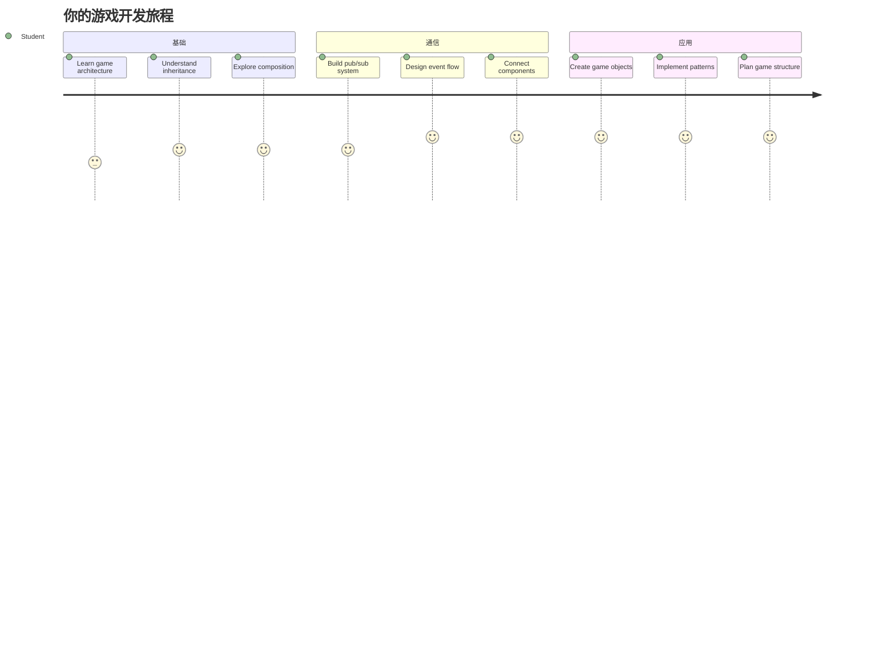
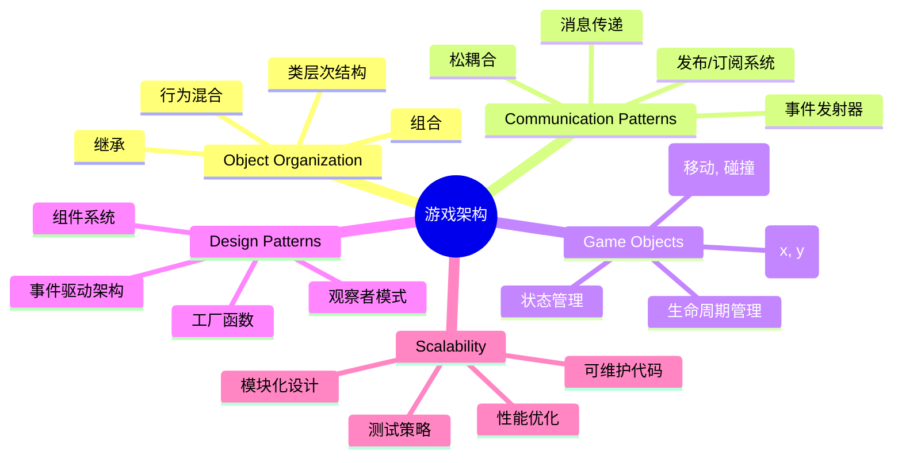
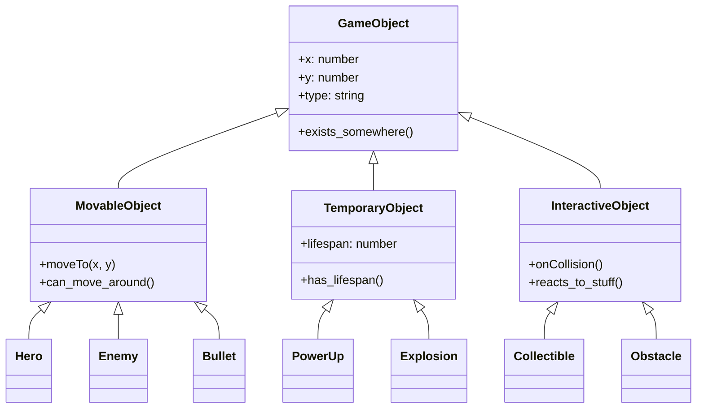
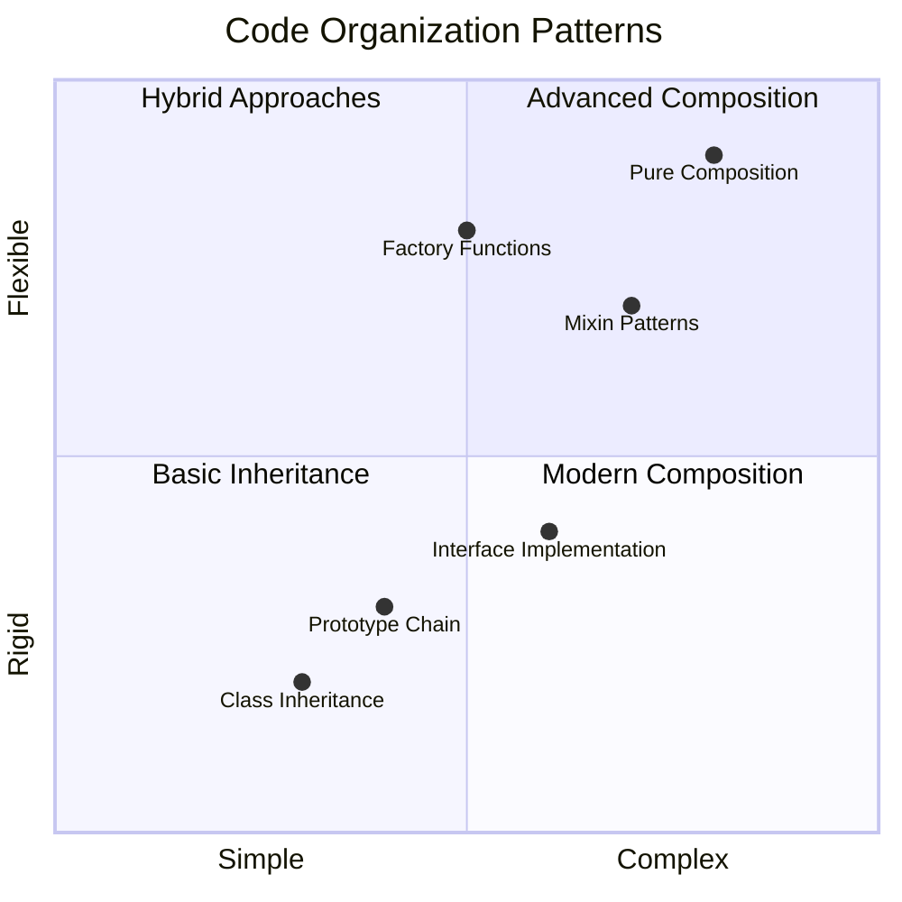
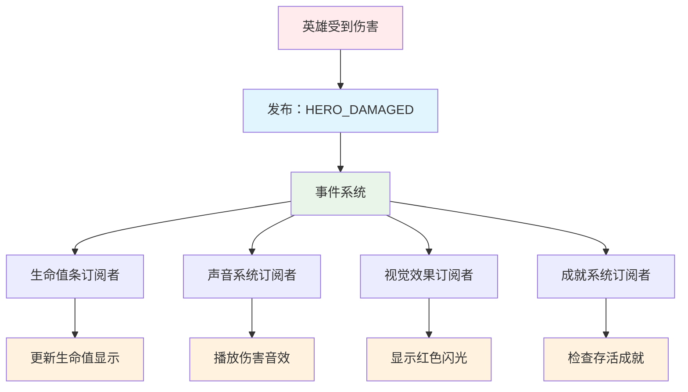
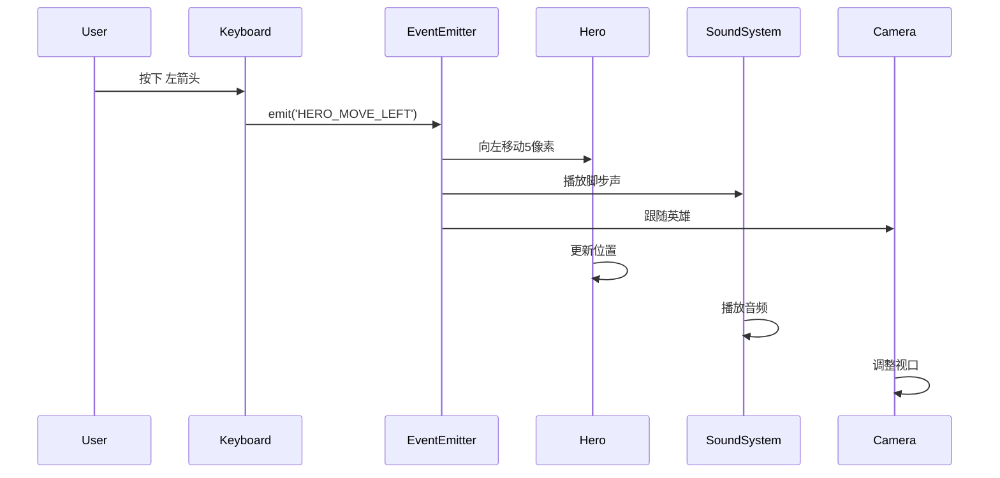

<!--
CO_OP_TRANSLATOR_METADATA:
{
  "original_hash": "a6332a7bb4d0be3bfd24199c83993777",
  "translation_date": "2026-01-06T11:29:06+00:00",
  "source_file": "6-space-game/1-introduction/README.md",
  "language_code": "zh"
}
-->
# 构建一个太空游戏 第一部分: 介绍




就像美国宇航局的任务控制中心在发射过程中协调多个系统一样，我们将构建一个太空游戏，展示程序的不同部分如何无缝协作。在创建一个你可以实际玩的项目时，你将学习适用于任何软件项目的基本编程概念。

我们将探索组织代码的两种基本方法：继承和组合。这不仅仅是学术概念——它们是驱动从视频游戏到银行系统所有内容的相同模式。我们还将实现一个名为发布/订阅（pub/sub）的通信系统，它类似于航天器中使用的通信网络，允许不同组件共享信息而不产生依赖关系。

通过本系列课程的结束，你将理解如何构建可扩展和演进的应用程序——无论你是开发游戏、Web应用程序，还是任何其他软件系统。


## 课前测验

[课前测验](https://ff-quizzes.netlify.app/web/quiz/29)

## 游戏开发中的继承与组合

随着项目复杂度增大，代码组织变得尤为关键。最初简单的脚本如果没有良好的结构，维护会变得困难——就像阿波罗任务需要对上千个组件进行细致协作一样。

我们将探索两种组织代码的基本方式：继承和组合。每种都有独特的优点，理解它们有助于你在不同情况下选择合适的方式。我们将通过太空游戏进行演示，其中英雄、敌人、道具以及其他对象必须高效互动。

✅ 一本最著名的编程书籍就讲述了[设计模式](https://en.wikipedia.org/wiki/Design_Patterns)。

在任何游戏中，你都有 `游戏对象`——填充游戏世界的交互元素。英雄、敌人、道具和视觉特效都是游戏对象。它们都存在于特定屏幕坐标，用 `x` 和 `y` 值表示，类似于在坐标平面上绘点。

尽管外观不同，这些对象通常共享基本行为：

- **它们存在于某处** —— 每个对象都有 x 和 y 坐标，游戏才能知道在哪里绘制它
- **许多对象可以移动** —— 英雄奔跑，敌人追逐，子弹飞过屏幕
- **它们有生命周期** —— 有些永久存在，另一些（比如爆炸）短暂出现后消失
- **它们对事件做出反应** —— 碰撞发生时，道具被拾取，血条更新

✅ 想想像吃豆人这样的游戏。你能在游戏中识别上面提到的四种对象类型吗？


### 通过代码表达行为

现在你理解了游戏对象共有的行为，让我们探索如何用 JavaScript 实现这些行为。你可以通过添加到类或单个对象的方法来表达对象行为，且有多种实现方式。

**基于类的方法**

类和继承为组织游戏对象提供了一种结构化的方式。就像卡尔·林奈所构建的生物分类系统一样，你从一个含有共有属性的基础类开始，然后创建派生类继承这些基本功能并添加特定能力。

✅ 继承是一个重要概念，更多内容请见[MDN关于继承的文章](https://developer.mozilla.org/docs/Web/JavaScript/Inheritance_and_the_prototype_chain)。

下面是如何使用类和继承实现游戏对象的示例：

```javascript
// 第一步：创建基础的 GameObject 类
class GameObject {
  constructor(x, y, type) {
    this.x = x;
    this.y = y;
    this.type = type;
  }
}
```

**我们逐步拆解理解：**
- 我们创建了一个基础模板，所有游戏对象都能使用它
- 构造函数保存对象的位置（`x`, `y`）和类型
- 这成为所有游戏对象构建的基础

```javascript
// 第2步：通过继承添加移动功能
class Movable extends GameObject {
  constructor(x, y, type) {
    super(x, y, type); // 调用父类构造函数
  }

  // 添加移动到新位置的能力
  moveTo(x, y) {
    this.x = x;
    this.y = y;
  }
}
```

**在上例中，我们：**
- **扩展**了 GameObject 类以添加移动功能
- **使用** `super()` 调用父类构造函数初始化继承的属性
- **添加**了 `moveTo()` 方法来更新对象位置

```javascript
// 第3步：创建特定的游戏对象类型
class Hero extends Movable {
  constructor(x, y) {
    super(x, y, 'Hero'); // 自动设置类型
  }
}

class Tree extends GameObject {
  constructor(x, y) {
    super(x, y, 'Tree'); // 树木不需要移动
  }
}

// 第4步：使用您的游戏对象
const hero = new Hero(0, 0);
hero.moveTo(5, 5); // 英雄可以移动！

const tree = new Tree(10, 15);
// tree.moveTo() 会导致错误——树木不能移动
```

**理解这些概念：**
- **创建**继承适当行为的专门对象类型
- **展示**继承如何选择性包含功能
- **说明**英雄可以移动，而树木保持静止
- **演示**类层级防止不恰当操作

✅ 花几分钟重新构思吃豆人中的英雄（比如 Inky、Pinky 或 Blinky）如何用 JavaScript 编写。

**组合方法**

组合遵循模块化设计理念，类似于工程师设计航天器时使用可互换组件。你不是继承父类，而是组合特定行为来创建具有所需功能的对象。这种方法提供了灵活性，不受严格层级限制。

```javascript
// 第一步：创建基础行为对象
const gameObject = {
  x: 0,
  y: 0,
  type: ''
};

const movable = {
  moveTo(x, y) {
    this.x = x;
    this.y = y;
  }
};
```

**这段代码的作用：**
- **定义**了一个带有位置和类型的基础 `gameObject`
- **创建**了一个独立的 `movable` 行为对象，实现移动功能
- **分离**了位置数据和移动逻辑，使职责独立

```javascript
// 第2步：通过组合行为来组合对象
const movableObject = { ...gameObject, ...movable };

// 第3步：为不同类型的对象创建工厂函数
function createHero(x, y) {
  return {
    ...movableObject,
    x,
    y,
    type: 'Hero'
  };
}

function createStatic(x, y, type) {
  return {
    ...gameObject,
    x,
    y,
    type
  };
}
```

**在上面，我们：**
- **通过扩展语法**组合基础对象属性和移动行为
- **创建**工厂函数返回定制对象
- **实现**了无需复杂类层级即可灵活创建对象
- **使**对象恰好拥有所需行为

```javascript
// 第4步：创建并使用你组合的对象
const hero = createHero(10, 10);
hero.moveTo(5, 5); // 工作完美！

const tree = createStatic(0, 0, 'Tree');
// tree.moveTo() 未定义 - 未组合任何移动行为
```

**记住关键点：**
- **通过混合行为组合对象，而非继承**
- **提供**比严格继承层级更大的灵活性
- **允许**对象恰好拥有它们需要的特性
- **使用**现代 JavaScript 扩展语法实现干净合并
```

**Which Pattern Should You Choose?**

**Which Pattern Should You Choose?**



> 💡 **专业提示**：两种模式在现代 JavaScript 开发中各有用武之地。类适合明确定义的层级结构，而组合在需要最大灵活性时表现出色。
> 
**何时使用：**
- **当存在明确的“是一个”关系时选择继承**（例如，英雄 *是一个* 可移动对象）
- **当存在“有一个”关系时选择组合**（例如，英雄 *拥有* 移动能力）
- **考虑**团队偏好和项目需求
- **记住**可以在同一应用中混合使用两者

### 🔄 **教学自检**
**对象组织理解**：在进入通信模式之前，确保你能：
- ✅ 解释继承与组合的区别
- ✅ 识别何时使用类还是工厂函数
- ✅ 理解继承中 `super()` 关键字的作用
- ✅ 认识每种方法对游戏开发的优势

**快速自测**：你如何创建一个既可移动又能飞行的敌人？
- **继承方法**: `class FlyingEnemy extends Movable`
- **组合方法**: `{ ...movable, ...flyable, ...gameObject }`

**现实联系**：这些模式无处不在：
- **React 组件**：属性（组合）与类继承
- **游戏引擎**：实体组件系统使用组合
- **移动应用**：UI 框架常用继承层级

## 通信模式：发布/订阅系统

随着应用复杂度提升，管理组件间通信变得困难。发布-订阅模式（pub/sub）用类似广播的原理解决这个问题——一个发射器能触达多个接收器，无需知道谁在监听。

考虑英雄受伤时的情况：血条更新，音效播放，视觉反馈出现。英雄对象不用直接耦合这些系统，而是广播一个“受伤”消息。任何需要响应的系统都能订阅该消息并做出反应。

✅ **Pub/Sub** 代表“发布-订阅”


### 理解 Pub/Sub 架构

pub/sub 模式使应用的不同部分松散耦合，即它们能协作而不直接依赖彼此。这种分离让代码更易维护、测试和灵活应对变化。

**pub/sub 的关键角色：**
- **消息** —— 简单的文本标签，例如 `'PLAYER_SCORED'` ，描述发生的事件（含额外信息）
- **发布者** —— 向所有监听者“大声宣布”发生了什么
- **订阅者** —— 说“我关注这个事件”，并在事件发生时响应
- **事件系统** —— 确保消息送达正确监听者的中间人

### 构建事件系统

让我们创建一个简单而强大的事件系统，演示这些概念：

```javascript
// 第一步：创建 EventEmitter 类
class EventEmitter {
  constructor() {
    this.listeners = {}; // 存储所有事件监听器
  }
  
  // 为特定消息类型注册监听器
  on(message, listener) {
    if (!this.listeners[message]) {
      this.listeners[message] = [];
    }
    this.listeners[message].push(listener);
  }
  
  // 向所有注册的监听器发送消息
  emit(message, payload = null) {
    if (this.listeners[message]) {
      this.listeners[message].forEach(listener => {
        listener(message, payload);
      });
    }
  }
}
```

**拆解发生的事情：**
- **创建**一个简单类实现的中心事件管理系统
- **按消息类型**在对象中存储监听器
- **使用** `on()` 方法注册新监听器
- **用** `emit()` 方法广播消息到所有感兴趣的监听者
- **支持**可选的数据负载以传递相关信息

### 综合示例演示

好，让我们看看实际应用！我们构建一个简单的移动系统，展示 pub/sub 的清晰灵活性：

```javascript
// 第一步：定义你的消息类型
const Messages = {
  HERO_MOVE_LEFT: 'HERO_MOVE_LEFT',
  HERO_MOVE_RIGHT: 'HERO_MOVE_RIGHT',
  ENEMY_SPOTTED: 'ENEMY_SPOTTED'
};

// 第二步：创建你的事件系统和游戏对象
const eventEmitter = new EventEmitter();
const hero = createHero(0, 0);
```

**这段代码作用：**
- **定义**常量对象防止消息名拼写错误
- **创建**事件发射器实例处理所有通信
- **初始化**位于起始位置的英雄对象

```javascript
// 第三步：设置事件监听器（订阅者）
eventEmitter.on(Messages.HERO_MOVE_LEFT, () => {
  hero.moveTo(hero.x - 5, hero.y);
  console.log(`Hero moved to position: ${hero.x}, ${hero.y}`);
});

eventEmitter.on(Messages.HERO_MOVE_RIGHT, () => {
  hero.moveTo(hero.x + 5, hero.y);
  console.log(`Hero moved to position: ${hero.x}, ${hero.y}`);
});
```

**上述代码实现：**
- **注册**响应移动消息的事件监听器
- **根据移动方向**更新英雄位置
- **添加**控制台日志跟踪英雄位置变化
- **移动逻辑**与输入处理分离

```javascript
// 第4步：将键盘输入连接到事件（发布者）
window.addEventListener('keydown', (event) => {
  switch(event.key) {
    case 'ArrowLeft':
      eventEmitter.emit(Messages.HERO_MOVE_LEFT);
      break;
    case 'ArrowRight':
      eventEmitter.emit(Messages.HERO_MOVE_RIGHT);
      break;
  }
});
```

**进一步理解：**
- **连接**键盘输入与游戏事件，避免紧耦合
- **使**输入系统可间接与游戏对象通信
- **允许**多个系统响应同一键盘事件
- **便于**更改键绑定或添加新输入方法


> 💡 **专业提示**：此模式的美妙在于灵活性！你只需添加更多事件监听器即可添加音效、屏幕抖动或粒子效果——无需修改现有的键盘或移动代码。
> 
**你会喜欢此方法的原因：**
- 新功能添加变得非常简单——只需监听感兴趣事件
- 多个模块可响应同一事件，互不干扰
- 测试更加简单，因为各部分独立工作
- 出现问题时，知道准确排查位置

### Pub/Sub 为什么能有效扩展

随着应用复杂性增加，pub/sub 模式保持简洁。无论是管理数十个敌人、动态 UI 更新还是音效系统，该模式在不改变架构的情况下处理规模增大。新功能可无缝集成进现有事件系统，不影响已建立功能。

> ⚠️ **常见错误**：早期不要创建过多具体消息类型。先用大类分类，随着游戏需求明确再细化。
> 
**最佳实践：**
- **将相关消息分组归类**
- **使用描述性名称清晰表达事件**
- **保持消息负载简单聚焦**
- **为团队协作记录消息类型文档**

### 🔄 **教学自检**
**事件驱动架构理解**：确认你掌握整体系统：
- ✅ pub/sub 模式如何防止组件间紧耦合？
- ✅ 为什么事件驱动架构更易添加新功能？
- ✅ EventEmitter 在通信流程中起什么作用？
- ✅ 消息常量如何防止错误并提升可维护性？

**设计挑战**：你如何用 pub/sub 处理这些游戏场景？
1. **敌人死亡**：更新得分，播放音效，生成道具，移除屏幕
2. **关卡完成**：停止音乐，显示 UI，保存进度，加载下一关
3. **道具收集**：增强能力，更新 UI，播放效果，启动计时

**专业联系**：此模式应用于：
- **前端框架**：React/Vue 事件系统
- **后端服务**：微服务通信
- **游戏引擎**：Unity 事件系统
- **移动开发**：iOS/Android 通知系统

---

## GitHub Copilot Agent 挑战 🚀

使用 Agent 模式完成以下挑战：

**描述：** 使用继承和发布/订阅模式创建一个简单的游戏对象系统。你将实现一个基本游戏，其中不同对象通过事件进行通信而无需直接了解彼此。

**提示：** 创建一个 JavaScript 游戏系统，要求如下：1）创建一个基础 GameObject 类，含 x, y 坐标和 type 属性。2）创建一个继承自 GameObject 且可以移动的 Hero 类。3）创建一个继承自 GameObject 且能追踪英雄的 Enemy 类。4）实现一个用于发布/订阅模式的 EventEmitter 类。5）设置事件监听器，当英雄移动时，附近敌人接收 'HERO_MOVED' 事件并更新位置向英雄移动。使用 console.log 展示对象间的通信。

了解更多[Agent 模式](https://code.visualstudio.com/blogs/2025/02/24/introducing-copilot-agent-mode)。

## 🚀 挑战
考虑发布-订阅模式如何增强游戏架构。确定哪些组件应发出事件以及系统应如何响应。设计一个游戏概念并绘制其组件之间的通信模式。

## 课后测验

[课后测验](https://ff-quizzes.netlify.app/web/quiz/30)

## 复习与自学

通过[阅读相关内容](https://docs.microsoft.com/azure/architecture/patterns/publisher-subscriber/?WT.mc_id=academic-77807-sagibbon)深入了解发布/订阅。

### ⚡ **接下来5分钟你可以做的事情**
- [ ] 打开任何在线HTML5游戏，使用开发者工具检查其代码
- [ ] 创建一个简单的HTML5 Canvas元素并绘制基本形状
- [ ] 尝试使用`setInterval`创建简单动画循环
- [ ] 浏览Canvas API文档，尝试某个绘图方法

### 🎯 **本小时你可以完成的任务**
- [ ] 完成课后测验并理解游戏开发概念
- [ ] 搭建包含HTML、CSS和JavaScript文件的游戏项目结构
- [ ] 创建一个持续更新和渲染的基础游戏循环
- [ ] 在画布上绘制你的第一个游戏精灵
- [ ] 实现基础的图片和声音资源加载

### 📅 **你的一周游戏创作计划**
- [ ] 完成包含所有计划功能的完整太空游戏
- [ ] 添加精细的图形、音效和流畅动画
- [ ] 实现游戏状态（开始界面、游戏中、游戏结束）
- [ ] 创建计分系统和玩家进度追踪
- [ ] 让游戏响应式兼容多设备
- [ ] 在线分享游戏并收集玩家反馈

### 🌟 **你的一月游戏开发计划**
- [ ] 开发多个不同类型和机制的游戏
- [ ] 学习使用像Phaser或Three.js这样的游戏开发框架
- [ ] 参与开源游戏开发项目
- [ ] 精通高级游戏编程模式和优化技巧
- [ ] 创建展示游戏开发技能的作品集
- [ ] 指导对游戏开发和互动媒体感兴趣的新人

## 🎯 你的游戏开发精通时间表

```mermaid
timeline
    title 游戏架构学习进度
    
    section 对象模式（20分钟）
        代码组织：类继承
                     ：组合模式
                     ：工厂函数
                     ：行为混合
        
    section 通信系统（25分钟）
        事件架构：发布/订阅实现
                     ：消息设计
                     ：事件发射器
                     ：松耦合
        
    section 游戏对象设计（30分钟）
        实体系统：属性管理
                     ：行为组合
                     ：状态处理
                     ：生命周期管理
        
    section 架构模式（35分钟）
        系统设计：组件系统
                     ：观察者模式
                     ：命令模式
                     ：状态机
        
    section 高级概念（45分钟）
        可扩展架构：性能优化
                     ：内存管理
                     ：模块化设计
                     ：测试策略
        
    section 游戏引擎概念（1周）
        专业开发：场景图
                     ：资源管理
                     ：渲染管线
                     ：物理整合
        
    section 框架精通（2周）
        现代游戏开发：React游戏模式
                         ：Canvas优化
                         ：WebGL基础
                         ：PWA游戏
        
    section 行业实践（1个月）
        专业技能：团队协作
                     ：代码审查
                     ：游戏设计模式
                     ：性能剖析
```


### 🛠️ 你的游戏架构工具包总结

完成本课后，你已有：
- **设计模式精通**：理解继承与组合的权衡
- **事件驱动架构**：发布/订阅实现的可扩展通信
- **面向对象设计**：类层级和行为组合
- **现代JavaScript**：工厂函数、展开语法以及ES6+模式
- **可扩展架构**：低耦合和模块化设计原则
- **游戏开发基础**：实体系统和组件模式
- **专业模式**：业界标准代码组织方法

**现实应用场景**：这些模式适用于：
- **前端框架**：React/Vue组件架构和状态管理
- **后端服务**：微服务通信和事件驱动系统
- **移动开发**：iOS/Android应用架构和通知系统
- **游戏引擎**：Unity、Unreal及基于Web的游戏开发
- **企业软件**：事件溯源和分布式系统设计
- **API设计**：RESTful服务和实时通信

**获得的专业技能**：你现在能：
- **设计**可扩展的软件架构，使用成熟的设计模式
- **实现**能够处理复杂交互的事件驱动系统
- **选择**适合不同场景的代码组织策略
- **调试**并维护低耦合系统
- **沟通**使用业界标准术语表达技术决策

**下一步**：你已准备好在实际游戏中实现这些模式，探索高级游戏开发主题，或将这些架构理念应用于网页应用！

🌟 **成就解锁**：你已掌握支持从简单游戏到复杂企业系统的基础软件架构模式！

## 任务

[设计一个游戏](assignment.md)

---

<!-- CO-OP TRANSLATOR DISCLAIMER START -->
**免责声明**：
本文件由 AI 翻译服务 [Co-op Translator](https://github.com/Azure/co-op-translator) 翻译而成。尽管我们力求准确，但请注意自动翻译可能存在错误或不准确之处。原始语言版本的文件应被视为权威来源。对于重要信息，建议使用专业人工翻译。我们不对因使用本翻译而产生的任何误解或误释承担责任。
<!-- CO-OP TRANSLATOR DISCLAIMER END -->