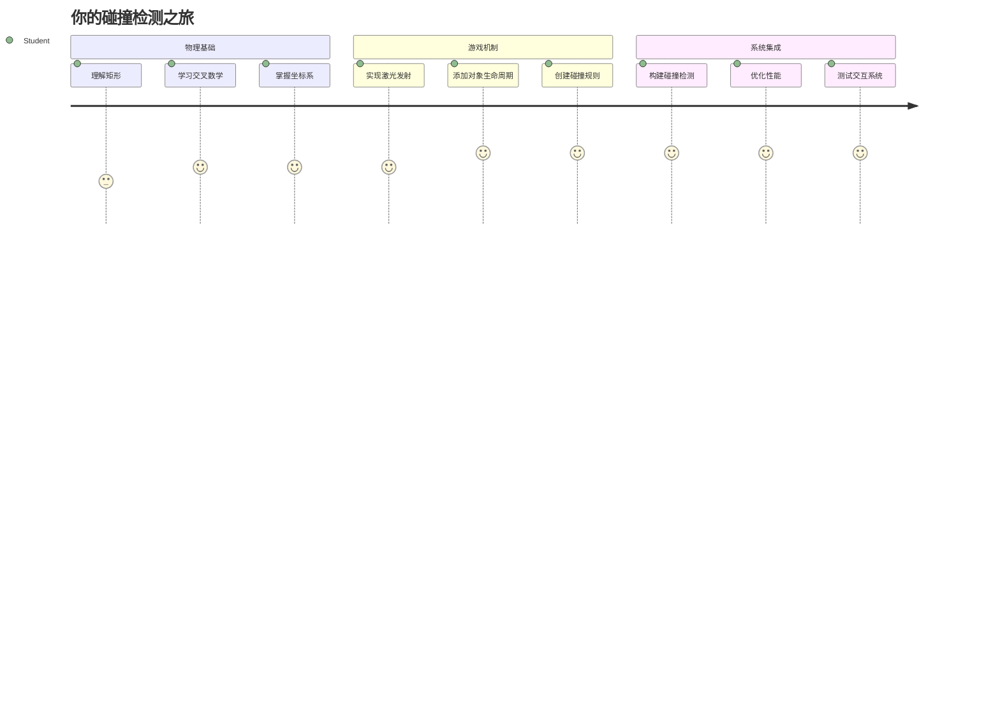
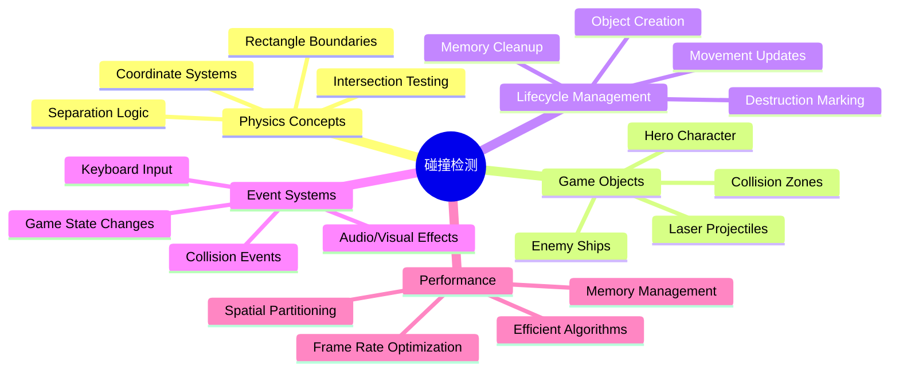
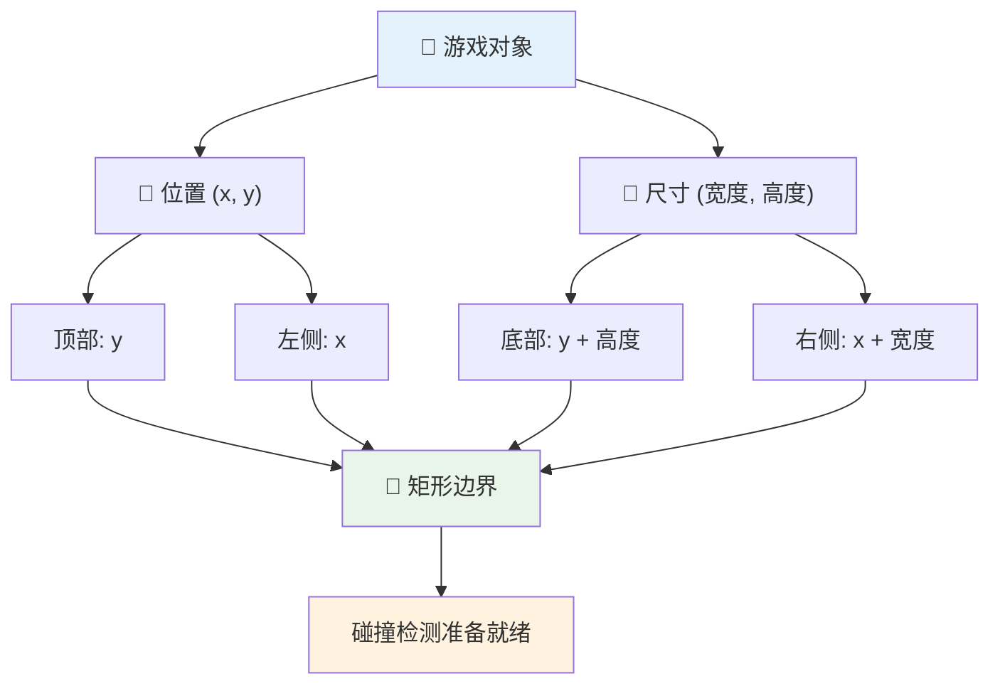
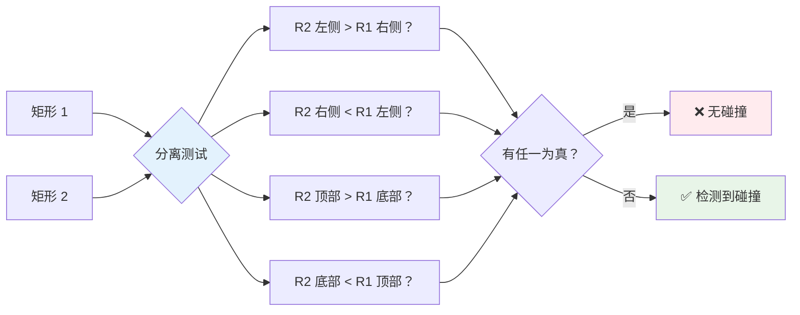
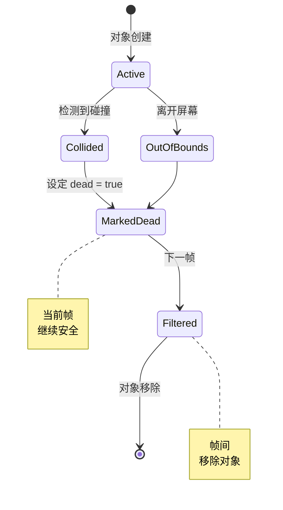
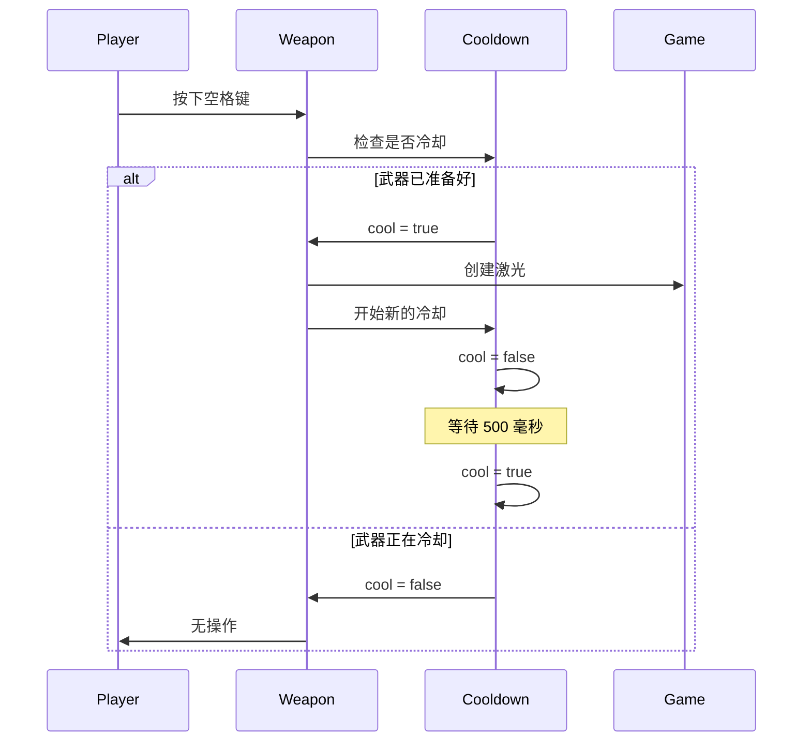
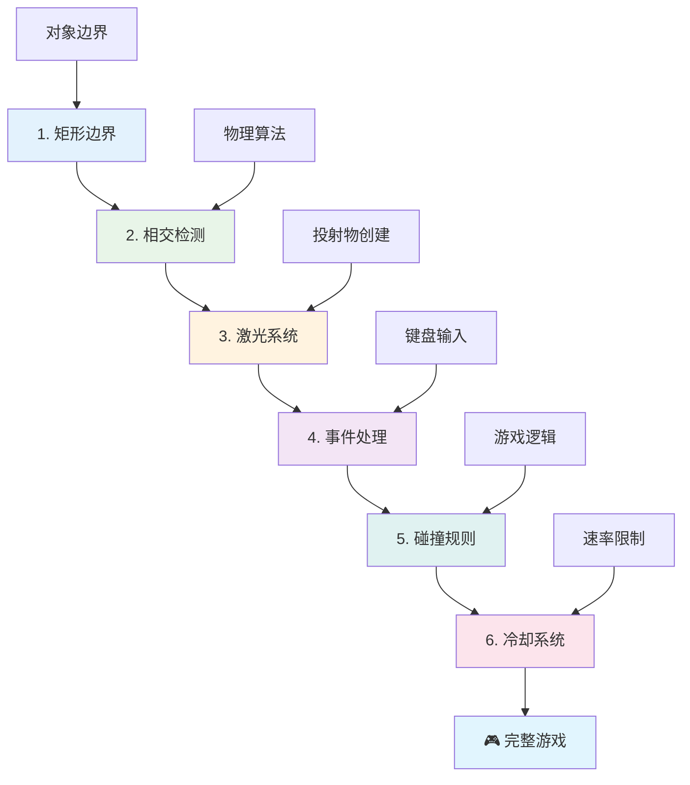
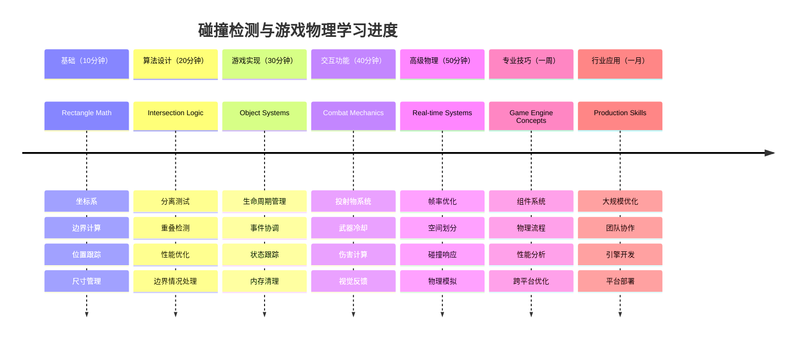

<!--
CO_OP_TRANSLATOR_METADATA:
{
  "original_hash": "039b4d8ce65f5edd82cf48d9c3e6728c",
  "translation_date": "2026-01-06T11:22:28+00:00",
  "source_file": "6-space-game/4-collision-detection/README.md",
  "language_code": "zh"
}
-->
# 构建太空游戏 第4部分：添加激光枪并检测碰撞


## 课前测验

[课前测验](https://ff-quizzes.netlify.app/web/quiz/35)

想想《星球大战》中卢克的质子鱼雷击中死星排气口的那一刻。那精确的碰撞检测改变了银河系的命运！在游戏中，碰撞检测也一样——它决定了物体何时交互以及接下来发生什么。

在本课中，你将为你的太空游戏添加激光武器并实现碰撞检测。就像 NASA 任务规划人员计算航天器轨迹以避免碎片一样，你将学会检测游戏对象何时相交。我们会分解成相互构建的可管理步骤。

到课末，你将拥有一个功能完整的战斗系统，激光可以摧毁敌人，碰撞会触发游戏事件。这些碰撞原理被广泛应用于从物理模拟到互动网页界面的所有领域。


✅ 做一些关于有史以来第一个计算机游戏的调研。它的功能是什么？

## 碰撞检测

碰撞检测就像阿波罗登月舱的接近传感器——它不断检查距离，当物体靠得太近时触发警报。在游戏中，这个系统判断物体何时交互及后续动作。

我们使用的方法将每个游戏对象视为矩形，就像空中交通控制系统使用简化的几何形状来跟踪飞机一样。这个矩形方法看似简单，但计算效率高，适合大多数游戏场景。

### 矩形表示

每个游戏对象都需要坐标边界，类似火星探路者漫游车如何映射其在火星表面的位置。以下是我们定义边界坐标的方法：


```javascript
rectFromGameObject() {
  return {
    top: this.y,
    left: this.x,
    bottom: this.y + this.height,
    right: this.x + this.width
  }
}
```
  
**我们来拆解一下：**  
- **上边缘**：就是对象的垂直起点（它的 y 坐标）  
- **左边缘**：对象的水平起点（它的 x 坐标）  
- **下边缘**：加上高度后的 y 坐标，知道它的底部位置！  
- **右边缘**：加上宽度后的 x 坐标，完整边界就确定了

### 相交算法

检测矩形相交的逻辑类似哈勃太空望远镜判断天体是否重叠视场。算法检查两个矩形是否存在分离：


```javascript
function intersectRect(r1, r2) {
  return !(r2.left > r1.right ||
    r2.right < r1.left ||
    r2.top > r1.bottom ||
    r2.bottom < r1.top);
}
```
  
**分离测试工作原理就像雷达系统：**  
- 矩形 2 是否完全在矩形 1 的右侧？  
- 矩形 2 是否完全在矩形 1 的左侧？  
- 矩形 2 是否完全在矩形 1 的下面？  
- 矩形 2 是否完全在矩形 1 的上面？

如果上述条件都不成立，矩形必然重叠。这种方法类似雷达操作员确定两架飞机是否保持安全距离。

## 管理对象生命周期

当激光击中敌人时，两个对象都需要从游戏中删除。然而，在循环过程中直接删除对象可能导致崩溃——这是早期计算机系统如阿波罗导航计算机走过的弯路。我们采用“标记删除”的方法，在帧与帧之间安全移除对象。


这是我们标记删除的方法：

```javascript
// 标记对象待移除
enemy.dead = true;
```
  
**这种方法的优点：**  
- 标记对象为“死亡”，但暂不删除  
- 允许当前游戏帧安全完成  
- 避免因使用已删除对象而崩溃！

然后在下一渲染周期前过滤标记的对象：

```javascript
gameObjects = gameObjects.filter(go => !go.dead);
```
  
**此过滤操作作用：**  
- 创建只包含“存活”对象的新列表  
- 丢弃被标记为死亡的对象  
- 保持游戏流畅运行  
- 防止销毁对象累积导致内存膨胀

## 实现激光机制

游戏中的激光投射物类似于《星际迷航》中的光子鱼雷——它们是沿直线飞行的离散物体直到命中目标。每次按空格键会创建一个新的激光对象，在屏幕上移动。

要实现这个功能，我们需要协调几个部分：

**关键组件：**  
- **创建** 从英雄位置生成的激光对象  
- **处理** 键盘输入以触发激光创建  
- **管理** 激光运动和生命周期  
- **实现** 激光投射物的视觉表现

## 实现开火速率控制

无限制的开火速率会让游戏引擎超负荷，也让游戏太容易。真实武器系统也有类似限制——即使是企业号的相位枪也需要时间充能。

我们实现冷却系统防止速射刷屏，同时保持响应：


```javascript
class Cooldown {
  constructor(time) {
    this.cool = false;
    setTimeout(() => {
      this.cool = true;
    }, time);
  }
}

class Weapon {
  constructor() {
    this.cooldown = null;
  }
  
  fire() {
    if (!this.cooldown || this.cooldown.cool) {
      // 创建激光投射物
      this.cooldown = new Cooldown(500);
    } else {
      // 武器仍在冷却中
    }
  }
}
```
  
**冷却系统原理：**  
- 创建时武器处于“热”状态（暂不可发射）  
- 经过超时时间后变“冷”状态（准备发射）  
- 发射前检查：武器是否处于“冷”状态？  
- 防止连点刷屏，响应仍然灵敏

✅ 参考太空游戏第一课复习冷却机制。

## 构建碰撞系统

你将扩展已有太空游戏代码，实现碰撞检测系统。像国际空间站自动避碰系统一样，你的游戏会持续监控对象位置并响应相交。

从之前的课程代码出发，添加带规则的碰撞检测，管理对象交互。

> 💡 **小技巧**：激光精灵已包含在资源文件夹并在代码中引用，准备好使用。

### 要实现的碰撞规则

**游戏机制：**  
1. **激光击中敌人**：激光击中敌人时，敌人被摧毁  
2. **激光触及屏幕边界**：激光到达屏幕顶部时被移除  
3. **敌人与英雄碰撞**：两者交叉时均被摧毁  
4. **敌人到底部**：敌人到达屏幕底部时游戏结束

### 🔄 **教学检查点**  
**碰撞检测基础**：实现前确认自己理解：  
- ✅ 矩形边界如何定义碰撞区域  
- ✅ 为什么分离测试比求交效率高  
- ✅ 对象生命周期管理为何游戏循环关键  
- ✅ 事件驱动系统协调碰撞响应的方法

**快速自测**：如果你立即删除对象会发生什么？  
*答：循环中间删除可能导致崩溃或漏遍历*

**物理理解**：你现已掌握：  
- **坐标系**：位置与尺寸定义边界  
- **相交逻辑**：碰撞检测中的数学原理  
- **性能优化**：实时系统中高效算法意义  
- **内存管理**：保证稳定性的安全生命周期模式

## 设置开发环境

好消息——大部分基础已帮你搭好！所有游戏资源和基本结构都位于 `your-work` 子文件夹，等待你添加酷炫的碰撞功能。

### 项目结构

```bash
-| assets
  -| enemyShip.png
  -| player.png
  -| laserRed.png
-| index.html
-| app.js
-| package.json
```
  
**文件结构说明：**  
- **包含** 游戏对象所需全部精灵图像  
- **含有** 主要 HTML 文档和 JavaScript 应用文件  
- **提供** 本地开发服务器的配置文件

### 启动开发服务器

进入项目文件夹启动本地服务器：

```bash
cd your-work
npm start
```
  
**此命令执行步骤：**  
- **切换** 到你的工作项目目录  
- **启动** 本地 HTTP 服务器，地址为 `http://localhost:5000`  
- **提供** 游戏文件供测试和开发使用  
- **支持** 自动刷新实现实时开发

打开浏览器访问 `http://localhost:5000`，你将看到当前游戏状态，英雄和敌人呈现屏幕上。

### 逐步实现

如同 NASA 规划航海者号软件那样，我们将有系统地逐步实现碰撞检测功能。


#### 1. 添加矩形碰撞边界

首先教你的游戏对象如何描述自身边界。将此方法添加至你的 `GameObject` 类：

```javascript
rectFromGameObject() {
    return {
      top: this.y,
      left: this.x,
      bottom: this.y + this.height,
      right: this.x + this.width,
    };
  }
```
  
**此方法作用：**  
- **创建** 带精确边界坐标的矩形对象  
- **计算** 底边和右边坐标（位置加尺寸）  
- **返回** 可供碰撞检测算法使用的对象  
- **提供** 给所有游戏对象统一接口

#### 2. 实现相交检测

接下来创建碰撞侦测函数，用于判断两个矩形是否重叠：

```javascript
function intersectRect(r1, r2) {
  return !(
    r2.left > r1.right ||
    r2.right < r1.left ||
    r2.top > r1.bottom ||
    r2.bottom < r1.top
  );
}
```
  
**算法逻辑：**  
- **测试** 矩形间四种分离情况  
- **如果** 存在分离，则返回 `false`（无碰撞）  
- **无分离时** 表示发生碰撞，返回 `true`  
- **使用** 取反逻辑提高效率

#### 3. 实现激光发射系统

现在进入令人激动的部分！我们设置激光发射功能。

##### 消息常量

先定义消息类型，便于游戏各部分通信：

```javascript
KEY_EVENT_SPACE: "KEY_EVENT_SPACE",
COLLISION_ENEMY_LASER: "COLLISION_ENEMY_LASER",
COLLISION_ENEMY_HERO: "COLLISION_ENEMY_HERO",
```
  
**这些常量提供：**  
- **统一** 应用程序内事件命名  
- **确保** 各系统通信一致性  
- **避免** 事件处理时拼写错误

##### 键盘输入处理

在键盘事件监听器中添加空格键检测：

```javascript
} else if(evt.keyCode === 32) {
  eventEmitter.emit(Messages.KEY_EVENT_SPACE);
}
```
  
**该输入处理器：**  
- **监听** keyCode 32 空格键  
- **发送** 标准化事件消息  
- **实现** 触发发射逻辑的解耦

##### 事件监听设置

在你的 `initGame()` 函数中注册发射行为：

```javascript
eventEmitter.on(Messages.KEY_EVENT_SPACE, () => {
 if (hero.canFire()) {
   hero.fire();
 }
});
```
  
**事件监听器：**  
- **响应** 空格键事件  
- **检查** 冷却状态是否允许发射  
- **允许时** 触发激光对象创建

添加激光与敌人碰撞事件处理：

```javascript
eventEmitter.on(Messages.COLLISION_ENEMY_LASER, (_, { first, second }) => {
  first.dead = true;
  second.dead = true;
});
```
  
**碰撞处理器：**  
- **接收** 碰撞事件数据，包括两个对象  
- **标记** 两个对象为待删除  
- **确保** 碰撞后正确清理

#### 4. 创建激光类

实现激光投射物类，使其向上移动并管理生命周期：

```javascript
class Laser extends GameObject {
  constructor(x, y) {
    super(x, y);
    this.width = 9;
    this.height = 33;
    this.type = 'Laser';
    this.img = laserImg;
    
    let id = setInterval(() => {
      if (this.y > 0) {
        this.y -= 15;
      } else {
        this.dead = true;
        clearInterval(id);
      }
    }, 100);
  }
}
```
  
**此类实现：**  
- **继承** GameObject 以获得基础功能  
- **设置** 合适的激光精灵尺寸  
- **使用** setInterval() 实现自动向上移动  
- **在** 到达顶部时自我销毁  
- **管理** 自己的动画时间和清理

#### 5. 实现碰撞检测系统

创建完整碰撞检测函数：

```javascript
function updateGameObjects() {
  const enemies = gameObjects.filter(go => go.type === 'Enemy');
  const lasers = gameObjects.filter(go => go.type === "Laser");
  
  // 测试激光与敌人的碰撞
  lasers.forEach((laser) => {
    enemies.forEach((enemy) => {
      if (intersectRect(laser.rectFromGameObject(), enemy.rectFromGameObject())) {
        eventEmitter.emit(Messages.COLLISION_ENEMY_LASER, {
          first: laser,
          second: enemy,
        });
      }
    });
  });

  // 移除已销毁的对象
  gameObjects = gameObjects.filter(go => !go.dead);
}
```
  
**该碰撞系统：**  
- **根据类型** 过滤游戏对象提高测试效率  
- **测试** 所有激光与所有敌人是否相交  
- **发现碰撞时** 发送碰撞事件  
- **碰撞处理后** 清理已销毁对象

> ⚠️ **重要**：在主游戏循环（`window.onload`）中添加 `updateGameObjects()` 以启用碰撞检测。

#### 6. 为英雄类添加冷却系统

为英雄类增强发射机制和速率控制：

```javascript
class Hero extends GameObject {
  constructor(x, y) {
    super(x, y);
    this.width = 99;
    this.height = 75;
    this.type = "Hero";
    this.speed = { x: 0, y: 0 };
    this.cooldown = 0;
  }
  
  fire() {
    gameObjects.push(new Laser(this.x + 45, this.y - 10));
    this.cooldown = 500;

    let id = setInterval(() => {
      if (this.cooldown > 0) {
        this.cooldown -= 100;
      } else {
        clearInterval(id);
      }
    }, 200);
  }
  
  canFire() {
    return this.cooldown === 0;
  }
}
```
  
**增强后的英雄类解析：**  
- **初始化** 冷却计时器为零（处于可发射状态）  
- **创建** 激光对象，位置设定于英雄舰船上方  
- **设置** 冷却周期防止连续快速发射  
- **通过** 定时器递减冷却时间  
- **提供** `canFire()` 方法判断是否可发射

### 🔄 **教学检查点**  
**完整系统理解**：确认你掌握碰撞系统：  
- ✅ 矩形边界怎样实现高效碰撞检测？  
- ✅ 为什么对象生命周期管理对游戏稳定关键？  
- ✅ 冷却系统如何避免性能问题？  
- ✅ 事件驱动框架在碰撞处理中的作用？

**系统整合**：你的碰撞检测系统体现了：  
- **数学精度**：矩形相交算法  
- **性能优化**：高效碰撞测试模式  
- **内存管理**：安全创建与销毁对象  
- **事件协调**：解耦系统通信  
- **实时处理**：基于帧的更新机制

**专业模式**：你已经实现了：  
- **职责分离**：物理、渲染与输入解耦  
- **面向对象设计**：继承与多态  
- **状态管理**：对象生命周期和游戏状态跟踪  
- **性能优化**：适合实时的高效算法

### 测试你的实现

你的太空游戏现已具备完整碰撞检测与战斗机制。🚀 测试这些新功能：  
- **用箭头键** 验证移动控制  
- **按空格键** 发射激光，注意冷却防止速射刷屏  
- **观察碰撞效果** ：激光击中敌人触发移除  
- **验证清理** ：被摧毁对象从游戏中消失

你已成功实现一个基于航天导航与机器人技术数学原理的碰撞检测系统。

### ⚡ **你可以在接下来5分钟内做的事**  
- [ ] 打开浏览器开发者工具，在碰撞检测函数设置断点  
- [ ] 尝试调整激光速度或敌人移动，观察碰撞效果  
- [ ] 实验不同的冷却时间以测试开火速率
- [ ] 添加 `console.log` 语句以实时跟踪碰撞事件

### 🎯 **你这一小时可以完成的目标**
- [ ] 完成课后测验并理解碰撞检测算法
- [ ] 添加碰撞时的视觉特效，如爆炸效果
- [ ] 实现具有不同属性的各种类型投射物
- [ ] 创建可暂时增强玩家能力的强化道具
- [ ] 添加碰撞音效，使体验更具满足感

### 📅 **你的周长物理编程计划**
- [ ] 完成带有完善碰撞系统的完整太空游戏
- [ ] 实现矩形之外的高级碰撞形状（圆形、多边形）
- [ ] 添加粒子系统以实现逼真的爆炸效果
- [ ] 创建具有碰撞规避的复杂敌人行为
- [ ] 优化碰撞检测以支持大量对象的高性能运行
- [ ] 添加动量和真实运动的物理模拟

### 🌟 **你的月度游戏物理精通计划**
- [ ] 构建使用高级物理引擎和真实模拟的游戏
- [ ] 学习3D碰撞检测和空间划分算法
- [ ] 为开源物理库和游戏引擎做出贡献
- [ ] 掌握图形密集型应用的性能优化
- [ ] 创建关于游戏物理和碰撞检测的教育内容
- [ ] 构建展示高级物理编程技能的作品集

## 🎯 你的碰撞检测精通时间轴


### 🛠️ 你的游戏物理工具包总结

完成本课后，你已掌握：
- **碰撞数学**：矩形交叉算法和坐标系统
- **性能优化**：适用于实时应用的高效碰撞检测
- **对象生命周期管理**：安全的创建、更新与销毁模式
- **事件驱动架构**：解耦的碰撞响应系统
- **游戏循环集成**：基于帧的物理更新和渲染协调
- **输入系统**：响应式控制，带频率限制和反馈
- **内存管理**：高效的对象池和清理策略

**现实应用场景**：你的碰撞检测技能直接适用于：
- **交互式模拟**：科学建模与教育工具
- **用户界面设计**：拖放交互和触摸检测
- **数据可视化**：交互图表和可点击元素
- **移动开发**：触控手势识别和碰撞处理
- **机器人编程**：路径规划和障碍规避
- **计算机图形学**：光线追踪和空间算法

**职业技能提升**：你现在能够：
- **设计** 实时碰撞检测的高效算法
- **实现** 能适应对象复杂度的物理系统
- **调试** 复杂交互系统，应用数学原理
- **优化** 适配不同硬件和浏览器性能
- **架构** 使用成熟设计模式构建可维护游戏系统

**掌握的游戏开发概念**：
- **物理模拟**：实时碰撞检测与响应
- **性能工程**：交互应用的优化算法
- **事件系统**：游戏组件间解耦通信
- **对象管理**：动态内容的高效生命周期模式
- **输入处理**：带反馈的响应式控制

**下一阶段**：你已准备好探索如 Matter.js 等高级物理引擎，实现3D碰撞检测，或构建复杂粒子系统！

🌟 **成就解锁**：你已构建了具备专业级碰撞检测的完整物理交互系统！

## GitHub Copilot Agent 挑战 🚀

使用 Agent 模式完成以下挑战：

**描述：** 通过实现随机生成的强化道具提升碰撞检测系统，当英雄飞船收集时可提供临时能力。

**提示：** 创建一个继承于 GameObject 的 PowerUp 类，实现英雄与强化道具之间的碰撞检测。至少添加两种强化道具：一种提高射速（减少冷却时间），另一种产生临时护盾。包含在随机时间和位置生成强化道具的逻辑。

---


## 🚀 挑战

添加一个爆炸效果！查看[Space Art 资源库](../../../../6-space-game/solution/spaceArt/readme.txt)中的游戏素材，尝试在激光击中外星人时添加爆炸效果。

## 课后测验

[课后测验](https://ff-quizzes.netlify.app/web/quiz/36)

## 复习与自学

尝试调整游戏中目前的间隔时间。改变后会发生什么变化？了解更多关于[JavaScript 定时事件](https://www.freecodecamp.org/news/javascript-timing-events-settimeout-and-setinterval/)的内容。

## 作业

[探索碰撞](assignment.md)

---

<!-- CO-OP TRANSLATOR DISCLAIMER START -->
**免责声明**：  
本文件由 AI 翻译服务 [Co-op Translator](https://github.com/Azure/co-op-translator) 翻译。虽然我们努力保证准确性，但请注意，自动翻译可能存在错误或不准确之处。原始文档的原语言版本应被视为权威来源。对于重要信息，建议采用专业人工翻译。因使用本翻译而产生的任何误解或误释，我们概不负责。
<!-- CO-OP TRANSLATOR DISCLAIMER END -->