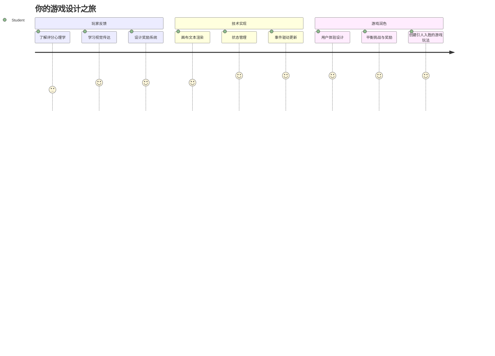
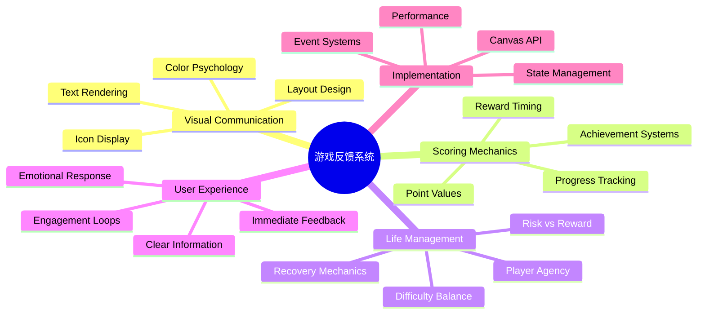
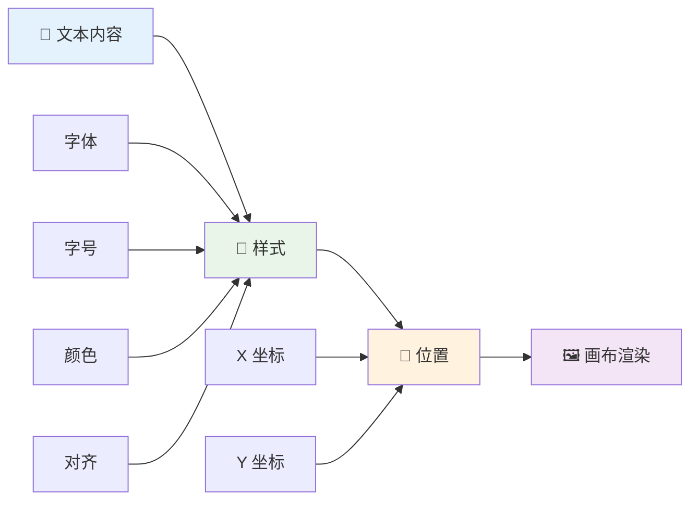
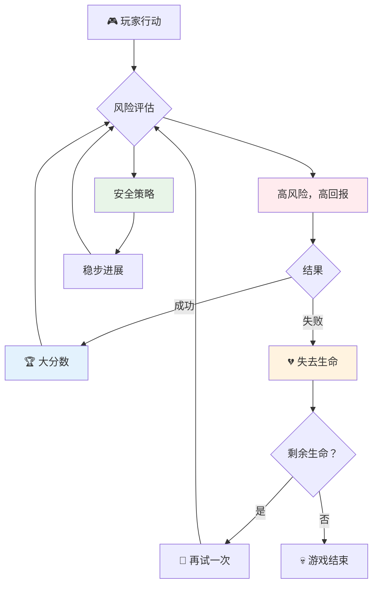
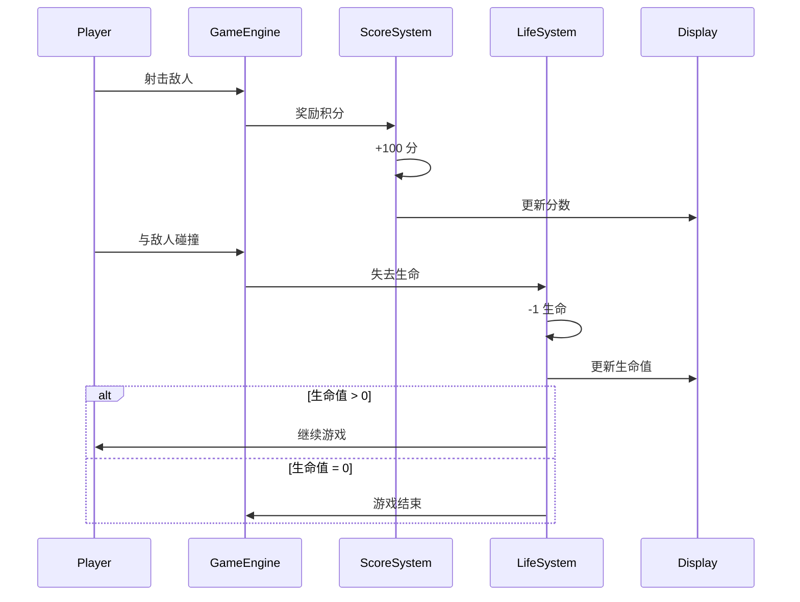
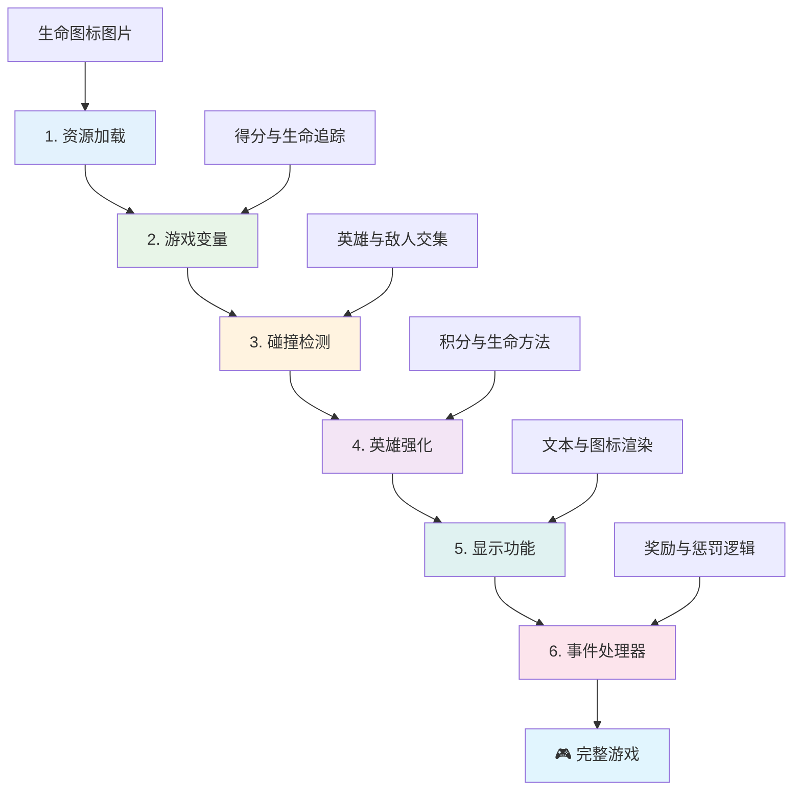
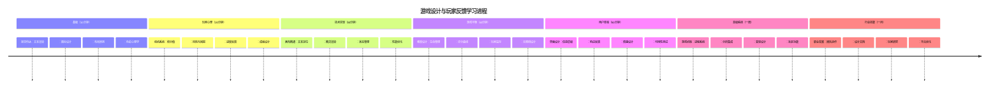

<!--
CO_OP_TRANSLATOR_METADATA:
{
  "original_hash": "2ed9145a16cf576faa2a973dff84d099",
  "translation_date": "2026-01-06T11:28:05+00:00",
  "source_file": "6-space-game/5-keeping-score/README.md",
  "language_code": "zh"
}
-->
# 构建太空游戏 第5部分：计分与生命


## 课前测验

[课前测验](https://ff-quizzes.netlify.app/web/quiz/37)

准备让你的太空游戏感觉像一个真正的游戏了吗？让我们添加计分和生命管理——这些核心机制将早期街机游戏如《Space Invaders》从简单演示转变为让人上瘾的娱乐。这是你游戏真正可玩起来的关键。


## 在屏幕上绘制文本——游戏的声音

要显示你的分数，我们需要学习如何在画布上渲染文字。`fillText()` 方法是你的主要工具——这也是经典街机游戏用来显示分数和状态信息的技术。


你可以完全控制文本的外观：

```javascript
ctx.font = "30px Arial";
ctx.fillStyle = "red";
ctx.textAlign = "right";
ctx.fillText("show this on the screen", 0, 0);
```

✅ 深入了解 [向画布添加文本](https://developer.mozilla.org/docs/Web/API/Canvas_API/Tutorial/Drawing_text) ——你可能会惊讶于字体和样式可以多么富有创造性！

## 生命值——不仅仅是一个数字

在游戏设计中，“生命”代表玩家的容错空间。这个概念可以追溯到弹珠机时代，你会获得多个球来游戏。在早期视频游戏，如《Asteroids》中，生命给玩家提供了冒险和从错误中学习的许可。


视觉表现尤为重要——展示飞船图标而不是简单的“生命：3”可以立即产生视觉识别，就像早期街机机台用图标来跨越语言障碍传达信息一样。

## 构建游戏的奖励系统

现在我们将实现保持玩家投入的核心反馈系统：


- **计分系统**：每摧毁一艘敌舰奖励100分（圆整数字更便于玩家心算）。分数显示在左下角。
- **生命计数器**：你的英雄从三条命开始——这是早期街机游戏确立的标准，平衡挑战和可玩性。每次与敌人碰撞会损失一条命。我们将在右下用飞船图标显示剩余生命 。

## 开始构建吧！

首先，设置你的工作区。进入 `your-work` 子文件夹中的文件。你应该能看到这些文件：

```bash
-| assets
  -| enemyShip.png
  -| player.png
  -| laserRed.png
-| index.html
-| app.js
-| package.json
```

要测试你的游戏，从 `your_work` 文件夹启动开发服务器：

```bash
cd your-work
npm start
```

这会在 `http://localhost:5000` 运行本地服务器。打开这个地址查看你的游戏。用箭头键测试控制，尝试射击敌人以验证一切正常。


### 开始编码！

1. **获取所需的视觉素材**。将 `solution/assets/` 文件夹里的 `life.png` 复制到你的 `your-work` 文件夹。然后将 lifeImg 添加到你的 window.onload 函数中：

    ```javascript
    lifeImg = await loadTexture("assets/life.png");
    ```

1. 别忘了将 `lifeImg` 添加到你的素材列表中：

    ```javascript
    let heroImg,
    ...
    lifeImg,
    ...
    eventEmitter = new EventEmitter();
    ```
  
2. **设置游戏变量**。添加代码以跟踪总分（从0开始）和剩余生命（从3开始）。我们将在屏幕上显示这些信息，让玩家随时了解自己的状态。

3. **实现碰撞检测**。扩展你的 `updateGameObjects()` 函数以检测敌人与英雄的碰撞：

    ```javascript
    enemies.forEach(enemy => {
        const heroRect = hero.rectFromGameObject();
        if (intersectRect(heroRect, enemy.rectFromGameObject())) {
          eventEmitter.emit(Messages.COLLISION_ENEMY_HERO, { enemy });
        }
      })
    ```

4. **为英雄添加生命和积分追踪**。  
   1. **初始化计数器**。在 `Hero` 类中 `this.cooldown = 0` 下，设置生命和积分：

        ```javascript
        this.life = 3;
        this.points = 0;
        ```

   1. **向玩家显示这些数值**。创建函数以在屏幕上绘制这些数值：

        ```javascript
        function drawLife() {
          // 待办事项，35，27
          const START_POS = canvas.width - 180;
          for(let i=0; i < hero.life; i++ ) {
            ctx.drawImage(
              lifeImg, 
              START_POS + (45 * (i+1) ), 
              canvas.height - 37);
          }
        }
        
        function drawPoints() {
          ctx.font = "30px Arial";
          ctx.fillStyle = "red";
          ctx.textAlign = "left";
          drawText("Points: " + hero.points, 10, canvas.height-20);
        }
        
        function drawText(message, x, y) {
          ctx.fillText(message, x, y);
        }

        ```

   1. **将所有内容挂钩到你的游戏循环中**。在 window.onload 函数中 `updateGameObjects()` 之后调用这些函数：

        ```javascript
        drawPoints();
        drawLife();
        ```

### 🔄 **教学检查点**
**游戏设计理解**：在实施后果之前，确保你理解：
- ✅ 视觉反馈如何向玩家传递游戏状态
- ✅ UI 元素一致放置为何提升可用性
- ✅ 分值和生命管理背后的心理学
- ✅ 画布文字渲染与 HTML 文字的不同

**快速自测**：为何街机游戏通常使用圆整的点数？
*答案：圆整数字便于玩家心算，且带来心理上的满足感*

**用户体验原则**：你正在应用：
- **视觉层级**：重要信息醒目展示
- **即时反馈**：玩家操作即时更新
- **认知负荷**：信息简洁明了呈现
- **情感设计**：图标和颜色营造玩家连接感

1. **实现游戏后果与奖励**。现在我们添加让玩家行为有意义的反馈系统：

   1. **碰撞消耗生命**。每次英雄撞上敌人，你应该失去一条命。
   
      将此方法添加到 `Hero` 类中：

        ```javascript
        decrementLife() {
          this.life--;
          if (this.life === 0) {
            this.dead = true;
          }
        }
        ```

   2. **射击敌人得分**。每命中一次奖励100分，为精准射击提供即时正反馈。

      在 Hero 类中扩展此增加函数：

        ```javascript
          incrementPoints() {
            this.points += 100;
          }
        ```

        现将这些函数与碰撞事件关联：

        ```javascript
        eventEmitter.on(Messages.COLLISION_ENEMY_LASER, (_, { first, second }) => {
           first.dead = true;
           second.dead = true;
           hero.incrementPoints();
        })

        eventEmitter.on(Messages.COLLISION_ENEMY_HERO, (_, { enemy }) => {
           enemy.dead = true;
           hero.decrementLife();
        });
        ```

✅ 想了解更多用 JavaScript 和 Canvas 构建的游戏？多做探索——你可能会惊讶于其可能性！

实现这些功能后，测试你的游戏，观察完整反馈系统的运行。你应该能看到右下的生命图标，左下的分数，并见证碰撞减少生命、成功击中增加分数。

你的游戏现在拥有了早期街机游戏令人着迷的核心机制——明确目标、即时反馈和玩家操作的有意义后果。

### 🔄 **教学检查点**
**完整游戏设计系统**：检验你对玩家反馈系统的掌握：
- ✅ 计分机制如何激发玩家动力和投入？
- ✅ 视觉一致性为何对用户界面设计重要？
- ✅ 生命系统如何平衡挑战与玩家留存？
- ✅ 即时反馈在创造令人满意的游戏体验中起什么作用？

**系统集成**：你的反馈系统体现了：
- **用户体验设计**：清晰视觉传达和信息层级
- **事件驱动架构**：对玩家操作的响应更新
- **状态管理**：追踪并显示动态游戏数据
- **画布掌握**：文字渲染和精灵定位
- **游戏心理学**：理解玩家动力和投入

**专业模式**：你已实现：
- **MVC 架构**：游戏逻辑、数据和表现分离
- **观察者模式**：游戏状态变更的事件驱动更新
- **组件设计**：可复用的渲染和逻辑函数
- **性能优化**：游戏循环中的高效渲染

### ⚡ **未来5分钟可做的事**
- [ ] 试验不同的字体大小和颜色显示分数
- [ ] 改变点数值，观察对游戏感觉的影响
- [ ] 添加 console.log 跟踪分数和生命的变动
- [ ] 测试边缘情况，如生命耗尽或高分达成

### 🎯 **本小时可完成的目标**
- [ ] 完成课后测验并理解游戏设计心理学
- [ ] 增加得分和失生命的音效
- [ ] 利用 localStorage 实现高分系统
- [ ] 为不同敌人类型设置不同点数
- [ ] 添加失去生命时的屏幕震动视觉效果

### 📅 **你的周长游戏设计之旅**
- [ ] 完成具有完善反馈系统的完整太空游戏
- [ ] 实现高级计分机制如连击倍率
- [ ] 增加成就和可解锁内容
- [ ] 创建难度递增和平衡系统
- [ ] 设计菜单和游戏结束界面
- [ ] 学习其他游戏以理解用户投入机制

### 🌟 **你的月长游戏开发精通**
- [ ] 构建配有复杂进程系统的完整游戏
- [ ] 学习游戏分析与玩家行为测量
- [ ] 贡献开源游戏开发项目
- [ ] 掌握高级游戏设计模式和变现策略
- [ ] 制作关于游戏设计和用户体验的教育内容
- [ ] 建立展示游戏设计与开发技能的作品集

## 🎯 你的游戏设计精通时间线


### 🛠️ 你的游戏设计工具包总结

完成本课后，你已掌握：
- **玩家心理学**：理解动机、风险/奖励与投入循环
- **视觉传达**：使用文本、图标和布局进行有效UI设计
- **反馈系统**：实时响应玩家动作和游戏事件
- **状态管理**：高效追踪及展示动态游戏数据
- **画布文本渲染**：专业文字展示及样式定位
- **事件整合**：将用户操作连接至有意义的游戏后果
- **游戏平衡**：设计难度曲线和玩家进程系统

**现实应用**：你的游戏设计技能直接适用于：
- **用户界面设计**：创造引人入胜、直观界面
- **产品开发**：理解用户动机和反馈循环
- **教育技术**：游戏化和学习投入系统
- **数据可视化**：让复杂信息易于理解和吸引人
- **移动应用开发**：留存机制和用户体验设计
- **市场技术**：理解用户行为和转化优化

**获得的专业技能**：
- **设计** 激励和吸引用户的用户体验
- **实现** 指导用户行为的反馈系统
- **平衡** 互动系统的挑战与可达性
- **创建** 跨用户群有效的视觉传达
- **分析** 用户行为并迭代设计改进

**掌握的游戏开发概念**：
- **玩家动机**：理解驱动投入与留存的因素
- **视觉设计**：创建清晰、美观且实用的界面
- **系统集成**：多系统连接以实现一致体验
- **性能优化**：高效渲染与状态管理
- **无障碍设计**：面向不同技能水平和玩家需求设计

**下一步**：你已准备探索高级游戏设计模式，实施分析系统，或研究游戏变现和玩家留存策略！

🌟 **成就达成**：你已经构建了一个带有专业游戏设计原则的完整玩家反馈系统！

---

## GitHub Copilot Agent 挑战 🚀

使用代理模式完成以下挑战：

**描述：** 增强太空游戏的计分系统，实现带持久存储的最高分功能和连击奖励机制。

**提示：** 创建一个最高分系统，将玩家最高分保存到 localStorage。新增连击得分奖励（连杀系统），并针对不同敌人类型设定不同点值。新增视觉指示，提示玩家刷新最高分，并在游戏画面显示当前最高分。

## 🚀 挑战

你现在拥有一个功能齐全的带计分和生命的游戏。思考还有哪些额外功能可以提升玩家体验。

## 课后测验

[课后测验](https://ff-quizzes.netlify.app/web/quiz/38)

## 复习与自学

想深入探索？研究不同的计分和生命系统方法。有许多有趣的游戏引擎，比如 [PlayFab](https://playfab.com)，它们管理计分、排行榜和玩家进程。集成类似功能将怎样提升你的游戏？

## 作业

[构建一个计分游戏](assignment.md)

---

<!-- CO-OP TRANSLATOR DISCLAIMER START -->
**免责声明**：  
本文件由人工智能翻译服务 [Co-op Translator](https://github.com/Azure/co-op-translator) 翻译。尽管我们力求准确，但请注意自动翻译可能存在错误或不准确之处。原始文档的母语版本应视为权威来源。对于重要信息，建议采用专业人工翻译。因使用本翻译而产生的任何误解或曲解，我们不承担任何责任。
<!-- CO-OP TRANSLATOR DISCLAIMER END -->