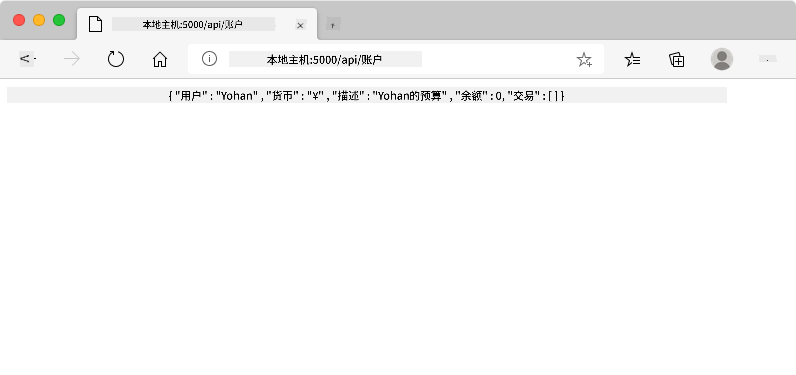

<!--
CO_OP_TRANSLATOR_METADATA:
{
  "original_hash": "8baca047d77a5f43fa4099c0578afa42",
  "translation_date": "2025-08-29T14:41:54+00:00",
  "source_file": "7-bank-project/2-forms/README.md",
  "language_code": "zh"
}
-->
# 构建银行应用程序第2部分：创建登录和注册表单

## 课前测验

[课前测验](https://ff-quizzes.netlify.app/web/quiz/43)

### 介绍

在几乎所有现代的网络应用中，用户都可以创建一个账户来拥有自己的私人空间。由于多个用户可以同时访问一个网络应用，因此需要一种机制来分别存储每个用户的个人数据，并选择显示哪些信息。我们不会深入探讨如何[安全地管理用户身份](https://en.wikipedia.org/wiki/Authentication)，因为这是一个非常广泛的话题，但我们会确保每个用户能够在我们的应用中创建一个或多个银行账户。

在这一部分，我们将使用HTML表单为我们的网络应用添加登录和注册功能。我们将学习如何以编程方式将数据发送到服务器API，并最终定义用户输入的基本验证规则。

### 前置条件

你需要完成本课程中[HTML模板和路由](../1-template-route/README.md)的部分。此外，你还需要安装[Node.js](https://nodejs.org)并在本地[运行服务器API](../api/README.md)，以便能够发送数据来创建账户。

**注意事项**  
你需要同时运行两个终端，如下所列：  
1. 用于我们在[HTML模板和路由](../1-template-route/README.md)课程中构建的主要银行应用程序。  
2. 用于我们刚刚设置的[银行应用服务器API](../api/README.md)。  

要完成本课程的后续内容，你需要确保这两个服务器都在运行。它们监听不同的端口（端口`3000`和端口`5000`），因此一切应该可以正常工作。

你可以通过在终端中执行以下命令来测试服务器是否正常运行：

```sh
curl http://localhost:5000/api
# -> should return "Bank API v1.0.0" as a result
```

---

## 表单和控件

`<form>`元素封装了HTML文档中的一个部分，用户可以通过交互控件输入和提交数据。在表单中可以使用各种用户界面（UI）控件，其中最常见的是`<input>`和`<button>`元素。

`<input>`有许多不同的[类型](https://developer.mozilla.org/docs/Web/HTML/Element/input)。例如，要创建一个供用户输入用户名的字段，你可以使用以下代码：

```html
<input id="username" name="username" type="text">
```

`name`属性将在表单数据发送时用作属性名称。`id`属性用于将`<label>`与表单控件关联。

> 查看[`<input>`类型](https://developer.mozilla.org/docs/Web/HTML/Element/input)的完整列表以及[其他表单控件](https://developer.mozilla.org/docs/Learn/Forms/Other_form_controls)，以了解构建UI时可以使用的所有原生UI元素。

✅ 请注意，`<input>`是一个[空元素](https://developer.mozilla.org/docs/Glossary/Empty_element)，不应添加匹配的关闭标签。不过，你可以使用自闭合的`<input/>`表示法，但这不是必须的。

表单中的`<button>`元素有点特殊。如果未指定其`type`属性，当按下按钮时，它会自动将表单数据提交到服务器。以下是`type`属性的可能值：

- `submit`：表单中的默认值，按钮触发表单提交操作。
- `reset`：按钮将所有表单控件重置为初始值。
- `button`：按钮按下时不分配默认行为。你可以使用JavaScript为其分配自定义操作。

### 任务

让我们从在`login`模板中添加一个表单开始。我们需要一个*用户名*字段和一个*登录*按钮。

```html
<template id="login">
  <h1>Bank App</h1>
  <section>
    <h2>Login</h2>
    <form id="loginForm">
      <label for="username">Username</label>
      <input id="username" name="user" type="text">
      <button>Login</button>
    </form>
  </section>
</template>
```

如果仔细观察，你会注意到我们还添加了一个`<label>`元素。`<label>`元素用于为UI控件添加名称，例如我们的用户名字段。标签对于表单的可读性非常重要，同时还带来了一些额外的好处：

- 通过将标签与表单控件关联，它可以帮助使用辅助技术（如屏幕阅读器）的用户理解需要提供什么数据。
- 你可以点击标签直接将焦点放在关联的输入框上，这使得在触摸屏设备上更容易操作。

> [网络无障碍性](https://developer.mozilla.org/docs/Learn/Accessibility/What_is_accessibility)是一个经常被忽视的重要话题。得益于[语义化HTML元素](https://developer.mozilla.org/docs/Learn/Accessibility/HTML)，如果正确使用它们，创建无障碍内容并不困难。你可以[阅读更多关于无障碍性的内容](https://developer.mozilla.org/docs/Web/Accessibility)，以避免常见错误并成为一名负责任的开发者。

现在我们将在前一个表单的下方添加第二个注册表单：

```html
<hr/>
<h2>Register</h2>
<form id="registerForm">
  <label for="user">Username</label>
  <input id="user" name="user" type="text">
  <label for="currency">Currency</label>
  <input id="currency" name="currency" type="text" value="$">
  <label for="description">Description</label>
  <input id="description" name="description" type="text">
  <label for="balance">Current balance</label>
  <input id="balance" name="balance" type="number" value="0">
  <button>Register</button>
</form>
```

通过使用`value`属性，我们可以为给定的输入框定义默认值。  
注意，`balance`的输入框类型为`number`。它看起来是否与其他输入框不同？试着与它交互一下。

✅ 你能仅使用键盘导航和操作这些表单吗？你会怎么做？

## 将数据提交到服务器

现在我们有了一个功能性UI，下一步是将数据发送到服务器。让我们用当前代码做一个快速测试：点击*登录*或*注册*按钮会发生什么？

你是否注意到浏览器URL部分的变化？


`<form>`的默认行为是使用[GET方法](https://www.w3.org/Protocols/rfc2616/rfc2616-sec9.html#sec9.3)将表单提交到当前服务器URL，并将表单数据直接附加到URL。这种方法有一些缺点：

- 发送的数据大小非常有限（约2000个字符）。
- 数据直接显示在URL中（对密码来说不太安全）。
- 不支持文件上传。

因此，你可以将其更改为使用[POST方法](https://www.w3.org/Protocols/rfc2616/rfc2616-sec9.html#sec9.5)，它将表单数据发送到HTTP请求的正文中，从而避免了上述限制。

> 虽然POST是发送数据最常用的方法，但[在某些特定场景下](https://www.w3.org/2001/tag/doc/whenToUseGet.html)，例如实现搜索字段时，使用GET方法更为合适。

### 任务

为注册表单添加`action`和`method`属性：

```html
<form id="registerForm" action="//localhost:5000/api/accounts" method="POST">
```

现在尝试用你的名字注册一个新账户。点击*注册*按钮后，你应该会看到如下内容：



如果一切正常，服务器应该会以[JSON](https://www.json.org/json-en.html)格式的响应返回创建的账户数据。

✅ 再次尝试使用相同的名字注册。会发生什么？

## 无需刷新页面提交数据

你可能已经注意到，我们刚刚使用的方法有一个小问题：提交表单时，我们离开了应用程序，浏览器重定向到服务器URL。我们正在尝试避免所有页面刷新，因为我们正在构建一个[单页应用程序（SPA）](https://en.wikipedia.org/wiki/Single-page_application)。

要在不强制页面刷新的情况下将表单数据发送到服务器，我们需要使用JavaScript代码。与其在`<form>`元素的`action`属性中放置一个URL，不如使用任何以`javascript:`字符串开头的JavaScript代码来执行自定义操作。这也意味着你需要实现一些浏览器之前自动完成的任务：

- 获取表单数据
- 转换并编码表单数据为合适的格式
- 创建HTTP请求并将其发送到服务器

### 任务

将注册表单的`action`替换为：

```html
<form id="registerForm" action="javascript:register()">
```

打开`app.js`，添加一个名为`register`的新函数：

```js
function register() {
  const registerForm = document.getElementById('registerForm');
  const formData = new FormData(registerForm);
  const data = Object.fromEntries(formData);
  const jsonData = JSON.stringify(data);
}
```

在这里，我们使用`getElementById()`获取表单元素，并使用[`FormData`](https://developer.mozilla.org/docs/Web/API/FormData)助手将表单控件中的值提取为键/值对集合。然后，我们使用[`Object.fromEntries()`](https://developer.mozilla.org/docs/Web/JavaScript/Reference/Global_Objects/Object/fromEntries)将数据转换为普通对象，最后将数据序列化为[JSON](https://www.json.org/json-en.html)，这是一种网络上常用的数据交换格式。

数据现在已准备好发送到服务器。创建一个名为`createAccount`的新函数：

```js
async function createAccount(account) {
  try {
    const response = await fetch('//localhost:5000/api/accounts', {
      method: 'POST',
      headers: { 'Content-Type': 'application/json' },
      body: account
    });
    return await response.json();
  } catch (error) {
    return { error: error.message || 'Unknown error' };
  }
}
```

这个函数在做什么？首先，注意这里的`async`关键字。这意味着函数包含将以[**异步**](https://developer.mozilla.org/docs/Web/JavaScript/Reference/Statements/async_function)方式执行的代码。当与`await`关键字一起使用时，它允许等待异步代码执行（例如等待服务器响应）后再继续。

以下是关于`async/await`用法的简短视频：

[](https://youtube.com/watch?v=YwmlRkrxvkk "管理Promise的Async和Await")

> 🎥 点击上方图片观看关于async/await的视频。

我们使用`fetch()` API将JSON数据发送到服务器。此方法需要两个参数：

- 服务器的URL，因此我们在这里放回`//localhost:5000/api/accounts`。
- 请求的设置。在这里我们将方法设置为`POST`并提供请求的`body`。由于我们向服务器发送JSON数据，因此还需要将`Content-Type`头设置为`application/json`，以便服务器知道如何解释内容。

由于服务器会以JSON格式响应请求，我们可以使用`await response.json()`解析JSON内容并返回结果对象。请注意，此方法是异步的，因此我们在返回之前使用`await`关键字以确保捕获解析期间的任何错误。

现在在`register`函数中添加一些代码以调用`createAccount()`：

```js
const result = await createAccount(jsonData);
```

由于我们在这里使用了`await`关键字，因此需要在`register`函数前添加`async`关键字：

```js
async function register() {
```

最后，让我们添加一些日志以检查结果。最终函数应如下所示：

```js
async function register() {
  const registerForm = document.getElementById('registerForm');
  const formData = new FormData(registerForm);
  const jsonData = JSON.stringify(Object.fromEntries(formData));
  const result = await createAccount(jsonData);

  if (result.error) {
    return console.log('An error occurred:', result.error);
  }

  console.log('Account created!', result);
}
```

虽然过程有点长，但我们完成了！如果你打开[浏览器开发者工具](https://developer.mozilla.org/docs/Learn/Common_questions/What_are_browser_developer_tools)，并尝试注册一个新账户，你应该不会看到网页有任何变化，但控制台中会出现一条消息，确认一切正常。


✅ 你认为数据是安全地发送到服务器的吗？如果有人能够拦截请求会怎样？你可以阅读[HTTPS](https://en.wikipedia.org/wiki/HTTPS)以了解更多关于安全数据通信的内容。

## 数据验证

如果你尝试在未输入用户名的情况下注册一个新账户，你会看到服务器返回了一个状态码为[400（错误请求）](https://developer.mozilla.org/docs/Web/HTTP/Status/400#:~:text=The%20HyperText%20Transfer%20Protocol%20(HTTP,%2C%20or%20deceptive%20request%20routing).)的错误。

在将数据发送到服务器之前，最好在可能的情况下[验证表单数据](https://developer.mozilla.org/docs/Learn/Forms/Form_validation)，以确保发送的是有效请求。HTML5表单控件通过各种属性提供了内置验证：

- `required`：字段必须填写，否则表单无法提交。
- `minlength`和`maxlength`：定义文本字段的最小和最大字符数。
- `min`和`max`：定义数值字段的最小和最大值。
- `type`：定义预期的数据类型，例如`number`、`email`、`file`或[其他内置类型](https://developer.mozilla.org/docs/Web/HTML/Element/input)。此属性还可能更改表单控件的视觉呈现。
- `pattern`：允许定义一个[正则表达式](https://developer.mozilla.org/docs/Web/JavaScript/Guide/Regular_Expressions)模式，以测试输入的数据是否有效。
提示：您可以使用 `:valid` 和 `:invalid` CSS 伪类，根据表单控件是否有效来自定义其外观。
### 任务

创建一个有效的新账户需要两个必填字段：用户名和货币，其他字段为可选项。更新表单的 HTML，使用 `required` 属性以及字段标签中的文字来实现：

```html
<label for="user">Username (required)</label>
<input id="user" name="user" type="text" required>
...
<label for="currency">Currency (required)</label>
<input id="currency" name="currency" type="text" value="$" required>
```

虽然这个特定的服务器实现并未对字段的最大长度设置具体限制，但为用户输入的文本定义合理的长度限制始终是一个良好的实践。

为文本字段添加 `maxlength` 属性：

```html
<input id="user" name="user" type="text" maxlength="20" required>
...
<input id="currency" name="currency" type="text" value="$" maxlength="5" required>
...
<input id="description" name="description" type="text" maxlength="100">
```

现在，如果你按下 *注册* 按钮，而某个字段未遵守我们定义的验证规则，你应该会看到如下所示的内容：


这种在将数据发送到服务器之前进行的验证被称为**客户端验证**。但请注意，并非所有检查都可以在不发送数据的情况下完成。例如，我们无法在这里检查是否已经存在一个相同用户名的账户，而无需向服务器发送请求。在服务器上执行的额外验证被称为**服务器端验证**。

通常需要同时实现这两种验证方式。客户端验证通过向用户提供即时反馈来改善用户体验，而服务器端验证则至关重要，以确保你处理的用户数据是可靠且安全的。

---

## 🚀 挑战

如果用户已存在，在 HTML 中显示一条错误消息。

以下是经过一些样式调整后的最终登录页面示例：


## 课后测验

[课后测验](https://ff-quizzes.netlify.app/web/quiz/44)

## 复习与自学

开发者在构建表单，尤其是验证策略方面，已经变得非常有创意。通过浏览 [CodePen](https://codepen.com) 来了解不同的表单流程；你能找到一些有趣且有启发性的表单吗？

## 作业

[为你的银行应用程序设计样式](assignment.md)

---

**免责声明**：  
本文档使用AI翻译服务[Co-op Translator](https://github.com/Azure/co-op-translator)进行翻译。尽管我们努力确保准确性，但请注意，自动翻译可能包含错误或不准确之处。应以原始语言的文档作为权威来源。对于关键信息，建议使用专业人工翻译。因使用本翻译而导致的任何误解或误读，我们概不负责。