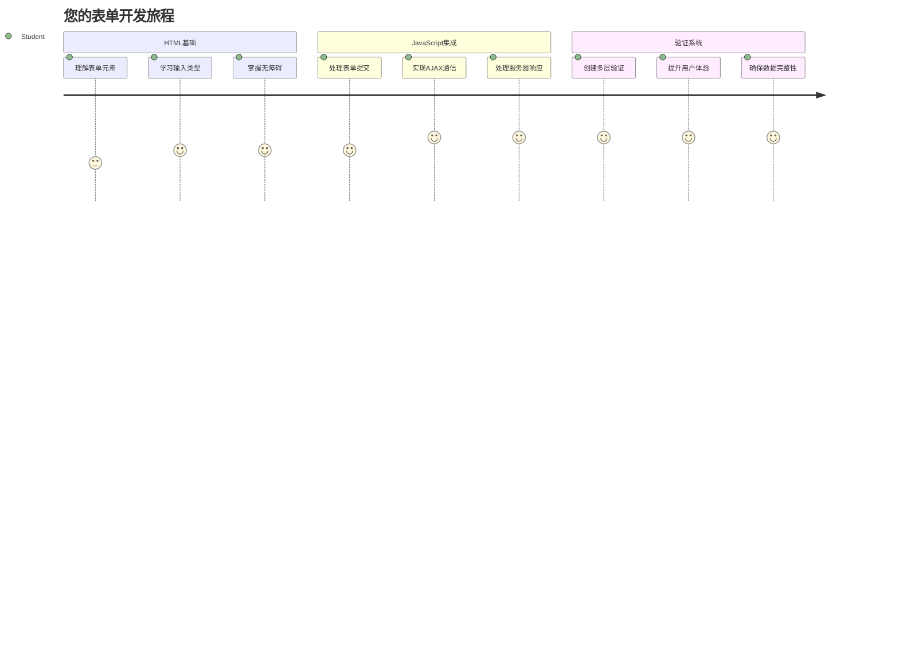
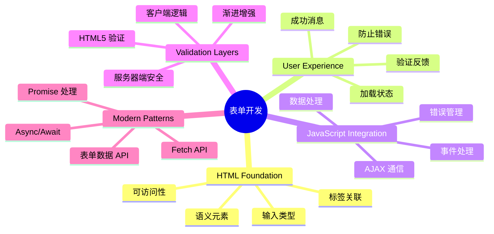
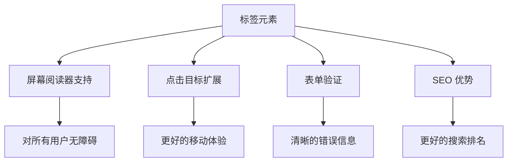
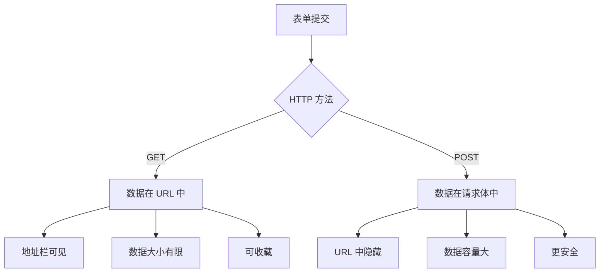
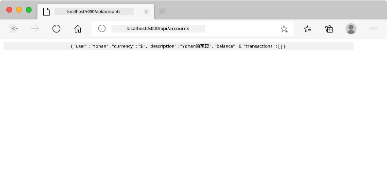
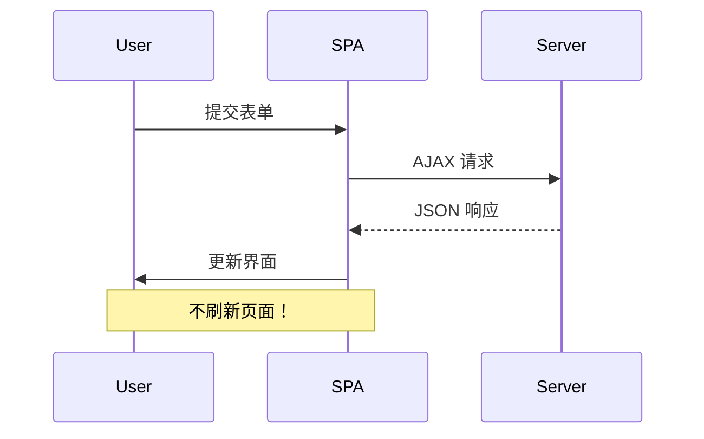
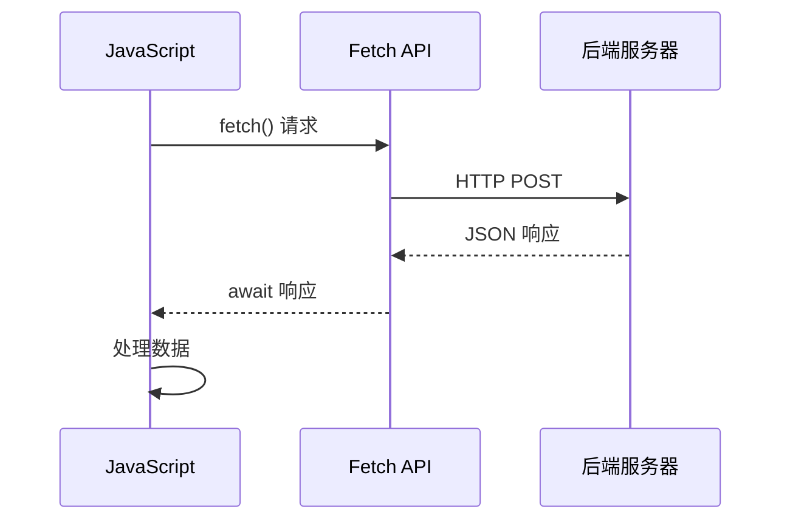
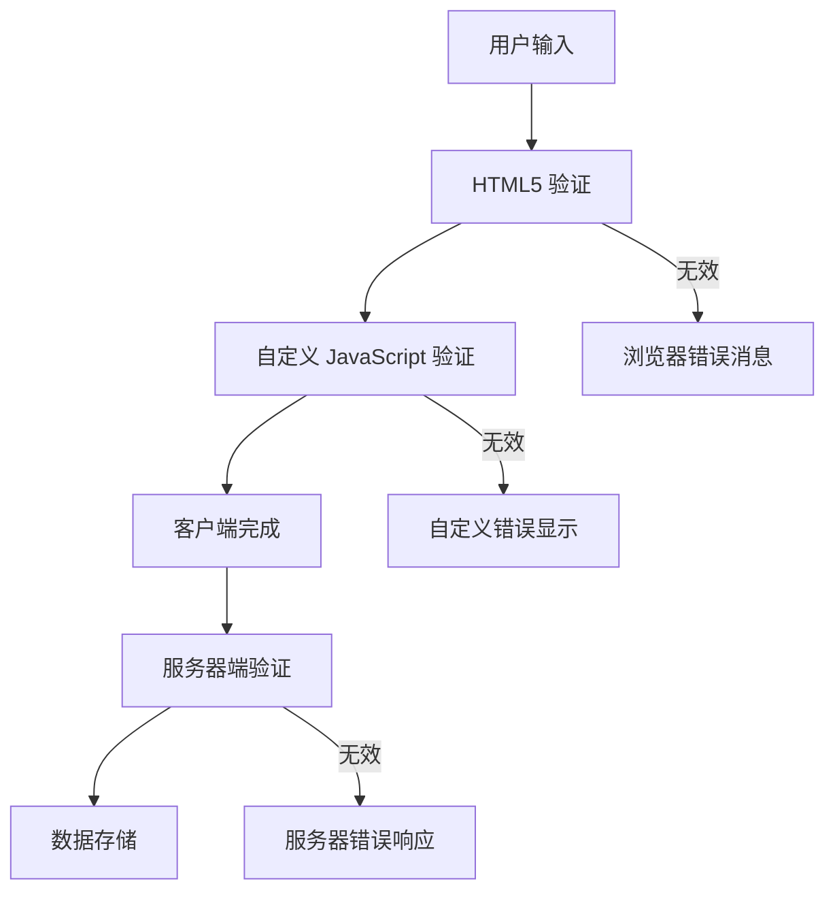
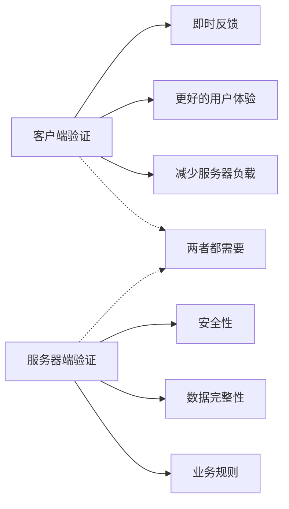
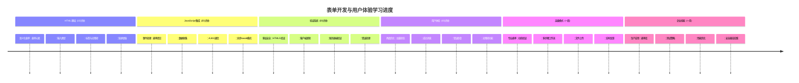

<!--
CO_OP_TRANSLATOR_METADATA:
{
  "original_hash": "7cbdbd132d39a2bb493e85bc2a9387cc",
  "translation_date": "2026-01-06T11:38:09+00:00",
  "source_file": "7-bank-project/2-forms/README.md",
  "language_code": "zh"
}
-->
# 构建银行应用第 2 部分：构建登录和注册表单


## 课前测验

[课前测验](https://ff-quizzes.netlify.app/web/quiz/43)

你有没有填写过一个在线表单，然后被拒绝电子邮件格式？或者点击提交时丢失了所有信息？我们都遇到过这些令人沮丧的经历。

表单是用户与应用功能之间的桥梁。就像空中交通管制员用来安全引导飞机到目的地的严格协议一样，设计良好的表单提供清晰的反馈，防止代价高昂的错误。而糟糕的表单则会像繁忙机场中的误传信息一样迅速驱赶用户。

在本课中，我们将把你的静态银行应用转变为交互式应用。你将学习构建能够验证用户输入、与服务器通信并提供有用反馈的表单。把它想象成构建一个控制界面，让用户能够导航你应用的各种功能。

到课程结束时，你将拥有一个完整的登录和注册系统，带有引导用户成功而非挫败的验证功能。


## 前置条件

在开始构建表单之前，我们先确保你已经正确配置好所有内容。本课紧接着上课内容，如果你提前跳过，可能需要回去先把基础打好。

### 必备环境设置

| 组件 | 状态 | 描述 |
|-----------|--------|-------------|
| [HTML 模板](../1-template-route/README.md) | ✅ 必须 | 你的基础银行应用结构 |
| [Node.js](https://nodejs.org) | ✅ 必须 | 服务器端的 JavaScript 运行环境 |
| [银行 API 服务器](../api/README.md) | ✅ 必须 | 用于数据存储的后端服务 |

> 💡 **开发小贴士**：你将同时运行两个独立的服务器 —— 一个用于前端银行应用，另一个用于后端 API。这与现实开发中前后端独立运行的方式相符。

### 服务器配置

**你的开发环境包括：**
- **前端服务器**：提供你的银行应用（通常端口为 `3000`）
- **后端 API 服务器**：处理数据存储和检索（端口为 `5000`）
- **两个服务器**可同时运行且互不冲突

**测试你的 API 连接：**
```bash
curl http://localhost:5000/api
# 预期响应: "银行 API v1.0.0"
```

**如果你看到 API 版本响应，就可以继续了！**

---

## 理解 HTML 表单和控件

HTML 表单是用户与网页应用交流的方式。把它想象成19世纪连接遥远地点的电报系统 —— 它是用户意图和应用响应之间的通信协议。设计得当时，表单能够捕捉错误、指导输入格式并提供有用建议。

现代表单远比基本的文本输入更复杂。HTML5 引入了专门的输入类型，自动处理电子邮件验证、数字格式以及日期选择。这些改进对无障碍和移动用户体验都有好处。

### 表单必备元素

**构建每个表单都需要的基本块：**

```html
<!-- Basic form structure -->
<form id="userForm" method="POST">
  <label for="username">Username</label>
  <input id="username" name="username" type="text" required>
  
  <button type="submit">Submit</button>
</form>
```

**这段代码实现了：**
- **创建**了带唯一标识的表单容器
- **指定**了用来提交数据的 HTTP 方法
- **通过标签关联输入**提高无障碍性
- **定义**了提交按钮用于处理表单

### 现代输入类型和属性

| 输入类型 | 功能 | 示例用法 |
|------------|---------|---------------|
| `text` | 普通文本输入 | `<input type="text" name="username">` |
| `email` | 电子邮件验证 | `<input type="email" name="email">` |
| `password` | 隐藏文本输入 | `<input type="password" name="password">` |
| `number` | 数字输入 | `<input type="number" name="balance" min="0">` |
| `tel` | 电话号码 | `<input type="tel" name="phone">` |

> 💡 **现代 HTML5 优势**：使用特定的输入类型可以提供自动验证、合适的手机键盘和更好的无障碍支持，而无需额外的 JavaScript！

### 按钮类型和行为

```html
<!-- Different button behaviors -->
<button type="submit">Save Data</button>     <!-- Submits the form -->
<button type="reset">Clear Form</button>    <!-- Resets all fields -->
<button type="button">Custom Action</button> <!-- No default behavior -->
```

**每种按钮类型的作用：**
- **提交按钮**：触发表单提交，将数据发送到指定端点
- **重置按钮**：将所有表单字段恢复到初始状态
- **普通按钮**：不具备默认行为，需要自定义 JavaScript 实现功能

> ⚠️ **重要提示**：`<input>` 元素是自闭合的，不需要闭合标签。现代最佳写法是不带斜杠的 `<input>`。

### 构建你的登录表单

现在让我们创建一个实用的登录表单，演示现代 HTML 表单实践。我们先从基础结构开始，逐步通过无障碍增强和验证进行完善。

```html
<template id="login">
  <h1>Bank App</h1>
  <section>
    <h2>Login</h2>
    <form id="loginForm" novalidate>
      <div class="form-group">
        <label for="username">Username</label>
        <input id="username" name="user" type="text" required 
               autocomplete="username" placeholder="Enter your username">
      </div>
      <button type="submit">Login</button>
    </form>
  </section>
</template>
```

**这里的实现细节包括：**
- **使用语义化 HTML5 元素**结构表单
- **用带有有意义类名的 div 容器**分组相关元素
- **使用 `for` 和 `id` 属性**关联标签和输入
- **使用现代属性**如 `autocomplete` 和 `placeholder` 优化用户体验
- **加上 `novalidate`**以便用 JavaScript 控制验证，而非浏览器默认

### 正确标签的重要性

**为什么标签对现代网页开发很重要：**


**正确标签的成效：**
- **帮助屏幕阅读器清晰朗读表单字段**
- **扩大可点击区域（点击标签聚焦输入框）**
- **改善移动端使用体验，增加触控目标大小**
- **支持带有含义的错误消息的表单验证**
- **通过语义化增强 SEO**

> 🎯 **无障碍目标**：每个表单输入都应关联标签。这个简单的做法让你的表单对所有用户（包括残障用户）都更友好，也提升整体用户体验。

### 创建注册表单

注册表单需要更详细的信息来创建完整账户。我们用现代 HTML5 特性和增强的无障碍来构建它。

```html
<hr/>
<h2>Register</h2>
<form id="registerForm" novalidate>
  <div class="form-group">
    <label for="user">Username</label>
    <input id="user" name="user" type="text" required 
           autocomplete="username" placeholder="Choose a username">
  </div>
  
  <div class="form-group">
    <label for="currency">Currency</label>
    <input id="currency" name="currency" type="text" value="$" 
           required maxlength="3" placeholder="USD, EUR, etc.">
  </div>
  
  <div class="form-group">
    <label for="description">Account Description</label>
    <input id="description" name="description" type="text" 
           maxlength="100" placeholder="Personal savings, checking, etc.">
  </div>
  
  <div class="form-group">
    <label for="balance">Starting Balance</label>
    <input id="balance" name="balance" type="number" value="0" 
           min="0" step="0.01" placeholder="0.00">
  </div>
  
  <button type="submit">Create Account</button>
</form>
```

**上述实现中我们：**
- **用容器 div 组织每个字段**以便更好地样式布局
- **添加适当的 `autocomplete` 属性**支持浏览器自动填充
- **包含有用的占位文本**引导用户输入
- **设定合理的默认值**通过 `value` 属性
- **使用验证属性**如 `required`、`maxlength` 和 `min`
- **对余额字段使用 `type="number"`**并支持小数

### 探索输入类型和行为

**现代输入类型提供更多功能：**

| 功能 | 优势 | 示例 |
|---------|---------|----------|
| `type="number"` | 手机数字键盘 | 余额输入更便捷 |
| `step="0.01"` | 控制小数精度 | 允许货币分角输入 |
| `autocomplete` | 浏览器自动填充 | 表单填写更快 |
| `placeholder` | 上下文提示 | 指导用户预期 |

> 🎯 **无障碍挑战**：试着只用键盘导航表单！用 `Tab` 在字段间切换，`Space` 选中复选框，`Enter` 提交。这能帮助你理解屏幕阅读器用户如何交互。

### 🔄 **教学检查**
**表单基础理解**：在用 JavaScript 实现之前，确保你理解：
- ✅ 语义化 HTML 如何构建无障碍表单结构
- ✅ 输入类型为什么影响手机键盘和验证
- ✅ 标签和表单控件的关系
- ✅ 表单属性如何影响浏览器默认行为

**快速自测**：如果没有 JavaScript 处理，提交表单会发生什么？
*回答：浏览器会执行默认提交，通常重定向到 action URL*

**HTML5 表单优势**：现代表单提供：
- **内置验证**：自动检查电子邮件和数字格式
- **移动优化**：为不同输入类型提供合适键盘
- **无障碍支持**：屏幕阅读器和键盘导航支持
- **渐进增强**：即使禁用 JavaScript 也能正常工作

## 理解表单提交方法

当有人填写你的表单并点击提交时，数据需要发送到某处 —— 通常是服务器来保存它。实现方式有几种，知道选用哪一种可以避免日后麻烦。

让我们看看点击提交按钮时到底发生了什么。

### 表单默认行为

先观察基本表单提交时的情况：

**测试你当前的表单：**
1. 点击你的表单中的*注册*按钮
2. 观察浏览器地址栏的变化
3. 注意页面如何重新加载，数据出现在 URL 中


### HTTP 方法对比


**理解差异：**

| 方法 | 使用场景 | 数据位置 | 安全级别 | 大小限制 |
|--------|----------|---------------|----------------|-------------|
| `GET` | 搜索查询、过滤 | URL 参数 | 低（可见） | 约 2000 字符 |
| `POST` | 用户账户、敏感数据 | 请求体 | 较高（隐藏） | 无实际限制 |

**基本差别理解：**
- **GET**：将表单数据附加在 URL 上作为查询参数（适用于搜索类操作）
- **POST**：将数据放在请求体中（敏感信息必用）
- **GET 限制**：体积限制，数据可见，会存入浏览器历史
- **POST 优势**：容量大，私密，支持文件上传

> 💡 **最佳实践**：搜索窗和过滤用 `GET`，用户注册、登录及数据创建用 `POST`。

### 配置表单提交

让我们配置注册表单，使用 POST 方法正确与后端 API 通信：

```html
<form id="registerForm" action="//localhost:5000/api/accounts" 
      method="POST" novalidate>
```

**配置作用：**
- **指向**你的 API 端点提交数据
- **使用** POST 方法保证数据安全传输
- **包含** `novalidate` 用于 JavaScript 验证控制

### 测试表单提交

**测试表单提交步骤：**
1. **填写**你的注册表单信息
2. **点击**“创建账户”按钮
3. **观察**浏览器中的服务器响应



**你应该看到：**
- **浏览器跳转到 API 端点 URL**
- **返回包含你新建账户数据的 JSON 响应**
- **服务器确认账户创建成功**

> 🧪 **实验时间**：尝试用相同的用户名再次注册。服务器返回什么响应？这帮助你了解服务器如何处理重复数据和错误情况。

### 理解 JSON 响应

**服务器成功处理你的表单时：**
```json
{
  "user": "john_doe",
  "currency": "$",
  "description": "Personal savings",
  "balance": 100,
  "id": "unique_account_id"
}
```

**响应显示：**
- **创建了**一个带你指定数据的新账户
- **分配了**唯一标识符方便后续引用
- **返回了**所有账户信息以供验证
- **表明**数据库已成功保存

## 使用 JavaScript 进行现代表单处理

传统表单提交会导致整页刷新，就像早期太空任务需要整体重启系统来调整轨道。这会破坏用户体验，丢失应用状态。

JavaScript 表单处理则像现代航天器的连续导航系统 —— 实时调整而不会丢失导航上下文。我们可以拦截表单提交，立即反馈，优雅处理错误，基于服务器响应更新界面，同时保持用户在应用中的位置。

### 为什么避免页面刷新？


**JavaScript 表单处理带来的好处：**
- **保持**应用状态和用户上下文
- **提供**即时反馈和加载指示
- **支持**动态错误处理和验证
- **创造**流畅的类似应用体验
- **允许**基于服务器响应的条件逻辑

### 从传统到现代表单的转变

**传统方式的问题：**
- **将用户重定向**离开你的应用
- **丢失**当前的应用状态和上下文
- **需要**完整页面刷新处理简单操作
- **反馈控制有限**

**现代 JavaScript 方式优势：**
- **用户始终停留**在你的应用内
- **保留**全部应用状态和数据
- **支持**实时验证和反馈
- **促进**渐进增强和无障碍支持

### 实现 JavaScript 表单处理

让我们用现代 JavaScript 事件处理替换传统表单提交：

```html
<!-- Remove the action attribute and add event handling -->
<form id="registerForm" method="POST" novalidate>
```

**把注册逻辑加到你的 `app.js` 文件中：**

```javascript
// 现代事件驱动的表单处理
function register() {
  const registerForm = document.getElementById('registerForm');
  const formData = new FormData(registerForm);
  const data = Object.fromEntries(formData);
  const jsonData = JSON.stringify(data);
  
  console.log('Form data prepared:', data);
}

// 页面加载时附加事件监听器
document.addEventListener('DOMContentLoaded', () => {
  const registerForm = document.getElementById('registerForm');
  registerForm.addEventListener('submit', (event) => {
    event.preventDefault(); // 阻止默认的表单提交
    register();
  });
});
```

**这里实现了：**
- **使用 `event.preventDefault()`**阻止默认提交行为
- **用现代 DOM 选择获取表单元素**
- **用强大的 `FormData` API 提取表单数据**
- **用 `Object.fromEntries()` 将 FormData 转换为普通对象**
- **序列化数据为 JSON 格式，方便传给服务器**
- **输出处理后的数据用于调试和验证**

### 理解 FormData API

**FormData API 提供强大的表单处理能力：**
```javascript
// FormData捕获内容的示例
const formData = new FormData(registerForm);

// FormData自动捕获：
// {
//   "user": "john_doe",
//   "currency": "¥",
//   "description": "个人账户",
//   "balance": "100"
// }
```

**FormData API 优势：**
- **全面收集**：捕获所有表单元素，包括文本、文件和复杂输入
- **类型感知**：自动处理不同输入类型，无需自定义编码
- **高效**：通过单个 API 调用消除手动字段收集
- **适应性强**：表单结构变化时仍能保持功能

### 创建服务器通信函数

现在让我们使用现代 JavaScript 模式构建一个与 API 服务器通信的强大函数：

```javascript
async function createAccount(account) {
  try {
    const response = await fetch('//localhost:5000/api/accounts', {
      method: 'POST',
      headers: { 
        'Content-Type': 'application/json',
        'Accept': 'application/json'
      },
      body: account
    });
    
    // 检查响应是否成功
    if (!response.ok) {
      throw new Error(`HTTP error! status: ${response.status}`);
    }
    
    return await response.json();
  } catch (error) {
    console.error('Account creation failed:', error);
    return { error: error.message || 'Network error occurred' };
  }
}
```

**理解异步 JavaScript：**


**此现代实现达成的效果：**
- **使用** `async/await` 实现可读的异步代码
- **包含** 使用 try/catch 块的适当错误处理
- **检查** 响应状态后再处理数据
- **设置** 适合 JSON 通信的请求头
- **提供** 详细的错误消息以便调试
- **返回** 成功和错误情况下的一致数据结构

### 现代 Fetch API 的强大功能

**Fetch API 相较旧方法的优势：**

| 功能 | 优点 | 实现方式 |
|---------|---------|----------------|
| 基于 Promise | 清晰的异步代码 | `await fetch()` |
| 请求自定义 | 完全控制 HTTP | 头信息、方法、请求体 |
| 响应处理 | 灵活的数据解析 | `.json()`, `.text()`, `.blob()` |
| 错误处理 | 全面捕获错误 | Try/catch 块 |

> 🎥 **了解更多**：[Async/Await 教程](https://youtube.com/watch?v=YwmlRkrxvkk) - 理解现代 Web 开发的异步 JavaScript 模式。

**服务器通信关键概念：**
- **异步函数** 允许暂停执行以等待服务器响应
- **Await 关键字** 使异步代码看起来像同步代码
- **Fetch API** 提供现代的基于 Promise 的 HTTP 请求
- **错误处理** 确保应用对网络问题做出优雅响应

### 完善注册函数

让我们将所有内容整合，打造一个完整、适合生产环境的注册函数：

```javascript
async function register() {
  const registerForm = document.getElementById('registerForm');
  const submitButton = registerForm.querySelector('button[type="submit"]');
  
  try {
    // 显示加载状态
    submitButton.disabled = true;
    submitButton.textContent = 'Creating Account...';
    
    // 处理表单数据
    const formData = new FormData(registerForm);
    const jsonData = JSON.stringify(Object.fromEntries(formData));
    
    // 发送到服务器
    const result = await createAccount(jsonData);
    
    if (result.error) {
      console.error('Registration failed:', result.error);
      alert(`Registration failed: ${result.error}`);
      return;
    }
    
    console.log('Account created successfully!', result);
    alert(`Welcome, ${result.user}! Your account has been created.`);
    
    // 注册成功后重置表单
    registerForm.reset();
    
  } catch (error) {
    console.error('Unexpected error:', error);
    alert('An unexpected error occurred. Please try again.');
  } finally {
    // 恢复按钮状态
    submitButton.disabled = false;
    submitButton.textContent = 'Create Account';
  }
}
```

**此增强实现包含：**
- **在表单提交时** 提供视觉反馈
- **禁用** 提交按钮以防止重复提交
- **优雅处理** 预期和非预期错误
- **显示** 用户友好的成功和错误消息
- **成功注册后** 重置表单
- **无论结果如何** 恢复 UI 状态

### 测试你的实现

**打开浏览器开发者工具并测试注册：**

1. **打开** 浏览器控制台（F12 → 控制台选项卡）
2. **填写** 注册表单
3. **点击** “创建账户”
4. **观察** 控制台信息和用户反馈


**你应该看到：**
- **加载状态** 出现在提交按钮上
- **控制台日志** 显示流程详细信息
- **成功消息** 在账户创建成功后出现
- **表单自动重置** 成功提交后

> 🔒 **安全提示**：当前数据通过 HTTP 传输，生产环境不安全。实际应用中应始终使用 HTTPS 加密传输。了解更多关于 [HTTPS 安全](https://en.wikipedia.org/wiki/HTTPS) 及其对保护用户数据的重要性。

### 🔄 **教学核对**
**现代 JavaScript 集成**：验证你对异步表单处理的理解：
- ✅ `event.preventDefault()` 如何改变表单默认行为？
- ✅ 为什么 FormData API 比手动收集字段更高效？
- ✅ async/await 模式如何提升代码可读性？
- ✅ 错误处理在用户体验中起什么作用？

**系统架构**：你的表单处理展示了：
- **事件驱动编程**：表单响应用户操作，无需页面刷新
- **异步通信**：服务器请求不阻塞用户界面
- **错误处理**：网络请求失败时优雅降级
- **状态管理**：UI 根据服务器响应做出相应更新
- **渐进增强**：基础功能正常，JavaScript 提升体验

**专业模式**：你实现了：
- **单一职责**：函数目的明确且聚焦
- **错误边界**：try/catch 块防止应用崩溃
- **用户反馈**：加载状态及成功/错误提示
- **数据转换**：FormData 转 JSON 以便通信

## 全面表单验证

表单验证避免用户提交后才发现错误的挫败感。就像国际空间站的多重冗余系统一样，有效验证采用多层安全检查。

最佳方案结合了浏览器级验证（即时反馈）、JavaScript 验证（提升用户体验）和服务器端验证（安全与数据完整性）。这种冗余既确保用户满意也保护系统安全。

### 理解验证层级


**多层验证策略：**
- **HTML5 验证**：浏览器即时检查
- **JavaScript 验证**：自定义逻辑和用户体验
- **服务器验证**：最终安全和数据完整性审核
- **渐进增强**：即使禁用 JavaScript 也能工作

### HTML5 验证属性

**你可用的现代验证工具：**

| 属性 | 作用 | 示例用法 | 浏览器行为 |
|-----------|---------|---------------|------------------|
| `required` | 必填字段 | `<input required>` | 阻止空提交 |
| `minlength`/`maxlength` | 文本长度限制 | `<input maxlength="20">` | 强制字符限制 |
| `min`/`max` | 数值范围 | `<input min="0" max="1000">` | 验证数值边界 |
| `pattern` | 自定义正则规则 | `<input pattern="[A-Za-z]+">` | 匹配特定格式 |
| `type` | 数据类型验证 | `<input type="email">` | 格式特定验证 |

### CSS 验证样式

**创建验证状态视觉反馈：**

```css
/* Valid input styling */
input:valid {
  border-color: #28a745;
  background-color: #f8fff9;
}

/* Invalid input styling */
input:invalid {
  border-color: #dc3545;
  background-color: #fff5f5;
}

/* Focus states for better accessibility */
input:focus:valid {
  box-shadow: 0 0 0 0.2rem rgba(40, 167, 69, 0.25);
}

input:focus:invalid {
  box-shadow: 0 0 0 0.2rem rgba(220, 53, 69, 0.25);
}
```

**这些视觉提示达成的效果：**
- **绿色边框**：表示验证成功，如航控中心的绿灯
- **红色边框**：提示需要注意的验证错误
- **焦点高亮**：清晰指示当前输入位置
- **一致样式**：建立用户易学的界面模式

> 💡 **专业建议**：利用 `:valid` 和 `:invalid` CSS 伪类，用户输入时即时反馈，营造响应式且友好的界面。

### 实现全面验证

让我们为你的注册表单增强强健的验证，提供优秀的用户体验和数据质量：

```html
<form id="registerForm" method="POST" novalidate>
  <div class="form-group">
    <label for="user">Username <span class="required">*</span></label>
    <input id="user" name="user" type="text" required 
           minlength="3" maxlength="20" 
           pattern="[a-zA-Z0-9_]+" 
           autocomplete="username"
           title="Username must be 3-20 characters, letters, numbers, and underscores only">
    <small class="form-text">Choose a unique username (3-20 characters)</small>
  </div>
  
  <div class="form-group">
    <label for="currency">Currency <span class="required">*</span></label>
    <input id="currency" name="currency" type="text" required 
           value="$" maxlength="3" 
           pattern="[A-Z$€£¥₹]+" 
           title="Enter a valid currency symbol or code">
    <small class="form-text">Currency symbol (e.g., $, €, £)</small>
  </div>
  
  <div class="form-group">
    <label for="description">Account Description</label>
    <input id="description" name="description" type="text" 
           maxlength="100" 
           placeholder="Personal savings, checking, etc.">
    <small class="form-text">Optional description (up to 100 characters)</small>
  </div>
  
  <div class="form-group">
    <label for="balance">Starting Balance</label>
    <input id="balance" name="balance" type="number" 
           value="0" min="0" step="0.01" 
           title="Enter a positive number for your starting balance">
    <small class="form-text">Initial account balance (minimum $0.00)</small>
  </div>
  
  <button type="submit">Create Account</button>
</form>
```

**理解增强验证：**
- **结合** 必填字段标记和有用描述
- **包含** 用于格式验证的 `pattern` 属性
- **提供** 辅助无障碍和提示的 `title` 属性
- **添加** 辅助文本引导用户输入
- **使用** 语义化 HTML 结构提升可访问性

### 高级验证规则

**各验证规则效果：**

| 字段 | 验证规则 | 用户益处 |
|-------|------------------|--------------|
| 用户名 | `required`, `minlength="3"`, `maxlength="20"`, `pattern="[a-zA-Z0-9_]+"` | 确保有效且唯一标识 |
| 货币 | `required`, `maxlength="3"`, `pattern="[A-Z$€£¥₹]+"` | 接受常见货币符号 |
| 余额 | `min="0"`, `step="0.01"`, `type="number"` | 防止负余额 |
| 描述 | `maxlength="100"` | 合理长度限制 |

### 测试验证行为

**尝试以下验证场景：**
1. **提交** 空的必填字段
2. **输入** 少于3个字符的用户名
3. **尝试** 在用户名字段使用特殊字符
4. **输入** 负余额数值


**你会看到：**
- **浏览器显示** 原生验证消息
- **样式根据** `:valid` 和 `:invalid` 状态变化
- **验证未通过时** 阻止表单提交
- **焦点自动** 跳转至第一个无效字段

### 客户端与服务器端验证


**为何需要两层验证：**
- **客户端验证**：即时反馈，提升用户体验
- **服务器验证**：确保安全，处理复杂业务规则
- **结合方案**：打造强大、友好且安全的应用
- **渐进增强**：即使禁用 JavaScript 也能运行

> 🛡️ **安全提醒**：切勿仅信任客户端验证！恶意用户可绕过客户端检查，服务器验证对于安全与数据完整性至关重要。

### ⚡ **未来 5 分钟能做什么**
- [ ] 用无效数据测试表单，查看验证消息
- [ ] 禁用 JavaScript 提交表单，体验 HTML5 验证
- [ ] 打开浏览器开发者工具检查发送给服务器的表单数据
- [ ] 试用不同输入类型，观察移动设备键盘变化

### 🎯 **这个小时可达成的目标**
- [ ] 完成课后测验，理解表单处理概念
- [ ] 实现带即时反馈的全面验证挑战
- [ ] 添加 CSS 样式，制作专业表单外观
- [ ] 创建用户名重复和服务器错误的错误处理
- [ ] 添加密码确认字段并实现匹配验证

### 📅 **你的为期一周的表单精通之旅**
- [ ] 完成包含高级表单功能的银行应用
- [ ] 实现头像或文件的上传功能
- [ ] 添加带进度指示和状态管理的多步表单
- [ ] 创建根据用户选择动态调整的表单
- [ ] 实现表单自动保存与恢复优化用户体验
- [ ] 添加高级验证，例如邮箱验证和手机号格式

### 🌟 **你为期一月的前端开发精通**
- [ ] 构建含条件逻辑和工作流的复杂表单应用
- [ ] 学习表单库和框架实现快速开发
- [ ] 精通无障碍指导和包容性设计原则
- [ ] 实现全球表单的国际化、本地化支持
- [ ] 制作可复用表单组件库和设计系统
- [ ] 参与开源表单项目，分享最佳实践

## 🎯 你的表单开发精通时间线


### 🛠️ 你的表单开发工具包总结

完成本课后，你已精通：
- **HTML5 表单**：语义结构、输入类型、无障碍功能
- **JavaScript 表单处理**：事件管理、数据收集和 AJAX 通信
- **验证架构**：多层验证保障安全和用户体验
- **异步编程**：现代 fetch API 与 async/await 模式
- **错误管理**：全面错误处理和用户反馈系统
- **用户体验设计**：加载状态、成功消息和错误恢复
- **渐进增强**：表单兼容所有浏览器和功能

**实际应用领域**：你的表单开发技能可直接应用于：
- **电子商务应用**：结账流程、账户注册、支付表单
- **企业软件**：数据录入、报告界面、工作流应用
- **内容管理**：发布平台、用户生成内容、管理界面
- **金融应用**：银行界面、投资平台、交易系统
- **医疗系统**：患者门户、预约安排、病历表单
- **教育平台**：课程注册、评估工具、学习管理

**获得的专业技能**：你现在可以：
- **设计** 适合所有用户（包括有障碍用户）的无障碍表单
- **实现** 安全的表单验证，防止数据破坏和安全漏洞
- **创建** 响应式用户界面，提供清晰反馈和指导
- **调试** 利用浏览器开发工具和网络分析处理复杂表单交互
- **优化** 通过高效的数据处理和验证策略提升表单性能

**掌握的前端开发概念**：
- **事件驱动架构**：用户交互处理和响应系统
- **异步编程**：非阻塞服务器通信与错误处理
- **数据验证**：客户端与服务器端的安全和完整性检查
- **用户体验设计**：引导用户成功的直观界面
- **无障碍工程**：适合多元用户需求的包容设计

**下一阶段**：你已准备好探索高级表单库，实现复杂验证规则，或构建企业级数据收集系统！

🌟 **成就解锁**：你已构建一个包含专业验证、错误处理和用户体验模式的完整表单处理系统！

---


---

## GitHub Copilot Agent Challenge 🚀

使用 Agent 模式完成以下挑战：

**描述：** 使用全面的客户端验证和用户反馈增强注册表单。此挑战将帮助你练习表单验证、错误处理和通过互动反馈提升用户体验。
**提示：** 为注册表单创建一个完整的表单验证系统，包括：1）用户输入时每个字段的实时验证反馈，2）出现在每个输入字段下方的自定义验证消息，3）具有匹配验证的密码确认字段，4）视觉提示（如有效字段的绿色勾号和无效字段的红色警告），5）仅当所有验证通过时才启用的提交按钮。使用 HTML5 验证属性、用于验证状态样式的 CSS 以及用于交互行为的 JavaScript。

在这里了解更多关于[agent mode](https://code.visualstudio.com/blogs/2025/02/24/introducing-copilot-agent-mode)。

## 🚀 挑战

如果用户已存在，在 HTML 中显示错误消息。

下面是经过一些样式调整后最终登录页面的示例：


## 课后测验

[课后测验](https://ff-quizzes.netlify.app/web/quiz/44)

## 复习与自学

开发者在表单构建方面变得非常有创意，特别是在验证策略方面。通过浏览[CodePen](https://codepen.com)了解不同的表单流程；你能找到一些有趣且启发灵感的表单吗？

## 作业

[为你的银行应用设置样式](assignment.md)

---

<!-- CO-OP TRANSLATOR DISCLAIMER START -->
**免责声明**：
本文件由AI翻译服务[Co-op Translator](https://github.com/Azure/co-op-translator)翻译完成。虽然我们致力于保证翻译的准确性，但请注意，机器翻译可能存在错误或不准确之处。原文应被视为权威版本。对于重要信息，建议采用专业人工翻译。我们不对因使用本翻译所产生的任何误解或曲解承担责任。
<!-- CO-OP TRANSLATOR DISCLAIMER END -->