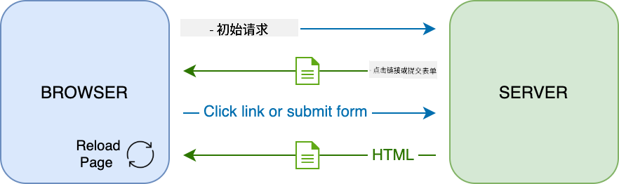

<!--
CO_OP_TRANSLATOR_METADATA:
{
  "original_hash": "89d0df9854ed020f155e94882ae88d4c",
  "translation_date": "2025-08-29T14:41:13+00:00",
  "source_file": "7-bank-project/3-data/README.md",
  "language_code": "zh"
}
-->
# 构建银行应用程序第3部分：获取和使用数据的方法

## 课前测验

[课前测验](https://ff-quizzes.netlify.app/web/quiz/45)

### 简介

在每个网络应用程序的核心部分都有*数据*。数据可以有多种形式，但其主要目的是向用户展示信息。随着网络应用程序变得越来越互动和复杂，用户如何访问和交互信息已成为网络开发的关键部分。

在本课中，我们将学习如何异步从服务器获取数据，并使用这些数据在网页上显示信息，而无需重新加载HTML。

### 前置条件

在学习本课之前，你需要完成网络应用程序的[登录和注册表单](../2-forms/README.md)部分。你还需要安装[Node.js](https://nodejs.org)并在本地[运行服务器API](../api/README.md)，以便获取账户数据。

你可以通过在终端中执行以下命令来测试服务器是否正常运行：

```sh
curl http://localhost:5000/api
# -> should return "Bank API v1.0.0" as a result
```

---

## AJAX和数据获取

传统的网站在用户选择链接或通过表单提交数据时，会通过重新加载整个HTML页面来更新显示的内容。每次需要加载新数据时，网络服务器都会返回一个全新的HTML页面，浏览器需要处理这些页面，这会中断当前的用户操作，并在重新加载期间限制交互。这种工作流程也被称为*多页面应用程序*（Multi-Page Application，MPA）。



随着网络应用程序变得更加复杂和互动，一种名为[AJAX（异步JavaScript和XML）](https://en.wikipedia.org/wiki/Ajax_(programming))的新技术应运而生。这种技术允许网络应用程序使用JavaScript异步地从服务器发送和检索数据，而无需重新加载HTML页面，从而实现更快的更新和更流畅的用户交互。当从服务器接收到新数据时，可以使用[DOM](https://developer.mozilla.org/docs/Web/API/Document_Object_Model) API通过JavaScript更新当前的HTML页面。随着时间的推移，这种方法演变成了现在所谓的[*单页面应用程序*（Single-Page Application，SPA）](https://en.wikipedia.org/wiki/Single-page_application)。


在AJAX首次引入时，唯一可用的异步获取数据的API是[`XMLHttpRequest`](https://developer.mozilla.org/docs/Web/API/XMLHttpRequest/Using_XMLHttpRequest)。但现代浏览器现在还实现了更方便且功能更强大的[`Fetch` API](https://developer.mozilla.org/docs/Web/API/Fetch_API)，它使用Promise，更适合处理JSON数据。

> 虽然所有现代浏览器都支持`Fetch API`，但如果你希望你的网络应用程序在旧版或老旧浏览器上运行，最好先查看[caniuse.com上的兼容性表](https://caniuse.com/fetch)。

### 任务

在[上一课](../2-forms/README.md)中，我们实现了用于创建账户的注册表单。现在我们将添加代码，通过现有账户登录并获取其数据。打开`app.js`文件，添加一个新的`login`函数：

```js
async function login() {
  const loginForm = document.getElementById('loginForm')
  const user = loginForm.user.value;
}
```

这里我们首先使用`getElementById()`检索表单元素，然后通过`loginForm.user.value`获取输入框中的用户名。每个表单控件都可以通过其名称（在HTML中通过`name`属性设置）作为表单的属性来访问。

类似于我们为注册所做的操作，我们将创建另一个函数来执行服务器请求，这次是为了检索账户数据：

```js
async function getAccount(user) {
  try {
    const response = await fetch('//localhost:5000/api/accounts/' + encodeURIComponent(user));
    return await response.json();
  } catch (error) {
    return { error: error.message || 'Unknown error' };
  }
}
```

我们使用`fetch` API从服务器异步请求数据，但这次除了调用的URL外，我们不需要任何额外的参数，因为我们只是查询数据。默认情况下，`fetch`会创建一个[`GET`](https://developer.mozilla.org/docs/Web/HTTP/Methods/GET) HTTP请求，这正是我们需要的。

✅ `encodeURIComponent()`是一个用于对URL中特殊字符进行转义的函数。如果我们不调用此函数而直接在URL中使用`user`值，可能会出现什么问题？

现在让我们更新`login`函数以使用`getAccount`：

```js
async function login() {
  const loginForm = document.getElementById('loginForm')
  const user = loginForm.user.value;
  const data = await getAccount(user);

  if (data.error) {
    return console.log('loginError', data.error);
  }

  account = data;
  navigate('/dashboard');
}
```

首先，由于`getAccount`是一个异步函数，我们需要使用`await`关键字来等待服务器结果。与任何服务器请求一样，我们还需要处理错误情况。目前我们只添加一个日志消息来显示错误，稍后再处理。

然后我们需要将数据存储在某个地方，以便稍后用来显示仪表盘信息。由于`account`变量尚不存在，我们将在文件顶部创建一个全局变量：

```js
let account = null;
```

在将用户数据保存到变量后，我们可以使用我们已有的`navigate()`函数从*登录*页面导航到*仪表盘*。

最后，我们需要在提交登录表单时调用我们的`login`函数，通过修改HTML实现：

```html
<form id="loginForm" action="javascript:login()">
```

通过注册一个新账户并尝试使用相同账户登录，测试一切是否正常工作。

在继续下一部分之前，我们还可以通过在函数底部添加以下内容来完成`register`函数：

```js
account = result;
navigate('/dashboard');
```

✅ 你知道吗？默认情况下，你只能从与网页相同的*域名和端口*调用服务器API。这是浏览器强制执行的一种安全机制。但等等，我们的网络应用程序运行在`localhost:3000`，而服务器API运行在`localhost:5000`，为什么它能正常工作？通过使用一种名为[跨域资源共享（CORS）](https://developer.mozilla.org/docs/Web/HTTP/CORS)的技术，如果服务器在响应中添加了特殊的头部，允许对特定域名的例外，就可以执行跨域HTTP请求。

> 通过学习这节[课程](https://docs.microsoft.com/learn/modules/use-apis-discover-museum-art/?WT.mc_id=academic-77807-sagibbon)，了解更多关于API的知识。

## 更新HTML以显示数据

现在我们有了用户数据，我们需要更新现有的HTML以显示这些数据。我们已经知道如何使用例如`document.getElementById()`从DOM中检索元素。在获取到基础元素后，这里有一些API可以用来修改它或向其添加子元素：

- 使用[`textContent`](https://developer.mozilla.org/docs/Web/API/Node/textContent)属性可以更改元素的文本。请注意，更改此值会删除元素的所有子元素（如果有的话），并用提供的文本替换它。因此，通过将空字符串`''`赋值给它，也可以高效地删除给定元素的所有子元素。

- 使用[`document.createElement()`](https://developer.mozilla.org/docs/Web/API/Document/createElement)和[`append()`](https://developer.mozilla.org/docs/Web/API/ParentNode/append)方法，可以创建并附加一个或多个新的子元素。

✅ 使用元素的[`innerHTML`](https://developer.mozilla.org/docs/Web/API/Element/innerHTML)属性也可以更改其HTML内容，但应避免使用此方法，因为它容易受到[跨站脚本（XSS）](https://developer.mozilla.org/docs/Glossary/Cross-site_scripting)攻击。

### 任务

在进入*仪表盘*页面之前，我们需要在*登录*页面上做一件事。目前，如果你尝试使用不存在的用户名登录，控制台会显示一条消息，但对于普通用户来说，页面上没有任何变化，你不知道发生了什么。

让我们在登录表单中添加一个占位元素，以便在需要时显示错误消息。一个不错的位置是在登录`<button>`之前：

```html
...
<div id="loginError"></div>
<button>Login</button>
...
```

这个`<div>`元素是空的，这意味着在我们添加内容之前，屏幕上不会显示任何内容。我们还为它设置了一个`id`，以便可以通过JavaScript轻松检索它。

回到`app.js`文件，创建一个新的辅助函数`updateElement`：

```js
function updateElement(id, text) {
  const element = document.getElementById(id);
  element.textContent = text;
}
```

这个函数非常简单：给定一个元素*id*和*text*，它会更新具有匹配`id`的DOM元素的文本内容。让我们在`login`函数中用这个方法替换之前的错误消息：

```js
if (data.error) {
  return updateElement('loginError', data.error);
}
```

现在，如果你尝试使用无效账户登录，你应该会看到如下内容：


现在我们有了一个可视化显示的错误文本，但如果你使用屏幕阅读器，你会发现什么都没有被宣布。为了让动态添加到页面的文本被屏幕阅读器宣布，我们需要使用一种名为[Live Region](https://developer.mozilla.org/docs/Web/Accessibility/ARIA/ARIA_Live_Regions)的技术。这里我们将使用一种特定类型的Live Region，称为警报：

```html
<div id="loginError" role="alert"></div>
```

为`register`函数的错误实现相同的行为（别忘了更新HTML）。

## 在仪表盘上显示信息

使用我们刚刚看到的相同技术，我们还将处理在仪表盘页面上显示账户信息。

从服务器接收到的账户对象如下所示：

```json
{
  "user": "test",
  "currency": "$",
  "description": "Test account",
  "balance": 75,
  "transactions": [
    { "id": "1", "date": "2020-10-01", "object": "Pocket money", "amount": 50 },
    { "id": "2", "date": "2020-10-03", "object": "Book", "amount": -10 },
    { "id": "3", "date": "2020-10-04", "object": "Sandwich", "amount": -5 }
  ],
}
```

> 注意：为了让你的操作更简单，你可以使用已经填充了数据的预先存在的`test`账户。

### 任务

首先，将HTML中的“余额”部分替换为添加占位元素：

```html
<section>
  Balance: <span id="balance"></span><span id="currency"></span>
</section>
```

我们还将在其下方添加一个新部分，用于显示账户描述：

```html
<h2 id="description"></h2>
```

✅ 由于账户描述作为其下方内容的标题，因此它被语义化地标记为标题。了解更多关于[标题结构](https://www.nomensa.com/blog/2017/how-structure-headings-web-accessibility)对可访问性的重要性，并批判性地审视页面，确定还有哪些内容可以作为标题。

接下来，我们将在`app.js`中创建一个新函数，用于填充占位符：

```js
function updateDashboard() {
  if (!account) {
    return navigate('/login');
  }

  updateElement('description', account.description);
  updateElement('balance', account.balance.toFixed(2));
  updateElement('currency', account.currency);
}
```

首先，我们检查是否有需要的账户数据，然后再继续。接着，我们使用之前创建的`updateElement()`函数来更新HTML。

> 为了让余额显示得更美观，我们使用方法[`toFixed(2)`](https://developer.mozilla.org/docs/Web/JavaScript/Reference/Global_Objects/Number/toFixed)强制显示小数点后两位。

现在我们需要在每次加载仪表盘时调用`updateDashboard()`函数。如果你已经完成了[第1课的作业](../1-template-route/assignment.md)，这应该很简单，否则你可以使用以下实现。

将以下代码添加到`updateRoute()`函数的末尾：

```js
if (typeof route.init === 'function') {
  route.init();
}
```

并用以下内容更新路由定义：

```js
const routes = {
  '/login': { templateId: 'login' },
  '/dashboard': { templateId: 'dashboard', init: updateDashboard }
};
```

通过此更改，每次显示仪表盘页面时，都会调用`updateDashboard()`函数。登录后，你应该能够看到账户余额、货币和描述。

## 使用HTML模板动态创建表格行

在[第一课](../1-template-route/README.md)中，我们使用HTML模板和[`appendChild()`](https://developer.mozilla.org/docs/Web/API/Node/appendChild)方法实现了应用程序中的导航。模板也可以更小，并用于动态填充页面的重复部分。

我们将使用类似的方法在HTML表格中显示交易列表。

### 任务

在HTML的`<body>`中添加一个新模板：

```html
<template id="transaction">
  <tr>
    <td></td>
    <td></td>
    <td></td>
  </tr>
</template>
```

此模板表示单个表格行，包含我们想要填充的3列：交易的*日期*、*对象*和*金额*。

然后，为仪表盘模板中表格的`<tbody>`元素添加此`id`属性，以便通过JavaScript更容易找到它：

```html
<tbody id="transactions"></tbody>
```

我们的HTML已准备好，现在切换到JavaScript代码并创建一个新函数`createTransactionRow`：

```js
function createTransactionRow(transaction) {
  const template = document.getElementById('transaction');
  const transactionRow = template.content.cloneNode(true);
  const tr = transactionRow.querySelector('tr');
  tr.children[0].textContent = transaction.date;
  tr.children[1].textContent = transaction.object;
  tr.children[2].textContent = transaction.amount.toFixed(2);
  return transactionRow;
}
```

此函数正如其名称所示：使用我们之前创建的模板，它创建一个新的表格行，并使用交易数据填充其内容。我们将在`updateDashboard()`函数中使用它来填充表格：

```js
const transactionsRows = document.createDocumentFragment();
for (const transaction of account.transactions) {
  const transactionRow = createTransactionRow(transaction);
  transactionsRows.appendChild(transactionRow);
}
updateElement('transactions', transactionsRows);
```

这里我们使用方法[`document.createDocumentFragment()`](https://developer.mozilla.org/docs/Web/API/Document/createDocumentFragment)，它创建一个新的DOM片段，我们可以在其上操作，然后最终将其附加到HTML表格中。

在此代码生效之前，我们还需要做一件事，因为我们的`updateElement()`函数目前仅支持文本内容。让我们稍微更改一下它的代码：

```js
function updateElement(id, textOrNode) {
  const element = document.getElementById(id);
  element.textContent = ''; // Removes all children
  element.append(textOrNode);
}
```

我们使用[`append()`](https://developer.mozilla.org/docs/Web/API/ParentNode/append)方法，因为它允许将文本或[DOM节点](https://developer.mozilla.org/docs/Web/API/Node)附加到父元素，这非常适合我们所有的用例。
如果你尝试使用 `test` 账户登录，现在应该可以在仪表板上看到交易列表 🎉。

---

## 🚀 挑战

合作让仪表板页面看起来像一个真正的银行应用。如果你已经为应用程序设计了样式，尝试使用 [媒体查询](https://developer.mozilla.org/docs/Web/CSS/Media_Queries) 来创建一个 [响应式设计](https://developer.mozilla.org/docs/Web/Progressive_web_apps/Responsive/responsive_design_building_blocks)，使其在桌面和移动设备上都能良好运行。

以下是一个样式化的仪表板页面示例：


## 课后测验

[课后测验](https://ff-quizzes.netlify.app/web/quiz/46)

## 作业

[重构并注释你的代码](assignment.md)

---

**免责声明**：  
本文档使用AI翻译服务[Co-op Translator](https://github.com/Azure/co-op-translator)进行翻译。尽管我们努力确保准确性，但请注意，自动翻译可能包含错误或不准确之处。应以原始语言的文档作为权威来源。对于关键信息，建议使用专业人工翻译。因使用本翻译而导致的任何误解或误读，我们概不负责。