<!--
CO_OP_TRANSLATOR_METADATA:
{
  "original_hash": "86ee5069f27ea3151389d8687c95fac9",
  "translation_date": "2026-01-06T11:42:36+00:00",
  "source_file": "7-bank-project/3-data/README.md",
  "language_code": "zh"
}
-->
# 构建银行应用 第3部分：获取和使用数据的方法

想想《星际迷航》里的企业号计算机——当皮卡德舰长询问舰船状态时，信息会瞬间出现，而不会让整个界面关闭并重新构建。那种无缝的信息流正是我们要通过动态数据获取打造的。

目前，你的银行应用就像一份印刷版报纸——信息丰富但静态。我们要把它转变成更像NASA的任务控制中心，数据持续流动并实时更新，且不会打断用户的工作流程。

你将学习如何异步与服务器通信，处理不同时间到达的数据，并将原始信息转化为对用户有意义的内容。这正是演示版本和生产就绪软件之间的区别。

## ⚡ 接下来 5 分钟你能做些什么

**忙碌开发者快速启动路径**

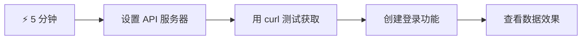
- **第1-2分钟**：启动你的API服务器（`cd api && npm start`）并测试连接
- **第3分钟**：使用 fetch 创建基础的 `getAccount()` 函数
- **第4分钟**：通过 `action="javascript:login()"` 连接登录表单
- **第5分钟**：测试登录并在控制台查看账户数据

**快速测试命令**：
```bash
# 验证API是否正在运行
curl http://localhost:5000/api

# 测试账户数据获取
curl http://localhost:5000/api/accounts/test
```

**为什么这很重要**：5分钟后，你将见识到驱动每个现代网页应用的异步数据获取的魔力。这是让应用响应迅速、生动的基础。

## 🗺️ 你的数据驱动网页应用学习之旅

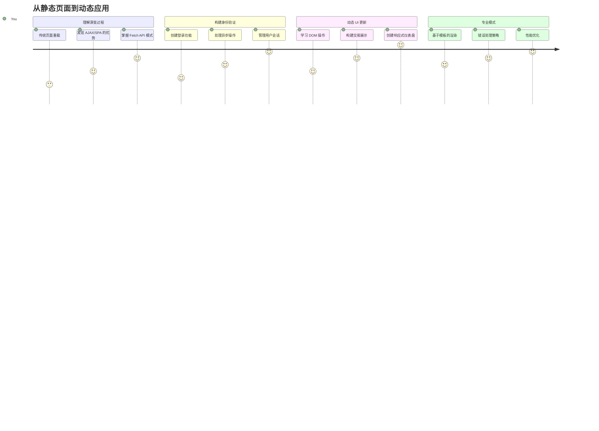
**你的目标**：完成本课后，你将理解现代网页应用如何动态获取、处理和展示数据，打造我们期望的专业无缝用户体验。

## 课前测验

[课前测验](https://ff-quizzes.netlify.app/web/quiz/45)

### 先决条件

在深入数据获取之前，确保你已经准备好以下内容：

- **之前课程**：完成[登录和注册表单](../2-forms/README.md)——我们将在此基础上构建
- **本地服务器**：安装[Node.js](https://nodejs.org)，并[运行服务器API](../api/README.md)以提供账户数据
- **API连接**：使用此命令测试你的服务器连接：

```bash
curl http://localhost:5000/api
# 预期响应："Bank API v1.0.0"
```

这项快速测试确保所有组件能正常通信：
- 验证 Node.js 在系统中正常运行
- 确认API服务器处于活动状态并响应请求
- 验证你的应用可以连接上服务器（就像任务前检查无线电联系）

## 🧠 数据管理生态系统概述

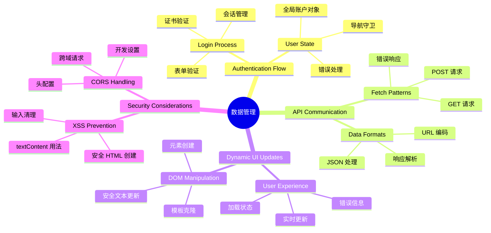
**核心原则**：现代网页应用是数据协调系统——它们在用户界面、服务器API和浏览器安全模型之间协作，创造流畅、响应式体验。

---

## 理解现代网页应用中的数据获取

网页应用处理数据的方式在过去二十年里经历了巨大变化。理解这种演变，帮助你欣赏为何现代技术如 AJAX 和 Fetch API 功能强大，且已成为网页开发者必备工具。

让我们探讨传统网站的工作方式与我们今天构建的动态、响应式应用之间的差异。

### 传统多页面应用（MPA）

在网络早期，每次点击就像切换老式电视频道——屏幕会变空白，然后慢慢调入新内容。这就是早期网页应用的现实，每次交互都意味着完全重建整页。

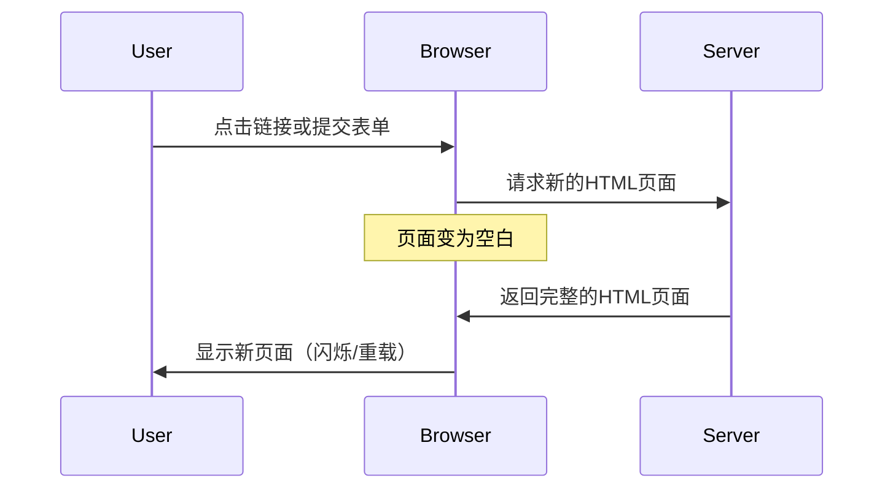


**这种方式为何显得笨重：**
- 每次点击都要重新构建整页
- 页面闪烁打断用户思考
- 你的网络反复下载相同的头部和底部资源
- 应用感觉更像操作文件柜而非真正软件

### 现代单页面应用（SPA）

AJAX（异步JavaScript和XML）彻底改变了这一范式。就像国际空间站的模块化设计，宇航员可以替换单独组件，而无需重建整座结构，AJAX允许我们更新网页指定部分而不重新加载全部。尽管名字提到了XML，我们如今主要使用JSON，但核心理念是不变的：只更新需要变动的部分。

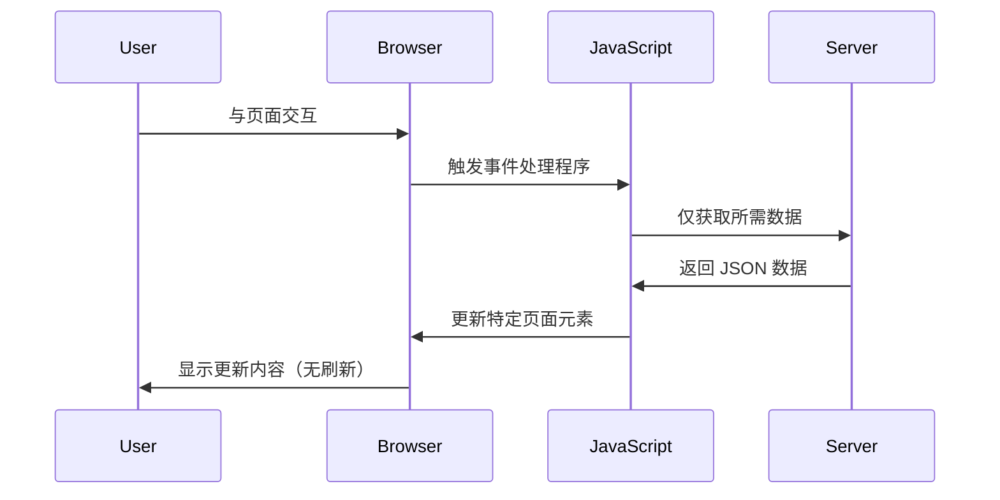


**为何SPA体验更佳：**
- 只更新实际变化部分（聪明吧？）
- 不再有突兀的中断，用户保持顺畅体验
- 数据传输减少，加载更迅速
- 一切感觉灵敏响应，就像手机上的应用

### 现代 Fetch API 的演进

现代浏览器提供了 [`Fetch` API](https://developer.mozilla.org/docs/Web/API/Fetch_API)，替代了旧的 [`XMLHttpRequest`](https://developer.mozilla.org/docs/Web/API/XMLHttpRequest/Using_XMLHttpRequest/)。就像电报与电子邮件的差别，Fetch API 使用 Promise 编写更清晰的异步代码，并天然支持 JSON。

| 特性 | XMLHttpRequest | Fetch API |
|---------|----------------|----------|
| **语法** | 复杂基于回调 | 清晰基于Promise |
| **JSON处理** | 需要手动解析 | 内置 `.json()` 方法 |
| **错误处理** | 错误信息有限 | 详尽的错误信息 |
| **现代支持** | 兼容旧版 | 支持ES6+ Promise和 async/await |

> 💡 **浏览器兼容性**：好消息——Fetch API 在所有现代浏览器中均可使用！如果想了解具体版本，[caniuse.com](https://caniuse.com/fetch) 上有完整兼容信息。
> 
**总结：**
- Chrome、Firefox、Safari 和 Edge 等主流浏览器支持良好（用户几乎都用这些）
- 仅IE需额外适配（说实话，是时候放弃IE了）
- 完美支持我们之后将使用的优雅 async/await 模式

### 实现用户登录和数据检索

现在让我们实现登录系统，将你的银行应用从静态展示转变为功能齐全的应用。就像安全军事设施中的认证协议，我们将验证用户凭证，然后提供其专属数据访问。

我们将步骤分解，先做基础认证，再加上数据获取功能。

#### 第1步：创建登录函数基础

打开 `app.js` 文件，添加一个新的 `login` 函数，负责用户认证：

```javascript
async function login() {
  const loginForm = document.getElementById('loginForm');
  const user = loginForm.user.value;
}
```

**解析：**
- `async` 关键字表明函数可能需要等待异步操作完成
- 通过ID获取表单元素（很简单）
- 提取用户输入的用户名
- 一个小技巧：你可以通过表单控制的 `name` 属性访问它们，无需额外调用 getElementById！

> 💡 **表单访问方式**：每个表单控件均可通过其在HTML中设置的 `name` 属性，作为表单元素的属性访问。这让读取表单数据变得干净且易读。

#### 第2步：创建账户数据获取函数

接下来创建获取账户数据的专用函数。这和你注册时的函数很像，但专注于获取数据：

```javascript
async function getAccount(user) {
  try {
    const response = await fetch('//localhost:5000/api/accounts/' + encodeURIComponent(user));
    return await response.json();
  } catch (error) {
    return { error: error.message || 'Unknown error' };
  }
}
```

**实现功能：**
- 使用现代的 `fetch` API 进行异步数据请求
- 构造带用户名参数的GET请求URL
- 利用 `encodeURIComponent()` 安全编码URL中的特殊字符
- 将响应转换为JSON格式，方便操作数据
- 通过返回错误对象优雅处理异常，避免程序崩溃

> ⚠️ **安全提示**：`encodeURIComponent()` 函数用来处理URL中的特殊字符。就像海军通信中的编码系统，确保你的信息完整正确地传达，避免诸如“#”或“&”等字符被误解。
> 
**意义：**
- 防止特殊字符破坏URL格式
- 防范URL操控攻击
- 确保服务器准确收到数据
- 遵守安全编码规范

#### 理解 HTTP GET 请求

这点你可能不知道：使用 `fetch` 时，如果不带额外选项，默认就是发送 [`GET`](https://developer.mozilla.org/docs/Web/HTTP/Methods/GET) 请求。这正适合我们的场景——向服务器询问用户的账户信息。

把GET请求想象成礼貌地向图书馆借书——你请求看到已存在的东西。POST请求（我们注册用的）更像是提交一本新书加入馆藏。

| GET 请求 | POST 请求 |
|-------------|-------------|
| **用途** | 获取已有数据 | 向服务器提交新数据 |
| **参数** | URL路径/查询字符串 | 请求体内 |
| **缓存** | 可被浏览器缓存 | 通常不缓存 |
| **安全性** | URL/日志可见 | 隐藏于请求体 |

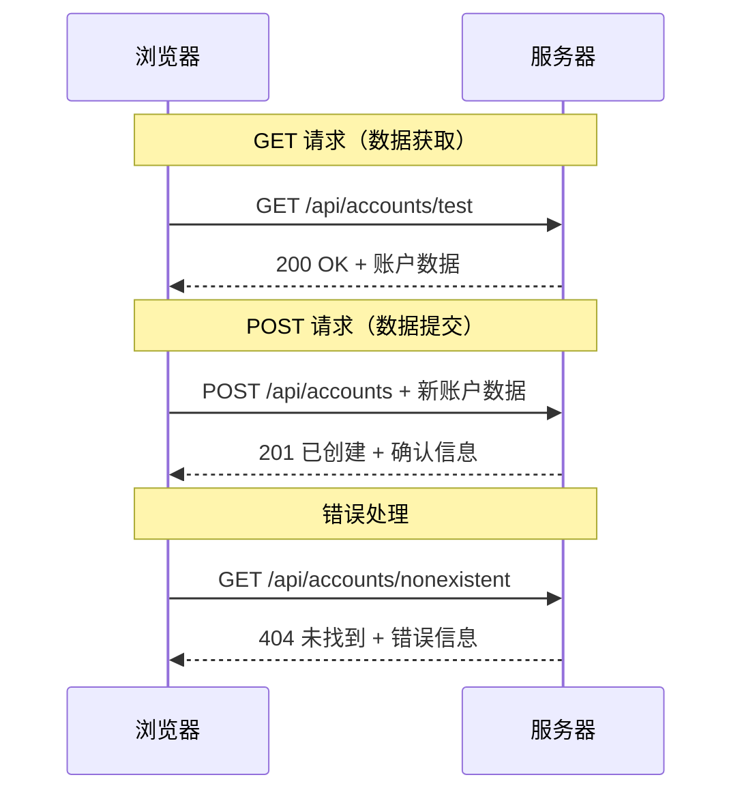
#### 第3步：将它们连接起来

现在进入令人满意的环节——将获取账户函数绑定到登录流程：

```javascript
async function login() {
  const loginForm = document.getElementById('loginForm');
  const user = loginForm.user.value;
  const data = await getAccount(user);

  if (data.error) {
    return console.log('loginError', data.error);
  }

  account = data;
  navigate('/dashboard');
}
```

函数执行流程清晰：
- 从表单输入提取用户名
- 向服务器请求该用户的账户数据
- 处理请求中可能出现的错误
- 成功时存储账户数据并跳转到仪表盘

> 🎯 **Async/Await 模式**：因为 `getAccount` 是异步的，我们使用`await`暂停执行直到服务器响应，避免继续执行时数据未定义。

#### 第4步：为账户数据创建存储空间

一旦加载了账户信息，应用需要记住它。可以把它想象成应用的短期记忆，保存当前用户数据。把这行代码加到 `app.js` 文件顶部：

```javascript
// 这保存当前用户的账户数据
let account = null;
```

**为何需要它：**
- 让账户数据在应用任何地方都能访问
- 初始为 `null` 表示“尚未登录”
- 登录或注册成功时更新内容
- 充当单一数据来源，避免登录状态混乱

#### 第5步：连接你的表单

现在把你写好的登录函数和HTML表单连起来，修改表单标签如下：

```html
<form id="loginForm" action="javascript:login()">
  <!-- Your existing form inputs -->
</form>
```

**这改动的作用：**
- 阻止表单默认的“整页重载”行为
- 改用你的自定义JavaScript函数执行
- 保持页面流畅、单页应用的感觉
- 完全掌控用户点击“登录”后的行为

#### 第6步：增强注册函数

为了保持一致，也更新你的 `register` 函数，使其存储账户数据并跳转到仪表盘：

```javascript
// 在您的注册函数末尾添加这些行
account = result;
navigate('/dashboard');
```

**该改进带来的好处：**
- 注册后无缝切换到仪表盘
- 登录和注册流程用户体验一致
- 注册成功后即可立即访问账户数据

#### 测试你的实现

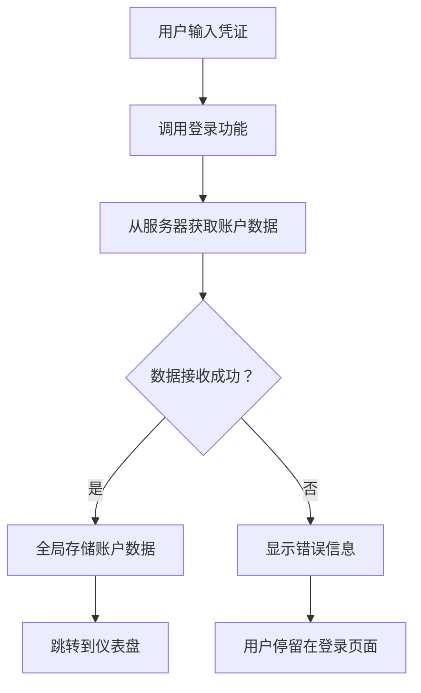
**现在动手试试：**
1. 创建新账户，确保流程正常
2. 用该账号登录测试
3. 打开浏览器控制台（F12），遇到问题查看错误
4. 确保登录成功后跳转到仪表盘

出现问题别慌！大多数错误是简单的拼写或忘了启动API服务器。

#### 关于跨源魔法的小提示

你可能好奇：“我的网页应用怎么和跑在不同端口的API服务器通信？”这个问题是每个web开发者都会遇到的。

> 🔒 **跨源安全**：浏览器强制执行“同源策略”防止未授权跨域通信。就像五角大楼的检查关卡，验证通信权限后才允许数据传输。
> 
**在我们的配置中：**
- 你的网页应用运行在 `localhost:3000`（开发服务器）
- API服务器运行在 `localhost:5000`（后端服务器）
- API服务器配备了明确授权网页应用通信的 [CORS 头信息](https://developer.mozilla.org/docs/Web/HTTP/CORS)

这种配置模拟了前后端通常分开运行的实际开发环境。

> 📚 **深入了解**：使用微软学习平台的这门全面课程深化API和数据获取知识 [使用 API 发现博物馆艺术](https://docs.microsoft.com/learn/modules/use-apis-discover-museum-art/?WT.mc_id=academic-77807-sagibbon)。

## 让数据在HTML中生动起来

接下来我们将通过 DOM 操作把获取到的数据展示给用户。就像暗房冲洗照片的过程，将不可见的数据变成用户可见可交互的内容。
DOM 操作是一种将静态网页转换为动态应用的技术，能够根据用户交互和服务器响应更新其内容。

### 选择合适的工具

在使用 JavaScript 更新 HTML 时，你有多种选择。把它们想象成工具箱里的不同工具——每个工具适合特定的工作：

| 方法 | 适用场景 | 何时使用 | 安全级别 |
|--------|---------------------|----------------|--------------|
| `textContent` | 安全地显示用户数据 | 任何显示文本的场合 | ✅ 非常稳定 |
| `createElement()` + `append()` | 构建复杂布局 | 创建新部分/列表 | ✅ 万无一失 |
| `innerHTML` | 设置 HTML 内容 | ⚠️ 尽量避免使用 | ❌ 风险较高 |

#### 安全显示文本的方法：textContent

[`textContent`](https://developer.mozilla.org/docs/Web/API/Node/textContent) 属性是显示用户数据时的好帮手。它就像网页的保镖——不允许任何有害内容通过：

```javascript
// 安全、可靠的更新文本方式
const balanceElement = document.getElementById('balance');
balanceElement.textContent = account.balance;
```

**textContent 的优点：**
- 将所有内容视为纯文本（防止脚本执行）
- 自动清除现有内容
- 对简单文本更新效率高
- 内置防护，防范恶意内容

#### 创建动态 HTML 元素

针对更复杂的内容，可以将 [`document.createElement()`](https://developer.mozilla.org/docs/Web/API/Document/createElement) 与 [`append()`](https://developer.mozilla.org/docs/Web/API/ParentNode/append) 方法结合使用：

```javascript
// 创建新元素的安全方法
const transactionItem = document.createElement('div');
transactionItem.className = 'transaction-item';
transactionItem.textContent = `${transaction.date}: ${transaction.description}`;
container.append(transactionItem);
```

**这种方法的理解：**
- **程序化创建**新的 DOM 元素
- **完全控制**元素属性和内容
- **支持**构建复杂的嵌套元素结构
- **保障**安全，结构与内容分离

> ⚠️ **安全提示**：虽然 [`innerHTML`](https://developer.mozilla.org/docs/Web/API/Element/innerHTML) 在许多教程中出现，但它会执行嵌入的脚本。类似 CERN 安全协议防止未经授权的代码执行，使用 `textContent` 和 `createElement` 是更安全的替代方案。
> 
**innerHTML 的风险：**
- 会执行用户数据中的 `<script>` 标签
- 容易遭受代码注入攻击
- 产生潜在安全漏洞
- 我们使用的安全替代方案功能等同

### 让错误信息对用户友好

当前登录错误只显示在浏览器控制台，用户无法看到。就像飞行员内部诊断和乘客信息系统之间的区别，我们需要通过合适的渠道向用户传达重要信息。

实现可见的错误消息能够让用户立即了解出了什么问题以及如何继续操作。

#### 第一步：添加错误消息显示区域

先在你的 HTML 里为错误消息提供一个位置。放在登录按钮之前，这样用户会自然看到它：

```html
<!-- This is where error messages will appear -->
<div id="loginError" role="alert"></div>
<button>Login</button>
```

**这里的作用：**
- 创建一个空容器，默认隐藏，只有需要时显示
- 定位于用户点击“登录”后关注的区域
- `role="alert"` 对屏幕阅读器来说是个贴心提示，告诉辅助技术“这很重要！”
- 独特的 `id` 让 JavaScript 操作起来方便

#### 第二步：创建实用辅助函数

写个小工具函数，用来更新任何元素的文本内容。这种“写一次，到处用”的函数能帮你节省不少时间：

```javascript
function updateElement(id, text) {
  const element = document.getElementById(id);
  element.textContent = text;
}
```

**函数优势：**
- 简单接口，只需元素 ID 和文本
- 安全定位并更新 DOM 元素
- 可复用，减少代码重复
- 保障更新行为一致性

#### 第三步：让错误消息用户可见

现在将隐藏的控制台信息替换为用户可见的错误提示。更新登录函数：

```javascript
// 不仅仅是记录到控制台，而是向用户显示出了什么问题
if (data.error) {
  return updateElement('loginError', data.error);
}
```

**这点小改动却意义重大：**
- 错误消息直观地出现在用户视线中
- 不再神秘地静默失败
- 用户能快速得到反馈和指导
- 你的应用看起来更专业、贴心

现在测试输入无效账号时，页面上会出现有用的错误提示！


#### 第四步：兼顾无障碍访问

`role="alert"` 的妙用不仅仅是装饰！这个小属性创建了所谓的[动态区域](https://developer.mozilla.org/docs/Web/Accessibility/ARIA/ARIA_Live_Regions)，为屏幕阅读器立即播报内容变化：

```html
<div id="loginError" role="alert"></div>
```

**这很重要，因为：**
- 屏幕阅读器用户能第一时间听到错误消息
- 无论使用何种导航方式，所有人都能获得同样的重要信息
- 简单做法即可让应用对更多人友好
- 展现你对包容性设计的重视

这样的细节让优秀开发者脱颖而出！

### 🎯 教学小结：身份验证模式

**暂停思考**：你刚刚实现了完整的身份验证流程。这是网页开发的基础模式。

**快速自我检测**：
- 你能解释为什么使用 async/await 处理 API 请求吗？
- 如果忘记调用 `encodeURIComponent()` 会发生什么？
- 我们的错误处理如何提升用户体验？

**现实联系**：这里学到的模式（异步数据获取、错误处理、用户反馈）应用于所有主流网页应用，从社交平台到电子商务。你正在打造生产级技能！

**挑战问题**：如何修改此身份验证系统以支持多用户角色（如客户、管理员、出纳员）？考虑数据结构和 UI 需要做哪些改动。

#### 第五步：将同样的模式应用于注册表单

为保持一致，在注册页面实现相同的错误处理：

1. **添加**错误显示元素到注册 HTML：
```html
<div id="registerError" role="alert"></div>
```

2. **更新**注册函数，采用相同的错误显示模式：
```javascript
if (data.error) {
  return updateElement('registerError', data.error);
}
```

**一致错误处理的好处：**
- **提供**统一的用户体验
- **降低**认知负担——使用熟悉的模式
- **简化**维护——代码可复用
- **保证**全应用符合无障碍标准

## 创建动态仪表盘

接下来，我们将把静态仪表盘变成动态界面，展示真实账户数据。就像打印的航班时刻表和机场实时出发牌的区别，我们将实现实时响应的信息显示。

利用已学的 DOM 操控技巧，打造一个自动更新当前账户信息的仪表盘。

### 了解你的数据

开始构建前，先看看服务器成功登录后返回的数据样本：

```json
{
  "user": "test",
  "currency": "$",
  "description": "Test account",
  "balance": 75,
  "transactions": [
    { "id": "1", "date": "2020-10-01", "object": "Pocket money", "amount": 50 },
    { "id": "2", "date": "2020-10-03", "object": "Book", "amount": -10 },
    { "id": "3", "date": "2020-10-04", "object": "Sandwich", "amount": -5 }
  ]
}
```

**数据结构提供：**
- **`user`**：为个性化体验提供支持（“欢迎回来，Sarah！”）
- **`currency`**：确保金额显示正确
- **`description`**：账户名称，友好显示
- **`balance`**：重要的当前余额
- **`transactions`**：完整交易历史及详情

这是构建专业银行仪表盘所需的一切！

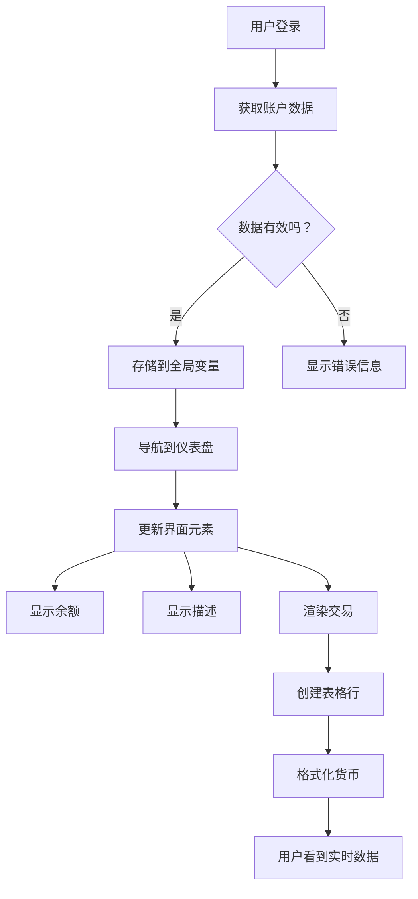
> 💡 **技巧提示**：想立即体验仪表盘效果？用用户名 `test` 登录——该账户预装示例数据，让你无需先创建交易即可看到完整功能。
> 
**测试账户的优势：**
- 包含真实样例数据
- 方便查看交易列表展示
- 适合测试仪表盘功能
- 免去手动创建仿真数据的麻烦

### 创建仪表盘展示元素

我们一步步构建仪表盘界面，先从账户摘要信息入手，再扩展到更复杂的交易列表功能。

#### 第一步：更新 HTML 结构

首先，用动态占位元素替换静态“余额”部分，让 JavaScript 能填充数据：

```html
<section>
  Balance: <span id="balance"></span><span id="currency"></span>
</section>
```

接着，添加账户描述部分。这里作为仪表盘内容的标题，使用语义化 HTML：

```html
<h2 id="description"></h2>
```

**HTML 结构解读：**
- **独立**使用 `<span>` 元素分别显示余额和货币，便于单独控制
- **为每个元素**赋予独特 ID，方便 JS 定位
- **符合语义化**，使用 `<h2>` 表示账户描述标题
- **为屏幕阅读器和 SEO**构建合理层次结构

> ✅ **无障碍提示**：账户描述是仪表盘内容的标题，因此用语义标题标记。了解更多关于[标题结构](https://www.nomensa.com/blog/2017/how-structure-headings-web-accessibility)对无障碍的影响。你的页面中还能找到哪些元素适合用标题标签？

#### 第二步：编写仪表盘更新函数

现在写个函数，用真实账户数据填充仪表盘：

```javascript
function updateDashboard() {
  if (!account) {
    return navigate('/login');
  }

  updateElement('description', account.description);
  updateElement('balance', account.balance.toFixed(2));
  updateElement('currency', account.currency);
}
```

**函数步骤解析：**
- **验证**账户数据存在
- **未登录用户**自动重定向到登录页
- **使用**可复用的 `updateElement` 函数更新账户描述
- **格式化**余额，确保两位小数显示
- **显示**正确的货币符号

> 💰 **金额格式化**：[`toFixed(2)`](https://developer.mozilla.org/docs/Web/JavaScript/Reference/Global_Objects/Number/toFixed) 方法真是救星！它保证显示为真实货币格式——“75.00”而非“75”，用户会更习惯。

#### 第三步：确保仪表盘实时更新

为保证每次访问仪表盘时数据自动刷新，需要挂载到你的导航系统。如果完成了[第1课的作业](../1-template-route/assignment.md)，应该很熟悉。如果没有，也没关系——只需：

将以下添加到 `updateRoute()` 函数末尾：

```javascript
if (typeof route.init === 'function') {
  route.init();
}
```

再在路由配置里添加仪表盘初始化调用：

```javascript
const routes = {
  '/login': { templateId: 'login' },
  '/dashboard': { templateId: 'dashboard', init: updateDashboard }
};
```

**这套巧妙机制做了什么：**
- 检查当前路由是否需要特殊初始化代码
- 路由加载时自动执行初始化
- 确保仪表盘总是显示最新数据
- 保持路由逻辑清晰有序

#### 测试仪表盘

实现后测试：

1. **使用测试账户登录**
2. **确认跳转到仪表盘**
3. **检查账户描述、余额、货币显示正确**
4. **尝试注销再登录**，确认数据刷新正常

你的仪表盘现在能显示基于登录用户实时更新的动态账户信息了！

## 使用模板构建智能交易列表

无需手动为每笔交易写 HTML，我们用模板来自动生成格式统一的内容。就像航天器制造中的标准化零部件，模板确保每行交易结构一致、样式统一。

这种技术可高效扩展，支持从几笔到上千笔交易，保持性能和展示一致。

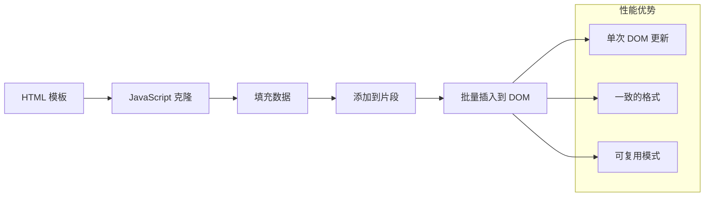
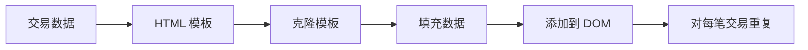
### 第一步：创建交易行模板

先在 HTML `<body>` 中添加可重用的交易行模板：

```html
<template id="transaction">
  <tr>
    <td></td>
    <td></td>
    <td></td>
  </tr>
</template>
```

**HTML 模板解析：**
- **定义**单个表格行结构
- **默认隐藏**，仅克隆填充后显示
- **包含**日期、描述、金额三个单元格
- **提供**统一展示样式的复用模式

### 第二步：准备表格动态内容区域

为表格主体添加 `id`，方便 JavaScript 定位：

```html
<tbody id="transactions"></tbody>
```

**作用：**
- **明确插入交易行的位置**
- **将表格结构与动态内容分离**
- **便于清除并重新填充交易数据**

### 第三步：构建交易行工厂函数

写函数将交易数据转为 HTML 元素：

```javascript
function createTransactionRow(transaction) {
  const template = document.getElementById('transaction');
  const transactionRow = template.content.cloneNode(true);
  const tr = transactionRow.querySelector('tr');
  tr.children[0].textContent = transaction.date;
  tr.children[1].textContent = transaction.object;
  tr.children[2].textContent = transaction.amount.toFixed(2);
  return transactionRow;
}
```

**工厂函数拆解：**
- **根据 ID 获取模板元素**
- **克隆模板内容用于操作**
- **选择克隆内容中的表格行**
- **填充每个单元格交易数据**
- **格式化金额，显示正确小数**
- **返回完整行，准备插入**

### 第四步：高效生成多行交易记录

在 `updateDashboard()` 函数添加以下代码，展示所有交易：

```javascript
const transactionsRows = document.createDocumentFragment();
for (const transaction of account.transactions) {
  const transactionRow = createTransactionRow(transaction);
  transactionsRows.appendChild(transactionRow);
}
updateElement('transactions', transactionsRows);
```

**高效实现说明：**
- **创建文档碎片，一次批量处理 DOM**
- **遍历账户所有交易数据**
- **每笔交易调用工厂函数生成行**
- **将所有行收集到碎片中**
- **一次性插入 DOM，减少多次操作开销**
> ⚡ **性能优化**：[`document.createDocumentFragment()`](https://developer.mozilla.org/docs/Web/API/Document/createDocumentFragment) 就像波音组装过程——组件在主生产线外准备好，然后作为一个整体安装。通过执行单次插入而非多次独立操作，这种批处理方法最大程度减少了 DOM 重排。

### 第 5 步：增强支持混合内容的更新函数

你的 `updateElement()` 函数当前只处理文本内容。请将其更新为同时支持文本和 DOM 节点：

```javascript
function updateElement(id, textOrNode) {
  const element = document.getElementById(id);
  element.textContent = ''; // 移除所有子元素
  element.append(textOrNode);
}
```

**此次更新的关键改进：**
- **清除** 现有内容后再添加新内容
- **接受** 文本字符串或 DOM 节点作为参数
- **使用** [`append()`](https://developer.mozilla.org/docs/Web/API/ParentNode/append) 方法以增强灵活性
- **保持** 与现有基于文本的用法向后兼容

### 试用你的仪表盘

关键时刻到了！让我们看看你的动态仪表盘实际运行效果：

1. 使用 `test` 账号登录（已有示例数据可用）
2. 导航到你的仪表盘
3. 检查交易行是否正确显示且格式合理
4. 确认日期、描述和金额显示正常

如果一切正常，你应该会在仪表盘看到功能完整的交易列表！🎉

**你已完成：**
- 构建一个可扩展到任意数据量的仪表盘
- 创建可复用的模板以保持格式一致
- 实现高效的 DOM 操作技术
- 开发出媲美生产级银行应用的功能

你已经成功将静态网页转变为动态 Web 应用。

### 🎯 教学检查：动态内容生成

**架构理解**：你实现了一个复杂的数据到 UI 流程，模仿了 React、Vue 和 Angular 等框架的设计模式。

**掌握的关键概念**：
- **基于模板的渲染**：创建可复用 UI 组件
- **文档片段**：优化 DOM 性能
- **安全的 DOM 操作**：防止安全漏洞
- **数据转换**：将服务器数据转为用户界面

**行业关联**：这些技术构成了现代前端框架的基础。React 的虚拟 DOM、Vue 的模板系统以及 Angular 的组件架构都建立在这些核心概念上。

**反思问题**：你会如何扩展该系统以支持实时更新（例如新交易自动出现）？考虑 WebSockets 或服务器发送事件（Server-Sent Events）。

---

## 📈 你的数据管理大师时间线

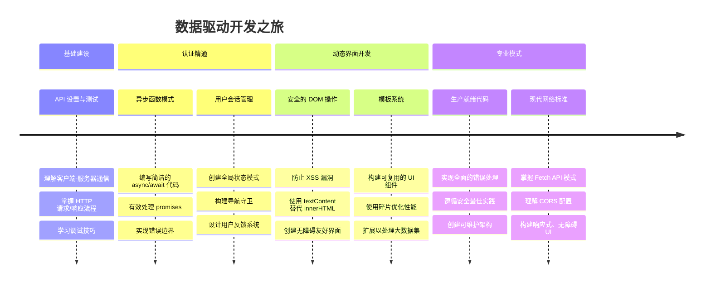
**🎓 毕业里程碑**：你已成功构建了使用现代 JavaScript 模式的完整数据驱动 Web 应用。这些技能可直接应用于 React、Vue 或 Angular 等框架。

**🔄 下一阶段能力**：
- 准备探索基于这些概念的前端框架
- 准备实现基于 WebSockets 的实时功能
- 具备构建支持离线功能的渐进式 Web 应用（PWA）的能力
- 打下高级状态管理模式学习的基础

## GitHub Copilot Agent 挑战 🚀

使用 Agent 模式完成以下挑战：

**描述：** 通过实现交易搜索和筛选功能增强银行应用，该功能允许用户按日期范围、金额或描述查找特定交易。

**提示：** 创建银行应用的搜索功能，包括：1）带有日期范围（起止）、最小/最大金额及交易描述关键词输入框的搜索表单，2）基于搜索条件筛选 account.transactions 数组的 `filterTransactions()` 函数，3）更新 `updateDashboard()` 函数以显示筛选结果，4）添加“清除筛选”按钮以重置视图。使用现代 JavaScript 的 `filter()` 等数组方法，并处理空搜索条件的边界情况。

在此了解更多关于[agent 模式](https://code.visualstudio.com/blogs/2025/02/24/introducing-copilot-agent-mode)。

## 🚀 挑战

准备好让你的银行应用更上一层楼了吗？让它看起来和用起来都令人期待。这里有一些灵感点子：

**让它美观**：添加 CSS 样式，将你的功能仪表盘变成视觉吸引的页面。设计要干净、间距合理，甚至可以添加些微动画。

**让它响应式**：尝试使用[媒体查询](https://developer.mozilla.org/docs/Web/CSS/Media_Queries)创建一个[响应式设计](https://developer.mozilla.org/docs/Web/Progressive_web_apps/Responsive/responsive_design_building_blocks)，适配手机、平板和桌面。你的用户会感激你的！

**增添趣味**：考虑为交易颜色编码（收入用绿色，支出用红色）、添加图标，或制作悬停效果，让界面更具互动感。

这是美化后仪表盘的示例：


不必完全照搬——以此为灵感，打造属于你自己的风格！

## 课后测验

[课后测验](https://ff-quizzes.netlify.app/web/quiz/46)

## 作业

[重构并注释你的代码](assignment.md)

---

<!-- CO-OP TRANSLATOR DISCLAIMER START -->
**免责声明**：  
本文件由人工智能翻译服务 [Co-op Translator](https://github.com/Azure/co-op-translator) 生成。虽然我们力求准确，但请注意自动翻译可能存在错误或不准确之处。原始文件的母语版本应被视为权威来源。对于重要信息，建议使用专业人工翻译。对于因使用本翻译而产生的任何误解或误读，我们不承担任何责任。
<!-- CO-OP TRANSLATOR DISCLAIMER END -->