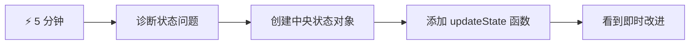
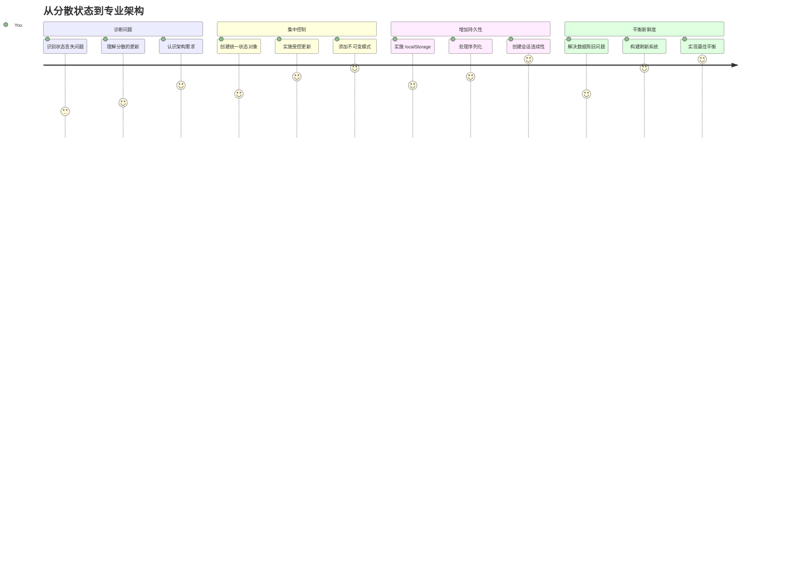
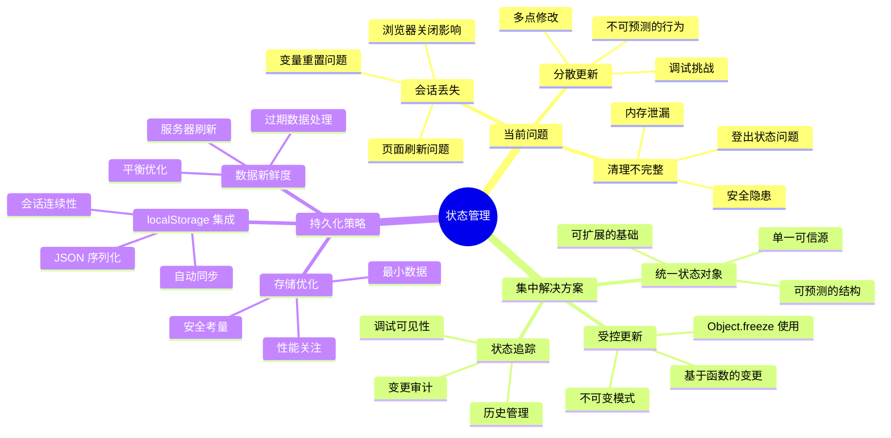
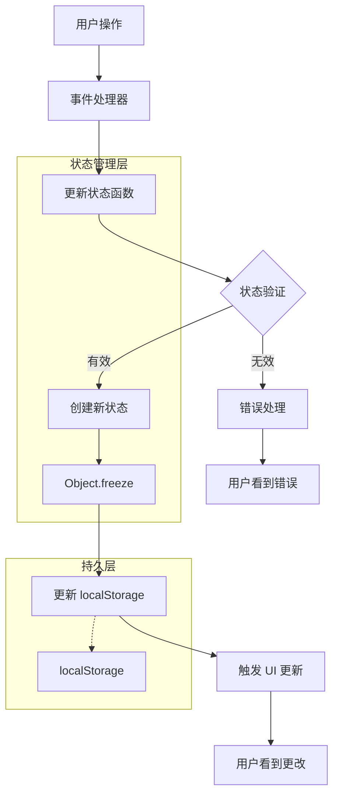
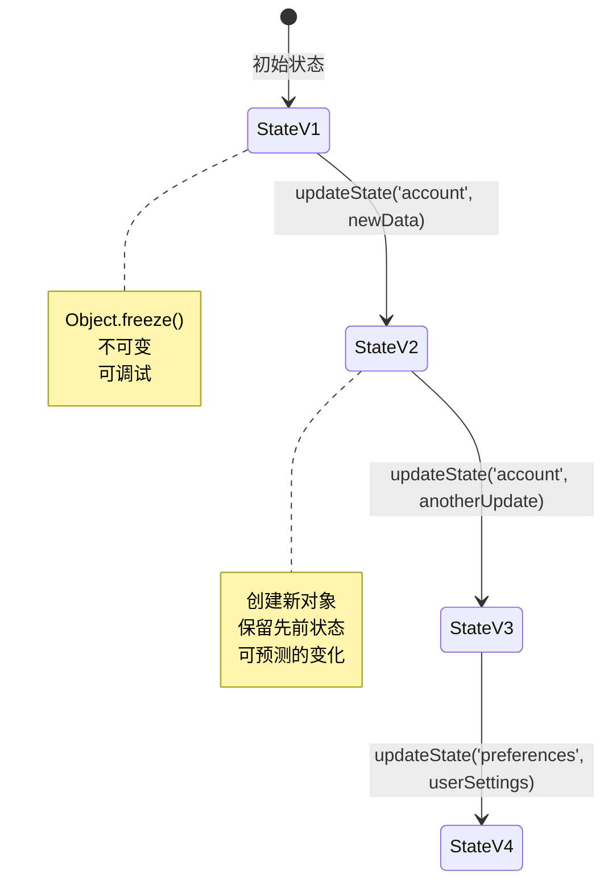
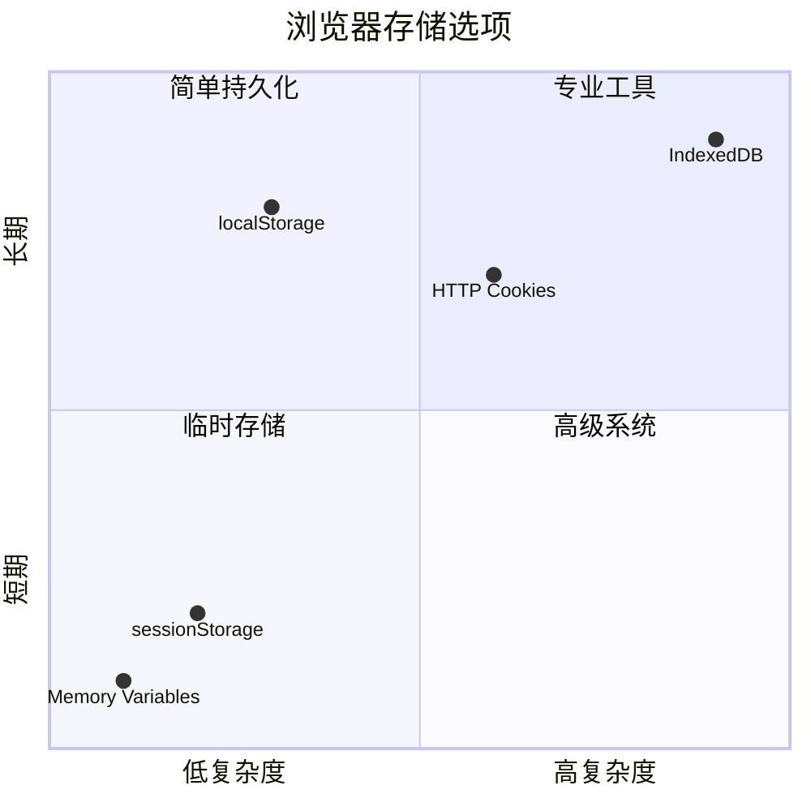
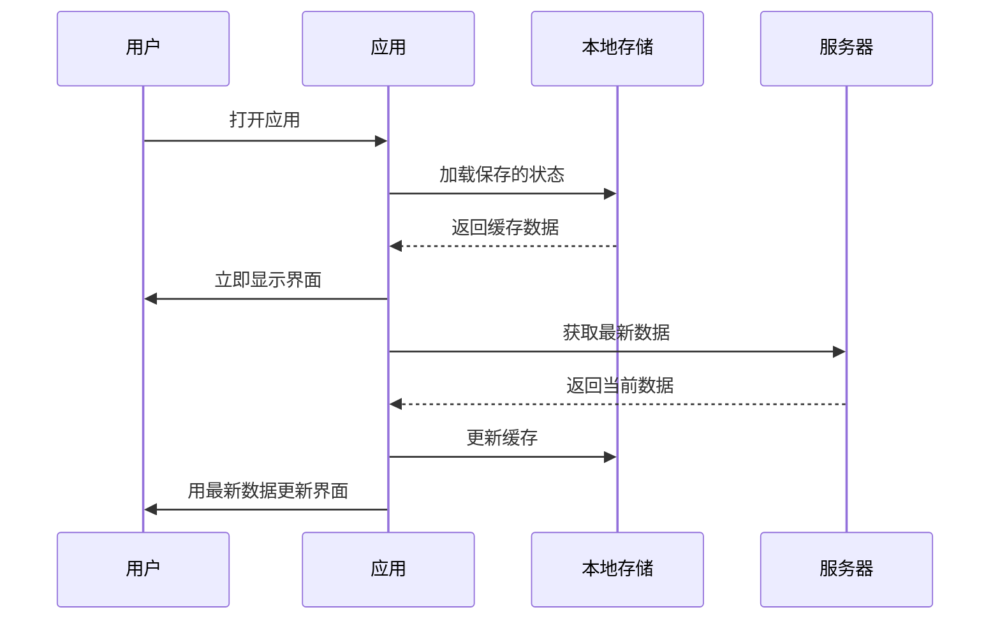
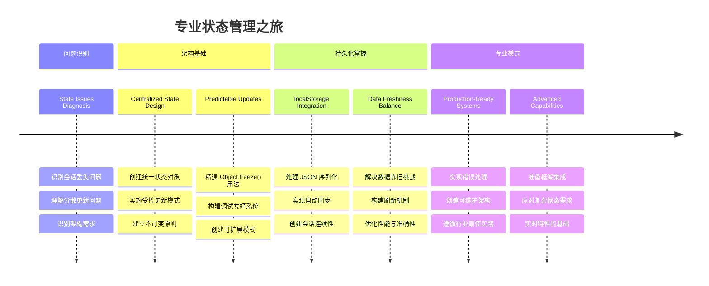

<!--
CO_OP_TRANSLATOR_METADATA:
{
  "original_hash": "b807b09df716dc48a2b750835bf8e933",
  "translation_date": "2026-01-06T11:45:06+00:00",
  "source_file": "7-bank-project/4-state-management/README.md",
  "language_code": "zh"
}
-->
# 构建银行应用 第4部分：状态管理概念

## ⚡ 你可以在接下来的5分钟内完成的事情

**忙碌开发者快速入门路径**


- **第1分钟**：测试当前状态问题 - 登录，刷新页面，观察是否登出
- **第2分钟**：将 `let account = null` 替换为 `let state = { account: null }`
- **第3分钟**：创建一个简单的 `updateState()` 函数以实现受控更新
- **第4分钟**：更新一个函数以使用新的模式
- **第5分钟**：测试改进后的可预测性和调试能力

**快速诊断测试**：
```javascript
// 之前：分散状态
let account = null; // 刷新后丢失！

// 之后：集中状态
let state = Object.freeze({ account: null }); // 可控且可追踪！
```

**为什么这很重要**：在5分钟内，你将体验从混乱的状态管理转变为可预测、易调试的模式。这是让复杂应用易于维护的基础。

## 🗺️ 你通过状态管理大师之路的学习旅程


**你的旅程目标**：课程结束时，你将构建一个专业级别的状态管理系统，处理持久化、数据新鲜度和可预测的更新——这些模式同样用于生产应用。

## 课程前测验

[课程前测验](https://ff-quizzes.netlify.app/web/quiz/47)

## 介绍

状态管理就像旅行者号航天器的导航系统——当一切顺利时，你几乎感知不到它的存在。但当问题发生时，它决定了你是能够抵达星际空间，还是在宇宙虚无中迷失。在网页开发中，状态代表着应用需要记住的一切：用户登录状态、表单数据、导航历史和临时界面状态。

随着你的银行应用从简单登录表单发展到更复杂的应用，你可能遇到了一些常见挑战。刷新页面后用户会意外登出。关闭浏览器后所有进度丢失。调试问题时，你需要在多个以不同方式修改同一数据的函数中穿梭。

这并非编码不佳的表现——而是应用达到一定复杂度时自然出现的痛点。每个开发者都会在应用从“概念验证”转向“生产就绪”过程中遇到这些问题。

在本课中，我们将实现一个集中式状态管理系统，把你的银行应用变成一个可靠、专业的应用。你将学习如何可预测地管理数据流，适当持久化用户会话，并创造现代网页应用所需的流畅用户体验。

## 先决条件

在深入状态管理概念之前，你需要正确设置开发环境并搭建银行应用的基础。本课直接构建在本系列前几部分的概念和代码上。

请确保在继续前准备好以下内容：

**必备设置：**
- 完成 [数据获取课程](../3-data/README.md) —— 应用应能成功加载并显示账户数据
- 在系统上安装 [Node.js](https://nodejs.org) 用于运行后端API
- 本地启动 [服务器API](../api/README.md) 以处理账户数据操作

**环境测试：**

通过终端执行以下命令确保API服务器正确运行：

```sh
curl http://localhost:5000/api
# -> 应该返回结果 "Bank API v1.0.0"
```

**此命令作用说明：**
- **发送** GET请求到本地API服务器
- **测试**连接，验证服务器响应
- **返回**如果一切正常则返回API版本信息

## 🧠 状态管理架构概览


**核心原则**：专业状态管理在可预测性、持久性和性能之间取得平衡，打造可靠的用户体验，能从简单交互扩展到复杂应用工作流。

---

## 诊断当前状态问题

就像夏洛克·福尔摩斯检查犯罪现场一样，我们需要了解当前实现中到底发生了什么，才能解决用户会话消失的疑团。

让我们做一个简单实验，揭示底层的状态管理难题：

**🧪 尝试这个诊断测试：**
1. 登录银行应用并进入仪表盘
2. 刷新浏览器页面
3. 观察登录状态发生了什么

如果你被重定向回登录界面，你就发现了经典的状态持久性问题。这种行为发生是因为我们当前实现将用户数据存储在随着页面加载而重置的JavaScript变量中。

**当前实现的问题：**

来自我们[前一课](../3-data/README.md)的简单 `account` 变量带来了三个重大问题，这些问题影响用户体验和代码可维护性：

| 问题 | 技术原因 | 用户影响 |
|---------|--------|----------------|
| **会话丢失** | 页面刷新清空JavaScript变量 | 用户需频繁重新认证 |
| **更新分散** | 多个函数直接修改状态 | 调试越来越困难 |
| **清理不完全** | 登出未清除所有状态引用 | 可能存在安全和隐私风险 |

**架构挑战：**

就像泰坦尼克号的隔舱设计看似坚固，但多舱同时进水时却失效一样，逐个修复这些问题无法解决根本的架构问题。我们需要一个全面的状态管理方案。

> 💡 **我们真正想达成的是什么？**

[状态管理](https://en.wikipedia.org/wiki/State_management)其实解决两个基本难题：

1. **我的数据在哪？**：跟踪我们拥有什么信息及其来源
2. **所有人都保持同步吗？**：确保用户看到的内容和实际状态一致

**我们的行动计划：**

我们将创建一个**集中式状态管理**系统。把它想象成一个非常有条理的人掌管所有重要事务：



**理解这个数据流：**
- **集中**所有应用状态于一处
- **通过可控函数**路由所有状态更改
- **确保**用户界面与当前状态同步
- **提供**清晰、可预测的数据管理模式

> 💡 **专业洞见**：本课聚焦核心概念。对于复杂应用，像 [Redux](https://redux.js.org) 这样库提供更高级的状态管理功能。理解这些核心原则将助你掌握任何状态管理库。

> ⚠️ **高级主题**：我们不会覆盖由状态变化自动触发UI更新的内容，因为这涉及[响应式编程](https://en.wikipedia.org/wiki/Reactive_programming)概念。把它视为你学习旅程的优秀下一步！

### 任务：集中状态结构

让我们开始将分散的状态管理转变为集中管理。第一步为后续所有改进奠定基础。

**步骤1：创建集中状态对象**

替换简单的 `account` 声明：

```js
let account = null;
```

用结构化的状态对象：

```js
let state = {
  account: null
};
```

**此变更的重要性：**
- **集中**所有应用数据于一处
- **为后续添加更多状态属性**做准备
- **划定状态与其他变量的清晰边界**
- **建立**一个可扩展的模式，随着应用增长而增长

**步骤2：更新状态访问模式**

更新函数以使用新的状态结构：

**在 `register()` 和 `login()` 函数中**，替换：
```js
account = ...
```

为：
```js
state.account = ...
```

**在 `updateDashboard()` 函数中**，顶部添加这一行：
```js
const account = state.account;
```

**这些更新带来的效果：**
- **保持**现有功能，结构更清晰
- **为更复杂的状态管理做好准备**
- **创建**访问状态数据的一致性模式
- **为集中状态更新奠定基础**

> 💡 **注意**：这次重构并未立即解决我们的问题，但它为接下来的强大改进创造了必要的基础！

### 🎯 教学检查点：集中原则

**暂停并思考**：你刚实现了集中状态管理的基础。这是关键的架构决策。

**快速自测**：
- 你能解释为什么将状态集中到一个对象优于分散变量吗？
- 如果忘记更新某个函数以使用 `state.account` 会怎样？
- 这种模式如何为更高级功能准备代码？

**现实联系**：你学到的集中模式是现代框架如Redux、Vuex和React Context的基础。你正在构建同样的架构思维。

**挑战问题**：如果你需要将用户偏好（主题、语言）添加到应用状态，该放哪里？这如何扩展？

## 实现受控状态更新

有了集中状态，下一步是建立受控的数据修改机制。此方法确保状态改变可预测，且调试更便捷。

该核心原则类似空中交通管制：不允许多个函数独立修改状态，而是将所有更改通过单个受控函数进行。此模式清晰掌控何时及如何发生数据变化。

**不可变状态管理：**

我们将把 `state` 对象视作[*不可变*](https://en.wikipedia.org/wiki/Immutable_object)的——不直接修改它。每次更改创建一个包含更新数据的新状态对象。

这种方式相比直接修改可能初看低效，但对调试、测试和维护应用可预测性极具优势。

**不可变状态管理优势：**

| 优势 | 描述 | 影响 |
|---------|-------------|--------|
| **可预测性** | 仅通过受控函数发生更改 | 更易调试和测试 |
| **记录历史** | 每次变更创建新对象 | 支持撤销/重做功能 |
| **副作用防范** | 无意外修改 | 防止神秘bug |
| **性能优化** | 易于检测状态变化 | 支持高效UI更新 |

**JavaScript中通过 `Object.freeze()` 实现不可变：**

JavaScript 提供 [`Object.freeze()`](https://developer.mozilla.org/docs/Web/JavaScript/Reference/Global_Objects/Object/freeze) 防止对象被修改：

```js
const immutableState = Object.freeze({ account: userData });
// 任何尝试修改 immutableState 的操作都会抛出错误
```

**这段代码效果分析：**
- **防止**直接属性赋值或删除
- **修改尝试**时抛出异常
- **确保**状态更改必须通过受控函数
- **创建**状态更新的清晰约定

> 💡 **深入理解**：阅读 [MDN文档](https://developer.mozilla.org/docs/Web/JavaScript/Reference/Global_Objects/Object/freeze#What_is_shallow_freeze) 了解*浅冻结*与*深冻结*的区别，这对复杂状态结构至关重要。


### 任务

让我们创建新的 `updateState()` 函数：

```js
function updateState(property, newData) {
  state = Object.freeze({
    ...state,
    [property]: newData
  });
}
```

此函数通过使用[*扩展运算符*](https://developer.mozilla.org/docs/Web/JavaScript/Reference/Operators/Spread_syntax#Spread_in_object_literals)复制之前的状态数据，然后用[括号语法](https://developer.mozilla.org/docs/Web/JavaScript/Guide/Working_with_Objects#Objects_and_properties) `[property]` 覆盖特定属性的值。最后用 `Object.freeze()` 锁定对象防止修改。目前状态中仅存储 `account` 属性，但你可以用此方法添加任意多个状态属性。

同时我们更新 `state` 初始化，确保初始状态也被冻结：

```js
let state = Object.freeze({
  account: null
});
```

之后，在 `register` 函数中将 `state.account = result;` 替换为：

```js
updateState('account', result);
```

同样，`login` 函数中将 `state.account = data;` 替换为：

```js
updateState('account', data);
```

我们借机修复点击*登出*时账户数据未清除的问题。

创建新函数 `logout()`：

```js
function logout() {
  updateState('account', null);
  navigate('/login');
}
```

在 `updateDashboard()` 中，将重定向 `return navigate('/login');` 替换成 `return logout()`；

尝试注册新账号，登出，再登录，检查功能是否正常。

> 贴士：你可以在 `updateState()` 底部添加 `console.log(state)` 查看所有状态变化，同时打开浏览器开发工具控制台查看。

## 实现数据持久化

我们之前识别的会话丢失问题需要持久化解决方案，以保持用户状态穿越浏览器会话。这将应用从临时体验转变为可靠、专业工具。

考虑原子钟即使断电也能保持精确时间，因为它在非易失性存储中保存关键状态。同理，网页应用需要持久存储机制保留关键用户数据，支持跨会话和页面刷新。

**数据持久化策略性问题：**

在实现持久化前，考虑以下关键因素：

| 问题 | 银行应用场景 | 决策影响 |
|----------|-------------------|----------------|
| **数据敏感吗？** | 账户余额、交易历史 | 选择安全存储方法 |
| **它应持续多久？** | 登录状态与临时 UI 偏好 | 选择合适的存储时长 |
| **服务器是否需要它？** | 认证令牌与 UI 设置 | 判定共享需求 |

**浏览器存储选项：**

现代浏览器提供多种存储机制，每种机制设计用途不同：

**主要存储 API：**

1. **[`localStorage`](https://developer.mozilla.org/docs/Web/API/Window/localStorage)**：持久的[键/值存储](https://en.wikipedia.org/wiki/Key%E2%80%93value_database)  
   - **跨浏览器会话永久存储**数据  
   - **浏览器重启和电脑重启后依然保存**  
   - **限定于特定网站域名**  
   - **非常适合保存用户偏好和登录状态**  

2. **[`sessionStorage`](https://developer.mozilla.org/docs/Web/API/Window/sessionStorage)**：临时会话存储  
   - **在活动会话期间行为与 localStorage 一致**  
   - **浏览器标签关闭时自动清除**  
   - **适合不应持久保存的临时数据**  

3. **[HTTP Cookies](https://developer.mozilla.org/docs/Web/HTTP/Cookies)**：服务器共享存储  
   - **每次发起服务器请求时自动发送**  
   - **非常适合[身份验证](https://en.wikipedia.org/wiki/Authentication)令牌**  
   - **大小有限且可能影响性能**  

**数据序列化需求：**

`localStorage` 和 `sessionStorage` 仅存储[字符串](https://developer.mozilla.org/docs/Web/JavaScript/Reference/Global_Objects/String)：

```js
// 将对象转换为 JSON 字符串以便存储
const accountData = { user: 'john', balance: 150 };
localStorage.setItem('account', JSON.stringify(accountData));

// 在检索时将 JSON 字符串解析回对象
const savedAccount = JSON.parse(localStorage.getItem('account'));
```
  
**理解序列化：**  
- **使用 [`JSON.stringify()`](https://developer.mozilla.org/docs/Web/JavaScript/Reference/Global_Objects/JSON/stringify) 将 JavaScript 对象转换为 JSON 字符串**  
- **使用 [`JSON.parse()`](https://developer.mozilla.org/docs/Web/JavaScript/Reference/Global_Objects/JSON/parse) 从 JSON 重构对象**  
- **自动处理复杂的嵌套对象和数组**  
- **对函数、undefined 值和循环引用会失败**  

> 💡 **高级选项**：对于具有大量数据集的复杂离线应用，考虑使用[`IndexedDB` API](https://developer.mozilla.org/docs/Web/API/IndexedDB_API)。它提供完整的客户端数据库支持，但实现更复杂。


### 任务：实现 localStorage 持久化  

让我们实现持久化存储，使用户登录状态在显式注销前保持有效。我们将使用 `localStorage` 在浏览器会话间存储账户数据。

**第 1 步：定义存储配置**

```js
const storageKey = 'savedAccount';
```
  
**此常量的作用：**  
- **创建一个存储数据时的统一标识符**  
- **避免存储键引用时的拼写错误**  
- **便于日后修改存储键**  
- **遵循可维护代码的最佳实践**  

**第 2 步：添加自动持久化**

在 `updateState()` 函数末尾添加这行代码：

```js
localStorage.setItem(storageKey, JSON.stringify(state.account));
```
  
**这里发生的操作解析：**  
- **将账户对象转换为 JSON 字符串以便存储**  
- **使用统一存储键保存数据**  
- **每当状态更新时自动执行**  
- **确保存储数据始终与当前状态同步**  

> 💡 **架构优势**：由于我们通过 `updateState()` 集中管理所有状态更新，添加持久化仅需一行代码，体现了良好架构设计的威力！

**第 3 步：应用加载时恢复状态**

创建初始化函数以恢复已保存的数据：

```js
function init() {
  const savedAccount = localStorage.getItem(storageKey);
  if (savedAccount) {
    updateState('account', JSON.parse(savedAccount));
  }

  // 我们之前的初始化代码
  window.onpopstate = () => updateRoute();
  updateRoute();
}

init();
```
  
**理解初始化流程：**  
- **从 localStorage 取回之前保存的账户数据**  
- **将 JSON 字符串解析回 JavaScript 对象**  
- **通过受控更新函数更新状态**  
- **页面加载时自动恢复用户会话**  
- **在路由更新之前执行，确保状态可用**  

**第 4 步：优化默认路由**

更新默认路由以利用持久化：

在 `updateRoute()` 中替换：

```js
// 替换为：return navigate('/login');
return navigate('/dashboard');
```
  
**此更改的合理性：**  
- **有效利用新实现的持久化系统**  
- **允许仪表板组件处理认证检查**  
- **无已保存会话时自动重定向到登录页**  
- **创建更无缝的用户体验**  

**测试你的实现：**  

1. 登录你的银行应用  
2. 刷新浏览器页面  
3. 确认保持登录状态且停留在仪表板  
4. 关闭并重新打开浏览器  
5. 回到应用确认仍处于登录状态  

🎉 **成就解锁**：你已成功实现持久化状态管理！你的应用现在表现得像专业的网络应用。

### 🎯 教学检查点：持久化架构

**架构理解**：你已构建了一个平衡用户体验与数据管理复杂性的成熟持久化层。

**掌握的关键概念：**  
- **JSON 序列化**：将复杂对象转存为字符串  
- **自动同步**：状态变更触发持久化存储  
- **会话恢复**：应用能断点续传用户上下文  
- **集中持久化**：唯一更新函数处理所有存储  

**行业联系**：此持久化模式是渐进式网页应用（PWA）、离线优先应用及现代移动网页体验的基础。你已构建出生产级能力。

**反思问题**：如何调整系统来支持同一设备上的多个用户账户？考虑隐私和安全的影响。

## 平衡持久化与数据新鲜度

我们的持久化系统成功维持了用户会话，但引入了一个新挑战：数据陈旧。当多个用户或应用修改相同的服务器数据时，本地缓存信息可能过时。

这种情况类似维京航海者同时依赖存储的星图和当前天文观测。星图提供一致性，但航海者需要最新观测来调整变化。类似地，我们的应用需要既有持久的用户状态，也有当前的服务器数据。

**🧪 发现数据新鲜度问题：**

1. 使用 `test` 账户登录仪表板  
2. 在终端执行此命令模拟其他来源的事务：

```sh
curl --request POST \
     --header "Content-Type: application/json" \
     --data "{ \"date\": \"2020-07-24\", \"object\": \"Bought book\", \"amount\": -20 }" \
     http://localhost:5000/api/accounts/test/transactions
```
  
3. 刷新浏览器中的仪表板页面  
4. 观察是否显示了新交易  

**此测试说明了：**  
- **本地存储如何变得“陈旧”（过时）**  
- **模拟真实场景中数据在应用外的变更**  
- **揭示持久化与数据新鲜度之间的矛盾**  

**数据陈旧挑战：**

| 问题 | 原因 | 用户影响 |
|---------|-------|-------------|
| **数据陈旧** | localStorage 不会自动过期 | 用户看到过时信息 |
| **服务器变更** | 其他应用/用户修改相同数据 | 不同平台数据不一致 |
| **缓存与现实差异** | 本地缓存不匹配服务器状态 | 用户体验差且造成困惑 |

**解决策略：**

我们将实现“加载时刷新”模式，兼顾持久化带来的体验流畅和数据准确性。


### 任务：实现数据刷新系统  

构建一个系统，自动从服务器获取最新数据，同时保持持久状态管理带来的优势。

**第 1 步：创建账户数据更新函数**

```js
async function updateAccountData() {
  const account = state.account;
  if (!account) {
    return logout();
  }

  const data = await getAccount(account.user);
  if (data.error) {
    return logout();
  }

  updateState('account', data);
}
```
  
**函数逻辑解析：**  
- **检查当前是否有用户登录（state.account 是否存在）**  
- **无效会话时重定向到注销流程**  
- **使用已有的 `getAccount()` 函数从服务器获取最新账户数据**  
- **优雅处理服务器错误，注销无效会话**  
- **使用受控更新系统更新状态**  
- **通过 `updateState()` 触发本地存储自动持久化**  

**第 2 步：创建仪表板刷新处理函数**

```js
async function refresh() {
  await updateAccountData();
  updateDashboard();
}
```
  
**此刷新函数的作用：**  
- **协调数据刷新和 UI 更新流程**  
- **等待新数据加载后再更新显示**  
- **确保仪表板显示最新信息**  
- **保持数据管理与 UI 更新的清晰分离**  

**第 3 步：集成路由系统**

更新路由配置，实现自动刷新：

```js
const routes = {
  '/login': { templateId: 'login' },
  '/dashboard': { templateId: 'dashboard', init: refresh }
};
```
  
**集成工作原理：**  
- **每次仪表板路由加载时执行刷新函数**  
- **确保用户导航到仪表板时显示最新数据**  
- **保持现有路由结构，添加数据新鲜性**  
- **为路由特定初始化提供一致模式**  

**测试你的数据刷新系统：**  

1. 登录银行应用  
2. 执行前面用 curl 的命令创建新交易  
3. 刷新仪表板页面或离开再返回  
4. 确认新交易立即显示  

🎉 **完美平衡达成**：你的应用结合了持久状态的流畅体验与服务器数据的准确性！

## 📈 你的状态管理掌握路线


**🎓 毕业里程碑**：你已成功构建完整状态管理系统，借鉴 Redux、Vuex 等专业状态库的原理。此模式从简单应用到企业级应用均可扩展。

**🔄 下一步能力**：  
- 准备掌握状态管理框架（Redux、Zustand、Pinia）  
- 准备实现基于 WebSockets 的实时功能  
- 装备构建离线优先渐进式网页应用（PWA）  
- 扎实基础以支持状态机和观察者等高级模式  

## GitHub Copilot Agent 挑战 🚀

使用 Agent 模式完成以下挑战：

**描述：** 实现一个包含撤销/重做功能的完整状态管理系统，用于银行应用。该挑战将帮助你实践高级状态管理概念，包括状态历史跟踪、不可变更新以及用户界面同步。

**提示：** 创建增强状态管理系统，包括：1) 用于追踪先前状态的状态历史数组，2) 可回退和重做到之前状态的函数，3) 仪表板上的撤销/重做 UI 按钮，4) 最大历史容量为 10 条以防止内存问题，5) 用户注销时妥善清理历史。确保撤销/重做功能在账户余额变动时有效，并支持浏览器刷新持久化。

了解更多[agent 模式](https://code.visualstudio.com/blogs/2025/02/24/introducing-copilot-agent-mode)。

## 🚀 挑战：存储优化

你的实现当前已有效处理用户会话、数据刷新和状态管理。但考虑我们的现有方案是否在存储效率和功能间达成最优平衡。

正如国际象棋高手区分关键棋子和可舍弃卒子，有效状态管理需识别哪些数据必须持久，哪些应始终从服务器获取最新。

**优化分析：**

评估当前 localStorage 实现，思考以下策略性问题：  
- 维持用户认证所需的最少信息是什么？  
- 哪些数据变更频繁，以至于本地缓存意义不大？  
- 如何通过存储优化提升性能而不影响用户体验？  

这种架构分析区分了考虑功能与效率的资深开发者。

**实施策略：**  
- **确认必须持久化的关键数据（可能仅限用户身份信息）**  
- **调整 localStorage 只保存关键会话数据**  
- **确保每次访问仪表板都从服务器加载最新数据**  
- **测试优化方案确保用户体验无差异**  

**高级考虑：**  
- **比较存储完整账户数据与仅存储认证令牌的利弊**  
- **为团队成员文档化决策与理由**  

此挑战助你成为兼顾用户体验和应用效率的专业开发者。请尽情试验不同方案！

## 课后测验

[课后测验](https://ff-quizzes.netlify.app/web/quiz/48)

## 作业

[实现“添加交易”对话框](assignment.md)

完成作业后的示例效果：


---

<!-- CO-OP TRANSLATOR DISCLAIMER START -->
**免责声明**：  
本文件系使用 AI 翻译服务 [Co-op Translator](https://github.com/Azure/co-op-translator) 翻译而成。虽然我们尽力确保翻译的准确性，但请注意，自动翻译可能存在错误或不准确之处。原始语言的文件应视为权威来源。对于重要信息，建议使用专业人工翻译。我们不对因使用本翻译而产生的任何误解或误释承担责任。
<!-- CO-OP TRANSLATOR DISCLAIMER END -->