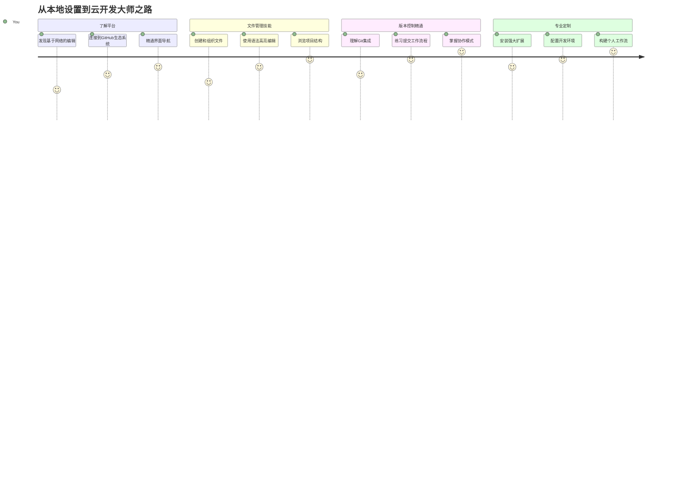
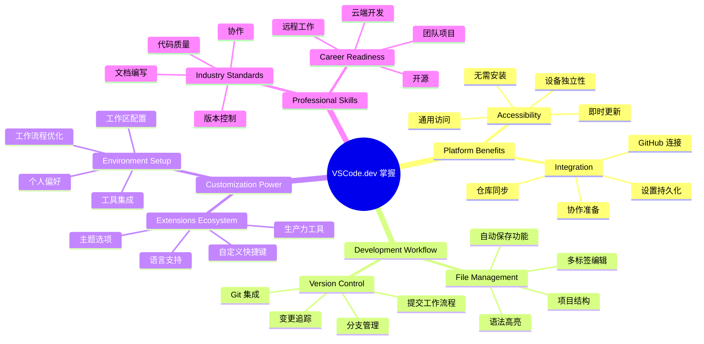
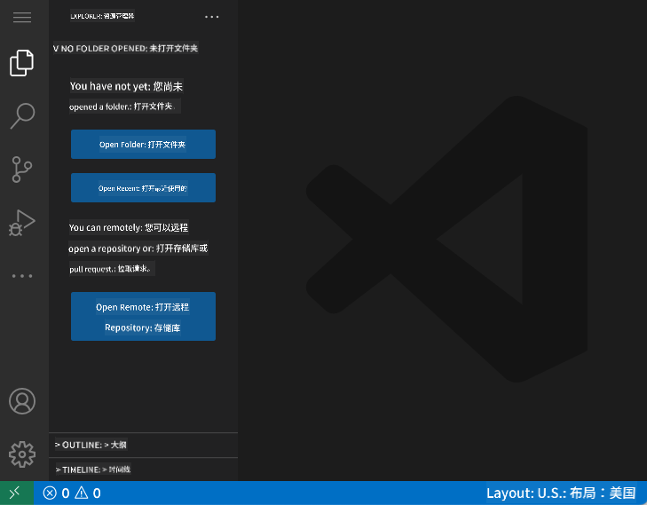
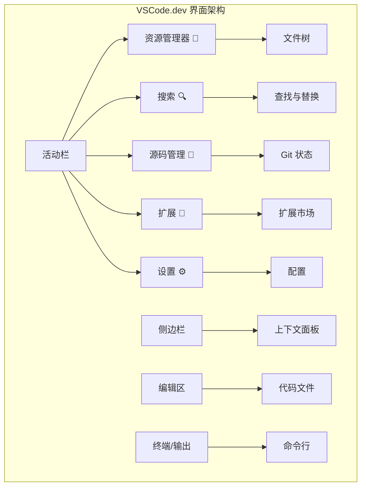
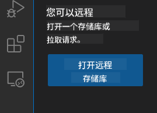
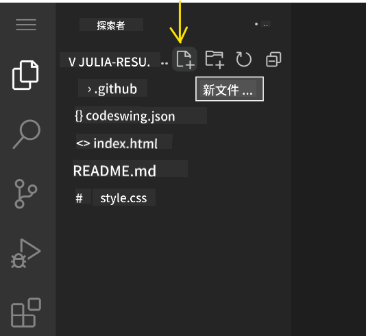
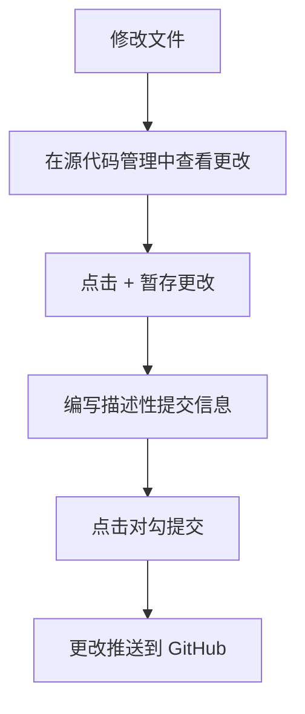
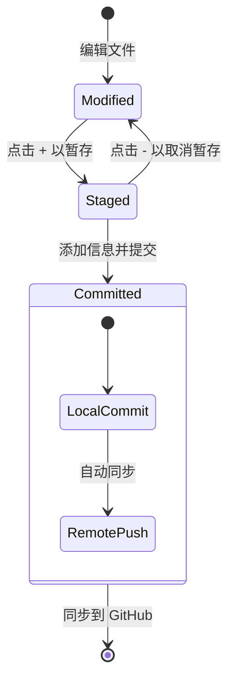
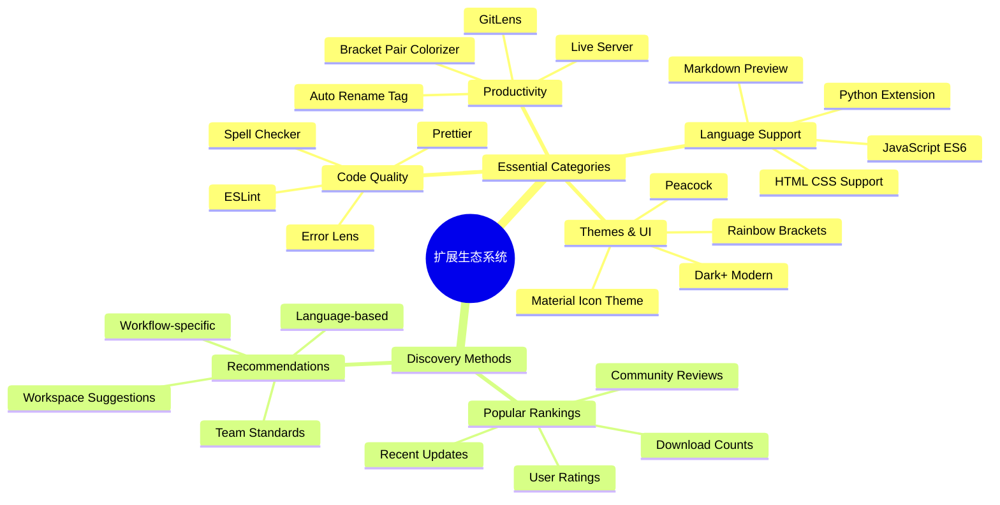
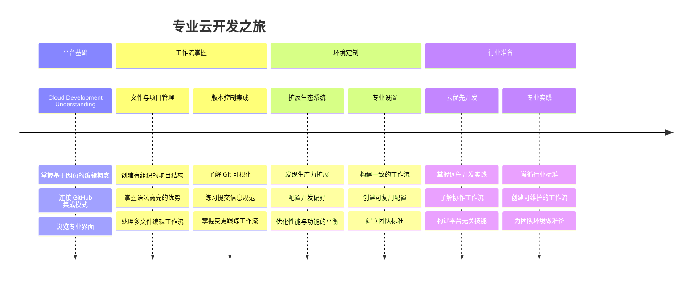

<!--
CO_OP_TRANSLATOR_METADATA:
{
  "original_hash": "a9a3bcc037a447e2d8994d99e871cd9f",
  "translation_date": "2026-01-06T11:19:40+00:00",
  "source_file": "8-code-editor/1-using-a-code-editor/README.md",
  "language_code": "zh"
}
-->
# 使用代码编辑器：掌握 VSCode.dev

还记得*黑客帝国*里，尼奥需要连接到一个庞大的计算机终端以访问数字世界吗？今天的网页开发工具则相反——功能强大，且随时随地都能访问。VSCode.dev 是一个基于浏览器的代码编辑器，能为任何有网络连接的设备带来专业开发工具。

就像印刷术让图书不再是修道院中抄写员的专属，VSCode.dev 让编码更民主化。你可以在图书馆的电脑、学校的实验室或任何有浏览器的地方工作。无需安装，也不必受限于“我需要特定的配置”。

完成本课后，你将了解如何操作 VSCode.dev，直接在浏览器中打开 GitHub 仓库，并使用 Git 进行版本控制——这些都是专业开发者每天必用的技能。

## ⚡ 你在接下来的5分钟内能做什么

**面向忙碌开发者的快速入门路径**


- **第1分钟**：访问 [vscode.dev](https://vscode.dev) — 无需安装
- **第2分钟**：使用 GitHub 登录以连接你的仓库
- **第3分钟**：尝试网址技巧：将任意仓库 URL 中的 `github.com` 改为 `vscode.dev/github`
- **第4分钟**：新建文件，自动体验语法高亮
- **第5分钟**：通过源代码控制面板提交修改

**快速测试 URL**：
```
# Transform this:
github.com/microsoft/Web-Dev-For-Beginners

# Into this:
vscode.dev/github/microsoft/Web-Dev-For-Beginners
```

**为什么这很重要**：5分钟内，你将体验到能在任何地方使用专业工具自由编码的感觉。这代表了开发的未来——可访问，强大，并且即时。

## 🗺️ 你的云端开发学习之旅


**你的旅途终点**：本课结束时，你将掌握一个能在任何设备上使用的专业云开发环境，让你能够使用大型科技公司开发者同样的工具编写代码。

## 你将学到什么

完成本次学习后，你将能够：

- 像在第二个家一样熟练操作 VSCode.dev —— 找到所需功能而不迷路
- 直接在浏览器打开任何 GitHub 仓库，立即开始编辑（这非常神奇！）
- 使用 Git 跟踪改动，像专业人士一样保存进度
- 用扩展插件增强编辑器，让编码更快更有趣
- 自信地创建和组织项目文件

## 你需要准备什么

要求很简单：

- 一个免费的 [GitHub 账号](https://github.com)（如果需要，我们会指导你创建）
- 具备基本的网页浏览器使用能力
- GitHub 基础课程提供有用背景知识，但不是必需

> 💡 **GitHub 新手提示**：创建账号免费且只需几分钟。就像图书馆卡让你访问全球书籍，GitHub 账号能让你进入互联网上的代码仓库大门。

## 🧠 云开发生态系统概览


**核心原则**：基于云的开发环境代表了编码的未来——为开发者提供专业级、可访问、协作和跨平台的工具。

## 为什么基于网页的代码编辑器重要

在互联网出现之前，不同大学的科学家很难轻松分享研究。1960年代的 ARPANET 连接了远距离的计算机。网页代码编辑器也遵循这种原则——无论你身在何处、用何种设备，都能访问强大工具。

代码编辑器是你的开发工作空间，用于编写、编辑和组织代码文件。与简单文本编辑器不同，专业的代码编辑器提供语法高亮、错误检测和项目管理功能。

VSCode.dev 将这些能力带入浏览器：

**基于网页编辑的优势：**

| 功能           | 描述                        | 实际好处                       |
|--------------|---------------------------|------------------------------|
| **平台无关**      | 在带浏览器的任何设备运行             | 无缝在不同计算机间切换工作               |
| **无需安装**      | 通过网页 URL 访问                  | 绕过软件安装限制                      |
| **自动更新**      | 始终运行最新版本                  | 无需手动更新即可使用新功能                |
| **仓库集成**      | 直接连接 GitHub                  | 无需本地管理文件即可编辑代码               |

**实际影响：**
- 在不同环境间工作无缝衔接
- 操作系统无关，界面一致
- 立即支持协作
- 减少对本地存储空间需求

## 探索 VSCode.dev

就像居里夫人的实验室在简洁空间中配备了先进设备，VSCode.dev 将专业开发工具浓缩进浏览器界面。这一网页应用提供与桌面代码编辑器相同的核心功能。

从浏览器访问 [vscode.dev](https://vscode.dev) 开始。界面无需下载或系统安装——这是云计算原则的直接应用。

### 连接你的 GitHub 账号

就像贝尔电话连接了远方，链接你的 GitHub 账号让 VSCode.dev 与你的代码仓库相通。提示登录 GitHub 时，建议接受连接。

**GitHub 集成带来：**
- 在编辑器内直接访问仓库
- 跨设备同步设置和扩展
- 流畅的保存流程到 GitHub
- 个性化的开发环境

### 了解你的新工作空间

加载完成后，你会看到一个清爽的工作区，设计围绕代码展开，让你专注于核心任务！



**你的界面导览：**
- **活动栏**（左侧条带）：主导航，含资源管理器 📁、搜索 🔍、源代码控制 🌿、扩展 🧩 及设置 ⚙️
- **侧边栏**（旁边面板）：根据选择显示相关信息
- **编辑区域**（中间大块区域）：魔法发生地——你的主要代码区域

**花点时间探索：**
- 点击活动栏图标，看看它们各自作用
- 注意侧边栏如何更新显示不同信息——很酷吧？
- 资源管理器视图（📁）你会用得最多，慢慢熟悉它吧


## 打开 GitHub 仓库

过去，研究人员需亲自去图书馆查阅资料。GitHub 仓库类似，是远端保存的代码集合。VSCode.dev 省去了传统下载本地才编辑的步骤。

这个功能让你能立即访问任何公共仓库，查看、编辑或贡献。打开仓库有两种方式：

### 方法1：点点点击法

适合刚进入 VSCode.dev 想打开特定仓库的用户，简单易用，适合初学者：

**操作步骤：**

1. 如果没在页面，先访问 [vscode.dev](https://vscode.dev)
2. 在欢迎界面点击“Open Remote Repository”按钮

   

3. 粘贴任意 GitHub 仓库 URL（试试这个：`https://github.com/microsoft/Web-Dev-For-Beginners`）
4. 按回车，见证神奇！

**专业技巧 - 命令面板快捷键：**

想更像编码巫师？试试 Ctrl+Shift+P（Mac 上为 Cmd+Shift+P）打开命令面板：


**命令面板是你所有操作的搜索引擎：**
- 输入“open remote”即可找到打开远程仓库的功能
- 记忆你最近打开过的仓库（超级方便！）
- 熟练后感觉像闪电般快速编码
- 这就是 VSCode.dev 的“嘿 Siri”，只不过是为编码设计的

### 方法2：修改 URL 技巧

如同 HTTP 和 HTTPS 在同一域名下用了不同协议，VSCode.dev 使用与 GitHub 地址体系类似的 URL 格式。任何 GitHub 仓库 URL 都可以修改成 VSCode.dev 直接打开。

**URL 变换规则：**

| 仓库类型     | GitHub URL                                     | VSCode.dev URL                                    |
|--------------|----------------------------------------------|-------------------------------------------------|
| **公共仓库**   | `github.com/microsoft/Web-Dev-For-Beginners` | `vscode.dev/github/microsoft/Web-Dev-For-Beginners` |
| **个人项目**   | `github.com/your-username/my-project`        | `vscode.dev/github/your-username/my-project`    |
| **任何可访问仓库** | `github.com/their-username/awesome-repo`     | `vscode.dev/github/their-username/awesome-repo` |

**实际操作：**
- 将 `github.com` 替换为 `vscode.dev/github`
- 保持其他 URL 组件不变
- 支持所有公共仓库
- 即刻进入编辑状态

> 💡 **改变生活的提示**：将你喜爱的仓库的 VSCode.dev 版本收藏为书签。我有“编辑我的作品集”和“修正文档”的书签，点击就直达编辑模式！

**选择使用哪种方法？**
- **界面打开法**：适合探索或不记得确切仓库名时用
- **URL 技巧法**：准确知道目标时极速访问

### 🎯 教学检查点：云开发访问

**暂停思考**：你刚学会了两种通过浏览器访问代码仓库的方法。这标志着开发方式的根本转变。

**快速自测：**
- 你能解释基于网页编辑为何免去了传统“开发环境设置”吗？
- URL 修改技巧相比本地 git 克隆有哪些优势？
- 这种方式如何改变你参与开源项目的方式？

**现实联系**：GitHub、GitLab 与 Replit 等大公司都基于云优先原则构建开发平台。你正在学习的工作流程，正是全球专业开发团队在使用的。

**思考问题**：云开发会如何影响学校的编程教学？考虑设备需求、软件管理与协作可能性。

## 使用文件和项目

既然打开了仓库，开始构建吧！VSCode.dev 为你提供创建、编辑和组织代码文件所需的一切。把它看作你的数字化车间——所有工具都唾手可得。

下面介绍你日常编码工作中最常用的操作。

### 创建新文件

就像建筑师办公室里有条理地保存蓝图，VSCode.dev 的文件创建也遵循结构化方式。支持所有标准的网页开发文件类型。

**文件创建流程：**

1. 在资源管理器侧边栏导航到目标文件夹
2. 鼠标悬停在文件夹名称上，出现“新建文件”图标（📄+）
3. 输入文件名并包含适当扩展名（如 `style.css`，`script.js`，`index.html`）
4. 按回车创建文件



**命名规范：**
- 使用描述性名称，体现文件用途
- 加上文件扩展名以支持正确的语法高亮
- 贯穿项目应用一致的命名规则
- 使用小写字母和连字符，避免空格

### 编辑和保存文件

真正的乐趣从这里开始！VSCode.dev 的编辑器装满实用功能，让编码感觉流畅自然。它就像一个超级聪明的写作助手，但专为代码设计。

**你的编辑工作流：**

1. 点击资源管理器中的任意文件，在主区域打开
2. 开始输入，感受 VSCode.dev 用颜色、高亮和错误提示支持你的创作
3. 用 Ctrl+S（Windows/Linux）或 Cmd+S（Mac）保存——其实它也会自动保存！


**编码时的酷炫特性：**
- 代码色彩丰富，易于阅读
- 输入时自动补全（像拼写纠正，但更智能）
- 保存前自动检测错误
- 可打开多个文件标签页，类似浏览器
- 背景自动保存，无需担心

> ⚠️ **小提醒**：尽管有自动保存，养成按 Ctrl+S 或 Cmd+S 的习惯依然好。它能立即保存并触发额外的错误检查功能。

### 使用 Git 进行版本控制

就像考古学家详细记录挖掘层次，Git 跟踪代码随时间的变化。它保存项目历史，便于回退到之前版本。VSCode.dev 集成了 Git 功能。

**源代码控制界面：**

1. 通过活动栏的 🌿 图标访问源代码控制面板
2. 已修改的文件会出现在“变更”区域
3. 用颜色区分变动类型：绿色表示新增，红色表示删除


**保存工作（提交工作流）：**



**步骤说明：**
- 点击想保存文件旁的“+”图标，将其“暂存”
- 仔细检查你对所有暂存更改是否满意
- 写一段简短的说明解释你做了什么（这就是你的“提交信息”）
- 点击勾选按钮将所有内容保存到 GitHub
- 如果改变主意，撤销图标可以舍弃更改

**编写好的提交信息（其实比你想的容易！）：**
- 只需描述你做了什么，比如“添加联系表单”或“修复导航故障”
- 保持简短明了——想象推文长度，而不是论文
- 以动作动词开头，如“添加”、“修复”、“更新”或“删除”
- **好的示例**：“添加响应式导航菜单”，“修复移动端布局问题”，“更新颜色以提升可访问性”

> 💡 **快速导航提示**：使用左上角的汉堡菜单（☰）跳回你的 GitHub 仓库，查看在线提交的更改。这就像编辑环境和项目的 GitHub 首页之间的传送门！

## 通过扩展增强功能

正如工匠的工作坊中包含专门工具处理不同任务，VSCode.dev 也可以通过扩展定制以添加具体功能。这些社区开发的插件满足了常见开发需求，如代码格式化、实时预览和增强的 Git 集成。

扩展市场托管着开发者社区全球创作的成千上万免费工具。每个扩展解决特定的工作流难题，让你构建一个个性化的开发环境，适合你的特定需求和喜好。


### 寻找理想扩展

扩展市场结构非常清晰，所以你不会迷失在寻找所需工具中。它设计用来帮助你发现既具体又有趣的新工具，甚至是以前不知道的好东西！

**如何进入市场：**

1. 点击活动栏中的扩展图标（🧩）
2. 浏览或搜索特定内容
3. 点击感兴趣的扩展，了解更多信息


**你会看到内容：**

| 部分 | 包含内容 | 有何作用 |
|----------|---------|----------|
| **已安装** | 你已经添加的扩展 | 你的个人编码工具箱 |
| **流行** | 大家喜欢的扩展 | 大多数开发者推荐的 |
| **推荐** | 针对你的项目的智能建议 | VSCode.dev 的贴心推荐 |

**方便浏览的理由：**
- 每个扩展展示评分、下载次数和真实用户评论
- 有截图和清晰的描述说明功能
- 明确标注兼容性信息
- 推荐类似扩展，方便你做比较

### 安装扩展（超简单！）

给编辑器添加新功能，只需点击按钮。扩展几秒钟即可安装，立马生效——无需重启，无需等待。

**步骤非常简单：**

1. 搜索你想要的扩展（试试搜索“live server”或“prettier”）
2. 点击一个看起来不错的扩展，查看详情
3. 阅读功能描述和用户评分
4. 点击蓝色“安装”按钮，完成！


**幕后发生了什么：**
- 扩展自动下载并设置好
- 新功能立即出现在界面中
- 立刻开始工作（真的，很快！）
- 如果你已登录，扩展会同步到所有设备

**推荐开始试用的几个扩展：**
- **Live Server**：编码时实时查看网站更新（超级神奇！）
- **Prettier**：自动让代码格式整洁专业
- **Auto Rename Tag**：修改一个 HTML 标签，配对标签同步更新
- **Bracket Pair Colorizer**：用颜色区分括号，避免迷失
- **GitLens**：让 Git 功能超强，信息丰富

### 自定义你的扩展

大多数扩展带有可调设置，让你调整到最适合你的使用习惯。就像调节汽车的座椅和后视镜一样，每个人都有偏好！

**调整扩展设置：**

1. 在扩展面板找到已安装扩展
2. 点击名称旁的小齿轮图标（⚙️）
3. 选择“扩展设置”
4. 进行调整，直到感觉顺手


**你可能想调整的常见项：**
- 代码格式化方式（制表符与空格，行宽等）
- 触发不同操作的快捷键
- 扩展适用的文件类型
- 开启或关闭特定功能，让界面更简洁

### 维护扩展的整洁

随着你发现越来越多好用的扩展，想保持扩展集合整洁高效，VSCode.dev 提供了简单易用的管理方式。

**你可以做的操作：**

| 操作 | 适用场景 | 专业提示 |
|--------|---------|----------|
| **禁用** | 测试某扩展是否导致问题 | 比卸载更灵活，想用时能恢复 |
| **卸载** | 完全移除不需要的扩展 | 保持环境清爽快速 |
| **更新** | 获取新功能和修复 | 通常自动进行，手动检查也好 |

**我的扩展管理习惯：**
- 每几个月审查一次安装的扩展，清理未用的
- 保持扩展更新，享受最新功能与安全修复
- 如果感觉系统变慢，暂时禁用扩展找原因
- 关注更新日志中的重大改进和新特性

> ⚠️ **性能提示**：扩展虽好，数量太多会拖慢速度。专注使用真正帮到你的，敢于卸载从未用过的扩展。

### 🎯 教学回顾：开发环境定制

**架构理解**：你学会了用社区扩展定制专业开发环境。这与企业开发团队构建标准化工具链如出一辙。

**掌握的关键概念**：
- **扩展发现**：找到解决具体开发问题的工具
- **环境配置**：根据个人或团队偏好定制工具
- **性能优化**：功能与系统性能的平衡
- **社区协作**：利用全球开发者创建的工具资源

**行业关联**：扩展生态是 VS Code、Chrome DevTools 和现代 IDE 等主流开发平台的核心。了解扩展的评估、安装和配置是专业开发流程的基础。

**思考问题**：如果为 10 人开发团队搭建统一开发环境，你会如何确保一致性、性能和个性化需求的平衡？

## 📈 你的云端开发大师之路


**🎓 毕业里程碑**：你已成功掌握云端开发，使用与大型科技公司专业开发者相同的工具和工作流。这代表了软件开发的未来。

**🔄 下一阶段能力**：
- 准备探索高级云端开发平台（Codespaces、GitPod）
- 准备参与分布式开发团队协作
- 装备好为全球开源项目贡献代码
- 打下现代 DevOps 与持续集成实践基础

## GitHub Copilot Agent 挑战 🚀

像 NASA 对航天任务的结构化方法，本挑战需要你系统应用 VSCode.dev 技能，完成完整的开发工作流。

**目标**：展示使用 VSCode.dev 建立完整 Web 开发工作流的熟练度。

**项目要求**：使用 Agent 模式协助，完成以下任务：
1. Fork 现有仓库或新建一个
2. 建立含 HTML、CSS 和 JavaScript 文件的功能性项目结构
3. 安装并配置三个提升开发效率的扩展
4. 使用描述性提交信息练习版本控制
5. 体验特性分支的创建和修改
6. 在 README.md 中记录过程和心得

此练习整合所有 VSCode.dev 概念，形成可用于未来开发项目的实用工作流。

在此了解更多有关 [agent 模式](https://code.visualstudio.com/blogs/2025/02/24/introducing-copilot-agent-mode)。

## 任务

是时候实战检验这些技能了！这里有一个动手项目，帮你实践所学： [使用 VSCode.dev 创建简历网站](./assignment.md)

该任务引导你用浏览器，全程构建一个专业简历网站。你将用到所有已学的 VSCode.dev 功能，最终不仅拥有漂亮网站，更具备扎实的工作流信心。

## 持续探索与提升技能

你已打下坚实基础，但还有更多精彩内容等你发掘！以下资源和建议帮你将 VSCode.dev 技能提升到新高度：

**官方文档推荐收藏：**
- [VSCode Web 文档](https://code.visualstudio.com/docs/editor/vscode-web?WT.mc_id=academic-0000-alfredodeza) – 浏览器编辑完全指南
- [GitHub Codespaces](https://docs.github.com/en/codespaces) – 想要云端更强大时必备

**值得尝试的新功能：**
- **键盘快捷键**：学会极速操作，像码农忍者一样！
- **工作区设置**：为不同项目配置不同环境
- **多根工作区**：同时操作多个仓库（超级方便！）
- **终端集成**：浏览器内直接用命令行工具

**实战练习灵感：**
- 参与开源项目贡献代码，用 VSCode.dev 回馈社区
- 尝试不同扩展，找到最适合自己的组合
- 创建常用网站类型的项目模板
- 练习 Git 工作流，如分支和合并，这些技能团队合作必备

---

**你已掌握基于浏览器的开发！** 🎉 就像便携仪器让科学家能在偏远地区做研究一样，VSCode.dev 让你能用任何联网设备进行专业编码。

这些技能符合当前行业习惯——许多专业开发者用云端开发环境，因为它灵活且易用。你学到的工作流可从个人项目扩展到大规模团队协作。

将这些技术应用到下一个开发项目吧！ 🚀

---

<!-- CO-OP TRANSLATOR DISCLAIMER START -->
**免责声明**：  
本文档由 AI 翻译服务 [Co-op Translator](https://github.com/Azure/co-op-translator) 翻译。虽然我们力求准确，但请注意，自动翻译可能存在错误或不准确之处。原始语言版本的文档应被视为权威来源。对于关键信息，建议使用专业人工翻译。因使用本翻译而产生的任何误解或误释，我们概不负责。
<!-- CO-OP TRANSLATOR DISCLAIMER END -->