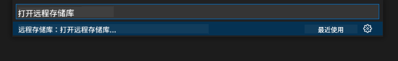
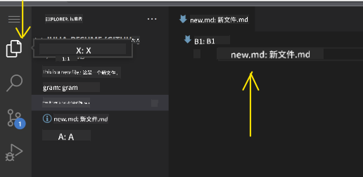
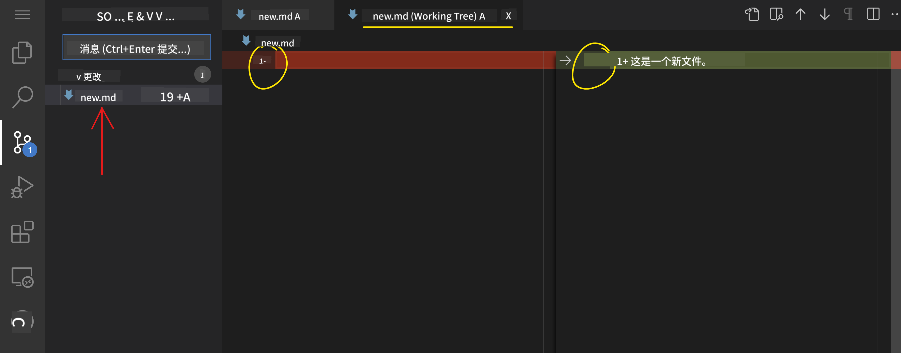

<!--
CO_OP_TRANSLATOR_METADATA:
{
  "original_hash": "f8d4b0284f3fc1de7eb65073d8338cca",
  "translation_date": "2025-10-03T08:48:42+00:00",
  "source_file": "8-code-editor/1-using-a-code-editor/README.md",
  "language_code": "zh"
}
-->
***

# 使用代码编辑器：[VSCode.dev](https://vscode.dev) 高级指南

**欢迎！**  
本课程将带你从基础到高级使用 [VSCode.dev](https://vscode.dev)——一个强大的基于网页的代码编辑器。你将学会如何自信地编辑代码、管理项目、跟踪更改、安装扩展以及像专业人士一样协作——这一切都可以直接在浏览器中完成，无需安装任何软件。

***

## 学习目标

完成本课程后，你将能够：

- 高效地在任何项目上使用代码编辑器，无论身处何地
- 使用内置版本控制无缝跟踪工作进度
- 通过编辑器自定义和扩展提升开发工作流程

***

## 前置条件

开始之前，请**注册一个免费的 [GitHub](https://github.com) 账号**，它可以帮助你管理代码库并与全球开发者协作。如果你还没有账号，[点击这里创建一个](https://github.com/)。

***

## 为什么选择基于网页的代码编辑器？

像 VSCode.dev 这样的**代码编辑器**是你编写、编辑和管理代码的指挥中心。它拥有直观的界面、丰富的功能，并且可以通过浏览器即时访问，你可以：

- 在任何设备上编辑项目
- 避免安装的麻烦
- 即时协作和贡献

一旦熟悉了 VSCode.dev，你就可以随时随地处理编码任务。

***

## 开始使用 VSCode.dev

访问 **[VSCode.dev](https://vscode.dev)**——无需安装，无需下载。使用 GitHub 登录可以解锁完整功能，包括同步你的设置、扩展和代码库。如果系统提示，请连接你的 GitHub 账号。

加载后，你的工作区将如下所示：

VSCode.dev 的界面分为三个核心部分，从左到右分别是：
- **活动栏：** 包括图标如 🔎（搜索）、⚙️（设置）、文件、源代码控制等。
- **侧边栏：** 根据活动栏中选择的图标改变上下文（默认显示 *资源管理器*，用于展示文件）。
- **编辑器/代码区域：** 最右侧的最大部分——你将在这里编辑和查看代码。

点击图标探索功能，但记得返回 _资源管理器_ 保持位置。

***

## 打开 GitHub 仓库

### 方法 1：通过编辑器打开

1. 访问 [VSCode.dev](https://vscode.dev)。点击 **"Open Remote Repository"**。

   

2. 使用 _命令面板_（Ctrl-Shift-P 或 Mac 上的 Cmd-Shift-P）。

   

   - 选择“打开远程仓库”选项。
   - 粘贴你的 GitHub 仓库 URL（例如 `https://github.com/microsoft/Web-Dev-For-Beginners`），然后按 Enter。

如果成功，你将看到整个项目加载完成并准备编辑！

***

### 方法 2：通过 URL 快速打开

将任何 GitHub 仓库 URL 转换为 VSCode.dev 直接打开的链接，只需将 `github.com` 替换为 `vscode.dev/github`。  
例如：

- GitHub: `https://github.com/microsoft/Web-Dev-For-Beginners`
- VSCode.dev: `https://vscode.dev/github/microsoft/Web-Dev-For-Beginners`

此功能让你可以快速访问任何项目。

***

## 编辑项目中的文件

打开仓库后，你可以：

### 1. **创建新文件**
- 在 *资源管理器* 侧边栏中，导航到目标文件夹或使用根目录。
- 点击 _‘新建文件...’_ 图标。
- 命名文件，按 **Enter**，文件会立即出现。

### 2. **编辑和保存文件**
- 点击 *资源管理器* 中的文件，将其打开到代码区域。
- 根据需要进行修改。
- VSCode.dev 会自动保存你的更改，但你也可以按 Ctrl+S 手动保存。

### 3. **使用版本控制跟踪和提交更改**

VSCode.dev 集成了 **Git** 版本控制！

- 点击 _'源代码控制'_ 图标查看所有更改。
- `Changes` 文件夹中的文件显示新增内容（绿色）和删除内容（红色）。  
  

- 点击文件旁边的 `+` 准备提交更改。
- 点击撤销图标 **丢弃** 不需要的更改。
- 输入清晰的提交信息，然后点击复选标记提交并推送。

要返回 GitHub 仓库，请点击左上角的汉堡菜单。

***

## 使用扩展增强功能

扩展可以为 VSCode.dev 添加语言支持、主题、调试器和生产力工具——让你的编码生活更轻松、更有趣。

### 浏览和管理扩展

- 点击活动栏中的 **扩展图标**。
- 在 _'搜索市场中的扩展'_ 框中搜索扩展。

  

  - **已安装：** 所有你添加的扩展
  - **热门：** 行业推荐
  - **推荐：** 根据你的工作流程量身定制

  

### 2. **自定义扩展**

- 找到已安装的扩展。
- 点击 **齿轮图标** → 选择 _扩展设置_，根据需要调整行为。

  

### 3. **管理扩展**
你可以：

- **禁用：** 暂时关闭扩展但保留安装
- **卸载：** 如果不再需要，可以永久移除

  找到扩展，点击齿轮图标，选择“禁用”或“卸载”，或者使用代码区域中的蓝色按钮。

***

## 作业

测试你的技能：[使用 vscode.dev 创建一个简历网站](https://github.com/microsoft/Web-Dev-For-Beginners/blob/main/8-code-editor/1-using-a-code-editor/assignment.md)

***

## 深入探索和自学

- 通过 [VSCode 官方网页文档](https://code.visualstudio.com/docs/editor/vscode-web?WT.mc_id=academic-0000-alfredodeza) 深入了解。
- 探索高级工作区功能、快捷键和设置。

***

**现在你已经准备好随时随地使用 VSCode.dev 进行编码、创建和协作了！**

---

**免责声明**：  
本文档使用AI翻译服务 [Co-op Translator](https://github.com/Azure/co-op-translator) 进行翻译。尽管我们努力确保翻译的准确性，但请注意，自动翻译可能包含错误或不准确之处。原始语言的文档应被视为权威来源。对于关键信息，建议使用专业人工翻译。我们不对因使用此翻译而产生的任何误解或误读承担责任。