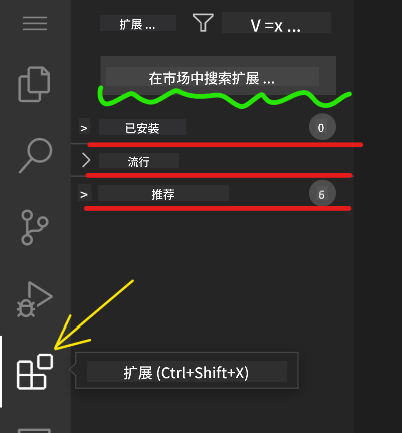
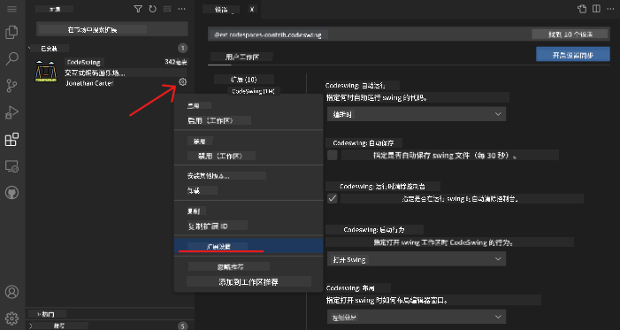

<!--
CO_OP_TRANSLATOR_METADATA:
{
  "original_hash": "1ba61d96a11309a2a6ea507496dcf7e5",
  "translation_date": "2025-08-29T14:51:11+00:00",
  "source_file": "8-code-editor/1-using-a-code-editor/README.md",
  "language_code": "zh"
}
-->
# 使用代码编辑器

本课将介绍如何使用 [VSCode.dev](https://vscode.dev)，一个基于网页的代码编辑器，让你无需在电脑上安装任何软件即可修改代码并为项目做出贡献。

## 学习目标

在本课中，你将学习如何：

- 在代码项目中使用代码编辑器
- 使用版本控制跟踪更改
- 自定义编辑器以适应开发需求

### 前置条件

在开始之前，你需要创建一个 [GitHub](https://github.com) 账户。如果你还没有账户，请访问 [GitHub](https://github.com/) 并创建一个账户。

### 简介

代码编辑器是编写程序和协作开发现有代码项目的重要工具。一旦你掌握了编辑器的基础知识并学会如何利用其功能，你就可以在编写代码时应用这些技能。

## 开始使用 VSCode.dev

[VSCode.dev](https://vscode.dev) 是一个基于网页的代码编辑器。你无需安装任何软件，就像打开其他网站一样简单。要开始使用编辑器，请打开以下链接：[https://vscode.dev](https://vscode.dev)。如果你尚未登录 [GitHub](https://github.com/)，请按照提示登录或创建一个新账户并登录。

加载完成后，界面应类似于下图：


界面主要分为三个部分，从左到右依次是：

1. **活动栏**，包括一些图标，如放大镜 🔎、齿轮 ⚙️ 等。
2. 默认展开的活动栏，称为 **侧边栏**，通常显示为 **资源管理器**。
3. 最右侧是代码区域。

点击每个图标可以显示不同的菜单。完成后，点击 **资源管理器** 图标返回初始界面。

当你开始创建或修改代码时，操作会发生在右侧最大的区域中。你也可以在这里查看现有代码，接下来我们将进行相关操作。

## 打开一个 GitHub 仓库

首先，你需要打开一个 GitHub 仓库。有多种方式可以打开仓库，本节将介绍两种方法，帮助你开始修改代码。

### 1. 使用编辑器

通过编辑器本身打开远程仓库。如果你访问 [VSCode.dev](https://vscode.dev)，会看到一个 **"Open Remote Repository"** 按钮：


你也可以使用命令面板。命令面板是一个输入框，你可以在其中输入命令或操作的关键词来找到相应的命令。点击左上角的菜单，选择 **View**，然后选择 **Command Palette**，或者使用以下快捷键：Ctrl-Shift-P（MacOS 上为 Command-Shift-P）。


打开菜单后，输入 **open remote repository**，然后选择第一个选项。你参与的或最近打开的多个仓库会显示出来。你也可以使用完整的 GitHub URL 选择一个仓库。将以下 URL 粘贴到输入框中：

```
https://github.com/microsoft/Web-Dev-For-Beginners
```

✅ 如果成功，你将在文本编辑器中看到该仓库的所有文件。

### 2. 使用 URL

你也可以直接使用 URL 加载仓库。例如，当前仓库的完整 URL 是 [https://github.com/microsoft/Web-Dev-For-Beginners](https://github.com/microsoft/Web-Dev-For-Beginners)，但你可以将 GitHub 域名替换为 `VSCode.dev/github`，直接加载仓库。结果 URL 为 [https://vscode.dev/github/microsoft/Web-Dev-For-Beginners](https://vscode.dev/github/microsoft/Web-Dev-For-Beginners)。

## 编辑文件

在浏览器或 VSCode.dev 中打开仓库后，下一步是更新或修改项目。

### 1. 创建新文件

你可以在现有文件夹中创建文件，也可以在根目录/文件夹中创建。要创建新文件，打开你希望保存文件的位置/目录，点击活动栏（左侧）的 **"新建文件..."** 图标，命名文件并按回车。


### 2. 编辑并保存仓库中的文件

使用 VSCode.dev 可以快速更新项目，而无需在本地加载任何软件。  
要更新代码，点击活动栏上的 **资源管理器** 图标，查看仓库中的文件和文件夹。选择一个文件，在代码区域打开它，进行修改并保存。


完成项目更新后，选择 **`源代码管理`** 图标，查看你对仓库所做的所有更改。

要查看项目的更改，选择扩展活动栏中 `Changes` 文件夹中的文件。这将打开一个 **工作树**，让你直观地看到文件的更改。红色表示项目中删除的内容，绿色表示新增的内容。


如果你对所做的更改感到满意，将鼠标悬停在 `Changes` 文件夹上，点击 `+` 按钮以暂存更改。暂存意味着准备好将更改提交到 GitHub。

如果你对某些更改不满意并希望丢弃它们，将鼠标悬停在 `Changes` 文件夹上，选择 `撤销` 图标。

然后，输入一个 **提交信息**（对项目更改的描述），点击 **勾选图标** 提交并推送更改。

完成项目工作后，点击左上角的 **汉堡菜单图标** 返回 github.com 上的仓库。


## 使用扩展

在 VSCode 中安装扩展可以为编辑器添加新功能并自定义开发环境，从而提升开发工作流。这些扩展还可以帮助你支持多种编程语言，通常分为通用扩展或基于语言的扩展。

要浏览所有可用扩展的列表，点击活动栏上的 **`扩展图标`**，然后在标有 **"在市场中搜索扩展"** 的文本框中输入扩展名称。  
你会看到一个扩展列表，每个扩展都包含 **扩展名称、发布者名称、一句话描述、下载次数** 和 **星级评分**。


你还可以通过展开 **`已安装文件夹`** 查看所有已安装的扩展，通过 **`热门文件夹`** 查看大多数开发者使用的热门扩展，以及通过 **`推荐文件夹`** 查看基于同一工作区用户或最近打开文件推荐的扩展。



### 1. 安装扩展

要安装扩展，在搜索框中输入扩展名称，点击它以在扩展活动栏中查看扩展的更多信息。

你可以点击扩展活动栏中的 **蓝色安装按钮** 安装扩展，或者在选择扩展后，点击代码区域中显示的安装按钮。


### 2. 自定义扩展

安装扩展后，你可能需要根据自己的偏好修改其行为并进行自定义。为此，选择扩展图标，此时你的扩展会出现在 **已安装文件夹** 中，点击 **齿轮图标** 并导航到 **扩展设置**。



### 3. 管理扩展

安装并使用扩展后，VSCode.dev 提供了多种选项来根据不同需求管理扩展。例如，你可以选择：

- **禁用**： _(当你暂时不需要某个扩展但又不想完全卸载时，可以禁用它)_

    选择扩展活动栏中的已安装扩展 > 点击齿轮图标 > 选择 **"禁用"** 或 **"禁用（工作区）"**  
    **或者** 打开代码区域中的扩展，点击蓝色禁用按钮。

- **卸载**：选择扩展活动栏中的已安装扩展 > 点击齿轮图标 > 选择 **"卸载"**  
    **或者** 打开代码区域中的扩展，点击蓝色卸载按钮。

---

## 作业

[使用 vscode.dev 创建一个简历网站](https://github.com/microsoft/Web-Dev-For-Beginners/blob/main/8-code-editor/1-using-a-code-editor/assignment.md)

## 复习与自学

阅读更多关于 [VSCode.dev](https://code.visualstudio.com/docs/editor/vscode-web?WT.mc_id=academic-0000-alfredodeza) 及其其他功能的内容。

---

**免责声明**：  
本文档使用AI翻译服务[Co-op Translator](https://github.com/Azure/co-op-translator)进行翻译。尽管我们努力确保准确性，但请注意，自动翻译可能包含错误或不准确之处。应以原始语言的文档作为权威来源。对于关键信息，建议使用专业人工翻译。因使用本翻译而导致的任何误解或误读，我们概不负责。