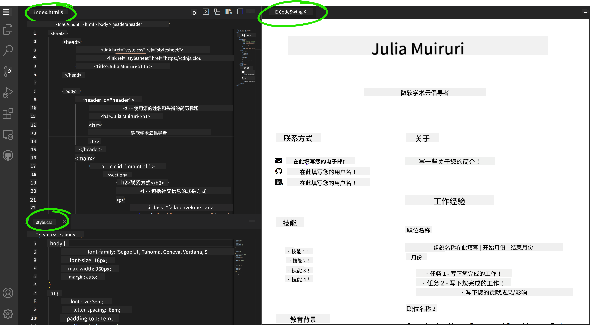

<!--
CO_OP_TRANSLATOR_METADATA:
{
  "original_hash": "bd3aa6d2b879c30ea496c43aec1c49ed",
  "translation_date": "2025-08-29T14:51:38+00:00",
  "source_file": "8-code-editor/1-using-a-code-editor/assignment.md",
  "language_code": "zh"
}
-->
# 使用 vscode.dev 创建一个简历网站

_当招聘人员向你索要简历时，你直接发给他们一个网址，这是不是很酷？_ 😎

## 目标

完成本任务后，你将学会：

- 创建一个网站来展示你的简历

### 前置条件

1. 一个 GitHub 账号。如果你还没有账号，请访问 [GitHub](https://github.com/) 并创建一个账号。

## 步骤

**步骤 1：** 创建一个新的 GitHub 仓库，并命名为 `my-resume`

**步骤 2：** 在你的仓库中创建一个 `index.html` 文件。我们需要在 github.com 上至少添加一个文件，因为你无法在 vscode.dev 中打开一个空的仓库。

点击 `creating a new file` 链接，输入文件名 `index.html`，然后选择 `Commit new file` 按钮。


**步骤 3：** 打开 [VSCode.dev](https://vscode.dev) 并选择 `Open Remote Repository` 按钮。

复制你刚刚为简历网站创建的仓库的 URL，并将其粘贴到输入框中：

_将 `your-username` 替换为你的 GitHub 用户名_

```
https://github.com/your-username/my-resume
```

✅ 如果成功，你将在浏览器中的文本编辑器中看到你的项目和 `index.html` 文件。


**步骤 4：** 打开 `index.html` 文件，将以下代码粘贴到代码区域并保存。

<details>
    <summary><b>负责简历网站内容的 HTML 代码。</b></summary>
    
        <html>

            <head>
                <link href="style.css" rel="stylesheet">
                <link rel="stylesheet" href="https://cdnjs.cloudflare.com/ajax/libs/font-awesome/5.15.4/css/all.min.css">
                <title>Your Name Goes Here!</title>
            </head>
            <body>
                <header id="header">
                    <!-- 简历头部，包含你的名字和职位 -->
                    <h1>Your Name Goes Here!</h1>
                    <hr>
                    Your Role!
                    <hr>
                </header>
                <main>
                    <article id="mainLeft">
                        <section>
                            <h2>联系方式</h2>
                            <!-- 联系信息，包括社交媒体 -->
                            <p>
                                <i class="fa fa-envelope" aria-hidden="true"></i>
                                <a href="mailto:username@domain.top-level domain">在这里填写你的邮箱</a>
                            </p>
                            <p>
                                <i class="fab fa-github" aria-hidden="true"></i>
                                <a href="github.com/yourGitHubUsername">在这里填写你的 GitHub 用户名！</a>
                            </p>
                            <p>
                                <i class="fab fa-linkedin" aria-hidden="true"></i>
                                <a href="linkedin.com/yourLinkedInUsername">在这里填写你的 LinkedIn 用户名！</a>
                            </p>
                        </section>
                        <section>
                            <h2>技能</h2>
                            <!-- 你的技能 -->
                            <ul>
                                <li>技能 1！</li>
                                <li>技能 2！</li>
                                <li>技能 3！</li>
                                <li>技能 4！</li>
                            </ul>
                        </section>
                        <section>
                            <h2>教育背景</h2>
                            <!-- 你的教育背景 -->
                            <h3>在这里填写你的课程！</h3>
                            <p>
                                在这里填写你的学校！
                            </p>
                            <p>
                                开始日期 - 结束日期
                            </p>
                        </section>            
                    </article>
                    <article id="mainRight">
                        <section>
                            <h2>关于我</h2>
                            <!-- 关于你 -->
                            <p>在这里写一段关于自己的介绍！</p>
                        </section>
                        <section>
                            <h2>工作经历</h2>
                            <!-- 你的工作经历 -->
                            <h3>职位名称</h3>
                            <p>
                                在这里填写组织名称 | 开始月份 – 结束月份
                            </p>
                            <ul>
                                    <li>任务 1 - 描述你做了什么！</li>
                                    <li>任务 2 - 描述你做了什么！</li>
                                    <li>描述你的贡献成果/影响</li>
                                    
                            </ul>
                            <h3>职位名称 2</h3>
                            <p>
                                在这里填写组织名称 | 开始月份 – 结束月份
                            </p>
                            <ul>
                                    <li>任务 1 - 描述你做了什么！</li>
                                    <li>任务 2 - 描述你做了什么！</li>
                                    <li>描述你的贡献成果/影响</li>
                                    
                            </ul>
                        </section>
                    </article>
                </main>
            </body>
        </html>
</details>

将你的简历信息替换 HTML 代码中的 _占位文本_。

**步骤 5：** 将鼠标悬停在 My-Resume 文件夹上，点击 `New File ...` 图标，在你的项目中创建两个新文件：`style.css` 和 `codeswing.json`。

**步骤 6：** 打开 `style.css` 文件，将以下代码粘贴进去并保存。

<details>
        <summary><b>用于格式化网站布局的 CSS 代码。</b></summary>
            
            body {
                font-family: 'Segoe UI', Tahoma, Geneva, Verdana, sans-serif;
                font-size: 16px;
                max-width: 960px;
                margin: auto;
            }
            h1 {
                font-size: 3em;
                letter-spacing: .6em;
                padding-top: 1em;
                padding-bottom: 1em;
            }

            h2 {
                font-size: 1.5em;
                padding-bottom: 1em;
            }

            h3 {
                font-size: 1em;
                padding-bottom: 1em;
            }
            main { 
                display: grid;
                grid-template-columns: 40% 60%;
                margin-top: 3em;
            }
            header {
                text-align: center;
                margin: auto 2em;
            }

            section {
                margin: auto 1em 4em 2em;
            }

            i {
                margin-right: .5em;
            }

            p {
                margin: .2em auto
            }

            hr {
                border: none;
                background-color: lightgray;
                height: 1px;
            }

            h1, h2, h3 {
                font-weight: 100;
                margin-bottom: 0;
            }
            #mainLeft {
                border-right: 1px solid lightgray;
            }
            
</details>

**步骤 6：** 打开 `codeswing.json` 文件，将以下代码粘贴进去并保存。

    {
    "scripts": [],
    "styles": []
    }

**步骤 7：** 安装 `Codeswing 扩展`，以在代码区域中可视化简历网站。

点击活动栏上的 _`Extensions`_ 图标，输入 Codeswing。点击扩展栏中显示的 _蓝色安装按钮_ 或代码区域中加载的安装按钮来安装扩展。安装完成后，观察代码区域，查看项目的变化 😃。


安装扩展后，你的屏幕上会显示以下内容。



如果你对所做的更改感到满意，将鼠标悬停在 `Changes` 文件夹上，点击 `+` 按钮以暂存更改。

输入提交信息 _(对项目所做更改的描述)_，然后点击 `check` 按钮提交更改。完成项目后，选择左上角的汉堡菜单图标返回 GitHub 上的仓库。

恭喜 🎉 你已经通过几个简单的步骤使用 vscode.dev 创建了你的简历网站。

## 🚀 挑战

打开一个你有权限修改的远程仓库，更新一些文件。接下来，尝试创建一个包含更改的新分支并发起 Pull Request。

## 复习与自学

阅读更多关于 [VSCode.dev](https://code.visualstudio.com/docs/editor/vscode-web?WT.mc_id=academic-0000-alfredodeza) 及其其他功能的内容。

---

**免责声明**：  
本文档使用AI翻译服务[Co-op Translator](https://github.com/Azure/co-op-translator)进行翻译。尽管我们努力确保准确性，但请注意，自动翻译可能包含错误或不准确之处。应以原始语言的文档作为权威来源。对于关键信息，建议使用专业人工翻译。因使用本翻译而导致的任何误解或误读，我们概不负责。