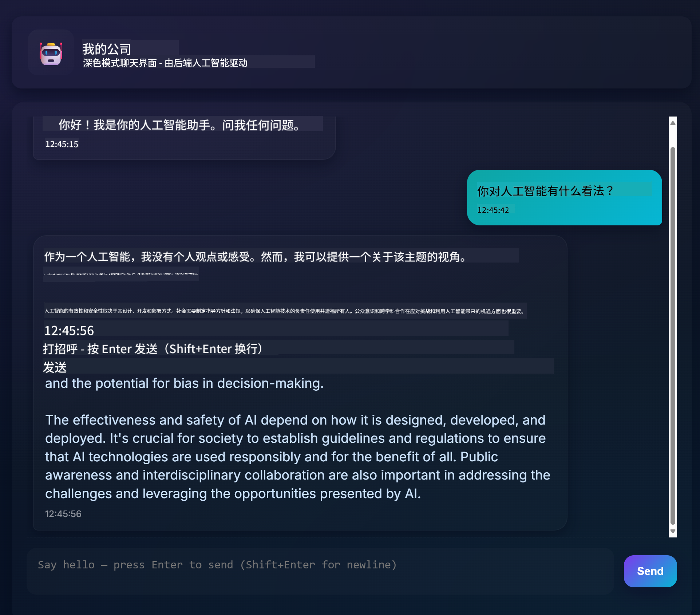
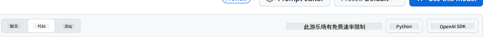
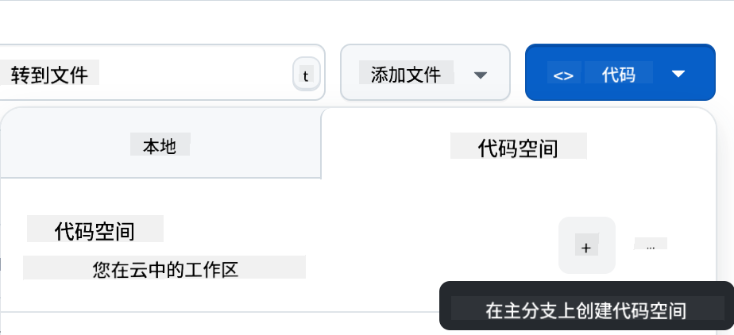

<!--
CO_OP_TRANSLATOR_METADATA:
{
  "original_hash": "11cf36165c243947b6cd85b88cf6faa6",
  "translation_date": "2025-09-01T16:49:22+00:00",
  "source_file": "9-chat-project/README.md",
  "language_code": "zh"
}
-->
# 聊天项目

这个聊天项目展示了如何使用 GitHub Models 构建一个聊天助手。

以下是完成后的项目样子：



一些背景信息：使用生成式 AI 构建聊天助手是学习 AI 的一个很好的起点。在本课程中，你将学习如何将生成式 AI集成到一个网页应用中。让我们开始吧。

## 连接生成式 AI

在后端，我们使用 GitHub Models。这是一项很棒的服务，可以免费使用 AI。访问它的 playground 并获取与你选择的后端语言对应的代码。以下是 [GitHub Models Playground](https://github.com/marketplace/models/azure-openai/gpt-4o-mini/playground) 的样子：


如我们所说，选择“Code”选项卡和你选择的运行时。



### 使用 Python

在这个例子中，我们选择 Python，这意味着我们会使用以下代码：

```python
"""Run this model in Python

> pip install openai
"""
import os
from openai import OpenAI

# To authenticate with the model you will need to generate a personal access token (PAT) in your GitHub settings. 
# Create your PAT token by following instructions here: https://docs.github.com/en/authentication/keeping-your-account-and-data-secure/managing-your-personal-access-tokens
client = OpenAI(
    base_url="https://models.github.ai/inference",
    api_key=os.environ["GITHUB_TOKEN"],
)

response = client.chat.completions.create(
    messages=[
        {
            "role": "system",
            "content": "",
        },
        {
            "role": "user",
            "content": "What is the capital of France?",
        }
    ],
    model="openai/gpt-4o-mini",
    temperature=1,
    max_tokens=4096,
    top_p=1
)

print(response.choices[0].message.content)
```

让我们稍微清理一下这段代码，使其更具可复用性：

```python
def call_llm(prompt: str, system_message: str):
    response = client.chat.completions.create(
        messages=[
            {
                "role": "system",
                "content": system_message,
            },
            {
                "role": "user",
                "content": prompt,
            }
        ],
        model="openai/gpt-4o-mini",
        temperature=1,
        max_tokens=4096,
        top_p=1
    )

    return response.choices[0].message.content
```

通过这个函数 `call_llm`，我们现在可以传入一个提示和一个系统提示，函数最终会返回结果。

### 定制 AI 助手

如果你想定制 AI 助手，可以通过填充系统提示来指定它的行为，例如：

```python
call_llm("Tell me about you", "You're Albert Einstein, you only know of things in the time you were alive")
```

## 通过 Web API 暴露功能

很好，我们已经完成了 AI 部分，现在来看如何将其集成到 Web API 中。对于 Web API，我们选择使用 Flask，但任何 Web 框架都可以。以下是代码：

### 使用 Python

```python
# api.py
from flask import Flask, request, jsonify
from llm import call_llm
from flask_cors import CORS

app = Flask(__name__)
CORS(app)   # *   example.com

@app.route("/", methods=["GET"])
def index():
    return "Welcome to this API. Call POST /hello with 'message': 'my message' as JSON payload"


@app.route("/hello", methods=["POST"])
def hello():
    # get message from request body  { "message": "do this taks for me" }
    data = request.get_json()
    message = data.get("message", "")

    response = call_llm(message, "You are a helpful assistant.")
    return jsonify({
        "response": response
    })

if __name__ == "__main__":
    app.run(host="0.0.0.0", port=5000)
```

在这里，我们创建了一个 Flask API，并定义了默认路由 "/" 和 "/chat"。后者是供前端传递问题给后端使用的。

要集成 *llm.py*，我们需要做以下几件事：

- 导入 `call_llm` 函数：

   ```python
   from llm import call_llm
   from flask import Flask, request
   ```

- 从 "/chat" 路由调用它：

   ```python
   @app.route("/hello", methods=["POST"])
   def hello():
      # get message from request body  { "message": "do this taks for me" }
      data = request.get_json()
      message = data.get("message", "")

      response = call_llm(message, "You are a helpful assistant.")
      return jsonify({
         "response": response
      })
   ```

   在这里，我们解析传入的请求，从 JSON 的 body 中检索 `message` 属性。然后我们通过以下调用来调用 LLM：

   ```python
   response = call_llm(message, "You are a helpful assistant")

   # return the response as JSON
   return jsonify({
      "response": response 
   })
   ```

很好，现在我们已经完成了所需的工作。

## 配置 Cors

我们需要设置类似 CORS（跨域资源共享）的东西。这意味着因为我们的后端和前端会运行在不同的端口，我们需要允许前端调用后端。

### 使用 Python

在 *api.py* 中有一段代码可以设置这个：

```python
from flask_cors import CORS

app = Flask(__name__)
CORS(app)   # *   example.com
```

目前它被设置为允许 "*"，即所有来源，这有点不安全，应该在生产环境中进行限制。

## 运行你的项目

要运行你的项目，你需要先启动后端，然后启动前端。

### 使用 Python

好的，我们有 *llm.py* 和 *api.py*，如何让它们在后端工作呢？我们需要做两件事：

- 安装依赖：

   ```sh
   cd backend
   python -m venv venv
   source ./venv/bin/activate

   pip install openai flask flask-cors openai
   ```

- 启动 API：

   ```sh
   python api.py
   ```

   如果你在 Codespaces 中，需要在编辑器底部的 Ports 部分，右键点击并选择“Port Visibility”，然后选择“Public”。

### 开发前端

现在我们已经有了一个运行的 API，让我们为它创建一个前端。我们将逐步改进一个最基础的前端。在 *frontend* 文件夹中，创建以下内容：

```text
backend/
frontend/
index.html
app.js
styles.css
```

首先来看 **index.html**：

```html
<html>
    <head>
        <link rel="stylesheet" href="styles.css">
    </head>
    <body>
      <form>
        <textarea id="messages"></textarea>
        <input id="input" type="text" />
        <button type="submit" id="sendBtn">Send</button>  
      </form>  
      <script src="app.js" />
    </body>
</html>    
```

以上是支持聊天窗口所需的最基本内容，包括一个用于显示消息的文本区域，一个用于输入消息的输入框，以及一个用于将消息发送到后端的按钮。接下来我们看 *app.js* 中的 JavaScript。

**app.js**

```js
// app.js

(function(){
  // 1. set up elements  
  const messages = document.getElementById("messages");
  const form = document.getElementById("form");
  const input = document.getElementById("input");

  const BASE_URL = "change this";
  const API_ENDPOINT = `${BASE_URL}/hello`;

  // 2. create a function that talks to our backend
  async function callApi(text) {
    const response = await fetch(API_ENDPOINT, {
      method: "POST",
      headers: { "Content-Type": "application/json" },
      body: JSON.stringify({ message: text })
    });
    let json = await response.json();
    return json.response;
  }

  // 3. add response to our textarea
  function appendMessage(text, role) {
    const el = document.createElement("div");
    el.className = `message ${role}`;
    el.innerHTML = text;
    messages.appendChild(el);
  }

  // 4. listen to submit events
  form.addEventListener("submit", async(e) => {
    e.preventDefault();
   // someone clicked the button in the form
   
   // get input
   const text = input.value.trim();

   appendMessage(text, "user")

   // reset it
   input.value = '';

   const reply = await callApi(text);

   // add to messages
   appendMessage(reply, "assistant");

  })
})();
```

让我们逐段分析代码：

- 1) 在这里，我们获取所有稍后会引用的元素的引用。
- 2) 在这一部分，我们创建了一个使用内置 `fetch` 方法调用后端的函数。
- 3) `appendMessage` 帮助添加响应以及用户输入的消息。
- 4) 在这里，我们监听提交事件，读取输入字段，将用户的消息放入文本区域，调用 API，并将响应渲染到文本区域。

接下来我们看样式，你可以随意设计外观，但以下是一些建议：

**styles.css**

```
.message {
    background: #222;
    box-shadow: 0 0 0 10px orange;
    padding: 10px:
    margin: 5px;
}

.message.user {
    background: blue;
}

.message.assistant {
    background: grey;
} 
```

通过这三个类，你可以根据消息来源（助手或用户）来区分样式。如果需要灵感，可以查看 `solution/frontend/styles.css` 文件夹。

### 更改 Base Url

这里有一个我们没有设置的东西，那就是 `BASE_URL`，它在后端启动之前是未知的。设置方法如下：

- 如果你在本地运行 API，它应该设置为类似 `http://localhost:5000`。
- 如果在 Codespaces 中运行，它应该类似于 "[name]app.github.dev"。

## 作业

创建你自己的文件夹 *project*，内容如下：

```text
project/
  frontend/
    index.html
    app.js
    styles.css
  backend/
    ...
```

复制上述指示的内容，但可以根据自己的喜好进行定制。

## 解决方案

[解决方案](./solution/README.md)

## 额外任务

尝试更改 AI 助手的个性。

### 对于 Python

在 *api.py* 中调用 `call_llm` 时，可以将第二个参数更改为你想要的内容，例如：

```python
call_llm(message, "You are Captain Picard")
```

### 前端

同时更改 CSS 和文本，根据你的喜好修改 *index.html* 和 *styles.css*。

## 总结

很好，你已经从零开始学习了如何使用 AI 创建一个个人助手。我们使用了 GitHub Models、Python 后端以及 HTML、CSS 和 JavaScript 前端。

## 使用 Codespaces 设置

- 访问：[Web Dev For Beginners repo](https://github.com/microsoft/Web-Dev-For-Beginners)
- 从模板创建（确保你已登录 GitHub），在右上角：

    

- 一旦进入你的仓库，创建一个 Codespace：

    

    这将启动一个你可以使用的环境。

---

**免责声明**：  
本文档使用AI翻译服务[Co-op Translator](https://github.com/Azure/co-op-translator)进行翻译。尽管我们努力确保翻译的准确性，但请注意，自动翻译可能包含错误或不准确之处。原始语言的文档应被视为权威来源。对于关键信息，建议使用专业人工翻译。我们不对因使用此翻译而产生的任何误解或误读承担责任。