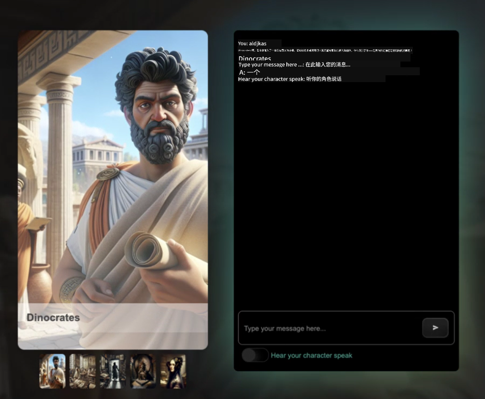

<!--
CO_OP_TRANSLATOR_METADATA:
{
  "original_hash": "caf2ca695e9d259153d24a5cf3e07ef5",
  "translation_date": "2025-10-11T10:49:34+00:00",
  "source_file": "README.md",
  "language_code": "zh"
}
-->
[](https://github.com/microsoft/Web-Dev-For-Beginners/blob/master/LICENSE)
[](https://GitHub.com/microsoft/Web-Dev-For-Beginners/graphs/contributors/)
[](https://GitHub.com/microsoft/Web-Dev-For-Beginners/issues/)
[](https://GitHub.com/microsoft/Web-Dev-For-Beginners/pulls/)
[](http://makeapullrequest.com)

[](https://GitHub.com/microsoft/Web-Dev-For-Beginners/watchers/)
[](https://GitHub.com/microsoft/Web-Dev-For-Beginners/network/)
[](https://GitHub.com/microsoft/Web-Dev-For-Beginners/stargazers/)

[](https://discord.gg/zxKYvhSnVp?WT.mc_id=academic-000002-leestott)

# 初学者的网页开发课程 - 一套完整的课程

通过微软云倡导者提供的12周综合课程，学习网页开发的基础知识。课程包含24节课，涵盖JavaScript、CSS和HTML，通过实践项目如生态瓶、浏览器扩展和太空游戏进行学习。参与测验、讨论和实践任务，提升技能并优化知识保留效果。今天就开始你的编程之旅吧！

加入Azure AI Foundry Discord社区

[](https://discord.com/invite/ByRwuEEgH4)

按照以下步骤开始使用这些资源：
1. **Fork仓库**：点击 [](https://GitHub.com/microsoft/Web-Dev-For-Beginners/fork)
2. **克隆仓库**：   `git clone https://github.com/microsoft/Web-Dev-For-Beginners.git`
3. [**加入Azure AI Foundry Discord，与专家和其他开发者交流**](https://discord.com/invite/ByRwuEEgH4)

### 🌐 多语言支持

#### 通过GitHub Action支持（自动化且始终保持最新）

<!-- CO-OP TRANSLATOR LANGUAGES TABLE START -->
[阿拉伯语](../ar/README.md) | [孟加拉语](../bn/README.md) | [保加利亚语](../bg/README.md) | [缅甸语](../my/README.md) | [中文（简体）](./README.md) | [中文（繁体，香港）](../hk/README.md) | [中文（繁体，澳门）](../mo/README.md) | [中文（繁体，台湾）](../tw/README.md) | [克罗地亚语](../hr/README.md) | [捷克语](../cs/README.md) | [丹麦语](../da/README.md) | [荷兰语](../nl/README.md) | [爱沙尼亚语](../et/README.md) | [芬兰语](../fi/README.md) | [法语](../fr/README.md) | [德语](../de/README.md) | [希腊语](../el/README.md) | [希伯来语](../he/README.md) | [印地语](../hi/README.md) | [匈牙利语](../hu/README.md) | [印尼语](../id/README.md) | [意大利语](../it/README.md) | [日语](../ja/README.md) | [韩语](../ko/README.md) | [立陶宛语](../lt/README.md) | [马来语](../ms/README.md) | [马拉地语](../mr/README.md) | [尼泊尔语](../ne/README.md) | [挪威语](../no/README.md) | [波斯语](../fa/README.md) | [波兰语](../pl/README.md) | [葡萄牙语（巴西）](../br/README.md) | [葡萄牙语（葡萄牙）](../pt/README.md) | [旁遮普语](../pa/README.md) | [罗马尼亚语](../ro/README.md) | [俄语](../ru/README.md) | [塞尔维亚语（西里尔字母）](../sr/README.md) | [斯洛伐克语](../sk/README.md) | [斯洛文尼亚语](../sl/README.md) | [西班牙语](../es/README.md) | [斯瓦希里语](../sw/README.md) | [瑞典语](../sv/README.md) | [他加禄语](../tl/README.md) | [泰米尔语](../ta/README.md) | [泰语](../th/README.md) | [土耳其语](../tr/README.md) | [乌克兰语](../uk/README.md) | [乌尔都语](../ur/README.md) | [越南语](../vi/README.md)
<!-- CO-OP TRANSLATOR LANGUAGES TABLE END -->

**如果希望支持更多语言，支持的语言列表请点击[这里](https://github.com/Azure/co-op-translator/blob/main/getting_started/supported-languages.md)**

[](https://open.vscode.dev/microsoft/Web-Dev-For-Beginners)

#### 🧑‍🎓 _你是学生吗？_

访问 [**学生中心页面**](https://docs.microsoft.com/learn/student-hub/?WT.mc_id=academic-77807-sagibbon)，这里有初学者资源、学生礼包，甚至可以获得免费证书兑换券。这个页面值得收藏，并定期查看，因为我们每月都会更新内容。

### 📣 公告 - _使用生成式AI构建新项目_

刚刚添加了新的AI助手项目，快来看看 [项目](./09-chat-project/README.md)

### 📣 公告 - _新课程_ 关于JavaScript的生成式AI课程已发布

不要错过我们的新生成式AI课程！

访问 [https://aka.ms/genai-js-course](https://aka.ms/genai-js-course) 开始学习！


- 课程内容涵盖从基础到RAG的所有内容。
- 使用生成式AI和我们的配套应用与历史人物互动。
- 有趣且引人入胜的叙事，你将进行时间旅行！



每节课都包括一个任务、知识检查和挑战，帮助你学习以下主题：
- 提示和提示工程
- 文本和图像应用生成
- 搜索应用

访问 [https://aka.ms/genai-js-course](https://aka.ms/genai-js-course) 开始学习！

## 🌱 开始学习

> **教师们**，我们[提供了一些建议](for-teachers.md)供您使用这套课程。欢迎在我们的[讨论论坛](https://github.com/microsoft/Web-Dev-For-Beginners/discussions/categories/teacher-corner)中提供反馈！

**[学习者](https://aka.ms/student-page/?WT.mc_id=academic-77807-sagibbon)**，每节课从课前测验开始，阅读课程材料，完成各种活动，并通过课后测验检查你的理解。

为了提升学习体验，与同伴一起完成项目！我们鼓励在[讨论论坛](https://github.com/microsoft/Web-Dev-For-Beginners/discussions)中进行讨论，我们的版主团队会回答你的问题。

为了进一步学习，我们强烈推荐探索 [Microsoft Learn](https://learn.microsoft.com/users/wirelesslife/collections/p1ddcy5jwy0jkm?WT.mc_id=academic-77807-sagibbon) 以获取更多学习材料。

### 📋 设置你的开发环境

这套课程已经准备好了开发环境！你可以选择在 [Codespace](https://github.com/features/codespaces/)（基于浏览器，无需安装的环境）中运行课程，或者在本地电脑上使用文本编辑器如 [Visual Studio Code](https://code.visualstudio.com/?WT.mc_id=academic-77807-sagibbon)。

#### 创建你的仓库
为了方便保存你的学习成果，建议你创建自己的仓库副本。点击页面顶部的 **Use this template** 按钮即可。这将在你的GitHub账户中创建一个包含课程副本的新仓库。

按照以下步骤操作：
1. **Fork仓库**：点击页面右上角的 "Fork" 按钮。
2. **克隆仓库**：   `git clone https://github.com/microsoft/Web-Dev-For-Beginners.git`

#### 在Codespace中运行课程

在你创建的仓库副本中，点击 **Code** 按钮并选择 **Open with Codespaces**。这将为你创建一个新的Codespace以供使用。


#### 在本地电脑上运行课程

要在本地电脑上运行课程，你需要一个文本编辑器、浏览器和命令行工具。我们的第一节课 [编程语言和工具介绍](../../1-getting-started-lessons/1-intro-to-programming-languages) 将指导你选择适合自己的工具。

我们推荐使用 [Visual Studio Code](https://code.visualstudio.com/?WT.mc_id=academic-77807-sagibbon) 作为编辑器，它还内置了 [终端](https://code.visualstudio.com/docs/terminal/basics/?WT.mc_id=academic-77807-sagibbon)。你可以在[这里](https://code.visualstudio.com/?WT.mc_id=academic-77807-sagibbon)下载Visual Studio Code。

1. 将你的仓库克隆到电脑上。点击 **Code** 按钮并复制URL：

    [CodeSpace](./images/createcodespace.png)

    然后，在 [Visual Studio Code](https://code.visualstudio.com/?WT.mc_id=academic-77807-sagibbon) 的 [终端](https://code.visualstudio.com/docs/terminal/basics/?WT.mc_id=academic-77807-sagibbon) 中运行以下命令，将 `<your-repository-url>` 替换为你刚刚复制的URL：

    ```bash 
    git clone <your-repository-url>
    ```

2. 在Visual Studio Code中打开文件夹。点击 **File** > **Open Folder**，选择你刚刚克隆的文件夹。

> 推荐的Visual Studio Code扩展：
>
> * [Live Server](https://marketplace.visualstudio.com/items?itemName=ritwickdey.LiveServer&WT.mc_id=academic-77807-sagibbon) - 在Visual Studio Code中预览HTML页面
> * [Copilot](https://marketplace.visualstudio.com/items?itemName=GitHub.copilot&WT.mc_id=academic-77807-sagibbon) - 帮助你更快地编写代码

## 📂 每节课包括：

- 可选的手绘笔记
- 可选的补充视频
- 课前热身测验
- 书面课程  
- 针对项目型课程，提供逐步指导如何构建项目  
- 知识检查  
- 挑战任务  
- 补充阅读  
- 作业  
- [课后测验](https://ff-quizzes.netlify.app/web/)  

> **关于测验的说明**：所有测验都包含在 Quiz-app 文件夹中，共有 48 个测验，每个测验包含三个问题。测验可在 [此处](https://ff-quizzes.netlify.app/web/) 获取。测验应用可以在本地运行或部署到 Azure，请按照 `quiz-app` 文件夹中的说明操作。

## 🗃️ 课程

|     |                       项目名称                       |                            教授的概念                             | 学习目标                                                                                                                 |                                                         课程链接                                                          |         作者          |
| :-: | :--------------------------------------------------: | :----------------------------------------------------------------: | ----------------------------------------------------------------------------------------------------------------------- | :----------------------------------------------------------------------------------------------------------------------: | :-------------------: |
| 01  |                     入门课程                      |           编程简介及开发工具           | 学习大多数编程语言的基本原理以及帮助专业开发者完成工作的相关软件 | [编程语言简介及开发工具](./1-getting-started-lessons/1-intro-to-programming-languages/README.md) |         Jasmine         |
| 02  |                     入门课程                      |             GitHub 基础知识，包括团队协作             | 学习如何在项目中使用 GitHub，以及如何与他人协作开发代码库                                                    |                            [GitHub 简介](./1-getting-started-lessons/2-github-basics/README.md)                             |          Floor          |
| 03  |                     入门课程                      |                             无障碍访问                              | 学习网页无障碍访问的基础知识                                                                                               |                       [无障碍访问基础](./1-getting-started-lessons/3-accessibility/README.md)                       |       Christopher       |
| 04  |                        JS 基础                         |                         JavaScript 数据类型                          | JavaScript 数据类型的基础知识                                                                                                 |                                       [数据类型](./2-js-basics/1-data-types/README.md)                                        |         Jasmine         |
| 05  |                        JS 基础                         |                         函数和方法                          | 学习如何使用函数和方法来管理应用程序的逻辑流                                                             |                              [函数和方法](./2-js-basics/2-functions-methods/README.md)                               | Jasmine 和 Christopher |
| 06  |                        JS 基础                         |                        使用 JS 做决策                        | 学习如何使用决策方法在代码中创建条件                                                           |                                 [做决策](./2-js-basics/3-making-decisions/README.md)                                  |         Jasmine         |
| 07  |                        JS 基础                         |                            数组和循环                            | 使用 JavaScript 中的数组和循环处理数据                                                                                 |                                   [数组和循环](./2-js-basics/4-arrays-loops/README.md)                                    |         Jasmine         |
| 08  |       [生态瓶](./3-terrarium/solution/README.md)       |                            HTML 实践                            | 构建 HTML 创建在线生态瓶，重点是布局构建                                                         |                                 [HTML 简介](./3-terrarium/1-intro-to-html/README.md)                                 |           Jen           |
| 09  |       [生态瓶](./3-terrarium/solution/README.md)       |                            CSS 实践                             | 构建 CSS 样式化在线生态瓶，重点是 CSS 基础知识，包括使页面响应式                     |                                  [CSS 简介](./3-terrarium/2-intro-to-css/README.md)                                  |           Jen           |
| 10  |            [生态瓶](./3-terrarium/solution/README.md)            |                 JavaScript 闭包和 DOM 操作                  | 构建 JavaScript 使生态瓶具备拖放界面功能，重点是闭包和 DOM 操作             |                  [JavaScript 闭包和 DOM 操作](./3-terrarium/3-intro-to-DOM-and-closures/README.md)                   |           Jen           |
| 11  |          [打字游戏](./4-typing-game/solution/README.md)          |                          构建打字游戏                           | 学习如何使用键盘事件驱动 JavaScript 应用的逻辑                                                          |                                [事件驱动编程](./4-typing-game/typing-game/README.md)                                |       Christopher       |
| 12  | [绿色浏览器扩展](./5-browser-extension/solution/README.md) |                         浏览器相关知识                          | 学习浏览器的工作原理、历史，以及如何搭建浏览器扩展的初始元素                               |                               [关于浏览器](./5-browser-extension/1-about-browsers/README.md)                                |           Jen           |
| 13  | [绿色浏览器扩展](./5-browser-extension/solution/README.md) | 构建表单、调用 API 并将变量存储在本地存储中 | 构建浏览器扩展的 JavaScript 元素，通过存储在本地存储中的变量调用 API                      |                [API、表单和本地存储](./5-browser-extension/2-forms-browsers-local-storage/README.md)                 |           Jen           |
| 14  | [绿色浏览器扩展](./5-browser-extension/solution/README.md) |          浏览器后台进程和网页性能          | 使用浏览器的后台进程管理扩展图标；学习网页性能及一些优化方法   |             [后台任务和性能](./5-browser-extension/3-background-tasks-and-performance/README.md)              |           Jen           |
| 15  |           [太空游戏](./6-space-game/solution/README.md)           |             更高级的 JavaScript 游戏开发             | 学习使用类和组合进行继承以及发布/订阅模式，为构建游戏做准备              |                      [高级游戏开发简介](./6-space-game/1-introduction/README.md)                       |          Chris          |
| 16  |           [太空游戏](./6-space-game/solution/README.md)           |                           绘制到画布                            | 学习 Canvas API，用于将元素绘制到屏幕                                                                       |                                [绘制到画布](./6-space-game/2-drawing-to-canvas/README.md)                                |          Chris          |
| 17  |           [太空游戏](./6-space-game/solution/README.md)           |                   在屏幕上移动元素                    | 探索如何使用笛卡尔坐标和 Canvas API 使元素获得运动                                            |                           [移动元素](./6-space-game/3-moving-elements-around/README.md)                           |          Chris          |
| 18  |           [太空游戏](./6-space-game/solution/README.md)           |                          碰撞检测                           | 使元素碰撞并对彼此做出反应，使用按键提供冷却功能以确保游戏性能    |                              [碰撞检测](./6-space-game/4-collision-detection/README.md)                              |          Chris          |
| 19  |           [太空游戏](./6-space-game/solution/README.md)           |                             计分                              | 根据游戏状态和表现进行数学计算                                                                |                                    [计分](./6-space-game/5-keeping-score/README.md)                                    |          Chris          |
| 20  |           [太空游戏](./6-space-game/solution/README.md)           |                     结束和重新开始游戏                     | 学习如何结束和重新开始游戏，包括清理资源和重置变量值                              |                                [结束条件](./6-space-game/6-end-condition/README.md)                                 |          Chris          |
| 21  |         [银行应用](./7-bank-project/solution/README.md)          |                 HTML 模板和网页应用中的路由                 | 学习如何使用路由和 HTML 模板创建多页面网站的架构                             |                            [HTML 模板和路由](./7-bank-project/1-template-route/README.md)                             |          Yohan          |
| 22  |         [银行应用](./7-bank-project/solution/README.md)          |                  构建登录和注册表单                   | 学习如何构建表单并处理验证逻辑                                                                          |                                           [表单](./7-bank-project/2-forms/README.md)                                           |          Yohan          |
| 23  |         [银行应用](./7-bank-project/solution/README.md)          |                   数据获取和使用方法                   | 学习数据如何在应用中流动，如何获取、存储和处理数据                                                 |                                            [数据](./7-bank-project/3-data/README.md)                                            |          Yohan          |
| 24  |         [银行应用](./7-bank-project/solution/README.md)          |                      状态管理概念                      | 学习应用如何保持状态以及如何通过编程管理状态                                                              |                                [状态管理](./7-bank-project/4-state-management/README.md)                                |          Yohan          |
| 25 | [浏览器/VS Code 编辑器](../../8-code-editor) | 使用 VS Code | 学习如何使用代码编辑器 | [使用 VS Code 编辑器](./8-code-editor/1-using-a-code-editor/README.md) | Chris |
| 26 | [AI 助手](./9-chat-project/README.md) | 使用 AI | 学习如何构建自己的 AI 助手 | [AI 助手项目](./9-chat-project/README.md) | Chris |

## 🏫 教学法

我们的课程设计基于两个关键教学原则：  
* 项目式学习  
* 频繁测验  

该课程教授 JavaScript、HTML 和 CSS 的基础知识，以及当今网页开发者使用的最新工具和技术。学生将通过构建打字游戏、虚拟生态瓶、环保浏览器扩展、太空入侵者风格游戏以及企业银行应用，获得实践经验。课程结束时，学生将对网页开发有一个扎实的理解。

> 🎓 您可以在 Microsoft Learn 上以 [学习路径](https://docs.microsoft.com/learn/paths/web-development-101/?WT.mc_id=academic-77807-sagibbon) 的形式学习本课程的前几节课！

通过确保内容与项目相结合，学习过程变得更加有趣，学生对概念的记忆也会得到增强。我们还编写了几节 JavaScript 基础课程来介绍概念，并配有 "[JavaScript 初学者系列](https://channel9.msdn.com/Series/Beginners-Series-to-JavaScript/?WT.mc_id=academic-77807-sagibbon)" 视频教程中的视频，其中一些作者也参与了本课程的编写。

此外，课前的低压力测验可以让学生专注于学习主题，而课后的第二次测验可以进一步巩固记忆。本课程设计灵活有趣，可以完整学习，也可以部分学习。项目从小开始，到 12 周周期结束时逐渐变得复杂。

虽然我们有意避免引入 JavaScript 框架，以专注于成为网页开发者所需的基本技能，但完成本课程后的一个良好下一步是通过另一系列视频学习 Node.js："[Node.js 初学者系列](https://channel9.msdn.com/Series/Beginners-Series-to-Nodejs/?WT.mc_id=academic-77807-sagibbon)"。

> 请访问我们的 [行为准则](CODE_OF_CONDUCT.md) 和 [贡献指南](CONTRIBUTING.md)。我们欢迎您的建设性反馈！

## 🧭 离线访问

您可以使用 [Docsify](https://docsify.js.org/#/) 离线运行此文档。Fork 此仓库，在本地机器上 [安装 Docsify](https://docsify.js.org/#/quickstart)，然后在此仓库的根文件夹中输入 `docsify serve`。网站将在本地的 3000 端口上运行：`localhost:3000`。

## 📘 PDF

所有课程的 PDF 可在 [此处](https://microsoft.github.io/Web-Dev-For-Beginners/pdf/readme.pdf) 找到。

## 🎒 其他课程

我们的团队还制作了其他课程！请查看：  

- [MCP 初学者课程](https://aka.ms/mcp-for-beginners)  
- [边缘 AI 初学者课程](https://aka.ms/edgeai-for-beginners)  
- [AI 代理初学者课程](https://aka.ms/ai-agents-beginners)  
- [生成式 AI 初学者课程 .NET](https://github.com/microsoft/Generative-AI-for-beginners-dotnet)  
- [使用 JavaScript 的生成式 AI](https://github.com/microsoft/generative-ai-with-javascript)  
- [使用 Java 的生成式 AI](https://github.com/microsoft/Generative-AI-for-beginners-java)  
- [AI 初学者课程](https://aka.ms/ai-beginners)  
- [数据科学初学者课程](https://aka.ms/datascience-beginners)  
- [机器学习初学者课程](https://aka.ms/ml-beginners)  
- [网络安全初学者课程](https://github.com/microsoft/Security-101)  
- [网页开发初学者课程](https://aka.ms/webdev-beginners)  
- [物联网初学者课程](https://aka.ms/iot-beginners)  
- [初学者的XR开发](https://github.com/microsoft/xr-development-for-beginners)
- [掌握GitHub Copilot的智能使用](https://github.com/microsoft/Mastering-GitHub-Copilot-for-Paired-Programming)
- [为C#/.NET开发者掌握GitHub Copilot](https://github.com/microsoft/mastering-github-copilot-for-dotnet-csharp-developers)
- [选择你的Copilot冒险之旅](https://github.com/microsoft/CopilotAdventures)

## 获取帮助

如果在构建AI应用时遇到困难或有任何问题，请加入：

[](https://aka.ms/foundry/discord)

如果您有产品反馈或在构建过程中遇到错误，请访问：

[](https://aka.ms/foundry/forum)

## 许可证

此存储库遵循MIT许可证。有关更多信息，请参阅[LICENSE](../../LICENSE)文件。

---

**免责声明**：  
本文档使用AI翻译服务 [Co-op Translator](https://github.com/Azure/co-op-translator) 进行翻译。尽管我们努力确保翻译的准确性，但请注意，自动翻译可能包含错误或不准确之处。原始语言的文档应被视为权威来源。对于关键信息，建议使用专业人工翻译。我们不对因使用此翻译而产生的任何误解或误读承担责任。