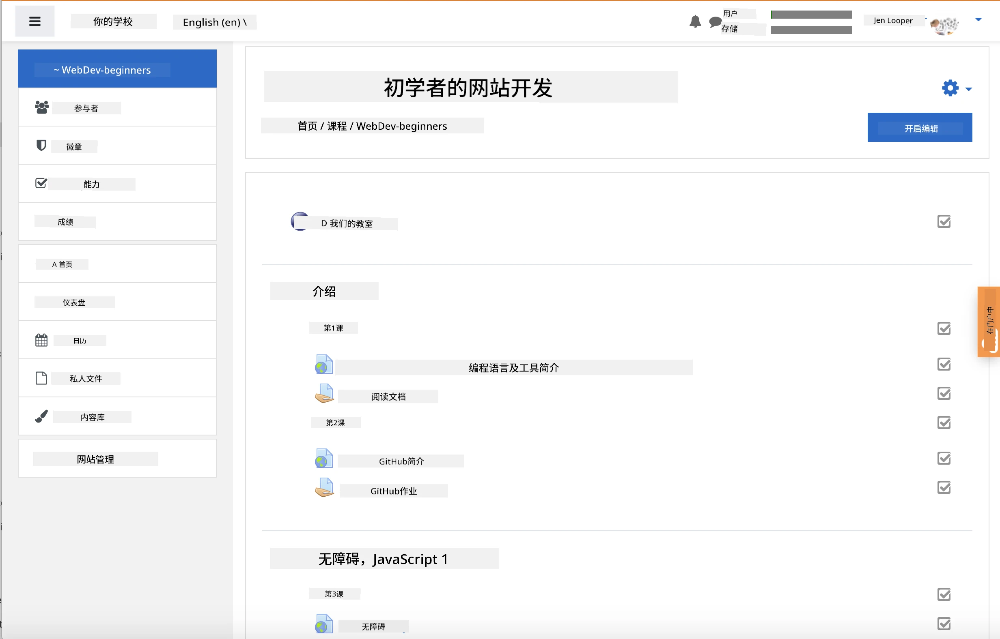
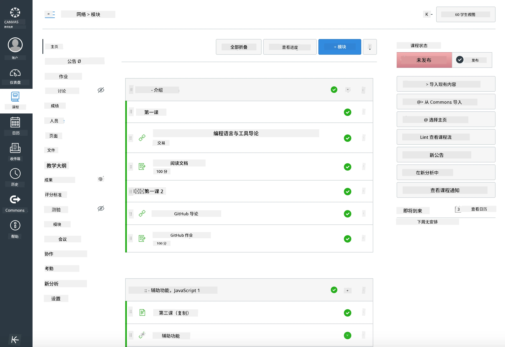

<!--
CO_OP_TRANSLATOR_METADATA:
{
  "original_hash": "71009af209f81cc01a1f2d324200375f",
  "translation_date": "2025-10-03T08:46:37+00:00",
  "source_file": "for-teachers.md",
  "language_code": "zh"
}
-->
### 面向教育工作者

欢迎您在课堂上使用本课程内容。它可以与 GitHub Classroom 和主流 LMS 平台无缝结合使用，也可以作为独立的代码库供学生使用。

### 配合 GitHub Classroom 使用

为了按班级管理课程和作业，请为每节课创建一个独立的代码库，以便 GitHub Classroom 可以单独关联每个作业。

- 将此代码库 Fork 到您的组织。
- 为每节课创建一个独立的代码库，将每节课的文件夹提取到各自的代码库中。
  - 选项 A：为每节课创建空代码库，并将课程文件夹内容复制到各自代码库中。
  - 选项 B：如果需要保留历史记录，可以使用保留 Git 历史记录的方法（例如，将文件夹拆分为新代码库）。
- 在 GitHub Classroom 中，为每节课创建一个作业，并指向相应的课程代码库。
- 推荐设置：
  - 代码库可见性：设置为私有，以保护学生的作业。
  - 使用课程代码库默认分支中的起始代码。
  - 为测验和提交添加 Issue 和 Pull Request 模板。
  - 如果课程中包含自动评分和测试，可以选择配置这些功能。
- 有助于管理的约定：
  - 代码库命名，例如 lesson-01-intro、lesson-02-html 等。
  - 标签：quiz、assignment、needs-review、late、resubmission。
  - 按班级设置标签/版本（例如 v2025-term1）。

提示：避免将代码库存储在同步文件夹（例如 OneDrive/Google Drive）中，以防止在 Windows 上出现 Git 冲突。

### 配合 Moodle、Canvas 或 Blackboard 使用

本课程内容包含可导入的包，适用于常见的 LMS 工作流程。

- Moodle：使用 Moodle 上传文件 [Moodle upload file](../../../../../../../teaching-files/webdev-moodle.mbz) 加载完整课程。
- Common Cartridge：使用 Common Cartridge 文件 [Common Cartridge file](../../../../../../../teaching-files/webdev-common-cartridge.imscc) 提供更广泛的 LMS 兼容性。
- 注意事项：
  - Moodle Cloud 对 Common Cartridge 的支持有限。建议优先使用上述 Moodle 文件，该文件也可以上传到 Canvas。
  - 导入后，请根据学期安排检查模块、截止日期和测验设置。

> Moodle 教室中的课程内容

> Canvas 教室中的课程内容

### 直接使用代码库（不使用 Classroom）

如果您不想使用 GitHub Classroom，可以直接从此代码库运行课程。

- 同步/在线形式（Zoom/Teams）：
  - 进行简短的导师引导热身活动；使用分组讨论室进行测验。
  - 宣布测验的时间窗口；学生通过 GitHub Issues 提交答案。
  - 对于协作作业，学生在公共课程代码库中工作并提交 Pull Request。
- 私密/异步形式：
  - 学生将每节课 Fork 到自己的 **私有** 代码库，并将您添加为协作者。
  - 他们通过 Issues（测验）和 Pull Requests（作业）提交到您的课堂代码库或他们的私有 Fork。

### 最佳实践

- 提供关于 Git/GitHub 基础知识、Issues 和 PR 的入门课程。
- 在 Issues 中使用清单来管理多步骤测验/作业。
- 添加 CONTRIBUTING.md 和 CODE_OF_CONDUCT.md 以设定课堂规范。
- 添加无障碍说明（例如替代文本、字幕），并提供可打印的 PDF。
- 按学期对内容进行版本管理，并在发布后冻结课程代码库。

### 反馈与支持

我们希望这套课程内容能够满足您和学生的需求。如果发现问题、有请求或改进建议，请在此代码库中创建一个新的 Issue，或者在教师交流区发起讨论。

---

**免责声明**：  
本文档使用AI翻译服务 [Co-op Translator](https://github.com/Azure/co-op-translator) 进行翻译。尽管我们努力确保翻译的准确性，但请注意，自动翻译可能包含错误或不准确之处。原始语言的文档应被视为权威来源。对于关键信息，建议使用专业人工翻译。我们不对因使用此翻译而产生的任何误解或误读承担责任。